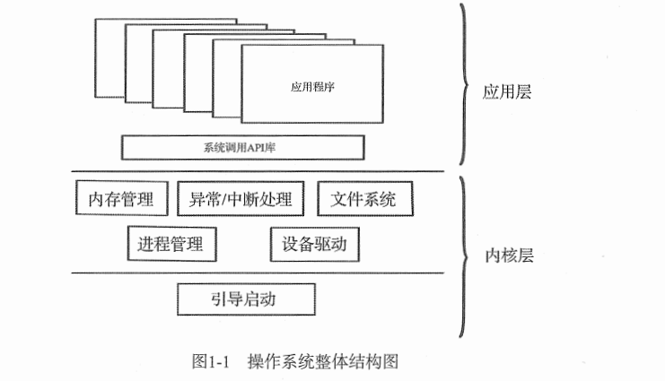
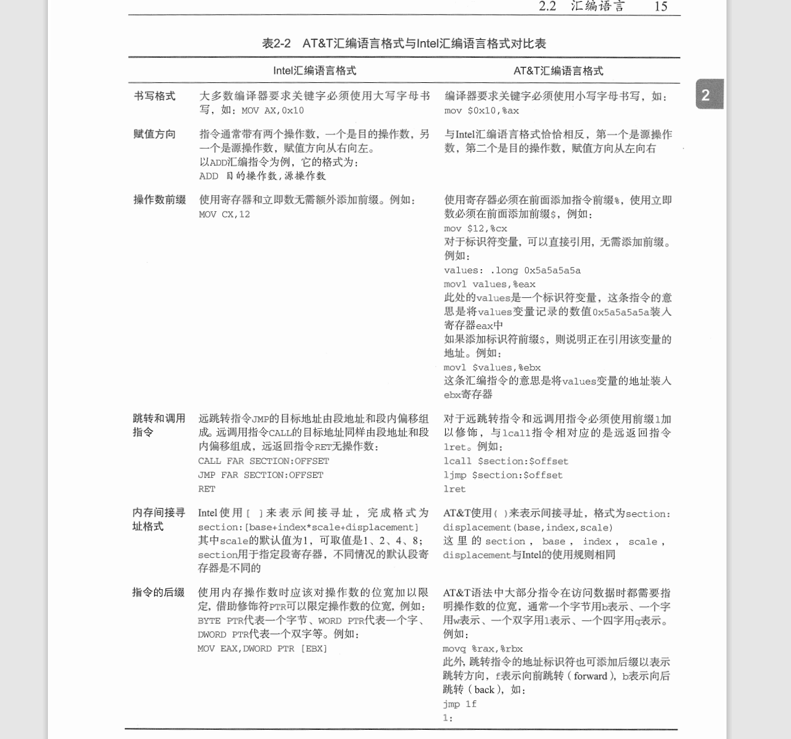
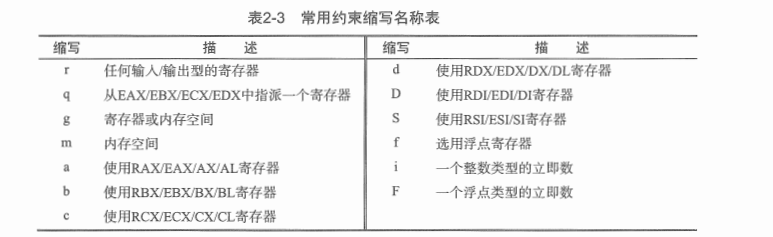
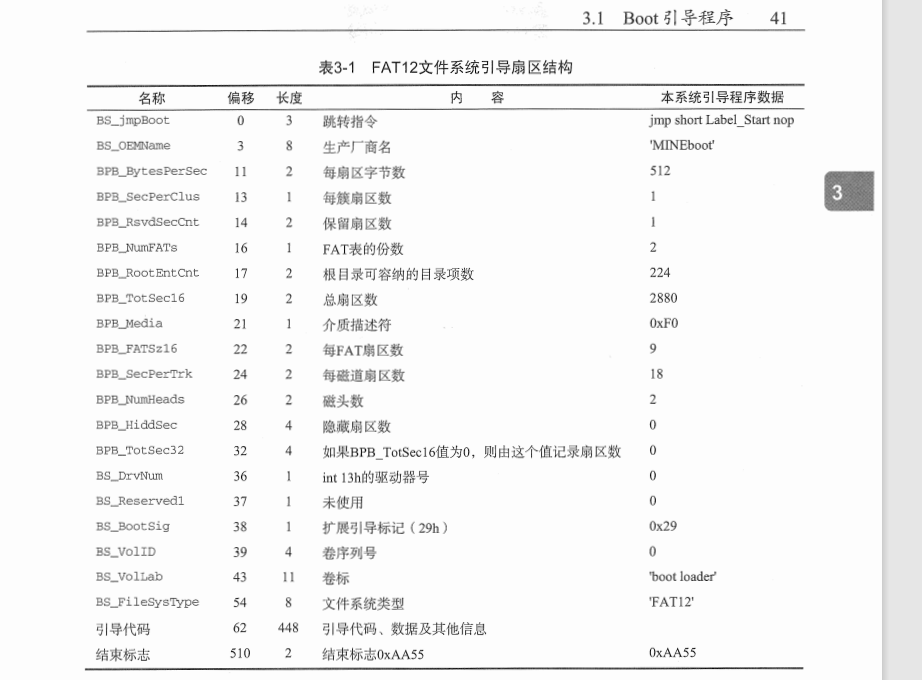
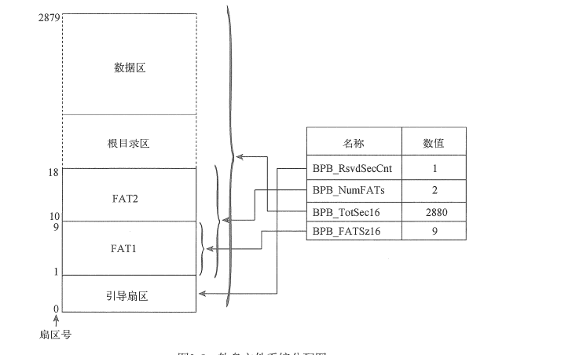
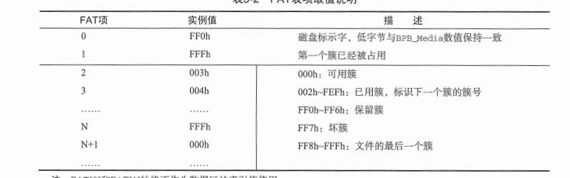
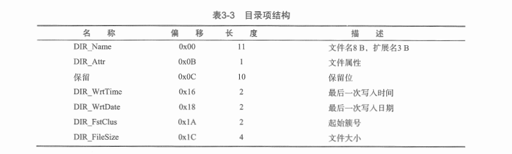

# 大体介绍

包含章节 
- [1.操作系统概述](#c1)
- [2.环境搭建以及基础知识](#c2)
    - [2.1 c与汇编](#c2-1)
        - [汇编调用c约定](#c2-1-1)
        - [c内嵌汇编](#c2-1-2)
- [3.BootLoader引导启动程序](#c3)
    - [3.1 Boot引导程序](#c3-1)
        - [FAT12文件系统](#c3-2)




<div id=c1><h2>组成结构</h2></div>

- 引导启动:BIOS上电自检到跳转到内核程序执行之前这一段  主要检测计算机硬件以及配置内核运行参数。曾经分为两个部分 Boot和Loader 现在通常合二为一 统称为BootLoader(Grub 和 Uboot)(之前是因为大小限制(512字节 一个软盘扇区) boot加载loader loader再加载os，自检等任务实际是loader做的)
- 内存管理:这个可以参看blog-os中的一部分。tip 红黑树
- 异常/中断处理:也可以参考blogos.注意的是这里通常分为中断上半部和中断下半部。参考异步键盘程序。保证中断尽可能短。下半部甚至可以将处理内容放在一个单独的进程中。当然这个进程的优先级需要更高。
- 进程管理: 主要是进程调度和进程间通信(SIGNAL信号 管道 共享内存  信号量等)
- 设备驱动:设备和内核的交互  为了实现即插即用 将驱动程序从内核中移出 使用时动态挂载到内核空间
- 文件系统: 所有扇区的管理 包括内存块。组成一个RAMDisk（内存式硬盘或者说虚拟内存盘）将一部分内存模拟成内存使用。  这只是一个模块功能 并不是文件系统本身。比如sys文件系统 FAT类文件系统  EXT类文件系统。
- 系统调用API库: 主要是提供给应用程序使用的接口
- 应用程序: 自己安装或者系统自带的工具 软件和服务。

该项目 主要分为三个部分：
- 引导启动:使用NASM汇编语言编写  实现u盘引导启动 文件系统识别 系统内核加载 内存容量检测  显示模式检测和设置  处理器运行模式切换  页表配置等功能。
- 内核层:  参看linux内核编写一个内核雏形。遵循POSIX(可移植操作系统接口 Portable Operating System Interface of UNIX，缩写为 POSIX)规范  提供系统调用API
- 应用层: 实现Shell命令解析器和一些基础命令。


<div id=c2><h2>环境搭建以及基础知识</h2></div>


虚拟机安装 主要是 平台构建 这里我使用vscode 就用它的wsl功能了。

### 语言选择

Intel汇编以及AT&T汇编语言格式对比<br><br>
<br/>
<div id = "c2-1"><h3>汇编语言与C语言函数</h3></div>
参见 example/objtest_asm_part.asm
<div id = "c2-1-1"><h4>汇编语言调用C语言函数</h4></div>
其中函数的调用约定有几种常见的:

- stdcall
    - 调用函数的时候 参数右向左入栈 比如下面的function函数 入栈顺序是second,first:`int function(int first,int second)`
    - 函数的栈平衡操作（参数出栈）由被调用函数完成。 比如function函数会有类似`retn x`的指令 值得就是弹栈x个字节。
    - 会在函数名前下划线，结尾@修饰并且加上栈的字节数。同理 function函数类似`_function@8`
- cdecl
    - 参数压栈顺序同上(右向左)
    - 栈平衡操作由调用函数完成，类似`leave,pop`等指令完成
    - 因为每个函数调用者都有栈平衡代码 所以可执行文件大于stdcall。他是GNU C编译器的默认调用约定。但是GNU C在64位系统下 使用寄存器传递参数。左向右的六个整型参数放入RDI，RSI，RDX，RCX，R9和R9中。XMM0-XMM7用来保存浮点变量。RAX保存函数返回值。
- fastcall
    - 一般尽可能使用ECX和EDX传递参数。通常是前两个int类型的参数或者较小的参数。其他的也是右向左入栈。
  

寄存器传递参数和内存(栈传递)的比较（**基于x86**）

- 寄存器:有点自然是速度快。但是只能少数约定使用寄存器传递参数。基于x86的linux 系统api一般使用寄存器传递。因为应用层空间和内核空间是隔离的 。所以如果需要从应用层转递到内核层 最好使用寄存器传递。不然会比较麻烦（因为隔离的原因）
- 内存传递方式:大多数就是使用这种。 比如x86下 对于中断/异常处理  存在汇编跳转到c函数。c一般使用栈传递参数 所以这里汇编最好也是使用栈传递。
  

<div id = "c2-1-2"><h4>C语言函数内嵌汇编语言</h4></div>

`GNU C`使用关键字 `asm`声明代码是内嵌的汇编语句:

```C
// volatile 禁止编译器优化
#define nop() __asm__ __volatile__("nop    \n\t")
```

- `__asm__`关键字：他是关键字asm的宏定义(`#define __asm__ asm`)。也就说也可以使用asm关键字。为了兼容ANSI C标准 建议使用`__asm__`
- `__volatile__`:告诉编译器不要优化。


##### 内嵌方式:分为三个部分说明

- 内嵌汇编表达式：因为c本身也会被解释称汇编语言。或者说本身也是执行在计算机体系中。那么内嵌汇编会比单独使用任何一个都更复杂。需要考虑确定寄存器的工作情况，与c语言融合情况等。GNU C中一般由四部分组成 中间用`:`分割：<br>`指令部分:输出部分:输入部分:损坏部分`<br>这几个部分来说明上面的一些需要考虑的点。

- 指令部分:汇编代码本身。和AT&T汇编基本一致。属于必填项。多条汇编代码可以全部书写在一对双引号中，指令间使用分号或者换行符`\n`分割。通常也会带上`\t`。如果使用寄存器需要再添加一个`%`,表示引用寄存器。配合AT&T那就是两个`%`。比如:`"movl $0x10 %%eax"`。
- 输出部分:紧接指令后面，记录指令部分的输出信息，格式:`"输出操作约束"(输出表达式),"输出操作约束"(输出表达式),...`约束和表达式成对出现。
    - 表达式部分负责保存指令的执行结果。通常是一个变量
    - 约束部分必须使用`=`或者`+`修饰。`=`表示是一个纯粹的输出操作只读。`+`代表表达式既是输出部分又是输入操作或者说修改为可读可写权限。但是`=`和`+`只能出现在输出部分。
- 输入部分:格式:`"输入操作约束"(输入表达式),"输入操作约束"(输入表达式),...`只能是只读的。
- 损坏部分:描述指令执行过程中被修改过的寄存器，内存空间或者标志位寄存器。并且修改部分没有再输出部分或者输入部分出现过。格式:`"损坏描述","损坏描述",...`
    - 寄存器修改通知:example:<br>`__asm__ __volatile__ ("movl %0, %%ecx"::"a"(__tmp):"cx")`;<br>这里使用输入部分`__tmp`修改了ecx的值。但是没有再输入输出部分说明(输出部分省略，输入部分没有说明。那么就在损坏部分说明)。这里说明下这段代码。首先 代码指令本身没啥问题，`%0`代表引用c语言变量的操作数占位符，也就是第一个`()`里指定的。然后`""`是对操作数的约束。这里是`a`。表示`rax`也就是将`__tmp`放入`rax`在使用作为输入复制到ecx。淡然这里movl说明是mov双字也即是32位 自然是ecx。**损坏部分声明的寄存器不能作为输入输出**（部分限制符参见下图）
    - 内存修改通知:内存发生的改变的地方未使用`"m"`约束 那么就需要损坏说明。使用`memory`说明。如果声明了 那么内嵌代码执行完毕后，编译器会保证重新向寄存器加载引用过的内存空间，而非他的副本，保证内存和寄存器中的值一致。
    - 标志寄存器修改通知:`cc`说明影响了R|EFLAGES寄存器
  

##### 操作约束和修饰符

操作约束类型分为 寄存器约束  内存约束和立即数约束。输出表达式中还有限定寄存器操作的修饰符(=,+,&)
- 寄存器约束限定表达式的载体是一个寄存器。可以明确指派也可以模糊指派。可以使用寄存器全名(eax)也可以缩写(a).比如:<br>`__asm__ __volatile__ ("movl %0, %%cr0"::"eax"(cr0))`和`__asm__ __volatile__ ("movl %0, %%cr0"::"a"(cr0))`.当然缩写编译器会根据这里的movl选择使用`eax`而不是`rax`<br>部分约束符如下图:<br><br>
- 内存约束限定了表达式载体是一个内存空间。`m`是约束名。ex:`__asm__ __volatile__ ("sgdt %0":"=m"(__gdt_addr::)`
- 立即数约束只能用于输入部分。表示表达式的载体是一个数值。ex:`__asm__ __volatile__ ("movl %0,%%ebx"::"i"(50)`
- 修饰符:其中说下`&`他只能出现在输出约束部分的第二个字符位置 也就是`+/=`后面，告诉编译器不得为任何输入操作表达式分配该寄存器。(一般是驶入部分使用了模糊约束`r q g等约束缩写` 然后输出部分再使用`&`指定某些寄存器就不要在自动分配的时候使用了)

##### 序号占位符

就是上面看到的`%0`~`%9`这十个。对应第一个到第十个操作约束后的表达式。编译器会自动替换。这里一般总被视为long型(4字节)。 指令部分当把操作数当作字或者字节使用时，默认为低字或者低字节。对字节操作可以显式的指明是低字节还是次字节。方法是在%和序号之间插入一个字母，"b"代表低字节，"h"代表高字节，例如：%h1。.当然具体还是看操作指令 比如 movl那就没必要了。本身就是4字节全要


<div id=c3><h2>BootLoader引导启动程序</h2></div>

<div id=c3-1><h3>Boot引导程序</h3></div>

#### BIOS引导原理

BIOS自检  上电自检这个过程会检测硬件设备时候存在问题。没有问题就会根据启动配置选择引导设备 就是我们一般在BIOS中设置的启动优先级，比如硬盘 u盘 软盘，网络启动等。通常是硬盘作为默认。这里确定了启动设备后 就会去寻找设备的0磁头 0磁道的1扇区(扇区是1开始的 其他是0开始  默认大小 512字节。磁道是外围0开始向内，也就是盘面的最外圈。一般硬盘是多个盘片组成的。一个盘片有正反两个盘面) 查看是否是数值 `0x55`和`0xaa`两字节作为结尾。是的话就认为他是一个Boot Sector 引导扇区 将该扇区的数据复制到内存`0x7c00`处。然后将cs ip(cs  0x0000  ip 0x7c00)指向此处 开始执行。因为512字节(除去结尾的两个标识字节 实际是510B)太小了  硬件信息检测程序都放不下 所以boot一般是为了装载loader.问题是Loader不断演进 代码量是不断变化的，或者说占用的扇区数量也是会变化的，如果boot中代码一直按照固定磁头号 磁道号 扇区号和所占扇区个数来装载loader那么每次重新编译或者更改存储介质都需要重新计算这几个参数。所以这本书会在一开始实现一个软盘的文件系统来避免上述的问题。 下面就是对于如何实现一个Boot程序的讲解。

##### 写一个Boot引导程序

(这里是Intel汇编)

见chapter/ch3/boot.asm

<div id="c3-2"><h5>FAT12文件系统</h5></div>

这里会将软盘分为4个部分：引导扇区 FAT表 根目录区和数据区:

- **引导扇区**: 除了引导程序 还有FAT12文件系统的组成结构信息。结构信息如图:<br><br>。其中几个说明，BS_jmpBoot 长度为三字节 其中jmp short Label_Start 是两个字节的机器码 nop也是一个 所以3.因为BS_jmpBoot后面不是引导程序 所以需要跳过。
  - 然后是`BPB_SecPerClus`因为一个扇区512B太小  可能会频繁读取。这样有一个Clus(簇)的概念，2的整数次方个扇区为簇。也是FAT类文件的最小数据存储单位。
  - `BPB_RsvdSecCnt`:保留扇区的数量。不能为0.FAT12这里必须为1.也就代表我们的引导扇区包含在保留扇区内。所以FAT表从第二个扇区开始
  - `BPB_NumFATs`:FAT表的份数 建议设置为2 就是FAT表1和FAT表2 作为备份
  - `BPB_RootEntCnt`:指定根目录可以容纳的目录项数，对于FAT12 这个数值乘以32必须是BPB_BytesPerSec的偶数倍。
  - `BPB_TotSec16`:纪录总扇区数，包含保留扇区。FAT表 根目录区以及数据区的全部扇区。如果此处为0，那么BPB_TotSec32必须非0
  - `BPB_Media`:描述存储介质类型。对于不可移动存储介质 标准值是`0xF8`。可移动常用`0xF0`.此处的值必须和写入FAT[0]的低字节的值一致
  - `BPB_FATSz16`:纪录FAT表占用的扇区数。
  - `BS_VolLab`:指定卷标 也就是显示的磁盘名
  - `BS_FileSysType`:描述文件系统类型。此处为`FAT12`只是字符串 系统不会根据这个判断文件系统类型。
<br>如上图展示的 那么他的结构大概如下:<br><br><br>
- **FAT表**:FAT12文件系统时按照簇来分配数据区的存储空间的。每个簇的长度为`BPB_BytesPerSec`乘以`BPB_SecPerClus`字节。数据区的簇号和FAT表的表项时一一对应的。因此FAT12的存储单位时簇而不是字节或者扇区。即使文件的长度只有一个字节，系统也会为他分配一个簇的磁盘存储空间。这样可以按照固定存储片管理空间，也就可以按照文件偏移，分片段访问文件内的数据。而不用一次将文件里的数据全读取出来。<br>FAT表的表项位宽和FAT类型有关。比如FAT12就是12bit.FAT32就是32bit.当一个文件的体积增大时 需要的空间也会增加，当无法存储在连续的空间时，借助表项就可以将不连续的文件片段按照簇号连接起来。下图展示表项的以及示例的说明:<br><br>如图，默认前两个表项是被占用的。 003表示可用，002h-FEFh表示已用 然后存储的是下一个簇号。当FF8-FFF是表示是最后一个簇 也就是文件读取结束了。（簇号和表项一一对应。2表项对应2号簇，0，1占用。但是针对下面的数据区 2号簇其实就是数据区的第一个簇。）
- **根目录和数据区**:根目录区只保存目录信息  数据区则可以保存目录信息和文件呢ide数据信息。 目录项是一个32B的结构体。既可以表示一个目录 也可以表示一个文件。纪录了名字长度 以及数据起始簇号等信息。具体如下图。目录是一个树状结构 自然可以通过一个root到最后。<br><br>其中DIR_FstClus表示数据的起始簇号。当然也是对应的表项号。如果表项号比如是FFFH那就代表着这个文件就这一个簇,结束了。回顾下 在该文中，结构就是1个保留区(1扇区) 2个FAT表区(2*9=18个扇区) 1个根目录区(224*32/512=14个扇区) 一个数据区（1+18+14=33开始）。