# 高级篇开始

包含内容
-  [1 基础功能以及新特性](#c1)
-  [2 地址空间](#c2)
-  [3 实模式](#c3)
-  [4 保护模式](#c4)
-  [5 IA-32e模式](#c5) 

<h2>基础功能以及新特性</h2>

这部分主要是名词以及概念介绍。

**运行模式:**

- 实模式（Real-Address Mode）。它为处理器提供Intel 8086处理器的运行环境，并追加了保护模式和系统管理模式的切换扩展。(16bit 寻址是20bit)
- 保护模式（Protected Mode）。它是32位处理器的主要运行模式，为软件的运行提供了丰富的功能、严格的安全性检测以及向后兼容性。
- 系统管理模式（System Management Mode，SMM）。它是32位处理器的标准功能，提供一种对操作系统透明的机制来执行电源管理和OEM的特殊功能。一旦切换至SMM模式，处理器将进入一个隔离的地址空间运行。
- 虚拟8086模式（Virtual-8086 Mode）。它是处理器为保护模式提供的一种准运行模式，允许处理器在保护模式下执行8086软件和多任务环境。
- IA-32e模式（IA-32e Mode）。它是64位处理器的主要运行模式，共包含两种子模式：兼容模式和64位模式（64-bit Mode）。64位模式为处理器提供64位的线性地址空间并支持超过64 GB的物理地址寻址，而兼容模式可使大部分保护模式的应用程序无修改运行于64位处理器中。

下面是几种模式的切换的流程图:

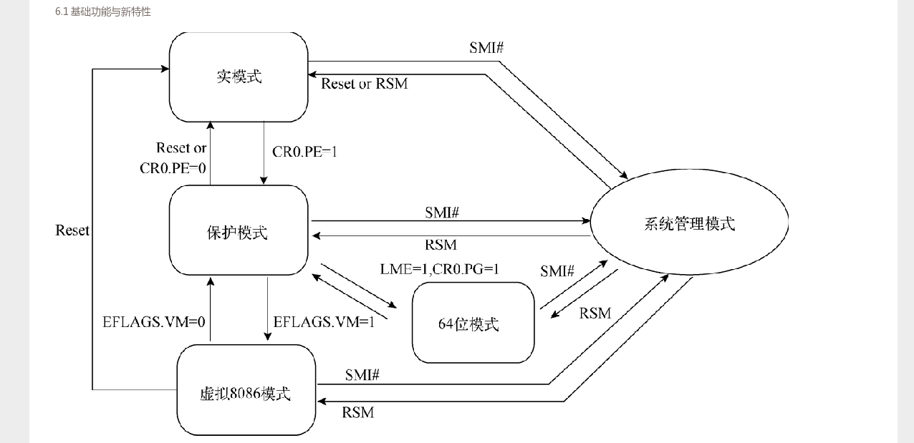 

**总结下**
1. **系统保护模式**是一种特殊模式 ，不管出于什么模式，当收到`SMI`信号就会进入系统管理模式。收到`RSM`则会返回之前的模式
2. **实模式**，通电或者重启后首先运行实模式。然后`cr0`的`PE(bit[0])`位置`1`进入**保护模式**
3. **保护模式**在开启分页的场景下(cr0.PG=1)，置位IA32_EFER寄存器的LME标志位（位于IA32_EFER寄存器的第8位）可使处理器进入**IA-32e模式**.
4. 通过IA32_EFER寄存器的LMA标志位（位于IA32_EFER寄存器的第10位）可以判断处理器是否运行在IA-32e模式下。当处理器运行于IA-32e模式，代码段描述符的L标志位可确定处理器运行于64位模式还是兼容模式
5. EFLAGS标志寄存器的VM标志位可使处理器在保护模式与**虚拟8086模式**间切换

IA-32模式下通用寄存器：EAX EBX ECX EDX ESI EDI ESP EIP

下图是通用寄存器的特殊功能

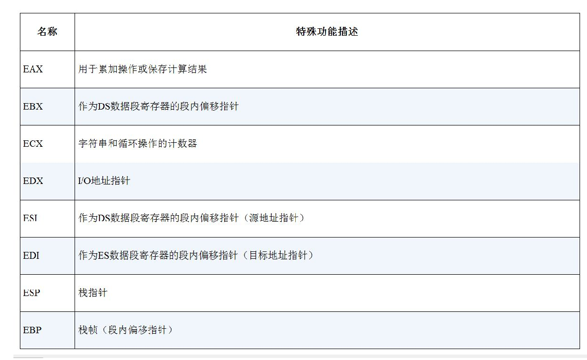 

IA-32e 64bit下:RAX RBX RCX RDX RSI RDI RSP RIP以及R8-R15 16个通用寄存器

在非64位模式下，通用寄存器的高32位处于未定义状态，当处理器从64位模式切换至32位模式（保护模式或兼容模式）时，任何通用寄存器的高32位数据都不会保留，因此软件不能依靠这种方法来保存数值。

**CPUID指令:**

CPUID汇编指令用于鉴别处理器信息以及检测处理器支持的功能，它在任何模式下的执行效果均相同。通过EFLAGS标志寄存器的ID标志位（位于EFLAGS寄存器的第21位）可检测出处理器是否支持CPUID指令。如果处理器支持CPUID指令，那么软件可自由操作ID标志位。

cpuid使用`eax`寄存器作为主功能号输入,`ecx`作为子功能号输入(需要的话)。使用`eax ebx ecx edx`保存执行结果。在64位模式下这些信息依然是32位的，因此处理器只使用RAX、RBX、RCX以及RDX寄存器的低32位保存执行结果，而高32位则被清0。
cpuid可以查询两类信息。基础信息和扩展信息:

- 基础信息： 主功能号从`0h`开始 最大支持到`14h` 通过`0h`可以查询到支持的最大基础功能号
- 扩展信息:  主功能号从`80000000h`开始，最大支持`80000008h`.`80000000h`可以查询处理器当前支持的最大扩展功能号。

下面是intel 关于cpuid的指令表达方式

 

**标志位寄存器:**

EFLAGS标志寄存器包含有状态标志位、控制标志位以及系统标志位，处理器在初始化时将EFLAGS标志寄存器赋值为00000002h。在IA-32e体系结构中，EFLAGS标志寄存器已从32位扩展为64位，其中的高32位保留使用。图6-3描绘了RFLAGS标志寄存器各位的功能，其中的第1、3、5、15以及22~63位保留使用。由于64位模式不再支持VM和NT标志位，所以处理器不应该再置位这两个标志位。(虽然处理器允许软件置位NT标志位，但执行IRET指令将触发#GP异常)

下图是标志位说明:

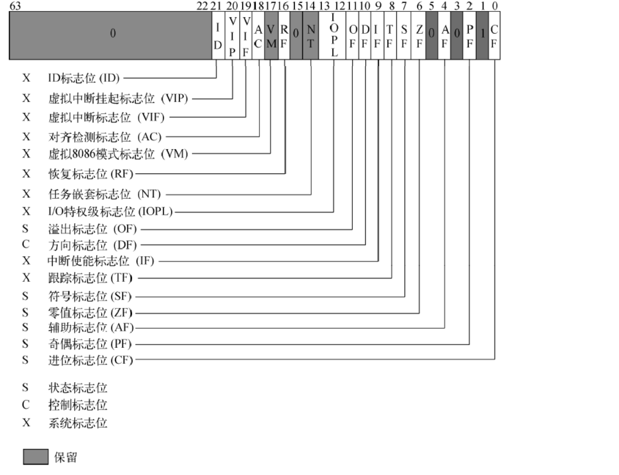 

当程序通过调用门执行任务切换的时候，处理器会把eflags的值保存到任务状态段tss内，并将目标任务状态段tss内的值更新到efalgs标志寄存器中。（这里应该属于硬件切换的tss）

eflags 分为状态标志，方向标志，和IOPL区域几个部分:

**状态标志**:eflags寄存器的状态标志 0,2,4,6,7,11
  - **CF**(bit[0] carry flag  进位 无符号整型结果的溢出状态 是否发生进位或者借位。0:无 1:有))
  - **PF**(bit[2] Parity flag 奇偶 计算结构的奇偶校验  0：奇数个1 1:偶数个1)
  - **AF**(bit[4] Auxiliary carry flag 辅助 用于BCD算术运算 0:未发生进位或者借位 1：发生)
  - **ZF**(bit[6] zero flag 零值  计算结果是否为0 0:否 也就是1  1：是  也就是计算结果为0)
  - **SF**(bit[7] Sign flag 符号 反映有符号数运算结果的正负值 0：正值 1:负值)
  - **OF**(bit[11] Overflow flag 溢出 反应有符号加减法计算结果的溢出状态  0：无溢出 1：溢出)

如图:

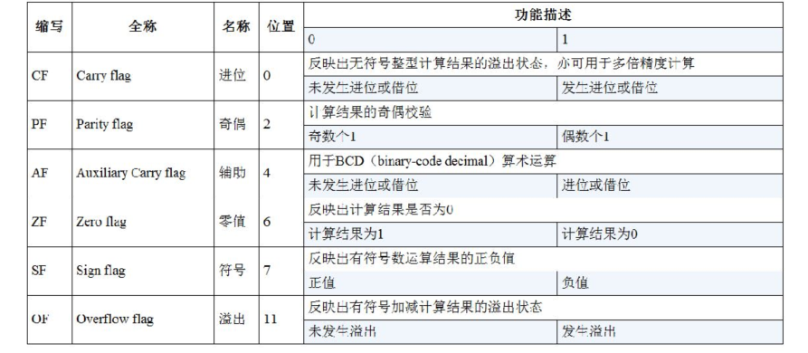 

这里 AF表示的是BCD的进位借位。然后CF和OF 针对的是无符号数和有符号数的。有符号数的OF可以来表示是否计算产生符号位的翻转。比如正数加正数=负数。CF则是是否结算结果超出算术逻辑单元长度的进位。比如32bit的结果进位到了33bit。然后cf可以用过STC（set cf 1） CLC(clear cf 0)和CMC(complement carry flag cf取反)指令更改值。它也可借助位操作指令（BT、BTS、BTR和BTC指令）将指定位值复制到CF标志位。而且，CF标志位还可在多倍精度整型数计算时，结合ADC指令（含进位的加法计算）或SBB指令（含借位的减法计算）将进位计算或借位计算扩展到下次计算中。至于状态跳转指令Jcc、状态字节置位指令SETcc、状态循环指令LOOPcc以及状态移动指令CMOVcc，它们可将一个或多个状态标志位作为判断条件，进行分支跳转、字节置位以及循环计数。

**方向标志**:DF bit[10] 控制着字符串指令(例如:movs,cmps,scas,lods,stos等)的操作方向。df=1 则是自减 操作。df=0则是自增。同理 STD CLD

**系统标志和IOPL区域**:，负责控制I/O端口地址访问权限、屏蔽硬件中断请求、使能单步调试、任务嵌套以及使能虚拟8086模式等。表6-3记录着各系统标志位和IOPL区域的功能。需要0特权级。

如下图:

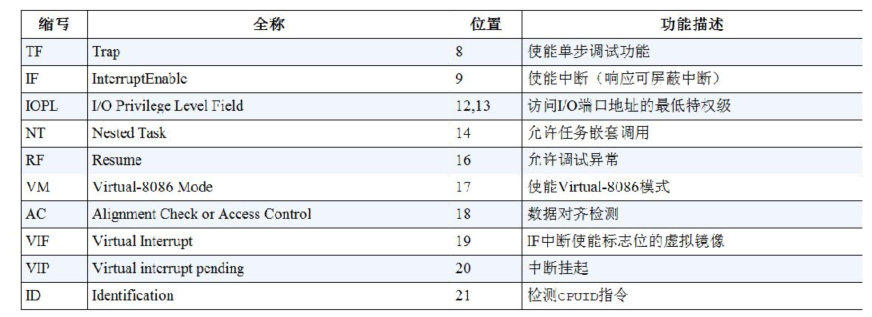 
VIF和VIP标志位只在Virtual-8086模式中有效；AC标志位只能对3特权级的数据进行对齐检测，如果发现数据未对齐则触发#AC异常；置位RF标志位将临时禁止断点指令触发#DB异常；IF标志位对NMI（Nonmaskable Interrupt，不可屏蔽中断）不起作用。我们可借助汇编指令CLI、STI、POPF、POPFD和IRET操作IF标志位。（处理器会参考CPL、IOPL和CR4.VME标志位，来确定不同场景下的指令执行权限。）

**控制寄存器:**

目前 intel处理器 6个控制寄存器:(CR0,CR1,CR2,CR3,CR4以及CR8)。
简单讲 cr0控制处理器的状态以及运行状态，cr2存储#PF的线性地址 cr3存储页目录的物理基地址以及属性。cr1 保留 具体见下图:

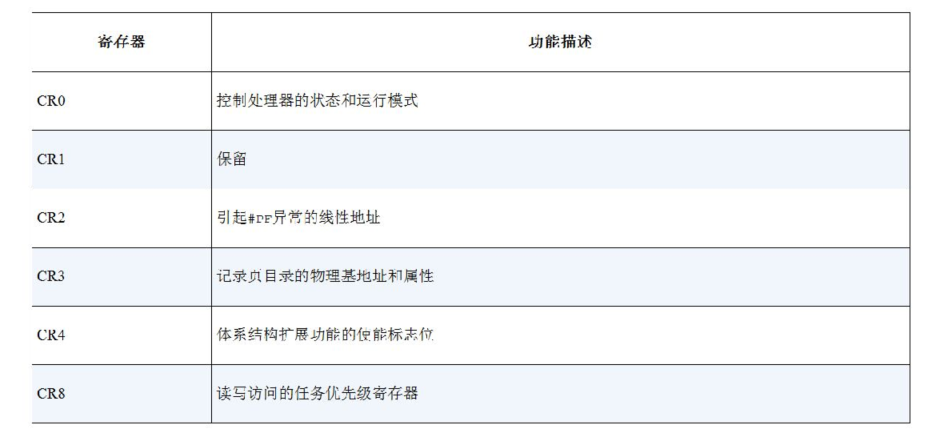 

在IA-32体系结构下，控制寄存器的位宽是32位，而IA-32e体系结构会将控制寄存器扩展至64位宽。但是除地址类寄存器外，其他扩展位均作保留使用，且必须写入0。具体见下图:

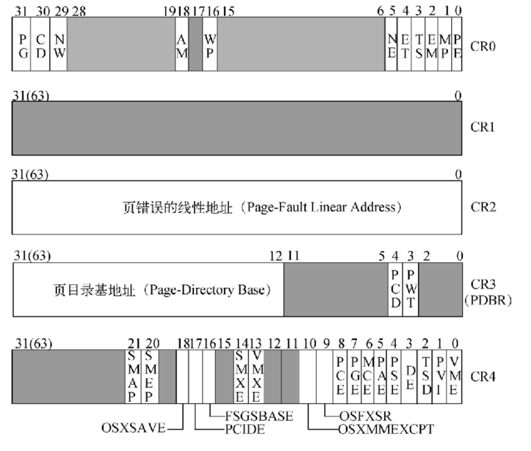 

通过MOV CRn汇编指令可对控制寄存器进行操作，其中的保留位必须写入数值0，否则会触发#GP异常。CR2和CR3控制寄存器不会对写入的地址进行检测（物理地址与线性地址均不检测）；CR8控制寄存器只在64位模式下有效。具体功能bit说明:

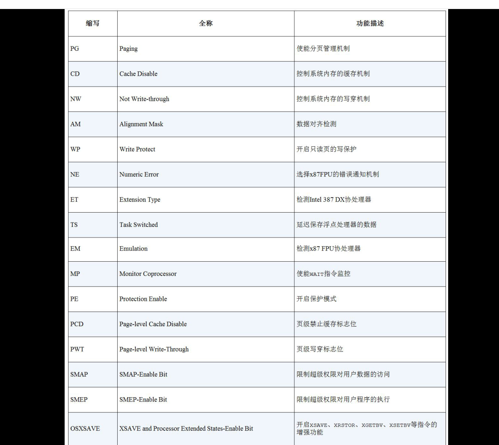 
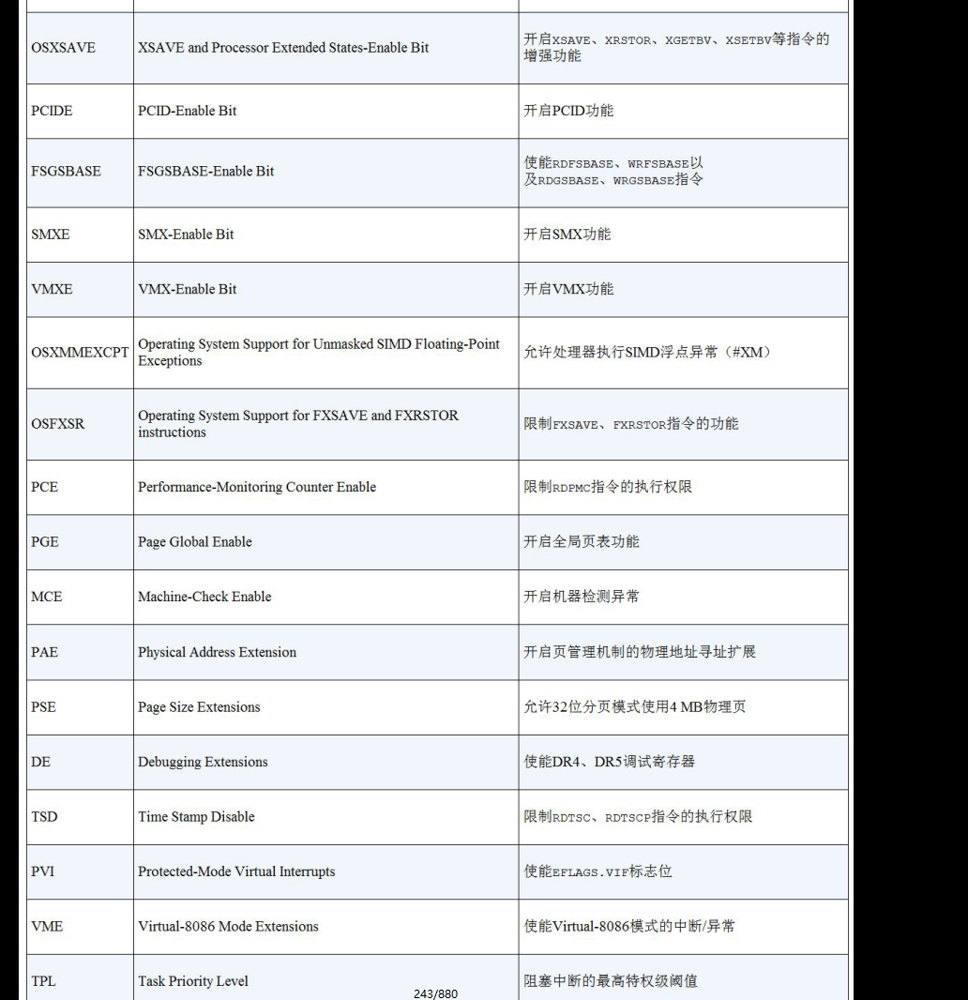 

CD（cache disable）控制系统内存的缓存机制(0 启用高速缓存 1 关闭) 

NW(not write-through)控制系统内存的写穿机制(0 代表 写穿 1 代表写回)。两者联合控制处理器的缓存策略和读写策略。

cpu使用高速缓存的时候 对内存的写操作两种模式：写穿(写cache也邪写内存  操作简单 但是缓存只是读缓存)和写回（对内存写数据不直接写 而是写入cache 当cache被替换出去才写回内存 cache速度远大于RAM(主存)。通过DCache吸收系统的写操作，在必要的时候再统一写入主存，从而减少频繁的相对较慢的对主存的写操作，这样明显能加速系统）

cd和nw的联合功能代表如下：

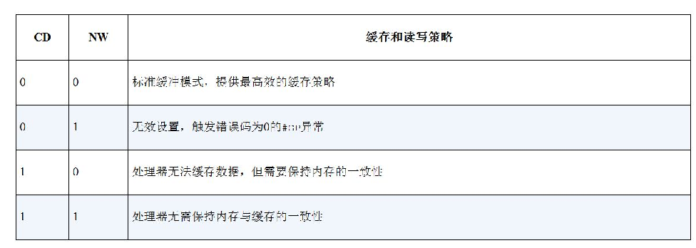 

浮点处理cr0

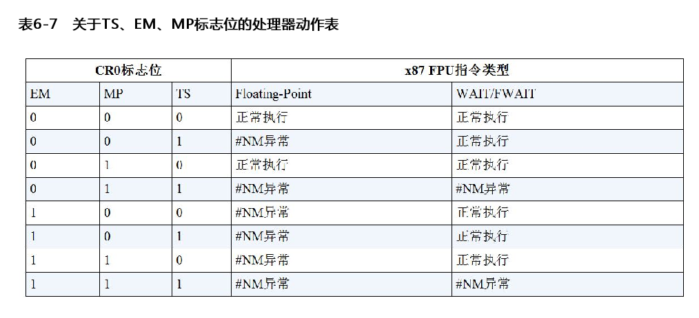 

EFER寄存器如下图:

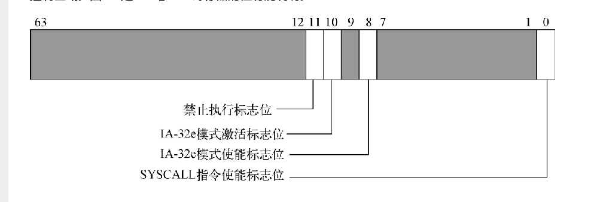 
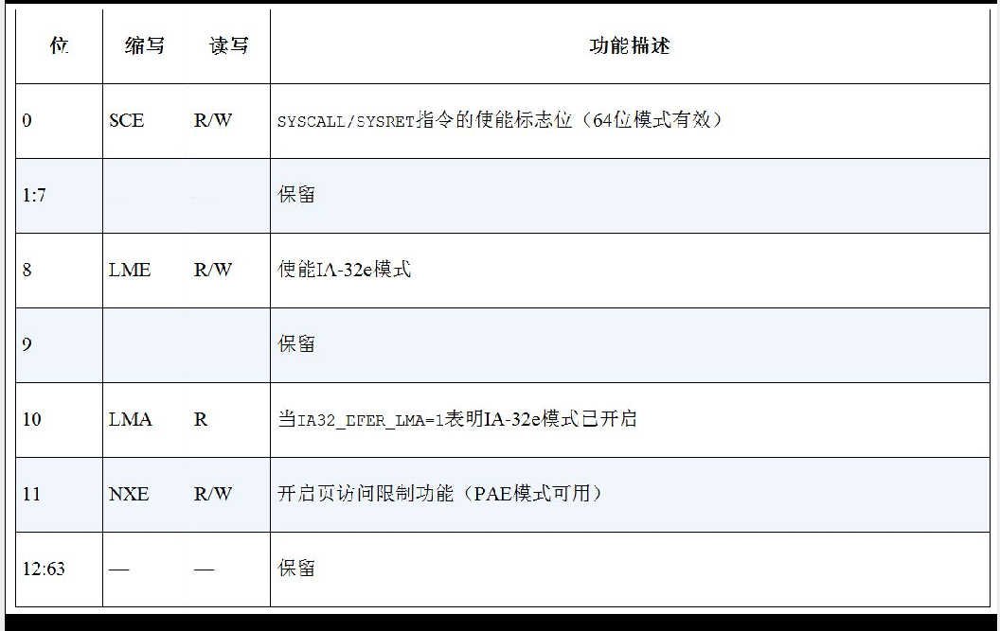 

**MSR寄存器组:**

MSR（Model-Specific Register）寄存器组可提供性能监测、运行轨迹跟踪与调试以及其他处理器功能。在使用MSR寄存器组之前，我们应该通过CPUID.01h:EDX[5]来检测处理器是否支持MSR寄存器组。值得注意的是，每种处理器家族都有自己的MSR寄存器组，我们在使用MSR寄存器组前需要根据处理器家族信息（通过CPUID.01h查询处理器家族信息）选择与之相对应的MSR寄存器组。

处理器可以使用指令RDMSR和WRMSR对MSR寄存器组进行访问，整个访问过程借助ECX寄存器索引寄存器地址，再由EDX:EAX组成的64位寄存器保持访问值。（在处理器支持64位模式下，RCX、RAX和RDX寄存器的高32位将会被忽略。）而且这对指令必须在实模式或0特权级下执行，否则将会触发#GP异常，使用MSR寄存器组的保留地址或无效地址都会产生通用保护异常。

<h2>地址空间</h2>

这里是对一些地址概念的说明 大概分为两大类
- **虚拟地址**:
  - **逻辑地址**: segment:offset。其中offset也叫做有效地址。常规代码里获取的就是这个有效地址 或者说offset
  - **线性地址**: 将段地址和有效地址结合产生的线性地址。比如加法 或者说之前实模式那种  左移+offset能够产生一个20bit范围的线性地址。而平坦地址是一种特殊的线性地址。就是说整个内存空间就是一个大段。当平坦地址的段基址为0的时候 那么有效地址和线性地址值相等.如果未开启分页 线性地址就是物理地址
- **物理地址**:
  - **I/O地址**:/O地址空间与内存地址空间相互隔离，它必须借助特殊的IN/OUT指令才能访问。I/O地址空间由65 536个可独立寻址的I/O端口组成，寻址范围0~FFFFh，其中的端口地址F8h~FFh保留使用。
  - **内存地址**:内存地址空间不单单只有物理内存，还包含其他外部硬件设备的地址空间，这些设备与物理内存共享内存地址空间。随着时间的推移，内存地址空间在保持向前兼容性的同时，不断增强寻址能力，从而造成可用物理内存的片段化、不连续化。所以，可用物理内存空间、设备地址空间以及内存地址空洞才会穿插排列在内存地址空间里。操作系统借助BIOS中断服务程序INT 15h的主功能编号AX=E820h可获取内存地址空间的相关信息。

<h2>实模式</h2>

现在实模式仅用于引导启动操作系统和更新硬件设备的ROM固件，为了兼顾处理器的向下兼容性，它将一直存在于处理器的体系结构中。通用寄存器只有16bit.采用段寻址模式。通常寻址空间1m 采用base左移4位+offset达到20bit也就是1m的寻址能力。没有分页，这里线性地址也就是直接映射为物理地址。

实模式下 异常中断借助ivt(interrupt vector table)实现。一个entery 4B(2B segment 2B offset) 共256项。一共1kb。实模式中，系统启动的时候会在物理地址0处创建ivt.

结构如下图:

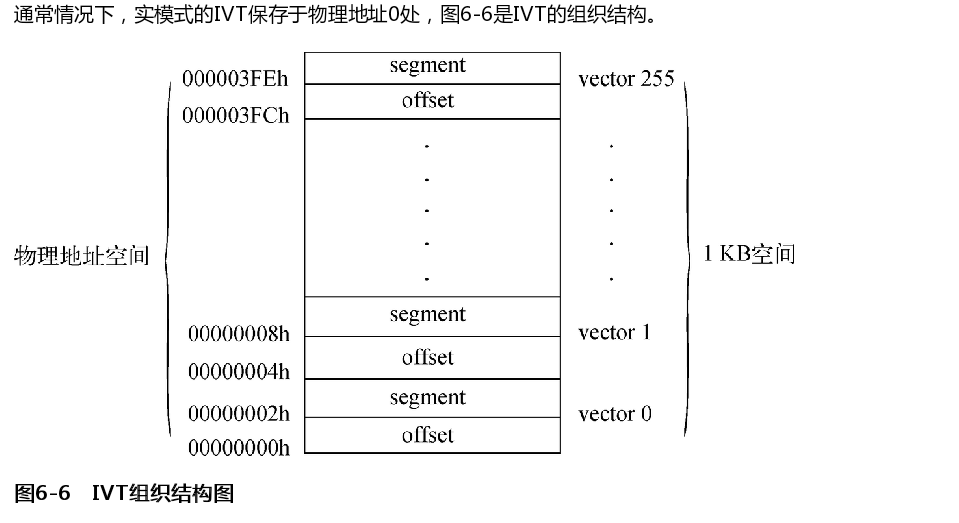 

<h2>保护模式</h2>

对于实模式的段机制而言，它仅仅规定了逻辑地址与线性地址间的转换方式，却没有限制访问目标段的权限，这使得应用程序可以肆无忌惮地对系统核心进行操作。但在保护模式下，若想对系统核心进行操作必须拥有足够的访问权限才行，这就是保护的意义：操作系统可在处理器级防止程序有意或无意地破坏其他程序和数据。

保护模式支持分段和分页两种管理机制，但是处理器必须先经过分段管理机制将逻辑地址转换成线性地址后，才能使用分页管理机制进一步把线性地址转换成物理地址（注意，分页管理机制是可选项，而分段管理机制是必选项）下图是逻辑地址到线性地址再到物理地址的转换过程:

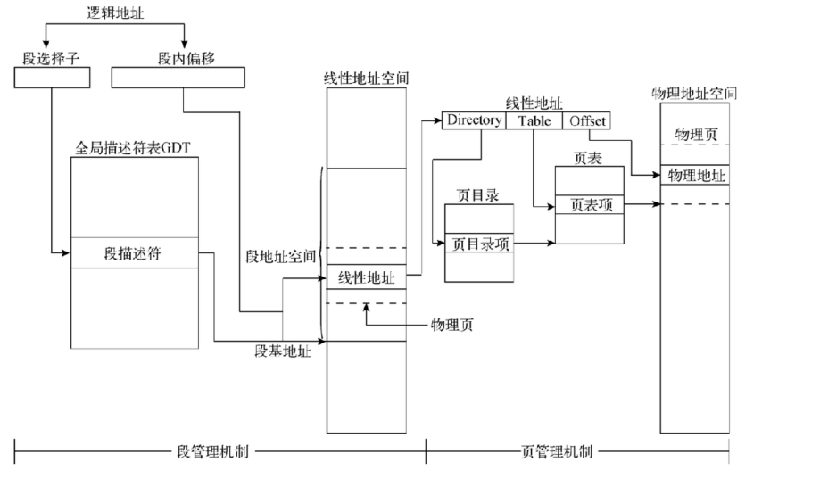 
简单描述下:逻辑地址是由段选择子和段内偏移组成。段选择子经过段描述符表中的索引找到段描述符并将其加载到段寄存器。这个描述符内就由这段基址等属性。这样段基址+段内偏移组成线性地址。然后再经过分页页表的查找找到实际物理地址。

然后是保护模式特权级别 0,1,2,3 0是操作系统内核，3一般是应用程序。1，2一般用作系统服务。另外保护模式还有三个关于特权级别的类型描述:

- CPL(current privilege level 当前特权级).描述了当前程序的执行特权级。保存再cs或者ss寄存器的0，1位。一般cpl是当前正在执行的代码段特权级。当处理器执行不同特权级的代码段时会修改cpl
- DPL(descriptor privilege level,描述符特权级).一般描述段描述符和门描述符的特权级，属于切换前的检查。当处理器访问段描述符或者门描述符的时候，处理器会对比描述符中的dpl 当前段寄存器的cpl以及下面提到的段选择子的RPL。
- RPL(request privilege level 请求特权级) 是段选择子的重载特权级。用于确保程序有足够的权限去访问受保护的程序。处于段选择子的0，1bit.相当于访问当该段的时候所具有的权限。例如当前cpl=0是最高权限，但是访问时段选择子的的rpl是3 那么访问该段的时候只有3特权级。然后再去和DPL比较 所以可能产生cpl=0的进程结合rpl后无法访问某些段。

下图是保护模式下段选择子的结构图:
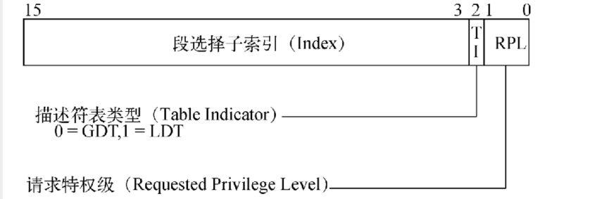 

处理器将Index * 8作为偏移量，从描述符表（TI=0：全局描述符表GDT，TI=1：局部描述符表LDT）中取得目标描述符，并对CPL、RPL以及DPL特权级进行检测。如果检测通过，处理器便将目标描述符加载到段寄存器的缓存区内。

下图是段寄存器的结构以及如何加载段地址等信息

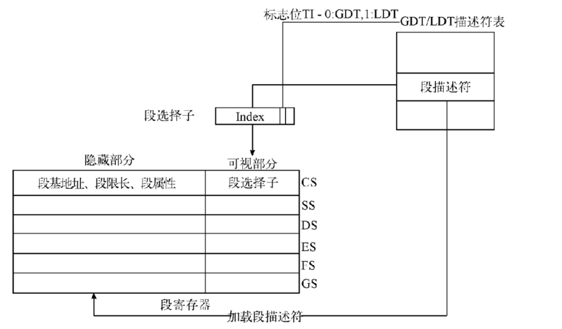 

为了减少地址转换时间与编码的复杂性，处理器已为保护模式下的CS、SS、DS、ES、FS以及GS段寄存器加入了缓存区域，这些段寄存器的缓存区域记录着段描述符的基地址、限长和属性信息.虽然系统可以定义数以千计个段描述符（8192个），但同一时刻只能使用6个段。

保护模式下的段寄存器共包含两个区域：可见区域和不可见区域。当段选择子被处理器加载到段寄存器的可见区域后，处理器会自动将段描述符（包括基地址、长度和属性信息）载入到段寄存器的不可见区域。处理器通过这些缓存信息，可直接进行地址转换，进而免去了重复读取内存中的段描述符的时间开销。在多核处理器系统中，当描述符表发生改变时，软件有义务重新将段描述符加载到段寄存器。如果段寄存器没有更新，处理器可能仍沿用缓存区中的段描述符数据。

这边保护模式下 GDTR以及LDTR是48位的伪描述符。保存着对应表的首地址以及长度。为了避免3特权级的对其检测错误。GDTR以及LDTR需要按照双字进行地址对齐。具体如下图：

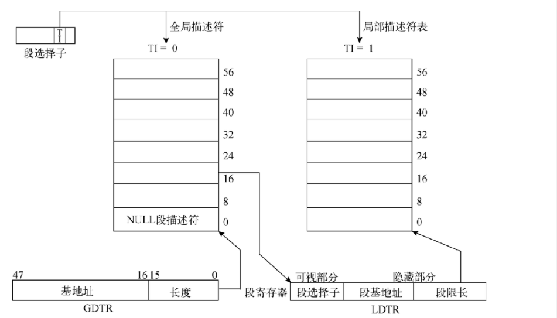 

其中GDT以及LDT描述 如下:

- **全局描述符表(Global Descriptor Table，GDT)**。它本身不是一个段描述符，而是一个**线性地址空间中的数据结构**。在使用GDT前，必须使用LGDT汇编指令将其线性基地址和长度加载到GDTR寄存器中。由于段描述符的长度为8 B，那么GDT的线性基地址按8 B边界对齐可使处理器的运行效果最佳，GDT的长度为（是段描述符项数）。
- **局部描述符表(Local Descriptor Table，LDT)**。它是一个LDT段描述符类型的**系统数据段**，因此处理器必须使用GDT的一个段描述符来管理它。处理器使用LLDT汇编指令可将GDT表内的LDT段描述符加载到LDTR寄存器，随后处理器会自动完成加载伪描述符结构体的工作。LDT段描述符可以保存在GDT的任何地方，如果系统支持多个LDT表，那么系统必须在GDT表中为每个LDT表创建独立的段描述符和段存储空间。为了避免地址转换，LDTR寄存器同样会保存LDT段描述符的段选择子、线性基地址以及长度。

全局描述符表的第0个表项被作为空段选择子（NULL Segment Selector）。处理器的CS或SS段寄存器不能加载NULL段选择子，否则会触发#GP异常。其他段寄存器则可使用NULL段选择子进行初始化。

保护模式的段管理机制，其中段描述符结构如下图:

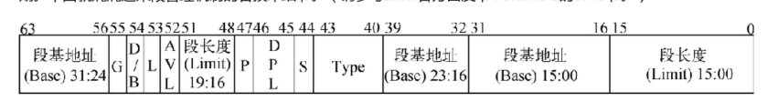 

大概就是8B的一个数据结构。其中:
- bit[51:46]+[15:0]是段长度
- bit[63:56]+bit[39:16] 是32bit的base address
- bit[46:45]是DPL

其他的的介绍如下图:

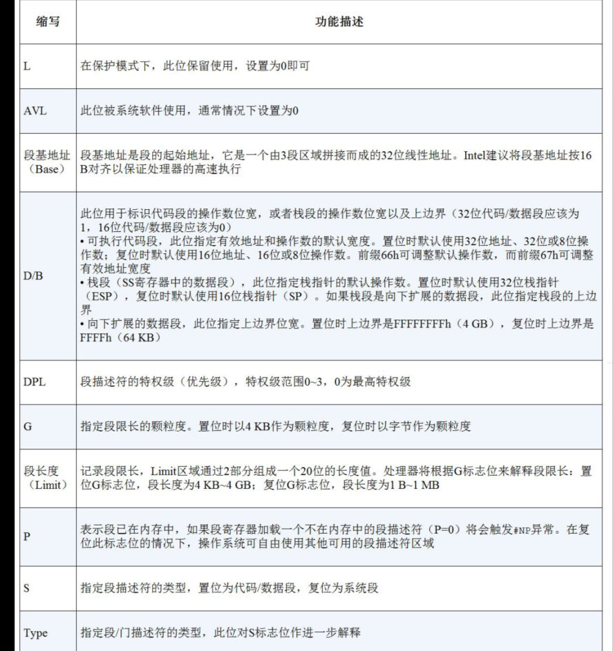 

`s`置1 和bit[43]1 则代表是代码段/数据段 0则是系统段。其中和type组合描述如下图:

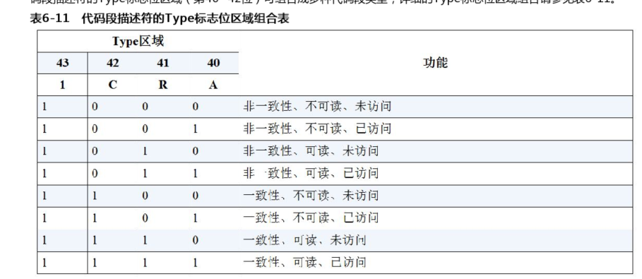

bit[43]表示是数据段还是代码段 1为代码段
当bit[43]= 1 也就是代码段的情况下。type在[42-40]一次表示CRA 也就是一致性 可读性 是否访问过.

CRA说明如下:

- A标志位:bit[40] 代表是否被访问过 1表示访问过。处理器只负责置位。
- R标志位:bit[41] 代表可读性。代码段默认是可执行。但是想读取程序段中的数据需要置位此标志位。当然 在执行的时候代码段不可写入。当置位的时候，可以通过将cs段寄存器作为操作前缀或者放入数据段寄存器来读取代码段中的数据
- C标志位:bit[42]代表一致性。代码段分为一致性代码段和非一致性代码段。1代表一致性 一致性代码段可以不更新CPL实现从低特权级代码段进入高特权级一致性代码段。数据段都是非一致的 所以不可以通过这种模式访问。

下面是一个实例 loader.asm 中  LABEL_DESC_CODE32的数值为0x00CF9A000000FFFF(代码中也有部分注释)
拆解如下图:

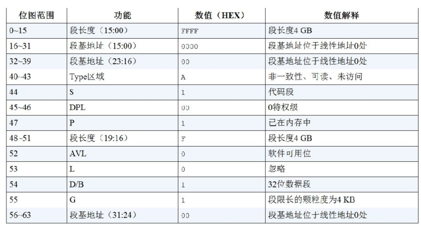 

当s是1 bit[43] = 1的时候代表是数据段 和type的bit[42-40]代表EWA 也就是扩展方向，可读写，是否访问过

- E标志位（Expansion-direction，扩展方向）。此标志位指示数据段的扩展方向，当E=1时表示向下扩展，当E=0时表示向上扩展，通常情况下数据段向上扩展(上是高地址)。
- W标志位（Write-enbale，可读写）。它记录着数据段的读写权限，当W=1时可进行读写访问，当W=0时只能进行读访问。
- A标志位（Accessed，已访问）。它的功能与代码段描述符中的已访问标志位A功能相同，即记录数据段是否被访问过。

同样一个实例为0x00CF92000000FFFF。拆解如下图：

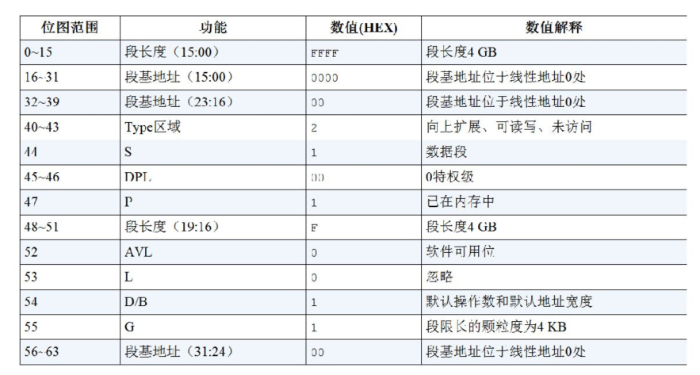 

