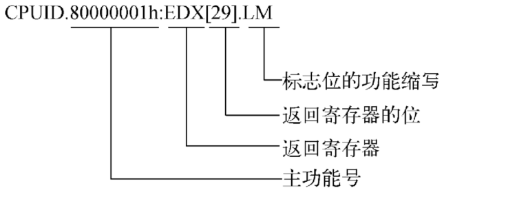
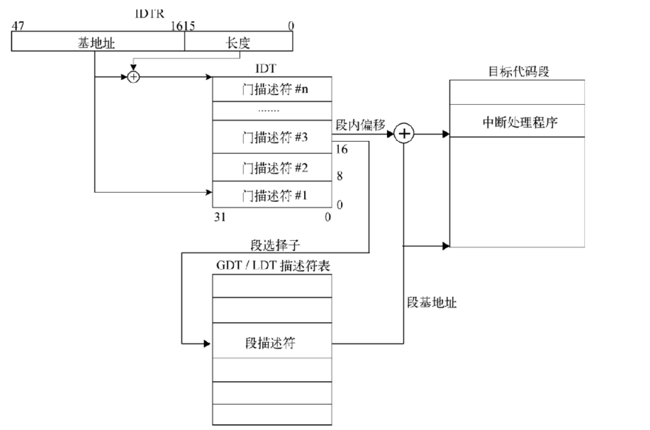
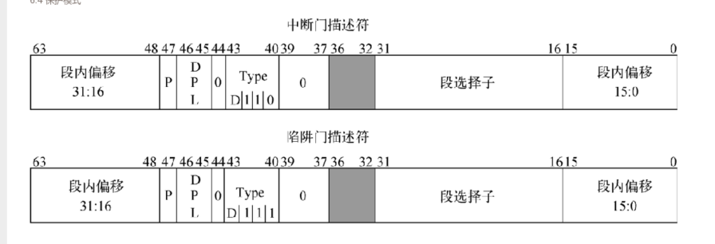

# 高级篇开始

包含内容
-  [1 基础功能以及新特性](#c1)
-  [2 地址空间](#c2)
-  [3 实模式](#c3)
-  [4 保护模式](#c4)

<h2>基础功能以及新特性</h2>

这部分主要是名词以及概念介绍。

**运行模式:**

- 实模式（Real-Address Mode）。它为处理器提供Intel 8086处理器的运行环境，并追加了保护模式和系统管理模式的切换扩展。(16bit 寻址是20bit)
- 保护模式（Protected Mode）。它是32位处理器的主要运行模式，为软件的运行提供了丰富的功能、严格的安全性检测以及向后兼容性。
- 系统管理模式（System Management Mode，SMM）。它是32位处理器的标准功能，提供一种对操作系统透明的机制来执行电源管理和OEM的特殊功能。一旦切换至SMM模式，处理器将进入一个隔离的地址空间运行。
- 虚拟8086模式（Virtual-8086 Mode）。它是处理器为保护模式提供的一种准运行模式，允许处理器在保护模式下执行8086软件和多任务环境。
- IA-32e模式（IA-32e Mode）。它是64位处理器的主要运行模式，共包含两种子模式：兼容模式和64位模式（64-bit Mode）。64位模式为处理器提供64位的线性地址空间并支持超过64 GB的物理地址寻址，而兼容模式可使大部分保护模式的应用程序无修改运行于64位处理器中。

下面是几种模式的切换的流程图:

 

**总结下**
1. **系统保护模式**是一种特殊模式 ，不管出于什么模式，当收到`SMI`信号就会进入系统管理模式。收到`RSM`则会返回之前的模式
2. **实模式**，通电或者重启后首先运行实模式。然后`cr0`的`PE(bit[0])`位置`1`进入**保护模式**
3. **保护模式**在开启分页的场景下(cr0.PG=1)，置位IA32_EFER寄存器的LME标志位（位于IA32_EFER寄存器的第8位）可使处理器进入**IA-32e模式**.
4. 通过IA32_EFER寄存器的LMA标志位（位于IA32_EFER寄存器的第10位）可以判断处理器是否运行在IA-32e模式下。当处理器运行于IA-32e模式，代码段描述符的L标志位可确定处理器运行于64位模式还是兼容模式
5. EFLAGS标志寄存器的VM标志位可使处理器在保护模式与**虚拟8086模式**间切换

IA-32模式下通用寄存器：EAX EBX ECX EDX ESI EDI ESP EIP

下图是通用寄存器的特殊功能

 

IA-32e 64bit下:RAX RBX RCX RDX RSI RDI RSP RIP以及R8-R15 16个通用寄存器

在非64位模式下，通用寄存器的高32位处于未定义状态，当处理器从64位模式切换至32位模式（保护模式或兼容模式）时，任何通用寄存器的高32位数据都不会保留，因此软件不能依靠这种方法来保存数值。

**CPUID指令:**

CPUID汇编指令用于鉴别处理器信息以及检测处理器支持的功能，它在任何模式下的执行效果均相同。通过EFLAGS标志寄存器的ID标志位（位于EFLAGS寄存器的第21位）可检测出处理器是否支持CPUID指令。如果处理器支持CPUID指令，那么软件可自由操作ID标志位。

cpuid使用`eax`寄存器作为主功能号输入,`ecx`作为子功能号输入(需要的话)。使用`eax ebx ecx edx`保存执行结果。在64位模式下这些信息依然是32位的，因此处理器只使用RAX、RBX、RCX以及RDX寄存器的低32位保存执行结果，而高32位则被清0。
cpuid可以查询两类信息。基础信息和扩展信息:

- 基础信息： 主功能号从`0h`开始 最大支持到`14h` 通过`0h`可以查询到支持的最大基础功能号
- 扩展信息:  主功能号从`80000000h`开始，最大支持`80000008h`.`80000000h`可以查询处理器当前支持的最大扩展功能号。

下面是intel 关于cpuid的指令表达方式

 

**标志位寄存器:**

EFLAGS标志寄存器包含有状态标志位、控制标志位以及系统标志位，处理器在初始化时将EFLAGS标志寄存器赋值为00000002h。在IA-32e体系结构中，EFLAGS标志寄存器已从32位扩展为64位，其中的高32位保留使用。图6-3描绘了RFLAGS标志寄存器各位的功能，其中的第1、3、5、15以及22-63位保留使用。由于64位模式不再支持VM和NT标志位，所以处理器不应该再置位这两个标志位。(虽然处理器允许软件置位NT标志位，但执行IRET指令将触发#GP异常)

下图是标志位说明:

 

当程序通过调用门执行任务切换的时候，处理器会把eflags的值保存到任务状态段tss内，并将目标任务状态段tss内的值更新到efalgs标志寄存器中。（这里应该属于硬件切换的tss）

eflags 分为状态标志，方向标志，和IOPL区域几个部分:

**状态标志**:eflags寄存器的状态标志 0,2,4,6,7,11
  - **CF**(bit[0] carry flag  进位 无符号整型结果的溢出状态 是否发生进位或者借位。0:无 1:有))
  - **PF**(bit[2] Parity flag 奇偶 计算结构的奇偶校验  0：奇数个1 1:偶数个1)
  - **AF**(bit[4] Auxiliary carry flag 辅助 用于BCD算术运算 0:未发生进位或者借位 1：发生)
  - **ZF**(bit[6] zero flag 零值  计算结果是否为0 0:否 也就是1  1：是  也就是计算结果为0)
  - **SF**(bit[7] Sign flag 符号 反映有符号数运算结果的正负值 0：正值 1:负值)
  - **OF**(bit[11] Overflow flag 溢出 反应有符号加减法计算结果的溢出状态  0：无溢出 1：溢出)

如图:

 

这里 AF表示的是BCD的进位借位。然后CF和OF 针对的是无符号数和有符号数的。有符号数的OF可以来表示是否计算产生符号位的翻转。比如正数加正数=负数。CF则是是否结算结果超出算术逻辑单元长度的进位。比如32bit的结果进位到了33bit。然后cf可以用过STC（set cf 1） CLC(clear cf 0)和CMC(complement carry flag cf取反)指令更改值。它也可借助位操作指令（BT、BTS、BTR和BTC指令）将指定位值复制到CF标志位。而且，CF标志位还可在多倍精度整型数计算时，结合ADC指令（含进位的加法计算）或SBB指令（含借位的减法计算）将进位计算或借位计算扩展到下次计算中。至于状态跳转指令Jcc、状态字节置位指令SETcc、状态循环指令LOOPcc以及状态移动指令CMOVcc，它们可将一个或多个状态标志位作为判断条件，进行分支跳转、字节置位以及循环计数。

**方向标志**:DF bit[10] 控制着字符串指令(例如:movs,cmps,scas,lods,stos等)的操作方向。df=1 则是自减 操作。df=0则是自增。同理 STD CLD

**系统标志和IOPL区域**:，负责控制I/O端口地址访问权限、屏蔽硬件中断请求、使能单步调试、任务嵌套以及使能虚拟8086模式等。表6-3记录着各系统标志位和IOPL区域的功能。需要0特权级。

如下图:

 
VIF和VIP标志位只在Virtual-8086模式中有效；AC标志位只能对3特权级的数据进行对齐检测，如果发现数据未对齐则触发#AC异常；置位RF标志位将临时禁止断点指令触发#DB异常；IF标志位对NMI（Nonmaskable Interrupt，不可屏蔽中断）不起作用。我们可借助汇编指令CLI、STI、POPF、POPFD和IRET操作IF标志位。（处理器会参考CPL、IOPL和CR4.VME标志位，来确定不同场景下的指令执行权限。）

**控制寄存器:**

目前 intel处理器 6个控制寄存器:(CR0,CR1,CR2,CR3,CR4以及CR8)。
简单讲 cr0控制处理器的状态以及运行状态，cr2存储#PF的线性地址 cr3存储页目录的物理基地址以及属性。cr1 保留 具体见下图:

 

在IA-32体系结构下，控制寄存器的位宽是32位，而IA-32e体系结构会将控制寄存器扩展至64位宽。但是除地址类寄存器外，其他扩展位均作保留使用，且必须写入0。具体见下图:

 

通过MOV CRn汇编指令可对控制寄存器进行操作，其中的保留位必须写入数值0，否则会触发#GP异常。CR2和CR3控制寄存器不会对写入的地址进行检测（物理地址与线性地址均不检测）；CR8控制寄存器只在64位模式下有效。具体功能bit说明:

 
 

CD（cache disable）控制系统内存的缓存机制(0 启用高速缓存 1 关闭) 

NW(not write-through)控制系统内存的写穿机制(0 代表 写穿 1 代表写回)。两者联合控制处理器的缓存策略和读写策略。

cpu使用高速缓存的时候 对内存的写操作两种模式：写穿(写cache也邪写内存  操作简单 但是缓存只是读缓存)和写回（对内存写数据不直接写 而是写入cache 当cache被替换出去才写回内存 cache速度远大于RAM(主存)。通过DCache吸收系统的写操作，在必要的时候再统一写入主存，从而减少频繁的相对较慢的对主存的写操作，这样明显能加速系统）

cd和nw的联合功能代表如下：

 

浮点处理cr0

 

EFER寄存器如下图:

 
 

**MSR寄存器组:**

MSR（Model-Specific Register）寄存器组可提供性能监测、运行轨迹跟踪与调试以及其他处理器功能。在使用MSR寄存器组之前，我们应该通过CPUID.01h:EDX[5]来检测处理器是否支持MSR寄存器组。值得注意的是，每种处理器家族都有自己的MSR寄存器组，我们在使用MSR寄存器组前需要根据处理器家族信息（通过CPUID.01h查询处理器家族信息）选择与之相对应的MSR寄存器组。

处理器可以使用指令RDMSR和WRMSR对MSR寄存器组进行访问，整个访问过程借助ECX寄存器索引寄存器地址，再由EDX:EAX组成的64位寄存器保持访问值。（在处理器支持64位模式下，RCX、RAX和RDX寄存器的高32位将会被忽略。）而且这对指令必须在实模式或0特权级下执行，否则将会触发#GP异常，使用MSR寄存器组的保留地址或无效地址都会产生通用保护异常。

<h2>地址空间</h2>

这里是对一些地址概念的说明 大概分为两大类
- **虚拟地址**:
  - **逻辑地址**: segment:offset。其中offset也叫做有效地址。常规代码里获取的就是这个有效地址 或者说offset
  - **线性地址**: 将段地址和有效地址结合产生的线性地址。比如加法 或者说之前实模式那种  左移+offset能够产生一个20bit范围的线性地址。而平坦地址是一种特殊的线性地址。就是说整个内存空间就是一个大段。当平坦地址的段基址为0的时候 那么有效地址和线性地址值相等.如果未开启分页 线性地址就是物理地址
- **物理地址**:
  - **I/O地址**:/O地址空间与内存地址空间相互隔离，它必须借助特殊的IN/OUT指令才能访问。I/O地址空间由65 536个可独立寻址的I/O端口组成，寻址范围是0-FFFFh，其中的端口地址F8h-FFh保留使用。
  - **内存地址**:内存地址空间不单单只有物理内存，还包含其他外部硬件设备的地址空间，这些设备与物理内存共享内存地址空间。随着时间的推移，内存地址空间在保持向前兼容性的同时，不断增强寻址能力，从而造成可用物理内存的片段化、不连续化。所以，可用物理内存空间、设备地址空间以及内存地址空洞才会穿插排列在内存地址空间里。操作系统借助BIOS中断服务程序INT 15h的主功能编号AX=E820h可获取内存地址空间的相关信息。

<h2>实模式</h2>

现在实模式仅用于引导启动操作系统和更新硬件设备的ROM固件，为了兼顾处理器的向下兼容性，它将一直存在于处理器的体系结构中。通用寄存器只有16bit.采用段寻址模式。通常寻址空间1m 采用base左移4位+offset达到20bit也就是1m的寻址能力。没有分页，这里线性地址也就是直接映射为物理地址。

实模式下 异常中断借助ivt(interrupt vector table)实现。一个entry 4B(2B segment 2B offset) 共256项。一共1kb。实模式中，系统启动的时候会在物理地址0处创建ivt.

结构如下图:

 

<h2>保护模式</h2>

对于实模式的段机制而言，它仅仅规定了逻辑地址与线性地址间的转换方式，却没有限制访问目标段的权限，这使得应用程序可以肆无忌惮地对系统核心进行操作。但在保护模式下，若想对系统核心进行操作必须拥有足够的访问权限才行，这就是保护的意义：操作系统可在处理器级防止程序有意或无意地破坏其他程序和数据。

保护模式支持分段和分页两种管理机制，但是处理器必须先经过分段管理机制将逻辑地址转换成线性地址后，才能使用分页管理机制进一步把线性地址转换成物理地址（注意，分页管理机制是可选项，而分段管理机制是必选项）下图是逻辑地址到线性地址再到物理地址的转换过程:

 
简单描述下:逻辑地址是由段选择子和段内偏移组成。段选择子经过段描述符表中的索引找到段描述符并将其加载到段寄存器。这个描述符内就由这段基址等属性。这样段基址+段内偏移组成线性地址。然后再经过分页页表的查找找到实际物理地址。

然后是保护模式特权级别 0,1,2,3 0是操作系统内核，3一般是应用程序。1，2一般用作系统服务。另外保护模式还有三个关于特权级别的类型描述:

- CPL(current privilege level 当前特权级).描述了当前程序的执行特权级。保存再cs或者ss寄存器的0，1位。一般cpl是当前正在执行的代码段特权级。当处理器执行不同特权级的代码段时会修改cpl
- DPL(descriptor privilege level,描述符特权级).一般描述段描述符和门描述符的特权级，属于切换前的检查。当处理器访问段描述符或者门描述符的时候，处理器会对比描述符中的dpl 当前段寄存器的cpl以及下面提到的段选择子的RPL。
- RPL(request privilege level 请求特权级) 是段选择子的重载特权级。用于确保程序有足够的权限去访问受保护的程序。处于段选择子的0，1bit.相当于访问当该段的时候所具有的权限。例如当前cpl=0是最高权限，但是访问时段选择子的的rpl是3 那么访问该段的时候只有3特权级。然后再去和DPL比较 所以可能产生cpl=0的进程结合rpl后无法访问某些段。

下图是保护模式下段选择子的结构图:
 

处理器将Index * 8作为偏移量，从描述符表（TI=0：全局描述符表GDT，TI=1：局部描述符表LDT）中取得目标描述符，并对CPL、RPL以及DPL特权级进行检测。如果检测通过，处理器便将目标描述符加载到段寄存器的缓存区内。

下图是段寄存器的结构以及如何加载段地址等信息

 

为了减少地址转换时间与编码的复杂性，处理器已为保护模式下的CS、SS、DS、ES、FS以及GS段寄存器加入了缓存区域，这些段寄存器的缓存区域记录着段描述符的基地址、限长和属性信息.虽然系统可以定义数以千计个段描述符（8192个），但同一时刻只能使用6个段。

保护模式下的段寄存器共包含两个区域：可见区域和不可见区域。当段选择子被处理器加载到段寄存器的可见区域后，处理器会自动将段描述符（包括基地址、长度和属性信息）载入到段寄存器的不可见区域。处理器通过这些缓存信息，可直接进行地址转换，进而免去了重复读取内存中的段描述符的时间开销。在多核处理器系统中，当描述符表发生改变时，软件有义务重新将段描述符加载到段寄存器。如果段寄存器没有更新，处理器可能仍沿用缓存区中的段描述符数据。

这边保护模式下 GDTR以及LDTR是48位的伪描述符。保存着对应表的首地址以及长度。为了避免3特权级的对其检测错误。GDTR以及LDTR需要按照双字进行地址对齐。具体如下图：

 

其中GDT以及LDT描述 如下:

- **全局描述符表(Global Descriptor Table，GDT)**。它本身不是一个段描述符，而是一个**线性地址空间中的数据结构**。在使用GDT前，必须使用LGDT汇编指令将其线性基地址和长度加载到GDTR寄存器中。由于段描述符的长度为8 B，那么GDT的线性基地址按8 B边界对齐可使处理器的运行效果最佳，GDT的长度为（是段描述符项数）。
- **局部描述符表(Local Descriptor Table，LDT)**。它是一个LDT段描述符类型的**系统数据段**，因此处理器必须使用GDT的一个段描述符来管理它。处理器使用LLDT汇编指令可将GDT表内的LDT段描述符加载到LDTR寄存器，随后处理器会自动完成加载伪描述符结构体的工作。LDT段描述符可以保存在GDT的任何地方，如果系统支持多个LDT表，那么系统必须在GDT表中为每个LDT表创建独立的段描述符和段存储空间。为了避免地址转换，LDTR寄存器同样会保存LDT段描述符的段选择子、线性基地址以及长度。

全局描述符表的第0个表项被作为空段选择子（NULL Segment Selector）。处理器的CS或SS段寄存器不能加载NULL段选择子，否则会触发#GP异常。其他段寄存器则可使用NULL段选择子进行初始化。

保护模式的段管理机制，其中段描述符结构如下图:

 

大概就是8B的一个数据结构。其中:
- bit[51:46]+[15:0]是段长度
- bit[63:56]+bit[39:16] 是32bit的base address
- bit[46:45]是DPL

其他的的介绍如下图:

 

`s`置1 和bit[43]1 则代表是代码段/数据段 0则是系统段。其中和type组合描述如下图:

bit[43]表示是数据段还是代码段 1为代码段

**代码段描述符:**

当bit[43]= 1 也就是代码段的情况下。type在[42-40]一次表示CRA 也就是一致性 可读性 是否访问过.

CRA说明如下:

- A标志位:bit[40] 代表是否被访问过 1表示访问过。处理器只负责置位。
- R标志位:bit[41] 代表可读性。代码段默认是可执行。但是想读取程序段中的数据需要置位此标志位。当然 在执行的时候代码段不可写入。当置位的时候，可以通过将cs段寄存器作为操作前缀或者放入数据段寄存器来读取代码段中的数据
- C标志位:bit[42]代表一致性。代码段分为一致性代码段和非一致性代码段。1代表一致性 一致性代码段可以不更新CPL实现从低特权级代码段进入高特权级一致性代码段。数据段都是非一致的 所以不可以通过这种模式访问。

下面是一个实例 loader.asm 中  LABEL_DESC_CODE32的数值为0x00CF9A000000FFFF(代码中也有部分注释)
拆解如下图:

 

**数据段描述符:**

当s是1 bit[43] = 1的时候代表是数据段 和type的bit[42-40]代表EWA 也就是扩展方向，可读写，是否访问过

- E标志位（Expansion-direction，扩展方向）。此标志位指示数据段的扩展方向，当E=1时表示向下扩展，当E=0时表示向上扩展，通常情况下数据段向上扩展(上是高地址)。
- W标志位（Write-enbale，可读写）。它记录着数据段的读写权限，当W=1时可进行读写访问，当W=0时只能进行读访问。
- A标志位（Accessed，已访问）。它的功能与代码段描述符中的已访问标志位A功能相同，即记录数据段是否被访问过。

同样一个实例为0x00CF92000000FFFF。拆解如下图：

 

**系统段描述符:**

S为0则为系统段。其中type类型所表示如下图:

 
这边介绍下LDT段描述符 TSS描述符  调用门描述符这三种

1. **LDT段描述符:** 纪录LDT表的位置 长度以及访问权限等信息。
2. **TSS描述符:** TSS用于保存任务的处理器状态信息。下图是TSS描述符的位功能。LDT的位功能和此一致：  和其他段描述符基本一致。这里提下type中的B标志位。这里的B表示BUSY 如果为1则表示任务正在运行或者已经挂起。TSS描述符只能保存在GDT内。 所以如果一个TSS段选择子的ti被置位，访问时会触发#GP异常(call 或者 jmp)或者#TS异常(iret指令).TSS段选择子时存放在tr寄存器中的。系统TSS主要用于任务切换或者特权级切换的时候。用于切换到对应的特权级栈空间以及保存处理器状态。其中32bit下tss结构如下图:  32 tss分为两个部分  动态区域和静态区域。 其中在任务切换时**动态区域**会保存执行现场。具体如下图:  **静态区域**是任务在切换或者挂起时。处理器会读取其中的数据。用来展开新任务环境。具体如下图:  .此处栈空间是静态的。不会因任务切换而改变。但是ss和esp会随着任务切换而更新。 对于处理器级的任务切换而言，它只能在满足以下四种条件之一时才会发生。 
    1. 当前程序通过JMP或CALL指令跳转至GDT中的TSS描述符时，任务切换将会发生。
    2. 当前程序通过JMP或CALL指令跳转至GDT或LDT中的任务门描述符时，任务切换将会发生
    3. 如果一个IDT表项使用任务门描述符来保存中断或异常处理程序，那么在触发中断或者异常时任务切换将会发生
    4. 如果当前任务的EFLAGS.NT标志位被置位，那么在执行IRET指令时任务切换将会发生(iret 且nt代表的收IDT表项是任务门描述符保存的处理程序?)。  除上述4种硬件级任务切换方法外，程序还可使用软件逻辑来实现任务切换。诸如采用独立页表空间切换方式（通过切换页表以及JMP指令来切换任务）的Linux系统内核，它只借助TSS的静态区域为特权级提供栈空间，而任务的执行现场将通过手动方式保存于栈或PCB（进程控制结构体）中.
3. **调用门描述符:**   调用门可让不同特权级间的程序实现受控切换，它们通常用于受特权级保护的操作系统或程序中下图是调用门描述符的位功能说明:  调用门的一个显著特点是借助CALL指令穿过调用门可访问更高特权级（CPL>=DPL）的代码段，如果目标代码段是非一致性的，则栈切换会发生。（一致性代码段不会改变CS寄存器的CPL值。）在发生特权级切换时，必定会伴随着栈切换，而且栈特权级将与CPL特权级保持一致。JMP指令只能穿过相同特权级（CPL=DPL）的非一致性代码段，但CALL与JMP指令却都可以访问更高特权级的一致性代码段。下图是各功能位说明:  

**保护模式的中断和异常处理机制**

中断可在程序执行任务时候触发，它可以来自一个外部硬件设备请求，也可以来自INT n指令。而异常只能在检测到处理器执行故障时触发，处理器可检测的异常种类有很多，诸如通用保护性异常、页错误异常和机器内部错误异常等。。向量号的数值范围是0-255，其中0-31号向量被Intel处理器作为异常向量号或保留使用（不要使用保留的向量号），剩余32-255号向量将作为中断向量号供用户使用。

IDT借助门描述符将中断/异常向量号与处理程序关联起来，这就像GDT与LDT的关系一样。IDT是一个门描述符数组（每个门描述符占8 B），其第一个表项是有效的，并非NULL描述符，这与GDT略有不同。由于中断/异常向量的上限是256项，因此IDT不能包含超过256个门描述符，但可以少于256个门描述符。

处理器借助IDTR寄存器可定位出IDT的位置，但在使用IDT前，必须使用LIDT指令（SIDT指令用于保存IDTR寄存器值）将IDT的线性基地址（32位）和长度（16位）加载IDTR寄存器中，LIDT指令只能在CPL=0时执行。通常情况下，IDT创建于操作系统初始化过程。下图是中断向量好的索引过程示意图:

 

IDT表项的门描述符可以是陷阱门 中断门 和任务门三种(还有系统门):

1. 陷阱门和中断门描述符:  这是两个描述符的位功能图。其中D表示的是门描述符的数据位宽。这俩的区别 中断门执行的时候会复位IF标志禁止其他可屏蔽中断。然后IRET回来的时候还原eflags寄存器包括IF位。
2. 任务门描述符:任务门描述符（Task Gate Descriptor）可在任务切换过程中提供一些间接的保护措施。与其他门描述符相比，任务门描述符的位结构更为简单，它仅包含了任务状态段描述符的段选择子和属性信息  这里的段选择子时tss段选择子。他的rpl无效 由dpl限制。任务门描述符可以存在于GDT IDT LDT但是他的TSS段选择子只能在GDT中。LINUX中只使用了中断门描述符和陷阱门描述符。IA-32e模式下取消了任务门描述符这一功能。

**保护模式的页管理机制**

在保护模式下，处理器可借助段管理机制将逻辑地址转换成线性地址。当开启页管理机制后，处理器必须经过页管理机制才能将线性地址转换为物理地址，这一转换过程必须经过多层级页表索引才能访问到目标物理地址或I/O设备内存。
在页管理机制的各层级页表中，不仅保存着目标物理页的基地址，还记录着访问物理页的权限以及缓存类型等属性信息。软件可通过MOV CR0指令置位PG标志位来使能页管理机制。在开启页管理机制前，请确保CR3控制寄存器中已经载入了页目录（顶层页表）的物理基地址，处理器将从页目录开始进行页转换。

保护模式支持32位分页模式 PSE模式以及PAE模式：

1. **32位分页模式:** cr0.PG置位(1)则开启32位分页模式。其物理地址和线性地址位宽还为32位。仅仅是开启分页，未扩展寻址能力。其地址映射流程如下:  这里看到offset是12位 那就是4kpage 然后两个index 那就是两级页表。因为都是10bit.那么此处的PDT和PT都是1024个表项。那么寻址范围就是1024X1024X4KB = 4G范围。然后每个表项占用4B空间。1024表项也刚好是4K 还是cr3存储页表目录物理地址。包括页表中  不仅仅包含物理页的基地址 同时页包含了控制访问权限以及缓存类型属性.其中CR3以及PDTE PTE结构如下:  其中各个位置的说明如下图:  这些标志位描述了页管理模式的大部分功能，其中的P标志位用于指示物理页是否存在，如果访问不存在的物理页则会触发#PF异常；U/S标志位用于限定物理页的访问模式，超级模式只允许特权级为0、1、2的程序访问，而用户模式则允许任何特权级的程序访问；PWT标志位和PCD标志位还会受到CR0.CD标志位的影响，当CD标志位被置位时PWT标志位与PCD标志位将忽略。对于A标志位与D标志位，处理器只能置位它们，无法对其进行复位。当CR4.PGE=1时（CPUID.01h:EDX[13].PGE位可检测是否支持PGE功能），更新CR3控制寄存器可使TLB内的全局页表项（置位全局页标志位G）不被刷新。PS标志位用于指明页表项索引的是物理页还是次级页表（目前32位分页模式暂无PS标志位）。PAT标志位扩展了PCD标志位和PWT标志位的功能，并与MTRR寄存器协同工作，以指定访问物理内存的类型。 IA32_PAT寄存器用于设置页属性PAT的内存类型，它位于MSR寄存器组的277h地址处。IA32_PAT寄存器包含8个属性区域（PA0-PA7），每个属性区域的低3位用于指明内存类型，高5位保留使用，必须设置为0。这8个属性区域可配置成任意内存类型，下图是IA32_PAT寄存器的位功能说明:  处理器通电或者reset PAT还原位默认内存类型。可以见下图，可以通过wrmsr修改:  当处理器不支持PAT功能（CPUID.01h:EDX[16].PAT位可检测是否支持PAT功能）时，则只有PCD标志位和PWT标志位有效，这两个标志位可组合成PAT0-PAT3这4种内存类型。  这个几个类型的说明。这边是intel处理器提供的。图上看实际有效的是5种或者6种(UC and UC-还是有区别的)
2. **PSE模式:** PSE模式是32位分页模式的扩展，它允许处理器在保护模式下使用4 MB的物理页。通过CPUID.01h:EDX[3].PSE位可检测是否支持PSE功能，置位CR4.PSE标志位将开启PSE模式。如果处理器还支持PSE-36模式（CPUID.01h:EDX[17].PSE-36位可检测是否支持PSE-36功能），那么在开启PSE模式的同时也会开启PSE-36模式。PSE-36模式能够让处理器在PSE模式下使用超过4 GB的物理内存，进而将原本32位的物理地址寻址能力提升至36位，乃至40位，寻址位数取决于处理器的最高物理可寻址位宽值MAXPHYADDR。由于PSE模式依然身处保护模式中，其线性地址寻址能力仍然保持4 GB不变.  这里可以看到就是1级页表映射。偏移是22bit 那就是4M物理页帧。pte的低12位还是表示pte属性。剩下的10位扩展页面的基地址位宽以及页表属性。具体如图:  通过CPUID.80000008h:EAX[7:0]可获得处理器最高物理可寻址位宽值MAXPHYADDR，目前Intel桌面级处理器普遍支持36位物理地址位宽，服务器级处理器普遍支持40位物理地址位宽。现在，52位物理地址位宽是64位体系结构的最大值，但没有一款处理器可支持这一物理地址位宽。尽管使用CPUID指令可查询到处理器最高物理可寻址位宽值MAXPHYADDR，但并不代表硬件平台有那么多物理内存可以使用，同时还必须兼顾BIOS中断服务程序INT 15h, AX=E820h提供的物理内存信息。 PSE-36模式的物理可寻址位宽上限为40位，即使MAXPHYADDR值超过40，处理器也只能使用低40位进行物理内存寻址。
3. **PAE模式:** PAE模式是区别于32位分页模式和PSE模式的一种新型页管理模式。当处理器支持PAE模式（CPUID.01h:EDX[6].PAE位可检测是否支持PAE模式）时，置位CR4.PAE标志位将开启PAE模式。PAE模式将32位线性地址从原有的二级页表映射扩展为三级，每个页表项也从原来的32位（4 B）增长至64位（8 B）。虽然64位页表项可轻松容纳52位物理地址位宽，但页目录表PDT与页表PT依然使用4 KB大小，这就使得页表项数从原来的1024项降为512项，引发的连锁反应是线性地址索引范围从10位缩短为9位( 2-9-9-12 4是PDPT扩展的第三级)。PAE模式为了延续使用32位线性地址.线性地址结构如下:  这边主要有一个bit决定是否是2M大页。这边cr3仍旧是是哦那个32bit表示PDPT的物理地址。并且四个项目 那么就是32b对齐。然后页表项用原有属性标志位的基础上，定义了新的属性标志位XD（Execution Disable，禁止执行标志位）。XD标志位的功能描述如下：用于禁止处理器从物理页中获取指令，通过CPUID.80000001h:EDX[20].XD 位可查询是否支持此功能。在支持XD功能的前提下，置位IA32_EFER.NXE标志位（IA32_EFER寄存器位于MSR寄存器组）将开启XD功能，否则XD位保留且必须为0。如果置位PDE.XD标志位或PTE.XD标志位，那么对应的物理页不可执行。寻址方位方面 这边base地址扩展了如下图:  
这边虚拟地址或者线性地址还是32bit那么还是4G的虚拟寻址范围 因为pde变为8B那么可以页帧的index位数增加 就是可以表示的4K的页帧总量增加了。(但是32bit如何遍历呢 实际是没法的。这是管理的内存空间变多了。或者每个进程仍然可以使用的虚拟地址空间还是4g。或许是多进程有用？因为PTE的base寻址变大了。可以一部分给一个页表结构？还是pte变化)

**保护模式的地址转换过程**

举一个简单的例子，在C语言程序中有个名为Function的函数，其首地址（有效地址）为1200h（使用取地址符&可获得函数的起始地址），假设段页结构图:  。那么函数Function将由GDT的LABEL_DESC_CODE32段描述符负责管理，其段选择子是SelectorCode32（数值为08h），使用汇编代码jmp SelectorCode32:Function或jmp 08h:1200h可跳转至Function函数中执行。此时，处理器通过段选择子08h从代码段描述符LABEL_DESC_CODE32中取得段基地址（位于线性地址0h处），随后再加上函数Function的有效地址（函数起始地址在段内的偏移），最后计算出函数Function的起始地址位于线性地址1200h处。32位分页模式将线性地址00001200h分割成000h（PDT表的第0项）、001h（PD表的第1项）、200h（页内偏移200h）三段。逐级检测页表映射可知，函数Function保存于物理页面4000h-4fffh范围内，再加上页内偏移200h后，函数Function最终确定起始于物理地址4200h处。

<h2>IA-32e模式</h2>

IA-32e模式是Intel为64位处理器设计的全新运行模式，它通常也被叫作长模式，通过CPUID.80000001h:EDX[29].LM 位可检测处理器是否支持IA-32e模式。IA-32e模式扩展于原有32位保护模式，它包含兼容模式和64位模式两种子运行模式，其中的兼容模式用于兼容之前的32位保护模式，使得处理器无需改动64位运行环境（如寄存器值、段结构、页表项结构等）即可运行32位程序（通过段描述符的L标志位）。值得注意的是，如果在兼容模式下触发系统异常或中断，处理器必须切换至64-bit Mode模式才能处理。该模式下线性地址位宽虽然是64bit 但是实际使用了48bit(16-9-9-9-9-12)高16位是符号拓展位即复制的bit[47].其中说明如下:  该模式下地址转换流程如下:

 
这里的段描述符已经强制将段基地址和段长度覆盖整个线性地址空间。所以一般base都是0。

**IA-32e模式的段管理机制**

- **代码段描述符:** 该模式下代码段描述符的base和limit已经忽略。剩下的是权限检测等功能。代码段描述符位功能如下图:  这里L标志位指明了是兼容模式还是64模式。在IA-32e模式处于激活（IA32_EFER.LMA=1）状态下，复位L标志位将使处理器运行于32位兼容模式，此时的D标志位则用于标识代码段的默认地址位宽和操作数位宽，D=0时默认位宽是16位，D=1时默认位宽是32位。当IA-32e模式处于激活状态，置位L标志位并复位D标志位时，代码段的默认操作数位宽是32位，地址位宽为64位，如果D=1则触发#GP异常。下面是一个例子: 代码段描述符`0x0020980000000000`拆解如下图:  
- **数据段描述符:** 8B的结构不变。具体如下图:  这边D/B标志位(操作数位宽) L标志位 G标志位(段限长的颗粒度)已经无效。具体说明如下: > 
- **系统段描述符:** IA-32e模式的系统段描述符（标志位S=0）从保护模式的8 B扩展为16 B，这主要源于系统段描述符的基地址和偏移区域从32位扩展至64位。其中type也做了变化.具体如下:  IA-32e模式只支持64位的系统段描述符。细心的读者可能会发现，IA-32e模式的系统段描述符已不再支持任务门描述符，进而不再支持基于任务门的任务切换。既然少了任务门描述符，那么系统只需创建一个TSS来提供不同特权级的栈空间即可。 关于LDT段描述符,TSS段描述符以及调用门描述符(主要做系统调用)。
    1. **LDT段描述符:** 16B空间 位功能与tss描述符位功能完全相同。用的很少了 通过LDT隔离可能不如页表隔离
    2. **TSS描述符:** 8B变为16B 低8B和保护模式的一样。高8B扩展了段基地址。如下图:  下图是64bit的TSS结构图(103B):  只负责不同特权级的栈空间切换。部分说明如下图:  在IA-32e模式下，处理器允许加载一个空段选择子NULL段选择子（第0个GDT项）到除CS以外的段寄存器（3特权级的SS段寄存器不允许加载NULL段选择子）。处理器加载NULL段选择子到段寄存器的过程，并非读取GDT的第0项到段寄存器，而是以一个无效的段描述符来初始化段寄存器。在发生特权级切换时，新的SS段寄存器将强制加载一个NULL段选择子，而RSP将根据特权级被赋值为RSPn（n=0~2）。把新SS段寄存器设置为NULL段选择子是为了完成远跳转（far CALL，INTn，中断或异常）动作，而旧SS段寄存器和RSP将被保存到新栈中。IST（Interrupt Stack Table，中断栈表）是IA-32e模式为任务状态段引入的新型栈指针，其功能与RSP相同，只不过IST切换中断栈指针时不会考虑特权级切换。
    3. **调用门描述符:** 这里低位的参数个数被忽略了。高8B依旧是拓展了程序入口地址的寻址范围。如图:  处理器在执行IA-32e模式的调用门时，将以8 B的数据位宽向栈中压入数据，而且IA-32e模式的调用门也不再支持参数传递功能。值得一提的是，RETF指令的默认操作数为32位，如果要返回到64位程序中，则必须在RETF指令前额外加上指令前缀0x48，否则只能返回到32位程序中。

**IA-32e模式的中断/异常处理机制**

IA-32e模式的中断/异常处理机制和保护模式的处理机制非常相似，只不过中断发生时的栈空间（SS：RSP）保存工作已由选择性（特权级CPL变化时保存）保存，改为无条件保存。与此同时，IA-32e模式还引入一种全新的中断栈切换机制。任务门取消，IDT就只有陷阱门和中断门描述符。还是拓展位16B.结构如下图:

首先是高位拓展了offset然后增加了IST bit[34:32].用来和tss配合。这边是为了给不同中断提供理想的栈环境。当IST=0则使用原来的栈切换机制否则是IST栈切换机制。IA-32e模式的TSS已为IST机制提供了7个栈指针，供IDT的门描述符使用。图6-35中的IST位区域（共3位）就用于为中断/异常处理程序提供IST栈表索引，当确定目标IST后处理器会强制将SS段寄存器赋值为NULL段选择子，并将中断栈地址加载到RSP寄存器中。最后，将原SS、RSP、RFLAGS、CS和RIP寄存器值压入新栈中。

**IA-32e模式的也管理机制**

开启IA-32e模式必须伴随着页管理机制的开启（置位CR0.PG、CR4.PAE以及IA32_EFER.LME标志位）。IA-32e模式的页管理机制可将Canonical型的线性地址映射到52位物理地址空间（由处理器最高物理可寻址位宽值MAXPHYADDR决定）中，使得IA-32e模式可寻址4 PB（252 B）的物理地址空间，可寻址256 TB（248 B）的线性地址空间。处理器通过CR3控制寄存器保存的物理地址，可将线性地址转换成一个多层级页表结构，IA-32e模式的页管理机制共支持4 KB、2 MB和1 GB（CPUID.80000001h:EDX[26].1G-Page 位可检测是否支持1 GB物理页）三种规格的物理页容量。下图是该模式的地址映射关系:

主要就是16-9-9-9-9-12。

页表映射结构如下:

这里有个区别的是cr3的`PCIDs`:PCIDs（Process Context Identifiers，程序执行环境标识组）功能（CPUID.01h:ECX[17].PCID 位可检测是否支持PCID功能）可使处理器缓存多套线性地址空间，并通过PCID加以唯一标识。PCID位区域拥有12位，当置位CR4.PCIDE标志位时开启PCID功能。在开启PCID功能的前提下，使用MOV指令操作CR3控制寄存器的第63位，将会影响TLB的有效性（全局页除外）。这就是设计多进程下线性地址映射的物理地址不是一个以及TLB页表缓存的问题。比如之前是虚拟地址(VA)->物理地址(PA)的缓存。然后取过一次后放在cache中。进程切换重新加载新的cr3值 那么缓存也是要清除的。因为VA和PA的映射不一致，但是加上pcid就是可以缓存多套。避免频繁的清空缓存然后miss的情况

**IA-32e模式的地址转换过程**

