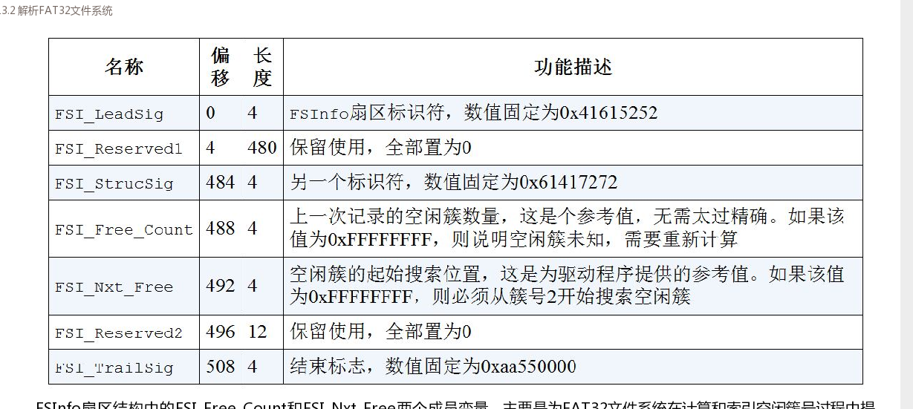

# 文件系统部分

包含内容
-  [1 部分概念说明](#c1)
-  [2 FAT32文件系统](#c2)

<h2>部分概念说明</h2>

文件是一个抽象的概念，它有组织地将多个数据块管理起来，以确保有足够的存储空间容纳数据。一个文件通常由文件信息和数据两部分组成，其中的文件信息记录着文件的使用时间、文件名、文件长度、数据扇区索引等内容，而数据区则记录着文件保存的实际数据。当文件的个数达到一定数量级后，管理文件就变成一件非常复杂的事情，如果借助文件系统来管理文件可使问题变得简单许多。

文件系统通常分为下面三个部分：

- **超级块**: 或者称为引导扇区  启动扇区。主要记录文件系统的全局信息。
- **目录项**: 目录项也会因文件系统的不同类型而千差万别，总体来说，其主要作用是为了保存目录的名字、长度、属性、数据块索引表以及相关操作时间等信息。文件在文件系统里的组织结构通常情况下与目录相同，它们都使用目录项统一进行管理，我们只需使用属性信息里的标志位便可对两者加以区分。数据块索引表记录着文件数据与数据块的线性映射关系，不同文件系统的索引方式千差万别，比如，FAT类文件系统采用类似单向链表的一维索引方式，而EXT类文件系统则采用类似页表的二维索引方式。
- **数据区**: 。文件与目录的不同最终体现在数据区，虽然两者保存的都是数据，但目录中保存的是维护目录层级关系的子目录项，这些子目录项可代表文件或子目录。目录项如此往复地逐层堆砌便形成了文件系统的树状结构。

这边区别可以参考fat12:直接到根目录区找到想要寻找的文件(文件名对比) 然后通过目录信息里的起始簇号去找对应fat表项目。看他是不是就这一个簇 还是记录了下一个簇号。

<h2>FAT32文件系统</h2>

这边还是分为引导扇区 FAT表 根目录区 以及数据区四个部分 这边也会说明下FSInfo的内容

- **引导扇区**: 和FAT12一样 还是存放文件系统相关信息.也叫引导扇区.存放在硬盘分区的的第一个扇区.下图是fat12 16 32等引导扇区的区别  这边说明几个有区别的字段:
    - BPB_RsvdSecCnt :这边是记录保留扇区所占的扇区数量.fat12 默认是1.而32则是不为0即可.当然长度还是2B
    - BPB_HiddSec: 隐藏扇区数 指的是LBA寻址0扇区和文件系统引导扇区间的扇区数量.
    - BPB_RootEntCnt: 根目录可以容纳的目录项数。这边FAT32为0。是通过根目录起始簇号开始找
    - BPB_RootClus:  仅fat32有效 指示根目录的起始簇号  通常为2 数据区也是2 因此fat32文件系统的根目录位于数据区的起始簇中。
    - BPB_FSInfo: 仅fat32中有效 只是FSInfo在保留区中的起始扇区号
    - BPB_BkBootSec: 仅fat32有效 指示引导扇区在保留区域中的备份位置(扇区号)。一般为6 一般也会备份FSInfo, 其一般紧随引导扇区之后 由此可以推算出fat32中数据区的起始扇区号:`BPB_RsvdSecCnt+BPB_FATSz32*BPB_NumFATs`.那么簇N的起始扇区号公式就是: `((N-2)*BPB_SecPerClus)+数据区起始扇区号` 这边说明目录项等也是作为0，1表项占用。
- **FSInfo**: 在FAT32文件系统中，FAT表是一个非常巨大的数据区域。当文件系统经过长时间使用后，计算和索引空闲簇号（FAT表项）等信息就变得非常耗时，尤其是在系统启动期间。鉴于此，FAT32文件系统在保留区域里加入了一个辅助性的扇区结构FSInfo，来帮助文件系统记录这些信息.相当于在操作的时候就把计算结果记录下来。但是仅供参考 不行还是得从簇号2开始开始索引。其结构如下: 
- **FAT表**:FAT12文件系统,它的每个FAT表项长度为12 bit.对于FAT16文件系统而言,其每个FAT表项长度为16 bit,以此类推,FAT32文件系统的每个FAT表项应该占用32 bit.虽然FAT32文件系统的每个FAT表项占用4 B空间,但实际上仅低28 bit是有效FAT表项位,高4 bit保留使用.在通常的文件系统操作过程中,文件系统管理程序只会修改FAT表项的低28 bit,高4 bit保留原值不变.只有在格式化FAT文件系统期间,才会对FAT表项的高4 bit进行更改.FAT32表项结构如下:  在FAT32文件系统中，FAT表项值xFFFFFF7h其实是可用值，但为了避免潜在的隐患，没有文件系统会使用该值。同时，在FAT16和FAT32文件系统中，虽然FAT[1]的高2 bit会另作他用，但通常情况下，FAT[1]的值为FFFFFFFFh。
- **根目录区和数据区**:FAT32文件系统在设计时，并未给根目录区分配独立的存储空间，而是将它包含在数据区内。此种设计的好处是根目录区能够动态增长，进而打破根目录在目录项数量方面的限制。不仅如此，FAT32文件系统在升级目录项结构的同时，还引入长目录项结构，使得文件名和目录名支持长达255个字符，并通过文件属性标志位来区分长短目录项结构。
- **短目录项**: 文件名是ascii编码  下图是短目录项的字段说明  其中时间日期格式如下  
- **长目录项**: 文件名改为unicode码。下图是长目录项的字段说明  如图 其中长目录项将文件名分为三个部分 其中必须以NUL空字符结尾 剩余空间填充0xFFFF.然后是序号，这边看出长目录项是由短目录项扩展来的，所以可能是多个短目录项组合，这边就是序号的用处，起始序号为1.如果是最后一个目录项(比如N)则该序号应该为(N|0x40)而不是N,也就是bit[6]必须置位。同时这边长目录项本身不记录簇等信息 而是存放在对应的短目录项中。然后是校验和，这是系统在校验之初计算的，主要用来匹配长目录项和短目录项。短目录项一般紧跟长目录项（长目录项按照倒叙排列 所以一般序号1后就是对应的短目录项），通过位置查找 然后通过校验和匹配。也就是说长目录项相当于短目录项的索引以及整个文件信息的摘要。

主磁盘分区 扩展磁盘分区以及逻辑分区的区别:

主磁盘分区是实际硬盘通过MBR主引导扇区的硬盘分区表划分的磁盘分区，共四项。然后因为希望一块磁盘分割跟多的分区就是有了扩展磁盘分区。这边分区表中只有两项:一项记录当前分区的类型、大小、起始LBA扇区号（相对）等信息；另一项称为逻辑分区，它记录着下一个分区的容量、起始LBA扇区号等内容，其类型值为05h。这边扩展分区装载的自然也不是文件系统而是一个个动态的磁盘分区。

下面是一个FAT32的实际例子。

 

 

这边空闲簇号从3开始 因为0，1预留 2给了根目录.

当磁盘分区被格式化为FAT32文件系统后，FAT表仅有前三项被初始赋值，剩余表项全部为0。

在文件创建期间，FAT32文件系统会先为文件创建目录项结构，并将其保存在目录的数据区内。只有在向文件写入数据时，文件系统才会为其分配可用簇号（FAT表项）；而在子目录创建期间，由于子目录始终不为空（含有代表当前目录名.和父目录名..的两个默认目录项），所以目录不但会为子目录创建目录项，还会为其分配可用簇号。

下图时fat32文件系统的一个概览的例子:

 

这边引导扇区部分 36扇区 包含了实际的mbr FSInfo  boot备份扇区等部分。然后时FAT表部分。接着是FAT表大小，再后面是根目录区。

除此之外，FAT32文件系统还要求同一目录里的长短文件名是唯一的。虽然长文件名可以保持唯一性，但短文件名仅记录着长文件名的前8个基础名字符，因此短文件名很难保证不重复。为了保证短文件名的唯一性，FAT32文件系统以这种"部分文件名"+"~N"的方式将重复的短文件名变成唯一的文件名标识。此处的字母N代表数字字符，它的取值范围是1~999999。如果重复的短文件名过多，FAT32文件系统会使用类似的快速算法去创建短文件名。

然后在除根目录的所有子目录中 fat32系统还会创建代表当前目录的`.`和父目录`..`.这边一个例子 在fat32文件系统中创建SubDIR子目录 然后再子目录中创建A.txt文件。然后可以看到SubDIR子目录的起始簇号为0003h。进入SubDIR子目录,观察SubDIR子目录中的全部目录项数据，此处共有三个有效目录项，它们分别是A.txt、.和..。其中的.目录的起始簇号为0003h，这与SubDIR子目录的起始簇号数值相同；而..目录的起始簇号为0000h，经过反复测试和验证，发现..目录的起始簇号应该与父目录的起始簇号数值相同，此处的起始簇号0000h应该代表根目录的起始簇号。

然后是一个长文件名的例子:

创建一个名为ABCDEFGHIJKLMNOPQRSTUVWXYZ 0123456789.txt的文件。

 

这边补充下文件名校验和公式:`checksum = ((checksum&1)?0x80:0)+(checksum>>1)+DIR_Name[n]`

就是说校验和 会根据上一轮校验和末尾bit是否为1(或者说奇偶) 是的话则是0x80 不然则是0 然后再加上上一轮校验和右移一位 再加上该字符。然后截取8bit.

