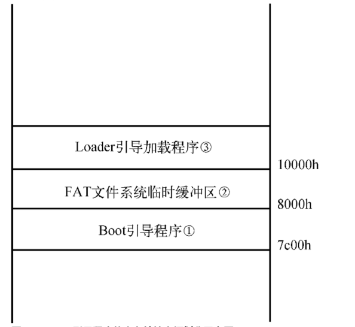

# 完善bootloader 功能

包含内容
-  [1 介绍](#c1)
-  [2 实模式下的4GB线性地址寻址](#c2)
-  [3 操作系统引导加载阶段的内存空间划分](#c3)
-  [4 硬件平台相关知识](#c4)
-  [5 完善bootloader](#c5) 

<h2>介绍</h2>

这是实模式1MB的物理内存区域

物理内存可使用的地址范围是0x00000~0x9FFFF，理论上这段空间的物理内存皆可使用，但实际分配的可用物理内存容量还需借助BIOS中断服务程序检测出来。通常情况下，物理地址范围0x00000~0x003FF中保存着BIOS的中断向量表(256X4B IVT)；物理地址范围0x00400~0x004FF中保存的是BIOS的数据区；物理地址范围0x00500~0x9FFFF是实模式的内存操作空间，各种程序都运行在这里，当然也包括0x7C00地址处的Boot引导程序。物理地址范围0xA0000~0xD0000是显存缓冲区，其中包含字符显存缓冲区和像素位图显存缓冲区等。随后的物理地址空间映射了控制卡的ROM BIOS或其他BIOS，而物理地址范围0xE0000~0x100000则是系统ROM BIOS的SHADOWED映射区，该区域是ROM BIOS在内存中复制的一个副本。本系统和Linux系统的引导加载阶段，都必须借助BIOS中断服务程序才能实现内核程序的加载和配置，一旦进入内核程序将无法再使用BIOS中断服务程序。因此，在BootLoader程序的引导加载阶段，应尽量合理分配物理内存以防止内存空间不足。或者使用特殊方法，将数据转存至1 MB以上的物理内存空间中，但在转存前必须增强处理器的物理地址寻址能力（可进行1 MB物理地址寻址），否则超过1 MB的物理地址只能在1 MB地址空间内回环。

实模式下的寻址最大时FFFF:FFFF 也就是10FFEF。但是8088处理器20条地址线最大只能支持到1M 所以10000-10FFEF的地址会被回环到0处重新计算。80286时拥有了24条地址线。为了判断是否需要回环，增加了A20地址线的控制逻辑门。随着物理平台的升级和演化，现在已经有多种开启和关闭A20地址线的方法，例如通过键盘控制器、操作I/O端口0x92、BIOS中断服务程序INT 15h以及读写端口0xee等方法，值得注意的是，I/O端口0x92的第0位用于向机器发送复位信号，置位端口0x92的第0位将使机器重新启动，所以在向I/O端口0x92写入数据时千万不要置位第0位。

<h2>实模式下的4GB线性地址寻址</h2>

Big Real Mode 也是 Unreal Mode 。这边借助保护模式的段寻址方法来实现。需要我们准备GDT以及代码段描述符和数据段描述符。然后开启A20地址线并跳转到保护模式。然后想目标段寄存器载入段选择子(同时cpu会在加载段选择子的时候加载段描述符的部分属性到段寄存器的隐藏部分(80bit?))然后再回到实模式。这样回到实模式的时候 缓存信息还在。这样处理器还是会使用保护模式的逻辑地址寻址方式。即base+32bitoffset.但是这时候不能再重新修改目标段寄存器了。

INT 15h，AX=E820h 功能：获取物理地址空间信息

- 调用传入值 
  - EAX=0000E820h
  - EDX=534D4150h(字符串'SMAP')
  - EBX=00000000h(起始映射结构体，其他值为后续映射结构体)
  - ECX=预设返回结果的缓存区结构体长度。字节为单位。
  - ES:DI 保存返回结果的缓存区地址
- 调用返回值
  - 如果CF=0 说明操作成功
    - EAX=534D4150h(字符串'SMAP')
    - ES:DI 保存返回结果的缓存区地址
    - EBX=00000000h(此值表示检测结束，其他值为后续映射信息结构体序号)
    - ECX=保存实际操作的缓存区结构体长度 字节为单位。
  - 如果CF=1 失败
    - AH=错误码(80h:无效命令。86h:不支持此功能)
  
(参考loader.asm)

这个BIOS中断服务程序需要执行多次，每次执行成功后，服务会返回一个非零值以表示后续映射信息结构体序号。该服务可返回物理内存地址段、设备映射到主板的内存地址段（包括ISA/PCI设备内存地址段和所有BIOS的保留区域段）以及地址空洞。
物理地址空间信息结构是一个占20 B的结构体，其中包含物理起始地址、空间长度和内存类型.结构说明如下:

物理地址空间的内存类型分为若干种，读者根据它们的内存类型可有效区分其应用场景。比较典型的内存类型是有效物理内存（类型值01h），其标识着当前地址空间为可用物理内存。如果硬件平台的内存容量过大，则BIOS中断服务程序可能会检测出多个可用物理内存段。更多内存类型定义见下图:

<h2>操作系统引导加载阶段的内存空间划分</h2>

- Boot引导程序执行阶段的内存地址空间划分: Boot引导程序的主要作用是从存储介质中加载Loader程序到内存，所以内存空间主要用于存储Loader程序。如果加载过程涉及文件系统的访问，那么Boot引导程序很可能需要为文件系统划分临时缓存区。该系统执行Boot引导程序阶段使用的内存地址空间:  
  1. 0x7c00开始的512B是boot程序。这段程序是在硬件平台上电时，由BIOS自动从存储介质中加载到物理地址0x7c00处的。这段内存空间固定留给Boot引导程序使用，当Boot程序执行结束后，此内存空间可另作他用。
  2. 本系统的LOADER程序保存在FAT12文件系统中。所以Boot引导程序访问FAT12文件系统需要临时数据缓存区来保存FAT表项和目录项等数据。从0x8000开始处的1k作为文件系统的临时数据缓存区(BOOT位于MBR主引导扇区)
  3. 物理地址0x10000处保存着读取的Loader引导加载程序。
- Loader引导加载程序执行阶段的内存地址空间划分情况: 由于Boot引导程序受限于MBR主引导扇区的容量（只有512 B）导致无法实现太多功能，所以绝大部分硬件数据采集工作都是由Loader引导加载程序完成的。由此可知，Loader引导加载程序将会开辟许多块内存地址空间来进行数据存储或临时缓存 内存结构如图:  
    1. 此时，物理地址0x7c00处依然保存着Boot引导程序，不过处理器的执行权已交给Loader引导加载程序，Boot引导程序占用的内存空间便可释放。现在物理地址0x7c00已作为栈基地址使用
    2. Loader引导加载程序执行的第一项工作是从FAT12文件系统中搜索内核文件kernel.bin，整个搜索过程依然使用物理地址0x8000处的1 KB内存空间来缓存文件系统的临时数据（FAT表项和目录项）。
    3. 在搜索到内核文件kernel.bin后，Loader引导加载程序并未直接使用BIOS中断服务程序将内核文件读取到物理地址1 MB处，而是暂将1个簇的数据缓存到物理地址0x7e00处
    4. Loader引导加载程序先从软盘中读取1个簇的内核文件kernel.bin数据到物理地址0x7e00处后，再把物理地址0x7e00处缓存的数据逐字节复制到物理地址1 MB处。步骤(3)和步骤(4)循环执行，直至内核文件kernel.bin加载结束。
    5. 当内核文件kernel.bin加载至1 MB处的内存空间后，物理地址0x7e00处的内核文件临时缓存区方可另作他用，稍后它将作为物理地址空间信息的存储空间使用。
    6. Loader引导加载程序将通过BIOS中断服务程序获取VBE信息，这些信息会保存在物理地址0x8000处。
    7. 当取得VBE信息后，Loader引导加载程序还要根据VBE提供的信息再取得显示模式信息（通过BIOS中断服务程序来获取），有了显示模式信息便可配置出适合自己的显示模式。
    8. 步骤(5)、步骤(6)和步骤(7)均是通过BIOS中断服务程序获取的硬件设备信息，随着硬件设备信息获取结束，处理器将进入保护模式。保护模式将使用物理地址0x90000处的几个物理页（4 KB）作为保护模式的临时页表。（保护模式的页表数据集成于Loader引导加载程序内，当Loader引导加载程序被读取至内存后，这就意味着页表项数据已经准备就绪。）

<h2>硬件平台相关知识</h2>

- USB-FDD是模拟软盘启动模式，它可使BIOS系统将U盘模拟成软盘进行引导。
- USB-ZIP是模拟大容量软盘启动模式，在某些老式电脑上它是唯一可选的U盘启动模式，该模式对大部分新式电脑的兼容性不好。
- USB-HDD是模拟硬盘启动模式，它可使BIOS系统将U盘模拟成硬盘进行引导。

 下面看下FDD和HDD的操作流程

- **USB-FDD模拟软盘启动模式**
    首先，使用磁盘管理软件DiskGenius清空U盘扇区里的所有数据，然后再格式化U盘。这里请读者一定要注意，不要只格式化U盘，而忽视或忘记清空U盘扇区里的所有数据。如果只格式化U盘的话，虽然U盘里的文件系统是空的，但U盘的扇区里仍然残留着格式化以前的数据（脏数据），相信知晓文件系统原理的读者应该会理解其中的缘由，这也是误删除后的文件依然能够被找回来的原因。
    清空U盘扇区内的数据后，将U盘的启动模式选择为USB-FDD虚拟软盘启动模式，随后软件会弹出图7-6所示的对话框。注意，一定要把指派驱动器号、扫描坏扇区、建立DOS系统等选项勾选掉，只有这样才能保证U盘里是一个干净的文件系统。
- **USB-HDD模拟硬盘启动模式**
    软盘引导扇区包括引导代码和结束符0xAA55两部分，它们加在一起是512 B。而硬盘引导扇区则由引导代码、硬盘分区表、结束符0xAA55三部分组成，因此硬盘引导扇区被分成引导代码(0x000~0x1BD)、硬盘分区表(0x1BE~0x1FD)以及结束符0xAA55三段，其中的硬盘分区表共包含4项，每项占16 B的磁盘空间。
    由于刚才只创建了一个主硬盘分区，故此图7-10中的硬盘分区表只含有一个表项，其表项值为80h、01h、01h、00h、01h、FEh、3Fh、01h、3Fh、00h、00h、00h、43h、7Dh、00h和00h，其他三个硬盘分区表项值均为00h。那么这16 B代表的含义如下图:  

这边是CHS和LBA扇区寻址模式的区别。一个是柱面磁头扇区寻址 一个是逻辑块寻址(类似线性)

下图是硬盘结构说明:

 

- **CHS扇区寻址模式**
    传统的CHS扇区寻址模式，必须借助目标扇区号、磁头号、磁道号才能定位到具体扇区。对于软盘和硬盘的扇区读取操作，使用BIOS中断服务程序INT 13h的主功能号AH=02h即可.补充说明的一点是保存磁盘驱动器号的DL寄存器，软盘驱动器号从00h开始，00h代表第一个软盘驱动器，01h代表第二个软盘驱动器；而硬盘驱动器号则从80h开始，80h代表第一个硬盘驱动器号，81h代表第二个硬盘驱动器号。如果将BIOS设置为软盘驱动器引导，那么引导程序所在的软盘驱动器就是第一个软盘驱动器（在Windows里字母作为驱动器序号，此时的软盘驱动器号为A），所以DL寄存器保存的驱动器号为0，读者不必纠结哪个软驱是A，哪个软驱是B，硬盘亦是如此，向DL寄存器赋值80h即可。一旦操作系统引导启动，操作系统便摆脱BIOS中断服务程序的制约，进而可以编写驱动程序重新分配磁盘驱动器号。
- **LBA（Logical Block Address，逻辑块寻址）扇区寻址模式**
    对于U盘和固态硬盘等没有扇区、磁头、磁道等物理结构（机械结构）的存储介质而言，该如何编写它们的扇区访问程序呢？其实，BIOS早已为我们解决了这个问题。BIOS采用一种新型的LBA扇区寻址模式，可使用逻辑顺序号直接访问扇区。LBA扇区寻址模式的逻辑顺序号从0开始，序号0代表磁盘的第一个扇区号（即引导扇区MBR），序号1代表磁盘的第二个扇区号，依此类推。对于LBA扇区寻址模式，BIOS在中断服务程序INT 13h中引入了全新的主功能号AH=42h来实现LBA型扇区读取操作，该中断服务程序的各寄存器参数说明如下:
     INT 13h，AH=42h 功能：磁盘读取扩展操作。 
    - DL=磁盘驱动器号
    - DS:SI Disk Address Packet
  
    DS:SI值解释如下:   硬盘地址包结构可分为16 B和24 B两种长度。在16 B型硬盘地址包结构中，传输缓存区地址采用32位地址位宽；而在24 B型硬盘地址包结构中，如果偏移04h处的传输缓存区地址值（32位）为FFFFh：FFFFh，那么传输缓存区地址将采用64位地址位宽。

<h2>完善bootloader</h2>

上图是FAT12修改后的版本。增加了FAT目录扇区数目等。

这里跳过物理平台部分。