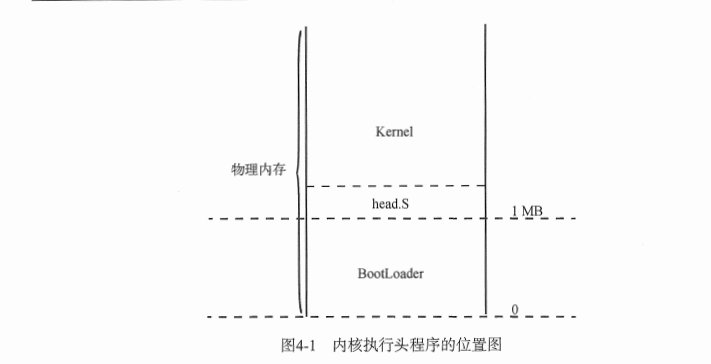

# 内核层开始

包含内容
- [1.内核执行头程序](#c1-1)
    -  [1.1 内核头程序简述](#c1-1)
    -  [1.2 x64分页机制简述](#c1-2)
    -  [1.3 Makefile简介](#c1-3) 
- [2.系统异常](#c2)
    - [2.1 异常分类以及处理](#c2-1)
        - [汇编调用c约定](#c2-1-1)
        - [c内嵌汇编](#c2-1-2)
- [3.BootLoader引导启动程序](#c3)
    - [3.1 Boot引导程序](#c3-1)
        - [FAT12文件系统](#c3-1-1)
    - [3.2 Loader程序](#c3-2)
    - [3.3 实模式到保护模式到IA-32e模式](#c3-3)
        - [实模式到保护模式](#c3-3-1)
        - [保护模式到IA-32e模式](#c3-3-2)


TIP:(开始使用AT&T格式的GAS汇编语言)
<div id=c1><h2>内核执行头程序</h2></div>
<div id=c1-1><h3>内核头程序简述</h3></div>

内核头程序:当引导程序加载完成并移交控制权后，还需要内核头程序为操作系统创建段结构和页表结构 设置某些结构的默认处理函数 配置关键寄存器等工作。然后才继续执行一个远跳转进入系统内核主程序。其中boot,loader,头程序，内核主程序地址空间位置如图:



这里需要注意的是确保头程序在编译生成到内核程序的开头处。这就需要手动编写内核程序的链接脚本。此处记住线性地址的0xffff80000000000对应物理地址的0处 然后内核程序的线性地址就是0xffff80000000000+0x100000处即可(TODO)

<div id=c1-2><h3>x64分页机制简述</h3></div>

转自 [x64四级分页机制](https://www.cnblogs.com/revercc/p/16041279.html)

简单流程

cr3->PML4T(page map lv4 table )->PDPT(page-directory-pointer table)->PDT(page directory talbe)->PT (page table )
cr3直接找到PML4T的物理地址 然后根据l4 index找到PDPT 然后根据l3index 找到PDT 然后根据l2index找到 PTT 然后根据l1index 在PTT中找到实际物理帧地址


因为硬件限制64位系统只使用64位虚拟地址的低48位，48位虚拟地址被分为9-9-9-9-12，4个9分别表示PML4T,PDPT,PDT,PTT的PFN页帧编号(与物理页帧区分)
（这里offset12 代表的是4kib的分页 如果3j自然是变为9+12=21 offset 那就是2Mb 同理还有1GB）
线性地址/虚拟地址结构如下（也可以参见blogos中paging-introducation.md）:

<br>
其中还有置零的16位符号拓展位略  cr3指向的就是PML4T cr3得12-35bit是物理地址的高24 低12位置零。

如图:

<br>

PML4E(page map lv4 entry)的35-12位为PDPT页目录指针表物理地址的高24位，低12位置0。如图（全图）


这里如果PDPTE的PS [page size?]（bit[7]）位置1表示开启1G大页 那么就没有PDT和PTE了。这里的35-30bit 就直接是物理地址的高6位 低30位置零。偏移地址就是9+9+12的值 提下每个bit[0]或者present位表示页表或物理页是否加载到主内存中。 基本都是置1
同理 如果PDTE的PS置1则是开2MB中页 那就没有PT了 他的35-21bit是物理地址的高15位。低21位置零 offset 9+12。不然 35-12位是PT的物理地址。

最后PTE的35-12位是物理内存的起始地址

这里补充下 实模式/16bit 到保护模式/32bit(这里可能有IA-32) 到IA-32e/bit64模式的寻址变化

16bit base*16+offset 32bit 段寄存器里放的是选择子 然后再去描述符表找base。（可能存在4GB平坦内存寻址） 64位基本放弃分段 段寄存器无论是什么 base 都视为零 。这里是方便记忆理解 不一定准确。比如还有PAE的寻址模式这些。

<div id=c1-3><h3>Makefile简介</h3></div>

```makefile
# Makefile for boot
# Programs, flags, etc.
ASM             = nasm
ASMFLAGS        = -I include/# This Program
TARGET          = boot.bin loader.bin# All Phony Targets
.PHONY : everything clean all# Default starting position
everything : $(TARGET)

clean :
    rm -f $(TARGET)

all : clean everything

boot.bin : boot.asm include/load.inc include/fat12hdr.inc
    $(ASM) $(ASMFLAGS) -o $@ $<

loader.bin : loader.asm include/load.inc include/fat12hdr.inc include/pm.inc
    $(ASM) $(ASMFLAGS) -o $@ $<
```

这里一个实例。然后分开看看。
首先`#`开头的行时注释 `=`定义变量。下面的`ASM`和`ASMFLAGS`就是变量。使用的时候要用`$(ASM)`的形式。

```makefile
ASM             = nasm
ASMFLAGS        = -I include/# This Program
TARGET          = boot.bin loader.bin# All Phony Targets
```


Makefile最重要的语法：
```makefile
target : prerequisites
    command
```
这个代表两个意思：

1. 想要得到target 需要执行命令command(缩进tab)
2. target 依赖 prerequisites.当prerequisites中至少有一个文件比target文件新时，command才被执行。

举个例子:

```makefile
loader.bin : loader.asm include/load.inc include/fat12hdr.inc include/pm.inc
        $(ASM) $(ASMFLAGS) -o $@ $<
```
这段代码的意思就是想要得到`loader.bin`需要执行`$(ASM) $(ASMFLAGS) -o $@ $<`这段命令。然后`loader.bin`依赖一下文件：

- loader.asm
- include/load.inc
- include/fat12hdr
- include/pm.inc

这四个文件有一个更新时 command会被执行。

然后`$@`和`$<`的含义如下:

- `$@`代表target
- `$<`代表prerequisites的第一个名字

那么结合使用变量的语法，`$(ASM) $(ASMFLAGS) -o $@ $<`翻译过来就是`nasm -I include/ -o loader.bin loader.asm`

然后时这部分语法

```makefile
everything : $(TARGET)

clean :
        rm -f $(TARGET)

all : clean everything
```

这代表三个指令动作,对应 `make clean` 就是执行`rm -f boot.bin loader.bin`。`make all`就是分别执行 `make clean`然后执行`everything`。`everything`其实就是生成两个bin目标项

然后是`.PHONY`这个显式声明几个动作标号，这里就是`everything clean all`这三个(不代表仅有这三个 这个是问了防止重名的)。然后`make`默认执行的就是第一个遇到的标号，这里就是默认执行`everything`的动作。和`.PHONY`里定义的顺序无关。参见下面这个例子

```makefile
ECHO=echo
goal=test
PRE=pre
TARGET=pre test
.PHONY: everything first clean all
zero:
	echo "zero"
first:
	$(ECHO) "123" > $(PRE)
everything: $(goal)
clean:
	rm -rf $(TARGET)

all: clean first everything

test:pre
	cat pre > $@
```

这里默认执行的是`zero` 也就是执行`echo "zero"`。这里需要注意的是 `.PHONY`其实是为了解决标号和目标文件冲突的问题。目标文件也是可以作为标号的。也就是说如果`test:pre`放到`zero`前，那么make默认执行的就是他。但是会因为依赖的`pre`不存在报错

这里贴下显示模式中分辨率坐标系图:


这里是测试时控制屏幕颜色的代码

```c
void Start_Kernel(void)
{
	// header.S 中将帧缓存的物理地址(0xe0000000) 映射到0xffff800000a00000和0xa00000处
	// loader设置了显示模式(（模式号：0x180、分辨率：1440×900、颜色深度：32 bit  4字节表示一个像素点）)
	// Loader引导加载程序设置的显示模式可支持32位颜色深度的像素点，其中0~7位代表蓝颜色(0x000000ff）)，8~15位代表绿颜色(0x0000ff00)，16~23位代表红颜色(0x00ff0000)，白色(0x00ffffff) 24~31位是保留位。
	// 这32 bit位值可以组成16 M种不同的颜色，可以表现出真实的色彩
	int *addr = (int *)0xffff800000a00000;
	int i;

    // 画20行的红色（小端序） 下面同理 20行的绿色 和20行的蓝色 最后时20行的白色
	for(i = 0 ;i<1440*20;i++)
	{
		*((char *)addr+0)=(char)0x00;
		*((char *)addr+1)=(char)0x00;
		*((char *)addr+2)=(char)0xff;
		*((char *)addr+3)=(char)0x00;	
		addr +=1;	
	}
	for(i = 0 ;i<1440*20;i++)
	{
		*((char *)addr+0)=(char)0x00;
		*((char *)addr+1)=(char)0xff;
		*((char *)addr+2)=(char)0x00;
		*((char *)addr+3)=(char)0x00;	
		addr +=1;	
	}
	for(i = 0 ;i<1440*20;i++)
	{
		*((char *)addr+0)=(char)0xff;
		*((char *)addr+1)=(char)0x00;
		*((char *)addr+2)=(char)0x00;
		*((char *)addr+3)=(char)0x00;	
		addr +=1;	
	}
	for(i = 0 ;i<1440*20;i++)
	{
		*((char *)addr+0)=(char)0xff;
		*((char *)addr+1)=(char)0xff;
		*((char *)addr+2)=(char)0xff;
		*((char *)addr+3)=(char)0x00;	
		addr +=1;	
	}

	while(1)
		;
}
```


<div id=c2><h2>系统异常</h2></div>
<div id=c1-1><h3>异常的分类以及处理</h3></div>

处理器根据异常的报告方式、任务或程序是否可继续执行（从产生异常的指令开始）等因素，大体上会将异常分为错误、陷阱、终止三类。

- 错误（fault）。错误是一种可被修正的异常。只要错误被修正，处理器可将程序或任务的运行环境还原至异常发生前（已在栈中保存CS和EIP寄存器值），并重新执行产生异常的指令，也就是说异常的返回地址指向产生错误的指令，而不是其后的位置。
- 陷阱（trap）。陷阱异常同样允许处理器继续执行程序或任务，只不过处理器会跳过产生异常的指令，即陷阱异常的返回地址指向诱发陷阱指令之后的地址。
- 终止（abort）。终止异常用于报告非常严重的错误，它往往无法准确提供产生异常的位置，同时也不允许程序或任务继续执行，典型的终止异常有硬件错误或系统表存在不合逻辑、非法值。

处理异常或者中断 其中根据异常/中断向量取IDT中索引处对应的门描述符 然后定位到异常处理程序。如果IDT中索引到的是中断门或者陷阱门  类似汇编CALL执行处理程序。如果是任务门则处理器发生任务切换 转而执行异常任务或中断任务、也是类似CALL

- 异常/中断的处理步骤。图4-6描述了处理器执行中断/异常处理程序的过程。处理器会根据中断/异常向量号从中断描述符表IDT检索出对应的门描述符（中断门或陷阱门，Interrupt or Trap Gate），并读取门描述符保存的段选择子。随后，从GDT或LDT描述符表中检索出处理程序所在代码段，再根据门描述符记录的段内偏移量，来确定中断/异常处理程序的入口地址。如下图:<br><br>

其中跳转之前 会检查特权级。如果处理程序所在代码段的特权级高于当前代码段，那么就会切换栈空间.其中切换栈空间步骤如下:
1. 从任务状态段TSS中取出对应特权级的栈段选择子和栈指针。将他们作为中断/异常处理程序的栈空间进行切换。会把切换前的SS ESP寄存器值压入处理。
2. 保存被中断程序的EFLAGS,CS和EIP寄存器入栈
3. 如果产生错误码 错误码也入栈  （分别是SS ESP EFLAGS CS EIP ERRORCODE 入栈）
   


如果特权级相等则只需要执行上面的2，3步骤。EFLAGS CS EIP ERRORCODE入当前栈。如下图


这里的图都是上低下高？看图示 前后的ESP位置可以得出 入栈顺序即上面文字描述。

中断门与陷阱门的不同之处在于执行处理程序时对IF标志位（位于标志寄存器EFLAGS中）的操作。中断门会复位IF以屏蔽其他中断请求的干扰。陷阱则不会。

中断门和陷阱门类似 借助段描述符和偏移跳转。任务门则通过指向的TSS描述符。调用门也是描述符+偏移。

门结构如下图:


在x64模式下，大部分编译器采用寄存器传递参数，参数按照从左向右的顺序依次是RDI、RSI、RDX、RCX、R8、R9，剩余参数使用内存传递方式，RAX放置函数的返回值，调用者负责平衡栈。


