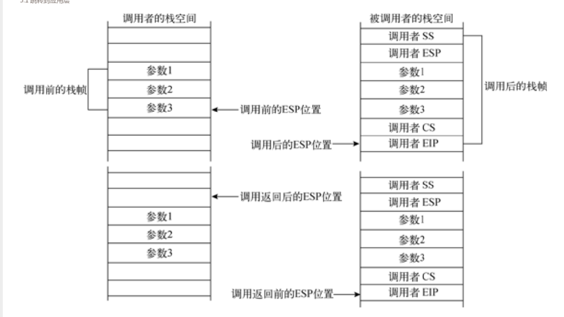

# 内核层开始

包含内容
- [1.内核执行头程序](#c1-1)
    -  [1.1 内核头程序简述](#c1-1)
    -  [1.2 x64分页机制简述](#c1-2)
    -  [1.3 Makefile简介](#c1-3) 
- [2.系统异常](#c2)
    - [2.1 异常分类以及处理](#c2-1)
- [3.内存管理](#c3)
    - [3.1 初级内存管理](#c3-1)
    - [3.2 中断处理](#c3-2)
- [4.进程管理](#c4)
	- [4.1 简介](#c4-1)
	- [4.2 内核跳转到应用层](#c4-2)


TIP:(开始使用AT&T格式的GAS汇编语言)

一张程序内存结构图(摘自 https://www.jianshu.com/p/b1debc1b1a54) 我的数据跑出来和他差了1000 TODO 相当于多了一个4k


这里算下(都是16进制)  bits_map address 是114000 然后length=100 size=800
所以4k向上对齐就是 114000+100+1000-1=115099 mask 后是115000

同理
page 115000+14000+1000-1=129999 mask 是129000

zone 129000+50++1000-1=130049 mask = 130000
```
物理地址
0x00                        0x100000                        0x200000
|-------------------------------|-------------------------------|--------------------
0                              1MB                             2MB  

起始物理地址
---- 0x00 ~ 0x1FFFFF ----
0x7c00  boot.bin
0x7E00  INT 15H获取的物理地址空间信息
0x8000  软盘根目录区或FAT表读入缓冲区
0x10000 Loader.bin
0x100000    kernel.bin
    0x100000 + 0x1000 PML4
    0x100000 + 0x2000 PDPT
    0x100000 + 0x3000 PDE
    0x100000 +        GDT IDT TSS

0x115000    struct bits map
0x116000    struct pages
0x12a000    struct zones

---- 0x200000 ~~~
    
```


<div id=c1><h2>内核执行头程序</h2></div>
<div id=c1-1><h3>内核头程序简述</h3></div>

内核头程序:当引导程序加载完成并移交控制权后，还需要内核头程序为操作系统创建段结构和页表结构 设置某些结构的默认处理函数 配置关键寄存器等工作。然后才继续执行一个远跳转进入系统内核主程序。其中boot,loader,头程序，内核主程序地址空间位置如图:


这里需要注意的是确保头程序在编译生成到内核程序的开头处。这就需要手动编写内核程序的链接脚本。此处记住线性地址的0xffff80000000000对应物理地址的0处 然后内核程序的线性地址就是0xffff80000000000+0x100000处即可(TODO)

<div id=c1-2><h3>x64分页机制简述</h3></div>

转自 [x64四级分页机制](https://www.cnblogs.com/revercc/p/16041279.html)

简单流程

cr3->PML4T(page map lv4 table )->PDPT(page-directory-pointer table)->PDT(page directory talbe)->PT (page table )
cr3直接找到PML4T的物理地址 然后根据l4 index找到PDPT 然后根据l3index 找到PDT 然后根据l2index找到 PTT 然后根据l1index 在PTT中找到实际物理帧地址


因为硬件限制64位系统只使用64位虚拟地址的低48位，48位虚拟地址被分为9-9-9-9-12，4个9分别表示PML4T,PDPT,PDT,PTT的PFN页帧编号(与物理页帧区分)
（这里offset12 代表的是4kib的分页 如果3j自然是变为9+12=21 offset 那就是2Mb 同理还有1GB）
线性地址/虚拟地址结构如下（也可以参见blogos中paging-introducation.md）:

<br>
其中还有置零的16位符号拓展位略  cr3指向的就是PML4T cr3得12-35bit是物理地址的高24 低12位置零。

如图:

<br>

PML4E(page map lv4 entry)的35-12位为PDPT页目录指针表物理地址的高24位，低12位置0。如图（全图）


这里如果PDPTE的PS [page size?]（bit[7]）位置1表示开启1G大页 那么就没有PDT和PTE了。这里的35-30bit 就直接是物理地址的高6位 低30位置零。偏移地址就是9+9+12的值 提下每个bit[0]或者present位表示页表或物理页是否加载到主内存中。 基本都是置1
同理 如果PDTE的PS置1则是开2MB中页 那就没有PT了 他的35-21bit是物理地址的高15位。低21位置零 offset 9+12。不然 35-12位是PT的物理地址。

最后PTE的35-12位是物理内存的起始地址

这里补充下 实模式/16bit 到保护模式/32bit(这里可能有IA-32) 到IA-32e/bit64模式的寻址变化

16bit base*16+offset 32bit 段寄存器里放的是选择子 然后再去描述符表找base。（可能存在4GB平坦内存寻址） 64位基本放弃分段 段寄存器无论是什么 base 都视为零 。这里是方便记忆理解 不一定准确。比如还有PAE的寻址模式这些。

<div id=c1-3><h3>Makefile简介</h3></div>

```makefile
# Makefile for boot
# Programs, flags, etc.
ASM             = nasm
ASMFLAGS        = -I include/# This Program
TARGET          = boot.bin loader.bin# All Phony Targets
.PHONY : everything clean all# Default starting position
everything : $(TARGET)

clean :
    rm -f $(TARGET)

all : clean everything

boot.bin : boot.asm include/load.inc include/fat12hdr.inc
    $(ASM) $(ASMFLAGS) -o $@ $<

loader.bin : loader.asm include/load.inc include/fat12hdr.inc include/pm.inc
    $(ASM) $(ASMFLAGS) -o $@ $<
```

这里一个实例。然后分开看看。
首先`#`开头的行时注释 `=`定义变量。下面的`ASM`和`ASMFLAGS`就是变量。使用的时候要用`$(ASM)`的形式。

```makefile
ASM             = nasm
ASMFLAGS        = -I include/# This Program
TARGET          = boot.bin loader.bin# All Phony Targets
```


Makefile最重要的语法：
```makefile
target : prerequisites
    command
```
这个代表两个意思：

1. 想要得到target 需要执行命令command(缩进tab)
2. target 依赖 prerequisites.当prerequisites中至少有一个文件比target文件新时，command才被执行。

举个例子:

```makefile
loader.bin : loader.asm include/load.inc include/fat12hdr.inc include/pm.inc
        $(ASM) $(ASMFLAGS) -o $@ $<
```
这段代码的意思就是想要得到`loader.bin`需要执行`$(ASM) $(ASMFLAGS) -o $@ $<`这段命令。然后`loader.bin`依赖一下文件：

- loader.asm
- include/load.inc
- include/fat12hdr
- include/pm.inc

这四个文件有一个更新时 command会被执行。

然后`$@`和`$<`的含义如下:

- `$@`代表target
- `$<`代表prerequisites的第一个名字

那么结合使用变量的语法，`$(ASM) $(ASMFLAGS) -o $@ $<`翻译过来就是`nasm -I include/ -o loader.bin loader.asm`

然后时这部分语法

```makefile
everything : $(TARGET)

clean :
        rm -f $(TARGET)

all : clean everything
```

这代表三个指令动作,对应 `make clean` 就是执行`rm -f boot.bin loader.bin`。`make all`就是分别执行 `make clean`然后执行`everything`。`everything`其实就是生成两个bin目标项

然后是`.PHONY`这个显式声明几个动作标号，这里就是`everything clean all`这三个(不代表仅有这三个 这个是为了了防止重名的导致step不执行)。然后`make`默认执行的就是第一个遇到的标号，这里就是默认执行`everything`的动作。和`.PHONY`里定义的顺序无关。参见下面这个例子

```makefile
ECHO=echo
goal=test
PRE=pre
TARGET=pre test
.PHONY: everything first clean all
zero:
	echo "zero"
first:
	$(ECHO) "123" > $(PRE)
everything: $(goal)
clean:
	rm -rf $(TARGET)

all: clean first everything

test:pre
	cat pre > $@
```

这里默认执行的是`zero` 也就是执行`echo "zero"`。这里需要注意的是 `.PHONY`其实是为了解决标号和目标文件冲突的问题。目标文件也是可以作为标号的。也就是说如果`test:pre`放到`zero`前，那么make默认执行的就是他。但是会因为依赖的`pre`不存在报错

这里贴下显示模式中分辨率坐标系图:


这里是测试时控制屏幕颜色的代码

```c
void Start_Kernel(void)
{
	// header.S 中将帧缓存的物理地址(0xe0000000) 映射到0xffff800000a00000和0xa00000处
	// loader设置了显示模式(（模式号：0x180、分辨率：1440×900、颜色深度：32 bit  4字节表示一个像素点）)
	// Loader引导加载程序设置的显示模式可支持32位颜色深度的像素点，其中0~7位代表蓝颜色(0x000000ff）)，8~15位代表绿颜色(0x0000ff00)，16~23位代表红颜色(0x00ff0000)，白色(0x00ffffff) 24~31位是保留位。
	// 这32 bit位值可以组成16 M种不同的颜色，可以表现出真实的色彩
	int *addr = (int *)0xffff800000a00000;
	int i;

    // 画20行的红色（小端序） 下面同理 20行的绿色 和20行的蓝色 最后时20行的白色
	for(i = 0 ;i<1440*20;i++)
	{
		*((char *)addr+0)=(char)0x00;
		*((char *)addr+1)=(char)0x00;
		*((char *)addr+2)=(char)0xff;
		*((char *)addr+3)=(char)0x00;	
		addr +=1;	
	}
	for(i = 0 ;i<1440*20;i++)
	{
		*((char *)addr+0)=(char)0x00;
		*((char *)addr+1)=(char)0xff;
		*((char *)addr+2)=(char)0x00;
		*((char *)addr+3)=(char)0x00;	
		addr +=1;	
	}
	for(i = 0 ;i<1440*20;i++)
	{
		*((char *)addr+0)=(char)0xff;
		*((char *)addr+1)=(char)0x00;
		*((char *)addr+2)=(char)0x00;
		*((char *)addr+3)=(char)0x00;	
		addr +=1;	
	}
	for(i = 0 ;i<1440*20;i++)
	{
		*((char *)addr+0)=(char)0xff;
		*((char *)addr+1)=(char)0xff;
		*((char *)addr+2)=(char)0xff;
		*((char *)addr+3)=(char)0x00;	
		addr +=1;	
	}

	while(1)
		;
}
```


<div id=c2><h2>系统异常</h2></div>
<div id=c2-1><h3>异常的分类以及处理</h3></div>

处理器根据异常的报告方式、任务或程序是否可继续执行（从产生异常的指令开始）等因素，大体上会将异常分为错误、陷阱、终止三类。

- 错误（fault）。错误是一种可被修正的异常。只要错误被修正，处理器可将程序或任务的运行环境还原至异常发生前（已在栈中保存CS和EIP寄存器值），并重新执行产生异常的指令，也就是说异常的返回地址指向产生错误的指令，而不是其后的位置。
- 陷阱（trap）。陷阱异常同样允许处理器继续执行程序或任务，只不过处理器会跳过产生异常的指令，即陷阱异常的返回地址指向诱发陷阱指令之后的地址。
- 终止（abort）。终止异常用于报告非常严重的错误，它往往无法准确提供产生异常的位置，同时也不允许程序或任务继续执行，典型的终止异常有硬件错误或系统表存在不合逻辑、非法值。

处理异常或者中断 其中根据异常/中断向量取IDT中索引处对应的门描述符 然后定位到异常处理程序。如果IDT中索引到的是中断门或者陷阱门  类似汇编CALL执行处理程序。如果是任务门则处理器发生任务切换 转而执行异常任务或中断任务、也是类似CALL

- 异常/中断的处理步骤。图4-6描述了处理器执行中断/异常处理程序的过程。处理器会根据中断/异常向量号从中断描述符表IDT检索出对应的门描述符（中断门或陷阱门，Interrupt or Trap Gate），并读取门描述符保存的段选择子。随后，从GDT或LDT描述符表中检索出处理程序所在代码段，再根据门描述符记录的段内偏移量，来确定中断/异常处理程序的入口地址。如下图:<br><br>

其中跳转之前 会检查特权级。如果处理程序所在代码段的特权级高于当前代码段，那么就会切换栈空间.其中切换栈空间步骤如下:
1. 从任务状态段TSS中取出对应特权级的栈段选择子和栈指针。将他们作为中断/异常处理程序的栈空间进行切换。会把切换前的SS ESP寄存器值压入处理。
2. 保存被中断程序的EFLAGS,CS和EIP寄存器入栈
3. 如果产生错误码 错误码也入栈  （分别是SS ESP(32bit) EFLAGS(32bit) CS EIP ERRORCODE(64bit) 入栈）
   


如果特权级相等则只需要执行上面的2，3步骤。EFLAGS CS EIP ERRORCODE入当前栈。如下图


中断门与陷阱门的不同之处在于执行处理程序时对IF标志位（位于标志寄存器EFLAGS中）的操作。中断门会复位IF以屏蔽其他中断请求的干扰。陷阱则不会。

中断门和陷阱门类似 借助段描述符和偏移跳转。任务门则通过指向的TSS描述符。调用门也是描述符+偏移。

门结构如下图:


在x64模式下，大部分编译器采用寄存器传递参数，参数按照从左向右的顺序依次是RDI、RSI、RDX、RCX、R8、R9，剩余参数使用内存传递方式，RAX放置函数的返回值，调用者负责平衡栈。


这里描述下有错误码和无错误码异常的区别。

外部中断或者INT n指令均不会产生错误码。如果异常产生的原因关系到一个特殊的段选择子或者IDT向量，那么处理器会在异常处理栈中存入错误码。执行IRET不会弹出错误码  所以需要我们手动弹出。#TS错误码格式如下:

<br>

- EXT。如果该位被置位，说明异常是在向程序投递外部事件的过程中触发，例如一个中断或一个更早期的异常。
- IDT。如果该位被置位，说明错误码的段选择子部分记录的是中断描述符表IDT内的门描述符；而复位则说明其记录的是描述符表GDT/LDT内的描述符。
- TI。只有当IDT标志位复位时此位才有效。如果该位被置位，说明错误码的段选择子部分记录的是局部描述符表LDT内的段描述符或门描述符；而复位则说明它记录的是全局描述符表GDT的描述符。

错误码的段选择子部分可以索引IDT、GDT或LDT等描述符表内的段描述符或门描述符。在某些条件下，错误码是NULL值（除EXT位外所有位均被清零），这表明错误并非由引用特殊段或访问NULL段描述符而产生。

#PF错误码说明如下:

页错误异常的错误码格式与其他异常的错误码完全不同，处理器使用5个标志位来描述页错误异常，下图是页错误异常的错误码格式。 


- P标志位指示异常是否由一个不存在的页所引发（P=0），或者进入了违规区域（P=1），亦或使用保留位（P=1）。
- W/R标志位指示异常是否由读取页（W/R=0）或写入页（W/R=1）所产生。
- U/S标志位指示异常是否由用户模式（U/S=1）或超级模式（U/S=0）所产生。
- 当CR4控制寄存器的PSE标志位或PAE标志位被置位时，处理器将检测页表项的保留位，RSVD标志位指示异常是否由置位保留位所产生。
- I/D标志位指示异常是否由获取指令所产生。CR2控制寄存器。CR2控制寄存器保存着触发异常时的线性地址，异常处理程序可根据此线性地址定位到页目录项和页表项。页错误处理程序应该在第二个页错误发生前保存CR2寄存器的值，以免再次触发页错误异常。


<div id=c3><h2>内存管理</h2></div>
<div id=c3-1><h3>初级内存管理</h3></div>

代码结构体设计如下:


<div id=c3-2><h3>中断处理</h3></div>

这里使用8259A PIC 学习。后面再APIC.

芯片结构如下:


其引脚接口如下:


内部结构如下图:


主要通过ICW(initialization command word 初始化命令字 用于初始化中断控制器。)寄存器组和OCW（operational control word 操作控制字 操作控制器）寄存器组控制。主芯片映射到20h(ICW1,OCW2-3) 和 21h（ICW 2-4 ,OCW1）端口  从芯片映射到A0h(ICW1,OCW2-3) 和 A1h(ICW2-4,OCW1).

- IRR  (interrupt request register)中断请求控制器.保存IR0~IR7引脚上接受的中断请求。8bit
- IMR  (interrupt mask register) 中断屏蔽寄存器 纪录屏蔽的外部引脚 同样8bit
- PR (priority resolver)优先级解析器 从IRR中接受的中断请求中选取最高优先级 发到ISR
- ISR (In-service register) 正在服务寄存器。 纪录正在处理的中断请求。 8259芯片会向cpu发送一个INT信号。CPU在执行完一条指令后检测时候收到中断信号。收到则停止执行接下去的指令 转而向8259发送一个INT A 了应答中断请求。8259收到后便会把该中断请求保存到ISR中，并置位相应寄存器位。

随后cpu会向8259A芯片发送第二个INT A信号。通知其发送中断信号量。芯片将信号量发送到数据总线上供cpu读取，cpu就可以根据中断向量到IDT中检索对应的门描述符并执行处理程序。

如果芯片采取AEOI(automatic end of interrupt) 那么芯片会在第二个INTA信号的结尾处复位正在服务寄存器ISR的对应位。如果不是那么cpu必须在中断处理程序的结尾处向8259芯片发送EOI命令来复位ISR寄存器对应位。如果请求来自次芯片 那么必须向两个芯片都发送EOI.此后8259芯片将继续判断下一个最高优先级的中断，并重复上面的步骤。

ICW初始化必须严格按照ICW1-4的顺序 ，因此可以先主芯片的ICW1-4 在次芯片的ICW1-4,或者主1从1 主2从2...的顺序（这里bit位用上 所以在2-3占用同一个端口的时候必须按照次序初始化）。

ICW4个寄存器都是8bit的. ICW1 对应主芯片的20h端口和从芯片的A0h端口.ICW2-4对应主芯片的21h端口和从芯片的A1h端口。
各自的作用如下图:

<br>ICW1一般默认初始化位`00010001B(11h)`<br><br>
<br>ICW2 一般主芯片中断向量号设置位20h(占用向量号20h-27h) 此芯片28h(28h-2fh)


ICW3寄存器分主次 各位代表的含义不同:

主芯片ICW3如下:

<br>代表引脚和级联从芯片的连接状态.也就是哪个引脚和次级芯片连接


<br>
次芯片的ICW3前3bit表示自己和主芯片的哪个引脚连接。比如从和主的IR2 引脚连接 那么主ICW3 就是00000100B(04h)从芯片则是00000010B（02h）


<br>

一般将主从ICW4设置位01h即可 也就是FNM 模式 无缓冲 EOI模式以及我们这边的8086/88模式。


OCW三个寄存器(都是8bit)。三个寄存器没有操作顺序之分。

OCW1映射到主芯片的21h端口，从芯片的A1端口
OCW2-3映射到主芯片的20h端口 从芯片的A0端口(如果bit3是0则是则是发到OCW2 1则是发到OCW3)

他们的作用如下:


<br>
这个简单 就是屏蔽对应引脚的中断请求。1代表屏蔽


<br>

其中部分常用组合如下：

<br>
前三位设置的优先级是配合特殊循环使用。比如手动发送EOI 则是bit5位1 其他0 就是00100000b 也就是0x20

<br>

OCW3。有个特殊屏蔽模式 配合OCW1的操作来设置IMR 并且复位对应的ISR这样来打断中断处理程序。

这里说明下 具体见[osdev_ivt](https://wiki.osdev.org/Interrupt_Vector_Table)

 x86架构下 0x00-0x13(00-19)固定异常异常  0x14-0x1F(20-31)保留 0x20-0xff(32-255)用户自定义 所以下面init_interrupt从32开始.

 
<br>

 下面是主从8259定义的IRQ：
```
Master 8259:

Some interrupts mapped by the 8259 by default overlap with some of the processor's exception handlers. These can be remapped via the 8259's IO ports.

 IVT Offset | INT # | IRQ # | Description
-----------+-------+-------+------------------------------
0x0020     | 0x08  | 0     | PIT
0x0024     | 0x09  | 1     | Keyboard
0x0028     | 0x0A  | 2     | 8259A slave controller
0x002C     | 0x0B  | 3     | COM2 / COM4
0x0030     | 0x0C  | 4     | COM1 / COM3
0x0034     | 0x0D  | 5     | LPT2
0x0038     | 0x0E  | 6     | Floppy controller
0x003C     | 0x0F  | 7     | LPT1

Slave 8259:

IVT Offset | INT # | IRQ # | Description
-----------+-------+-------+------------------------------
0x01C0     | 0x70  | 8     | RTC
0x01C4     | 0x71  | 9     | Unassigned
0x01C8     | 0x72  | 10    | Unassigned
0x01CC     | 0x73  | 11    | Unassigned
0x01D0     | 0x74  | 12    | Mouse controller
0x01D4     | 0x75  | 13    | Math coprocessor
0x01D8     | 0x76  | 14    | Hard disk controller 1
0x01DC     | 0x77  | 15    | Hard disk controller 2
```


<div id=c4><h2>进程管理</h2></div>
<div id=c4-1><h3>简介</h3></div>

- PCB process control block


进程间的切换过程主要涉及页目录的切换和各寄存器值的保存与恢复等知识点。由于进程间的切换过程必须在一块公共区域内进行，故此这块区域往往由内核空间提供。这也暗示着进程的应用层空间由应用程序自身维护，从而使得进程可运行各自的程序。而内核层空间则用于处理所有进程对系统的操作请求，这其中就包括进程间的切换操作，因此内核层空间是所有进程共享的。只有这样才能实现进程间切换的工作，如果将进程间的切换功能迁移至应用层空间执行，那么它或许能完成线程间的切换工作。下图是进程间的切换示意图。

<br>

下面是64位tss结构图:

<br>

这是进程linux内存布局 这里是实际内存空间  32bit 4g 高1g给作为内核空间

</br>

这边进程切换首先保存寄存器值（自己的栈） 然后通过内核栈实现rsp和ip的切换。然后通过tss保存fs等寄存器和内核栈指针实现fs gs的加载

这里有一个博客整理的 ldle切换到init的代码流程图:

<br>


<div id=c4-2><h3>内核跳转到应用层</h3></div>

为跨层级 所以需要提供目标代码段  栈段等跳转信息。这里是尝试通过ret类指令从伪造的函数调用现场返回到目标程序段。因这里有个CALL和RET指令在不同特权级间的操作说明。

当call访问更高特权级的调用门时:

1. 检测目标程序的访问权限。此处主要针对段模式的特权级检查。
2. 临时把ss esp cs eip的当前值保存在处理器内部，以备返回时使用。
3. 根据目标代码段的特权级，处理器从tss结构中提取出相应特权级的栈段选择子和栈基地址。并将其作为目标程序的栈空间更新到ss和esp中。
4. 将步骤2临时的保存的ss和esp值存入目标程序的栈空间。
5. 根据调用门描述符记录的参数个数，从调用者栈空间复制参数到目标程序栈。
6. 将步骤(2)临时保存的CS和EIP寄存器值存入目标程序的栈空间。
7. 将调用门描述符记录的目标代码段选择子和程序的起始地址加载到CS和EIP寄存器中。
8. 处理器在目标代码段特权级下执行程序。

当跨特权级返回时。按照下面的步骤还原调用者的执行环境

1. 检测目标程序的访问权限，此处同样针对段模式的特权级进行检查。
2. 还原调用者的CS和EIP寄存器值，它们在调用过程中已保存在被调用者栈空间。
3. 如果RET指令带有操作数n，那么栈指针将向上移动n个字节来释放被调用者栈空间。如果访问来自调用门，那么RET n指令将同时释放被调用者与调用者栈空间。
4. 还原调用者的SS和ESP寄存器值，此举使得栈空间从被调用者切换回调用者。
5. 如果RET指令带有操作数n，则参照步骤(3)的执行过程释放调用者栈空间。
6. 处理器继续执行调用者程序。


这两个如图:

<br>

然后intel推出的 SYSENTER(只能从r3到r0)和SYSEXIT(只能从r0到r3)指令。

这里使用SYSEXIT实现内核到应用层，虽说不需要进行数据压栈 但是3特权级的衔接程序以及3特权级的栈空间还是需要的，使用MSR寄存器和通用寄存器来存储这些。下面时对SYSEXIT的介绍:

- IA32_SYSENTER_CS（位于MSR寄存器组地址174h处）。它是一个32位寄存器，用于索引3特权级下的代码段选择子和栈段选择子。在IA-32e模式下，代码段选择子为IA32_SYSENTER_CS[15:0]+32，否则为IA32_SYSENTER_CS [15:0]+16；而栈段选择子是将代码段选择子加8。
- RDX寄存器。该寄存器保存着一个Canonical型地址（64位特有地址结构，将在第6章中详细介绍），在执行指令时会将其载入到RIP寄存器中（这是用户程序的第一条指令地址）。如果返回到非64位模式，那么只有低32位被装载到RIP寄存器中。
- RCX寄存器。该寄存器保存着一个Canonical型地址，执行指令时会将其载入到RSP寄存器中（这是3特权级下的栈指针）。如果返回到非64位模式，只有低32位被装载到RSP寄存器中。


(每个MSR是64位宽的,每个MSR都有它的的地址值(编号).对MSR操作使用两个指令进行读写,由ecx寄存器提供需要访问的MSR地址值,EDX:EAX提供64位值(EAX表示低32位,EDX表示高32位)

rdmsr 读取MSR寄存器 其中高32位存放在EDX 低32位存放在EAX(64位和32位是一样,只是64位时rdx和rcx的高32位会被清零)
wrmsr 写入MSR寄存器 和读取一样写入时是用EDX表示高32位,EAX表示低32位)


此处的IA32_SYSENTER_CS寄存器可借助RDMSR/WRMSR指令进行访问。在执行SYSEXIT指令的过程中，处理器会根据IA32_SYSENTER_CS寄存器的值加载相应的段选择子到CS和SS寄存器。值得注意的是，SYSEXIT指令不会从描述符表（在GDT或LDT）中加载段描述符到CS和SS寄存器，取而代之的是向寄存器写入固定值。此举虽然执行速度快，但不能保证段描述符的正确性，必须由操作系统负责确保段描述符的正确性。

当操作数位宽为64位时，执行SYSEXIT指令后仍然保持64位宽(默认非64bit,看描述应该是32bit)；否则，这条指令将进入兼容模式（如果处理器运行在IA-32e模式下）或者进入保护模式（如果处理器运行在非64位模式下）。这里指定操作数是64bit 需要插入 0x48 参考entery.S中ENTRY(ret_system_call)

这里使用sysenter实现系统api调用。也是需要提供数据在msr寄存器组和通用寄存器。sysenter/sysexit和call/ret不同的是，这里他们不会自己保存用户代码的状态信息(如rip和rsp寄存器,所以需要自己保存)。且不支持内存参数方式

- IA32_SYSENTER_CS（MSR寄存器组地址174h处）。这个MSR寄存器的低16位装载的是0特权级的代码段选择子，该值也用于索引0特权级的栈段选择子（IA32_SYSENTER_CS [15:0]+8），因此其值不能为NULL。
- IA32_SYSENTER_ESP（MSR寄存器组地址175h处）。这个MSR寄存器里的值将会被载入到RSP寄存器中，该值必须是Canonical型地址。在保护模式下，只有寄存器的低32位被载入到RSP寄存器中。
- IA32_SYSENTER_EIP（MSR寄存器组地址176h处）。这个MSR寄存器里的值将会被载入到RIP寄存器中，该值必须是Canonical型地址。在保护模式下，只有寄存器的低32位被载入到RIP寄存器中。


sysenter/sysexit 必须遵循一下规则:

- SYSENTER/SYSEXIT指令使用的段描述符皆位于同一描述符表内，并且各个段描述符是相邻的。只有这样才能使处理器根据IA32_SYSENTER_CS寄存器值索引到段选择子。因为他的栈和段选择子是通过加法计算的，所以需要相邻
- 应用程序在执行SYSENTER指令进入内核层时，必须保存程序的运行环境（尤其是RIP和RSP寄存器值），并在执行SYSEXIT指令返回应用层时恢复程序的运行环境。因为他不会保存用户程序的运行环境

下面有个sysenter&sysexit的流转图:

<br>

这里简单描述下 
1. `switch_to` 通过`thread->rip` 切换到执行 `kernel_thread_func`. 
2. 再通过`call` `regs->rbx`的值执行到`init`这里属于执行内核线程的逻辑.
3. 然后这次通过设置`sysexit`所在的模块地址(`ret_system_call`)到`thread->rip`跳转到`sysexit`所在模块（中间执行了`do_execve` 设置了`sysexit`需要的`rdx` 和 `rcx` 并且复制`user_level_function` 到用户层）。
4. 这时候通过执行`sysexit` 实现了r0->r3 执行了用户层代码。用户层代码里通过使用`sysenter`再次进入r0(调用`sysenter`之前设置了`sysexit`需要的`rdx`和`rcx`) 并且`call`了打印函数。
5. 打印函数最后一句是`ret`指令。因为`entry.S`中`ret_system_call`紧跟着`system_call`所以打印函数返回后自动进入了执行`sysexit`的`ret_system_call`回到r3的`sysexit_return_address`处。然后结束到`while(1)`


  