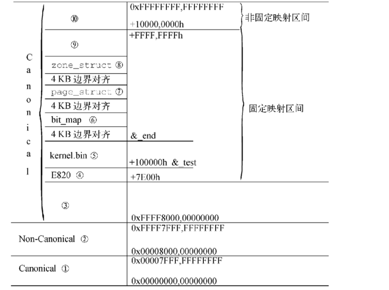
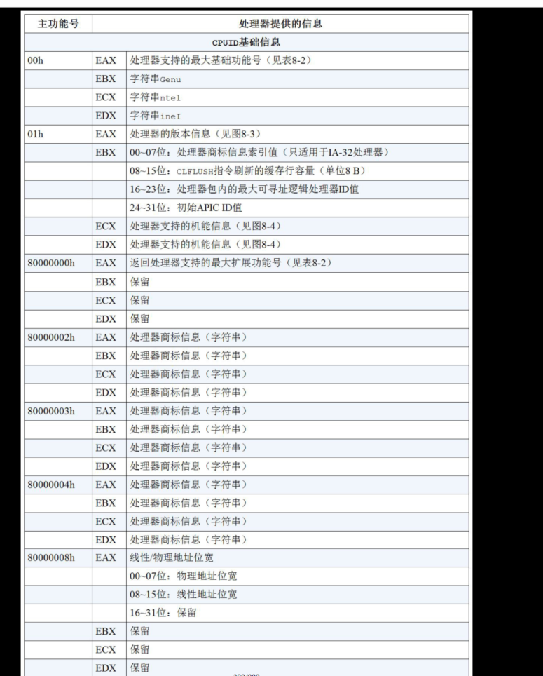
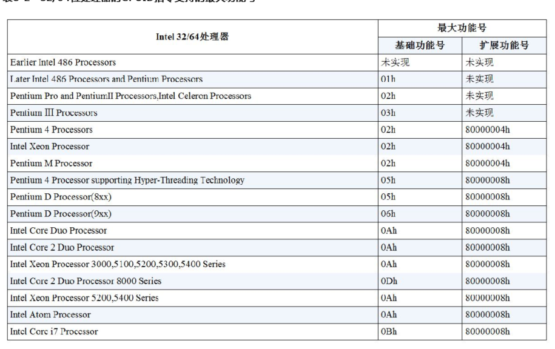
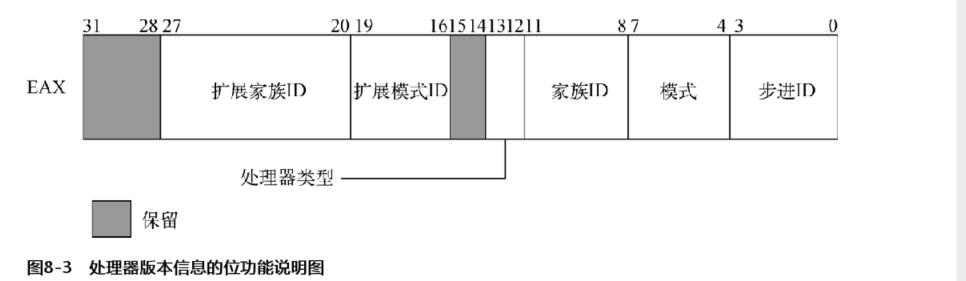
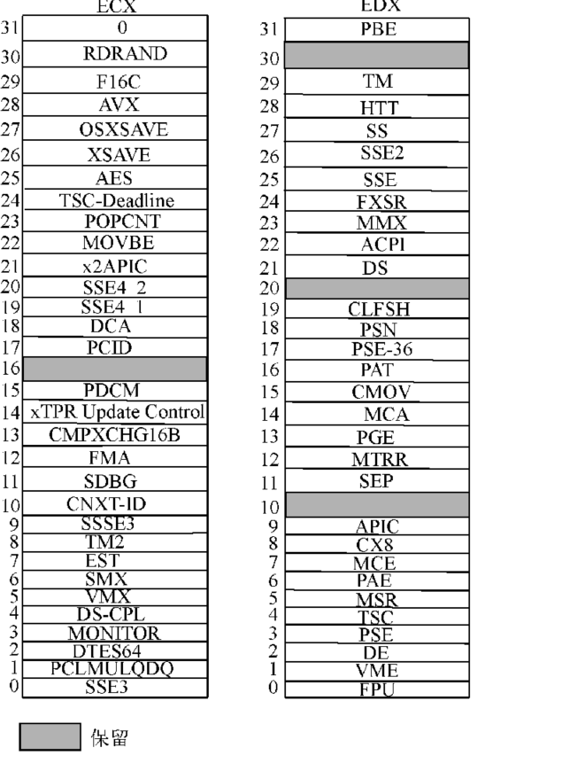
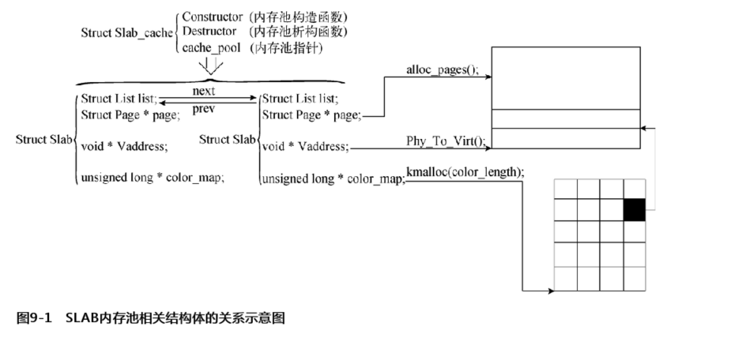

# 内核主程序部分

包含内容
-  [1 部分概念说明](#c1)
-  [2 SLAB内存池](#c2)

<h2>部分概念说明</h2>

makefile lds等说明见kernel.md 和tips.md

这是线性地址空间划分示意图。

1. 线性地址区间0x00000000,00000000 ~ 0x00007FFF,FFFFFFFF作为应用层地址空间，将预留给各个应用程序使用。
2. 线性地址区间0x00008000,00000000 ~ 0xFFFF7FFF,FFFFFFFF是Non-Canonical型地址空间，不能被处理器访问，故保留使用。由此可见，将这段地址空间作为应用程序和内核程序的分界线，应该是一个不错的选择。
3. 从线性地址0xFFFF8000,00000000开始至0xFFFFFFFF,FFFFFFFF处，这段区间将作为内核层地址空间，供内核程序管理使用。现已将0~4 GB物理地址空间固定映射到线性地址0xFFFF8000,00000000 ~ 0xFFFF8000,FFFFFFFF处，即线性地址和物理页的映射是固定的、连续的、一一对应的，这些物理页无法动态更改。在内核启动初期，由于内核功能不够完善，内核必须挪用一部分线性地址空间去映射帧缓存区（VBE平坦帧缓存区模式的起始物理地址），故此目前内核暂且无法进行固定映射，待到内存管理单元完善以后再做固定映射。
4. 在线性地址0xFFFF8000,00000000向后偏移7E00h地址处，保存着通过BIOS中断服务程序获取的物理地址映射信息，当内存管理单元初始化完毕后，这部分内存空间便可释放另作他用。
5. 在线性地址0xFFFF8000,00000000向后偏移100000h地址处，保存着内核程序kernel.bin。
6. 在_end标识符（内核程序结尾地址）之后的4 KB边界对齐处，保存着系统可用物理页的映射位图。
7. 在bits_map映射位图组之后的4 KB边界对齐处，保存着系统可用物理页的页面管理结构struct Page。
8. 在pages_struct页面管理结构体组之后的4 KB边界对齐处，保存着系统可用物理页的页面区域结构struct Zone。
9. 从zones_struct页面区域结构体组之后的线性地址开始，到线性地址0xFFFF8000,FFFFFFFF处的这段地址空间用于固定内存映射。固定内存映射的好处是，内核只需通过简单的计算（减去固定值PAGE_OFFSET = 0xFFFF8000,00000000）便可知道线性地址对应的物理地址。
10. 剩余线性地址空间（0xFFFF8001,00000000 ~ 0xFFFFFFFF,FFFFFFFF）用于非固定映射。超过4 GB的物理地址空间可随意映射到此地址空间，并允许物理页面的重复映射（同一物理页在页表中存在多处映射）。

cpuid指令部分说明:

部分cpu最大功能号:

cpuid查询步进等信息:

对于主功能号01h保存在ECX和EDX寄存器值，寄存器保存的返回值描述了处理器可支持的功能:0表示不支持 1表示支持

<h2>SLAB内存池</h2>

内存池的作用是预先开辟若干个大小相等或不等的内存对象（存储空间）并对其进行管理，当内存对象需要使用时便从内存池中申请，当内存对象不再使用时再由内存池进行回收再利用。内存池技术的优点在于可分配内存对象数量多、分配速度快、便于管理。典型的应用场景有申请网络协议包、缓存文件系统相关结构体、缓存硬件设备的数据包等。

一般情况下，从内存池分配出的内存对象不会归还给系统内核，而是由内存池回收再利用，通常只有在内存池销毁时内存对象才会统一归还给系统内核；而且，内存对象的回收再利用速度快，可显著缩短调整内存空间所消耗的时间。但内存池带来的缺点也一目了然，鉴于内存池是预先开辟好的，操作系统在创建内存池时将消耗大量系统内存，这会给操作系统带来不小的压力。

SLAB分配器可为系统内核中的常用资源分配存储空间，并在分配/回收存储空间的过程中，操作系统允许SLAB分配器使用自定义的构造函数和析构函数对内存对象进行定制化处理。不仅如此，SLAB分配器还可以动态扩大和缩小内存池的体积，以确保不会过多占用系统内存，或在内存池容量过小时影响内存对象的分配速度。

struct Slab_cache和struct Slab两个结构体。结构体struct Slab_cache用于抽象内存池，其主要成员有Constructor和Destructor函数指针，以及指向struct Slab结构体的指针变量cache_pool。至于函数指针Constructor和Destructor，它们可在分配/回收内存对象的过程中起到构造/析构内存对象的作用，而cache_pool指针则用于索引内存池的存储空间结构struct Slab。struct Slab结构体的作用是管理每个以物理页为单位的内存空间，在每个物理页中包含着若干个待分配的内存对象。

这边结构体关系如下图:

