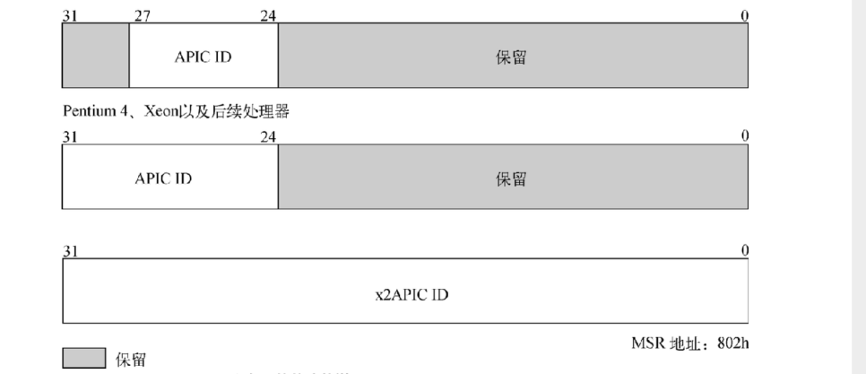
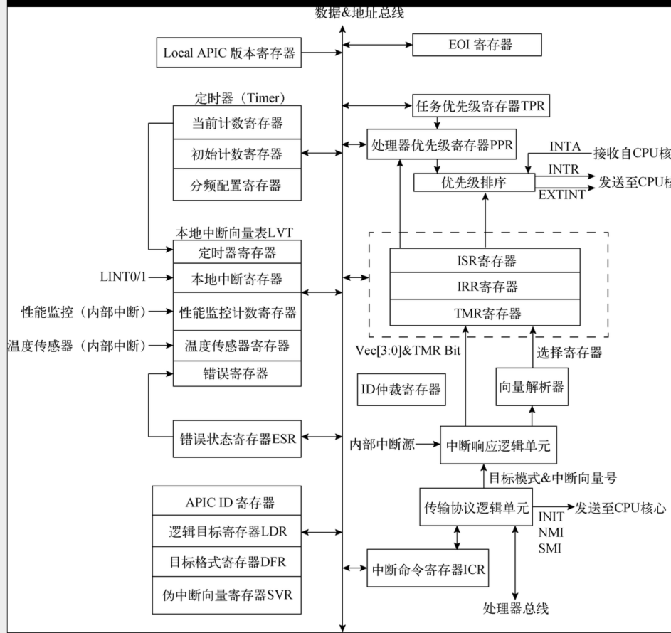

# 内核主程序部分

包含内容
-  [1 部分概念说明](#c1)
-  [2 SLAB内存池](#c2)
-  [3 APIC](#c3)

<h2>部分概念说明</h2>

makefile lds等说明见kernel.md 和tips.md

这是线性地址空间划分示意图。

1. 线性地址区间0x00000000,00000000 ~ 0x00007FFF,FFFFFFFF作为应用层地址空间，将预留给各个应用程序使用。
2. 线性地址区间0x00008000,00000000 ~ 0xFFFF7FFF,FFFFFFFF是Non-Canonical型地址空间，不能被处理器访问，故保留使用。由此可见，将这段地址空间作为应用程序和内核程序的分界线，应该是一个不错的选择。
3. 从线性地址0xFFFF8000,00000000开始至0xFFFFFFFF,FFFFFFFF处，这段区间将作为内核层地址空间，供内核程序管理使用。现已将0~4 GB物理地址空间固定映射到线性地址0xFFFF8000,00000000 ~ 0xFFFF8000,FFFFFFFF处，即线性地址和物理页的映射是固定的、连续的、一一对应的，这些物理页无法动态更改。在内核启动初期，由于内核功能不够完善，内核必须挪用一部分线性地址空间去映射帧缓存区（VBE平坦帧缓存区模式的起始物理地址），故此目前内核暂且无法进行固定映射，待到内存管理单元完善以后再做固定映射。
4. 在线性地址0xFFFF8000,00000000向后偏移7E00h地址处，保存着通过BIOS中断服务程序获取的物理地址映射信息，当内存管理单元初始化完毕后，这部分内存空间便可释放另作他用。
5. 在线性地址0xFFFF8000,00000000向后偏移100000h地址处，保存着内核程序kernel.bin。
6. 在_end标识符（内核程序结尾地址）之后的4 KB边界对齐处，保存着系统可用物理页的映射位图。
7. 在bits_map映射位图组之后的4 KB边界对齐处，保存着系统可用物理页的页面管理结构struct Page。
8. 在pages_struct页面管理结构体组之后的4 KB边界对齐处，保存着系统可用物理页的页面区域结构struct Zone。
9. 从zones_struct页面区域结构体组之后的线性地址开始，到线性地址0xFFFF8000,FFFFFFFF处的这段地址空间用于固定内存映射。固定内存映射的好处是，内核只需通过简单的计算（减去固定值PAGE_OFFSET = 0xFFFF8000,00000000）便可知道线性地址对应的物理地址。
10. 剩余线性地址空间（0xFFFF8001,00000000 ~ 0xFFFFFFFF,FFFFFFFF）用于非固定映射。超过4 GB的物理地址空间可随意映射到此地址空间，并允许物理页面的重复映射（同一物理页在页表中存在多处映射）。

cpuid指令部分说明:

部分cpu最大功能号:

cpuid查询步进等信息:

对于主功能号01h保存在ECX和EDX寄存器值，寄存器保存的返回值描述了处理器可支持的功能:0表示不支持 1表示支持

<h2>SLAB内存池</h2>

内存池的作用是预先开辟若干个大小相等或不等的内存对象（存储空间）并对其进行管理，当内存对象需要使用时便从内存池中申请，当内存对象不再使用时再由内存池进行回收再利用。内存池技术的优点在于可分配内存对象数量多、分配速度快、便于管理。典型的应用场景有申请网络协议包、缓存文件系统相关结构体、缓存硬件设备的数据包等。

一般情况下，从内存池分配出的内存对象不会归还给系统内核，而是由内存池回收再利用，通常只有在内存池销毁时内存对象才会统一归还给系统内核；而且，内存对象的回收再利用速度快，可显著缩短调整内存空间所消耗的时间。但内存池带来的缺点也一目了然，鉴于内存池是预先开辟好的，操作系统在创建内存池时将消耗大量系统内存，这会给操作系统带来不小的压力。

SLAB分配器可为系统内核中的常用资源分配存储空间，并在分配/回收存储空间的过程中，操作系统允许SLAB分配器使用自定义的构造函数和析构函数对内存对象进行定制化处理。不仅如此，SLAB分配器还可以动态扩大和缩小内存池的体积，以确保不会过多占用系统内存，或在内存池容量过小时影响内存对象的分配速度。

struct Slab_cache和struct Slab两个结构体。结构体struct Slab_cache用于抽象内存池，其主要成员有Constructor和Destructor函数指针，以及指向struct Slab结构体的指针变量cache_pool。至于函数指针Constructor和Destructor，它们可在分配/回收内存对象的过程中起到构造/析构内存对象的作用，而cache_pool指针则用于索引内存池的存储空间结构struct Slab。struct Slab结构体的作用是管理每个以物理页为单位的内存空间，在每个物理页中包含着若干个待分配的内存对象。

这边结构体关系如下图:

这边大概说明下。首先是slab_cache 设置了32B到1M的内存池 (2^n) 因为page是2M的 所以这边内存分配只支持这些。然后是设计。大概如上图。这些cache以及第一个slab都是手动创建的  并且反过来设置了对应page属性 详情见代码以及注释。然后这边较大size的slab的map以及本身是通过申请内存来存放的(大于512B 因为大于512的话浪费会比较多，比如下一个size是1k那么如果size是1k的话 2M的页2048个块 本身color_map需要的就是比较大的空间 二遇到比如1m的页 如果不另外分配的话 这个page就只能有一个块了。) 

然后是物理页管理功能的调整。
现在，内存管理单元已实现内存页的申请和释放、通用内存的分配和回收、SLAB内存池等功能。但页表却仅有区区24个物理页（48 MB物理内存）完成了页面映射，剩余物理内存除非完成页面映射，否则无法直接使用。这就导致ZONE_NORMAL_INDEX区域只能分配出有限的几个内存页。页表的重新初始化过程会对内核页表重新赋值，并为其创建子页表，直至将0~4 GB内的物理页映射到线性地址空间。

这边再附加一个64bit 四级分页的bit说明 来自[osdev](https://wiki.osdev.org/File:64-bit_page_tables1.png)

下面是1G 2M 4k末级的 这边注意PSbit

<h2>APIC</h2>

之前8259A PIC部分。因为是 通过主次芯片组然后将中断信号传递给指定处理器。但是在多核环境下这种处理方式会降低效率。APIC放弃INTR引脚的方式 改成总线方式。将中断控制器分为两个部分：处理器内部的Local APIC和位于主板芯片组的I/O APIC。这两个控制器模块通过总线相连。结构关系如下图:

如图:每个核心都拥有自己的local APIC.而芯片组上通常只有一个IO APIC。(高级平台可能有多个)

- **Local APIC**:它既可接收来自处理器核心的中断请求，亦可接收内部中断源和外部I/O APIC的中断请求。随后，再将这些请求发送至处理器核心中进行处理。 Local APIC还可通过总线实现双向收发**IPI**（Inter-Processor Interrupt，处理器间中断）消息，IPI消息可收发自目标处理器的逻辑核心。IPI消息主要应用于多核处理器环境下，通过它可实现各处理器核心间的通信，这也是多核处理器之间使用的主要通信手段。
- **I/O APIC**:外部I/O APIC是主板芯片组的一部分。它主要负责接收外部I/O设备发送来的中断请求，并将这些中断请求封装成中断消息投递至目标Local APIC。

在多核处理器环境下，I/O APIC能够提供一种机制来分发外部中断请求（中断消息）至目标处理器的Local APIC控制器中，或者分发到系统总线上的处理器组中。

在处理器的每个核心中，都拥有一个Local APIC，它不但可接收I/O APIC发送来的中断请求，还可接收其他处理器核心发送来的IPI中断请求，甚至可以向其他处理器核心发送IPI中断请求。

**cpuid eax = 01h的情况下 从EDX的第九位获取是否支持apic ;ebx的高8bit 获取local apic ID**

### Local APIC

local APIC采用内存访问方式（寄存器映射到物理地址空间)来操作寄存器。之前的8259A则是IO端口的形式。内存访问方式则更快。也有支持直接访问寄存器的local APIC.

主要是负责接受中断请求或者中断消息 然后提交给处理器核心

下面是local APIC寄存器的相关知识。

下图是寄存器组的版本寄存器。

下图是版本寄存器的位功能图:

Local APIC大体可分为内置和外置两个版本，可通过版本ID加以区分，表10-2描述了详细的版本ID。如果Local APIC支持EOI消息的禁止广播功能，那么通过SVR寄存器的相关位可控制EOI消息禁止广播功能的开启与关闭。

APIC架构里的一些特性在xAPIC中得到了扩展和修改。在xAPIC中，基础操作模式为xAPIC模式。高级的x2APIC模式在xAPIC模式的基础上进一步扩展，其引入了处理器对Local APIC寄存器的寻址功能，即将Local APIC的寄存器地址映射到MSR寄存器组中，从而可直接使用RDMSR和WRMSR指令来访问Local APIC寄存器。

下图是一个apic和xapic的IA32_APIC_BASE的寄存器说明(位于MSR寄存器组 0x1b):

下面是位说明（maxphyaddr 可以通过cpuid来查询 指的是处理器支持的最大物理地址 个人计算机一般36也就是 64g）

当硬件上电或重启后，硬件平台会自动选择一个处理器作为引导处理器，并置位IA32_APIC_BASE寄存器的BSP标志位，而未置位处理器将作为应用处理器使用。xAPIC全局使能标志位可用于控制APIC和xAPIC模式的开启与关闭，置位表示开启，复位表示关闭。APIC寄存器组的物理基地址区域用于为处理器提供访问APIC寄存器组的起始物理地址（按4 KB边界对齐），MAXPHYADDR的可选值有36/40/52，在系统上电或重启后，APIC寄存器组的默认物理基地址为FEE00000h。
当**CPUID.01h:ECX[21]=1时，说明处理器支持x2APIC模式**。对于支持x2APIC模式的处理器来说，其IA32_APIC_BASE寄存器新增了x2APIC模式的使能标志位

下图是x2apic的base寄存器结构:

这边就是bit[10]EXTD和bit[11]EN做组合使能。在开启xAPIC的基础上(EN置位)再EXTD置位则开启x2APIC.如果仅仅EN则是xapic。当然EN=0 EXTD=1是无效的。

在模式确认的情况下，置位伪中断向量寄存器SVR(见下面)的bit[8]才是完全开启local apic控制器。

这边总结下 xapic支持的内存映射控制寄存器。x2apic则是支持MSR寄存器组映射控制。下图是两种模式的映射说明:

#### local APIC ID寄存器

当物理平台上电后，硬件设备会为系统总线上的每一个Local APIC分配唯一的初始APIC ID值，并将其保存在APIC ID寄存器内。硬件指派初始APIC ID值的原则是基于系统拓扑结构（包括封装位置和簇信息）构建的，通过CPUID.01h:EBX[31:24]可获得这个8位的初始APIC ID值。
在多核处理器系统中，BIOS和操作系统会将Local APIC ID值作为处理器核心的ID号。某些处理器甚至允许软件修改Local APIC ID值。各版本Local APIC的Local APIC ID寄存器位功能各不相同。

下图各版本的apic id寄存器位图：

借助CPUID.01h:ECX[21]可检测出32/64位处理器是否支持x2APIC模式，置位时表示处理器支持x2APIC模式。此时，如果CPUID支持0Bh功能，那么处理器通过CPUID.0Bh:EDX可获取32位的x2APIC ID值，此值与MSR寄存器组802H地址处的x2APIC ID值相同。

在xAPIC和x2APIC模式下，CPUID.0Bh:EDX返回的是一个32位的Local APIC ID值。对于不支持x2APIC模式的硬件平台，CPUID.0Bh:EDX返回的32位数值仅低8位有效。在通常情况下，CPUID.0BH:EDX[7:0]的数值与初始APIC ID值相等.

下图是local apic寄存器组整体描述

如图大概六类中断源:

1. 内部I/O设备:IO设备将边沿或电平中断信号直接发到处理器的中断引脚(LINT0和LINT1) 也可以先连接到类8259a控制器，再通过8259a转发中断请求到处理器的中断引脚
2. 外部IO设备:请求直接发送到I/O APIC的输入引脚。IO APIC封装成中断消息 再将其投递到系统的一个或多个处理器核心。
3. IPI消息:Intel 32/64处理器可通过IPI机制中断总线上的其他处理器或者处理器组。软件可借助IPI消息中断自身，转发中断以及抢占调度等
4. 定时器中断:到达预定时间后，向local apic发送一个中断请求信号。随后由local apic将中断请求转发到处理器
5. 性能监控中断:类似定时器中断  再性能监测计数器溢出后向local apic发送中断请求信号 再转发到处理器
6. 温度传感器中断：类似性能监控中断,内部温度传感器到达阈值后 向local apic发送中断请求信号。然后转发到处理器
7. 内部错误中断:监测到运行错误 向local apic发送中断请求信号。然后转发到处理器
   

#### LVT local vector table 本地中断向量表

用途与8259A芯片的中断号相似，只不过8259A接收的是外部I/O设备发送来的中断请求，而LVT接收的则是处理器内部产生的中断请求。高级中断控制器会对中断源产生的中断请求进行详细配置，比如自定义中断向量号、中断投递方式、中断触发方式以及中断触发电平等信息，这些配置项可使中断处理过程更加灵活。

如上面图所示 lvt中还有5个寄存器(下面是6个 多个cmci corrected  machine-check-error-interrupt 这个看是否支持)。其中各个位图如下：

这6个寄存器对应的场景如下图:

他们的初始值都是00010000h 可以参考位图所示：表示 中断向量号为0 空闲 投递模式是fixed 触发模式 边沿触发。屏蔽标志位是1 已经屏蔽。

下面是bit位说明 图里的屏蔽标志位说明有问题 反了

在Local APIC处理性能监控计数器的中断请求时，Local APIC会自动置位性能监控计数器寄存器的屏蔽标志位。

在APIC体系结构中，只允许有一个ExtINT投递模式的信号源存在，也就是说整个系统只能有一个处理器核心使用类8259A中断控制器，通常情况下此模式还需要兼容型桥芯片的支持。

下面是几种投递方式 简单讲就是LVT的向量号是fixed投递。然后除了ExtINT是忽视或者需要向量号为0.ExtINT就是兼容8259a的 ，多核下只有一个核心能使用类似8259a控制器。
这边投递状态0 空闲 表示目前中断源未产生中断或者说产生的中断已经投递到处理器并被处理器处理。1 挂起代表已经将中断请求 投递到处理器 但是未被受理。

触发模式只在Fixed投递模式下有效；NMI、SMI或INIT等投递模式始终采用边沿触发模式，ExtINT投递模式使用电平触发模式。而LVT定时器寄存器和错误寄存器的中断源始终使用边沿触发模式。如果Local APIC控制器没有结合I/O APIC控制器使用，并设置为Fixed投递模式，那么Pentium 4、Xeon和P6家族的处理器将始终采用电平触发模式。由于LINT1引脚不支持电平触发模式，所以软件应始终将LINT1寄存器设置边沿触发模式。
(电平触发:触发信号为有效电平（高或低）时，输入信号进入触发器电路，置触发器为相应状态。触发信号变为无效电平后，输入信号被封锁，触发器状态保持。
 边沿触发:边沿触发指的是接收时钟脉冲CLK 的某一约定跳变(正跳变或负跳变)来到时的输入数据。在CLK=l 及CLK=0 期间以及CLK非约定跳变到来时，触发器不接收数据的触发器。
)

下图是local_apic timer的模式类别

#### ESR寄存器

Local APIC能够监测出收发中断消息时出现的错误。一旦Local APIC监测到有错误发生，便会通过LVT的错误寄存器向处理器投递中断消息，再将错误内容记录在ESR（Error Status Register，错误状态寄存器）内

ESR是可读写寄存器，处理器在读取ESR的数值前，必须先向其中写入一个数值。写入的数值不会影响后续的读取操作，通常情况下应该写入数值0。

#### TPR(task priority register 任务优先级寄存器) PPR(processor priority register  处理器优先级寄存器) CR8寄存器

中断向量号是一个8位的数值，它可进一步拆分为高4位和低4位两部分，高4位是中断优先权等级，而低4位则是中断优先权的子等级。

中断优先权等级（Interrupt-Priority Class）是中断向量号的高4位，数值1是其最低优先权等级，15是其最高优先权等级。中断向量号0-31已被处理器保留使用，那么软件可配置的中断优先权等级的有效范围是2-15。每个中断优先权等级包含16个向量号，分别对应着中断向量号的低4位，其数值越大优先权越高。

TPR 和 PPR可以补充额外的中断请求优先级

TPR的bit[7:4]任务优先级等级 bit[3:0]任务优先级子等级。
只处理比设置高的 。比他低的则继续在IRR中等待？

PPR(只读) 则是针对处理器核心的和TPR一起控制可被中断的优先权等级。只响应比设置高的中断请求(针对fixed投递模式)位图和TPR一致

PPR的值是由TPR和ISRV相比较得出的(取高值)。ISRV是ISR寄存器中目前的最高中断优先权等级 如果ISRV=00h则代表当前没有中断请求。这边相当于TPR间接控制PPR.这样能保证只有比设置或者处理中高的才能进来中断。否则继续在IRR中等待分发。

#### cr8控制寄存器

64bit 仅仅低4为有效其他必须是0.通过mov cr8来设置TPR的[7:4].需要在r0下执行。这边操作cr0的写则是间接写到tpr(只设置7:4 3:0置零)读取cr8则是执行从tpr load bit[7:4]到cr8其他位置零

#### IRR ISR TMR  EOI SVR

IRR ISR TMR仅fixed投递模式下说明(其他模式是直接传递到处理器核心 不经过isr irr):

IRR(Interrupt Request Register)
中断请求寄存器，256 位，每位代表着一个中断。当某个中断消息发来时，如果该中断没有被屏蔽，则将 IRR 对应的 bit 置 1，表示收到了该中断请求但 CPU 还未处理。

ISR(In Service Register)
服务中寄存器，256 位，每位代表着一个中断。当 IRR 中某个中断请求发送个 CPU 时，ISR 对应的 bit 上便置 1，表示 CPU 正在处理该中断。

IRR寄存器用于记录已被处理器接收，但尚未处理的中断消息。当Local APIC接收到中断消息时，它会置位中断向量号对应的IRR寄存器位。当处理器核心准备处理下一个中断消息时，Local APIC会复位IRR寄存器里的最高中断优先权请求位（从已被置位项中选择），并置位其对应的ISR寄存器位。随后，处理器将执行ISR寄存器里的最高中断优先权请求。伴随着中断请求处理结束，Local APIC将复位中断向量号对应的ISR寄存器位，并准备处理下一个中断请求。

两个都是只读。0~15bit保留

TMR（Trigger Mode Register，触发模式寄存器），该寄存器用于记录每个中断请求的触发模式。当中断向量号对应的TMR寄存器位被置位时，表明中断请求采用电平触发模式，否则说明采用边沿触发模式。对于采用电平触发模式的中断请求，如果关闭禁止广播EOI消息，那么EOI消息将广播到所有I/O APIC中

EOI(End of Interrupt)
中断结束寄存器，32 位，写 EOI 表示中断处理完成。写 EOI 寄存器会导致 LAPIC 清理 ISR 的对应 bit，对于 level 触发的中断，还会向所有的 IOAPIC 发送 EOI 消息，通告中断处理已经完成。

除了NMI、SMI、INIT、ExtINT和Start-Up等中断投递模式外，其他中断投递模式都必须在中断处理过程里明确包含写入EOI（End-Of_Interrupt，中断结束寄存器）的代码。这段代码必须在中断处理过程返回前执行，通常情况下是在执行IRET指令前。此举意味着当前中断处理过程已执行完毕，Local APIC可处理下一个中断请求（从ISR寄存器中取得）
当Local APIC收到EOI消息后，它将复位ISR寄存器的最高位，而后再派送下一个最高中断优先权的中断请求到处理器核心。在关闭禁止广播EOI消息的前提下，如果中断请求采用电平触发模式，那么Local APIC会在收到EOI消息后，将其广播到所有I/O APIC中

SVR(Spurious Interrupt Vector Register)
伪中断向量寄存器。
msr 0x80f
如果处理器在应答Local APIC的中断请求期间，提高了中断优先权（大于或等于当前优先权），此举迫使Local APIC屏蔽当前中断请求，那么Local APIC只能被迫向处理器投递一个伪中断请求。伪中断请求不会置位ISR寄存器，所以伪中断请求的处理程序无需发送EOI消息。

### I/O apic

I/O APIC则主要用于收集I/O设备的中断请求，再将中断请求封装成中断消息投递到目标处理器的Local APIC中。

I/O APIC并非位于处理器中，而是位于系统前端总线之下，即位于电脑主板上。

I/O APIC位于主板芯片组中，它对外仅提供了三个间接访问寄存器，这三个寄存器分别用于索引I/O APIC寄存器的地址、读写I/O APIC寄存器数据以及向I/O APIC发送EOI消息。

I/O APIC只负责收集I/O外设的中断请求，并将中断请求封装成中断消息投递至目标处理器核心，其主要作用是将中断请求封装成中断消息，因此I/O APIC寄存器只有保存ID、版本和配置中断消息三种功能。

#### i/o apic的间接访问寄存器

IOAPIC 间接访问寄存器：IO apic得寄存器位于芯片主板上，所以只能通过主板芯片组提供得寄存器来间接访问。主板芯片组提供了两个显示得寄存器。默认会被映射到物理地址`FEC00000h`处。下图是间接访问寄存器组:

三个分别是:

- **IOREGSEL寄存器(R/W)**   32bit 可读写 一般使用低8bit 间接索引I/O APIC 寄存器  
- **IOWIN寄存器(R/W)**    32bit 可读写 读写目标I/O APIC寄存器内的数据 每次读写操作必须以4B为单位。  当IOREGSEL索引到apic寄存器 通过IOWIN寄存器来读写对应的寄存器数据
- **EOI寄存器(WO)**   采用电平触发模式的中断请求 在中断处理结束必须通过EOI寄存器发送EOI消息。  使用低8bit 来检索和中断向量号相匹配的中断定向投递寄存器 并发送EOI消息。当目标io中断定向投递寄存器收到eoi消息后 自动复位远程irr标志位。

#### i/o apic寄存器

由一组寄存器构成。通过IOREGSEL和IOWIN来进行访问。每次必须以4B为单位来访问所有I/O寄存器(读写IOWIN)。组成如下图:

其中因为IOWIN只能操作32bit但是图例由部分64bit.所以需要通过两次索引操作才能完成读写访问。下面是每个寄存器的作用说明

- I/O APIC ID寄存器(RW)
    31 bit 包含一个4bit的ID值(bit[27:24])。其他保留 作为i/o apic的物理名字使用。所有apic总线上的apic设备的唯一apic id值。在实际使用io apic前。需要通过io apic id寄存器写入正确的id值 并保证其唯一性。
- I/O APIC版本寄存器(RW)
    31 bit 每个ioapic都拥有的硬件版本寄存器。保存着ioapic的版本。同时还纪录着可用RTE(redirection table entry)数。其低8bit保存着apic版本号。bit[16-23]加1则是支持的rte数量。例如pch设备中 rte为17h那么就是24个rte寄存器
- I/O 中断定向投递寄存器(RW)
    64bit I/O APIC上每个中断请求引脚上都有一个I/O中断定向投递寄存器(简称RTE寄存器)与之对应。RTE寄存器中描述了中断请求的触发模式，中断投递模式，中断向量号等信息。具体位图如下:  看见rte和lvt表十分相似。下面是一些bit说明:
  
    - 投递模式：lowest priority(001) 是io apic新增的投递模式.和fixed十分相似。都是中断信息投递到处理器的INTR引脚。不过中断请求将在投递目标区域指定的处理器核心内以最低优先权执行。
    - 目标模式: 指明搜索中断消息接收者采用的模式。0为物理模式 1是逻辑模式。物理模式 使用apic id来确定接收终端信息的处理器。逻辑模式 使用ldr和dfr寄存器提供的自定义apic id来确定接收中断信息的处理器
    - 投递目标: 目标区域中保存着中断信息接收者的apic id号。根据目标模式自动调整有效位宽。其中物理模式使用bit[59:56]4bit来保存apic id.逻辑模式使用bit[63:56]8bit来保存自定义apic id号。

I/O APIC作为中断请求的中转芯片，不停地将外部I/O设备发送来的中断请求封装成中断消息，再将其投递至目标处理器核心.处理器核心 ,local apic, i/o apic，8259a 以及io外设中断请求引脚的布线结构如下:

8259A中断控制器与I/O APIC各中断输入引脚（或称中断请求引脚）链接的外部设备。在这些中断输入引脚中，大部分引脚只能接收一个外部设备的中断请求，某些引脚则允许多个设备共享同一个中断请求引脚。对于共享中断请求引脚的设备而言，处理器通过开启不同的设备或开关可使同一中断输入引脚接收到不同设备的中断请求。下图汇总出8259A中断控制器和I/O APIC各中断输入引脚可接收的中断源：

我们还能从布线结构了解到I/O APIC和8259A中断控制器与处理器的通信方式。I/O APIC只能通过特殊总线与处理器的Local APIC相连；而对于8259A中断控制器来说，它既可以作为外设连接至I/O APIC的中断请求引脚，也可以连接至Local APIC的LINT0引脚，还可以连接至处理器的INTR引脚。这些连接方式的选择同样是通过开启不同的设备或开关实现的。

也就是IO apic只能链接到总线 然后连接到local apic这是apic的一个结构。然后8259a则是各种兼容都有。比如只有bsp置位的那个。

### 中断控制器的模式选择和初始化

为了兼容 同时支持local apic ，io apic，8259a三种中断控制器且和处理器由多种链接方式

#### 中断模式

大体分为三类:

1. **PIC中断模式**: 避开apic 直接使系统运行于单处理器模式.PIC中断模式采用类8259A中断控制器来投递中断请求。在该模式下，中断请求只能投递至BSP处理器核心，整个中断投递过程不会有Local APIC和I/O APIC参与.通过IMCR(interrupt mode configuration register)寄存器。使pic模式下的硬件绕过IO apuc.直接发送到处理器：  图中的虚线部分是实际的。imcr寄存器控制bsp处理器接受中断请求的链路,也就是选择接收类8259a的中断请求或者是接收local apic的中断请求。imcr是一个间接访问寄存器。通过io端口的22h写入imcr的地址(地址70h)。在向io端口的23h写入imcr的数值来操作。系统上电默认imcr 00h 就是中断模式。nmi和类8259a的引脚将直接连接到bsp处理器。如果imcr写入01h 可强制价格nmi和类8259a的中断请求发送到apic(local apic或者 io apic) 也就是说中断模式是兼容之前的
2. **Virtual Wire中断模式**: Virtual Wire中断模式是基于APIC设备的单处理器模式，它为所有DOS软件的启动和运行提供了硬件环境。Virtual Wire中断模式包含两种子模式，一种是基于Local APIC的Virtual Wire中断模式，另一种是基于I/O APIC的Virtual Wire中断模式。这两种中断模式，都将中断请求从类8259A投递至Local APIC中，而不同点在于投递的线路上是否会经过I/O APIC。基于local apic的模式：local apic 的lintin0引脚配置为extint投递模式，将8259a pic作为外部中断控制器。中断向量号由类8259a提供。而基于io apic的virtual wire中断模式中，中断请求由8259a收集  统一穿过io apic再投递到bsp处理器的local apic.这个模式下 io apic的引脚0 连接着8259a的主芯片。RTE0寄存器设置为extint投递模式。
3. **Symmetric I/O中断模式**: Symmetric I/O中断模式应用于多核处理器操作系统中，这个中断模式至少需要一个I/O APIC。如果操作系统准备使用Symmetric I/O中断模式，首先要将类8259A中断控制器屏蔽，使得类8259A的中断请求引脚改由I/O APIC接管。其结构如图: 可以向IMCR寄存器写入数值01h来屏蔽类8259A，亦可通过类8259A的IMR寄存器达到屏蔽目的，甚至还可以通过屏蔽LVT的LINT0寄存器来实现。

#### local apic 初始化

这边将中断控制器的配置和管理拆分到8259A.c和APIC.c.interrupt.c则是中断处理机制的实现。

