# 进程管理相关部分

包含内容
-  [1 概述](#c1)
-  [2 多核处理器间的IPI通信机制](#c2)
-  [3 支持多核](#c3)

<h2>概述</h2>

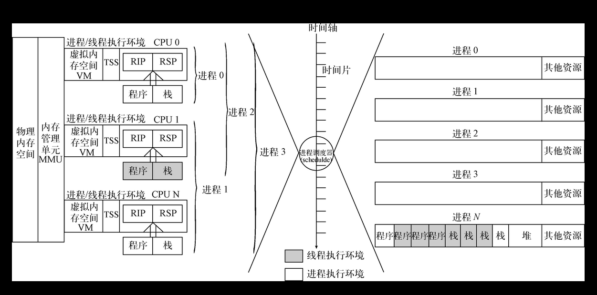

这是分时系统进程管理单元示意图

- 左侧是进程的运行状态部分，其描绘了进程在运行时的硬件设备资源使用情况，其中不乏包含有记录进程当前运行状态的RIP与RSP寄存器以及任务状态段、各进程的私有虚拟内存空间和物理内存空间等资源。
- 右侧是进程的静止状态部分，当进程从运行状态进入挂起状态时，进程会将所有资源的使用情况都保存起来。其实，进程的创建过程也始于此处，即先创建静止状态的进程，当时机成熟时调度运行。
- 中间部分表示基于时间片的进程调度器Schedule，进程调度器将根据右侧各个进程的执行因素有选择地把进程或线程调度到左侧的执行环境里运行。每经过一个时间片，进程调度器就会重新对运行中的进程做一次调度评估，以决定接下来应该执行和挂起的进程或线程。

### 多核处理器

#### 超线程和多核技术

下图是双核四线程的多核处理器结构图.

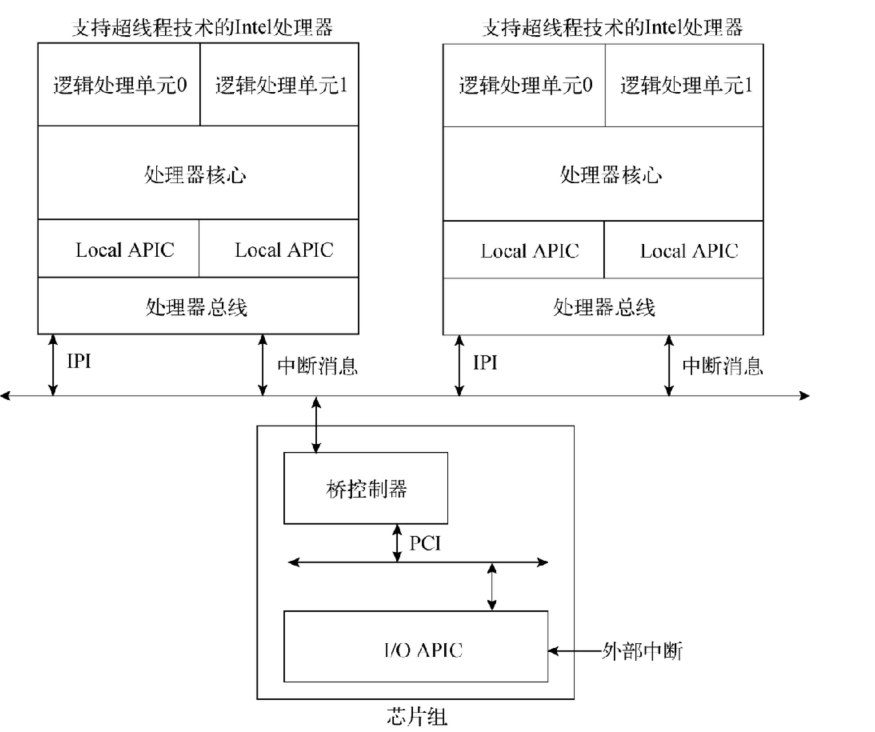

- **超线程技术** 就是在一个处理器核心中集成多个逻辑处理单元。这些处理单元对于通用寄存器 段寄存器 控制寄存器以及系统表寄存器(GDTR LDTR IDTR TR) 大部分msr寄存器等寄存器是互相独立的，就是每个单元都有自己独立的这些寄存器。(其他如小部分msr mtrr寄存器组共享)。但是是共享处理器的执行引擎 处理器缓存 总线接口等。也就是说可以分开单独准备运行各自的任务，但是因为共享执行引擎 所以各个处理单元之间还是并发执行。
- **多核技术** 这就是实际多个处理核心 可以并行任务。
- **多线程技术** 整合了超线程技术和多核技术，实现硬件层面的多任务并行处理，它比软件层面的多任务处理更加高效。在处理器上电或重启后，硬件系统将动态选择一个逻辑处理单元作为BSP（BootStrap Processor，引导处理器），其他逻辑处理单元则作为AP（Application Processor，应用处理器）使用，这两类处理器的功能如下。
  - **BSP** bsp逻辑处理单元是硬件平台上电后启动的第一个处理器。负责执行引导程序来配置APIC执行环境等 并启动AP.按照Intel的多核处理器初始化协议，BSP的IA32_APIC_BASE.BSP[8]置位
  - **AP** 该逻辑处理单元上电后完成最小集的自我配置。然后等待BSP发送Start_ip IPI消息。然后其会根据IPI消息提供的引导程序其实地址开始执行。

这边逻辑处理单元通电或者重启后都会指派唯一的APIC ID.其并不是单一的值  可以拓扑成3-5个层级。下面是一个4j的ID值。（x2apic的32bit）

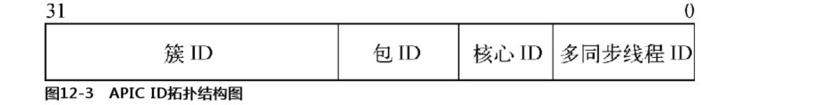

下面说明如图

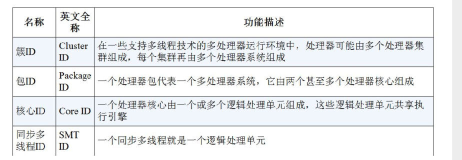

简单讲  同步多线程ID就是逻辑处理单元级别 核心ID就是物理核心级别 后面包ID就是一个多处理器系统  簇ID则是更上一个级别。

如图 上面各个级别的id没有标注bit位 因为其不是固定的 可以通过CPUID.0Bh枚举出位宽。

通过向EAX寄存器写入主功能号0Bh，再向ECX[7:0]寄存器写入子功能号0，来枚举APIC ID的拓扑层级。每次枚举都需要将ECX寄存器的子功能号加1，直至ECX[15:8]寄存器返回0为止。每次枚举执行后，ECX[15:8]寄存器都会返回层级类型（0：无效；1：SMT；2：Core；3~255：保留），EAX[4:0]寄存器返回层级位宽（包含上一级位宽），EBX[15:0]寄存器返回当前层级下的逻辑处理单元数量。如果ECX[15:8]寄存器返回0，说明整个枚举过程执行结束，此时ECX[7:0]寄存器返回最大拓扑层级数，EDX寄存器返回当前逻辑处理单元的x2APIC ID值。
值得注意的是CPUID.0Bh最多只能枚举出SMT和Core两个层级的位宽，Package层级将使用APIC ID的剩余位宽，而Cluster层级Intel尚未提供查询方法。

这边简单说明下 就是0就是查询最低层级的SMTID 然后一次递增 知道系统不支持。按照这边说明 最多支持到1 或者ecx[15:8]返回到type 2 Core。

<h2>多核处理器间的IPI通信机制</h2>

多核处理器为IPI通信机制提供了一系列寄存器，以实现不同种中断投递方式的处理器间通信。整个中断投递过程主要围绕ICR（Interrupt Command Register，中断命令寄存器）展开，处理器会根据ICR寄存器的标志位配置情况，有选择地使用其他附属寄存器将IPI消息发送至目标处理器。ICR是localAPIC寄存器组内的一个64bit寄存器。不用localapic再运行模式下的功能位略有不同。如下图:

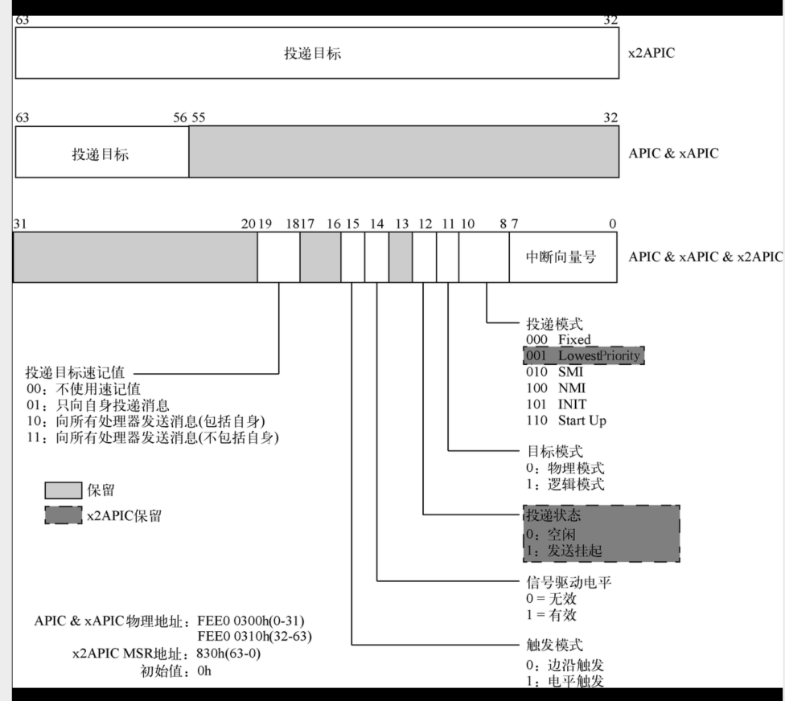

我们这边主要是x2apic

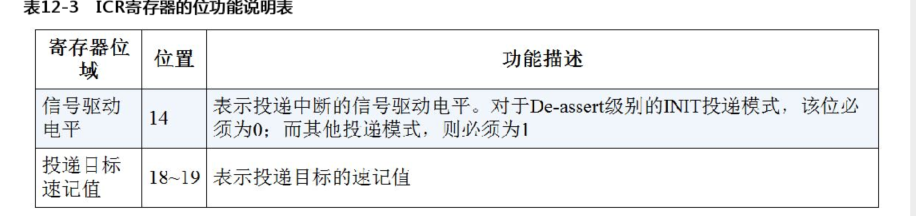

这边是部分bit位说明。

在ICR中引入了Start Up投递模式，BSP逻辑处理单元通过此模式可向目标处理器发送引导程序的起始地址。当投递模式为Start Up时，Interrupt Vector位域负责向目标处理器提供引导程序的起始地址，起始地址的格式为000VV000h（VV是Interrupt Vector位域值）。如果Start Up消息投递失败，Local APIC不会自动重发，必须手动重发Start Up消息，出于保险起见，Intel建议向目标处理器投递两次Start Up消息。

特别注意，在APIC和xAPIC模式下，ICR由两个32位的寄存器组成。如果向ICR寄存器的低32位写入数据，那么处理器会立即发送IPI消息。因此，我们必须先向ICR寄存器的高32位写入数据，再向低32位写入数据。

然后这边投递目标模式分为逻辑和物理两种。 物理这边自然是根据目标与的apic id来选择投递目标。这里说下逻辑目标投递模式

**逻辑目标投递模式** 需要用到LDR和DFR寄存器 然后目标域不再是代表apic id值 而是代表一个8位的MDA(message destination address 消息目标地址).当local apic收到一个逻辑目标投递模式的ipi消息时。local apic会根据LDR(logical destination register) 和 DFR(destination format register 目标格式寄存器)的设置对MDA值进行仲裁 判断时候需要处理该ipi信息。

其中 LDR保存着逻辑apic id的值 DFR则是处理逻辑apic id和MDA的匹配模式。apic xapic 下DFR分为平坦模式和集群模式。x2apic下只有集群模式。所以x2apic下废除了DFR.

下面时LDR的位图:

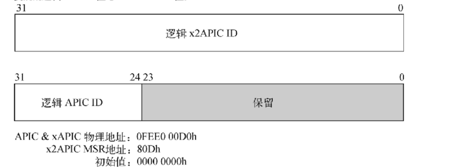

下面时dfr的位图:

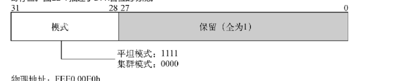

下面说下平坦和集群模式的区别:

平坦模式:  逻辑apic id的每一位代表一个local apic.MDA直接置位对应逻辑id的bit位即可。这样再处理的时候local apic 直接用逻辑apic id和mda直接逻辑与操作，不为零时接收并处理

集群模式: 分为平坦集群和分层集群。其中平坦集群和平坦模式类似。分层则需要借助特殊管理设备才能实现。略

然后是一个**SELF-IPI寄存器**

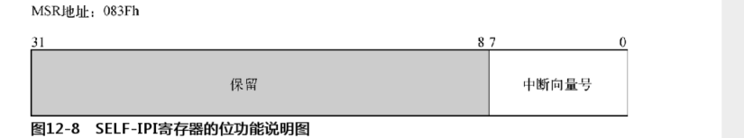

如图和名字 是为了方便给自己发送ipi信息使用。软件只需向SELF-IPI寄存器写入中断向量号，即可发送一个边沿触发模式中断消息到其所在处理器。而且，SELF-IPI寄存器发送的IPI消息在IRR、ISR、TMR寄存器中均有记录，这就如同本条IPI消息是从总线上发送过来的一样。不仅如此，SELF-IPI寄存器还可与ICR寄存器联合使用。特别注意的是，SELF-IPI寄存器是一个只写寄存器，如果使用RDMSR汇编指令读取SELF-IPI寄存器将触发#GP异常。

<h2>支持多核</h2>

首先是两个多核的系统结构:

- **SMP**: symmetric Multi-processing 对称多处理器结构。这种属于多个处理器应用于同一个操作系统内的。增加任务并行的处理速度。简单结构如下图:  途中smp系统初始化之后 所有处理器平等的使用系统资源。这样方便做管理以及负载。然后可以通过设置共享内存来方便处理器间的互相访问。当然共享的话就存在竞争问题，衍生出信号量 自旋锁 原子变量等技术来解决竞争引发的问题。串行化并行访问竞争资源的过程。
- **ASMP**: Asymmetric multi-processing 非对称系统结构。和smp相反，asmp中各个处理器很大程度是独立运行的。只存在少量通信工作。如下图: 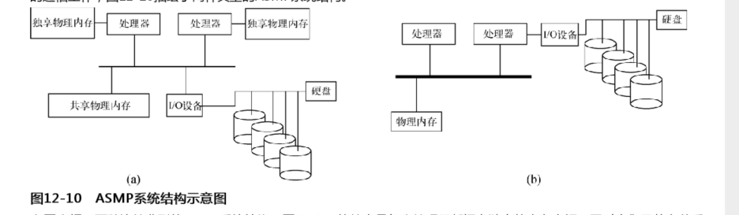 途中属于两种类型。a类型每个处理器都有自己的独立内存空间，其他又是共享的。通常应用于多系统并存的环境下。b则是一些处理器负责执行任务 一些负责管理和访问资源。当然还是有竞争问题。还是有smp提到的一些解决的技术存在。
  
不管是smp还是asmp 还是多核技术。都是遵循规范的。bsp 和 aps.下图是intel的多核处理器基于ipi通信 在smp和asmp下ap处理器启动时序:

下图是smp的

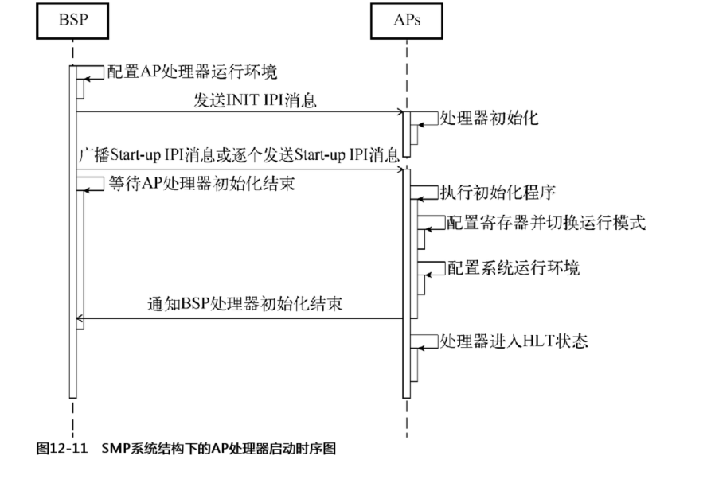

这是asmp的

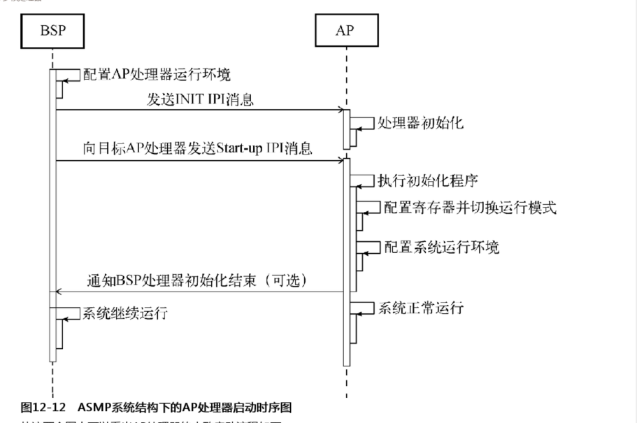

区别是smp中基本是应用于统一操作系统。所以初始化后aps还是等待bsp指令。amsp可能就独立运行了。smp中bsp还需要等待aps的启动确认消息。然后ap处理器初始时运行于实模式的 ，所以寻址能力只有1mb 所以bsp在准备ap处理器初始化程序的时候需要注意。然后bsp先发送INIT IPI消息通知ap做好初始化然后发送start-up ipi消息。intel建议发送两次。然后ap处理器收到后会从指定引导程序开始执行初始化配置各项功能。

这边时基于smp的。然后bochs 配置 cpu:count=1:1:2 就是一个处理器系统 一个核心 两个逻辑处理单元。或者说单核2线程?

