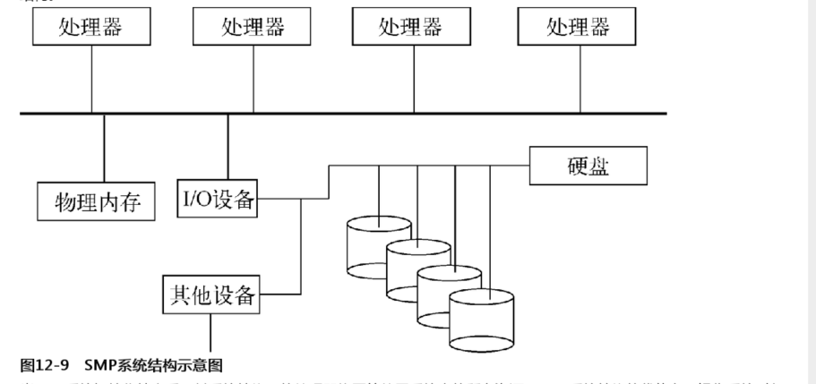
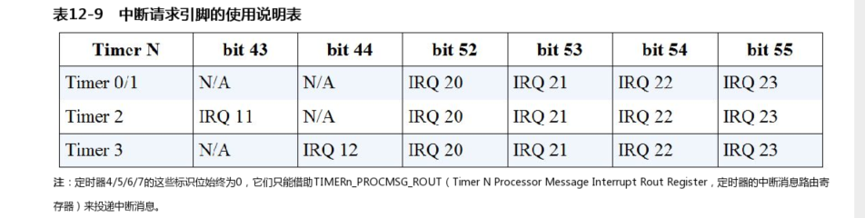

# 进程管理相关部分

包含内容
-  [1 概述](#c1)
-  [2 多核处理器间的IPI通信机制](#c2)
-  [3 支持多核](#c3)


<div id=c1><h2>概述</h2></div>


这是分时系统进程管理单元示意图

- 左侧是进程的运行状态部分，其描绘了进程在运行时的硬件设备资源使用情况，其中不乏包含有记录进程当前运行状态的RIP与RSP寄存器以及任务状态段、各进程的私有虚拟内存空间和物理内存空间等资源。
- 右侧是进程的静止状态部分，当进程从运行状态进入挂起状态时，进程会将所有资源的使用情况都保存起来。其实，进程的创建过程也始于此处，即先创建静止状态的进程，当时机成熟时调度运行。
- 中间部分表示基于时间片的进程调度器Schedule，进程调度器将根据右侧各个进程的执行因素有选择地把进程或线程调度到左侧的执行环境里运行。每经过一个时间片，进程调度器就会重新对运行中的进程做一次调度评估，以决定接下来应该执行和挂起的进程或线程。

### 多核处理器

#### 超线程和多核技术

下图是双核四线程的多核处理器结构图.


- **超线程技术** 就是在一个处理器核心中集成多个逻辑处理单元。这些处理单元对于通用寄存器 段寄存器 控制寄存器以及系统表寄存器(GDTR LDTR IDTR TR) 大部分msr寄存器等寄存器是互相独立的，就是每个单元都有自己独立的这些寄存器。(其他如小部分msr mtrr寄存器组共享)。但是是共享处理器的执行引擎 处理器缓存 总线接口等。也就是说可以分开单独准备运行各自的任务，但是因为共享执行引擎 所以各个处理单元之间还是并发执行。
- **多核技术** 这就是实际多个处理核心 可以并行任务。
- **多线程技术** 整合了超线程技术和多核技术，实现硬件层面的多任务并行处理，它比软件层面的多任务处理更加高效。在处理器上电或重启后，硬件系统将动态选择一个逻辑处理单元作为BSP（BootStrap Processor，引导处理器），其他逻辑处理单元则作为AP（Application Processor，应用处理器）使用，这两类处理器的功能如下。
  - **BSP** bsp逻辑处理单元是硬件平台上电后启动的第一个处理器。负责执行引导程序来配置APIC执行环境等 并启动AP.按照Intel的多核处理器初始化协议，BSP的IA32_APIC_BASE.BSP[8]置位
  - **AP** 该逻辑处理单元上电后完成最小集的自我配置。然后等待BSP发送Start_ip IPI消息。然后其会根据IPI消息提供的引导程序其实地址开始执行。

这边逻辑处理单元通电或者重启后都会指派唯一的APIC ID.其并不是单一的值  可以拓扑成3-5个层级。下面是一个4j的ID值。（x2apic的32bit）


下面说明如图


简单讲  同步多线程ID就是逻辑处理单元级别 核心ID就是物理核心级别 后面包ID就是一个多处理器系统  簇ID则是更上一个级别。

如图 上面各个级别的id没有标注bit位 因为其不是固定的 可以通过CPUID.0Bh枚举出位宽。

通过向EAX寄存器写入主功能号0Bh，再向ECX[7:0]寄存器写入子功能号0，来枚举APIC ID的拓扑层级。每次枚举都需要将ECX寄存器的子功能号加1，直至ECX[15:8]寄存器返回0为止。每次枚举执行后，ECX[15:8]寄存器都会返回层级类型（0：无效；1：SMT；2：Core；3~255：保留），EAX[4:0]寄存器返回层级位宽（包含上一级位宽），EBX[15:0]寄存器返回当前层级下的逻辑处理单元数量。如果ECX[15:8]寄存器返回0，说明整个枚举过程执行结束，此时ECX[7:0]寄存器返回最大拓扑层级数，EDX寄存器返回当前逻辑处理单元的x2APIC ID值。
值得注意的是CPUID.0Bh最多只能枚举出SMT和Core两个层级的位宽，Package层级将使用APIC ID的剩余位宽，而Cluster层级Intel尚未提供查询方法。

这边简单说明下 就是0就是查询最低层级的SMTID 然后一次递增 知道系统不支持。按照这边说明 最多支持到1 或者ecx[15:8]返回到type 2 Core。


<div id=c2><h2>多核处理器间的IPI通信机制</h2></div>

多核处理器为IPI通信机制提供了一系列寄存器，以实现不同种中断投递方式的处理器间通信。整个中断投递过程主要围绕ICR（Interrupt Command Register，中断命令寄存器）展开，处理器会根据ICR寄存器的标志位配置情况，有选择地使用其他附属寄存器将IPI消息发送至目标处理器。ICR是localAPIC寄存器组内的一个64bit寄存器。不用localapic再运行模式下的功能位略有不同。如下图:


我们这边主要是x2apic


这边是部分bit位说明。

在ICR中引入了Start Up投递模式，BSP逻辑处理单元通过此模式可向目标处理器发送引导程序的起始地址。当投递模式为Start Up时，Interrupt Vector位域负责向目标处理器提供引导程序的起始地址，起始地址的格式为000VV000h（VV是Interrupt Vector位域值）。如果Start Up消息投递失败，Local APIC不会自动重发，必须手动重发Start Up消息，出于保险起见，Intel建议向目标处理器投递两次Start Up消息。

特别注意，在APIC和xAPIC模式下，ICR由两个32位的寄存器组成。如果向ICR寄存器的低32位写入数据，那么处理器会立即发送IPI消息。因此，我们必须先向ICR寄存器的高32位写入数据，再向低32位写入数据。

然后这边投递目标模式分为逻辑和物理两种。 物理这边自然是根据目标与的apic id来选择投递目标。这里说下逻辑目标投递模式

**逻辑目标投递模式** 需要用到LDR和DFR寄存器 然后目标域不再是代表apic id值 而是代表一个8位的MDA(message destination address 消息目标地址).当local apic收到一个逻辑目标投递模式的ipi消息时。local apic会根据LDR(logical destination register) 和 DFR(destination format register 目标格式寄存器)的设置对MDA值进行仲裁 判断时候需要处理该ipi信息。

其中 LDR保存着逻辑apic id的值 DFR则是处理逻辑apic id和MDA的匹配模式。apic xapic 下DFR分为平坦模式和集群模式。x2apic下只有集群模式。所以x2apic下废除了DFR.

下面时LDR的位图:


下面时dfr的位图:


下面说下平坦和集群模式的区别:

平坦模式:  逻辑apic id的每一位代表一个local apic.MDA直接置位对应逻辑id的bit位即可。这样再处理的时候local apic 直接用逻辑apic id和mda直接逻辑与操作，不为零时接收并处理

集群模式: 分为平坦集群和分层集群。其中平坦集群和平坦模式类似。分层则需要借助特殊管理设备才能实现。略

然后是一个**SELF-IPI寄存器**


如图和名字 是为了方便给自己发送ipi信息使用。软件只需向SELF-IPI寄存器写入中断向量号，即可发送一个边沿触发模式中断消息到其所在处理器。而且，SELF-IPI寄存器发送的IPI消息在IRR、ISR、TMR寄存器中均有记录，这就如同本条IPI消息是从总线上发送过来的一样。不仅如此，SELF-IPI寄存器还可与ICR寄存器联合使用。特别注意的是，SELF-IPI寄存器是一个只写寄存器，如果使用RDMSR汇编指令读取SELF-IPI寄存器将触发#GP异常。


<div id=c3><h2>支持多核</h2></div>

首先是两个多核的系统结构:

- **SMP**: symmetric Multi-processing 对称多处理器结构。这种属于多个处理器应用于同一个操作系统内的。增加任务并行的处理速度。简单结构如下图:</br></br>途中smp系统初始化之后 所有处理器平等的使用系统资源。这样方便做管理以及负载。然后可以通过设置共享内存来方便处理器间的互相访问。当然共享的话就存在竞争问题，衍生出信号量 自旋锁 原子变量等技术来解决竞争引发的问题。串行化并行访问竞争资源的过程。
- **ASMP**: Asymmetric multi-processing 非对称系统结构。和smp相反，asmp中各个处理器很大程度是独立运行的。只存在少量通信工作。如下图:</br></br>途中属于两种类型。a类型每个处理器都有自己的独立内存空间，其他又是共享的。通常应用于多系统并存的环境下。b则是一些处理器负责执行任务 一些负责管理和访问资源。当然还是有竞争问题。还是有smp提到的一些解决的技术存在。
  
不管是smp还是asmp 还是多核技术。都是遵循规范的。bsp 和 aps.下图是intel的多核处理器基于ipi通信 在smp和asmp下ap处理器启动时序:

下图是smp的


这是asmp的


区别是smp中基本是应用于统一操作系统。所以初始化后aps还是等待bsp指令。amsp可能就独立运行了。smp中bsp还需要等待aps的启动确认消息。然后ap处理器初始时运行于实模式的 ，所以寻址能力只有1mb 所以bsp在准备ap处理器初始化程序的时候需要注意。然后bsp先发送INIT IPI消息通知ap做好初始化然后发送start-up ipi消息。intel建议发送两次。然后ap处理器收到后会从指定引导程序开始执行初始化配置各项功能。


这边时基于smp的。然后bochs 配置 cpu:count=1:1:2 就是一个处理器系统 一个核心 两个逻辑处理单元。或者说单核2线程?

### 多核处理器加锁

这边改为双核四线程

Intel处理器已经为我们提供了专用的指令前缀LOCK来实现处理器间的锁机制。当处理器执行LOCK指令前缀修饰的汇编指令时，LOCK指令前缀将迫使处理器锁住硬件系统平台的前端总线，以阻止其他处理器访问系统内存，虽然这种方式看起来有些粗暴，但这种方式能够简单、直接、有效地防止处理器竞争共享资源。LOCK指令前缀只能修饰ADD、ADC、AND、BTC、BTR、BTS、CMPXCHG、CMPXCHG8B、CMPXCHG16B、DEC、INC、NEG、NOT、OR、SBB、SUB、XOR、XADD和XCHG等汇编指令，而且只有当目标操作数是内存单元时，LOCK指令前缀才会有效。当上述指令的源操作数会操作内存时，LOCK指令前缀可能会触发#UD异常；


```C
// jns sf=0 则跳转 sf sf=1 表示计算结果负数 也就说已经是锁得状态 sf= 0 说明上锁 则结束 否则就是说明已经锁了 到2
// pause 空转指令 周期数不一定 主要是降低功耗以及可能得效率 2中比较0和lock得值 如果没有解锁则继续2 否则到1开始上锁
static inline void spin_lock(spinlock_T *lock)
{
    __asm__ __volatile__("1:\n\t"
                         "lock decq %0 \n\t"
                         "jns 3f \n\t"
                         "2: \n\t"
                         "pause \n\t"
                         "cmpq $0,%0 \n\t"
                         "jle 2b \n\t"
                         "jmp 1b \n\t"
                         "3: \n\t"
                         : "=m"(lock->lock)
                         :
                         : "memory");
}
```

### 进程调度器

进程调度器主要负责为进程分配时间片并规划进程的执行顺序，当处理器进入空闲状态或时间片到期时，进程调度器会从等待就绪队列中取出优先级最高的进程，将其迁移至处理器内运行。我们根据进程消耗时间片的方式，可将进程分为I/O消耗型和处理器消耗型，以下是这两种进程类型的特点：

- I/O消耗型: 这类进程会频繁的收发I/O消息 以至于进程的大部分时间都处于等待I/O消息的阻塞状态。时间片消耗相对较慢.
- 处理器消耗型: 这类进程没有多少的I/O消息收发 几乎把时间片都消耗在程序的执行上。

这种归类方式可能太过绝对化，也许一个进程在某段时间里是I/O消耗型，而在另一段时间里是处理器消耗型。虽然缩短进程的时间片可大大提高操作系统的实时性，但频繁的时钟中断将使处理器在进程切换（保存/还原进程的执行现场）以及调度处理上浪费大量性能，这将给处理器消耗型进程带来不利影响。

下图是进程执行状态间的关系


主要分为 运行状态  准备就绪状态 可中断状态 不可中断状态 暂停状态 僵死状态。

- 首先是暂停状态：主要使用在进程调试过程中。其可以变为准备就绪状态。然后等待处理器调度进去执行
- 然后是运行状态:指的是进程正在处理器中执行。但是如果属于已经进入运行状态 但是还没有迁移到处理器中执行 那就是处于准备就绪状态。
- 僵死状态: 进程已经结束 但是相关资源还没有回收。就是僵死状态等待附父进程销毁。
- 可中断状态: 一般当进程等待某种条件满足时会进入这种状态。一旦条件满足 立刻改回运行状态。不论等待条件是否满足 都可以通过信号量提前唤醒可中断状态的进程。
- 不可中断状态: 此状态和可中断状态类似。但是信号无法提前唤醒不可中断状态。


#### linux进程调度器简介

调度策略分为两大类 一种是实时调度策略 一种是普通调度策略.

- 实时调度策略: 这种策略负责管理系统内的实时进程，实时进程不存在时间片的概念，除非实时进程主动放弃执行权，否则它将一直执行下去。实时调度策略几乎不涉及调度算法，当有实时进程处于准备就绪状态时，操作系统马上将其迁移至处理器中执行，当系统中存在多个处于准备就绪状态的实时进程时，它们将在处理器中轮流执行。
- 普通调度策略: 通常情况下，操作系统内只有为数不多的几个进程属于实时进程，而绝大多数进程属于普通进程。进程调度器依据任务的紧迫性把普通进程划分成不同优先级，这些普通进程按时间片轮流在处理器中执行。为了缩短高优先级进程在操作系统中的响应时间，进程管理单元引入了抢占功能。抢占功能可使更高优先级的进程在当前进程的时间片耗尽前，提前剥夺其处理器使用权，从而让更高优先级的进程尽早执行。抢占功能可进一步分为用户抢占与内核抢占，这两种抢占可在中断、异常、系统调用等处理过程返回时，或者在内核可以安全调度的地方执行抢占检测。如果抢占检测点最终返回至用户层（应用层），则它被称为用户抢占；如果抢占检测点最终返回至内核层，那么它被称为内核抢占。时间片1ms。Linux操作系统为了使多核处理器各逻辑处理单元的工作量趋近于负载均衡，可能会将某些进程从一个繁忙的处理器任务队列中迁移至另一个相对空闲的处理器任务队列。如果这两个逻辑处理单元位于板上的同一个多核处理器中，那么进程的迁移过程很快就能完成。如果这两个逻辑处理单元位于板间的不同处理器中，那么进程的迁移过程将会消耗很多时间和资源。为了减少此类损耗，Linux操作系统为进程引入CPU亲和性这一概念，这个概念描述了进程与各个处理器的亲密度。用户可通过系统调用API设置进程与各个处理器的亲密度，当发生进程迁移时，调度器会尽可能将进程迁移至与其关系比较密切的处理器任务队列中。

#### linux调度算法

- O(1)进程调度算法: 这边O(1)代表时间复杂度是1.为了实现1的时间复杂度 这边创建了两个进程执行队列 一个过期队列 一个活动队列。每个队列根据任务紧迫性分为多个优先子队列。处理器从活动队列中取出一个优先级最高的任务进行处理。并在处理结束(该进程分配的时间片用完之后)后移到过期队列。当活动队列为空的时候再将过期队列和活动队列互换。也就是说这种策略在一轮中每个任务都能得到执行。当然实时进程永远大于普通进程。所以只有当队列中没有实时进程的时候才会这样流转。大概流程如下图:</br></br> 缺点就是不能动态计算调整。
- SD和RSDL楼梯进程调度算法: SD取消了过期队列 而是在一个任务队列中设置多个优先级队列。然后将进程时间片拆分位细粒度时间片和粗粒度时间片。其中一个任务在高优先级队列中的时间片x用完之后就会移动到低一级优先级队列(本身优先级不变比如a) 也就是说会让出来让原本队列中的其他的高优先级先执行。这样每个任务都会经历一个高优先级到低优先级的。最坏情况 所有任务都会存在最低优先级队列。就和楼梯一样。当一个任务在最低级优先级队列时间片执行结束后。他会重新回到比本身优先级低1j的队列 例如b  并且会获得双倍的时间片2x。同理再次降级到最低结束后会回到低2j的优先级队列 例如c 然后获得3倍的时间片3x.粗粒度时间片则是描述一个任务从初始优先级迁移到最低优先级可消耗的总时间片。这边由于I/o进程时间片消耗较慢(等待挂起不消耗cpu不算时间片) cpu消耗型较快 这样实际是倾向于I/O进程的 因为他可能会处于睡眠状态/不可中断状态。但是和他同级别优先级的cpu消耗型进程已经执行完降级了。然后其他原本同优先级的cpu消耗型得等所有优先级队列执行一遍后重新分配才能再次获得执行。这个问题也就是说必须等待高优先级任务都执行完成才有可能执行。并且如上面所说。进程的时间片并不是固定一个。所以存在不确定性。RSDL则是对每个优先级队列整个队列的执行时间做了限制。当整组的限制时间用完后。不管这个优先队列中有没有其他进程的时间片还未执行 都统一降级。这样执行时间变得可控以及预料。
- CFS调度算法: completely fair schedule.这个算法弱化了进程优先级。进程类型等在调度决策中的地位。为了尽量保证所有进程都能公平地使用处理器的时间片，CFS调度算法引入了虚拟运行时间来抽象进程的运行时间，虚拟运行时间会参考进程的优先级等因素为进程设置不同的时间增长比例。与此同时，CFS调度算法还将原有的数组任务队列改为红黑树（RB-Tree）任务队列。红黑树是一颗相对平衡二叉树，它的时间复杂度为O(log N)，使用红黑树来管理任务队列可在不失检索效率的同时，兼顾红黑树节点维护的时间损耗。</br></br>.这里将虚拟运行时间作为红黑树的关键值。保存在红黑树的每个节点和叶子中。虚拟运行时间最小的保存在红黑树的最左侧。调度器每次从红黑树中取出虚拟运行时间最小的任务去调度执行。如果从处理器取出的任务依然处于准备就绪状态 那么调度器会再次将其插入到红黑树中。进程的虚拟运行时间越大，任务就越靠近红黑树的最右侧。


#### 墙上时钟与定时器
上面的所有算法或者策略 都是基于时间片的实现的。所以需要先实现定时器。

物理平台一般支持RTC(real-time clock 实时时钟)  PIT(programable Interval Timer 可编程计数/定时器)  HPET(high precision event timer 高精度消息定时器。)以及 local apic 定时器。1个时钟 3个定时器。这边使用的RTC以及HPET来实现。

这边RTC通常纪录真实世界的时间 记录在cmos的存储区。一般是纽扣电池供电。防止断电丢失时间

然后pit 是一个计数定时芯片 精度范围100-500ns

HEPT 精度在69ns左右。

local apic 定时器位于每个逻辑处理单元local apic中。精度取决于处理器的总线时钟或者核心晶振的是一种频率。


如上所述  RTC时间存储在cmos中  需要通过端口访问 0x70索引rtc寄存器 0x71读写数据。rtc采用BCD编码保存时间数据。


图中年应该是32+09组成 也就是世纪+年


HEPT芯片上有8个定时器。每个定时器由若干个寄存器组成。默认是禁止状态 先要使能 HPTC寄存器的地址映射使能标志位(bit7) 然后才能寻址到配置寄存器


下图是各配置寄存器的功能说明


HPTC(high precision timer configuration register)寄存器本身是一个4B寄存器。负责控制hpet设备访问地址的开启以及选择hpet配置寄存器组的物理基地址。它位于芯片组配置寄存器的3404偏移处。此处基地址依旧是rcba寄存器指定。


bit7 使能。控制hpet设备访问地址的开启。然后bit[1-0]则是可以单独配置他内存的映射地址


这边其实已经不能配置了 是bios上电初始化用 [timer](https://wiki.osdev.org/HPET)

**GCAP_ID寄存器** 保存着HPET的的各类信息。例如 定时器的时间精度 ID号  定时器数等信息 只读。 高32位是计数器时间精度 理解为计数器多长时间自增一次。单位是fs 1e-15 s


其中精度单位fs 固定值  bit15则是是否支持8259a中断控制器 定时器数则是定时器数量 07h表示8个定时器


**GEN_CONF寄存器** 配置hpet的整体功能 


这里bit1的兼容标志位 置位则兼容ioapic 和 8259a .定时器0向8259a的IRQ0引脚或者ioapic的IRQ2发送中断请i去。 定时器1向8259a的IRQ8引脚或者ioapic的IRQ8.其他则是自己配置。使能则是使用它需要置位的。复位则主定时器停止计数那么就无法产生中断。

**MAIN_CNT寄存器** HPET芯片的主计数器。64bit 读写寄存器。其中读操作则是返回当前值。写操作的话则是更新该寄存器的值。但是只有在主计数器停止计数时写值才会更新到寄存器中。 写入也会重新开始(初始化的时候写入即开始)


**TIMn_CONF寄存器**  其和**TIMn_COMP寄存器**是一对定时配置寄存器。HPET的每个定时器都有这么一堆配置寄存器来进行配置。


这边主要看下中断路由功能位。也就是
bit[55-52  44-43]: 这是只读 描述定时器可以使用的中断请求引脚



这边4-7都是0  需要单独配置

**然后是bit[13-9]** 这是用来设置定时器使用的中断请求引脚(可以是8259或者ioapic)

这两个区别看下**bit15** 是否支持直接处理器中断消息投递。也就是不经过8258或者ioapic.这时候 **bit[13-9]** 就无效了 只看**TIMERn_PROCMSG_ROUT**


bit[8]计数位宽 1是32bit 0是64bit 只有定时器0可以设置 其他固定位32bit 然后有个bit2 使能 这个和上面的GEN_CONF有却别 这个是禁止中断但是计数继续。

然后**TIMn_COMP寄存器** 用于纪录各定时器的定时值 只有当MAIN_CNT寄存器的计数值和这个中的值相等时才会产生中断。


外设中断一般使用ist2 作为中断栈  如果发生中断嵌套那么ist2中外层的数据将会被抹除。所以针对apic和8259a的中断处理  手动指定rsp0 来使用。


下图是该项目进程调度时机图:


