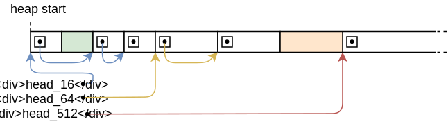

# Allocator Designs(分配器设计)

This post explains how to implement heap allocators from scratch. It presents and discusses different allocator designs, including bump allocation, linked list allocation, and fixed-size block allocation. For each of the three designs, we will create a basic implementation that can be used for our kernel.

这边文章会说明如何从零开始实现一个堆内存分配器。我们会展示并讨论不同类型的内存分配器设计，包括线性分配器，链表分配器以及固定大小的块分配器。针对这三种类型的分配器，我们都会做一个我们内核可用的基础的实现。

This blog is openly developed on [GitHub](https://github.com/phil-opp/blog_os). If you have any problems or questions, please open an issue there. You can also leave comments at the bottom. The complete source code for this post can be found in the [post-11](https://github.com/phil-opp/blog_os/tree/post-11) branch.

这篇博客是在[GitHub](https://github.com/phil-opp/blog_os)上公开开发的。如果你有任何问题或疑问，请在那里开一个问题。你也可以在底部留下评论。
本帖的完整源代码可以在[post-11](https://github.com/phil-opp/blog_os/tree/post-11)分支中找到。


## Introduction(介绍)

In the [previous post](https://os.phil-opp.com/heap-allocation/), we added basic support for heap allocations to our kernel. For that, we [created a new memory region](https://os.phil-opp.com/heap-allocation/#creating-a-kernel-heap) in the page tables and [used the linked_list_allocator crate](https://os.phil-opp.com/heap-allocation/#using-an-allocator-crate) to manage that memory. While we have a working heap now, we left most of the work to the allocator crate without trying to understand how it works.

在[上一篇文章](https://os.phil-opp.com/heap-allocation/)中，我们为我们的内核增加了基础的堆分配器支持。为此，我们在页表上创建了一个新的内存区域，并且使用了[链表分配器crate](https://os.phil-opp.com/heap-allocation/#using-an-allocator-crate)来管理这这块内存。
虽然我们现在拥有了一个可用的堆内存，但是我们把大部分的工作都交给了分配器crate来做而没有是理解他是怎么工作的。

In this post, we will show how to create our own heap allocator from scratch instead of relying on an existing allocator crate. We will discuss different allocator designs, including a simplistic bump allocator and a basic fixed-size block allocator, and use this knowledge to implement an allocator with improved performance (compared to the linked_list_allocator crate).

在这篇文章里，我们将会学习如何从零创建我们自己的堆内存分配器而不是依赖已经有的第三方分配器crate.我们会讨论不同的分配器设计，包括非常简单的线性分配器，基础的固定大小的块分配器，并且通过这些知识来实现一个性能优化版的(链表)分配器(和linked_list_allocator crate 相比)

### Design Goals(设计的目标)

The responsibility of an allocator is to manage the available heap memory. It needs to return unused memory on `alloc` calls and keep track of memory freed by `dealloc` so that it can be reused again. Most importantly, it must never hand out memory that is already in use somewhere else because this would cause undefined behavior.

分配器的职责就是管理可用的堆内存。他需要在调用`alloc`的时候返回未被其他人使用的内存并且跟踪那些被`dealloc`释放内存，以此实现内存重用。最重要的是，他一定不能返回已经在别处被使用着的内存，因为这会导致未定义的行为。

Apart from correctness, there are many secondary design goals. For example, the allocator should effectively utilize the available memory and keep fragmentation low. Furthermore, it should work well for concurrent applications and scale to any number of processors. For maximal performance, it could even optimize the memory layout with respect to the CPU caches to improve [cache locality](https://www.geeksforgeeks.org/locality-of-reference-and-cache-operation-in-cache-memory/) and avoid [false sharing](https://mechanical-sympathy.blogspot.de/2011/07/false-sharing.html).

除了正确性之外，还有许多次要的设计目标。例如，分配器应该有效地利用可用的内存，并保持低碎片化。此外，它应该能很好地适用于并发应用，并能扩展到任何数量的处理器。为了获得最大的性能，它甚至可以优化相对于CPU缓存的内存布局，以提高[缓存的局部性](https://www.geeksforgeeks.org/locality-of-reference-and-cache-operation-in-cache-memory/)并避免[伪共享](https://mechanical-sympathy.blogspot.de/2011/07/false-sharing.html)。

These requirements can make good allocators very complex. For example, [jemalloc](http://jemalloc.net/) has over 30.000 lines of code. This complexity is often undesired in kernel code, where a single bug can lead to severe security vulnerabilities. Fortunately, the allocation patterns of kernel code are often much simpler compared to userspace code, so that relatively simple allocator designs often suffice.

这些要求使得编写好的分配器变得非常复杂。例如，[jemalloc](http://jemalloc.net/)有超过30.000行的代码。这种复杂性在内核代码中往往是不受欢迎的，因为一个错误就会导致严重的安全漏洞。幸运的是，与用户空间代码相比，内核代码的分配模式通常要简单得多，所以相对简单的分配器设计往往就足够了。

In the following, we present three possible kernel allocator designs and explain their advantages and drawbacks.

在下文中，我们将介绍三种可能的内核分配器设计，并解释其优点和缺点。

## Bump Allocator(线性分配器)

The most simple allocator design is a bump allocator (also known as stack allocator). It allocates memory linearly and only keeps track of the number of allocated bytes and the number of allocations. It is only useful in very specific use cases because it has a severe limitation: it can only free all memory at once.

最简单的分配器设计是线性分配器(也被称为栈分配器)。他以线性方式分配内存并且只跟踪已经分配的字节数量和分配次数。它只在特殊的场景下有用，因为他有一个非常严重的限制:他只能一次性释放所有的内存。

### Idea(思路)

The idea behind a bump allocator is to linearly allocate memory by increasing (“bumping”) a `next` variable, which points to the start of the unused memory. At the beginning, `next` is equal to the start address of the heap. On each allocation, `next` is increased by the allocation size so that it always points to the boundary between used and unused memory:

线性分配器的思路是通过增加`next`变量来线性分配内存，`next`指向未使用内存的起点。最初，`next`就是堆内存的开始地址。每次分配，`next`都会增加分配的大小，因此他总是指向已使用内存和未使用内存的边界。


The `next` pointer only moves in a single direction and thus never hands out the same memory region twice. When it reaches the end of the heap, no more memory can be allocated, resulting in an out-of-memory error on the next allocation.

`next`指针只会朝一个方向异动所以永远不会将同一块内存发放两次。当他到达堆内存的末端，没有内存可以被分配的时候，那么下次分配就会出现内存不足的错误。

A bump allocator is often implemented with an allocation counter, which is increased by 1 on each `alloc` call and decreased by 1 on each `dealloc` call. When the allocation counter reaches zero, it means that all allocations on the heap have been deallocated. In this case, the `next` pointer can be reset to the start address of the heap, so that the complete heap memory is available for allocations again.

线性分配器经常通过分配计数器实现，每次`alloc`调用分配计数加一，每次`dealloc`调用时则减一。当分配计数器为零的时候，这代表堆上所有的分配都已经释放。这种情况下，`next`指针就可以重置到堆内存的起始地址，这样整个堆内存又重新可用了。


### Implementation(实现)

We start our implementation by declaring a new `allocator::bump` submodule:

我们通过声明一个新的`allocator::bump`子模块开始我们的实现：

```rust
// in src/allocator.rs

pub mod bump;

```

The content of the submodule lives in a new `src/allocator/bump.rs` file, which we create with the following content:

子模块的代码位于新的`src/allocator/bump.rs`文件中，内容如下：

```rust
// in src/allocator/bump.rs

pub struct BumpAllocator {
    heap_start: usize,
    heap_end: usize,
    next: usize,
    allocations: usize,
}

impl BumpAllocator {
    /// Creates a new empty bump allocator.
    pub const fn new() -> Self {
        BumpAllocator {
            heap_start: 0,
            heap_end: 0,
            next: 0,
            allocations: 0,
        }
    }

    /// Initializes the bump allocator with the given heap bounds.
    ///
    /// This method is unsafe because the caller must ensure that the given
    /// memory range is unused. Also, this method must be called only once.
    pub unsafe fn init(&mut self, heap_start: usize, heap_size: usize) {
        self.heap_start = heap_start;
        self.heap_end = heap_start + heap_size;
        self.next = heap_start;
    }
}

```

The `heap_start` and `heap_end` fields keep track of the lower and upper bounds of the heap memory region. The caller needs to ensure that these addresses are valid, otherwise the allocator would return invalid memory. For this reason, the init function needs to be `unsafe` to call.

`heap_start`和`heap_end`字段纪录了堆内存区域的下界和上界。调用者需要确保这些地址有效，否则分配器将返回无效的内存。因此，init函数需要被标记为`unsafe`调用。

The purpose of the `next` field is to always point to the first unused byte of the heap, i.e., the start address of the next allocation. It is set to `heap_start` in the init function because at the beginning, the entire heap is unused. On each allocation, this field will be increased by the allocation size (“bumped”) to ensure that we don’t return the same memory region twice.

`next`字段的目的是始终指向堆的第一个未使用的字节，也就是下一次分配的起始地址。它在init函数中被设置为`heap_start`，因为在开始时，整个堆是未使用状态。在每次分配时，这个字段将加上此次分配的大小，以确保我们不会两次返回相同的内存区域。

The `allocations` field is a simple counter for the active allocations with the goal of resetting the allocator after the last allocation has been freed. It is initialized with 0.

`allocationations`字段是一个简单的计数器，用于记录未释放的分配，目的是在最后一次分配被释放后重置分配器。它被初始化为0。

We chose to create a separate `init` function instead of performing the initialization directly in `new` in order to keep the interface identical to the allocator provided by the `linked_list_allocator` crate. This way, the allocators can be switched without additional code changes.

我们选择创建一个单独的`init`函数，而不是直接在`new`中执行初始化，是为了保持与`linked_list_allocator` crate分配器的接口一致。这样一来，分配器就可以在不改变代码的情况下进行切换。


### Implementing `GlobalAlloc`(实现`GlobalAlloc`)

As [explained in the previous post](https://os.phil-opp.com/heap-allocation/#the-allocator-interface), all heap allocators need to implement the [GlobalAlloc](https://doc.rust-lang.org/alloc/alloc/trait.GlobalAlloc.html) trait, which is defined like this:

如[上一篇文章所述](https://os.phil-opp.com/heap-allocation/#the-allocator-interface)，所有堆分配器都需要实现[GlobalAlloc](https://doc.rust-lang.org/alloc/alloc/trait.GlobalAlloc.html) trait，其定义如下：

```rust
pub unsafe trait GlobalAlloc {
    unsafe fn alloc(&self, layout: Layout) -> *mut u8;
    unsafe fn dealloc(&self, ptr: *mut u8, layout: Layout);

    unsafe fn alloc_zeroed(&self, layout: Layout) -> *mut u8 { ... }
    unsafe fn realloc(
        &self,
        ptr: *mut u8,
        layout: Layout,
        new_size: usize
    ) -> *mut u8 { ... }
}

```

Only the `alloc` and `dealloc` methods are required; the other two methods have default implementations and can be omitted.

仅需要实现`alloc`和`dealloc`方法，其他两个方法均具有默认实现，我们在实现时可以忽略。

#### First Implementation Attempt(第一次实现尝试)

Let’s try to implement the `alloc` method for our `BumpAllocator`:

让我们试着为`BumpAllocator`实现`alloc`方法：

```rust
// in src/allocator/bump.rs

use alloc::alloc::{GlobalAlloc, Layout};

unsafe impl GlobalAlloc for BumpAllocator {
    unsafe fn alloc(&self, layout: Layout) -> *mut u8 {
        // TODO alignment and bounds check
        let alloc_start = self.next;
        self.next = alloc_start + layout.size();
        self.allocations += 1;
        alloc_start as *mut u8
    }

    unsafe fn dealloc(&self, _ptr: *mut u8, _layout: Layout) {
        todo!();
    }
}

```

First, we use the `next` field as the start address for our allocation. Then we update the next field to point to the end address of the allocation, which is the next unused address on the heap. Before returning the start address of the allocation as a `*mut u8` pointer, we increase the `allocations` counter by 1.

首先我们将`next`字段用作分配的起始地址。然后更新next字段，使其指向分配的结束地址，即堆上的下一个未使用的地址。最后，在将分配的起始地址作为`* mut u8`指针返回之前，我们将分配计数器加1。

Note that we don’t perform any bounds checks or alignment adjustments, so this implementation is not safe yet. This does not matter much because it fails to compile anyway with the following error:


注意，我们没有执行任何边界检查或对齐调整，因此此实现尚不安全。这无关紧要，因为无论如何它都无法通过编译：

```
error[E0594]: cannot assign to `self.next` which is behind a `&` reference
  --> src/allocator/bump.rs:29:9
   |
29 |         self.next = alloc_start + layout.size();
   |         ^^^^^^^^^^^^^^^^^^^^^^^^^^^^^^^^^^^^^^^ `self` is a `&` reference, so the data it refers to cannot be written

```
(The same error also occurs for the `self.allocations += 1` line. We omitted it here for brevity.)

(`self.allocations += 1`行也会报告相同的错误，在此省略。)

The error occurs because the `alloc` and `dealloc` methods of the `GlobalAlloc` trait only operate on an immutable `&self` reference, so updating the `next` and `allocations` fields is not possible. This is problematic because updating `next` on every allocation is the essential principle of a bump allocator.

错误发生的原因是`GlobalAlloc`特性的`alloc`和`dealloc`方法只对一个不可变的`&self`引用进行操作，所以更新`next`和`allocations`字段是不可能的。这是有问题的，因为每次分配时更新`next`是线性分配器的基本原则。

#### `GlobalAlloc` and Mutability(`GlobalAlloc`以及可变性)

Before we look at a possible solution to this mutability problem, let’s try to understand why the `GlobalAlloc` trait methods are defined with `&self` arguments: As we saw [in the previous post](https://os.phil-opp.com/heap-allocation/#the-global-allocator-attribute), the global heap allocator is defined by adding the `#[global_allocator]` attribute to a static that implements the `GlobalAlloc` trait. `Static` variables are immutable in Rust, so there is no way to call a method that takes `&mut` self on the static allocator. For this reason, all the methods of `GlobalAlloc` only take an immutable `&self` reference.

在我们着手这个可变性问题的解决方案之前，让我们试着理解为什么`GlobalAlloc` trait方法被定义为`&self`参数。正如我们在[上一篇文章](https://os.phil-opp.com/heap-allocation/#the-global-allocator-attribute)中所看到的，全局堆分配器是通过向实现`GlobalAlloc` trait的静态变量添加`#[global_allocator]`属性来定义的。静态变量在Rust中是不可改变的，所以没有办法在静态分配器上调用一个带`&mut self`的方法。由于这个原因，`GlobalAlloc`的所有方法都只取一个不可变的`&self`引用。


Fortunately, there is a way to get a `&mut self` reference from a `&self` reference: We can use synchronized [interior mutability](https://doc.rust-lang.org/book/ch15-05-interior-mutability.html) by wrapping the allocator in a [spin::Mutex](https://docs.rs/spin/0.5.0/spin/struct.Mutex.html) spinlock. This type provides a `lock` method that performs [mutual exclusion](https://en.wikipedia.org/wiki/Mutual_exclusion) and thus safely turns a `&self` reference to a `&mut self` reference. We’ve already used the wrapper type multiple times in our kernel, for example for the [VGA text buffer](https://os.phil-opp.com/vga-text-mode/#spinlocks).

幸运的是，有一种方法可以从一个`&self`引用中获得`&mut self`引用。我们可以通过将分配器封装在[spin::Mutex](https://docs.rs/spin/0.5.0/spin/struct.Mutex.html)的`spinlock`中来使用同步的[内部可变性](https://doc.rust-lang.org/book/ch15-05-interior-mutability.html)。这种类型提供了一个锁方法，可以执行互斥，从而安全地将`&self`引用变成`&mut self`。我们已经在我们的内核中多次使用了该封装类型，例如用于[VGA文本缓冲器](https://os.phil-opp.com/vga-text-mode/#spinlocks)。

#### A `Locked` Wrapper Type(`Locked`封装类型)

With the help of the `spin::Mutex` wrapper type, we can implement the `GlobalAlloc` trait for our bump allocator. The trick is to implement the trait not for the `BumpAllocator` directly, but for the wrapped `spin::Mutex<BumpAllocator>` type:

借助`spin::Mutex`封装类型，我们可以为线性分配器实现`GlobalAlloc`特性。这里的技巧是不是直接为`BumpAllocator`实现trait，而是为封装的`spin::Mutex <BumpAllocator>`类型实现trait：

```rust
unsafe impl GlobalAlloc for spin::Mutex<BumpAllocator> {…}
```

Unfortunately, this still doesn’t work because the Rust compiler does not permit trait implementations for types defined in other crates:

很不幸这仍然不起作用，因为Rust编译器不允许为其他crate中定义的类型的实现trait：

```
error[E0117]: only traits defined in the current crate can be implemented for arbitrary types
  --> src/allocator/bump.rs:28:1
   |
28 | unsafe impl GlobalAlloc for spin::Mutex<BumpAllocator> {
   | ^^^^^^^^^^^^^^^^^^^^^^^^^^^^--------------------------
   | |                           |
   | |                           `spin::mutex::Mutex` is not defined in the current crate
   | impl doesn't use only types from inside the current crate
   |
   = note: define and implement a trait or new type instead

```

To fix this, we need to create our own wrapper type around `spin::Mutex`:

要解决此问题，我们需要再次封装spin::Mutex以创建自己的封装类型：


```rust
// in src/allocator.rs

/// A wrapper around spin::Mutex to permit trait implementations.
pub struct Locked<A> {
    inner: spin::Mutex<A>,
}

impl<A> Locked<A> {
    pub const fn new(inner: A) -> Self {
        Locked {
            inner: spin::Mutex::new(inner),
        }
    }

    pub fn lock(&self) -> spin::MutexGuard<A> {
        self.inner.lock()
    }
}

```

The type is a generic wrapper around a `spin::Mutex<A>`. It imposes no restrictions on the wrapped type `A`, so it can be used to wrap all kinds of types, not just allocators. It provides a simple `new` constructor function that wraps a given value. For convenience, it also provides a `lock` function that calls lock on the wrapped `Mutex`. Since the `Locked` type is general enough to be useful for other allocator implementations too, we put it in the parent `allocator` module.

该类型是一个`spin::Mutex<A>`的泛型封装。它对被封装的类型`A`没有任何限制，所以它可以用来封装所有种类的类型，而不仅仅是分配器。它提供了一个简单的`new`构造函数来封装一个给定的值。为了方便起见，它还提供了一个`lock`函数，该函数可调用被封装的`Mutex`上的`lock`函数。由于`Locked`类型非常通用，也可用在其他分配器实现中，因此我们将它放在父级模块`allocator`中。

#### Implementation for `Locked<BumpAllocator>`(实现`Locked<BumpAllocator>`)

The `Locked` type is defined in our own crate (in contrast to `spin::Mutex`), so we can use it to implement `GlobalAlloc` for our bump allocator. The full implementation looks like this:

`Locked`类型是在我们自己的crate中定义的（与`spin::Mutex`不同），因此可以用来为线性分配器实现`GlobalAlloc`。完整实现如下：

```rust
// in src/allocator/bump.rs

use super::{align_up, Locked};
use alloc::alloc::{GlobalAlloc, Layout};
use core::ptr;

unsafe impl GlobalAlloc for Locked<BumpAllocator> {
    unsafe fn alloc(&self, layout: Layout) -> *mut u8 {
        let mut bump = self.lock(); // get a mutable reference

        let alloc_start = align_up(bump.next, layout.align());
        let alloc_end = match alloc_start.checked_add(layout.size()) {
            Some(end) => end,
            None => return ptr::null_mut(),
        };

        if alloc_end > bump.heap_end {
            ptr::null_mut() // out of memory
        } else {
            bump.next = alloc_end;
            bump.allocations += 1;
            alloc_start as *mut u8
        }
    }

    unsafe fn dealloc(&self, _ptr: *mut u8, _layout: Layout) {
        let mut bump = self.lock(); // get a mutable reference

        bump.allocations -= 1;
        if bump.allocations == 0 {
            bump.next = bump.heap_start;
        }
    }
}
```

The first step for both `alloc` and `dealloc` is to call the `Mutex::lock` method through the `inner` field to get a mutable reference to the wrapped allocator type. The instance remains locked until the end of the method, so that no data race can occur in multithreaded contexts (we will add threading support soon).

`alloc`和`dealloc`的第一步都是调用`Mutex::lock`方法然后再通过`inner`获取被封装分配器类型的可变引用。该实例将保持锁定状态，直到方法结束，即使在多线程环境中也不会发生数据竞争（我们将很快添加线程支持）。

Compared to the previous prototype, the `alloc` implementation now respects alignment requirements and performs a bounds check to ensure that the allocations stay inside the heap memory region. The first step is to round up the `next` address to the alignment specified by the `Layout` argument. The code for the `align_up` function is shown in a moment. We then add the requested allocation size to `alloc_start` to get the end address of the allocation. To prevent integer overflow on large allocations, we use the [checked_add](https://doc.rust-lang.org/std/primitive.usize.html#method.checked_add) method. If an overflow occurs or if the resulting end address of the allocation is larger than the end address of the heap, we return a null pointer to signal an out-of-memory situation. Otherwise, we update the `next` address and increase the `allocations` counter by 1 like before. Finally, we return the `alloc_start` address converted to a `*mut u8` pointer.

与之前的原型相比，现在的`alloc`实现遵守了对齐要求，并执行了边界检查以确保分配留在堆内存区域内。第一步是将`next`地址向上对齐到Layout参数。`align_up`函数的代码稍后显示。然后，我们将要求的分配大小加到`alloc_start`上，得到分配的结束地址。为了防止大型分配的整数溢出，我们使用[checked_add](https://doc.rust-lang.org/std/primitive.usize.html#method.checked_add)方法。如果发生溢出，或者分配的结束地址大于堆的结束地址，我们会返回一个空指针，以示出现内存不足的情况。否则，我们会更新`next`地址，并像以前一样将分配的计数器增加1。最后，我们返回转换为`*mut u8`指针的`alloc_start`地址。

The dealloc function ignores the given pointer and `Layout` arguments. Instead, it just decreases the `allocations` counter. If the counter reaches`0` again, it means that all allocations were freed again. In this case, it resets the `next` address to the `heap_start` address to make the complete heap memory available again.

`dealloc`函数忽略了给定的指针和`Layout`参数。相反，它只是减少了分配的计数器。如果该计数器再次达到`0`，这意味着所有的分配被再次释放。在这种情况下，它将`next`地址重置为`heap_start`地址，使完整的堆内存再次可用。

#### Address Alignment(地址对齐)
The `align_up` function is general enough that we can put it into the parent `allocator` module. A basic implementation looks like this:

```rust
// in src/allocator.rs

/// Align the given address `addr` upwards to alignment `align`.
fn align_up(addr: usize, align: usize) -> usize {
    let remainder = addr % align;
    if remainder == 0 {
        addr // addr already aligned
    } else {
        addr - remainder + align
    }
}
```

The function first computes the [remainder](https://en.wikipedia.org/wiki/Euclidean_division) of the division of `addr` by `align`. If the remainder is `0`, the address is already aligned with the given alignment. Otherwise, we align the address by subtracting the remainder (so that the new remainder is 0) and then adding the alignment (so that the address does not become smaller than the original address).

函数首先结算`addr`除以`align`的余数。如果余数为0，则地址已经与给定的参数对齐。否则，我们通过减去余数（这样新的余数为0）然后加上对齐参数（保证新地址不会变得小于原地址）来对齐地址。

Note that this isn’t the most efficient way to implement this function. A much faster implementation looks like this:

请注意，这并不是实现此函数最高效的实现。更快的实现如下所示：

```rust
/// Align the given address `addr` upwards to alignment `align`.
///
/// Requires that `align` is a power of two.
fn align_up(addr: usize, align: usize) -> usize {
    (addr + align - 1) & !(align - 1)
}
```

This method requires `align` to be a power of two, which can be guaranteed by utilizing the `GlobalAlloc` trait (and its [Layout ](https://doc.rust-lang.org/alloc/alloc/struct.Layout.html) parameter). This makes it possible to create a [bitmask](https://en.wikipedia.org/wiki/Mask_(computing)) to align the address in a very efficient way. To understand how it works, let’s go through it step by step, starting on the right side:

- Since `align` is a power of two, its [binary representation](https://en.wikipedia.org/wiki/Binary_number#Representation) has only a single bit set (e.g. `0b000100000`). This means that align - 1 has all the lower bits set (e.g. `0b00011111`).
- By creating the [bitwise NOT](https://en.wikipedia.org/wiki/Bitwise_operation#NOT) through the `!` operator, we get a number that has all the bits set except for the bits lower than `align` (e.g. `0b…111111111100000`).
- By performing a [bitwise AND](https://en.wikipedia.org/wiki/Bitwise_operation#AND) on an address and `!(align - 1)`, we align the address downwards. This works by clearing all the bits that are lower than `align`.
- Since we want to align upwards instead of downwards, we increase the `addr` by `align - 1` before performing the bitwise `AND`. This way, already aligned addresses remain the same while non-aligned addresses are rounded to the next alignment boundary.

该函数利用`GlobalAlloc` trait(以及他的[Layout](https://doc.rust-lang.org/alloc/alloc/struct.Layout.html)参数)确保`align`始终是2的幂。这样就可以非常高效的通过创建[位掩码](https://en.wikipedia.org/wiki/Mask_(computing))的方式来执行地址对齐。让我们从右往左一步一步理解其工作原理：

- 由于`align`是2的幂，因此它的[二进制表示](https://en.wikipedia.org/wiki/Binary_number#Representation)只会有一位被置为1（例如`0b000100000`）。这意味着`align-1`操作会将所有低位置为1（例如`0b00011111`）。
- 通过`!`执行[按位NOT](https://en.wikipedia.org/wiki/Bitwise_operation#NOT)运算，我们得到一个除低于`align`的位外（例如`0b…111111111100000`）其余位均置为`1`的数字。
- 通过对地址和`!(align-1)`进行[按位AND](https://en.wikipedia.org/wiki/Bitwise_operation#AND)，地址将向下对齐，即清除所有低于`align`的位。
- 由于需要的是要向上对齐而不是向下对齐，因此在执行按位与运算之前，需要给`addr`增加`align-1`。如此，已对齐的地址将保持不变，而未对齐的地址将在下一个对齐边界处取整。
  

Which variant you choose is up to you. Both compute the same result, only using different methods.

你可以选择任意一种实现方式，它们的计算结果是相同的。


### Using It(使用线性分配器)

To use the bump allocator instead of the `linked_list_allocator` crate, we need to update the `ALLOCATOR` static in `allocator.rs`:

要使用线性分配器而不是`linked_list_allocatorcrate`，我们需要修改`allocator.rs`中的静态变量`ALLOCATOR`:

```rust
// in src/allocator.rs

use bump::BumpAllocator;

#[global_allocator]
static ALLOCATOR: Locked<BumpAllocator> = Locked::new(BumpAllocator::new());
```

Here it becomes important that we declared `BumpAllocator::new` and `Locked::new` as [const functions](https://doc.rust-lang.org/reference/items/functions.html#const-functions). If they were normal functions, a compilation error would occur because the initialization expression of a `static` must be evaluable at compile time.


注意，这里的`BumpAllocator::new`和`Locked::new`均已声明为[const函数](https://doc.rust-lang.org/reference/items/functions.html#const-functions)。如果它们是普通函数，则会发生编译错误，因为`static`变量的初始化表达式必须在编译期求值。


We don’t need to change the `ALLOCATOR.lock().init(HEAP_START, HEAP_SIZE)` call in our `init_heap` function because the bump allocator provides the same interface as the allocator provided by the `linked_list_allocator`.

我们不需要在`init_heap`函数中修改`ALLOCATOR.lock().init(HEAP_START, HEAP_SIZE)`调用，因为线性分配器提供的接口与`linked_list_allocator`相同。

Now our kernel uses our bump allocator! Everything should still work, including the [heap_allocation tests](https://os.phil-opp.com/heap-allocation/#adding-a-test) that we created in the previous post:

现在内核使用了线性分配器！原来的代码应该仍然有效，包括我们在上一篇文章中创建的[heap_allocation测试](https://os.phil-opp.com/heap-allocation/#adding-a-test)：

```
> cargo test --test heap_allocation
[…]
Running 3 tests
simple_allocation... [ok]
large_vec... [ok]
many_boxes... [ok]

```

### Discussion(讨论)

The big advantage of bump allocation is that it’s very fast. Compared to other allocator designs (see below) that need to actively look for a fitting memory block and perform various bookkeeping tasks on `alloc` and `dealloc`, a bump allocator [can be optimized](https://fitzgeraldnick.com/2019/11/01/always-bump-downwards.html) to just a few assembly instructions. This makes bump allocators useful for optimizing the allocation performance, for example when creating a [virtual DOM library](https://hacks.mozilla.org/2019/03/fast-bump-allocated-virtual-doms-with-rust-and-wasm/).

线性分配的最大优点是效率极高。与需要主动寻找合适的内存块并在`alloc`和`dealloc`方法上执行各种跟踪记录任务的其他分配器设计（参见下文）相比，线性分配器甚至可以[被优化](https://fitzgeraldnick.com/2019/11/01/always-bump-downwards.html)为一组汇编指令。因此，在分配器性能优化任务中，线性分配器就十分有用，例如在创建[虚拟DOM库](https://hacks.mozilla.org/2019/03/fast-bump-allocated-virtual-doms-with-rust-and-wasm/)时。

While a bump allocator is seldom used as the global allocator, the principle of bump allocation is often applied in the form of [arena allocation](https://mgravell.github.io/Pipelines.Sockets.Unofficial/docs/arenas.html), which basically batches individual allocations together to improve performance. An example of an arena allocator for Rust is contained in the [toolshed](https://docs.rs/toolshed/0.8.1/toolshed/index.html) crate.

不过线性分配器很少被当做全局分配器使用，它通常出现在[arena allocation](https://mgravell.github.io/Pipelines.Sockets.Unofficial/docs/arenas.html)中，即将多个独立的分配器组合在一起以提高性能。Rust中的竞技场分配器的一个实现是[toolshed](https://docs.rs/toolshed/0.8.1/toolshed/index.html)。

#### The Drawback of a Bump Allocator(线性分配器的缺点)

The main limitation of a bump allocator is that it can only reuse deallocated memory after all allocations have been freed. This means that a single long-lived allocation suffices to prevent memory reuse. We can see this when we add a variation of the `many_boxes` test:

线性分配器的主要局限性在于，它只有在释放了所有分配后才能重新使用释放的内存再次进行分配。这意味着一个长期独占的分配就足以拖延内存的重用。我们只需对`many_boxes`测试稍加修改就可以演示这个现象：


```rust
// in tests/heap_allocation.rs

#[test_case]
fn many_boxes_long_lived() {
    let long_lived = Box::new(1); // new
    for i in 0..HEAP_SIZE {
        let x = Box::new(i);
        assert_eq!(*x, i);
    }
    assert_eq!(*long_lived, 1); // new
}
```

Like the `many_boxes` test, this test creates a large number of allocations to provoke an out-of-memory failure if the allocator does not reuse freed memory. Additionally, the test creates a `long_lived` allocation, which lives for the whole loop execution.

像`many_boxes`一样，此测试也会创建大量分配，如果分配器不重新使用释放的内存，将引发内存不足的错误。此外，测试会创建一个`long_lived`分配，该分配在整个循环执行期间均有效。

When we try to run our new test, we see that it indeed fails:

当我们尝试运行新测试时将发行测试确实失败了：

```
> cargo test --test heap_allocation
Running 4 tests
simple_allocation... [ok]
large_vec... [ok]
many_boxes... [ok]
many_boxes_long_lived... [failed]

Error: panicked at 'allocation error: Layout { size_: 8, align_: 8 }', src/lib.rs:86:5
```

Let’s try to understand why this failure occurs in detail: First, the `long_lived` allocation is created at the start of the heap, thereby increasing the `allocations` counter by 1. For each iteration of the loop, a short-lived allocation is created and directly freed again before the next iteration starts. This means that the `allocations` counter is temporarily increased to 2 at the beginning of an iteration and decreased to 1 at the end of it. The problem now is that the bump allocator can only reuse memory after all `allocations` have been freed, i.e., when the `allocations` counter falls to 0. Since this doesn’t happen before the end of the loop, each loop iteration allocates a new region of memory, leading to an out-of-memory error after a number of iterations.

详细讨论一下测试为什么会失败：首先，在堆的开头创建`long_lived`分配，从而将`allocations`计数器加1。在每次循环中，都会创建一个短暂的分配并在下一次迭代开始之前就被释放。这意味着`allocations`计数器在迭代开始时临时增加到2，在迭代结束时减少为1。现在的问题是，线性分配器仅在所有分配释放后才可以重用内存，即`allocations`计数器减至0。不过这在整个循环完全结束之前都不会发生，因此每次循环迭代都将会分配出去一个新的内存块，从而使得内存在多次迭代后耗尽。

#### Fixing the Test?(修复这个测试？)

There are two potential tricks that we could utilize to fix the test for our bump allocator:

- We could update `dealloc` to check whether the freed allocation was the last allocation returned by `alloc` by comparing its end address with the `next` pointer. In case they’re equal, we can safely reset `next` back to the start address of the freed allocation. This way, each loop iteration reuses the same memory block.
- We could add an `alloc_back` method that allocates memory from the end of the heap using an additional `next_back` field. Then we could manually use this allocation method for all long-lived allocations, thereby separating short-lived and long-lived allocations on the heap. Note that this separation only works if it’s clear beforehand how long each allocation will live. Another drawback of this approach is that manually performing allocations is cumbersome and potentially unsafe.

有两个的技巧可以用来修复这个线性分配器的测试：

- 我们可以修改`dealloc`，通过比较被释放内存的结束地址与`next`指针是否一致，来判断本次内存释放是否为刚刚才分配出去的内存。如果二者相等，我们可以安全地将`next`重置为刚刚被释放的分配的起始地址。如此，每次循环都将会重复同一个内存块。
- 我们也可以添加一个`alloc_back`方法，该方法使用额外的`next_back`字段从堆尾开始分配内存。然后，我们就可以为所有长期分配手动调用方法，从而在堆上将短期分配和长期分配分隔开。请注意，只有事先清楚每个分配的有效期限，才能使用这种分隔。该方法的另一个缺点是需要手动执行分配，麻烦且存在安全风险。

While both of these approaches work to fix the test, they are not a general solution since they are only able to reuse memory in very specific cases. The question is: Is there a general solution that reuses all freed memory?

虽然这两种方法都可以修复测试，但它们并不是通用的解决方案，因为它们都只能在非常特殊的情况下重用内存。问题是：是否有一个通用的解决方案可以重用所有已释放的内存？


#### Reusing All Freed Memory?(重用所有被释放的内存?)

As we learned [in the previous post](https://os.phil-opp.com/heap-allocation/#dynamic-memory), allocations can live arbitrarily long and can be freed in an arbitrary order. This means that we need to keep track of a potentially unbounded number of non-continuous, unused memory regions, as illustrated by the following example:


正如我们在[上一篇文章](https://os.phil-opp.com/heap-allocation/#dynamic-memory)中了解到的那样，分配可能具有任意的生命周期，并且可以按照任意顺序释放。这意味着我们需要跟踪数量未知且非连续的未使用内存区域，如以下示例所示：


The graphic shows the heap over the course of time. At the beginning, the complete heap is unused, and the `next` address is equal to `heap_start` (line 1). Then the first allocation occurs (line 2). In line 3, a second memory block is allocated and the first allocation is freed. Many more allocations are added in line 4. Half of them are very short-lived and already get freed in line 5, where another new allocation is also added.

上图显示了堆的分配状态随时间的变化。一开始，整个堆都是未使用的，此时`next`地址等于`heap_start`（第1行）。然后出现了第一次分配（第2行）。在第3行中，第二个存储块被分配出去，同时第一个分配被释放了。在第4行中新增了更多分配。其中一半有效期很短，它们在第5行中已被释放，而且在这一行中还新增了另一个分配。

Line 5 shows the fundamental problem: We have five unused memory regions with different sizes, but the `next` pointer can only point to the beginning of the last region. While we could store the start addresses and sizes of the other unused memory regions in an array of size 4 for this example, this isn’t a general solution since we could easily create an example with 8, 16, or 1000 unused memory regions.

第5行显示了一个基本问题：我们共有五个未使用的内存区域，它们的大小各不相同，但是`next`指针只能指向最后一个区域的开始。尽管对于本示例，我们可以将其他未使用的存储区域的起始地址和大小存储在大小为4的数组中，但这并不是一个通用的解决方案，因为我们同样可以轻松地创建一个包含8个、16个或1000个未使用的存储区域的例子。

Normally, when we have a potentially unbounded number of items, we can just use a heap-allocated collection. This isn’t really possible in our case, since the heap allocator can’t depend on itself (it would cause endless recursion or deadlocks). So we need to find a different solution.

通常，当我们需要处理数量未知的项目时，会倾向于使用在堆上进行分配的集合类型。但在现在并不可行，因为堆分配器不能依赖于自身（这将导致无限递归或死锁）。因此，我们需要找到其他解决方案


## Linked List Allocator(链表分配器)

A common trick to keep track of an arbitrary number of free memory areas when implementing allocators is to use these areas themselves as backing storage. This utilizes the fact that the regions are still mapped to a virtual address and backed by a physical frame, but the stored information is not needed anymore. By storing the information about the freed region in the region itself, we can keep track of an unbounded number of freed regions without needing additional memory.

在实现分配器时，跟踪任意数量的空闲内存区域的常见技巧，就是将这些区域本身用作背后的存储。这利用了一个事实：这些已释放的内存区域仍被映射到虚拟地址上，其背后都有一个对应的物理帧，但是我们已经不再需要其上存储的信息了。通过使用区域本身存储该区域相关的内存释放信息，我们就可以跟踪任意数量的释放区域，而无需额外的内存。

The most common implementation approach is to construct a single linked list in the freed memory, with each node being a freed memory region:

最常见的实现方法是在释放的内存中构造一个链表，每个节点都是一个已释放的内存区域：


Each list node contains two fields: the size of the memory region and a pointer to the next unused memory region. With this approach, we only need a pointer to the first unused region (called `head`) to keep track of all unused regions, regardless of their number. The resulting data structure is often called a [free list](https://en.wikipedia.org/wiki/Free_list).

每个列表节点包含两个字段：此内存区域的大小和指向下一个未使用的内存区域的指针。使用这种方法，我们只需要那个指向第一个未使用区域的指针（称为`head`）即可跟踪所有未使用区域，而与它们的数量无关。产生的数据结构通常称为[空闲列表](https://en.wikipedia.org/wiki/Free_list)。

As you might guess from the name, this is the technique that the `linked_list_allocator` crate uses. Allocators that use this technique are also often called pool allocators.

你可能已经从名称中猜到，这正是`linked_list_allocatorcrate`使用的技术。使用此技术的分配器通常也被称为池分配器。

### Implementation(实现链表分配器)

In the following, we will create our own simple `LinkedListAllocator` type that uses the above approach for keeping track of freed memory regions. This part of the post isn’t required for future posts, so you can skip the implementation details if you like.

接下来，我们将使用上述跟踪已释放的内存区域的方法，自己实现一个简单的LinkedListAllocator类型。以后的文章并不需要这一部分的内容，因此你可以根据需要选择跳过实现细节。


#### The Allocator Type(分配器类型)

We start by creating a private `ListNode` struct in a new `allocator::linked_list` submodule:

我们首先在新的`allocator::linked_list`子模块中创建一个私有`ListNode`结构：

```rust
// in src/allocator.rs

pub mod linked_list;
```

```rust
// in src/allocator/linked_list.rs

struct ListNode {
    size: usize,
    next: Option<&'static mut ListNode>,
}
```

Like in the graphic, a list node has a `size` field and an optional pointer to the next node, represented by the `Option<&'static mut ListNode>` type. The `&'static mut` type semantically describes an [owned](https://doc.rust-lang.org/book/ch04-01-what-is-ownership.html) object behind a pointer. Basically, it’s a `Box` without a destructor that frees the object at the end of the scope.


就像在上图中描述的那样，列表节点具有一个`size`字段和一个指向下一个节点的可选指针，由`Option<&'static mut ListNode>`类型表示。`&'static mut`类型在语义上描述了指针[拥有](https://doc.rust-lang.org/book/ch04-01-what-is-ownership.html)其后指向的对象。这就基本上就是一个`Box`类型，只不过它没有能够在作用域末尾释放持有对象的析构函数。


We implement the following set of methods for `ListNode`:

我们为`ListNode`实现下列方法：

```rust
// in src/allocator/linked_list.rs

impl ListNode {
    const fn new(size: usize) -> Self {
        ListNode { size, next: None }
    }

    fn start_addr(&self) -> usize {
        self as *const Self as usize
    }

    fn end_addr(&self) -> usize {
        self.start_addr() + self.size
    }
}
```

The type has a simple constructor function named `new` and methods to calculate the start and end addresses of the represented region. We make the `new` function a` const function`, which will be required later when constructing a static linked list allocator. Note that any use of mutable references in const functions (including setting the next field to `None`) is still unstable. In order to get it to compile, we need to add `#![feature(const_mut_refs)]` to the beginning of our `lib.rs`.

该类型具有一个简单的构造函数`new`，以及用于计算所表示内存区域的开始地址和结束地址的方法。我们将新函数设为`const函数`，因为稍后会在构造静态链表分配器时使用到它。请注意，在const函数中使用可变引用（包括将next字段设置为`None`）仍然不稳定。为了能够编译，我们需要在`lib.rs`的开头添加`#![feature(const_mut_refs)]`。

With the `ListNode` struct as a building block, we can now create the `LinkedListAllocator` struct:

我们现在可以使用`ListNode`结构作为积木，来创建`LinkedListAllocator`结构体：

```rust
// in src/allocator/linked_list.rs

pub struct LinkedListAllocator {
    head: ListNode,
}

impl LinkedListAllocator {
    /// Creates an empty LinkedListAllocator.
    pub const fn new() -> Self {
        Self {
            head: ListNode::new(0),
        }
    }

    /// Initialize the allocator with the given heap bounds.
    ///
    /// This function is unsafe because the caller must guarantee that the given
    /// heap bounds are valid and that the heap is unused. This method must be
    /// called only once.
    pub unsafe fn init(&mut self, heap_start: usize, heap_size: usize) {
        self.add_free_region(heap_start, heap_size);
    }

    /// Adds the given memory region to the front of the list.
    unsafe fn add_free_region(&mut self, addr: usize, size: usize) {
        todo!();
    }
}
```

The struct contains a `head` node that points to the first heap region. We are only interested in the value of the `next` pointer, so we set the size to 0 in the `ListNode::new` function. Making `head` a `ListNode` instead of just a `&'static mut ListNode` has the advantage that the implementation of the `alloc` method will be simpler.


结构体包含一个head节点，指向第一个堆区域。我们只对`next`指针的值感兴趣，因此在`ListNode::new`函数中将大小设为0。将`head`设置为`ListNode`而不是仅使用`&'static mut ListNode`的优点是相应的`alloc`方法的实现将会更加简单。


Like for the bump allocator, the `new` function doesn’t initialize the allocator with the heap bounds. In addition to maintaining API compatibility, the reason is that the initialization routine requires writing a node to the heap memory, which can only happen at runtime. The `new` function, however, needs to be a `const function` that can be evaluated at compile time because it will be used for initializing the `ALLOCATOR` static. For this reason, we again provide a separate, non-constant `init` method.

就像线性分配器一样，`new`函数并不会直接使用堆边界来初始化分配器。除了希望保持API兼容性之外，原因还在于初始化过程需要将一个节点写入堆内存，这只能在运行时发生。然而，`new`函数必须是可以在编译时求值的`const函数`，因为它将用于初始化静态变量`ALLOCATOR`。出于这个原因，我们仍然使用一个独立的非-常量的函数`init`。

The `init` method uses an `add_free_region` method, whose implementation will be shown in a moment. For now, we use the `todo!` macro to provide a placeholder implementation that always panics.

`init`方法使用`add_free_region`方法，稍后将展示其实现。现在，我们使用`todo!`宏提供一个总是panic的实现占位符。

#### The `add_free_region` Method(`add_free_region`方法)

The `add_free_region` method provides the fundamental push operation on the linked list. We currently only call this method from `init`, but it will also be the central method in our `dealloc` implementation. Remember, the `dealloc` method is called when an allocated memory region is freed again. To keep track of this freed memory region, we want to push it to the linked list.

`add_free_region`方法为链表提供了基本的push操作。目前，我们仅在`init`中调用此方法，但它也将成为我们`dealloc`实现中的核心方法。请记住，当释放分配的内存区域时，将调用`dealloc`方法。为了跟踪此次释放产生的的未使用内存区域，我们希望将其push到链表中。

The implementation of the `add_free_region` method looks like this:

`add_free_region`方法的实现如下：

```rust
// in src/allocator/linked_list.rs

use super::align_up;
use core::mem;

impl LinkedListAllocator {
    /// Adds the given memory region to the front of the list.
    unsafe fn add_free_region(&mut self, addr: usize, size: usize) {
        // ensure that the freed region is capable of holding ListNode
        assert_eq!(align_up(addr, mem::align_of::<ListNode>()), addr);
        assert!(size >= mem::size_of::<ListNode>());

        // create a new list node and append it at the start of the list
        let mut node = ListNode::new(size);
        node.next = self.head.next.take();
        let node_ptr = addr as *mut ListNode;
        node_ptr.write(node);
        self.head.next = Some(&mut *node_ptr)
    }
}
```

The method takes the address and size of a memory region as an argument and adds it to the front of the list. First, it ensures that the given region has the necessary size and alignment for storing a `ListNode`. Then it creates the node and inserts it into the list through the following steps:

该方法获取一个内存区域的地址和大小作为参数，将该区域添加到列表前端。首先要保证给定的内存区域具有存储`ListNode`所需的大小和对齐方式。然后再按照下图中的步骤创建节点并将其插入到列表中：


Step 0 shows the state of the heap before `add_free_region` is called. In step 1, the method is called with the memory region marked as `freed` in the graphic. After the initial checks, the method creates a new `node` on its stack with the size of the freed region. It then uses the `Option::take` method to set the next pointer of the node to the current `head` pointer, thereby resetting the head pointer to `None`.

步骤0显示了调用`add_free_region`前堆的状态。在步骤1中，使用图中标记为`freed`的内存区域作为参数调用该方法。初步检查后，该方法使用空闲区域大小作为参数，在其调用栈上创建了一个新`node`。然后，它使用`Option::take`方法将新`node`的next指针设置为当前头指针，并将头指针的`next`重置为`None`。

In step 2, the method writes the newly created `node` to the beginning of the freed memory region through the [write](https://doc.rust-lang.org/std/primitive.pointer.html#method.write) method. It then points the `head` pointer to the new `node`. The resulting pointer structure looks a bit chaotic because the freed region is always inserted at the beginning of the list, but if we follow the pointers, we see that each free region is still reachable from the `head` pointer.

在步骤2中，该方法使用[write](https://doc.rust-lang.org/std/primitive.pointer.html#method.write)方法将新创建的node写入空闲内存区域的开头。最后将head的`next`指针指向这个新节点。图中最后呈现出来的指针结构略显混乱，这是因为释放区域总是在列表的开头插入，不过如果我们跟随指针，就会从`head`指针开始依次到达每个空闲区域了。


#### The `find_region` Method(`find_region`方法)

The second fundamental operation on a linked list is finding an entry and removing it from the list. This is the central operation needed for implementing the `alloc` method. We implement the operation as a `find_region` method in the following way:

链表的另一个基本操作是查找条目并将其从列表中移除。这是实现`alloc`方法所需的核心操作。我们通过以下方式将该操作实现为`find_region`方法：

```rust
// in src/allocator/linked_list.rs

impl LinkedListAllocator {
    /// Looks for a free region with the given size and alignment and removes
    /// it from the list.
    ///
    /// Returns a tuple of the list node and the start address of the allocation.
    fn find_region(&mut self, size: usize, align: usize)
        -> Option<(&'static mut ListNode, usize)>
    {
        // reference to current list node, updated for each iteration
        let mut current = &mut self.head;
        // look for a large enough memory region in linked list
        while let Some(ref mut region) = current.next {
            if let Ok(alloc_start) = Self::alloc_from_region(&region, size, align) {
                // region suitable for allocation -> remove node from list
                let next = region.next.take();
                let ret = Some((current.next.take().unwrap(), alloc_start));
                current.next = next;
                return ret;
            } else {
                // region not suitable -> continue with next region
                current = current.next.as_mut().unwrap();
            }
        }

        // no suitable region found
        None
    }
}
```

The method uses a current variable and a `while let loop` to iterate over the list elements. At the beginning, `current` is set to the (dummy) `head` node. On each iteration, it is then updated to the `next` field of the current node (in the `else` block). If the region is suitable for an allocation with the given size and alignment, the region is removed from the list and returned together with the `alloc_start` address.

该方法使用一个`current`变量和一个`while let`循环来遍历列表元素。首先，将`current`设置到（假的）head节点。然后，在每次迭代中，它都会更新为当前节点的`next`字段（在`else`块中）。如果该区域适合于具有给定大小和对齐方式的分配，则将该区域从链表中删除，并与`alloc_start`地址一起返回。

When the `current.next` pointer becomes `None`, the loop exits. This means we iterated over the whole list but found no region suitable for an allocation. In that case, we return `None`. Whether a region is suitable is checked by the `alloc_from_region` function, whose implementation will be shown in a moment.

当`current.next`指针变为`None`时，循环退出。这意味着我们遍历了整个链表，却没并有找到适合于给定分配的区域。在这种情况下，我们将返回`None`。检查区域是否合适由`alloc_from_region`函数完成，我们将在稍后展示其实现。

Let’s take a more detailed look at how a suitable region is removed from the list:

先让我们更加详细地研究如何从列表中删除合适的区域：


Step 0 shows the situation before any pointer adjustments. The `region` and `current` regions and the `region.next` and `current.next` pointers are marked in the graphic. In step 1, both the `region.next` and `current.next` pointers are reset to None by using the `Option::take` method. The original pointers are stored in local variables called next and ret.

步骤0显示了链表指针调整之前的状态。`region`区域、`current`区域、`region.next`指针和`current.next`指针均已在图中标出。在步骤1中，使用`Option::take`方法将`region.next`和`current.next`指针都重置为`None`。原来的指针分别存储在局部变量next和ret中。

In step 2, the `current.next` pointer is set to the local `next` pointer, which is the original `region.next` pointer. The effect is that `current` now directly points to the `region` after `region`, so that `region` is no longer an element of the linked list. The function then returns the pointer to `region` stored in the local `ret` variable.

在第 2 步中，`current.next` 指针被设置为本地的 `next` 指针，也就是原来 `region.next` 指针。其结果是current现在直接指向`region`之后的区域，因此`region`不再是链表的一个元素。然后函数返回存储在本地 `ret` 变量中的 `region `指针。


#### The` alloc_from_region` Function(`alloc_from_region`函数)

The `alloc_from_region` function returns whether a region is suitable for an allocation with a given size and alignment. It is defined like this:

`alloc_from_region`函数某区域对于给定大小和对齐方式的分配是否适合。其实现如下：

```rust
// in src/allocator/linked_list.rs

impl LinkedListAllocator {
    /// Try to use the given region for an allocation with given size and
    /// alignment.
    ///
    /// Returns the allocation start address on success.
    fn alloc_from_region(region: &ListNode, size: usize, align: usize)
        -> Result<usize, ()>
    {
        let alloc_start = align_up(region.start_addr(), align);
        let alloc_end = alloc_start.checked_add(size).ok_or(())?;

        if alloc_end > region.end_addr() {
            // region too small
            return Err(());
        }

        let excess_size = region.end_addr() - alloc_end;
        if excess_size > 0 && excess_size < mem::size_of::<ListNode>() {
            // rest of region too small to hold a ListNode (required because the
            // allocation splits the region in a used and a free part)
            return Err(());
        }

        // region suitable for allocation
        Ok(alloc_start)
    }
}
```

First, the function calculates the start and end address of a potential allocation, using the `align_up` function we defined earlier and the `checked_add` method. If an overflow occurs or if the end address is behind the end address of the region, the allocation doesn’t fit in the region and we return an error.


首先，该函数使用我们之前定义的`align_up`函数和`checked_add`方法来计算给定分配的起始地址和结束地址。若发生溢出，或结束地址在给定区域的结束地址之后，则给定区域过小，不适合给定分配，所以我们返回错误。

The function performs a less obvious check after that. This check is necessary because most of the time an allocation does not fit a suitable region perfectly, so that a part of the region remains usable after the allocation. This part of the region must store its own `ListNode` after the allocation, so it must be large enough to do so. The check verifies exactly that: either the allocation fits perfectly (`excess_size == 0`) or the excess size is large enough to store a `ListNode`.

接下来，函数执行的检查可能不太直观。不过这个检查是必要的，因为在大多数情况下，给定区域不可能正好就适合给定分配，因此分配过后，该区域的一部分仍为未使用区域。而此次分配之后，该区域的这一空闲部分必须足够大，以存储其自己的`ListNode`。该检查将准确地验证：分配是否完全合适（`excess_size == 0`）或多余的大小是否足以存储一个`ListNode`。


#### Implementing `GlobalAlloc`(实现`GlobalAlloc`)

With the fundamental operations provided by the `add_free_region` and `find_region` methods, we can now finally implement the `GlobalAlloc` trait. As with the bump allocator, we don’t implement the trait directly for the `LinkedListAllocator` but only for a wrapped `Locked<LinkedListAllocator>`. The `Locked wrapper` adds interior mutability through a spinlock, which allows us to modify the allocator instance even though the alloc and `dealloc` methods only take `&self` references.

使用`add_free_region`和`find_region`方法提供的基本操作，就可以实现`GlobalAlloc` trait了。与线性分配器一样，我们不直接为`LinkedListAllocator`实现trait，而是为封装类型`Locked<LinkedListAllocator>`实现trait。`Locked`封装类型使用自旋锁增加了内部可变性，这使我们可以修改分配器实例，尽管`alloc`和`dealloc`方法只使用了不可变引用`&self`。

The implementation looks like this:

实现看起来像这样：

```rust
// in src/allocator/linked_list.rs

use super::Locked;
use alloc::alloc::{GlobalAlloc, Layout};
use core::ptr;

unsafe impl GlobalAlloc for Locked<LinkedListAllocator> {
    unsafe fn alloc(&self, layout: Layout) -> *mut u8 {
        // perform layout adjustments
        let (size, align) = LinkedListAllocator::size_align(layout);
        let mut allocator = self.lock();

        if let Some((region, alloc_start)) = allocator.find_region(size, align) {
            let alloc_end = alloc_start.checked_add(size).expect("overflow");
            let excess_size = region.end_addr() - alloc_end;
            if excess_size > 0 {
                allocator.add_free_region(alloc_end, excess_size);
            }
            alloc_start as *mut u8
        } else {
            ptr::null_mut()
        }
    }

    unsafe fn dealloc(&self, ptr: *mut u8, layout: Layout) {
        // perform layout adjustments
        let (size, _) = LinkedListAllocator::size_align(layout);

        self.lock().add_free_region(ptr as usize, size)
    }
}
```

Let’s start with the `dealloc` method because it is simpler: First, it performs some layout adjustments, which we will explain in a moment. Then, it retrieves a `&mut LinkedListAllocator` reference by calling the `Mutex::lock` function on the `Locked wrapper`. Lastly, it calls the `add_free_region` function to add the deallocated region to the free list.


我们先从更简单的`dealloc`方法看起：首先执行一些布局调整，我们将在稍后进行解释，并通过在Locked封装上调用`Mutex::lock`函数来获取分配器的可变引用`&mut LinkedListAllocator`。然后调用`add_free_region`函数将释放的区域添加到空闲链表中。


The `alloc` method is a bit more complex. It starts with the same layout adjustments and also calls the `Mutex::lock` function to receive a mutable allocator reference. Then it uses the `find_region` method to find a suitable memory region for the allocation and remove it from the list. If this doesn’t succeed and `None` is returned, it returns `null_mut` to signal an error as there is no suitable memory region.

`alloc`方法有点复杂。类似的，先进行布局调整，再调用`Mutex::lock`函数以获取分配器的可变引用。然后使用`find_region`找到适合这次分配的内存区域，并将其从空闲链表中删除。如果没找到返回`None`时，方法会因为没有合适的内存区域而返回`null_mut`，以表示分配错误。

In the success case, the `find_region` method returns a tuple of the suitable region (no longer in the list) and the start address of the allocation. Using `alloc_start`, the allocation size, and the end address of the region, it calculates the end address of the allocation and the excess size again. If the excess size is not null, it calls `add_free_region` to add the excess size of the memory region back to the free list. Finally, it returns the `alloc_start` address casted as a `*mut u8` pointer.

在分配成功的情况下，`find_region`方法将返回包含合适区域（已从空闲链表中移除）和分配起始地址的元组。使用`alloc_start`、给定的分配大小、区域的结束地址，方法将重新计算分配的结束地址以及该区域的剩余大小。如果确实有剩余大小，方法将调用`add_free_region`将区域的剩余部分重新添加回空闲列表。最后将`alloc_start`地址转换为`*mut u8`类型并返回。

#### Layout Adjustments(布局调整)

So what are these layout adjustments that we make at the beginning of both `alloc` and `dealloc`? They ensure that each allocated block is capable of storing a `ListNode`. This is important because the memory block is going to be deallocated at some point, where we want to write a `ListNode` to it. If the block is smaller than a `ListNode` or does not have the correct alignment, undefined behavior can occur.

那么，我们在`alloc`和`dealloc`开头都进行了的布局调整是什么？其实就是为了确保每个分配的块都能够存储`ListNode`。这一点很重要，因为在某个时刻，该内存块将要被释放时，我们需要向其写入一个`ListNode`记录。如果该内存块小于`ListNode`或并没有正确的对齐，就会引发未定义行为。

The layout adjustments are performed by the `size_align` function, which is defined like this:

布局调整是由`size_align`函数执行的，它的定义是这样的。

```rust
// in src/allocator/linked_list.rs

impl LinkedListAllocator {
    /// Adjust the given layout so that the resulting allocated memory
    /// region is also capable of storing a `ListNode`.
    ///
    /// Returns the adjusted size and alignment as a (size, align) tuple.
    fn size_align(layout: Layout) -> (usize, usize) {
        let layout = layout
            .align_to(mem::align_of::<ListNode>())
            .expect("adjusting alignment failed")
            .pad_to_align();
        let size = layout.size().max(mem::size_of::<ListNode>());
        (size, layout.align())
    }
}
```

First, the function uses the [align_to](https://doc.rust-lang.org/core/alloc/struct.Layout.html#method.align_to) method on the passed `Layout` to increase the alignment to the alignment of a `ListNode` if necessary. It then uses the [pad_to_align](https://doc.rust-lang.org/core/alloc/struct.Layout.html#method.pad_to_align) method to round up the size to a multiple of the alignment to ensure that the start address of the next memory block will have the correct alignment for storing a `ListNode` too. In the second step, it uses the max method to enforce a minimum allocation size of `mem::size_of::<ListNode>`. This way, the `dealloc` function can safely write a `ListNode` to the freed memory block.

首先，函数在传入的`Layout`上调用[align_to](https://doc.rust-lang.org/core/alloc/struct.Layout.html#method.align_to)方法，以在必要时为`ListNode`增加空间以对齐。然后使用[pad_to_align]((https://doc.rust-lang.org/core/alloc/struct.Layout.html#method.pad_to_align))方法将布局大小向上对齐，以确保下一个内存块的起始地址也将具有正确的对齐方式，从而能再储一个`ListNode`。接下来，函数使用max方法强制所分配的大小至少要为`mem::size_of::<ListNode>`。如此，`dealloc`函数就可以安全地将`ListNode`写入已释放的内存块中了。


### Using it(使用链表分配器)

We can now update the `ALLOCATOR` static in the `allocator` module to use our new `LinkedListAllocator`:

现在，我们只需要在`allocator`模块中更新静态变量`ALLOCATOR`，就可以使用新的·了：

```rust
// in src/allocator.rs

use linked_list::LinkedListAllocator;

#[global_allocator]
static ALLOCATOR: Locked<LinkedListAllocator> =
    Locked::new(LinkedListAllocator::new());
```


Since the `init` function behaves the same for the bump and linked list allocators, we don’t need to modify the `init` call in `init_heap`.

由于`init`函数对`bump`和`linked list`分配器的作用相同，我们不需要修改`init_heap`中的`init`调用。


When we now run our `heap_allocation` tests again, we see that all tests pass now, including the `many_boxes_long_lived` test that failed with the bump allocator:

当我们现在再次运行`heap_allocation`测试时，我们看到所有的测试都通过了，包括bump分配器失败的`many_boxes_long_lived`测试。


```
> cargo test --test heap_allocation
simple_allocation... [ok]
large_vec... [ok]
many_boxes... [ok]
many_boxes_long_lived... [ok]
```

This shows that our linked list allocator is able to reuse freed memory for subsequent allocations.

这说明了我们的链表分配器能够将释放的内存重新用于后续分配。

### Discussion(关于链表分配器的讨论)
In contrast to the bump allocator, the linked list allocator is much more suitable as a general-purpose allocator, mainly because it is able to directly reuse freed memory. However, it also has some drawbacks. Some of them are only caused by our basic implementation, but there are also fundamental drawbacks of the allocator design itself.

与线性分配器相比，链表分配器更适合作为通用分配器使用，主要是因为它能够立刻重用释放的内存。当然，链表分配器也有一些缺点。其中一部分是由于我们的实现过于简单引起的，另一些则是由于链表分配器的设计本身存在的固有缺陷

#### Merging Freed Blocks(合并空闲块)
The main problem with our implementation is that it only splits the heap into smaller blocks but never merges them back together. Consider this example:

我们实现的主要问题是，它只会将堆拆分为越来越小的块，而不会再将小块合并成大块。考虑下面的例子：


In the first line, three allocations are created on the heap. Two of them are freed again in line 2 and the third is freed in line 3. Now the complete heap is unused again, but it is still split into four individual blocks. At this point, a large allocation might not be possible anymore because none of the four blocks is large enough. Over time, the process continues, and the heap is split into smaller and smaller blocks. At some point, the heap is so fragmented that even normal sized allocations will fail.

在第一行中，堆上创建了三个分配。它们中的两个在第2行中被释放，而第三个在第3行中被释放。现在虽然整个堆处于空闲状态，但仍旧被分成四个单独的块。此时，可能会由于四个块中的任何一个都不足够大，导致内核不能再进行大型分配了。随着时间的流逝，该过程将持续进行，并将堆分成越来越小的块。最后可能出现的情况就是，堆中的块过于分散过于小，使得哪怕正常大小的分配都无法进行了。

To fix this problem, we need to merge adjacent freed blocks back together. For the above example, this would mean the following:

要解决此问题，我们需要将相邻的释放块重新合并在一起。对于上面的示例，这意味着：


Like before, two of the three allocations are freed in line `2`. Instead of keeping the fragmented heap, we now perform an additional step in line `2a` to merge the two rightmost blocks back together. In line `3`, the third allocation is freed (like before), resulting in a completely unused heap represented by three distinct blocks. In an additional merging step in line `3a`, we then merge the three adjacent blocks back together.

跟第一张图一样，第`2`行同样释放了三个分配中的两个。与第一张图不同的是，这次不在留着堆碎片不管，我们现在添加一个额外的`2a`行合并操作，将两个最右边的块重新合并在一起。在第`3`行中，第三个分配被释放（跟第一张图一样），从而产生由三个独立的块组成的一整个空闲的堆。同样的，我们再添加额外的`3a`行合并操作，将三个相邻的块重新合并成一整块未使用的堆。

The `linked_list_allocator` crate implements this merging strategy in the following way: Instead of inserting freed memory blocks at the beginning of the linked list on `deallocate`, it always keeps the list sorted by start address. This way, merging can be performed directly on the `deallocate` call by examining the addresses and sizes of the two neighboring blocks in the list. Of course, the deallocation operation is slower this way, but it prevents the heap fragmentation we saw above.

`linked_list_allocator`crate使用以下方式实现此合并策略：与我们的实现不同，该实现并不向列表前端插入`deallocate`释放的内存块，而是始终将列表按开始地址排序。这样，可以通过检查列表中两个相邻块的地址和大小，直接在`deallocate`调用时执行合并。当然，这种方式的释放速度稍慢，但是可以防止在我们的实现中出现的堆碎片。

#### Performance(性能)
As we learned above, the bump allocator is extremely fast and can be optimized to just a few assembly operations. The linked list allocator performs much worse in this category. The problem is that an allocation request might need to traverse the complete linked list until it finds a suitable block.

正如我们上面所了解到的，线性分配器的速度非常快，可以优化到只有几个汇编操作。链表分配器在这方面的表现要差得多。问题是，一个分配请求可能需要遍历整个链表，直到找到一个合适的块。


Since the list length depends on the number of unused memory blocks, the performance can vary extremely for different programs. A program that only creates a couple of allocations will experience relatively fast allocation performance. For a program that fragments the heap with many allocations, however, the allocation performance will be very bad because the linked list will be very long and mostly contain very small blocks.

由于列表的长度取决于未使用的内存块的数量，对于不同的程序，性能会有极大的差异。一个只创建几个分配的程序将经历相对快速的分配性能体验。然而，对于一个用许多分配来分割堆的程序来说，分配性能将是非常糟糕的，因为链接列表将非常长，而且大多包含非常小的块。

It’s worth noting that this performance issue isn’t a problem caused by our basic implementation but a fundamental problem of the linked list approach. Since allocation performance can be very important for kernel-level code, we explore a third allocator design in the following that trades improved performance for reduced memory utilization.

值得注意的是，这个性能问题并不是我们的基本实现所引起的问题，而是链表方法的一个基本问题。由于分配性能对于内核级代码来说可能非常重要，我们在下文中探讨了第三种分配器的设计，以降低内存利用率来换取高性能。

## Fixed-Size Block Allocator(固定大小的块分配器)

In the following, we present an allocator design that uses fixed-size memory blocks for fulfilling allocation requests. This way, the allocator often returns blocks that are larger than needed for allocations, which results in wasted memory due to [internal fragmentation](https://en.wikipedia.org/wiki/Fragmentation_(computing)#Internal_fragmentation). On the other hand, it drastically reduces the time required to find a suitable block (compared to the linked list allocator), resulting in much better allocation performance.

在下文中，我们展现了一种分配器的设计，它使用固定大小的内存块来满足分配请求。这样一来，分配器经常返回比分配所需更大的块，这就导致了由于[内部碎片化](https://en.wikipedia.org/wiki/Fragmentation_(computing)#Internal_fragmentation)而造成的内存浪费。另一方面，它大大减少了寻找合适块的时间（与链表分配器相比），从而使分配性能大大改善。

### Introduction(介绍)
The idea behind a fixed-size block allocator is the following: Instead of allocating exactly as much memory as requested, we define a small number of block sizes and round up each allocation to the next block size. For example, with block sizes of 16, 64, and 512 bytes, an allocation of 4 bytes would return a 16-byte block, an allocation of 48 bytes a 64-byte block, and an allocation of 128 bytes a 512-byte block.

固定大小的块分配器背后的想法是这样的。我们不是按照要求精确地分配内存，而是定义少量的块大小，并将每次分配大小向上取整到下一个块大小。例如，在块大小为16、64和512字节的情况下，4字节的分配将返回16字节的块，48字节的分配将返回64字节的块，128字节的分配将返回512字节的块

Like the linked list allocator, we keep track of the unused memory by creating a linked list in the unused memory. However, instead of using a single list with different block sizes, we create a separate list for each size class. Each list then only stores blocks of a single size. For example, with block sizes of 16, 64, and 512, there would be three separate linked lists in memory:

像链接列表分配器一样，我们通过在未使用的内存中创建链表来跟踪未使用的内存。然而，我们不是使用一个具有不同块大小的单一链表，而是为每个大小类创建一个单独的链表。然后每个链表只存储单一大小的块。例如，如果块大小为16、64和512，内存中就会有三个独立的链表。



Instead of a single `head` pointer, we have the three head pointers `head_16`, `head_64`, and `head_512` that each point to the first unused block of the corresponding size. All nodes in a single list have the same size. For example, the list started by the `head_16` pointer only contains 16-byte blocks. This means that we no longer need to store the size in each list node since it is already specified by the name of the head pointer.

原先的链表分配器仅有一个`head`指针，现在有`head_16`、`head_64`和`head_512`三个了，它们分别指向各自对应大小的第一个未使用的块。而每个链表中的所有节点都具有相同的大小。例如，由`head_16`指针开始的链表仅包含16字节的块。这意味着我们不再需要在每个列表节点中存储块的大小，因为它已经由头指针的名称决定了。

Since each element in a list has the same size, each list element is equally suitable for an allocation request. This means that we can very efficiently perform an allocation using the following steps:

- Round up the requested allocation size to the next block size. For example, when an allocation of 12 bytes is requested, we would choose the block size of 16 in the above example.
- Retrieve the head pointer for the list, e.g., for block size 16, we need to use `head_16`.
- Remove the first block from the list and return it.
  
由于链表中的每个节点都具有相同的大小，因此对一个分配请求来说，用链表中的哪个节点都是一样的。这意味着我们可以使用下列步骤非常有效地执行分配：

- 将请求的分配大小向上取整到最接近的块大小。比如在请求分配12个字节时，按照上例，我们将选择分配一个大小为16的块。
- 取出链表的头指针。比如，对于大小为16的块，我们需要用到`head_16`。
- 从链表中移除并返回第一个块。


Most notably, we can always return the first element of the list and no longer need to traverse the full list. Thus, allocations are much faster than with the linked list allocator.

值得注意的是，此处仅需要返回链表的第一个元素，而不再需要遍历整个链表。因此，这种分配器会比链表分配器快得多。

#### Block Sizes and Wasted Memory(块大小与内存浪费)

Depending on the block sizes, we lose a lot of memory by rounding up. For example, when a 512-byte block is returned for a 128-byte allocation, three-quarters of the allocated memory is unused. By defining reasonable block sizes, it is possible to limit the amount of wasted memory to some degree. For example, when using the powers of 2 (4, 8, 16, 32, 64, 128, …) as block sizes, we can limit the memory waste to half of the allocation size in the worst case and a quarter of the allocation size in the average case.

我们在取整时将浪费的多少内存，取决于块大小的设置。例如，当返回一个分配请求128字节而我们返回一个512字节的块时，分配出去的内存中有四分之三被浪费了。通过定义合理的块大小，可以在一定程度上限制浪费的内存。例如，当使用2的幂（4、8、16、32、64、128等）作为块大小时，在最坏的情况下也只会浪费一半的内存，平均而言仅浪费四分之一的内存。

It is also common to optimize block sizes based on common allocation sizes in a program. For example, we could additionally add block size 24 to improve memory usage for programs that often perform allocations of 24 bytes. This way, the amount of wasted memory can often be reduced without losing the performance benefits.

基于程序中的公共分配尺寸来优化块大小也是很常见的。例如，我们可以额外增加大小为24的块，以提高经常执行24字节分配的程序的内存使用率。这样通常可以减少浪费的内存量，而且不会造成性能损失。

#### Deallocation(释放)

Much like allocation, deallocation is also very performant. It involves the following steps:

- Round up the freed allocation size to the next block size. This is required since the compiler only passes the requested allocation size to `dealloc`, not the size of the block that was returned by `alloc`. By using the same size-adjustment function in both `alloc` and `dealloc`, we can make sure that we always free the correct amount of memory.
- Retrieve the head pointer for the list.
- Add the freed block to the front of the list by updating the head pointer.

像分配一样，释放也非常高效。它涉及以下步骤：

- 将释放的分配大小向上取整到最接近的块大小。这是必需的，因为编译器传递给`dealloc`的并不是`alloc`返回的块的大小，而只是所请求的分配大小。通过在`alloc`和`dealloc`中使用相同的向上取整函数，就可以确保释放的内存量始终正确。
- 取出链表的头指针。
- 更新头指针，将释放的块添加到链表的前端。

Most notably, no traversal of the list is required for deallocation either. This means that the time required for a `dealloc` call stays the same regardless of the list length.

值得注意的是，释放过程也不需要遍历链表。这意味着无论链表有多长，dealloc调用所需的时间都是一个常量。

#### Fallback Allocator(后备分配器)

Given that large allocations (>2 KB) are often rare, especially in operating system kernels, it might make sense to fall back to a different allocator for these allocations. For example, we could fall back to a linked list allocator for allocations greater than 2048 bytes in order to reduce memory waste. Since only very few allocations of that size are expected, the linked list would stay small and the (de)allocations would still be reasonably fast.

鉴于大容量分配（大于2KB）通常是很少见的，尤其是在操作系统内核中，因此对于这些分配，使用不同的分配器可能也是合理的。例如，为了减少内存浪费，我们可以转而使用链表分配器，以进行大于2048字节的分配。因为这种尺寸的分配应该非常少，所以链表也将保持较小的状态，而分配/释放也仍将保持相当快的速度。

#### Creating new Blocks(创建新块)

Above, we always assumed that there are always enough blocks of a specific size in the list to fulfill all allocation requests. However, at some point, the linked list for a given block size becomes empty. At this point, there are two ways we can create new unused blocks of a specific size to fulfill an allocation request:


- Allocate a new block from the fallback allocator (if there is one).
- Split a larger block from a different list. This best works if block sizes are powers of two. For example, a 32-byte block can be  split into two 16-byte blocks.

上面，我们总是假设在列表中总是有足够的特定大小的块来满足所有分配请求。然而，在某些时候，给定块大小的链接列表会变空。在这一点上，我们有两种方法可以创建特定大小的新的未使用的块来满足分配请求:

- 从后备分配器中分配一个新块（如果有的话）。
- 从不同的列表中拆分一个更大的块。如果块的大小是2的幂，这就最好了。例如，一个32字节的块可以被分割成两个16字节的块。

For our implementation, we will allocate new blocks from the fallback allocator since the implementation is much simpler.

在我们的实现中，我们将从后备分配器中分配新的块，因为实现要简单得多


### Implementation(快分配器的实现)

Now that we know how a fixed-size block allocator works, we can start our implementation. We won’t depend on the implementation of the linked list allocator created in the previous section, so you can follow this part even if you skipped the linked list allocator implementation.

现在我们知道了固定大小的块分配器是如何工作的，就可以着手实现它了。我们将不会依赖上一节中创建的链表分配器的实现，因此即使你跳过了链表分配器的实现，也可以正常阅读这一部分。

#### List Node(链表节点)

We start our implementation by creating a `ListNode` type in a new `allocator::fixed_size_block` module:

我们通过在新的`allocator::fixed_size_block`模块中创建`ListNode`类型来开始实现：

```rust
// in src/allocator.rs

pub mod fixed_size_block;
```

```rust
// in src/allocator/fixed_size_block.rs

struct ListNode {
    next: Option<&'static mut ListNode>,
}
```

This type is similar to the `ListNode` type of our [linked list allocator implementation](https://os.phil-opp.com/allocator-designs/#the-allocator-type), with the difference that we don’t have a size field. It isn’t needed because every block in a list has the same size with the fixed-size block allocator design.


该类型很像我们在[链表分配器](https://os.phil-opp.com/allocator-designs/#the-allocator-type)中实现的ListNode类型，不同之处在于这里没有了第二个字段size。不需要size字段，是因为在固定大小的块分配器的设计思路中，同一个链表中的每个块大小都相同。


#### Block Sizes(块大小)

Next, we define a constant `BLOCK_SIZES` slice with the block sizes used for our implementation:

接下来，我们定义一个常量切片`BLOCK_SIZES`，包含了实现中将会用到的块大小：

```rust
// in src/allocator/fixed_size_block.rs

/// The block sizes to use.
///
/// The sizes must each be power of 2 because they are also used as
/// the block alignment (alignments must be always powers of 2).
const BLOCK_SIZES: &[usize] = &[8, 16, 32, 64, 128, 256, 512, 1024, 2048];
```

As block sizes, we use powers of 2, starting from 8 up to 2048. We don’t define any block sizes smaller than 8 because each block must be capable of storing a 64-bit pointer to the next block when freed. For allocations greater than 2048 bytes, we will fall back to a linked list allocator.

我们使用从8到2048的2的幂作为块大小。我们不定义任何小于8的块，因为每个块在被释放时必须能够存储指向下一个块的64位指针。对于大于2048字节的分配，我们将使用链表分配器。


To simplify the implementation, we define the size of a block as its required alignment in memory. So a 16-byte block is always aligned on a 16-byte boundary and a 512-byte block is aligned on a 512-byte boundary. Since alignments always need to be powers of 2, this rules out any other block sizes. If we need block sizes that are not powers of 2 in the future, we can still adjust our implementation for this (e.g., by defining a second `BLOCK_ALIGNMENTS` array).

为了简化实现，我们定义：一个块的大小也是其在内存中所需的对齐方式。因此，一个16字节的块始终在16字节的边界上对齐，而512字节的块始终在512字节的边界上对齐。由于对齐始终需要是2的幂，因此也排除了任何其他块大小。如果将来需要的块大小不是2的幂，我们仍然可以为此调整执行方式（例如，再定义一个`BLOCK_ALIGNMENTS`数组）。


#### The Allocator Type(分配器类型)

Using the `ListNode` type and the `BLOCK_SIZES` slice, we can now define our allocator type:

使用`ListNode`类型和`BLOCK_SIZES`切片，我们现在可以定义分配器类型：


```rust
// in src/allocator/fixed_size_block.rs

pub struct FixedSizeBlockAllocator {
    list_heads: [Option<&'static mut ListNode>; BLOCK_SIZES.len()],
    fallback_allocator: linked_list_allocator::Heap,
}
```

The `list_heads` field is an array of `head` pointers, one for each block size. This is implemented by using the `len()` of the `BLOCK_SIZES` slice as the array length. As a fallback allocator for allocations larger than the largest block size, we use the allocator provided by the `linked_list_allocator`. We could also use the `LinkedListAllocator` we implemented ourselves instead, but it has the disadvantage that it does not merge freed blocks.

`list_heads`字段是`head`指针的数组，每个块大小对应一个头指针。使用`BLOCK_SIZES`切片的`len()`作为数组长度创建数组。对于那些大于最大块尺寸的分配，我们使用`linked_list_allocator`提供的分配器作为后备分配器。当然，也可以改用我们自己实现的`LinkedListAllocator`，但是它并不会自动合并空闲块。

For constructing a `FixedSizeBlockAllocator`, we provide the same new and init functions that we implemented for the other allocator types too:

为了构造一个`FixedSizeBlockAllocator`，我们依旧提供与其他类型分配器相同的`new`函数和`init`函数：

```rust
// in src/allocator/fixed_size_block.rs

impl FixedSizeBlockAllocator {
    /// Creates an empty FixedSizeBlockAllocator.
    pub const fn new() -> Self {
        const EMPTY: Option<&'static mut ListNode> = None;
        FixedSizeBlockAllocator {
            list_heads: [EMPTY; BLOCK_SIZES.len()],
            fallback_allocator: linked_list_allocator::Heap::empty(),
        }
    }

    /// Initialize the allocator with the given heap bounds.
    ///
    /// This function is unsafe because the caller must guarantee that the given
    /// heap bounds are valid and that the heap is unused. This method must be
    /// called only once.
    pub unsafe fn init(&mut self, heap_start: usize, heap_size: usize) {
        self.fallback_allocator.init(heap_start, heap_size);
    }
}
```

The `new` function just initializes the `list_heads` array with empty nodes and creates an `empty` linked list allocator as `fallback_allocator`. The `EMPTY` constant is needed to tell the Rust compiler that we want to initialize the array with a constant value. Initializing the array directly as `[None; BLOCK_SIZES.len()]` does not work, because then the compiler requires `Option<&'static mut ListNode>` to implement the Copy trait, which it does not. This is a current limitation of the Rust compiler, which might go away in the future.

`new`函数只是使用空节点初始化`list_heads`数组，并创建一个空链表分配器作为`fallback_allocator`。`EMPTY`必须为常量的原因是要告诉Rust编译器我们要使用常量值初始化数组。直接将数组初始化为`[None; BLOCK_SIZES.len()]`会有编译错误，因为之后编译器会要求`Option<&'static mut ListNode>`需要实现Copy trait，对于这点我们无能为力。这是目前的Rust编译器所具有的局限性，在未来的编译器中可能会解决这个问题。


If you haven’t done so already for the `LinkedListAllocator` implementation, you also need to add `#![feature(const_mut_refs)]` to the top of your `lib.rs`. The reason is that any use of mutable reference types in const functions is still unstable, including the `Option<&'static mut ListNode>` array element type of the `list_heads` field (even if we set it to `None`).


如果你没有操作`LinkedListAllocator`的实现一节，则还需要在`lib.rs`的开头添加`#![feature(const_mut_refs)]`。原因是在const函数中使用可变引用类型仍然不稳定，包括`list_heads`字段的数组元素`Option<&'static mut ListNode>`类型（即使我们将其设置为None）也是如此。


The unsafe `init` function only calls the `init` function of the `fallback_allocator` without doing any additional initialization of the `list_heads` array. Instead, we will initialize the lists lazily on `alloc` and `dealloc` calls.

非安全的`init`函数仅用于调用`fallback_allocator`的`init`函数，而无需对`list_heads`数组进行任何其他初始化。此后我们将在`alloc`和`dealloc`调用上延迟初始化该列表。


For convenience, we also create a private `fallback_alloc` method that allocates using the `fallback_allocator`:

为了方便起见，我们还创建了一个私有的`fallback_alloc`方法，该方法使用`fallback_allocator`执行分配：

```rust
// in src/allocator/fixed_size_block.rs

use alloc::alloc::Layout;
use core::ptr;

impl FixedSizeBlockAllocator {
    /// Allocates using the fallback allocator.
    fn fallback_alloc(&mut self, layout: Layout) -> *mut u8 {
        match self.fallback_allocator.allocate_first_fit(layout) {
            Ok(ptr) => ptr.as_ptr(),
            Err(_) => ptr::null_mut(),
        }
    }
}
```

The [Heap](https://docs.rs/linked_list_allocator/0.9.0/linked_list_allocator/struct.Heap.html) type of the `linked_list_allocator` crate does not implement `GlobalAlloc` (as it’s [not possible without locking](https://os.phil-opp.com/allocator-designs/#globalalloc-and-mutability)). Instead, it provides an [allocate_first_fit](https://docs.rs/linked_list_allocator/0.9.0/linked_list_allocator/struct.Heap.html#method.allocate_first_fit) method that has a slightly different interface. Instead of returning a `*mut u8` and using a null pointer to signal an error, it returns a `Result<NonNull<u8>, ()>`. The [NonNull](https://doc.rust-lang.org/nightly/core/ptr/struct.NonNull.html) type is an abstraction for a raw pointer that is guaranteed to not be a null pointer. By mapping the Ok case to the [NonNull::as_ptr](https://doc.rust-lang.org/nightly/core/ptr/struct.NonNull.html#method.as_ptr) method and the `Err` case to a null pointer, we can easily translate this back to a `*mut u8` type.

由于`linked_list_allocator` crate的[Heap](https://docs.rs/linked_list_allocator/0.9.0/linked_list_allocator/struct.Heap.html)类型无法实现`GlobalAlloc`(因为[不使用锁就不可能实现](https://os.phil-opp.com/allocator-designs/#globalalloc-and-mutability))。而是提供了一个略有不同的接口的[allocate_first_fit](https://docs.rs/linked_list_allocator/0.9.0/linked_list_allocator/struct.Heap.html#method.allocate_first_fit)方法。它不返回`*mut u8`也不使用空指针来指示分配错误，而是返回`Result<NonNull<u8>, ()>`。 [NonNull](https://doc.rust-lang.org/nightly/core/ptr/struct.NonNull.html)类型是是对那些能够保证自己是非空指针的裸指针的抽象。通过在匹配到Ok时返回[NonNull::as_ptr](https://doc.rust-lang.org/nightly/core/ptr/struct.NonNull.html#method.as_ptr)方法，匹配到`Err`时返回null指针，我们可以方便地将其转换回`*mut u8`类型。

#### Calculating the List Index(计算块大小列表索引)

Before we implement the `GlobalAlloc` trait, we define a `list_index` helper function that returns the lowest possible block size for a given `Layout`:

在实现`GlobalAlloc`trait之前，我们定义一个`list_index`帮助函数，用来返回适合给定`Layout`的最小块大小：

```rust
// in src/allocator/fixed_size_block.rs

/// Choose an appropriate block size for the given layout.
///
/// Returns an index into the `BLOCK_SIZES` array.
fn list_index(layout: &Layout) -> Option<usize> {
    let required_block_size = layout.size().max(layout.align());
    BLOCK_SIZES.iter().position(|&s| s >= required_block_size)
}
```

The block must have at least the size and alignment required by the given `Layout`. Since we defined that the block size is also its alignment, this means that the `required_block_size` is the [maximum](https://doc.rust-lang.org/core/cmp/trait.Ord.html#method.max) of the layout’s [size()](https://doc.rust-lang.org/core/alloc/struct.Layout.html#method.size) and [align()](https://doc.rust-lang.org/core/alloc/struct.Layout.html#method.align) attributes. To find the next-larger block in the BLOCK_SIZES slice, we first use the iter() method to get an iterator and then the [position()](https://doc.rust-lang.org/core/iter/trait.Iterator.html#method.position) method to find the index of the first block that is at least as large as the `required_block_size`.

块必须至少具有给定`Layout`所需的大小和对齐方式。由于我们定义了块的大小也是它的对齐方式，因此这意味着`required_block_size`应为布局的[size()](https://doc.rust-lang.org/core/alloc/struct.Layout.html#method.size)和[align()](https://doc.rust-lang.org/core/alloc/struct.Layout.html#method.align)属性中的[较大值](https://doc.rust-lang.org/core/cmp/trait.Ord.html#method.max)。为了在`BLOCK_SIZES`切片中查找最接近向上取整的块大小，我们首先使用`iter()`方法获取迭代器，然后使用[position()](https://doc.rust-lang.org/core/iter/trait.Iterator.html#method.position)方法在切片中查找第一个不小于`required_block_size`的块的索引并返回该索引。

Note that we don’t return the block size itself, but the index into the `BLOCK_SIZES` slice. The reason is that we want to use the returned index as an index into the `list_heads` array.

请注意，这里并不返回块大小本身，而是返回`BLOCK_SIZES`切片的索引。原因是我们还要使用该索引作为l`ist_heads`数组的索引。


#### Implementing `GlobalAlloc`(为固定大小的块分配器实现`GlobalAlloc`)

The last step is to implement the GlobalAlloc trait:

最后一步是实现`GlobalAlloc` trait：

```rust
// in src/allocator/fixed_size_block.rs

use super::Locked;
use alloc::alloc::GlobalAlloc;

unsafe impl GlobalAlloc for Locked<FixedSizeBlockAllocator> {
    unsafe fn alloc(&self, layout: Layout) -> *mut u8 {
        todo!();
    }

    unsafe fn dealloc(&self, ptr: *mut u8, layout: Layout) {
        todo!();
    }
}
```

Like for the other allocators, we don’t implement the `GlobalAlloc` trait directly for our allocator type, but use the Locked wrapper to add synchronized interior mutability. Since the `alloc` and `dealloc` implementations are relatively large, we introduce them one by one in the following.

同其他分配器一样，我们仍不直接为分配器类型实现`GlobalAlloc` trait，而是使用`Locked封装`为其添加同步的内部可变性。由于`alloc`和`dealloc`的实现相对复杂，因此我们将在接下来的文章中逐一介绍它们。

#### `alloc`
The implementation of the `alloc` method looks like this:

alloc方法的实现如下所示：

```rust
// in `impl` block in src/allocator/fixed_size_block.rs

unsafe fn alloc(&self, layout: Layout) -> *mut u8 {
    let mut allocator = self.lock();
    match list_index(&layout) {
        Some(index) => {
            match allocator.list_heads[index].take() {
                Some(node) => {
                    allocator.list_heads[index] = node.next.take();
                    node as *mut ListNode as *mut u8
                }
                None => {
                    // no block exists in list => allocate new block
                    let block_size = BLOCK_SIZES[index];
                    // only works if all block sizes are a power of 2
                    let block_align = block_size;
                    let layout = Layout::from_size_align(block_size, block_align)
                        .unwrap();
                    allocator.fallback_alloc(layout)
                }
            }
        }
        None => allocator.fallback_alloc(layout),
    }
}
```

Let’s go through it step by step:

我们来一步一步看：

First, we use the `Locked::lock` method to get a mutable reference to the wrapped allocator instance. Next, we call the `list_index` function we just defined to calculate the appropriate block size for the given layout and get the corresponding index into the `list_heads` array. If this index is `None`, no block size fits for the allocation, therefore we use the `fallback_allocator` using the `fallback_alloc` function.

首先调用`Locked::lock`方法获取对封装中的分配器实例的可变引用。然后调用刚刚定义的`list_index`函数来计算合适于给定布局的块大小，并尝试使用块大小索引从`list_heads`数组中取出对应链表的头指针。如果列表索引为`None`，则说明这次分配没有合适的块大小，于是使用`fallback_alloc`函数调用`fallback_allocator`进行分配。

If the list index is `Some`, we try to remove the first node in the corresponding list started by `list_heads[index]` using the `Option::take` method. If the list is not empty, we enter the `Some(node)` branch of the `match` statement, where we point the head pointer of the list to the successor of the popped `node` (by using take again). Finally, we return the popped `node` pointer as a `*mut u8`.

如果列表索引为`Some`，就尝试使用`Option::take`方法取出`list_heads[index]`所在的链表的第一个节点node。如果该链表不为空，则进入`match`语句的`Some(node)`分支，将该链表的头指针指向node的后继节点（也是使用take）。最后，我们将取出的`node`以`*mut u8`指针的形式返回。

If the list head is `None`, it indicates that the list of blocks is empty. This means that we need to construct a new block as described above. For that, we first get the current block size from the `BLOCK_SIZES` slice and use it as both the size and the alignment for the new block. Then we create a new `Layout` from it and call the `fallback_alloc` method to perform the allocation. The reason for adjusting the layout and alignment is that the block will be added to the block list on deallocation.

如果链表头指针为`None`，则表示该块大小对应的链表为空。这意味着我们需要按照上面描述的那样创建一个新块。为此，我们首先从`BLOCK_SIZES`切片中获取该块大小的具体值，并将其用作新块的大小和对齐方式，再从中创建一个新的`Layout`，并调用`fallback_alloc`方法执行分配。之所以需要调整布局和对齐方式，是因为该块将在释放时会被添加到相应的块链表中。


#### `dealloc`

The implementation of the `dealloc` method looks like this:

`dealloc`方法的实现如下所示：

```rust
// in src/allocator/fixed_size_block.rs

use core::{mem, ptr::NonNull};

// inside the `unsafe impl GlobalAlloc` block

unsafe fn dealloc(&self, ptr: *mut u8, layout: Layout) {
    let mut allocator = self.lock();
    match list_index(&layout) {
        Some(index) => {
            let new_node = ListNode {
                next: allocator.list_heads[index].take(),
            };
            // verify that block has size and alignment required for storing node
            assert!(mem::size_of::<ListNode>() <= BLOCK_SIZES[index]);
            assert!(mem::align_of::<ListNode>() <= BLOCK_SIZES[index]);
            let new_node_ptr = ptr as *mut ListNode;
            new_node_ptr.write(new_node);
            allocator.list_heads[index] = Some(&mut *new_node_ptr);
        }
        None => {
            let ptr = NonNull::new(ptr).unwrap();
            allocator.fallback_allocator.deallocate(ptr, layout);
        }
    }
}
```

Like in `alloc`, we first use the `lock` method to get a mutable allocator reference and then the `list_index` function to get the block list corresponding to the given `Layout`. If the index is `None`, no fitting block size exists in `BLOCK_SIZES`, which indicates that the allocation was created by the fallback allocator. Therefore, we use its `deallocate` to free the memory again. The method expects a `NonNull` instead of a `*mut u8`, so we need to convert the pointer first. (The unwrap call only fails when the pointer is null, which should never happen when the compiler calls `dealloc`.)

类似`alloc`，首先调用`lock`方法获取分配器的可变引用，然后使用`list_index`函数获取与给定`Layout`大小相适应的块链表。如果索引为`None`，则`BLOCK_SIZES`中并没有合适的块大小，这说明该分配是由后备分配器创建的。因此，这里也应调用后备分配器的`deallocate`来释放内存。该方法期望使用`NonNull`而不是`*mut u8`，因此我们需要做指针转换。（仅当指针为空时，调用unwrap才会失败，而在编译器调用`dealloc`时这不可能发生。）

If `list_index` returns a block index, we need to add the freed memory block to the list. For that, we first create a new `ListNode` that points to the current list head (by using `Option::take` again). Before we write the new node into the freed memory block, we first assert that the current block size specified by index has the required size and alignment for storing a `ListNode`. Then we perform the write by converting the given `*mut u8` pointer to a `*mut ListNode` pointer and then calling the unsafe `write` method on it. The last step is to set the head pointer of the list, which is currently None since we called `take` on it, to our newly written `ListNode`. For that, we convert the raw `new_node_ptr` to a mutable reference.

如果`list_index`返回一个块大小的索引，则需要将已释放的内存块添加到相应块的链表中。为此，我们首先创建一个指向当前链表头的新`ListNode`（仍然使用`Option::take`）。在将新节点写入释放的内存块之前，我们首先断言由index指定的块大小具有存储`ListNode`所需的大小和对齐方式。然后，我们通过将参数给定的`*mut u8`指针转换为`*mut ListNode`指针，并在其上调用非安全的`write`方法来将`new_node`写入内存块。最后一步是将列表的头部指针指向新建的`ListNode`，该链表的目前的指针为`None`，因为我们在前面使用take取走了原指针而留下一个`None`。为此，我们将裸指针`new_node_ptr`转换为一个可变引用。

There are a few things worth noting:

- We don’t differentiate between blocks allocated from a block list and blocks allocated from the fallback allocator. This means that new blocks created in `alloc` are added to the block list on `dealloc`, thereby increasing the number of blocks of that size.
- The `alloc` method is the only place where new blocks are created in our implementation. This means that we initially start with empty block lists and only fill these lists lazily when allocations of their block size are performed.
- We don’t need `unsafe` blocks in `alloc` and `dealloc`, even though we perform some `unsafe` operations. The reason is that Rust currently treats the complete body of `unsafe` functions as one large unsafe block. Since using explicit `unsafe` blocks has the advantage that it’s obvious which operations are `unsafe` and which are not, there is a [proposed RFC](https://github.com/rust-lang/rfcs/pull/2585) to change this behavior.


这里有几点值得注意：

- 我们不区分某个块究竟是从块链表分配的，还是从后备分配器中分配。这意味着将在`alloc`中创建的新块在`dealloc`时能够添加到相应的块链表中，从而增加该块大小链表中所包含的块数。
- 在我们的实现中，`alloc`方法是唯一能够创建新块的地方。这意味着我们初始化时仅有一系列空的块链表，且仅在执行针对特定块大小的分配时，才惰性填充相应的链表。
- 即使我们执行了一些`unsafe`操作，我们也不需要在`alloc`和`dealloc`中使用`unsafe`块。原因是Rust目前将整个非安全函数的函数体视为一个大的`unsafe`块。由于使用显式`unsafe`块的优点是很能够明显指出哪些操作是非安全的哪些操是安全的，因此已经有一个[RFC提案](https://github.com/rust-lang/rfcs/pull/2585)讨论更改Rust当前的这种行为。


### Using it(使用块分配器)

To use our new `FixedSizeBlockAllocator`, we need to update the `ALLOCATOR` static in the `allocator` module:

要使用新的`FixedSizeBlockAllocator`，我们需要在`allocator`模块中修改静态变量`ALLOCATOR`：

```rust
// in src/allocator.rs

use fixed_size_block::FixedSizeBlockAllocator;

#[global_allocator]
static ALLOCATOR: Locked<FixedSizeBlockAllocator> = Locked::new(
    FixedSizeBlockAllocator::new());
```

Since the `init` function behaves the same for all allocators we implemented, we don’t need to modify the `init` call in `init_heap`.

由于`init`函数在我们实现的所有分配器中均具有相同的行为，因此无需修改`init_heap`中的`init`调用。

When we now run our `heap_allocation` tests again, all tests should still pass:

现在，当我们再次运行`heap_allocation`测试时，所有测试仍应通过：


```
> cargo test --test heap_allocation
simple_allocation... [ok]
large_vec... [ok]
many_boxes... [ok]
many_boxes_long_lived... [ok]
```

Our new allocator seems to work!

新分配器看起来也能够正常工作！

### Discussion(讨论)
While the fixed-size block approach has much better performance than the linked list approach, it wastes up to half of the memory when using powers of 2 as block sizes. Whether this tradeoff is worth it heavily depends on the application type. For an operating system kernel, where performance is critical, the fixed-size block approach seems to be the better choice.


虽然固定大小的块的方法比链表的方法有更好的性能，但当使用2的幂作为块的大小时，它浪费了一半的内存。这种折衷是否值得，在很大程度上取决于应用程序的类型。对于操作系统内核来说，性能是至关重要的，固定大小的块方法似乎是更好的选择。

On the implementation side, there are various things that we could improve in our current implementation:

- Instead of only allocating blocks lazily using the fallback allocator, it might be better to pre-fill the lists to improve the performance of initial allocations.
- To simplify the implementation, we only allowed block sizes that are powers of 2 so that we could also use them as the block alignment. By storing (or calculating) the alignment in a different way, we could also allow arbitrary other block sizes. This way, we could add more block sizes, e.g., for common allocation sizes, in order to minimize the wasted memory.
- We currently only create new blocks, but never free them again. This results in fragmentation and might eventually result in allocation failure for large allocations. It might make sense to enforce a maximum list length for each block size. When the maximum length is reached, subsequent deallocations are freed using the fallback allocator instead of being added to the list.
- Instead of falling back to a linked list allocator, we could have a special allocator for allocations greater than 4 KiB. The idea is to utilize paging, which operates on 4 KiB pages, to map a continuous block of virtual memory to non-continuous physical frames. This way, fragmentation of unused memory is no longer a problem for large allocations.
- With such a page allocator, it might make sense to add block sizes up to 4 KiB and drop the linked list allocator completely. The main advantages of this would be reduced fragmentation and improved performance predictability, i.e., better worst-case performance.


在实现方面，在我们目前的实现中，有很多东西可以改进:


- 与其使用后备分配器惰性分配块，不如预先填充列表以提高初始分配的性能。
- 为了简化实现，我们只允许块的大小是2的幂，这样我们也可以使用它们作为块的对齐方式。通过以不同的方式存储（或计算）对齐，我们也可以允许任意的其他块大小。这样一来，我们就可以增加更多的块大小，例如常见的分配大小，以尽量减少浪费的内存。
- 目前，我们只创建新的区块，但从未再次释放它们。这导致了碎片化，并可能最终导致大型分配的分配失败。为每个区块大小强制执行一个最大的列表长度可能是有意义的。当达到最大长度时，不应继续将其添加到链表中，而应当使用后备分配器直接将其彻底释放。
- 我们可以使用一个特殊的分配器来分配大于4KiB的内存，而不是使用后备的链表分配器。这个思路是利用大小恰好为4KiB的内存分页，将连续的虚拟内存块映射到非连续的物理帧。这样，未使用的内存碎片对于大型分配来说就不再是问题。
- 有了这样一个页面分配器，增加块大小到4KiB并完全放弃链接列表分配器可能是有意义的。这样做的主要好处是减少了碎片化，提高了性能的可预测性，也就是提高了最坏情况下的性能。

It’s important to note that the implementation improvements outlined above are only suggestions. Allocators used in operating system kernels are typically highly optimized for the specific workload of the kernel, which is only possible through extensive profiling.

要注意，上面提出的这些仅仅是改进建议。操作系统内核中使用的分配器通常会针对内核的特定工作负载进行高度优化，这只有通过广泛的性能分析才能实现。

### Variations(其他分配器变体)

固定大小的块分配器设计也有很多变体。slab分配器和伙伴分配器是两个流行的示例，它们也用在诸如Linux之类的流行内核中。下面，我们对这两种设计进行简短介绍

#### Slab Allocator

The idea behind a [slab allocator](https://en.wikipedia.org/wiki/Slab_allocation) is to use block sizes that directly correspond to selected types in the kernel. This way, allocations of those types fit a block size exactly and no memory is wasted. Sometimes, it might be even possible to preinitialize type instances in unused blocks to further improve performance.


[Slab分配器](https://en.wikipedia.org/wiki/Slab_allocation)的思路是使用直接使用内核选定类型的大小作为块的大小。这样，对于这些类型的分配将恰好适合块大小，且不会浪费内存。有时，甚至有可能在未使用的块中预先初始化某些类型实例，以进一步提高性能。


Slab allocation is often combined with other allocators. For example, it can be used together with a fixed-size block allocator to further split an allocated block in order to reduce memory waste. It is also often used to implement an [object pool pattern](https://en.wikipedia.org/wiki/Object_pool_pattern) on top of a single large allocation.

Slab分配器通常与其他分配器结合使用。例如，它可以与固定大小的块分配器一起使用，以进一步拆分分配的块，从而减少内存浪费。此外，它还经常用于在单个大型分配之上实现[对象池模式](https://en.wikipedia.org/wiki/Object_pool_pattern)。

#### Buddy Allocator
Instead of using a linked list to manage freed blocks, the [buddy allocator](https://en.wikipedia.org/wiki/Buddy_memory_allocation) design uses a [binary tree](https://en.wikipedia.org/wiki/Binary_tree) data structure together with power-of-2 block sizes. When a new block of a certain size is required, it splits a larger sized block into two halves, thereby creating two child nodes in the tree. Whenever a block is freed again, its neighbor block in the tree is analyzed. If the neighbor is also free, the two blocks are joined back together to form a block of twice the size.

[buddy allocator](https://en.wikipedia.org/wiki/Buddy_memory_allocation)不是使用链表，而是使用[二叉树](https://en.wikipedia.org/wiki/Binary_tree)来管理释放的块，同时配合使用2的幂作为块大小。当需要一定大小的新块时，它将一个较大的块分成两半，从而在树中创建两个子节点。每当释放一个块时，都会分析树中的邻居块。如果邻居也是空闲块，则将这两个块合并，重新成为双倍大小的块。

The advantage of this merge process is that [external fragmentation](https://en.wikipedia.org/wiki/Fragmentation_(computing)#External_fragmentation) is reduced so that small freed blocks can be reused for a large allocation. It also does not use a fallback allocator, so the performance is more predictable. The biggest drawback is that only power-of-2 block sizes are possible, which might result in a large amount of wasted memory due to [internal fragmentation](https://en.wikipedia.org/wiki/Fragmentation_(computing)#Internal_fragmentation). For this reason, buddy allocators are often combined with a slab allocator to further split an allocated block into multiple smaller blocks.

此合并过程的优点是减少了[外部碎片](https://en.wikipedia.org/wiki/Fragmentation_(computing)#External_fragmentation)，于是那些较小的释放块就可以重新用于较大的分配了。此外，它无需使用后备分配器，因此其性能更加可预测。它最大的缺点是只能使用2幂作为块大小，这可能会由于[内部碎片](https://en.wikipedia.org/wiki/Fragmentation_(computing)#Internal_fragmentation)而导致大量的内存浪费。因此，伙伴分配器通常与slab分配器一起使用，以将分配的块进一步拆分为多个较小的块。


## Summary(总结)

This post gave an overview of different allocator designs. We learned how to implement a basic `bump allocator`, which hands out memory linearly by increasing a single `next` pointer. While bump allocation is very fast, it can only reuse memory after all allocations have been freed. For this reason, it is rarely used as a global allocator.

这篇文章概述了不同的分配器设计。我们学习了如何实现基本的线性分配器，它通过增加单个`next`指针来线性分配内存。虽然线性分配非常快，但是只有释放所有分配之后，它才能重新使用内存。因此，线性分配器很少用作全局分配器。


Next, we created a `linked list allocator` that uses the freed memory blocks itself to create a linked list, the so-called `free list`. This list makes it possible to store an arbitrary number of freed blocks of different sizes. While no memory waste occurs, the approach suffers from poor performance because an allocation request might require a complete traversal of the list. Our implementation also suffers from` external fragmentation` because it does not merge adjacent freed blocks back together.

接下来，我们创建了一个链表分配器，该分配器使用释放的内存块本身来存放节点并组成链表，即所谓的空闲链表。该链表可以存储任意数量的大小不同的已释放块。尽管不会发生内存浪费，但是由于分配请求可能需要遍历整个列表，因此这种方法的性能很差。同时，我们的实现还遭受外部碎片的困扰，因为这个最小化的实现并不会将相邻的释放块重新合并在一起。

To fix the performance problems of the linked list approach, we created a `fixed-size block allocator` that predefines a fixed set of block sizes. For each block size, a separate `free list` exists so that allocations and deallocations only need to insert/pop at the front of the list and are thus very fast. Since each allocation is rounded up to the next larger block size, some memory is wasted due to `internal fragmentation`.

为了解决链表方法的性能问题，我们创建了一个固定大小的块分配器，预先定义了一组固定的块大小。对于每个区块大小，都有一个单独的自由列表，这样分配和删除只需要在列表的前面插入/弹出，因此非常快。由于每次分配都是向上取整到下一个更大的块大小，一些内存由于内部碎片而被浪费了。


There are many more allocator designs with different tradeoffs. `Slab allocation` works well to optimize the allocation of common fixed-size structures, but is not applicable in all situations. `Buddy allocation` uses a binary tree to merge freed blocks back together, but wastes a large amount of memory because it only supports power-of-2 block sizes. It’s also important to remember that each kernel implementation has a unique workload, so there is no “best” allocator design that fits all cases.

还有很多分配器的设计有不同的权衡。`Slab allocation`在优化常见的固定大小结构的分配方面效果很好，但不是在所有情况下都适用。`Buddy allocation`使用二进制树将释放的块合并到一起，但由于它只支持2幂的块大小，所以浪费了大量的内存。同样重要的是要记住，每个内核实现都有独特的工作能力，所以没有适合所有情况的 "最佳 "分配器设计。