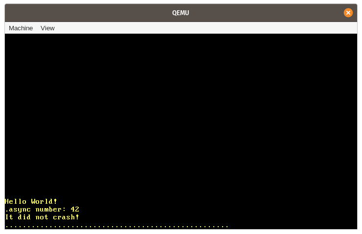

# Async/Await

In this post, we explore cooperative multitasking and the async/await feature of Rust. We take a detailed look at how async/await works in Rust, including the design of the `Future` trait, the state machine transformation, and pinning. We then add basic support for async/await to our kernel by creating an asynchronous keyboard task and a basic executor.

在这篇文章中，我们将探讨合作式多任务系统和Rust的async/await功能。我们将会详细研究async/await在Rust中的工作原理，包括`Future` trait的设计、状态机的转换和`pinning`。然后，我们通过创建一个异步键盘任务和一个基础的执行器来为我们的内核添加对async/await的基本支持。

This blog is openly developed on[GitHub](https://github.com/phil-opp/blog_os). If you have any problems or questions, please open an issue there. You can also leave comments at the bottom. The complete source code for this post can be found in the [post-12](https://github.com/phil-opp/blog_os/tree/post-12) branch.

这篇博客是在[GitHub](https://github.com/phil-opp/blog_os)上公开开发的。如果你有任何问题或疑问，请在那里开一个问题。你也可以在底部留下评论。本帖的完整源代码可以在[post-12](https://github.com/phil-opp/blog_os/tree/post-12)分支中找到。

## Multitasking(多任务)

One of the fundamental features of most operating systems is [multitasking](https://en.wikipedia.org/wiki/Computer_multitasking), which is the ability to execute multiple tasks concurrently. For example, you probably have other programs open while looking at this post, such as a text editor or a terminal window. Even if you have only a single browser window open, there are probably various background tasks for managing your desktop windows, checking for updates, or indexing files.

大多数操作系统的基本功能之一是[多任务](https://en.wikipedia.org/wiki/Computer_multitasking)，即能够同时执行多个任务。例如，你在看这篇文章时可能还打开了其他程序，如文本编辑器或终端窗口。即使你只打开了一个浏览器窗口，也可能有各种后台任务来管理你的桌面窗口，检查更新，或索引文件。

While it seems like all tasks run in parallel, only a single task can be executed on a CPU core at a time. To create the illusion that the tasks run in parallel, the operating system rapidly switches between active tasks so that each one can make a bit of progress. Since computers are fast, we don’t notice these switches most of the time.

虽然看起来所有的任务都是并行运行的，但每次只有一个任务可以在一个CPU核上执行。为了制造任务并行运行的假象，操作系统在活动任务之间快速切换，以便每个任务都能取得一点进展。由于计算机的速度很快，我们在大多数时候并没有注意到这些切换。

While single-core CPUs can only execute a single task at a time, multi-core CPUs can run multiple tasks in a truly parallel way. For example, a CPU with 8 cores can run 8 tasks at the same time. We will explain how to setup multi-core CPUs in a future post. For this post, we will focus on single-core CPUs for simplicity. (It’s worth noting that all multi-core CPUs start with only a single active core, so we can treat them as single-core CPUs for now.)

虽然单核CPU一次只能执行一个任务，但多核CPU可以以真正的并行方式运行多个任务。例如，一个有8个核心的CPU可以同时运行8个任务。我们将在以后的文章中解释如何设置多核CPU。在这篇文章中，为了简单起见，我们将专注于单核CPU。(值得注意的是，所有多核CPU开始时只有一个活跃的内核，所以我们现在可以把它们当作单核CPU)。


There are two forms of multitasking: Cooperative multitasking requires tasks to regularly give up control of the CPU so that other tasks can make progress. Preemptive multitasking uses operating system functionality to switch threads at arbitrary points in time by forcibly pausing them. In the following we will explore the two forms of multitasking in more detail and discuss their respective advantages and drawbacks.

有两种形式的多任务。合作式多任务要求任务定期放弃对CPU的控制，以便其他任务能够取得进展。抢占式多任务使用操作系统的功能，在任意时间点通过强制暂停来切换线程。在下文中，我们将更详细地探讨这两种形式的多任务处理，并讨论它们各自的优点和缺点。

### Preemptive Multitasking(抢占式多任务)

The idea behind preemptive multitasking is that the operating system controls when to switch tasks. For that, it utilizes the fact that it regains control of the CPU on each interrupt. This makes it possible to switch tasks whenever new input is available to the system. For example, it would be possible to switch tasks when the mouse is moved or a network packet arrives. The operating system can also determine the exact time that a task is allowed to run by configuring a hardware timer to send an interrupt after that time.

抢占式多任务背后的理念是，操作系统控制何时切换任务。为此，它利用了在每次中断时重新获得CPU控制权的事实。这使得每当系统有新的输入时就有可能切换任务。例如，当鼠标被移动或一个网络数据包到达时，就有可能切换任务。操作系统还可以通过配置一个硬件定时器来确定一个任务被允许运行的确切时间，以便在该时间之后发送一个中断。

The following graphic illustrates the task switching process on a hardware interrupt:

下图说明了硬件中断上的任务切换过程：


In the first row, the CPU is executing task `A1` of program `A`. All other tasks are paused. In the second row, a hardware interrupt arrives at the CPU. As described in the[ Hardware Interrupts](https://os.phil-opp.com/hardware-interrupts/) post, the CPU immediately stops the execution of task `A1` and jumps to the interrupt handler defined in the interrupt descriptor table (IDT). Through this interrupt handler, the operating system now has control of the CPU again, which allows it to switch to task `B1` instead of continuing task `A1`.

在第一行，CPU正在执行程序`A`的任务`A1`，所有其他任务都暂停了。在第二行中，一个硬件中断到达了CPU。如[硬件中断](https://os.phil-opp.com/hardware-interrupts/)一文所述，CPU立即停止执行任务`A1`，并跳转到中断描述符表（IDT）中定义的中断处理程序。通过这个中断处理程序，操作系统现在又有了对CPU的控制权，这使得它可以切换到任务`B1`，而不是继续任务`A1`。

#### Saving State(保存状态)

Since tasks are interrupted at arbitrary points in time, they might be in the middle of some calculations. In order to be able to resume them later, the operating system must backup the whole state of the task, including its [call stack](https://en.wikipedia.org/wiki/Call_stack) and the values of all CPU registers. This process is called a [context switch](https://en.wikipedia.org/wiki/Context_switch).

由于任务是在任意时间点中断的，它们可能处于某些计算的过程中。为了以后能够恢复它们，操作系统必须备份任务的整个状态，包括其[调用栈](https://en.wikipedia.org/wiki/Call_stack)和所有CPU寄存器的值。这个过程被称为[上下文切换](https://en.wikipedia.org/wiki/Context_switch)。


As the call stack can be very large, the operating system typically sets up a separate call stack for each task instead of backing up the call stack content on each task switch. Such a task with its own stack is called a [thread of execution](https://en.wikipedia.org/wiki/Thread_(computing)) or thread for short. By using a separate stack for each task, only the register contents need to be saved on a context switch (including the program counter and stack pointer). This approach minimizes the performance overhead of a context switch, which is very important since context switches often occur up to 100 times per second.

由于调用堆栈可能非常大，操作系统通常为每个任务设置一个单独的调用栈，而不是在每个任务切换时备份调用栈内容。这种有自己栈的任务被称为[执行线程](https://en.wikipedia.org/wiki/Thread_(computing))或简称为线程。通过为每个任务使用单独的堆栈，在上下文切换时只需要保存寄存器内容（包括程序计数器和堆栈指针）。这种方法最大限度地减少了上下文切换的性能开销，这一点非常重要，因为上下文切换经常每秒发生100次。


#### Discussion(讨论)

The main advantage of preemptive multitasking is that the operating system can fully control the allowed execution time of a task. This way, it can guarantee that each task gets a fair share of the CPU time, without the need to trust the tasks to cooperate. This is especially important when running third-party tasks or when multiple users share a system.

抢占式多任务的主要优点是，操作系统可以完全控制任务允许执行的时间。这样，它可以保证每个任务得到公平的CPU时间份额，而不需要相信任务之间的合作。当运行第三方任务或多个用户共享一个系统时，这一点尤其重要。

The disadvantage of preemption is that each task requires its own stack. Compared to a shared stack, this results in higher memory usage per task and often limits the number of tasks in the system. Another disadvantage is that the operating system always has to save the complete CPU register state on each task switch, even if the task only used a small subset of the registers.

抢占的缺点是，每个任务都需要自己的栈。与共享栈相比，这导致每个任务的内存占用率较高，并且常常限制系统中的任务数量。另一个缺点是，操作系统总是要在每次任务切换时保存完整的CPU寄存器状态，即使该任务只使用了寄存器的一小部分。


Preemptive multitasking and threads are fundamental components of an operating system because they make it possible to run untrusted userspace programs. We will discuss these concepts in full detail in future posts. For this post, however, we will focus on cooperative multitasking, which also provides useful capabilities for our kernel.

抢占式多任务和线程是操作系统的基本组成部分，因为它们使运行不受信任的用户空间程序成为可能。我们将在未来的文章中详细讨论这些概念。然而，在这篇文章中，我们将重点讨论合作式多任务，它也为我们的内核提供了有用的功能。

### Cooperative Multitasking(合作式多任务)

Instead of forcibly pausing running tasks at arbitrary points in time, cooperative multitasking lets each task run until it voluntarily gives up control of the CPU. This allows tasks to pause themselves at convenient points in time, for example, when they need to wait for an I/O operation anyway.

合作式多任务不是在任意时间点上强行暂停正在运行的任务，而是让每个任务运行到它自愿放弃对CPU的控制。这允许任务在方便的时间点暂停自己，例如，当他们需要等待I/O操作时。


Cooperative multitasking is often used at the language level, like in the form of [coroutines](https://en.wikipedia.org/wiki/Coroutine) or [async/await](https://rust-lang.github.io/async-book/01_getting_started/04_async_await_primer.html). The idea is that either the programmer or the compiler inserts [yield](https://en.wikipedia.org/wiki/Yield_(multithreading)) operations into the program, which give up control of the CPU and allow other tasks to run. For example, a yield could be inserted after each iteration of a complex loop.

合作式多任务经常在语言层面上使用，比如以[coroutines](https://en.wikipedia.org/wiki/Coroutine)或[async/await](https://rust-lang.github.io/async-book/01_getting_started/04_async_await_primer.html)的形式。其原理是，程序员或编译器在程序中插入[yield](https://en.wikipedia.org/wiki/Yield_(multithreading))操作，放弃对CPU的控制，允许其他任务运行。例如，可以在一个复杂的循环的每个迭代之后插入一个yield操作。

It is common to combine cooperative multitasking with [asynchronous operations](https://en.wikipedia.org/wiki/Asynchronous_I/O). Instead of waiting until an operation is finished and preventing other tasks from running during this time, asynchronous operations return a “not ready” status if the operation is not finished yet. In this case, the waiting task can execute a yield operation to let other tasks run.

将合作式多任务与[异步操作](https://en.wikipedia.org/wiki/Asynchronous_I/O)结合起来是很常见的。与抢占式的一直等待直到操作完成并在期间阻止其他任务的执行，在协作式中若操作尚未完成，则异步操作将返回一个“未就绪”状态。在这种情况下，等待的任务可以执行一个yield操作以允许其他任务运行。

#### Saving State(状态保存)

Since tasks define their pause points themselves, they don’t need the operating system to save their state. Instead, they can save exactly the state they need for continuation before they pause themselves, which often results in better performance. For example, a task that just finished a complex computation might only need to backup the final result of the computation since it does not need the intermediate results anymore.

由于任务自己定义它们的暂停点，它们不需要操作系统来保存它们的状态。相反，它们可以在自己暂停之前准确地保存它们需要继续的状态，这往往会带来更好的性能。例如，一个刚刚完成复杂计算的任务可能只需要备份计算的最终结果，因为它不再需要中间的结果了。

Language-supported implementations of cooperative tasks are often even able to backup the required parts of the call stack before pausing. As an example, Rust’s async/await implementation stores all local variables that are still needed in an automatically generated struct (see below). By backing up the relevant parts of the call stack before pausing, all tasks can share a single call stack, which results in much lower memory consumption per task. This makes it possible to create an almost arbitrary number of cooperative tasks without running out of memory.

语言支持的合作任务的实现通常甚至能够在暂停前备份调用栈的必要部分。作为一个例子，Rust的async/await实现将所有仍然需要的局部变量存储在一个自动生成的结构中（见下文）。通过在暂停前备份调用栈的相关部分，所有的任务都可以共享一个调用栈，这使得每个任务的内存消耗大大降低。这使得创建几乎任意数量的合作任务而不耗尽内存成为可能。


#### Discussion(讨论)

The drawback of cooperative multitasking is that an uncooperative task can potentially run for an unlimited amount of time. Thus, a malicious or buggy task can prevent other tasks from running and slow down or even block the whole system. For this reason, cooperative multitasking should only be used when all tasks are known to cooperate. As a counterexample, it’s not a good idea to make the operating system rely on the cooperation of arbitrary user-level programs.

合作式多任务的缺点是，一个不合作的任务有可能运行无限长的时间。因此，一个恶意的或有错误的任务可以阻止其他任务的运行，使整个系统变慢甚至堵塞。出于这个原因，合作式多任务只应在所有任务都已知会合作的情况下使用。作为一个反例，让操作系统依赖任意的用户级程序的合作并不是一个好主意。

However, the strong performance and memory benefits of cooperative multitasking make it a good approach for usage within a program, especially in combination with asynchronous operations. Since an operating system kernel is a performance-critical program that interacts with asynchronous hardware, cooperative multitasking seems like a good approach for implementing concurrency.

然而，合作多任务的强大性能和内存优势使其成为程序内使用的好方法，特别是与异步操作相结合。由于操作系统内核是一个与异步硬件交互的性能关键程序，合作式多任务似乎是一个实现并发的好方法。

## Async/Await in Rust(Rust中的Async/Await)

The Rust language provides first-class support for cooperative multitasking in the form of async/await. Before we can explore what async/await is and how it works, we need to understand how futures and asynchronous programming work in Rust.

Rust语言以async/await的形式为合作式多任务提供了一流的支持。在我们探索什么是async/await以及它是如何工作的之前，我们需要了解futures和异步编程在Rust中是如何工作的。

### Futures

A future represents a value that might not be available yet. This could be, for example, an integer that is computed by another task or a file that is downloaded from the network. Instead of waiting until the value is available, futures make it possible to continue execution until the value is needed.

Future代表了一个可能还没有就绪的值。例如，这可能是一个由另一个任务计算的整数或一个从网络上下载的文件。Future并不需要一直要等待到该值可用，它可以继续执行其他代码直到需要用到该值为止。

#### Example(示例)

The concept of futures is best illustrated with a small example:

用一个小例子来说明futures的概念：


This sequence diagram shows a `main` function that reads a file from the file system and then calls a function `foo`. This process is repeated two times: once with a synchronous `read_file` call and once with an asynchronous `async_read_file` call.

这个序列图显示了一个主函数，它从文件系统中读取一个文件，然后调用一个函数`foo`。这个过程重复了两次：一次是同步的`read_file`调用，一次是异步的`async_read_file`调用。

With the synchronous call, the `main` function needs to wait until the file is loaded from the file system. Only then can it call the `foo` function, which requires it to again wait for the result.

在同步调用中，主函数需要等待，直到文件从文件系统中加载。只有这样，它才能调用`foo`函数，这需要它再次等待结果。

With the asynchronous `async_read_file` call, the file system directly returns a future and loads the file asynchronously in the background. This allows the `main` function to call `foo` much earlier, which then runs in parallel with the file load. In this example, the file load even finishes before `foo` returns, so `main` can directly work with the file without further waiting after `foo` returns.


通过异步的`async_read_file`调用，文件系统直接返回一个future，并在后台异步加载文件。这使得主函数可以更早地调用`foo`，然后与文件加载并行运行。在这个例子中，文件加载甚至在`foo`返回之前就完成了，所以`main`可以直接处理文件，而无需在`foo`返回后继续等待。


#### Futures in Rust(Rust中的Futures)

In Rust, futures are represented by the [Future](https://doc.rust-lang.org/nightly/core/future/trait.Future.html) trait, which looks like this:

在Rust中，futures由[Future](https://doc.rust-lang.org/nightly/core/future/trait.Future.html) trait表示，其定义如下：

```rust
pub trait Future {
    type Output;
    fn poll(self: Pin<&mut Self>, cx: &mut Context) -> Poll<Self::Output>;
}
```

The [associated type](https://doc.rust-lang.org/book/ch19-03-advanced-traits.html#specifying-placeholder-types-in-trait-definitions-with-associated-types) `Output` specifies the type of the asynchronous value. For example, the `async_read_file` function in the diagram above would return a `Future` instance with `Output` set to `File`.

[关联类型](https://doc.rust-lang.org/book/ch19-03-advanced-traits.html#specifying-placeholder-types-in-trait-definitions-with-associated-types) `Output`指定异步返回值的类型。例如，上图中的`async_read_file`函数将返回一个`Output`设置为`File`的`Future`实例。

The [poll](https://doc.rust-lang.org/nightly/core/future/trait.Future.html#tymethod.poll) method allows to check if the value is already available. It returns a [Poll](https://doc.rust-lang.org/nightly/core/future/trait.Future.html#tymethod.poll) enum, which looks like this:

调用[poll](https://doc.rust-lang.org/nightly/core/future/trait.Future.html#tymethod.poll)方法可以检查该值是否已经可用。它将返回一个枚举[Poll](https://doc.rust-lang.org/nightly/core/future/trait.Future.html#tymethod.poll)，如下所示：

```rust
pub enum Poll<T> {
    Ready(T),
    Pending,
}
```


When the value is already available (e.g. the file was fully read from disk), it is returned wrapped in the `Ready` variant. Otherwise, the `Pending` variant is returned, which signals to the caller that the value is not yet available.

如果该值已经可用（例如，已从磁盘中读取完整的文件），则将其封装在`Ready`变量中返回。否则，将返回`Pending`变量，以通知调用方该值尚不可用。


The `poll` method takes two arguments: `self: Pin<&mut Self>` and `cx: &mut Context`. The former behaves similarly to a normal `&mut self` reference, except that the `Self` value is [pinned](https://doc.rust-lang.org/nightly/core/pin/index.html) to its memory location. Understanding Pin and why it is needed is difficult without understanding how async/await works first. We will therefore explain it later in this post.

`poll`方法采用两个参数：`self: Pin<&mut Self>`和`cx: &mut Context`上下文。前者的行为类似于普通的`&mut self`引用，不同之处在于，`Self`值[pinned](https://doc.rust-lang.org/nightly/core/pin/index.html)在一个固定的内存位置上。如果不先了解async/await的工作原理，就很难理解Pin以及为什么需要Pin。因此，我们将在后文中进行详细解释。

The purpose of the `cx: &mut Context` parameter is to pass a [Waker](https://doc.rust-lang.org/nightly/core/task/struct.Waker.html) instance to the asynchronous task, e.g., the file system load. This `Waker` allows the asynchronous task to signal that it (or a part of it) is finished, e.g., that the file was loaded from disk. Since the main task knows that it will be notified when the `Future` is ready, it does not need to call `poll` over and over again. We will explain this process in more detail later in this post when we implement our own waker type.

`cx: &mut Context`参数用于将一个[Waker](https://doc.rust-lang.org/nightly/core/task/struct.Waker.html)实例传递给异步任务，例如加载文件系统。这个`Waker`允许异步任务发信号通知任务（或部分任务）已完成，例如该文件已从磁盘加载。由于主任务知道将在`Future`就绪时将会收到通知，因此就不需要一遍又一遍地调用`poll`了。我们会在后文中实现自己的waker类型，届时将更加详细地说明此过程。

### Working with Futures(使用Futures)

We now know how futures are defined and understand the basic idea behind the poll method. However, we still don’t know how to effectively work with futures. The problem is that futures represent the results of asynchronous tasks, which might not be available yet. In practice, however, we often need these values directly for further calculations. So the question is: How can we efficiently retrieve the value of a future when we need it?

我们现在知道了futures是如何定义的，也理解了poll方法背后的基本理念。然而，我们仍然不知道如何有效地使用futures。问题是，futures代表了异步任务的结果，而这些结果可能还未可用。然而，在实践中，我们经常需要这些值直接用于进一步的计算。因此，问题是：当我们需要时，我们如何有效地检索一个future的值？

#### Waiting on Futures(等待Futures的值)

One possible answer is to wait until a future becomes ready. This could look something like this:

一种可能的答案是一直等待到future就绪为止。该过程看起来像这样：

```rust
let future = async_read_file("foo.txt");
let file_content = loop {
    match future.poll(…) {
        Poll::Ready(value) => break value,
        Poll::Pending => {}, // do nothing
    }
}
```

Here we actively wait for the future by calling `poll` over and over again in a loop. The arguments to `poll` don’t matter here, so we omitted them. While this solution works, it is very inefficient because we keep the CPU busy until the value becomes available.

在上面的代码中，我们通过循环中积极地调用`poll`来等待future完成。在这里`poll`的参数并不重要，因此已被省略。尽管此方法可行，但是效率很低，因为包含`poll`的循环会一直占用CPU直到该值可用为止。

A more efficient approach could be to block the current thread until the future becomes available. This is, of course, only possible if you have threads, so this solution does not work for our kernel, at least not yet. Even on systems where blocking is supported, it is often not desired because it turns an asynchronous task into a synchronous task again, thereby inhibiting the potential performance benefits of parallel tasks.

一种较为高效的方法是阻塞当前线程，直到future可用为止。当然，这只有在有线程支持的情况下才可行，因此并不适用于我们的内核，至少目前还不行。即使在支持阻塞的系统上，通常也不会这么做，因为阻塞会将异步任务再次变为同步任务，从而失去了并行任务的性能优势。

#### Future Combinators(Future组合器)

An alternative to waiting is to use future combinators. Future combinators are methods like `map` that allow chaining and combining futures together, similar to the methods of the [Iterator](https://doc.rust-lang.org/stable/core/iter/trait.Iterator.html) trait. Instead of waiting on the future, these combinators return a future themselves, which applies the mapping operation on `poll`.

另一种等待方式是使用future组合器。Future组合器是类似于`map`的方法，它允许将futures链接并组合在一起，就像在[Iterator](https://doc.rust-lang.org/stable/core/iter/trait.Iterator.html)上做的那样。这些组合器不等待future，而是自己返回future，即为`poll`应用了map操作。

As an example, a simple `string_len` combinator for converting a `Future<Output = String>` to a `Future<Output = usize>` could look like this:

举个例子，一个将`Future<Output = String>` 转换为 `Future<Output = usize>`的`string_len`组合器如下面代码所示:

```rust
struct StringLen<F> {
    inner_future: F,
}

impl<F> Future for StringLen<F> where F: Future<Output = String> {
    type Output = usize;

    fn poll(mut self: Pin<&mut Self>, cx: &mut Context<'_>) -> Poll<T> {
        match self.inner_future.poll(cx) {
            Poll::Ready(s) => Poll::Ready(s.len()),
            Poll::Pending => Poll::Pending,
        }
    }
}

fn string_len(string: impl Future<Output = String>)
    -> impl Future<Output = usize>
{
    StringLen {
        inner_future: string,
    }
}

// Usage
fn file_len() -> impl Future<Output = usize> {
    let file_content_future = async_read_file("foo.txt");
    string_len(file_content_future)
}
```

This code does not quite work because it does not handle [pinning](https://doc.rust-lang.org/stable/core/pin/index.html), but it suffices as an example. The basic idea is that the `string_len` function wraps a given `Future` instance into a new `StringLen` struct, which also implements `Future`. When the wrapped future is polled, it polls the inner future. If the value is not ready yet, `Poll::Pending` is returned from the wrapped future too. If the value is ready, the string is extracted from the `Poll::Ready` variant and its length is calculated. Afterwards, it is wrapped in `Poll::Ready` again and returned.

该代码无法正常工作，因为尚未处理[pinning](https://doc.rust-lang.org/stable/core/pin/index.html)，不过作为例子已经足够了。基本思路是`string_len`函数将给定的实现了`Future`trait的实例封装到新的`StringLen`结构体中，而该结构体也实现了`Future`trait。当poll封装的future时，即是poll其内部的future。如果该值尚未就绪，封装的future也将返回`Poll::Pending`。如果该值已就绪，则从`Poll::Ready`变量中获取字符串，并计算其长度。最后再将其封装在`Poll::Ready`中返回。


With this `string_len` function, we can calculate the length of an asynchronous string without waiting for it. Since the function returns a `Future` again, the caller can’t work directly on the returned value, but needs to use combinator functions again. This way, the whole call graph becomes asynchronous and we can efficiently wait for multiple futures at once at some point, e.g., in the main function.

通过`string_len`函数，我们不需要等待一个异步字符串，就可以计算其长度。由于该函数也返回Future，因此调用者无法直接操作返回的值，而需要再次使用组合器函数。这样，整个调用过程就变为异步的了，我们可以高效地在某个时刻一次等待多个future，例如 在main函数上。

Because manually writing combinator functions is difficult, they are often provided by libraries. While the Rust standard library itself provides no combinator methods yet, the semi-official (and `no_std` compatible) [futures](https://docs.rs/futures/0.3.4/futures/) crate does. Its [FutureExt](https://docs.rs/futures/0.3.4/futures/future/trait.FutureExt.html) trait provides high-level combinator methods such as [map](https://docs.rs/futures/0.3.4/futures/future/trait.FutureExt.html#method.map) or [then](https://docs.rs/futures/0.3.4/futures/future/trait.FutureExt.html#method.then), which can be used to manipulate the result with arbitrary closures.

手动编写组合器函数比较困难，所以它们通常由库直接提供。尽管Rust标准库本身还没有提供官方组合器方法，但半官方（兼容`no_std`）的[futures](https://docs.rs/futures/0.3.4/futures/) crate可以。其[FutureExt](https://docs.rs/futures/0.3.4/futures/future/trait.FutureExt.html) 特性提供了诸如[map](https://docs.rs/futures/0.3.4/futures/future/trait.FutureExt.html#method.map)或[then](https://docs.rs/futures/0.3.4/futures/future/trait.FutureExt.html#method.then)之类的高级组合器方法，可用于任意闭包来操作结果。

#### Advantages(优势)

The big advantage of future combinators is that they keep the operations asynchronous. In combination with asynchronous I/O interfaces, this approach can lead to very high performance. The fact that future combinators are implemented as normal structs with trait implementations allows the compiler to excessively optimize them. For more details, see the [Zero-cost futures in Rust](https://aturon.github.io/blog/2016/08/11/futures/)  post, which announced the addition of futures to the Rust ecosystem.

Future组合器最大的优点是能够使操作保持异步。这种方法和异步I/O接口结合使用时性能非常高。实际上future组合器将被实现为具有trait的普通结构体，以使编译器能够对其做出进一步优化。有关更多详细信息，请参阅[Rust的零成本future](https://aturon.github.io/blog/2016/08/11/futures/)一文，就是这篇文章宣布了在Rust生态系统中添加future。

#### Drawbacks(缺点)

While future combinators make it possible to write very efficient code, they can be difficult to use in some situations because of the type system and the closure-based interface. For example, consider code like this:

尽管future组合器可以编写出非常高效的代码，但由于类型系统和基于闭包的接口的限制，组合器可能会在某些情况下变得难以使用。例如，考虑下面的代码：

```rust
fn example(min_len: usize) -> impl Future<Output = String> {
    async_read_file("foo.txt").then(move |content| {
        if content.len() < min_len {
            Either::Left(async_read_file("bar.txt").map(|s| content + &s))
        } else {
            Either::Right(future::ready(content))
        }
    })
}
```
[(Try it on the playground)](https://play.rust-lang.org/?version=stable&mode=debug&edition=2018&gist=91fc09024eecb2448a85a7ef6a97b8d8)

Here we read the file `foo.txt` and `then` use the then combinator to chain a second future based on the file content. If the content length is smaller than the given `min_len`, we read a different `bar.txt` file and append it to content using the map combinator. Otherwise, we return only the content of `foo.txt`.

代码先读取文件`foo.txt`，然后使用`then`组合器根据文件内容链接第二个future。如果内容长度小于给定的`min_len`，我们将读取另一个`bar.txt`文件，然后使用map组合器将其附加到content后。否则，只返回`foo.txt`的content。

We need to use the [move keyword](https://doc.rust-lang.org/std/keyword.move.html) for the closure passed to `then` because otherwise there would be a lifetime error for `min_len`. The reason for the [Either](https://docs.rs/futures/0.3.4/futures/future/enum.Either.html) wrapper is that `if` and `else` blocks must always have the same type. Since we return different future types in the blocks, we must use the wrapper type to unify them into a single type. The [ready](https://docs.rs/futures/0.3.4/futures/future/fn.ready.html) function wraps a value into a future, which is immediately ready. The function is required here because the `Either` wrapper expects that the wrapped value implements `Future`.

我们需要在传递给`then`的闭包上使用[move关键字]((https://doc.rust-lang.org/std/keyword.move.html))，否则`min_len`变量会产生生命周期错误。使用[Either](https://docs.rs/futures/0.3.4/futures/future/enum.Either.html)封装的原因是让`if`块和`else`块始终具有相同的类型。由于我们在块中返回了不同的future类型，因此必须使用封装类型将它们统一为一个类型。[ready](https://docs.rs/futures/0.3.4/futures/future/fn.ready.html)函数将立刻就绪的值封装到future中。这里需要使用该函数是因为`Either`封装要求值实现`Future`trait。

As you can imagine, this can quickly lead to very complex code for larger projects. It gets especially complicated if borrowing and different lifetimes are involved. For this reason, a lot of work was invested in adding support for async/await to Rust, with the goal of making asynchronous code radically simpler to write.

您可以想象，这种用法很快就会导致大型项目的代码变得非常复杂。尤其是再涉及借用和生命周期，就会变得更加复杂。因此，为了使异步代码从根本上更易于编写，大量的工作用来为Rust添加对async/await的支持。

### The Async/Await Pattern(Async/Await模式)

The idea behind async/await is to let the programmer write code that looks like normal synchronous code, but is turned into asynchronous code by the compiler. It works based on the two keywords `async` and `await`. The `async` keyword can be used in a function signature to turn a synchronous function into an asynchronous function that returns a future:

Async/Await的思路是让程序员以编写同步代码的方式编写异步代码，只不最后是由编译器将同步代码转换为异步代码。它基于两个关键字`async`和`await`。在函数签名中使用`async`关键字，就可以将同步函数转换为一个返回future的异步函数：

```rust
async fn foo() -> u32 {
    0
}

// the above is roughly translated by the compiler to:
fn foo() -> impl Future<Output = u32> {
    future::ready(0)
}
```

This keyword alone wouldn’t be that useful. However, inside `async` functions, the `await` keyword can be used to retrieve the asynchronous value of a future:

仅使用此关键字并没有那么有用。但是，在异步函数内部，可以使用`await`关键字来取回future的异步值：

```rust
async fn example(min_len: usize) -> String {
    let content = async_read_file("foo.txt").await;
    if content.len() < min_len {
        content + &async_read_file("bar.txt").await
    } else {
        content
    }
}
```

[(Try it on the playground)](https://play.rust-lang.org/?version=stable&mode=debug&edition=2018&gist=d93c28509a1c67661f31ff820281d434)

This function is a direct translation of the `example` function from above that used combinator functions. Using the `.await` operator, we can retrieve the value of a future without needing any closures or `Either` types. As a result, we can write our code like we write normal synchronous code, with the difference that this is still asynchronous code.

将上面使用组合器实现的example函数直接转换为async/await模式：使用`.await`运算符就可以取回future的值，无需使用闭包或`Either`类型。如此，我们就可以像编写普通的同步代码一样编写异步代码。

#### State Machine Transformation(状态转换机)

Behind the scenes, the compiler converts the body of the `async` function into a [state machine](https://en.wikipedia.org/wiki/Finite-state_machine), with each `.await` call representing a different state. For the above `example` function, the compiler creates a state machine with the following four states:

在这种场景中，编译器的作用就是将`async`函数体转换为一个[状态机](https://en.wikipedia.org/wiki/Finite-state_machine)，每个`.await`调用代表一个不同的状态。对于上面的`example`函数，编译器创建具有以下四个状态的状态机：


Each state represents a different pause point in the function. The “Start” and “End” states represent the function at the beginning and end of its execution. The “Waiting on foo.txt” state represents that the function is currently waiting for the first `async_read_file` result. Similarly, the “Waiting on bar.txt” state represents the pause point where the function is waiting on the second `async_read_file` result.

不同状态代表该函数的不同暂停点。"Start"和"End"状态代表函数在其执行的开始和结束时的状态。"Waiting on foo.txt"状态表示该函数目前正在等待第一个`async_read_file`的结果。同样的，"Waiting on bar.txt"状态表示函数在等待第二个`async_read_file`的结果的暂停点。

The state machine implements the `Future` trait by making each `poll` call a possible state transition:

状态机通过将每个`poll`调用都变为一个可能的状态转换来实现`Future`trait：


The diagram uses arrows to represent state switches and diamond shapes to represent alternative ways. For example, if the `foo.txt` file is not ready, the path marked with “no” is taken and the “Waiting on foo.txt” state is reached. Otherwise, the “yes” path is taken. The small red diamond without a caption represents the `if content.len() < 100` branch of the `example` function.

图中使用箭头表示状态开关，并使用菱形表示条件路径。例如，如果`foo.txt`文件尚未准备好，则采用标记为"no"的路径，并达到"Waiting on foo.txt"的状态。否则，就采用标记为"yes"路径。没有字的红色小菱形代表`example`函数中`if content.len() < 100`的条件分支。


We see that the first `poll` call starts the function and lets it run until it reaches a future that is not ready yet. If all futures on the path are ready, the function can run till the “End” state, where it returns its result wrapped in `Poll::Ready`. Otherwise, the state machine enters a waiting state and returns `Poll::Pending`. On the next `poll` call, the state machine then starts from the last waiting state and retries the last operation.

我们看到第一个`poll`调用启动了该函数并使它运行，直到遇到一个尚未就绪的future。如果路径上的所有future都已就绪，则该函数可以一直运行到”End“状态，并返回封装在`Poll::Ready`中的结果。否则，状态机将进入等待状态并返回`Poll::Pending`。然后在下一个`poll`调用中，状态机从上一个等待状态开始重试其最后一次操作。

#### Saving State(保存状态)

In order to be able to continue from the last waiting state, the state machine must keep track of the current state internally. In addition, it must save all the variables that it needs to continue execution on the next `poll` call. This is where the compiler can really shine: Since it knows which variables are used when, it can automatically generate structs with exactly the variables that are needed.

为了能够从上一个等待状态中恢复，状态机必须在内部跟踪当前状态。此外，它还必须保存在下一个`poll`调用中恢复执行所需的变量。这就是编译器真正发挥作用的地方：由于编译器知道在何时要使用哪些变量，因此它可以自动生成具有所需变量的结构体。

As an example, the compiler generates structs like the following for the above `example` function:

作为示例，编译器为上面的`example`函数生成类似于下面这样的结构体：

```rust
// The `example` function again so that you don't have to scroll up
async fn example(min_len: usize) -> String {
    let content = async_read_file("foo.txt").await;
    if content.len() < min_len {
        content + &async_read_file("bar.txt").await
    } else {
        content
    }
}

// The compiler-generated state structs:

struct StartState {
    min_len: usize,
}

struct WaitingOnFooTxtState {
    min_len: usize,
    foo_txt_future: impl Future<Output = String>,
}

struct WaitingOnBarTxtState {
    content: String,
    bar_txt_future: impl Future<Output = String>,
}

struct EndState {}
```

In the “start” and “Waiting on foo.txt” states, the `min_len` parameter needs to be stored for the later comparison with `content.len()`. The “Waiting on foo.txt” state additionally stores a `foo_txt_future`, which represents the future returned by the `async_read_file` call. This future needs to be polled again when the state machine continues, so it needs to be saved.


在"Start"和"Waiting on foo.txt"状态下，需要存储`min_len`参数，因为稍后与`content.len()`做比较时需要使用该参数。"Waiting on foo.txt"状态还存储了一个`foo_txt_future`，用来表示`async_read_file`调用返回的future。状态机继续运行时会再次poll该future，因此需要将其保存。


The “Waiting on bar.txt” state contains the `content` variable for the later string concatenation when `bar.txt` is ready. It also stores a `bar_txt_future` that represents the in-progress load of `bar.txt`. The struct does not contain the `min_len` variable because it is no longer needed after the `content.len()` comparison. In the “end” state, no variables are stored because the function has already run to completion.

"Waiting on bar.txt"状态包含`content`变量，是因为在`bar.txt`就绪后需要使用该变量进行字符串连接。该状态还存储了一个`bar_txt_future`，用来表示正在加载中的`bar.txt`。该结构体不包含`min_len`变量，因为在c`ontent.len()`比较之后就不再需要该变量了。在"End"状态下，没有存储任何变量，因为此时函数已经运行完毕。

Keep in mind that this is only an example of the code that the compiler could generate. The struct names and the field layout are implementation details and might be different.

请记住，这只是编译器可能生成的代码的一个示例。结构体名称和字段布局是实现细节，可能会有所不同。

#### The Full State Machine Type(完整的状态机类型)

While the exact compiler-generated code is an implementation detail, it helps in understanding to imagine how the generated state machine could look for the `example` function. We already defined the structs representing the different states and containing the required variables. To create a state machine on top of them, we can combine them into an `enum`:

尽管编译器生成的确切代码是实现细节，但这个示例还是有助于我们理解并想象`example`函数生成的状态机可能的样子。我们已经定义了代表不同状态的结构体，并给出了其中包含的所需变量。为了基于这些结构体创建一个状态机，我们可以将它们组合成一个`枚举`：

```rust
enum ExampleStateMachine {
    Start(StartState),
    WaitingOnFooTxt(WaitingOnFooTxtState),
    WaitingOnBarTxt(WaitingOnBarTxtState),
    End(EndState),
}
```

We define a separate enum variant for each state and add the corresponding state struct to each variant as a field. To implement the state transitions, the compiler generates an implementation of the `Future` trait based on the `example` function:

我们为每个状态定义一个单独的枚举变量，并将对应状态的结构体作为字段添加到每个变量。为了实现状态转换，编译器根据`example`函数实现`Future`trait：

```rust
impl Future for ExampleStateMachine {
    type Output = String; // return type of `example`

    fn poll(self: Pin<&mut Self>, cx: &mut Context) -> Poll<Self::Output> {
        loop {
            match self { // TODO: handle pinning
                ExampleStateMachine::Start(state) => {…}
                ExampleStateMachine::WaitingOnFooTxt(state) => {…}
                ExampleStateMachine::WaitingOnBarTxt(state) => {…}
                ExampleStateMachine::End(state) => {…}
            }
        }
    }
}
```

The `Output` type of the future is `String` because it’s the return type of the `example` function. To implement the `poll` function, we use a `match` statement on the current state inside a `loop`. The idea is that we switch to the next state as long as possible and use an explicit `return Poll::Pending` when we can’t continue.

该Future的`Output`类型为`String`，即`example`函数的返回类型。为了实现`poll`函数，我们在`loop`内的当前状态上使用`match`语句。思路是我们尽可能长时间地切换到下一个状态，并在无法继续时显式的使用`return Poll::Pending`。

For simplicity, we only show simplified code and don’t handle [pinning](https://doc.rust-lang.org/stable/core/pin/index.html), ownership, lifetimes, etc. So this and the following code should be treated as pseudo-code and not used directly. Of course, the real compiler-generated code handles everything correctly, albeit possibly in a different way.

为简单起见，这里仅给出简化的代码，且暂不处理[pinning](https://doc.rust-lang.org/stable/core/pin/index.html)、所有权、生命周期等内容。因此，这里的代码和下面的代码应被看做伪代码，不能直接使用。当然，真正的编译器生成的代码可以正确处理所有内容，尽管可能使用了与我们不同的方式。

To keep the code excerpts small, we present the code for each `match` arm separately. Let’s begin with the `Start` state:

为了使示意的代码更简洁，我们将分别显示每个匹配分支的代码。从”Start”状态开始：

```rust
ExampleStateMachine::Start(state) => {
    // from body of `example`
    let foo_txt_future = async_read_file("foo.txt");
    // `.await` operation
    let state = WaitingOnFooTxtState {
        min_len: state.min_len,
        foo_txt_future,
    };
    *self = ExampleStateMachine::WaitingOnFooTxt(state);
}
```

The state machine is in the `Start` state when it is right at the beginning of the function. In this case, we execute all the code from the body of the `example` function until the first `.await`. To handle the `.await` operation, we change the state of the `self` state machine to `WaitingOnFooTxt`, which includes the construction of the `WaitingOnFooTxtState` struct.

当状态机处于`Start`状态时，其对应位置正是函数体的最开始。在这种情况下，我们将执行`example`函数体中的所有代码，直到遇到第一个`.await`。为了处理`.await`操作，我们将`self`状态机的状态修改为`WaitingOnFooTxt`，并令状态中包含`WaitingOnFooTxtState`结构体。

Since the `match self {…}` statement is executed in a loop, the execution jumps to the `WaitingOnFooTxt` arm next:

由于`match self {…}`语句是在循环中执行的，因此该执行将跳至下一个分支`WaitingOnFooTxt`：

```rust
ExampleStateMachine::WaitingOnFooTxt(state) => {
    match state.foo_txt_future.poll(cx) {
        Poll::Pending => return Poll::Pending,
        Poll::Ready(content) => {
            // from body of `example`
            if content.len() < state.min_len {
                let bar_txt_future = async_read_file("bar.txt");
                // `.await` operation
                let state = WaitingOnBarTxtState {
                    content,
                    bar_txt_future,
                };
                *self = ExampleStateMachine::WaitingOnBarTxt(state);
            } else {
                *self = ExampleStateMachine::End(EndState);
                return Poll::Ready(content);
            }
        }
    }
}
```

In this `match` arm, we first call the `poll` function of the `foo_txt_future`. If it is not ready, we exit the loop and return `Poll::Pending`. Since `self` stays in the `WaitingOnFooTxt` state in this case, the next poll call on the state machine will enter the same `match` arm and retry polling the `foo_txt_future`.

在这一匹配分支中，我们首先调用`foo_txt_future`的`poll`函数。如果尚未就绪，则退出循环并返回`Poll::Pending`。由于在这种情况下`self`仍位于`WaitingOnFooTxt`状态，因此状态机的下一次`poll`调用也将进入相同的匹配分支并重试`foo_txt_future`。

When the `foo_txt_future` is ready, we assign the result to the `content` variable and continue to execute the code of the `example` function: If `content.len()` is smaller than the `min_len` saved in the state struct, the `bar.txt` file is read asynchronously. We again translate the `.await` operation into a state change, this time into the `WaitingOnBarTxt` state. Since we’re executing the `match` inside a loop, the execution directly jumps to the `match` arm for the new state afterward, where the `bar_txt_future` is polled.

当`foo_txt_future`就绪时，我们将结果赋给`content`变量，然后继续执行`example`函数的代码：如果`content.len()`小于状态结构体中保存的`min_len`，则异步读取`bar.txt`文件。我们再次将`.await`操作转换为状态更改，而这次应转换为W`aitingOnBarTxt`状态。由于我们是在循环内执行匹配，因此下一轮循环将直接跳转到新状态的匹配分支，然后在该状态下poll `bar_txt_future`。

In case we enter the `else` branch, no further `.await` operation occurs. We reach the end of the function and return `content` wrapped in `Poll::Ready`. We also change the current state to the `End` state.

如果我们进入`else`分支，则不会进行进一步的`.await`操作。此时已到达函数的结尾，并将`content`封装在`Poll::Ready`中返回。我们还需要将当前状态更改为`End`状态。

The code for the `WaitingOnBarTxt` state looks like this:

`WaitingOnBarTxt`状态的代码如下所示：

```rust
ExampleStateMachine::WaitingOnBarTxt(state) => {
    match state.bar_txt_future.poll(cx) {
        Poll::Pending => return Poll::Pending,
        Poll::Ready(bar_txt) => {
            *self = ExampleStateMachine::End(EndState);
            // from body of `example`
            return Poll::Ready(state.content + &bar_txt);
        }
    }
}
```

Similar to the `WaitingOnFooTxt` state, we start by polling the `bar_txt_future`. If it is still pending, we exit the loop and return `Poll::Pending`. Otherwise, we can perform the last operation of the `example` function: concatenating the `content` variable with the result from the `future`. We update the state machine to the End state and then return the result wrapped in `Poll::Ready`.

与`WaitingOnFooTxt`状态类似，我们从poll `bar_txt_future`开始。如果仍未就绪，则退出循环并返回P`oll::Pending`。否则，我们就执行`example`函数的最后一个操作：用`content`变量与`future`的结果做字符串连接。我们将状态机更新为`End`状态，然后将结果封装在`Poll::Ready`中返回。

Finally, the code for the `End` state looks like this:

最后，`End`状态的代码如下所示：

```rust
ExampleStateMachine::End(_) => {
    panic!("poll called after Poll::Ready was returned");
}
```

Futures should not be polled again after they returned `Poll::Ready`, so we panic if `poll` is called while we are already in the `End` state.

Future返回`Poll::Ready`后就不应再被poll了，因此，当我们已经处于`End`状态时，如果再次调用`poll`，就产生一个panic。

We now know what the compiler-generated state machine and its implementation of the `Future` trait could look like. In practice, the compiler generates code in a different way. (In case you’re interested, the implementation is currently based on [generators](https://doc.rust-lang.org/nightly/unstable-book/language-features/generators.html), but this is only an implementation detail.)

现在我们知道了编译器可能会生成怎样的状态机，以及怎样去给状态机实现`Future` trait。但实际上，编译器会以不同的方式生成代码。（如果您感兴趣的话，该实现目前基于[生成器](https://doc.rust-lang.org/nightly/unstable-book/language-features/generators.html)，不过这只是实现细节。）

The last piece of the puzzle is the generated code for the `example` function itself. Remember, the function header was defined like this:

最后一步是为`example`函数本身生成代码。记住，函数签名是这样定义的：

```rust
async fn example(min_len: usize) -> String
```

Since the complete function body is now implemented by the state machine, the only thing that the function needs to do is to initialize the state machine and return it. The generated code for this could look like this:

由于现在整个函数体是由状态机实现的，因此该函数唯一需要做的就是初始化状态机并将其返回。为此生成的代码如下所示：

```rust
fn example(min_len: usize) -> ExampleStateMachine {
    ExampleStateMachine::Start(StartState {
        min_len,
    })
}
```

The function no longer has an `async` modifier since it now explicitly returns an `ExampleStateMachine` type, which implements the `Future` trait. As expected, the state machine is constructed in the `Start` state and the corresponding state struct is initialized with the `min_len` parameter.

该函数不再使用`async`修饰符，因为它现在显式返回一个实现了`Future` trait的`ExampleStateMachine`类型。如预期的那样，状态机被初始化为`Start`状态，并且使用`min_len`参数初始化了对应的状态结构体。

Note that this function does not start the execution of the state machine. This is a fundamental design decision of futures in Rust: they do nothing until they are polled for the first time.

请注意，此函数并不会直接启动状态机。这是Rust中future的一个基本设计决策：在第一次被poll之前什么也不做。

### Pinning

We already stumbled across pinning multiple times in this post. Now is finally the time to explore what pinning is and why it is needed.

在这篇文章中，我们已经遇到pinning很多次了。现在终于是时候看看究竟什么是pinning以及为什么需要pinning了。


#### Self-Referential Structs(自引用结构体)

As explained above, the state machine transformation stores the local variables of each pause point in a struct. For small examples like our `example` function, this was straightforward and did not lead to any problems. However, things become more difficult when variables reference each other. For example, consider this function:

如上所述，状态机转换将每个暂停点的局部变量存储在结构体中。对于像example函数这样的小例子就很简单，并不会导致任何问题。但是，当变量相互引用时，事情就会变得困难。例如，考虑以下函数：

```rust
async fn pin_example() -> i32 {
    let array = [1, 2, 3];
    let element = &array[2];
    async_write_file("foo.txt", element.to_string()).await;
    *element
}
```

This function creates a small `array` with the contents `1`, `2`, and `3`. It then creates a reference to the last array element and stores it in an `element` variable. Next, it asynchronously writes the number converted to a string to a `foo.txt` file. Finally, it returns the number referenced by `element`.

这个函数创建了一个含有`1`,`2`,`3`的数组。然后他创建了一个指向数组最后一个节点的引用存储在`element`变量中。接下来，他将数字转换为string并且异步的写入到`foo.txt`文件中。最后他返回`element`指向的数字。

Since the function uses a single `await` operation, the resulting state machine has three states: start, end, and “waiting on write”. The function takes no arguments, so the struct for the start state is empty. Like before, the struct for the end state is empty because the function is finished at this point. The struct for the “waiting on write” state is more interesting:

由于该函数使用了一个`await`操作，因此结果状态机具有三种状态："Start"、"End"、"Waiting on write"。该函数没有参数，因此开始状态对应的结构体为空。像以前一样，结束状态对应的结构体也为空，因为该函数此时已完成。而"Waiting on write"状态对应的结构体就很有趣：

```rust
struct WaitingOnWriteState {
    array: [1, 2, 3],
    element: 0x1001c, // address of the last array element
}
```

We need to store both the `array` and `element` variables because element is required for the return value and `array` is referenced by `element`. Since `element` is a reference, it stores a pointer (i.e., a memory address) to the referenced `element`. We used `0x1001c` as an example memory address here. In reality, it needs to be the address of the last `element` of the `array` field, so it depends on where the struct lives in memory. Structs with such internal pointers are called self-referential structs because they reference themselves from one of their fields.

我们需要存储`array`和`element`变量，因为返回值需要`element`，而`element`又引用了`array`。由于`element`是一个引用，因此它存储指向所引用元素的指针（即内存地址）。我们在这里使用`0x1001c`作为示例存储地址。而实际上，`element`字段必须是`array`字段最后一个元素的地址，所以这与该结构体在内存中的位置有关。由于此类结构体对自身的某些字段做了引用，因此这种具有内部指针的结构体也叫做自引用结构体。

#### The Problem with Self-Referential Structs(自引用结构体的问题)

The internal pointer of our self-referential struct leads to a fundamental problem, which becomes apparent when we look at its memory layout:

自引用结构的内部指针将导致一个很基本的问题，尤其是在查看其内存布局时会更加明显：


The `array` field starts at address 0x10014 and the `element` field at address 0x10020. It points to address 0x1001c because the last array element lives at this address. At this point, everything is still fine. However, an issue occurs when we move this struct to a different memory address:

`array`字段从地址0x10014开始，`element`字段从地址0x10020开始。它指向地址0x1001c，即最后一个数组元素的地址。至此仍没什么问题。但是，当我们将此结构体移动到其他内存地址时，就会发生问题：


We moved the struct a bit so that it starts at address `0x10024` now. This could, for example, happen when we pass the struct as a function argument or assign it to a different stack variable. The problem is that the `element` field still points to address 0x1001c even though the last `array` element now lives at address `0x1002c`. Thus, the pointer is dangling, with the result that undefined behavior occurs on the next `poll` call.

稍微移动该结构体，现在使其从地址`0x10024`开始。这是有可能的，例如当我们将该结构体作为函数参数传递时，或是将其分配给其他栈变量时。问题在于，尽管最后一个数组元素现已位于地址`0x1002c`，但`element`字段仍指向地址0x1001c。于是指针悬空，结果就是在下一个`poll`调用中发生未定义的行为。

#### Possible Solutions(可能的解决方法)

There are three fundamental approaches to solving the dangling pointer problem:


- **Update the pointer on move**: The idea is to update the internal pointer whenever the struct is moved in memory so that it is still valid after the move. Unfortunately, this approach would require extensive changes to Rust that would result in potentially huge performance losses. The reason is that some kind of runtime would need to keep track of the type of all struct fields and check on every move operation whether a pointer update is required.

- **Store an offset instead of self-references**: To avoid the requirement for updating pointers, the compiler could try to store self-references as offsets from the struct’s beginning instead. For example, the `element` field of the above `WaitingOnWriteState` struct could be stored in the form of an `element_offset` field with a value of 8 because the array element that the reference points to starts 8 bytes after the struct’s beginning. Since the offset stays the same when the struct is moved, no field updates are required.<br>The problem with this approach is that it requires the compiler to detect all self-references. This is not possible at compile-time because the value of a reference might depend on user input, so we would need a runtime system again to analyze references and correctly create the state structs. This would not only result in runtime costs but also prevent certain compiler optimizations, so that it would cause large performance losses again.

- **Forbid moving the struct**: As we saw above, the dangling pointer only occurs when we move the struct in memory. By completely forbidding move operations on self-referential structs, the problem can also be avoided. The big advantage of this approach is that it can be implemented at the type system level without additional runtime costs. The drawback is that it puts the burden of dealing with move operations on possibly self-referential structs on the programmer.

有三种解决指针悬空问题的基本方法：

- **在移动时更新指针**：思路是每当结构体在内存中移动时都更新其内部指针，以使该指针在移动后仍然有效。不幸的是，这种方法需要对Rust进行大量更改，并可能导致巨大的性能损失。因为如果实现这种方法，就需要某种运行时持续跟踪结构体中各种类型的字段，并在每次移动发生时检查是否需要更新指针。
- **存储偏移量而不是自引用**：为了不去更新指针，编译器可以尝试将自引用存储为从结构体开始地址算起的偏移量。例如，上面的`WaitingOnWriteState`结构的`element`字段可以以`element_offset`字段的形式存储，其值为8，因为该引用指向的数组元素位于该结构体的起始地址后的第8个字节处。由于在移动结构时偏移量保持不变，因此不需要字段更新。
问题是，如果实现这种方法，就必须让编译器检测所有自引用。这在编译时是不可能的，因为引用的值可能取决于用户输入，因此这又需要使用运行时系统来分析引用，从而正确地创建状态结构体。这不仅会导致运行时成本增加，而且还会阻止某些编译器优化，从而又会导致较大的性能损失。
- **禁止移动结构体**：如上所示，仅当我们在内存中移动该结构体时，才会出现悬空指针。那么，通过完全禁止对自引用结构的移动操作，就可以避免该问题。这种方法的最大优点是可以实现在类型系统级别，并不会增加运行时成本。不过它的缺点是需要程序员自己处理在可能的自引用结构体上发生的移动操作。
  

Rust chose the third solution because of its principle of providing zero cost abstractions, which means that abstractions should not impose additional runtime costs. The [pinning](https://doc.rust-lang.org/stable/core/pin/index.html) API was proposed for this purpose in [RFC 2349](https://github.com/rust-lang/rfcs/blob/master/text/2349-pin.md). In the following, we will give a short overview of this API and explain how it works with async/await and futures.

为了遵守提供零成本抽象的原则（这意味着抽象不应产生额外的运行时成本），Rust选择了第三种解决方案。为此，在[RFC 2349](https://github.com/rust-lang/rfcs/blob/master/text/2349-pin.md)中提出了[pinning](https://doc.rust-lang.org/stable/core/pin/index.html) API。在下文中，我们将简要概述此API，并说明它将如何与async/await和futures一起使用.

#### Heap Values(堆上值)

The first observation is that [heap-allocated](https://os.phil-opp.com/heap-allocation/) values already have a fixed memory address most of the time. They are created using a call to `allocate` and then referenced by a pointer type such as `Box<T>`. While moving the pointer type is possible, the heap value that the pointer points to stays at the same memory address until it is freed through a `deallocate` call again.

首先，很明显，[堆分配]((https://os.phil-opp.com/heap-allocation/))的值在大多数情况下已经具有固定的内存地址。这些值是由`allocate`调用创建，并由如类似`Box<T>`的指针类型进行引用的。尽管这种指针类型可以移动，但指针所指向的堆值将始终位于相同的内存地址中，除非调用`deallocate`将其释放否则地址将一直不变。


Using heap allocation, we can try to create a self-referential struct:

使用堆分配，我们可以尝试创建一个自引用结构体：

```rust
fn main() {
    let mut heap_value = Box::new(SelfReferential {
        self_ptr: 0 as *const _,
    });
    let ptr = &*heap_value as *const SelfReferential;
    heap_value.self_ptr = ptr;
    println!("heap value at: {:p}", heap_value);
    println!("internal reference: {:p}", heap_value.self_ptr);
}

struct SelfReferential {
    self_ptr: *const Self,
}
```

[(Try it on the playground)](https://play.rust-lang.org/?version=stable&mode=debug&edition=2018&gist=ce1aff3a37fcc1c8188eeaf0f39c97e8)

We create a simple struct named `SelfReferential` that contains a single pointer field. First, we initialize this struct with a null pointer and then allocate it on the heap using `Box::new`. We then determine the memory address of the heap-allocated struct and store it in a `ptr` variable. Finally, we make the struct self-referential by assigning the ptr variable to the `self_ptr` field.

我们创建一个名为`SelfReferential`的简单结构体，其中包含一个指针字段。首先，我们使用空指针初始化结构体，然后使用`Box::new`将其分配到堆上。接下来，我们确定分配给堆的结构体的内存地址，并将其存储在`ptr`变量中。最后，通过将`ptr`变量分配给`self_ptr`字段，将结构体变为自引用结构体。

When we execute this code [on the playground](https://play.rust-lang.org/?version=stable&mode=debug&edition=2018&gist=ce1aff3a37fcc1c8188eeaf0f39c97e8), we see that the address of the heap value and its internal pointer are equal, which means that the `self_ptr` field is a valid self-reference. Since the `heap_value` variable is only a pointer, moving it (e.g., by passing it to a function) does not change the address of the struct itself, so the `self_ptr` stays valid even if the pointer is moved.

在[play rust](https://play.rust-lang.org/?version=stable&mode=debug&edition=2018&gist=ce1aff3a37fcc1c8188eeaf0f39c97e8)上执行此代码时，会看到堆值的地址及其内部指针地址相同，这意味着`self_ptr`字段是有效的自引用。由于`heap_value`变量仅是一个指针，因此移动它（例如，通过将其传递给函数）不会更改结构体本身的地址，因此，即使移动了指针，`self_ptr`也依然有效。

However, there is still a way to break this example: We can move out of a `Box<T>` or replace its content:

但是，还是有一种方法可以破坏这个例子：我们可以移出`Box<T>`或替换其内容：

```rust
let stack_value = mem::replace(&mut *heap_value, SelfReferential {
    self_ptr: 0 as *const _,
});
println!("value at: {:p}", &stack_value);
println!("internal reference: {:p}", stack_value.self_ptr);
```

[(Try it on the playground)](https://play.rust-lang.org/?version=stable&mode=debug&edition=2018&gist=e160ee8a64cba4cebc1c0473dcecb7c8)

Here we use the [mem::replace](https://doc.rust-lang.org/nightly/core/mem/fn.replace.html) function to replace the heap-allocated value with a new struct instance. This allows us to move the original `heap_value` to the stack, while the `self_ptr` field of the struct is now a dangling pointer that still points to the old heap address. When you try to run the example on the playground, you see that the printed “value at:” and “internal reference:” lines indeed show different pointers. So heap allocating a value is not enough to make self-references safe.

这里我们使用[mem::replace](https://doc.rust-lang.org/nightly/core/mem/fn.replace.html)函数，将堆分配内存中的原值替换为一个新结构体实例。这使我们可以将堆分配中的原值`heap_value`移动到栈中，而现在该结构体的`self_ptr`字段就是一个悬空指针了，它仍然指向旧的堆地址。当你尝试在play rust上运行该代码时，就会看到“value at:”行和“internal reference:”行确实打印了不同的指针地址。因此，堆分配的值并不能完全保证自引用的安全性。

The fundamental problem that allowed the above breakage is that `Box<T>` allows us to get a` &mut T` reference to the heap-allocated value. This` &mut` reference makes it possible to use methods like `mem::replace` or [mem::swap](https://doc.rust-lang.org/nightly/core/mem/fn.swap.html) to invalidate the heap-allocated value. To resolve this problem, we must prevent `&mut` references to self-referential structs from being created.

导致上述现象的根本问题是`Box<T>`允许我们获取对堆分配值的`&mut T`引用。通过`&mut`引用，就可以使用诸如`mem::replace`或[mem::swap](https://doc.rust-lang.org/nightly/core/mem/fn.swap.html)一类的方法来使堆分配的自引用值无效。要解决此问题，我们必须禁止创建对自引用结构的`&mut`引用。

#### `Pin<Box<T>>` and `Unpin`

The pinning API provides a solution to the `&mut T` problem in the form of the [Pin](https://doc.rust-lang.org/stable/core/pin/struct.Pin.html) wrapper type and the [Unpin](https://doc.rust-lang.org/nightly/std/marker/trait.Unpin.html) marker trait. The idea behind these types is to gate all methods of `Pin` that can be used to get `&mut` references to the wrapped value (e.g. [get_mut](https://doc.rust-lang.org/nightly/core/pin/struct.Pin.html#method.get_mut) or [deref_mut](https://doc.rust-lang.org/nightly/core/pin/struct.Pin.html#method.deref_mut)) on the `Unpin` trait. The `Unpin` trait is an [auto trait](https://doc.rust-lang.org/reference/special-types-and-traits.html#auto-traits), which is automatically implemented for all types except those that explicitly opt-out. By making self-referential structs opt-out of `Unpin`, there is no (safe) way to get a `&mut T` from a `Pin<Box<T>>` type for them. As a result, their internal self-references are guaranteed to stay valid.

Pinning API用[Pin](https://doc.rust-lang.org/stable/core/pin/struct.Pin.html)封装类型和[Unpin](https://doc.rust-lang.org/nightly/std/marker/trait.Unpin.html)标记trait的方式为`&mut T`问题提供了解决方案。其思路是为`Pin`类型中所有可用于从`Unpin`trait上获取其封装值`&mut`可变引用方法（例如[get_mut](https://doc.rust-lang.org/nightly/core/pin/struct.Pin.html#method.get_mut)或[deref_mut](https://doc.rust-lang.org/nightly/core/pin/struct.Pin.html#method.deref_mut)）设置关卡。`Unpin` trait是[自动trait](https://doc.rust-lang.org/reference/special-types-and-traits.html#auto-traits)，即对于所有类型（显式声明退出的类型除外）都默认自动实现。而如果让自引用结构体显式声明退出Unpin，就再也没有（安全的）方法能够从`Pin<Box<T>>`类型中获取`&mut T`可变引用了。如此便能够保证它们的内部自引用始终有效。


As an example, let’s update the `SelfReferential` type from above to opt-out of `Unpin`:

让我们更新上面的`SelfReferential`类型以选择取消`Unpin`：

```rust
use core::marker::PhantomPinned;

struct SelfReferential {
    self_ptr: *const Self,
    _pin: PhantomPinned,
}
```

We opt-out by adding a second `_pin` field of type [PhantomPinned](https://doc.rust-lang.org/nightly/core/marker/struct.PhantomPinned.html). This type is a zero-sized marker type whose only purpose is to not implement the Unpin trait. Because of the way `auto traits` work, a single field that is not `Unpin` suffices to make the complete struct opt-out of `Unpin`.

通过为结构体添加类型为[PhantomPinned](https://doc.rust-lang.org/nightly/core/marker/struct.PhantomPinned.html)的第二个字段`_pin`来退出`Unpin`。这是一个零大小的标记类型，唯一目的就是退出`Unpin` trait。鉴于自动trait的工作方式，只需一个非`Unpin`的字段就可以使整个结构体退出`Unpin`。

The second step is to change the `Box<SelfReferential>` type in the example to a `Pin<Box<SelfReferential>>` type. The easiest way to do this is to use the [Box::pin](https://doc.rust-lang.org/nightly/alloc/boxed/struct.Box.html#method.pin) function instead of `Box::new` for creating the heap-allocated value:

第二步是将示例中的`Box<SelfReferential>`类型更改为`Pin<Box<SelfReferential>>`类型。最简单的方法是使用[Box::pin](https://doc.rust-lang.org/nightly/alloc/boxed/struct.Box.html#method.pin)函数代替`Box::new`来创建堆分配的值：


```rust
let mut heap_value = Box::pin(SelfReferential {
    self_ptr: 0 as *const _,
    _pin: PhantomPinned,
});
```

In addition to changing `Box::new` to `Box::pin`, we also need to add the new `_pin` field in the struct initializer. Since `PhantomPinned` is a zero-sized type, we only need its type name to initialize it.

除了将`Box::new`改为`Box::pin`，还需要在结构体初始字段中添加新的`_pin`字段。由于`PhantomPinned`是零大小的类型，因此我们只需要使用其类型名称即可进行初始化。


When we [try to run our adjusted example](https://play.rust-lang.org/?version=stable&mode=debug&edition=2018&gist=961b0db194bbe851ff4d0ed08d3bd98a) now, we see that it no longer works:

现在，当我们尝试在[play rust](https://play.rust-lang.org/?version=stable&mode=debug&edition=2018&gist=961b0db194bbe851ff4d0ed08d3bd98a)中运行修改后的示例代码，会发现代码有编译错误：

```
error[E0594]: cannot assign to data in a dereference of `std::pin::Pin<std::boxed::Box<SelfReferential>>`
  --> src/main.rs:10:5
   |
10 |     heap_value.self_ptr = ptr;
   |     ^^^^^^^^^^^^^^^^^^^^^^^^^ cannot assign
   |
   = help: trait `DerefMut` is required to modify through a dereference, but it is not implemented for `std::pin::Pin<std::boxed::Box<SelfReferential>>`

error[E0596]: cannot borrow data in a dereference of `std::pin::Pin<std::boxed::Box<SelfReferential>>` as mutable
  --> src/main.rs:16:36
   |
16 |     let stack_value = mem::replace(&mut *heap_value, SelfReferential {
   |                                    ^^^^^^^^^^^^^^^^ cannot borrow as mutable
   |
   = help: trait `DerefMut` is required to modify through a dereference, but it is not implemented for `std::pin::Pin<std::boxed::Box<SelfReferential>>`

```

Both errors occur because the `Pin<Box<SelfReferential>>` type no longer implements the `DerefMut` trait. This is exactly what we wanted because the DerefMut trait would return a `&mut` reference, which we wanted to prevent. This only happens because we both opted-out of `Unpin` and changed `Box::new` to `Box::pin`.

发生这两个错误都是由`Pin<Box<SelfReferential>>`类型不再实现`DerefMut` trait引起的。这正是我们期望的，因为` `trait会返回一个`&mut`引用，而我们希望禁止该引用。这两个错误就是因为我们既退出了`Unpin`，又将`Box::new`更改为`Box::pin`。

The problem now is that the compiler does not only prevent moving the type in line 16, but also forbids initializing the `self_ptr` field in line 10. This happens because the compiler can’t differentiate between valid and invalid uses of `&mut` references. To get the initialization working again, we have to use the unsafe [get_unchecked_mut](https://doc.rust-lang.org/nightly/core/pin/struct.Pin.html#method.get_unchecked_mut) method:

现在的问题是，编译器不仅禁止在第16行中移动该类型，而且还禁止在第10行中初始化`self_ptr`字段。之所以发生这种情况，是因为编译器无法区分`&mut`引用的有效使用与无效使用。为了修复初始化一行的报错，我们必须使用非安全的[get_unchecked_mut](https://doc.rust-lang.org/nightly/core/pin/struct.Pin.html#method.get_unchecked_mut)方法：

```rust
// safe because modifying a field doesn't move the whole struct
unsafe {
    let mut_ref = Pin::as_mut(&mut heap_value);
    Pin::get_unchecked_mut(mut_ref).self_ptr = ptr;
}
```

[(Try it on the playground)](https://play.rust-lang.org/?version=stable&mode=debug&edition=2018&gist=b9ebbb11429d9d79b3f9fffe819e2018)

The `get_unchecked_mut` function works on a `Pin<&mut T>` instead of a `Pin<Box<T>>`, so we have to use [Pin::as_mut](https://doc.rust-lang.org/nightly/core/pin/struct.Pin.html#method.as_mut) for converting the value. Then we can set the `self_ptr` field using the &mut reference returned by `get_unchecked_mut`.

`get_unchecked_mut`函数的参数应为`Pin<&mut T>`而不是`Pin<Box<T>>`，因此我们必须先使用[Pin::as_mut](https://doc.rust-lang.org/nightly/core/pin/struct.Pin.html#method.as_mut)做转换。然后，我们就可以使用`get_unchecked_mut`返回的`&mut`引用来设置`self_ptr`字段了。

Now the only error left is the desired error on `mem::replace`. Remember, this operation tries to move the heap-allocated value to the stack, which would break the self-reference stored in the `self_ptr` field. By opting out of `Unpin` and using `Pin<Box<T>>`, we can prevent this operation at compile time and thus safely work with self-referential structs. As we saw, the compiler is not able to prove that the creation of the self-reference is safe (yet), so we need to use an unsafe block and verify the correctness ourselves.

现在剩下的错误就是我们期望的`mem::replace`一行的错误。请记住，此操作尝试将堆分配的值移动到栈上，这会破坏存储在`self_ptr`字段中的自引用。通过退出`Unpin`并使用`Pin<Box<T>>`，就可以在编译时禁止执行此类操作，从而可以安全地使用自引用结构体。如我们所见，编译器（目前）还不能检测创建的自引用结构体是否安全，因此我们需要使用非安全块并自己确保其正确性。

#### Stack Pinning and `Pin<&mut T>`(栈上的pinning和`Pin<&mut T>`)

In the previous section, we learned how to use `Pin<Box<T>>` to safely create a heap-allocated self-referential value. While this approach works fine and is relatively safe (apart from the unsafe construction), the required heap allocation comes with a performance cost. Since Rust strives to provide zero-cost abstractions whenever possible, the pinning API also allows to create `Pin<&mut T>` instances that point to stack-allocated values.

在上一节中，我们学习了如何使用`Pin<Box<T>>`安全地创建堆分配上的自引用结构体。尽管这种方法可以很好地工作并且相对安全（除了非安全的初始化），但方法所要求的堆分配会带来一些性能损失。由于Rust始终希望尽可能的提供零成本抽象，因此pinning API还允许创建指向栈分配值的`Pin<&mut T>`实例。

Unlike `Pin<Box<T>>` instances, which have ownership of the wrapped value, `Pin<&mut T>` instances only temporarily borrow the wrapped value. This makes things more complicated, as it requires the programmer to ensure additional guarantees themselves. Most importantly, a `Pin<&mut T>` must stay pinned for the whole lifetime of the referenced T, which can be difficult to verify for stack-based variables. To help with this, crates like [pin-utils](https://docs.rs/pin-utils/0.1.0-alpha.4/pin_utils/) exist, but I still wouldn’t recommend pinning to the stack unless you really know what you’re doing.

与拥有封装值所有权的`Pin<Box<T>>`实例不同，`Pin<&mut T>`实例仅临时借用其封装的值。这使事情变得更加复杂，因为它需要程序员自己确保引用带来的额外要求。最重要的是，在被引用T的整个生命周期中，`Pin<&mut T>`必须保持在pin的状态，这对于基于栈的变量来说会更加难以检查。为了处理这种问题，的确存在像[pin-utils](https://docs.rs/pin-utils/0.1.0-alpha.4/pin_utils/)这样的crate，但是除非你真的知道自己在做什么，一般都不建议使用栈上的`pinning`。

For further reading, check out the documentation of the [pin module](https://doc.rust-lang.org/nightly/core/pin/index.html) and the [Pin::new_unchecked](https://doc.rust-lang.org/nightly/core/pin/struct.Pin.html#method.new_unchecked) method.

要进一步阅读，请查看[pin模块](https://doc.rust-lang.org/nightly/core/pin/index.html)和[Pin::new_unchecked](https://doc.rust-lang.org/nightly/core/pin/struct.Pin.html#method.new_unchecked)方法的文档。

#### Pinning and Futures

As we already saw in this post, the `Future::poll` method uses pinning in the form of a `Pin<&mut Self>` parameter:

正如我们在本文中已经看到的那样，`Future::poll`方法使用的pinning参数为`Pin<&mut Self>`形式：

```rust
fn poll(self: Pin<&mut Self>, cx: &mut Context) -> Poll<Self::Output>
```

The reason that this method takes `self: Pin<&mut Self>` instead of the normal `&mut self` is that future instances created from async/await are often self-referential, as we saw above. By wrapping `Self` into `Pin` and letting the compiler opt-out of `Unpin` for self-referential futures generated from async/await, it is guaranteed that the futures are not moved in memory between `poll` calls. This ensures that all internal references are still valid.


该方法采用`self: Pin<&mut Self>`而不是常规`&mut self`作参数的原因如前文所述，从async/await创建的future实例通常是自引用的。通过将`Self`封装为`Pin`，并使编译器令async/await生成的自引用future退出`Unpin`，可以确保future在两次`poll`调用之间不会在内存中移动。如此便可以确保所有内部引用仍然有效。


It is worth noting that moving futures before the first `poll` call is fine. This is a result of the fact that futures are lazy and do nothing until they’re polled for the first time. The `start` state of the generated state machines therefore only contains the function arguments but no internal references. In order to call `poll`, the caller must wrap the future into Pin first, which ensures that the future cannot be moved in memory anymore. Since stack pinning is more difficult to get right, I recommend to always use `Box::pin` combined with `Pin::as_mut` for this.

值得注意的是，在第一个poll调用之前，移动future是可行的。这是因为future是惰性的，它在第一次poll之前什么也不做。所以生成状态机的`"Start"`状态仅包含函数参数，而没有内部引用。为了调用`poll`，调用者必须先将future封装到Pin中，以确保future不会在内存中移动。由于正确的使用栈pinning会更加困难，因此建议始终结合使用`Box::pin`与`Pin::as_mut`。

In case you’re interested in understanding how to safely implement a future combinator function using stack pinning yourself, take a look at the relatively short [source of the map combinator method](https://docs.rs/futures-util/0.3.4/src/futures_util/future/future/map.rs.html) of the `futures` crate and the section about [projections and structural pinning](https://doc.rust-lang.org/stable/std/pin/index.html#projections-and-structural-pinning) of the pin documentation.

如果你有兴趣了解如何使用栈pinning来安全地实现future组合器函数，可以选择查看future crate中[map组合器方法源码]((https://docs.rs/futures-util/0.3.4/src/futures_util/future/future/map.rs.html))，以及阅读有关pin文档中pinning的工程和结构部分。


### Executors and Wakers(执行器和唤醒器)

Using async/await, it is possible to ergonomically work with futures in a completely asynchronous way. However, as we learned above, futures do nothing until they are polled. This means we have to call `poll` on them at some point, otherwise the asynchronous code is never executed.

使用 async/await,可以以完全异步的方式来使用futures并且不需要修改代码编写习惯。然而，就像上面说的，futures在被poll之前什么都不会做。这代表我们必须在某个时间点调用`call`方法，否则这些异步代码永远不会执行。

With a single future, we can always wait for each future manually using a loop as described above. However, this approach is very inefficient and not practical for programs that create a large number of futures. The most common solution to this problem is to define a global executor that is responsible for polling all futures in the system until they are finished.

对于单个future，我们总是可以使用上述循环手动等待每个future。但是，这种方式效率很低，而且对于那些创建大量future的程序实际上并不可行。针对此问题的最常见解决方案是定义一个全局执行器，以负责轮询系统中的所有future，直到它们全部完成。

#### Executors(执行器)

The purpose of an executor is to allow spawning futures as independent tasks, typically through some sort of `spawn` method. The executor is then responsible for polling all futures until they are completed. The big advantage of managing all futures in a central place is that the executor can switch to a different future whenever a future returns `Poll::Pending`. Thus, asynchronous operations are run in parallel and the CPU is kept busy.

执行器的作用是将future生成独立的任务，通常是使用一些`spawn`方法。然后，执行器负责轮询所有future，直到它们全部完成。集中管理所有future的最大好处是，只要future返回`Poll::Pending`，执行器就可以切换到另一个future。所以异步操作可以并行运行，CPU也因此持续作业。

Many executor implementations can also take advantage of systems with multiple CPU cores. They create a [thread pool](https://en.wikipedia.org/wiki/Thread_pool) that is able to utilize all cores if there is enough work available and use techniques such as [work stealing](https://en.wikipedia.org/wiki/Work_stealing) to balance the load between cores. There are also special executor implementations for embedded systems that optimize for low latency and memory overhead.

许多执行器的实现也能够利用多核CPU系统的优点。这些实现会创建一个[线程池](https://en.wikipedia.org/wiki/Thread_pool)，如果提供足够多的任务，线程池就能利用所有内核，并使用像[work stealing](https://en.wikipedia.org/wiki/Work_stealing) 之类的技术来平衡核心间的负载。嵌入式系统还会有一些特殊的执行器实现，专门为降低延迟和减少内存开销做了优化。

To avoid the overhead of polling futures repeatedly, executors typically take advantage of the waker API supported by Rust’s futures.

为了避免重复轮询future的开销，执行器通常还利用Rust的future支持的唤醒器API。

#### Wakers(唤醒器)

The idea behind the `waker` API is that a special [Waker](https://doc.rust-lang.org/nightly/core/task/struct.Waker.html) type is passed to each invocation of poll, wrapped in the [Context](https://doc.rust-lang.org/nightly/core/task/struct.Context.html) type. This `Waker` type is created by the executor and can be used by the asynchronous task to signal its (partial) completion. As a result, the executor does not need to call `poll` on a future that previously returned `Poll::Pending` until it is notified by the corresponding waker.

唤醒器API的思路是，将特殊的[Waker](https://doc.rust-lang.org/nightly/core/task/struct.Waker.html)类型封装在[Context](https://doc.rust-lang.org/nightly/core/task/struct.Context.html)类型中，传递给每一次`poll`调用。这个Waker类型是由执行器创建的，异步任务可以用该类型表示任务已（部分）完成。于是，除非相应的唤醒器通知执行器，否则执行器都不需要在先前返回`Poll::Pending`的future上再进行`poll`调用了。

This is best illustrated by a small example:

举个小例子可以很好地说明这一点：

```rust
async fn write_file() {
    async_write_file("foo.txt", "Hello").await;
}
```

This function asynchronously writes the string “Hello” to a `foo.txt` file. Since hard disk writes take some time, the first poll call on this future will likely return `Poll::Pending`. However, the hard disk driver will internally store the `Waker` passed to the `poll` call and use it to notify the executor when the file is written to disk. This way, the executor does not need to waste any time trying to `poll` the future again before it receives the waker notification.

此函数将字符串"Hello"异步写入`foo.txt`文件。由于硬盘写入需要一些时间，因此该future上的第一次`poll`调用可能会返回`Poll::Pending`。硬盘驱动将在内部存储传递给`poll`调用的`Waker`，并在完成文件写入时使用它通知执行器。如此，执行器在收到唤醒器的通知前，都不需要再在这个future上尝试`poll`了。

We will see how the `Waker` type works in detail when we create our own executor with waker support in the implementation section of this post.

我们将在本文的实现一节创建具有唤醒器支持的执行器，届时将详细的看到`Waker`类型的工作原理。

### Cooperative Multitasking?(合作式多任务)

At the beginning of this post, we talked about preemptive and cooperative multitasking. While preemptive multitasking relies on the operating system to forcibly switch between running tasks, cooperative multitasking requires that the tasks voluntarily give up control of the CPU through a yield operation on a regular basis. The big advantage of the cooperative approach is that tasks can save their state themselves, which results in more efficient context switches and makes it possible to share the same call stack between tasks.

在本文的开头，我们讨论了抢先式多任务和合作式多任务。抢占式多任务依靠操作系统在运行中的任务间做强制切换，而合作式多任务则要求任务定期通过yield操作主动放弃对CPU的控制。合作式的最大优点是任务可以自己保存状态，从而更高效地进行上下文切换，并可以在任务间共享相同的调用栈。

It might not be immediately apparent, but futures and async/await are an implementation of the cooperative multitasking pattern:

- Each future that is added to the executor is basically a cooperative task.
- Instead of using an explicit yield operation, futures give up control of the CPU core by returning `Poll::Pending` (or `Poll::Ready` at the end).
    - There is nothing that forces futures to give up the CPU. If they want, they can never return from poll, e.g., by spinning endlessly in a loop.
    - Since each future can block the execution of the other futures in the executor, we need to trust them to not be malicious.
- Futures internally store all the state they need to continue execution on the next `poll` call. With async/await, the compiler automatically detects all variables that are needed and stores them inside the generated state machine.
    - Only the minimum state required for continuation is saved.
    - Since the `poll` method gives up the call stack when it returns, the same stack can be used for polling other futures.
  
  
这可能不够直观，不过future和async/await就是协作式多任务模式的实现：

- 添加到执行器的每个future本质上都是一个合作任务。
- Future不使用显式的yield操作，而是通过返回`Poll::Pending`（或完成时的`Poll::Ready`）来放弃对CPU核心的控制。
    - 没有什么可以强制future放弃CPU。如果它们愿意，就能够永不从poll中返回，如在一个无限循环中打转。
    - 由于每个future都可以阻止执行器中其他future的执行，因此我们需要信任它们不是恶意的。
- Future在内部存储它在下一次poll调用时恢复执行所需的所有状态。使用async/await，编译器会自动检测所需的所有变量，并将其存储在生成的状态机中。
    - 仅保存恢复执行所需的最少状态。
    - 由于poll方法在返回时会放弃调用栈，因此该栈可用于poll其他的future。

We see that futures and async/await fit the cooperative multitasking pattern perfectly; they just use some different terminology. In the following, we will therefore use the terms “task” and “future” interchangeably.

我们看到future和async/await完美契合协作式多任务，区别就是使用了一些不同的术语。因此，在下文中，我们将交替使用术语"任务"和"future"。


## Implementation(实现)

Now that we understand how cooperative multitasking based on futures and async/await works in Rust, it’s time to add support for it to our kernel. Since the `Future` trait is part of the `core` library and async/await is a feature of the language itself, there is nothing special we need to do to use it in our `#![no_std]` kernel. The only requirement is that we use at least nightly `2020-03-25` of Rust because async/await was not `no_std` compatible before.

现在，我们了解了Rust中基于future和async/await的合作式多任务的工作原理，是时候向我们的内核中添加对多任务的支持了。由于`Future` trait是`core`库的一部分，而async/await是Rust语言本身的功能，因此在`#![no_std]`内核中使用无需其他操作就可以使用它们。唯一的要求是我们至少应使用Rust在`2020-03-25`之后的nightly版本，因为之前的async/await是不兼容`no_std`的。

With a recent-enough nightly, we can start using async/await in our `main.rs`:

只要使用较近的nightly版本，我们就可以在`main.rs`中使用async/await：

```rust
// in src/main.rs

async fn async_number() -> u32 {
    42
}

async fn example_task() {
    let number = async_number().await;
    println!("async number: {}", number);
}
```

The `async_number` function is an `async fn`, so the compiler transforms it into a state machine that implements `Future`. Since the function only returns `42`, the resulting future will directly return `Poll::Ready(42)` on the first `poll` call. Like `async_number`, the `example_task` function is also an `async fn`. It awaits the number returned by `async_number` and then prints it using the `println` macro.


`async_number`函数是一个`async fn`，因此编译器将其转换为实现了`Future` trait的状态机。由于该函数仅返回`42`，因此生成的`future`将在首次`poll`调用时直接返回`Poll::Ready(42)`。像`async_numbe`r一样，`example_task`函数也是一个`async fn`。 它等待`async_number`返回的数字，然后使用`println`宏将其打印出来。


To run the future returned by `example_task`, we need to call poll on it until it signals its completion by returning `Poll::Ready`. To do this, we need to create a simple executor type.

要运行`example_task`返回的future，我们需要一直对其调用poll，到它通过返回`Poll::Ready`告知其已完成为止。为此，我们需要创建一个简单的执行器类型。


### Task(任务)
Before we start the executor implementation, we create a new `task` module with a `Task` type:

在实现执行器之前，我们要创建一个具有`Task`类型的新模块`task`：

```rust
// in src/lib.rs

pub mod task;
```

```rust
// in src/task/mod.rs

use core::{future::Future, pin::Pin};
use alloc::boxed::Box;

pub struct Task {
    future: Pin<Box<dyn Future<Output = ()>>>,
}
```

The `Task` struct is a newtype wrapper around a pinned, heap-allocated, and dynamically dispatched future with the empty type `()` as output. Let’s go through it in detail:

- We require that the future associated with a task returns `()`. This means that tasks don’t return any result, they are just executed for their side effects. For example, the `example_task` function we defined above has no return value, but it prints something to the screen as a side effect.
- The `dyn` keyword indicates that we store a [trait object](https://doc.rust-lang.org/book/ch17-02-trait-objects.html) in the `Box`. This means that the methods on the future are [dynamically dispatched](https://doc.rust-lang.org/book/ch17-02-trait-objects.html#trait-objects-perform-dynamic-dispatch), allowing different types of futures to be stored in the `Task` type. This is important because each `async fn` has its own type and we want to be able to create multiple different tasks.
- As we learned in the section about pinning, the `Pin<Box>` type ensures that a value cannot be moved in memory by placing it on the heap and preventing the creation of `&mut` references to it. This is important because futures generated by async/await might be self-referential, i.e., contain pointers to themselves that would be invalidated when the future is moved.

Task结构体是一个新的类型封装器，它封装了一个内存固定的、堆分配的、以空类型`()`作为输出的动态分发的future。让我们详细研究一下：

- 我们要求与任务关联的future返回`()`。这意味着任务不会返回任何结果，只是为了执行其中的其他作用。例如，我们上面定义的`example_task`函数也没有返回值，但是作为作用，函数将一些信息打印在了屏幕上。
- `dyn`关键字告诉我们存放在`Box`中的是一个[trait对象]((https://doc.rust-lang.org/book/ch17-02-trait-objects.html))。这意味着future上的方法是[动态分发](https://doc.rust-lang.org/book/ch17-02-trait-objects.html#trait-objects-perform-dynamic-dispatch)的，因此我们才可以在`Task`类型中存储不同类型的future。这很重要，因为每个`async fn`都有自己的future类型，而我们希望能够创建多个不同的任务。
- 正如我们在pinning一节了解到的那样，`Pin<Box>`类型通过将值放在堆上并防止对值创建`&mut`引用来确保该值不会在内存中移动。这很重要，因为async/await生成的future可能是自引用的，即包含指向自身的指针，而该指针将在future移动时失效。

To allow the creation of new `Task` structs from futures, we create a `new` function:

为了能够适应future创建`Task`结构体，我们编写一个`new`函数：

```rust
// in src/task/mod.rs

impl Task {
    pub fn new(future: impl Future<Output = ()> + 'static) -> Task {
        Task {
            future: Box::pin(future),
        }
    }
}
```

The function takes an arbitrary future with an output type of `()` and pins it in memory through the` Box::pin` function. Then it wraps the boxed future in the `Task` struct and returns it. The `'static` lifetime is required here because the returned `Task` can live for an arbitrary time, so the future needs to be valid for that time too.


该函数接受输出类型为`()`的任意future，然后通过`Box::pin`函数将其固定在内存中。然后，函数将future封装在`Task`结构体中并返回。这里需要使用`'static`生命周期，因为返回的Task生存时间不确定，因此future也必须在该时间内保持有效。


We also add a `poll` method to allow the executor to poll the stored future:

我们还添加了一个`poll`方法，使执行器可以轮询存储的future：


```rust
// in src/task/mod.rs

use core::task::{Context, Poll};

impl Task {
    fn poll(&mut self, context: &mut Context) -> Poll<()> {
        self.future.as_mut().poll(context)
    }
}
```

Since the `poll` method of the Future trait expects to be called on a `Pin<&mut T>` type, we use the `Pin::as_mut` method to convert the `self.future` field of type `Pin<Box<T>>` first. Then we call poll on the converted `self.future` field and return the result. Since the `Task::poll` method should only be called by the executor that we’ll create in a moment, we keep the function private to the `task` module.

由于`Future` trait的`poll`方法需要在`Pin<&mut T>`类型上调用，因此我们先要使用`Pin::as_mut`方法转换类型为`Pin<Box<T>>`的`self.future`字段。然后，在转换后的`self.future`字段上调用`poll`并返回结果。由于`Task::poll`方法仅应由我们稍后创建的执行器调用，因此保持其为`task`模块的私有函数。


### Simple Executor(简单执行器)

Since executors can be quite complex, we deliberately start by creating a very basic executor before implementing a more featureful executor later. For this, we first create a new `task::simple_executor` submodule:

由于执行器可能非常复杂，因此我们在开始仅创建一个非常基本的执行器，然后再渐进的实现更多功能。为此，我们先创建一个新的`task::simple_executor`子模块：


```rust
// in src/task/mod.rs

pub mod simple_executor;
```

```rust
// in src/task/simple_executor.rs

use super::Task;
use alloc::collections::VecDeque;

pub struct SimpleExecutor {
    task_queue: VecDeque<Task>,
}

impl SimpleExecutor {
    pub fn new() -> SimpleExecutor {
        SimpleExecutor {
            task_queue: VecDeque::new(),
        }
    }

    pub fn spawn(&mut self, task: Task) {
        self.task_queue.push_back(task)
    }
}
```

The struct contains a single `task_queue` field of type [VecDeque](https://doc.rust-lang.org/stable/alloc/collections/vec_deque/struct.VecDeque.html), which is basically a vector that allows for push and pop operations on both ends. The idea behind using this type is that we insert new tasks through the `spawn` method at the end and pop the next task for execution from the front. This way, we get a simple [FIFO queue](https://en.wikipedia.org/wiki/FIFO_(computing_and_electronics)) (“first in, first out”).

该结构体包含一个[VecDeque](https://doc.rust-lang.org/stable/alloc/collections/vec_deque/struct.VecDeque.html)类型的字段`task_queue`，这是一个在两端都能执行push和pop操作的向量。使用这种类型的思路是，通过`spawn`在队尾方法插入新任务，并从队首弹出要执行的下一个任务。这样，我们就得到了一个简单的[FIFO队列](https://en.wikipedia.org/wiki/FIFO_(computing_and_electronics))（“先进先出”）。

#### Dummy Waker

In order to call the `poll` method, we need to create a `Context` type, which wraps a `Waker` type. To start simple, we will first create a dummy waker that does nothing. For this, we create a [RawWaker](https://doc.rust-lang.org/stable/core/task/struct.RawWaker.html) instance, which defines the implementation of the different `Waker` methods, and then use the [Waker::from_raw](https://doc.rust-lang.org/stable/core/task/struct.Waker.html#method.from_raw) function to turn it into a `Waker`:


为了调用`poll`方法，我们需要创建一个`Context`类型，用来封装`Waker`类型。简单起见，我们将首先创建一个不执行任何操作的假唤醒器。为此，我们创建了[RawWaker](https://doc.rust-lang.org/stable/core/task/struct.RawWaker.html)实例，用以定义不同`Waker`方法的实现，然后使用[Waker::from_raw](https://doc.rust-lang.org/stable/core/task/struct.Waker.html#method.from_raw)函数将其转换为`Waker`：


```rust
// in src/task/simple_executor.rs

use core::task::{Waker, RawWaker};

fn dummy_raw_waker() -> RawWaker {
    todo!();
}

fn dummy_waker() -> Waker {
    unsafe { Waker::from_raw(dummy_raw_waker()) }
}
```

The `from_raw` function is unsafe because undefined behavior can occur if the programmer does not uphold the documented requirements of `RawWaker`. Before we look at the implementation of the `dummy_raw_waker` function, we first try to understand how the `RawWaker` type works.

`from_raw`函数是非安全的，因为如果程序员不按照`RawWaker`文档的要求使用，就可能导致未定义的行为。在查看`dummy_raw_waker`函数的实现之前，我们首先尝试了解`RawWaker`类型的工作方式。


##### RawWaker

The `RawWaker` type requires the programmer to explicitly define a [virtual method table](https://en.wikipedia.org/wiki/Virtual_method_table) (vtable) that specifies the functions that should be called when the `RawWaker` is cloned, woken, or dropped. The layout of this vtable is defined by the [RawWakerVTable](https://doc.rust-lang.org/stable/core/task/struct.RawWakerVTable.html) type. Each function receives a *const () argument, which is a type-erased pointer to some value. The reason for using a *const () pointer instead of a proper reference is that the RawWaker type should be non-generic but still support arbitrary types. The pointer is provided by putting it into the data argument of [RawWaker::new](https://doc.rust-lang.org/stable/core/task/struct.RawWaker.html#method.new), which just initializes a `RawWaker`. The Waker then uses this `RawWaker` to call the vtable functions with data.

`RawWaker`类型要求程序员显式定义一个[虚拟方法表](https://en.wikipedia.org/wiki/Virtual_method_table)(vtable)，用以指定在克隆，唤醒、删除`RawWaker`时应调用的函数。vtable的布局由[RawWakerVTable](https://doc.rust-lang.org/stable/core/task/struct.RawWakerVTable.html)类型定义。每个函数都接收一个`*const ()`参数，该参数本质上是一个指向某结构体但是擦除了类型的`&self`指针。使用`*const ()`指针而不是某适当类型引用的原因是`RawWaker`类型应该是非泛型的，但仍需支持任意类型。作为参数传递给函数的指针值为给[RawWaker::new](https://doc.rust-lang.org/stable/core/task/struct.RawWaker.html#method.new)的`data`指针。


Typically, the `RawWaker` is created for some heap-allocated struct that is wrapped into the `Box` or `Arc` type. For such types, methods like [Box::into_raw](https://doc.rust-lang.org/stable/alloc/boxed/struct.Box.html#method.into_raw) can be used to convert the `Box<T>` to a `*const T` pointer. This pointer can then be cast to an anonymous `*const ()` pointer and passed to `RawWaker::new`. Since each vtable function receives the same `*const ()` as an argument, the functions can safely cast the pointer back to a `Box<T>` or a &T to operate on it. As you can imagine, this process is highly dangerous and can easily lead to undefined behavior on mistakes. For this reason, manually creating a `RawWaker` is not recommended unless necessary.

通常，`RawWaker`结构体是为封装在`Box`或`Arc`类型中的某些堆分配而创建的。对于这些类型，可以使用[Box::into_raw](https://doc.rust-lang.org/stable/alloc/boxed/struct.Box.html#method.into_raw)之类的方法将`Box<T>`转换为`*const T`指针。然后可以将该指针转换为匿名`*const ()`指针，再传递给`RawWaker::new`。由于每个vtable函数都使用相同的`*const ()`作为参数，因此这些函数可以安全地将指针转换回`Box<T>`或`&T`以执行操作。可以想象，此过程非常危险，很容易出错导致未定义行为。因此，若非必要，则并不建议手动创建`RawWaker`。

#### A Dummy RawWaker

While manually creating a `RawWaker` is not recommended, there is currently no other way to create a dummy `Waker` that does nothing. Fortunately, the fact that we want to do nothing makes it relatively safe to implement the `dummy_raw_waker` function:

虽然不建议手动创建`RawWaker`，但目前还没有其他方法可以创建不执行任何操作的假Waker。幸运的是，不执行任何操作也会使得实现`dummy_raw_waker`函数变得相对安全：

```rust
// in src/task/simple_executor.rs

use core::task::RawWakerVTable;

fn dummy_raw_waker() -> RawWaker {
    fn no_op(_: *const ()) {}
    fn clone(_: *const ()) -> RawWaker {
        dummy_raw_waker()
    }

    let vtable = &RawWakerVTable::new(clone, no_op, no_op, no_op);
    RawWaker::new(0 as *const (), vtable)
}
```

First, we define two inner functions named `no_op` and `clone`. The `no_op` function takes a `*const ()` pointer and does nothing. The clone function also takes a `*const ()` pointer and returns a new `RawWaker` by calling `dummy_raw_waker` again. We use these two functions to create a minimal `RawWakerVTable`: The `clone` function is used for the cloning operations, and the `no_op` function is used for all other operations. Since the `RawWaker` does nothing, it does not matter that we return a new `RawWaker` from `clone` instead of cloning it.

首先，我们定义两个名为`no_op`和`clone`的内部函数。`no_op`函数接受`* const()`指针，不执行任何操作。`clone`函数也接受`* const()`指针，并通过再次调用`dummy_raw_waker`返回一个新的`RawWaker`。我们使用这两个函数来创建最小化的`RawWakerVTable`：`clone`函数用于克隆操作，`no_op`函数用于其他所有操作。由于`RawWaker`不执行任何操作，因此从`clone`返回的是一个新`RawWaker`还是一个真正克隆一个其实并不重要。


After creating the `vtable`, we use the `RawWaker::new` function to create the `RawWaker`. The passed `*const ()` does not matter since none of the vtable functions use it. For this reason, we simply pass a null pointer.


创建`vtable`之后，我们使用`RawWaker::new`函数创建`RawWaker`。传递的`* const()`无关紧要，因为并没有任何vtable的函数会使用它。于是我们只传递了一个空指针。


#### A `run` Method(`run`方法)

Now we have a way to create a `Waker` instance, we can use it to implement a `run` method on our executor. The most simple `run` method is to repeatedly poll all queued tasks in a loop until all are done. This is not very efficient since it does not utilize the notifications of the `Waker` type, but it is an easy way to get things running:

现在，我们有了创建`Waker`实例的方法，就可以使用它在执行器上实现`run`方法。最简单的`run`方法是在循环中不停的poll所有队列中的任务，直到所有任务均已完成。这并不高效，因为它没有利用Waker类型的通知功能，但是它是使示例能够运行起来的的最简单方法：


```rust
// in src/task/simple_executor.rs

use core::task::{Context, Poll};

impl SimpleExecutor {
    pub fn run(&mut self) {
        while let Some(mut task) = self.task_queue.pop_front() {
            let waker = dummy_waker();
            let mut context = Context::from_waker(&waker);
            match task.poll(&mut context) {
                Poll::Ready(()) => {} // task done
                Poll::Pending => self.task_queue.push_back(task),
            }
        }
    }
}
```

The function uses a `while let` loop to handle all tasks in the `task_queue`. For each task, it first creates a `Context` type by wrapping a `Waker` instance returned by our `dummy_waker` function. Then it invokes the Task::poll method with this `context`. If the poll method returns `Poll::Ready`, the task is finished and we can continue with the next task. If the task is still `Poll::Pending`, we add it to the back of the queue again so that it will be polled again in a subsequent loop iteration.

该函数使用`while let`循环来处理`task_queue`中的所有任务。对于每个任务，我们首先把由`dummy_waker`函数返回的`Waker`实例封装为`Context`类型。然后调用`Task::poll`方法并使用该`context`做参数。如果poll方法返回`Poll :: Ready`，则说明任务已完成，就可以继续执行下一个任务。如果任务仍然处于`Poll::Pending`，则将其再次添加到队尾，以便在后续的循环中再次轮询它。

#### Trying It(尝试运行)

With our `SimpleExecutor` type, we can now try running the task returned by the `example_task` function in our` main.rs`:

使用我们的`SimpleExecutor`类型，现在就可以尝试在`main.rs`中运行`example_task`函数返回的任务了：

```rust
// in src/main.rs

use blog_os::task::{Task, simple_executor::SimpleExecutor};

fn kernel_main(boot_info: &'static BootInfo) -> ! {
    // […] initialization routines, including `init_heap`

    let mut executor = SimpleExecutor::new();
    executor.spawn(Task::new(example_task()));
    executor.run();

    // […] test_main, "it did not crash" message, hlt_loop
}

// Below is the example_task function again so that you don't have to scroll up

async fn async_number() -> u32 {
    42
}

async fn example_task() {
    let number = async_number().await;
    println!("async number: {}", number);
}
```

When we run it, we see that the expected “async number: 42” message is printed to the screen:

运行代码，将看到预期的消息”async number: 42“打印到屏幕上：



Let’s summarize the various steps that happen in this example:

- First, a new instance of our `SimpleExecutor` type is created with an empty `task_queue`.
- Next, we call the asynchronous `example_task` function, which returns a future. We wrap this future in the `Task` type, which moves it to the heap and pins it, and then add the task to the `task_queue` of the executor through the `spawn` method.
- We then call the `run` method to start the execution of the single task in the queue. This involves:
    - Popping the task from the front of the `task_queue`.
    - Creating a `RawWaker` for the task, converting it to a `Waker` instance, and then creating a `Context` instance from it.
    - Calling the `poll` method on the future of the task, using the Context we just created.
    - Since the `example_task` does not wait for anything, it can directly run till its end on the first poll call. This is where the “async number: 42” line is printed.
    - Since the `example_task` directly returns `Poll::Ready`, it is not added back to the task queue.
- The `run` method returns after the `task_queue` becomes empty. The execution of our `kernel_main` function continues and the “It did not crash!” message is printed.

我们来总结一下示例中执行的各个步骤：

- 首先，我们创建一个带有空`task_queue`的`SimpleExecutor`类型实例。
- 接下来，我们调用异步`example_task`函数，该函数返回的是future。将这个future封装在`Task`类型中，以将其移动到堆中并固定在内存中，然后通过`spawn`方法将该任务添加到执行器的`task_queue`中。
- 然后，我们调用`run`方法以开始执行队列中的单个任务。这涉及：
    - 从`task_queue`队首弹出任务。
    - 为任务创建`RawWaker`，将其转换为`Waker`实例，然后用它创建`Context`实例。
    - 在任务的future上调用`poll`方法，并传入我们刚才创建的`Context`实例。
    - 由于`example_task`不会等待任何操作，因此可以直接运行到第一次`poll`调用为止。这就是打印”async number: 42“位置。
    - 由于`example_task`将立刻返回`Poll::Ready`，因此并不会将其再添加回任务队列。
- 在`task_queue`为空后，`run`方法返回。之后，我们的`kernel_main`函数将继续执行，并打印”It did not crash!“信息。


### Async Keyboard Input(异步的键盘输入)

Our simple executor does not utilize the `Waker` notifications and simply loops over all tasks until they are done. This wasn’t a problem for our example since our `example_task` can directly run to finish on the first `poll` call. To see the performance advantages of a proper `Waker` implementation, we first need to create a task that is truly asynchronous, i.e., a task that will probably return `Poll::Pending` on the first `poll` call.

这个简单执行器并不能利用`Waker`通知，只会循环遍历所有任务直到它们完成。对于我们的示例，这并不是问题，因为我们的`example_task`在首次执行`poll`时就可以直接完成。要能观察到一个正确的`Waker`实现所带来的性能优势，我们首先需要创建一个真正异步的任务，即可能会在首次`poll`调用中返回`Poll::Pending`的任务。

We already have some kind of asynchronicity in our system that we can use for this: hardware interrupts. As we learned in the Interrupts post, hardware `interrupts` can occur at arbitrary points in time, determined by some external device. For example, a hardware timer sends an interrupt to the CPU after some predefined time has elapsed. When the CPU receives an interrupt, it immediately transfers control to the corresponding handler function defined in the interrupt descriptor table (IDT).

其实我们的系统中已经存在了一些异步特性：硬件中断。正如我们在硬件中断一文中了解到的那样，硬件中断可以在任意时刻发生，这是由某些外部设备所决定的。例如，在经过一段预定义的时间后，硬件计时器会将中断发送到CPU。当CPU接收到中断时，它会立即将控制权转移给在中断描述符表(IDT)中定义的相应处理函数

In the following, we will create an asynchronous task based on the keyboard interrupt. The keyboard interrupt is a good candidate for this because it is both non-deterministic and latency-critical. Non-deterministic means that there is no way to predict when the next key press will occur because it is entirely dependent on the user. Latency-critical means that we want to handle the keyboard input in a timely manner, otherwise the user will feel a lag. To support such a task in an efficient way, it will be essential that the executor has proper support for `Waker` notifications.

下面，我们将基于键盘中断创建一个异步任务。键盘中断是一个很好的选择，因为它既具有不确定性又对延迟有很高的要求。不确定性意味着无法预测下一次按键的发生时间，因为这完全取决于用户。低延迟是指我们要及时处理键盘输入，否则用户会感到滞后。为了以一种更高效的方式支持此类任务，执行器就需要对`Waker`通知提供适当的支持。

#### Scancode Queue(键盘扫描码队列)

Currently, we handle the keyboard input directly in the interrupt handler. This is not a good idea for the long term because interrupt handlers should stay as short as possible as they might interrupt important work. Instead, interrupt handlers should only perform the minimal amount of work necessary (e.g., reading the keyboard scancode) and leave the rest of the work (e.g., interpreting the scancode) to a background task.

我们当前仍是直接在中断处理程序中处理键盘输入。长远考虑这并不是一个好主意，因为中断处理程序应保持尽可能短，以免长时间中断重要工作。因此，中断处理程序应仅执行必要的最少量的工作（如键盘扫描码的读取），而将其余工作（如键盘扫描码的解释）留给后台任务。

A common pattern for delegating work to a background task is to create some sort of queue. The interrupt handler pushes units of work to the queue, and the background task handles the work in the queue. Applied to our keyboard interrupt, this means that the interrupt handler only reads the scancode from the keyboard, pushes it to the queue, and then returns. The keyboard task sits on the other end of the queue and interprets and handles each scancode that is pushed to it:

将工作委派给后台任务的常见模式是创建某种队列。中断处理程序将工作单元推送到队列，而后台任务处理程序从队列中取出工作以进行处理。对于我们的键盘中断，就是中断处理程序仅从键盘读取扫描代码，并将其推送到队列，然后直接返回。键盘任务从队列的另一端取出扫描码，并对每个扫描码进行解释和处理：


A simple implementation of that queue could be a mutex-protected [VecDeque](https://doc.rust-lang.org/stable/alloc/collections/vec_deque/struct.VecDeque.html). However, using mutexes in interrupt handlers is not a good idea since it can easily lead to deadlocks. For example, when the user presses a key while the keyboard task has locked the queue, the interrupt handler tries to acquire the lock again and hangs indefinitely. Another problem with this approach is that `VecDeque` automatically increases its capacity by performing a new heap allocation when it becomes full. This can lead to deadlocks again because our allocator also uses a mutex internally. Further problems are that heap allocations can fail or take a considerable amount of time when the heap is fragmented.

可以用一个由互斥锁保护的[VecDeque](https://doc.rust-lang.org/stable/alloc/collections/vec_deque/struct.VecDeque.html)来简单的实现该队列。但是，在中断处理程序中使用互斥锁并不是一个好主意，因为很容易导致死锁。例如，当用户在键盘任务锁定队列时又按下了某个键，中断处理程序将再次尝试获取该锁，这会导致死锁。这种方法的另一个问题是，当VecDeque已满时，就会通过执行新的堆分配来自动增加队列容量。这可能又会导致死锁，因为我们的分配器还在内部使用了互斥锁。还有更深层次的问题，当堆碎片化时，堆分配可能会花费大量时间甚至会分配失败。

To prevent these problems, we need a queue implementation that does not require mutexes or allocations for its `push` operation. Such queues can be implemented by using lock-free [atomic operations](https://doc.rust-lang.org/core/sync/atomic/index.html) for pushing and popping elements. This way, it is possible to create `push` and `pop` operations that only require a `&self` reference and are thus usable without a mutex. To avoid allocations on `push`, the queue can be backed by a pre-allocated fixed-size buffer. While this makes the queue bounded (i.e., it has a maximum length), it is often possible to define reasonable upper bounds for the queue length in practice, so that this isn’t a big problem.


为避免这些问题，我们需要一个push操作不涉及互斥量或堆分配的队列实现。这种队列可以通过使用无锁[原子操作](https://doc.rust-lang.org/core/sync/atomic/index.html)来实现元素的push和pop。如此，就可以创建只需要&self引用即可使用的push和pop操作，因此也无需互斥锁。为了避免在push时执行堆分配，可以通过预先分配的固定大小的缓冲区来支持队列空间扩展。尽管这会让队列有界（即有最大长度限制），但在实际操作中通常能够为队列长度定义一个合理的上限，这并不是一个大问题。


##### The crossbeam Crate

Implementing such a queue in a correct and efficient way is very difficult, so I recommend sticking to existing, well-tested implementations. One popular Rust project that implements various mutex-free types for concurrent programming is [crossbeam](https://github.com/crossbeam-rs/crossbeam). It provides a type named [ArrayQueue](https://docs.rs/crossbeam/0.7.3/crossbeam/queue/struct.ArrayQueue.html) that is exactly what we need in this case. And we’re lucky: the type is fully compatible with `no_std` crates with allocation support.

以正确且高效的方式实现这样的队列是一件非常困难的事，因此建议使用经过良好测试的现有实现。[crossbeam](https://github.com/crossbeam-rs/crossbeam)是一个流行的Rust项目，它实现了多种用于并发编程的无互斥类型。该crate提供的[ArrayQueue](https://docs.rs/crossbeam/0.7.3/crossbeam/queue/struct.ArrayQueue.html)正是我们需要的类型。更加幸运的是，该类型恰好与具有堆分配支持的`no_std` crate完全兼容。


To use the type, we need to add a dependency on the `crossbeam-queue` crate:

要使用该类型，我们需要添加`crossbeam-queue` crate依赖：

```toml
# in Cargo.toml

[dependencies.crossbeam-queue]
version = "0.2.1"
default-features = false
features = ["alloc"]
```

By default, the crate depends on the standard library. To make it `no_std` compatible, we need to disable its default features and instead enable the `alloc` feature. (Note that we could also add a dependency on the main `crossbeam` crate, which re-exports the `crossbeam-queue` crate, but this would result in a larger number of dependencies and longer compile times.)

该crate默认依赖标准库。为了使其与`no_std`兼容，我们需要禁用其默认特性并启用`alloc`特性。(需要注意的是我们也可以依赖`crossbeam`，他有导出`crossbeam-queue`.但是这会产生大量的依赖以及需要更久的编译时间)


##### Queue Implementation(队列实现)

Using the `ArrayQueue` type, we can now create a global scancode queue in a new `task::keyboard `module:

有了`ArrayQueue`类型，我们就可以在新的`task::keyboard`模块中创建全局的扫描码队列了：

```rust
// in src/task/mod.rs

pub mod keyboard;
```

```rust
// in src/task/keyboard.rs

use conquer_once::spin::OnceCell;
use crossbeam_queue::ArrayQueue;

static SCANCODE_QUEUE: OnceCell<ArrayQueue<u8>> = OnceCell::uninit();
```


Since [ArrayQueue::new](https://docs.rs/crossbeam/0.7.3/crossbeam/queue/struct.ArrayQueue.html#method.new) performs a heap allocation, which is not possible at compile time (yet), we can’t initialize the static variable directly. Instead, we use the [OnceCell](https://docs.rs/conquer-once/0.2.0/conquer_once/raw/struct.OnceCell.html) type of the [conquer_once](https://docs.rs/conquer-once/0.2.0/conquer_once/index.html) crate, which makes it possible to perform a safe one-time initialization of static values. To include the crate, we need to add it as a dependency in our `Cargo.toml`:


由于[ArrayQueue::new](https://docs.rs/crossbeam/0.7.3/crossbeam/queue/struct.ArrayQueue.html#method.new)需要执行堆分配，而这在编译时是不可行的（到目前为止），所以我们不能直接初始化该静态变量。为此，我们使用了[conquer_once](https://docs.rs/conquer-once/0.2.0/conquer_once/index.html) crate的[OnceCell](https://docs.rs/conquer-once/0.2.0/conquer_once/raw/struct.OnceCell.html)类型，以能够安全的执行一次性静态变量的初始化。为了使用该crate，我们需要将其作为依赖项添加到`Cargo.toml`中：


```toml
# in Cargo.toml

[dependencies.conquer-once]
version = "0.2.0"
default-features = false
```

Instead of the `OnceCell` primitive, we could also use the `lazy_static` macro here. However, the `OnceCell` type has the advantage that we can ensure that the initialization does not happen in the interrupt handler, thus preventing the interrupt handler from performing a heap allocation.

我们确实也可以在这里使用`lazy_static`宏来代替`OnceCell`。不过`OnceCell`类型的优点是能够确保初始化不会在中断处理程序中发生，从而阻止中断处理程序执行堆分配。

##### Filling the Queue(填充队列)

To fill the scancode queue, we create a new `add_scancode` function that we will call from the interrupt handler:

了填充扫描代队列，我们创建了一个新的`add_scancode`函数，以从中断处理程序中调用：

```rust
// in src/task/keyboard.rs

use crate::println;

/// Called by the keyboard interrupt handler
///
/// Must not block or allocate.
pub(crate) fn add_scancode(scancode: u8) {
    if let Ok(queue) = SCANCODE_QUEUE.try_get() {
        if let Err(_) = queue.push(scancode) {
            println!("WARNING: scancode queue full; dropping keyboard input");
        }
    } else {
        println!("WARNING: scancode queue uninitialized");
    }
}
```

We use [OnceCell::try_get](https://docs.rs/conquer-once/0.2.0/conquer_once/raw/struct.OnceCell.html#method.try_get) to get a reference to the initialized queue. If the queue is not initialized yet, we ignore the keyboard scancode and print a warning. It’s important that we don’t try to initialize the queue in this function because it will be called by the interrupt handler, which should not perform heap allocations. Since this function should not be callable from our `main.rs`, we use the `pub(crate)` visibility to make it only available to our `lib.rs`.

我们使用[OnceCell::try_get](https://docs.rs/conquer-once/0.2.0/conquer_once/raw/struct.OnceCell.html#method.try_get)函数来获取对初始化队列的引用。如果队列尚未初始化，就忽略键盘扫描码并直接打印警告。要注意的是，不能在此函数中初始化队列，因为它将被中断处理程序调用，而我们不应该在中断处理的过程中执行堆分配。由于不应从`main.rs`中调用此函数，因此我们使用`pub(crate)`使该函数仅可在`lib.rs`中使用。

The fact that the [ArrayQueue::push](https://docs.rs/crossbeam/0.7.3/crossbeam/queue/struct.ArrayQueue.html#method.push) method requires only a `&self` reference makes it very simple to call the method on the static queue. The `ArrayQueue` type performs all the necessary synchronization itself, so we don’t need a mutex wrapper here. In case the queue is full, we print a warning too.

 [ArrayQueue::push](https://docs.rs/crossbeam/0.7.3/crossbeam/queue/struct.ArrayQueue.html#method.push)方法只需`&self`引用即可执行，这使得我们能够非常简单的从静态队列上调用该方法。`ArrayQueue`类型本身执行所有必要的同步，因此这里不需要使用互斥类封装。如果队列已满，我们也会打印警告。

To call the `add_scancode` function on keyboard interrupts, we update our `keyboard_interrupt_handler` function in the `interrupts` module:

要在键盘中断上调用`add_scancode`函数，就需要在`interrupts`模块中更新`keyboard_interrupt_handler`函数：

```rust
// in src/interrupts.rs

extern "x86-interrupt" fn keyboard_interrupt_handler(
    _stack_frame: InterruptStackFrame
) {
    use x86_64::instructions::port::Port;

    let mut port = Port::new(0x60);
    let scancode: u8 = unsafe { port.read() };
    crate::task::keyboard::add_scancode(scancode); // new

    unsafe {
        PICS.lock()
            .notify_end_of_interrupt(InterruptIndex::Keyboard.as_u8());
    }
}
```

We removed all the keyboard handling code from this function and instead added a call to the `add_scancode` function. The rest of the function stays the same as before.

我们从该函数中删除了所有键盘事件处理的代码，并添加了对`add_scancode`函数的调用，其余代码保持不变。


As expected, keypresses are no longer printed to the screen when we run our project using `cargo run` now. Instead, we see the warning that the scancode queue is uninitialized for every keystroke.

正如预期，现在使用`cargo run`运行内核时，每次按键不再显示在屏幕上，取而代之的是，每次按键时都会看到队列未初始化的警告。

##### Scancode Stream

To initialize the `SCANCODE_QUEUE` and read the scancodes from the queue in an asynchronous way, we create a new `ScancodeStream` type:

为了初始化`SCANCODE_QUEUE`并以异步方式从队列中读取扫描码，我们创建了一个新的`ScancodeStream`类型：

```rust
// in src/task/keyboard.rs

pub struct ScancodeStream {
    _private: (),
}

impl ScancodeStream {
    pub fn new() -> Self {
        SCANCODE_QUEUE.try_init_once(|| ArrayQueue::new(100))
            .expect("ScancodeStream::new should only be called once");
        ScancodeStream { _private: () }
    }
}
```

The purpose of the `_private` field is to prevent construction of the struct from outside of the module. This makes the `new` function the only way to construct the type. In the function, we first try to initialize the `SCANCODE_QUEUE` static. We panic if it is already initialized to ensure that only a single `ScancodeStream` instance can be created.

`_private`字段用于阻止从本模块外构造结构体的行为。这使得`new`函数成为构造该类的唯一方法。在函数中，我们首先尝试初始化`SCANCODE_QUEUE`静态变量。如果它已初始化，我们就产生一个panic，如此确保只会存在一个`ScancodeStream`实例。


To make the scancodes available to asynchronous tasks, the next step is to implement a poll-like method that tries to pop the next scancode off the queue. While this sounds like we should implement the `Future` trait for our type, this does not quite fit here. The problem is that the `Future` trait only abstracts over a single asynchronous value and expects that the `poll` method is not called again after it returns `Poll::Ready`. Our scancode queue, however, contains multiple asynchronous values, so it is okay to keep polling it.

为了使扫描码可用于异步任务，下一步是实现一个类似poll的方法，以尝试从队列中弹出下一个扫描码。虽然这听上去似乎是我们应该为该类型实现`Future` trait，但在这里实际上并不是。问题在于，`Future` trait仅对单个异步值进行抽象，并且期望在它返回`Poll::Ready`之后不会再次调用poll方法。但是，我们的扫描码队列包含多个异步值，因此可以持续对其进行轮询。

###### The Stream Trait

Since types that yield multiple asynchronous values are common, the `futures` crate provides a useful abstraction for such types: the [Stream](https://rust-lang.github.io/async-book/05_streams/01_chapter.html) trait. The trait is defined like this:

由于产生多个异步值的类型很常见，因此`futures` crate为此类提供了有用的抽象：`Stream` trait。其定义如下：


```rust
pub trait Stream {
    type Item;

    fn poll_next(self: Pin<&mut Self>, cx: &mut Context)
        -> Poll<Option<Self::Item>>;
}
```

This definition is quite similar to the `Future` trait, with the following differences:

- The associated type is named `Item` instead of `Output`.
- Instead of a `poll` method that returns `Poll<Self::Item>`, the `Stream` trait defines a `poll_next` method that returns a `Poll<Option<Self::Item>>` (note the additional `Option`).

此定义与`Future` trait非常相似，但有以下区别：

- 关联的类型叫做`Item`而不是`Output`。
- 与返回`Poll<Self::Item>`的poll方法不同，`Stream` trait定义了一个返回`Poll<Option<Self::Item>>`的`poll_next`方法（请注意附加的`Option`）。


There is also a semantic difference: The `poll_next` can be called repeatedly, until it returns `Poll::Ready(None)` to signal that the stream is finished. In this regard, the method is similar to the `Iterator::next` method, which also returns None after the last value.

此外还有一个语义上的区别：`poll_next`可以被重复调用，直到返回`Poll::Ready(None)`来表示流已完成。从这方面来看，该方法类似于`Iterator::next`方法，即也会在返回最后一个值之后就只返回None。

##### Implementing Stream(实现Stream)

Let’s implement the `Stream` trait for our `ScancodeStream` to provide the values of the `SCANCODE_QUEUE` in an asynchronous way. For this, we first need to add a dependency on the `futures-util` crate, which contains the `Stream` type:

让我们为`ScancodeStream`实现`Streamtrait`，以便使用异步方式提供`SCANCODE_QUEUE`中的值。为此，我们首先需要添加对`futures-util` crate的依赖，其中就包含`Stream`类型：


```toml
# in Cargo.toml

[dependencies.futures-util]
version = "0.3.4"
default-features = false
features = ["alloc"]
```

We disable the default features to make the crate `no_std` compatible and enable the `alloc` feature to make its allocation-based types available (we will need this later). (Note that we could also add a dependency on the main `futures` crate, which re-exports the `futures-util` crate, but this would result in a larger number of dependencies and longer compile times.)

我们禁用默认特性以使crate兼容`no_std`，并启用`alloc`特性以使其基于堆分配的类型可用（稍后将需要它）。（请注意，我们确实可以添加对主`futures` crate的依赖，从而重新导出`futures-util` crate，但这将产生更多的依赖和更长的编译时间。）


Now we can import and implement the Stream trait:

现在我们可以导入并实现Streamtrait：

```rust
// in src/task/keyboard.rs

use core::{pin::Pin, task::{Poll, Context}};
use futures_util::stream::Stream;

impl Stream for ScancodeStream {
    type Item = u8;

    fn poll_next(self: Pin<&mut Self>, cx: &mut Context) -> Poll<Option<u8>> {
        let queue = SCANCODE_QUEUE.try_get().expect("not initialized");
        match queue.pop() {
            Ok(scancode) => Poll::Ready(Some(scancode)),
            Err(crossbeam_queue::PopError) => Poll::Pending,
        }
    }
}
```

We first use the `OnceCell::try_get` method to get a reference to the initialized scancode queue. This should never fail since we initialize the queue in the `new` function, so we can safely use the `expect` method to panic if it’s not initialized. Next, we use the `ArrayQueue::pop` method to try to get the next element from the queue. If it succeeds, we return the scancode wrapped in `Poll::Ready(Some(…))`. If it fails, it means that the queue is empty. In that case, we return `Poll::Pending`.

我们首先使用`OnceCell::try_get`方法来获取初始化的扫描码队列的引用。此操作应该不会失败，因为我们已在`new`函数中执行了队列初始化，所以可以放心的使用`expect`，以在未初始化队列时直接panic。接下来，我们使用`ArrayQueue::pop`方法尝试从队列中获取下一个元素。如果成功，我们将返回封装在`Poll::Ready(Some(…))`中的扫描代码。如果失败，则意味着队列已空。在这种情况下，我们返回`Poll::Pending`。

#### Waker Support(唤醒器支持)

Like the `Futures::poll` method, the `Stream::poll_next` method requires the asynchronous task to notify the executor when it becomes ready after `Poll::Pending` is returned. This way, the executor does not need to poll the same task again until it is notified, which greatly reduces the performance overhead of waiting tasks.

与`Futures::poll`方法类似，`Stream::poll_next`方法要求异步任务在返回`Poll::Pending`之后才就绪时通知执行器。如此，执行器就不需要再次轮询相同的任务，任务完成会自动通知执行器，这大大降低了等待任务时的性能开销。

To send this notification, the task should extract the `Waker` from the passed `Context` reference and store it somewhere. When the task becomes ready, it should invoke the `wake` method on the stored `Waker` to notify the executor that the task should be polled again.

要发送此类通知，任务应从参数`Context`引用中获取`Waker`并将其储存在某处。当任务就绪时，它应该在储存的`Waker`上调用`wake`方法，以通知执行者应该再次轮询该任务了。

##### AtomicWaker(原子式唤醒器)

To implement the `Waker` notification for our `ScancodeStream`, we need a place where we can store the `Waker` between poll calls. We can’t store it as a field in the `ScancodeStream` itself because it needs to be accessible from the add_scancode function. The solution to this is to use a static variable of the [AtomicWaker](https://docs.rs/futures-util/0.3.4/futures_util/task/struct.AtomicWaker.html) type provided by the futures-util crate. Like the ArrayQueue type, this type is based on atomic instructions and can be safely stored in a static and modified concurrently.

要为我们的`ScancodeStream`实现`Waker`通知功能，就需要一个可以在两次轮询调用之间储存`Waker`的地方。不能将其存储为`ScancodeStream`的字段中，因为我们需要从`add_scancode`函数进行访问。解决方案是使用由`Futures-util` crate提供的[AtomicWaker](https://docs.rs/futures-util/0.3.4/futures_util/task/struct.AtomicWaker.html)类型创建静态变量。与`ArrayQueue`类型类似，此类型基于原子化的指令，可以被安全地存放在静态变量中，并支持并发修改。

Let’s use the `AtomicWaker` type to define a static `WAKER`:

定义一个AtomicWaker类型的静态变量WAKER：

```rust
// in src/task/keyboard.rs

use futures_util::task::AtomicWaker;

static WAKER: AtomicWaker = AtomicWaker::new();
```

The idea is that the `poll_next` implementation stores the current waker in this static, and the `add_scancode` function calls the `wake` function on it when a new scancode is added to the queue.

思路是`poll_next`的实现将当前的唤醒器存储在此静态变量中，当将新的扫描码添加到队列时，`add_scancode`函数将在其上调用`wake`函数。

##### Storing a Waker(保存唤醒器)

The contract defined by `poll/poll_next` requires the task to register a wakeup for the passed `Waker` when it returns `Poll::Pending`. Let’s modify our `poll_next` implementation to satisfy this requirement:

`poll/poll_next`的定义要求任务在返回`Poll::Pending`时为传递的`Waker`注册唤醒器。让我们修改`poll_next`的实现以满足此要求：

```rust
// in src/task/keyboard.rs

impl Stream for ScancodeStream {
    type Item = u8;

    fn poll_next(self: Pin<&mut Self>, cx: &mut Context) -> Poll<Option<u8>> {
        let queue = SCANCODE_QUEUE
            .try_get()
            .expect("scancode queue not initialized");

        // fast path
        if let Ok(scancode) = queue.pop() {
            return Poll::Ready(Some(scancode));
        }

        WAKER.register(&cx.waker());
        match queue.pop() {
            Ok(scancode) => {
                WAKER.take();
                Poll::Ready(Some(scancode))
            }
            Err(crossbeam_queue::PopError) => Poll::Pending,
        }
    }
}
```

Like before, we first use the `OnceCell::try_get` function to get a reference to the initialized scancode queue. We then optimistically try to `pop` from the queue and return `Poll::Ready` when it succeeds. This way, we can avoid the performance overhead of registering a waker when the queue is not empty.

像之前一样，我们首先使用`OnceCell::try_get`函数来获取对初始化的扫描码队列的引用。然后，我们乐观地尝试从队列中`pop`任务并在成功时返回`Poll::Ready`。如此，就可以避免在队列非空时注册唤醒其的性能开销。


If the first call to `queue.pop()` does not succeed, the queue is potentially empty. Only potentially because the interrupt handler might have filled the queue asynchronously immediately after the check. Since this race condition can occur again for the next check, we need to register the `Waker` in the `WAKER` static before the second check. This way, a wakeup might happen before we return `Poll::Pending`, but it is guaranteed that we get a wakeup for any scancodes pushed after the check.

如果对`queue.pop()`的第一次调用并未成功，则该队列有可能为空。仅仅有可能为空，是因为中断处理程序也许是在轮询检查后立即异步填充了队列。由于此竞争条件可能在下一次轮询检查时再次发生，因此我们需要在第二次检查之前在`WAKER`静态变量中注册`Waker`。这样，尽管在`Poll::Pending`返回之前也可能发起唤醒，但是可以保证我们能够收到所有在轮询检查后推送的扫描码。


After registering the `Waker` contained in the passed `Context` through the [AtomicWaker::register](https://docs.rs/futures-util/0.3.4/futures_util/task/struct.AtomicWaker.html#method.register) function, we try to pop from the queue a second time. If it now succeeds, we return `Poll::Ready`. We also remove the registered waker again using [AtomicWaker::take](https://docs.rs/futures/0.3.4/futures/task/struct.AtomicWaker.html#method.take) because a waker notification is no longer needed. In case `queue.pop()` fails for a second time, we return `Poll::Pending` like before, but this time with a registered wakeup.

使用[AtomicWaker::register](https://docs.rs/futures-util/0.3.4/futures_util/task/struct.AtomicWaker.html#method.register)函数注册`Context`参数中包含的`Wake`r之后，我们再次尝试从队列中弹出任务。如果这次能成功，则返回`Poll::Ready`。此时还需要使用[AtomicWaker::take](https://docs.rs/futures/0.3.4/futures/task/struct.AtomicWaker.html#method.take)删除这个注册的唤醒器，因为任务已完成就不再需要唤醒器通知了。如果`queue.pop()`又失败了，我们仍将像以前一样返回`Poll::Pending`，区别是这次注册了唤醒器。


Note that there are two ways that a wakeup can happen for a task that did not return` Poll::Pending` (yet). One way is the mentioned race condition when the wakeup happens immediately before returning `Poll::Pending`. The other way is when the queue is no longer empty after registering the waker, so that `Poll::Ready` is returned. Since these spurious wakeups are not preventable, the executor needs to be able to handle them correctly.

请注意，对于没有（或尚未）返回`Poll::Pending`的任务，可以通过两种方式进行唤醒。一种方法是在唤醒立刻发生于返回`Poll::Pending`之前，那么就使用上面提到的竞争条件。另一种方法是由于注册了唤醒器使得队列不再为空时，返回`Poll::Ready`。由于这些假唤醒是无法避免的，因此执行器必须能够正确处理它们。


##### Waking the Stored Waker(唤醒储存的唤醒器)

To wake the stored Waker, we add a call to WAKER.wake() in the add_scancode function:

为了唤醒存储的`Waker`，我们在`add_scancode`函数中添加对`WAKER.wake()`的调用：

```rust
// in src/task/keyboard.rs

pub(crate) fn add_scancode(scancode: u8) {
    if let Ok(queue) = SCANCODE_QUEUE.try_get() {
        if let Err(_) = queue.push(scancode) {
            println!("WARNING: scancode queue full; dropping keyboard input");
        } else {
            WAKER.wake(); // new
        }
    } else {
        println!("WARNING: scancode queue uninitialized");
    }
}
```

The only change that we made is to add a call to `WAKER.wake()` if the push to the scancode queue succeeds. If a waker is registered in the `WAKER` static, this method will call the equally-named wake method on it, which notifies the executor. Otherwise, the operation is a no-op, i.e., nothing happens.

此处的唯一修改就是，如果成功推送到扫描码队列，就调用`WAKER.wake()`。如果静态变量`WAKER`中已经注册了一个唤醒器，则此方法将在其上调用同名的wake方法，以通知执行器。否则，该操作将为空操作，即没有任何效果。

It is important that we call `wake` only after pushing to the queue because otherwise the task might be woken too early while the queue is still empty. This can, for example, happen when using a multi-threaded executor that starts the woken task concurrently on a different CPU core. While we don’t have thread support yet, we will add it soon and don’t want things to break then.

重要的是，我们必须在推送到队列后才能调用`wake`，否则在队列仍然为空时可能会过早唤醒任务。一个可能的例子，就是一个多线程执行器在CPU的其他核心中并发的唤醒任务时。虽然现在内核还不支持线程，但也会尽快添加，我们当然不希望那时再出问题。


#### Keyboard Task(键盘任务)

Now that we implemented the `Stream` trait for our `ScancodeStream`, we can use it to create an asynchronous keyboard task:

我们为`ScancodeStream`实现了`Stream` trait，现在就可以创建异步键盘任务了：

```rust
// in src/task/keyboard.rs

use futures_util::stream::StreamExt;
use pc_keyboard::{layouts, DecodedKey, HandleControl, Keyboard, ScancodeSet1};
use crate::print;

pub async fn print_keypresses() {
    let mut scancodes = ScancodeStream::new();
    let mut keyboard = Keyboard::new(layouts::Us104Key, ScancodeSet1,
        HandleControl::Ignore);

    while let Some(scancode) = scancodes.next().await {
        if let Ok(Some(key_event)) = keyboard.add_byte(scancode) {
            if let Some(key) = keyboard.process_keyevent(key_event) {
                match key {
                    DecodedKey::Unicode(character) => print!("{}", character),
                    DecodedKey::RawKey(key) => print!("{:?}", key),
                }
            }
        }
    }
}
```

The code is very similar to the code we had in our `keyboard interrupt handler` before we modified it in this post. The only difference is that, instead of reading the scancode from an I/O port, we take it from the `ScancodeStream`. For this, we first create a new `Scancode` stream and then repeatedly use the `next` method provided by the `StreamExt` trait to get a Future that resolves to the next element in the stream. By using the `await` operator on it, we asynchronously wait for the result of the future.

上面的代码与本文修改之前在键盘中断处理程序中使用的代码非常相似。唯一的区别是，我们不是从I/O端口读取扫描码，而是从`ScancodeStream`中获取。为此，我们首先创建一个新的`Scancode`流，然后重复使用`StreamExt` trait所提供的`next`方法来获取`Future`，即为该流中的下一个元素。通过在其上使用`await`运算符，我们可以异步等待future的结果。


We use `while let` to loop until the stream returns `None` to signal its end. Since our `poll_next` method never returns `None`, this is effectively an endless loop, so the `print_keypresses` task never finishes.


我们使用`while let`循环，直到流返回`None`表示结束为止。由于我们的`poll_next`方法从不返回`None`，因此这实际上是一个无休止的循环，即`print_keypresses`任务永远不会完成。


Let’s add the` print_keypresses` task to our executor in our `main.rs` to get working keyboard input again:

让我们在`main.rs`中的执行器中添加`print_keypresses`任务，以再次获得有效的键盘输入：

```rust
// in src/main.rs

use blog_os::task::keyboard; // new

fn kernel_main(boot_info: &'static BootInfo) -> ! {

    // […] initialization routines, including init_heap, test_main

    let mut executor = SimpleExecutor::new();
    executor.spawn(Task::new(example_task()));
    executor.spawn(Task::new(keyboard::print_keypresses())); // new
    executor.run();

    // […] "it did not crash" message, hlt_loop
}
```

When we execute `cargo run` now, we see that keyboard input works again:

现在执行cargo run，将看到键盘输入再次起作用：


If you keep an eye on the CPU utilization of your computer, you will see that the `QEMU` process now continuously keeps the CPU busy. This happens because our `SimpleExecutor` polls tasks over and over again in a loop. So even if we don’t press any keys on the keyboard, the executor repeatedly calls `poll` on our `print_keypresses` task, even though the task cannot make any progress and will return `Poll::Pending` each time.

如果你密切注意计算机的CPU使用率，就会发现`QEMU`进程会令CPU持续繁忙。发生这种情况是因为我们的`SimpleExecutor`在一个循环中不停地轮询任务。因此，即使我们没有按键盘上的任何键，执行器也会在`print_keypresses`任务上不停的调用`poll`，即使该任务并未取得任何进展而每次都会返回`Poll::Pending`。


#### Executor with Waker Support(带有唤醒器支持的执行器)

To fix the performance problem, we need to create an executor that properly utilizes the `Waker` notifications. This way, the executor is notified when the next keyboard interrupt occurs, so it does not need to keep polling the `print_keypresses` task over and over again.

要解决性能问题，我们需要创建一个能够正确利用`Waker`通知的执行器。这样，当下一个键盘中断发生时，将通知执行器，因此就不需要再不停的轮询`print_keypresses`任务了。

##### Task Id

The first step in creating an executor with proper support for waker notifications is to give each task a unique ID. This is required because we need a way to specify which task should be woken. We start by creating a new `TaskId` wrapper type:

要创建能够正确支持唤醒器通知的执行器，第一步就是为每个任务分配唯一的ID。这是必需的，因为我们需要一种方法来指定希望唤醒的任务。首先，创建一个新的`TaskId`封装类型：


```rust
// in src/task/mod.rs

#[derive(Debug, Clone, Copy, PartialEq, Eq, PartialOrd, Ord)]
struct TaskId(u64);
```

The `TaskId` struct is a simple wrapper type around u64. We derive a number of traits for it to make it printable, copyable, comparable, and sortable. The latter is important because we want to use `TaskId` as the key type of a [BTreeMap](https://doc.rust-lang.org/alloc/collections/btree_map/struct.BTreeMap.html) in a moment.

`TaskId`结构体其实是对u64的简单封装。我们为它派生了许多trait，使其可打印、复制、比较、排序。其中可排序很重要，因为我们接下来将使用`TaskId`作为[BTreeMap](https://doc.rust-lang.org/alloc/collections/btree_map/struct.BTreeMap.html)的键。


To create a new unique ID, we create a `TaskId::new` function:

要生成一个新唯一ID，需要创建一个`TaskID::new`函数：

```rust
use core::sync::atomic::{AtomicU64, Ordering};

impl TaskId {
    fn new() -> Self {
        static NEXT_ID: AtomicU64 = AtomicU64::new(0);
        TaskId(NEXT_ID.fetch_add(1, Ordering::Relaxed))
    }
}
```

The function uses a static `NEXT_ID` variable of type [AtomicU64](https://doc.rust-lang.org/core/sync/atomic/struct.AtomicU64.html) to ensure that each ID is assigned only once. The [fetch_add](https://doc.rust-lang.org/core/sync/atomic/struct.AtomicU64.html#method.fetch_add) method atomically increases the value and returns the previous value in one atomic operation. This means that even when the `TaskId::new` method is called in parallel, every ID is returned exactly once. The `Ordering` parameter defines whether the compiler is allowed to reorder the `fetch_add` operation in the instructions stream. Since we only require that the ID be unique, the `Relaxed` ordering with the weakest requirements is enough in this case.


该函数使用[AtomicU64](https://doc.rust-lang.org/core/sync/atomic/struct.AtomicU64.html)类型的静态变量`NEXT_ID`来确保每个ID仅分配一次。[fetch_add](https://doc.rust-lang.org/core/sync/atomic/struct.AtomicU64.html#method.fetch_add)方法以原子化的方式自增，并在同一个原子操作中返回上一个值。这意味着即使并行调用`TaskId::new`方法，每个ID也会返回一次。`Ordering`参数定义是否允许编译器在指令流中对`fetch_add`操作重新排序。因为我们只要求ID是唯一的，所以在这种情况下，使用最弱的`Relaxed`排序就足够了。


We can now extend our `Task` type with an additional `id` field:

现在，我们可以使用附加的`id`字段来扩展`Task`类型：


```rust
// in src/task/mod.rs

pub struct Task {
    id: TaskId, // new
    future: Pin<Box<dyn Future<Output = ()>>>,
}

impl Task {
    pub fn new(future: impl Future<Output = ()> + 'static) -> Task {
        Task {
            id: TaskId::new(), // new
            future: Box::pin(future),
        }
    }
}
```

The new `id` field makes it possible to uniquely name a task, which is required for waking a specific task.

新的`id`字段使唯一地命名任务成为可能，这是唤醒指定任务所必需的。


##### The `Executor` Type(执行器类型)

We create our new `Executor` type in a `task::executor` module:

我们在`task::executor`模块中创建新的`Executor`类型：

```rust
// in src/task/mod.rs

pub mod executor;
```

```rust
// in src/task/executor.rs

use super::{Task, TaskId};
use alloc::{collections::BTreeMap, sync::Arc};
use core::task::Waker;
use crossbeam_queue::ArrayQueue;

pub struct Executor {
    tasks: BTreeMap<TaskId, Task>,
    task_queue: Arc<ArrayQueue<TaskId>>,
    waker_cache: BTreeMap<TaskId, Waker>,
}

impl Executor {
    pub fn new() -> Self {
        Executor {
            tasks: BTreeMap::new(),
            task_queue: Arc::new(ArrayQueue::new(100)),
            waker_cache: BTreeMap::new(),
        }
    }
}
```

Instead of storing tasks in a `VecDeque` like we did for our `SimpleExecutor`, we use a `task_queue` of task IDs and a `BTreeMap` named `tasks` that contains the actual `Task` instances. The map is indexed by the `TaskId` to allow efficient continuation of a specific task.

我们没有像在`SimpleExecutor`中那样将任务存储在`VecDeque`中，而是存放在一个包含任务`ID`的`task_queue`字段和包含实际`Task`实例的`BTreeMap`类型的`tasks`字段中。该映射由`TaskId`索引，以允许有效地恢复执行特定任务


The `task_queue` field is an `ArrayQueue` of task IDs, wrapped into the `Arc` type that implements reference counting. Reference counting makes it possible to share ownership of the value among multiple owners. It works by allocating the value on the heap and counting the number of active references to it. When the number of active references reaches zero, the value is no longer needed and can be deallocated.

`task_queue`字段是有任务ID组成的`ArrayQueue`，并封装为实现了引用计数的`Arc`类型。引用计数使得在多个所有者之间共享变量所有权成为可能。它在堆上分配变量，并计算对变量的活动引用数。当活动引用数达到零时，即不再需要该值，因此会将其释放。


We use this `Arc<ArrayQueue>` type for the `task_queue` because it will be shared between the executor and wakers. The idea is that the wakers push the ID of the woken task to the queue. The executor sits on the receiving end of the queue, retrieves the woken tasks by their ID from the tasks map, and then runs them. The reason for using a fixed-size queue instead of an unbounded queue such as [SegQueue](https://docs.rs/crossbeam-queue/0.2.1/crossbeam_queue/struct.SegQueue.html) is that interrupt handlers should not allocate on push to this queue.

我们将这种`Arc<ArrayQueue>`类型用于`task_queue`，以使其能够被执行器和唤醒器共享。这个思路是唤醒器将已唤醒任务的ID推送到队列中。而执行器位于队列的接收端，从task映射中按其ID取回已唤醒的任务，并运行任务。使用固定大小的队列而不是无限制队列如[SegQueue](https://docs.rs/crossbeam-queue/0.2.1/crossbeam_queue/struct.SegQueue.html)的原因是，不应在中断处理程序中进行堆分配。

In addition to the `task_queue` and the `tasks` map, the `Executor` type has a `waker_cache` field that is also a map. This map caches the `Waker` of a task after its creation. This has two reasons: First, it improves performance by reusing the same waker for multiple wake-ups of the same task instead of creating a new waker each time. Second, it ensures that reference-counted wakers are not deallocated inside interrupt handlers because it could lead to deadlocks (there are more details on this below).

除了`task_queue`和`tasks`映射外，`Executor`类型还具有一个`waker_cache`字段，它也是一个映射。在创建任务后，此映射将缓存任务的`Waker`。首先，可以使用同一个唤醒器对同一个任务做多次唤醒操作，这相较于每次唤醒均创建一个唤醒器而言更高效。其次，它确保唤醒器的引用计数不会在中断处理程序内被释放，而这可能会导致死锁（有关此问题的更多信息，请参见下文）。


To create an `Executor`, we provide a simple `new` function. We choose a capacity of 100 for the `task_queue`, which should be more than enough for the foreseeable future. In case our system will have more than 100 concurrent tasks at some point, we can easily increase this size.

要创建`Executor`，我们可以编写一个简单的`new`函数。我们为`task_queue`选择100的容量，这对可预见的未来而言已经足够了。如果我们的系统在某个时刻真的保有超过100个并发任务，也可以轻松地修改这个值。

##### Spawning Tasks(生成任务)

As for the `SimpleExecutor`, we provide a `spawn` method on our Executor type that adds a given task to the tasks map and immediately wakes it by pushing its ID to the `task_queue`:

与`SimpleExecutor`类似，我们也在`Executor`类型上编写一个`spawn`方法，该方法将给定任务添加到tasks映射，并通过将其ID推送到`task_queue`中来立刻执行唤醒：


```rust
// in src/task/executor.rs

impl Executor {
    pub fn spawn(&mut self, task: Task) {
        let task_id = task.id;
        if self.tasks.insert(task.id, task).is_some() {
            panic!("task with same ID already in tasks");
        }
        self.task_queue.push(task_id).expect("queue full");
    }
}
```

If there is already a task with the same ID in the map, the `BTreeMap::insert` method returns it. This should never happen since each task has a unique ID, so we panic in this case since it indicates a bug in our code. Similarly, we panic when the `task_queue` is full since this should never happen if we choose a large-enough queue size.

如果映射中已经存在具有相同ID的任务，则`BTreeMap::insert`方法将直接返回它。由于每个任务都有唯一的ID，理论上不应发生这种情况，因此若出现这种情况我们就产生panic，表明代码中存在错误。同样，当`task_queue`填满时也会产生panic，因为如果设置的队列大小合适，就不应该发生这种情况。


##### Running Tasks(运行任务)


To execute all tasks in the `task_queue`, we create a private `run_ready_tasks` method:

要执行`task_queue`中的所有任务，我们创建一个私有的`run_ready_tasks`方法：


```rust
// in src/task/executor.rs

use core::task::{Context, Poll};

impl Executor {
    fn run_ready_tasks(&mut self) {
        // destructure `self` to avoid borrow checker errors
        let Self {
            tasks,
            task_queue,
            waker_cache,
        } = self;

        while let Ok(task_id) = task_queue.pop() {
            let task = match tasks.get_mut(&task_id) {
                Some(task) => task,
                None => continue, // task no longer exists
            };
            let waker = waker_cache
                .entry(task_id)
                .or_insert_with(|| TaskWaker::new(task_id, task_queue.clone()));
            let mut context = Context::from_waker(waker);
            match task.poll(&mut context) {
                Poll::Ready(()) => {
                    // task done -> remove it and its cached waker
                    tasks.remove(&task_id);
                    waker_cache.remove(&task_id);
                }
                Poll::Pending => {}
            }
        }
    }
}
```

The basic idea of this function is similar to our `SimpleExecutor`: Loop over all tasks in the `task_queue`, create a waker for each task, and then poll them. However, instead of adding pending tasks back to the end of the `task_queue`, we let our `TaskWaker` implementation take care of adding woken tasks back to the queue. The implementation of this waker type will be shown in a moment.

该函数的基本思路与`SimpleExecutor`类似：遍历`task_queue`中的任务，为每个任务创建唤醒器，并轮询该任务。但我们并不直接将待处理的任务添加到`task_queue`的队尾，而是让`TaskWaker`负责将唤醒的任务添加回队列。稍后将显示该唤醒器类型的实现。

Let’s look into some of the implementation details of this `run_ready_tasks` method:

- We use [destructuring](https://doc.rust-lang.org/book/ch18-03-pattern-syntax.html#destructuring-to-break-apart-values) to split `self` into its three fields to avoid some borrow checker errors. Namely, our implementation needs to access the `self.task_queue` from within a closure, which currently tries to borrow self completely. This is a fundamental borrow checker issue that will be resolved when [RFC 2229](https://github.com/rust-lang/rfcs/pull/2229) is [implemented](https://github.com/rust-lang/rust/issues/53488).

- For each popped task ID, we retrieve a mutable reference to the corresponding task from the `tasks` map. Since our `ScancodeStream` implementation registers wakers before checking whether a task needs to be put to sleep, it might happen that a wake-up occurs for a task that no longer exists. In this case, we simply ignore the wake-up and continue with the next ID from the queue.

- To avoid the performance overhead of creating a waker on each poll, we use the `waker_cache` map to store the waker for each task after it has been created. For this, we use the [BTreeMap::entry](https://doc.rust-lang.org/alloc/collections/btree_map/struct.BTreeMap.html#method.entry) method in combination with [Entry::or_insert_with](https://doc.rust-lang.org/alloc/collections/btree_map/enum.Entry.html#method.or_insert_with) to create a new waker if it doesn’t exist yet and then get a mutable reference to it. For creating a new waker, we clone the `task_queue` and pass it together with the task ID to the `TaskWaker::new` function (implementation shown below). Since the `task_queue` is wrapped into an `Arc`, the `clone` only increases the reference count of the value, but still points to the same heap-allocated queue. Note that reusing wakers like this is not possible for all waker implementations, but our `TaskWaker` type will allow it.


让我们研究一下`run_ready_tasks`方法的一些实现细节：

- 我们将self[解构]((https://doc.rust-lang.org/book/ch18-03-pattern-syntax.html#destructuring-to-break-apart-values))为三个字段，以避免某些借用检查器错误。即我们的实现需要从闭包内部访问`self.task_queue`，而目前的闭包会尝试直接借用整个self。这本质上是借阅检查器自己的问题，且将在[实现]((https://github.com/rust-lang/rust/issues/53488))[RFC 2229](https://github.com/rust-lang/rfcs/pull/2229)时解决。
- 对于每个弹出的任务ID，我们从`tasks`映射中取出其对应任务的可变引用。由于我们的`ScancodeStream`会在检查任务是否需要休眠之前就注册唤醒器，因此可能会发生为已经不存在的任务执行唤醒的情况。在这种情况下，我们只需忽略唤醒并继续执行队列中的下一个ID即可。
- 为了避免在每个轮询中新建唤醒器所带来的性能开销，我们在每个任务创建后将其唤醒器缓存到`waker_cache`映射中。为此，我们结合使用[BTreeMap::entry](https://doc.rust-lang.org/alloc/collections/btree_map/struct.BTreeMap.html#method.entry)方法和[Entry::or_insert_with](https://doc.rust-lang.org/alloc/collections/btree_map/enum.Entry.html#method.or_insert_with)，若唤醒器尚不存在则新建一个，再获得其的可变引用。为了创建新的唤醒器，我们克隆了`task_queue`并将其与任务ID一起传给`TaskWaker::new`函数（其实现见下文）。由于`task_queue`封装在`Arc`中，因此`clone`只会增加其引用计数，而仍指向同一堆分配的队列。请注意，并非所有唤醒器的实现都可以进行这种重用，但是我们的`TaskWaker`实现是允许重复的。


A task is finished when it returns `Poll::Ready`. In that case, we remove it from the `tasks` map using the [BTreeMap::remove](https://doc.rust-lang.org/alloc/collections/btree_map/struct.BTreeMap.html#method.remove) method. We also remove its cached waker, if it exists.

任务完成时将返回`Poll::Ready`。在这种情况下，我们使用[BTreeMap::remove](https://doc.rust-lang.org/alloc/collections/btree_map/struct.BTreeMap.html#method.remove)方法从tasks映射中删除该任务。如果该任务还有缓存的唤醒器，我们也会将其移除


##### Waker Design(唤醒器设计)

The job of the waker is to push the ID of the woken task to the `task_queue` of the executor. We implement this by creating a new `TaskWaker` struct that stores the task ID and a reference to the `task_queue`:

唤醒器用于将已唤醒的任务ID推送到执行器的`task_queue`。我们创建一个新的`TaskWake`r结构体，以存储任务ID和一个`task_queue`引用：


```rust
// in src/task/executor.rs

struct TaskWaker {
    task_id: TaskId,
    task_queue: Arc<ArrayQueue<TaskId>>,
}
```

Since the ownership of the `task_queue` is shared between the executor and wakers, we use the `Arc` wrapper type to implement shared reference-counted ownership.

由于`task_queue`的所有权由执行器和唤醒器共享，因此我们使用`Arc`封装类型来实现共享所有权的引用计数


The implementation of the wake operation is quite simple:

唤醒操作的实现非常简单：

```rust
// in src/task/executor.rs

impl TaskWaker {
    fn wake_task(&self) {
        self.task_queue.push(self.task_id).expect("task_queue full");
    }
}
```


We push the `task_id` to the referenced `task_queue`. Since modifications to the `ArrayQueue` type only require a shared reference, we can implement this method on `&self` instead of `&mut self`.

我们将`task_id`推送到引用的`task_queue`中。由于对`ArrayQueue`类型的修改仅需要共享的引用，因此我们都不需要`&mut self`，仅用`&self`即可实现。


###### The Wake Trait

In order to use our `TaskWaker` type for polling `futures`, we need to convert it to a `Waker` instance first. This is required because the `Future::poll` method takes a `Context` instance as an argument, which can only be constructed from the `Waker` type. While we could do this by providing an implementation of the `RawWaker` type, it’s both simpler and safer to instead implement the Arc-based `Wake` trait and then use the From implementations provided by the standard library to construct the `Waker`.

为了能够使用`TaskWaker`类型轮询`future`，我们首先要将其转为`Waker`实例。这是必需的，因为`Future::poll`方法使用`Context`的实例作参数，而该实例只能基于`Waker`类型构造。尽管确实可以通过提供一个`RawWaker`实现来做到这一点，但是使用基于Arc的`Wake` trait，然后再用标准库提供的`From` trait的实现来构造Waker，将会更简单且安全。


The trait implementation looks like this:

Wake Trait实现如下所示：


```rust
// in src/task/executor.rs

use alloc::task::Wake;

impl Wake for TaskWaker {
    fn wake(self: Arc<Self>) {
        self.wake_task();
    }

    fn wake_by_ref(self: &Arc<Self>) {
        self.wake_task();
    }
}
```

Since wakers are commonly shared between the executor and the asynchronous tasks, the trait methods require that the `Self` instance is wrapped in the `Arc` type, which implements reference-counted ownership. This means that we have to move our `TaskWaker` to an `Arc` in order to call them.


由于唤醒器通常在执行器和异步任务之间共享，因此trait方法要求将`Self`的实例封装在`Arc`类型中，以实现所有权的引用计数。这意味着我们必须将`TaskWaker`放在`Arc`中才能进行调用。


The difference between the `wake` and `wake_by_ref` methods is that the latter only requires a reference to the Arc, while the former takes ownership of the `Arc` and thus often requires an increase of the reference count. Not all types support waking by reference, so implementing the `wake_by_ref` method is optional. However, it can lead to better performance because it avoids unnecessary reference count modifications. In our case, we can simply forward both trait methods to our `wake_task` function, which requires only a shared `&self` reference.

`wake`和`wake_by_ref`方法之间的区别在于，后者仅需要`Arc`的引用，而前者需要`Arc`的所有权，因此通常需要增加引用计数。并非所有类型都支持通过引用调用唤醒，因此方法`wake_by_ref`的实现是可选的，不过由于该方法可以避免不必要的引用计数修改，所以性能较高。对我们来说，可以在两个trait方法中都简单地继续调用`wake_task`函数，该函数仅需要一个共享的`&self`引用。


###### Creating Wakers
Since the `Waker` type supports `From` conversions for all Arc-wrapped values that implement the `Wake` trait, we can now implement the `TaskWaker::new` function that is required by our `Executor::run_ready_tasks` method:

由于所有`Arc`封装的实现了`Waker` trait的类型都支持使用`From`转换，因此我们现在可以实现`Executor::run_ready_tasks`方法所需的`TaskWaker::new`函数了：


```rust
// in src/task/executor.rs

impl TaskWaker {
    fn new(task_id: TaskId, task_queue: Arc<ArrayQueue<TaskId>>) -> Waker {
        Waker::from(Arc::new(TaskWaker {
            task_id,
            task_queue,
        }))
    }
}
```

We create the `TaskWaker` using the passed `task_id` and `task_queue`. We then wrap the `TaskWaker` in an `Arc` and use the `Waker::from `implementation to convert it to a Waker. This `from` method takes care of constructing a `RawWakerVTable` and a `RawWaker` instance for our `TaskWaker` type. In case you’re interested in how it works in detail, check out the [implementation in the alloc crate](https://github.com/rust-lang/rust/blob/cdb50c6f2507319f29104a25765bfb79ad53395c/src/liballoc/task.rs#L58-L87).

我们使用`task_id`和`task_queue`作为参数创建`TaskWaker`。然后，我们将`TaskWaker`封装在`Arc`中，并使用`Waker::from`将其转换为`Waker`。此from方法负责为`TaskWaker`类型构造`RawWakerVTable`和`RawWaker`实例。这个`from`方法用于`TaskWaker`类型构造一个`RawWakerVTable`和一个`RawWaker`实例。如果你对它的详细工作方式感兴趣，请查看[alloc crate中的实现](https://github.com/rust-lang/rust/blob/cdb50c6f2507319f29104a25765bfb79ad53395c/src/liballoc/task.rs#L58-L87)。


##### A `run` Method

With our waker implementation in place, we can finally construct a `run` method for our executor:

在实现了唤醒器之后，我们终于可以为执行器添加一个run方法了：

```rust
// in src/task/executor.rs

impl Executor {
    pub fn run(&mut self) -> ! {
        loop {
            self.run_ready_tasks();
        }
    }
}
```

This method just calls the `run_ready_tasks` function in a loop. While we could theoretically return from the function when the `tasks` map becomes empty, this would never happen since our `keyboard_task` never finishes, so a simple loop should suffice. Since the function never returns, we use the ! return type to mark the function as [diverging](https://doc.rust-lang.org/stable/rust-by-example/fn/diverging.html) to the compiler.

此方法仅循环调用`run_ready_tasks`函数。理论上，当`tasks`映射为空时我们确实可以从令函数返回，不过这并不会发生因为`keyboard_task`永远不会完成，因此一个简单的loop就足够了。鉴于该函数永不返回，因此我们使用返回类型!以告诉编译器此为[发散函数](https://doc.rust-lang.org/stable/rust-by-example/fn/diverging.html)。


We can now change our `kernel_main` to use our new `Executor` instead of the `SimpleExecutor`:

现在，我们可以更改`kernel_main`，以使用新的`Executor`来代替`SimpleExecutor`：

```rust
// in src/main.rs

use blog_os::task::executor::Executor; // new

fn kernel_main(boot_info: &'static BootInfo) -> ! {
    // […] initialization routines, including init_heap, test_main

    let mut executor = Executor::new(); // new
    executor.spawn(Task::new(example_task()));
    executor.spawn(Task::new(keyboard::print_keypresses()));
    executor.run();
}
```

We only need to change the import and the type name. Since our `run` function is marked as diverging, the compiler knows that it never returns, so we no longer need a call to `hlt_loop` at the end of our `kernel_main` function.

我们只需要更改导入类型和类型名称。由于`run`是发散函数，编译器知道它永不返回，因此我们不再需要在`kernel_main`函数末尾调用`hlt_loop`。

When we run our kernel using` cargo run` now, we see that keyboard input still works:

当我们现在使用`cargo run`运行内核时，将看到键盘输入依然有效：


However, the CPU utilization of QEMU did not get any better. The reason for this is that we still keep the CPU busy the whole time. We no longer poll tasks until they are woken again, but we still check the `task_queue` in a busy loop. To fix this, we need to put the CPU to sleep if there is no more work to do.

不过，QEMU的CPU使用率并没有降低。这是因为我们仍然使CPU始终保持忙碌状态。现在虽然在任务唤通知醒前都不再执行轮询，但仍在循环中检查`task_queue`。要解决此问题，我们需要在CPU没有其他工作时进入睡眠状态。

#### Sleep If Idle
The basic idea is to execute the hlt instruction when the `task_queue` is empty. This instruction puts the CPU to sleep until the next interrupt arrives. The fact that the CPU immediately becomes active again on interrupts ensures that we can still directly react when an interrupt handler pushes to the `task_queue`.

基本思路就是在task_queue为空时执行hlt指令。该指令使CPU进入睡眠状态，直到下一个中断到达。CPU在中断后立即会再次激活，这确保了当中断处理程序向`task_queue`推送任务时，CPU仍然可以直接做出反应。

To implement this, we create a new `sleep_if_idle` method in our executor and call it from our `run` method:

为了实现这一点，我们在执行器中创建一个新的`sleep_if_idle`方法，并从`run`方法中调用它：

```rust
// in src/task/executor.rs

impl Executor {
    pub fn run(&mut self) -> ! {
        loop {
            self.run_ready_tasks();
            self.sleep_if_idle();   // new
        }
    }

    fn sleep_if_idle(&self) {
        if self.task_queue.is_empty() {
            x86_64::instructions::hlt();
        }
    }
}
```

Since we call `sleep_if_idle` directly after `run_ready_tasks`, which loops until the `task_queue` becomes empty, checking the queue again might seem unnecessary. However, a hardware interrupt might occur directly after `run_ready_tasks` returns, so there might be a new task in the queue at the time the `sleep_if_idle` function is called. Only if the queue is still empty, do we put the CPU to sleep by executing the `hlt` instruction through the `instructions::hlt` wrapper function provided by the x86_64 crate.

由于我们在`run_ready_tasks`之后直接调用`sleep_if_idle`，这将一直循环直到`task_queue`为空，因此似乎无需再次检查队列。但是，硬件中断可能紧接着在`run_ready_tasks`返回之后发生，因此在调用`sleep_if_idle`函数时队列中可能还有一个新任务。仅当队列仍然为空时，我们才通过x86_64 crate提供的`instructions::hlt`函数执行hlt指令，使CPU进入睡眠状态。

Unfortunately, there is still a subtle race condition in this implementation. Since interrupts are asynchronous and can happen at any time, it is possible that an interrupt happens right between the `is_empty` check and the call to `hlt`:

不幸的是，在此实现中仍然存在微妙的竞争条件。由于中断是异步的且可以随时发生，因此有可能在is_empty检查和hlt调用之间发生中断：

```rust
if self.task_queue.is_empty() {
    /// <--- interrupt can happen here
    x86_64::instructions::hlt();
}
```

In case this interrupt pushes to the `task_queue`, we put the CPU to sleep even though there is now a ready task. In the worst case, this could delay the handling of a keyboard interrupt until the next keypress or the next timer interrupt. So how do we prevent it?

万一此中断推送到`task_queue`，即使现在确实有一个就绪的任务，CPU也会进入睡眠状态。在最坏的情况下，这可能会将键盘中断的处理，延迟到下一次按键或下一个定时器中断。那么我们应该如何预防呢？

The answer is to disable interrupts on the CPU before the check and atomically enable them again together with the `hlt` instruction. This way, all interrupts that happen in between are delayed after the `hlt` instruction so that no wake-ups are missed. To implement this approach, we can use the [interrupts::enable_and_hlt](https://docs.rs/x86_64/0.14.2/x86_64/instructions/interrupts/fn.enable_and_hlt.html) function provided by the `x86_64` crate.

答案是在检查之前禁用CPU上的中断，并与`hlt`指令一起以原子化操作再启用中断。那么，此间发生的所有中断都将延迟到`hlt`指令之后，从而不会丢失任何唤醒。为了实现该方法，我们可以使用`x86_64` crate提供的[interrupts::enable_and_hlt](https://docs.rs/x86_64/0.14.2/x86_64/instructions/interrupts/fn.enable_and_hlt.html)函数。

The updated implementation of our `sleep_if_idle` function looks like this:

修改后的`sleep_if_idle`函数如下所示：

```rust
// in src/task/executor.rs

impl Executor {
    fn sleep_if_idle(&self) {
        use x86_64::instructions::interrupts::{self, enable_and_hlt};

        interrupts::disable();
        if self.task_queue.is_empty() {
            enable_and_hlt();
        } else {
            interrupts::enable();
        }
    }
}
```

To avoid race conditions, we disable interrupts before checking whether the `task_queue` is empty. If it is, we use the `enable_and_hlt` function to enable interrupts and put the CPU to sleep as a single atomic operation. In case the queue is no longer empty, it means that an interrupt woke a task after `run_ready_tasks` returned. In that case, we enable interrupts again and directly continue execution without executing hlt.

为了避免竞争条件，我们在检查`task_queue`是否为空之前禁用中断。如果队列确实为空，我们将通过一个原子化操作，使用`enable_and_hlt`函数启用中断，同时让CPU进入睡眠。如果队列不再为空，则意味着在返回`run_ready_tasks`之后，中断会唤醒任务。在这种情况下，我们将再次启用中断，且不再`hlt`而直接继续让程序执行。

Now our executor properly puts the CPU to sleep when there is nothing to do. We can see that the QEMU process has a much lower CPU utilization when we run our kernel using `cargo run` again.

现在，执行器在没有任务的情况下能够正确地让CPU进入睡眠状态。我们可以看到，当再次使用`cargo run`运行内核时，QEMU进程的CPU利用率要低得多。

#### Possible Extensions(可能的扩展)

Our executor is now able to run tasks in an efficient way. It utilizes waker notifications to avoid polling waiting tasks and puts the CPU to sleep when there is currently no work to do. However, our executor is still quite basic, and there are many possible ways to extend its functionality:

- **Scheduling**: For our `task_queue`, we currently use the `VecDeque` type to implement a first in first out (FIFO) strategy, which is often also called round robin scheduling. This strategy might not be the most efficient for all workloads. For example, it might make sense to prioritize latency-critical tasks or tasks that do a lot of I/O. See the [scheduling chapter](http://pages.cs.wisc.edu/~remzi/OSTEP/cpu-sched.pdf) of the [Operating Systems: Three Easy Pieces](http://pages.cs.wisc.edu/~remzi/OSTEP/) book or the [Wikipedia article on scheduling](https://en.wikipedia.org/wiki/Scheduling_(computing)) for more information.
- **Task Spawning**: Our `Executor::spawn` method currently requires a `&mut self` reference and is thus no longer available after invoking the run method. To fix this, we could create an additional `Spawner` type that shares some kind of queue with the executor and allows task creation from within tasks themselves. The queue could be the `task_queue` directly or a separate queue that the executor checks in its run loop.
- **Utilizing Threads**: We don’t have support for threads yet, but we will add it in the next post. This will make it possible to launch multiple instances of the executor in different threads. The advantage of this approach is that the delay imposed by long-running tasks can be reduced because other tasks can run concurrently. This approach also allows it to utilize multiple CPU cores.
- **Load Balancing**: When adding threading support, it becomes important to know how to distribute the tasks between the executors to ensure that all CPU cores are utilized. A common technique for this is [work stealing](https://en.wikipedia.org/wiki/Work_stealing).


我们的执行器现在可以高效地运行任务。它利用唤醒器通知来避免持续轮询等待的任务，并在无任何工作时使CPU进入睡眠状态。但是，我们的执行器仍然非常基础，而且可以通过许多方式来扩展功能：

- **调度**：目前，我们使用`VecDeque`类型为`task_queue`实现先进先出（FIFO）策略，这通常也称为循环调度。此策略对于其上的所有任务负载可能并不是最高效的。例如，优先考虑延迟敏感的任务或执行大量I/O的任务可能更加高效。有关更多信息，请参见[Operating Systems: Three Easy Pieces](http://pages.cs.wisc.edu/~remzi/OSTEP/)一书中的[scheduling chapter](http://pages.cs.wisc.edu/~remzi/OSTEP/cpu-sched.pdf)章节，或[Wikipedia上关于调度](https://en.wikipedia.org/wiki/Scheduling_(computing))的文章。
- **任务生成**：我们的`Executor::spawn`方法当前需要`&mut self`引用，因此在启动run方法之后将不再可用。为了解决这个问题，我们可以再创建一个额外的`Spawner`类型，该类型与执行器共享某种队列，并允许从任务自己创建新任务。例如，队列可以直接使用`task_queue`，也可以是一个在执行器中循环检查的单独的队列。
- **使用线程**：我们尚不支持线程，但会在下一篇文章中添加。这将使我们能够在不同的线程中启动多个执行器实例。这种方法的优点是可以减少长时长任务带来的延迟，因为其他任务可以同时运行。这种方法还可以利用多个CPU内核。
- **负载均衡**：添加线程支持时，如何在执行器间分配任务，以确保所有CPU核心都能够被用到将变得很重要。常见的技术是[work stealing](https://en.wikipedia.org/wiki/Work_stealing)。

## Summary(总结)

We started this post by introducing **multitasking** and differentiating between preemptive multitasking, which forcibly interrupts running tasks regularly, and cooperative multitasking, which lets tasks run until they voluntarily give up control of the CPU.

在这篇文章的开始，我们介绍了**多任务**，并区分了抢占式多任务（强制性地定期中断正在运行的任务）和合作式多任务（使任务一直运行到自愿放弃对CPU的控制）之间的区别。

We then explored how Rust’s support of **async/await** provides a language-level implementation of cooperative multitasking. Rust bases its implementation on top of the polling-based `Future` trait, which abstracts asynchronous tasks. Using async/await, it is possible to work with futures almost like with normal synchronous code. The difference is that asynchronous functions return a `Future` again, which needs to be added to an executor at some point in order to run it.

然后，我们探讨了Rust的**async/await**如何提供协作式多任务的语言级实现。Rust的实现基于基于轮询的`Future` trait，该特质抽象了异步任务。使用async/await，就可以像编写普通同步代码一样处理future。不同之处在于异步函数会再次返回`Future`，为了运行它，需要在某个时刻将其添加到执行器中。


Behind the scenes, the compiler transforms async/await code to state machines, with each `.await` operation corresponding to a possible pause point. By utilizing its knowledge about the program, the compiler is able to save only the minimal state for each pause point, resulting in a very small memory consumption per task. One challenge is that the generated state machines might contain self-referential structs, for example when local variables of the asynchronous function reference each other. To prevent pointer invalidation, Rust uses the Pin type to ensure that futures cannot be moved in memory anymore after they have been polled for the first time.

在后台，编译器将async/await代码转换为状态机，每个`.await`操作对应一个可能的暂停点。通过利用程序对自身执行步骤的了解，编译器就能够为每个暂停点保存最小化的状态信息，从而使每个任务的内存消耗极小。而其中的一个挑战是，生成的状态机可能包含自引用结构体，例如，当异步函数的局部变量相互引用时。为了防止指针失效，Rust使用Pin类型来确保future在被第一次轮询后就不再能够在内存中移动了。

For our **implementation**, we first created a very basic executor that polls all spawned tasks in a busy loop without using the `Waker` type at all. We then showed the advantage of waker notifications by implementing an asynchronous keyboard task. The task defines a static `SCANCODE_QUEUE` using the mutex-free ArrayQueue type provided by the `crossbeam` crate. Instead of handling keypresses directly, the keyboard interrupt handler now puts all received scancodes in the queue and then wakes the registered Waker to signal that new input is available. On the receiving end, we created a `ScancodeStream` type to provide a Future resolving to the next scancode in the queue. This made it possible to create an asynchronous print_keypresses task that uses async/await to interpret and print the scancodes in the queue.

接下来介绍了如何**实现**，我们首先创建了一个非常简单的执行程序，它会在一个循环中持续轮询所有生成的任务，且完全不使用`Waker`类型。然后，我们通过实现异步键盘任务来展示了唤醒通知的优点。该任务使用`crossbeam` crate提供的无互斥的ArrayQueue类型定义了一个静态变量`SCANCODE_QUEUE`。现在，键盘中断处理程序不会再直接处理按键，而会将所有接收到的扫描代码放入队列中，然后唤醒已注册的Waker，以发送信号表示有新的输入可用。在接收端，我们创建了一个`ScancodeStream`类型，以提供一个用于获取队列中下一个scancode的Future。这样就可以创建一个异步print_keypresses任务，以使用async/await来解释并打印队列中的扫描码。

To utilize the waker notifications of the keyboard task, we created a new `Executor` type that uses an Arc-shared `task_queue` for ready tasks. We implemented a `TaskWaker` type that pushes the ID of woken tasks directly to this `task_queue`, which are then polled again by the executor. To save power when no tasks are runnable, we added support for putting the CPU to sleep using the `hlt` instruction. Finally, we discussed some potential extensions to our executor, for example, providing multi-core support.


为了利用键盘任务的唤醒通知，我们创建了一个新的`Executor`类型，该类型使用`Arc`封装`task_queue`，以使得就绪任务可共享。我们实现了一个`TaskWaker`类型，以将唤醒的任务的ID直接推送到`task_queue`，然后使用执行器进行轮询。为了在空闲时时节省CPU，我们利用`hlt`指令添加了对CPU在空闲时睡眠的支持。最后，我们讨论了执行器的一些潜在扩展，例如，提供多核支持。