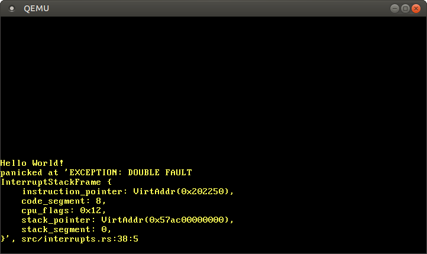

<h1>Double Faults(双重故障)</h1>
This post explores the double fault exception in detail, which occurs when the CPU fails to invoke an exception handler. By handling this exception, we avoid fatal triple faults that cause a system reset. To prevent triple faults in all cases, we also set up an Interrupt Stack Table to catch double faults on a separate kernel stack.

这篇文章将会详细的探究双重故障(二次异常?)的细节，该异常在cpu无法正常处理异常处理程序的时候产生。通过处理该异常吗，我们能够避免导致系统重置的三重故障。为了保证在所有情况下都能避免三重故障，我们需要配置一个中断栈表，以便在单独的内核栈上捕捉二重故障。

This blog is openly developed on GitHub. If you have any problems or questions, please open an issue there. 
You can also leave comments at the bottom. The complete source code for this post can be found in the post-06 branch.

这篇博客是在[GitHub](https://github.com/phil-opp/blog_os)上公开开发的。如果你有任何问题或疑问，请在那里开一个问题。你也可以在底部留下评论。
本帖的完整源代码可以在[post-06](https://github.com/phil-opp/blog_os/tree/post-06)分支中找到。


<h2>What is a Double Fault? (什么双重故障)</h2>

In simplified terms, a double fault is a special exception that occurs when the CPU fails to invoke an exception handler. For example, it occurs when a page fault is triggered but there is no page fault handler registered in the [Interrupt Descriptor Table](https://os.phil-opp.com/cpu-exceptions/#the-interrupt-descriptor-table) (IDT). So it’s kind of similar to catch-all blocks in programming languages with exceptions, e.g., `catch(...)` in C++ or `catch(Exception e)` in Java or C#.

简而言之，双重故障是一种发生在cpu调用异常处理程序失败时产生的特定异常。比如，当页错误触发了但是在[IDT](https://os.phil-opp.com/cpu-exceptions/#the-interrupt-descriptor-table)中却没有注册对应的处理程序。所以，他有点类似编程语言中的捕捉所有异常的代码块，比如 
C++中的`catch(...)`或者Java,C#中的`catch(Exception e)`。

A double fault behaves like a normal exception. It has the vector number `8` and we can define a normal handler function for it in the IDT. It is really important to provide a double fault handler, because if a double fault is unhandled, a fatal triple fault occurs. Triple faults can’t be caught, and most hardware reacts with a system reset.

双重故障的行为与普通异常类似，他的向量索引是`8`，并且我们可以在IDT中为他定义一个普通的处理函数。提供双重故障处理函数是十分重要的，因为一旦双重故障没有得到适当的处理，致命的三重故障就会产生。三重故障是无法被捕获的，并且大部分硬件对三重故障的反应就是系统复位。

<h3>Triggering a Double Fault(触发双重故障)</h3>

Let’s provoke a double fault by triggering an exception for which we didn’t define a handler function:
我们通过触发一个没有设置处理程序的异常来引发双重故障:
```rust
// in src/main.rs

#[no_mangle]
pub extern "C" fn _start() -> ! {
    println!("Hello World{}", "!");

    blog_os::init();

    // trigger a page fault
    unsafe {
        *(0xdeadbeef as *mut u64) = 42;
    };

    // as before
    #[cfg(test)]
    test_main();

    println!("It did not crash!");
    loop {}
}
```

We use `unsafe` to write to the invalid address `0xdeadbeef`. The virtual address is not mapped to a physical address in the page tables, so a page fault occurs. We haven’t registered a page fault handler in our IDT, so a double fault occurs.

我们在`unsafe`代码块中向一个无效的地址`0xdeadbeef`写入数据。在页表上，该虚拟地址并没有映射到实际的物理地址,所以页错误产生了。我们还没有在IDT上注册响应页错误的处理程序，所以就引发了双重故障。

When we start our kernel now, we see that it enters an endless boot loop. The reason for the boot loop is the following:

1. The CPU tries to write to `0xdeadbeef`, which causes a page fault.
2. The CPU looks at the corresponding entry in the IDT and sees that no handler function is specified. Thus, it can’t call the page fault handler and a double fault occurs.
3. The CPU looks at the IDT entry of the double fault handler, but this entry does not specify a handler function either. Thus, a triple fault occurs.
4. A triple fault is fatal. QEMU reacts to it like most real hardware and issues a system reset.

当启动我们的内核，我们可以看到无限的重启。重启的原因如下:

1. CPU尝试向`0xdeadbeef`写入数据，引发了一个页错误。
2. CPU尝试在IDT中查找对应表项，但是发现并没有注册对应的处理函数。因此，他无法调用页错误处理程序，引发一个双重故障
3. CPU在IDT查找双重故障对应的表项，但是发现双重故障也没有指定处理程序。因此，出发了三重故障。
4. 三重故障是致命的。QEMU和大多数硬件一样对此做出反应，命令系统重置。
   
So in order to prevent this triple fault, we need to either provide a handler function for page faults or a double fault handler. We want to avoid triple faults in all cases, so let’s start with a double fault handler that is invoked for all unhandled exception types.

为了防止三种故障的发生，我们需要提供一个页错误的处理函数或者提供一个双重故障的处理函数。我们希望在任何情况下都能避免三种故障的产生，所以，我们从所有未注册异常都将调用的双重故障处理程序开始。

<h2>A Double Fault Handler(双重故障处理程序)</h2>

A double fault is a normal exception with an error code, so we can specify a handler function similar to our breakpoint handler:

双重故障是一个带有错误码的普通异常，所以我们指定的处理函数和断点异常处理程序类似:

```rust
// in src/interrupts.rs

lazy_static! {
    static ref IDT: InterruptDescriptorTable = {
        let mut idt = InterruptDescriptorTable::new();
        idt.breakpoint.set_handler_fn(breakpoint_handler);
        idt.double_fault.set_handler_fn(double_fault_handler); // new
        idt
    };
}

// new
extern "x86-interrupt" fn double_fault_handler(
    stack_frame: InterruptStackFrame, _error_code: u64) -> !
{
    panic!("EXCEPTION: DOUBLE FAULT\n{:#?}", stack_frame);
}
```

Our handler prints a short error message and dumps the exception stack frame. The error code of the double fault handler is always zero, so there’s no reason to print it. One difference to the breakpoint handler is that the double fault handler is [diverging](https://doc.rust-lang.org/stable/rust-by-example/fn/diverging.html). The reason is that the `x86_64` architecture does not permit returning from a double fault exception.

我们的处理程序会输出一段简短的错误信息并且导出异常栈帧。双重故障的错误码总是0，所以我们没必要打印出来。和断点异常程序有一点不同的是，双重故障处理函数是一个[发散函数](https://doc.rust-lang.org/stable/rust-by-example/fn/diverging.html))。因为`x86_64`架构禁止从一个双重故障异常中返回。

When we start our kernel now, we should see that the double fault handler is invoked:
现在我们启动内核，我们可以看到双重故障程序被正常的调用了:


It worked! Here is what happened this time:

1. The CPU tries to write to `0xdeadbeef`, which causes a page fault.
2. Like before, the CPU looks at the corresponding entry in the IDT and sees that no handler function is defined. Thus, a double fault occurs.
3. The CPU jumps to the – now present – double fault handler.

可以看到，程序正常执行了！这里的执行过程如下:

1. CPU尝试向`0xdeadbeef`写入数据，引发一个页错误
2. 和之前一样，cpu在IDT对应的表项中发现并没有定义和页错误对应的处理函数，因此，引发了一个双重故障。
3. CPU跳到我们刚注册的双重故障处理程序。
   
The triple fault (and the boot-loop) no longer occurs, since the CPU can now call the double fault handler.

三重故障(以及重启)现象没有在出现，因为CPU能够调用双重故障处理程序了。

That was quite straightforward! So why do we need a whole post for this topic? Well, we’re now able to catch most double faults, but there are some cases where our current approach doesn’t suffice.

这看起来很简单！所以我们为什么会为这个主题专门写一篇文章呢？因为现在的程序可以捕获大部分的双重故障，但是有些场景下，我们目前的方案并不够用。

<h2>Causes of Double Faults(双重故障的原因)</h2>

Before we look at the special cases, we need to know the exact causes of double faults. Above, we used a pretty vague definition:

在研究特殊场景之前，我们需要知道引发双重故障的准确原因。上文中，我们使用了一个十分含糊的定义:


>A double fault is a special exception that occurs when the CPU fails to invoke an exception handler.

>双重故障是一种发生在cpu调用异常处理程序失败时产生的特定异常。

What does “fails to invoke” mean exactly? The handler is not present? The handler is [swapped out](http://pages.cs.wisc.edu/~remzi/OSTEP/vm-beyondphys.pdf)? And what happens if a handler causes exceptions itself?

调用失败具体指什么呢？处理程序不存在？还是程序被[交换出去](http://pages.cs.wisc.edu/~remzi/OSTEP/vm-beyondphys.pdf)?又或者如果异常处理程序自己产生了异常呢?

For example, what happens if:

1. a breakpoint exception occurs, but the corresponding handler function is swapped out?
2. a page fault occurs, but the page fault handler is swapped out?
3. a divide-by-zero handler causes a breakpoint exception, but the breakpoint handler is swapped out?
4. our kernel overflows its stack and the guard page is hit?

比如发生了下面这些状况:

1. 产生了断点异常，但是对应的处理函数空间被交换出去了？
2. 一个页错误产生了。但是页错误处理程序空间被交换出去了？
3. 除零处理程序产生了一个断点异常，但是断点异常程序空间被交换出去了
4. 我们的内核栈溢出了，同时进入了保护页(引发page fault)？

Fortunately, the AMD64 manual ([PDF](https://www.amd.com/system/files/TechDocs/24593.pdf)) has an exact definition (in Section 8.2.9). According to it, a “double fault exception can occur when a second exception occurs during the handling of a prior (first) exception handler”. The “can” is important: Only very specific combinations of exceptions lead to a double fault. These combinations are:

幸运的是，AMD64手册 ([PDF](https://www.amd.com/system/files/TechDocs/24593.pdf)) 中描述了准确定义（位于第8.2.9节）。根据该描述，“在执行先前（第一个）异常处理程序期间发生第二个异常时，可能会诱发双重故障异常”。 这个“可能”很重要：只有非常特殊的异常组合才会导致双重故障。这些组合是：

| First Exception                                                                                                                                                                                                                                                                                                                                                                                        | Second Exception                                                                                                                                                                                                                                                                                                                                                                         |
| ------------------------------------------------------------------------------------------------------------------------------------------------------------------------------------------------------------------------------------------------------------------------------------------------------------------------------------------------------------------------------------------------------ | ---------------------------------------------------------------------------------------------------------------------------------------------------------------------------------------------------------------------------------------------------------------------------------------------------------------------------------------------------------------------------------------- |
| [Divide-by-zero](https://wiki.osdev.org/Exceptions#Divide-by-zero_Error),<br>[Invalid TSS](https://wiki.osdev.org/Exceptions#Invalid_TSS),<br>[Segment Not Present](https://wiki.osdev.org/Exceptions#Segment_Not_Present),<br>[Stack-Segment Fault](https://wiki.osdev.org/Exceptions#Stack-Segment_Fault),<br>[General Protection Fault](https://wiki.osdev.org/Exceptions#General_Protection_Fault) | [Invalid TSS](https://wiki.osdev.org/Exceptions#Invalid_TSS),<br>[Segment Not Present](https://wiki.osdev.org/Exceptions#Segment_Not_Present),<br>[Stack-Segment Fault](https://wiki.osdev.org/Exceptions#Stack-Segment_Fault),<br>[General Protection Fault](https://wiki.osdev.org/Exceptions#General_Protection_Fault)                                                                |
| [Page Fault](https://wiki.osdev.org/Exceptions#Page_Fault)                                                                                                                                                                                                                                                                                                                                             | [Page Fault](https://wiki.osdev.org/Exceptions#Page_Fault),<br>[Invalid TSS](https://wiki.osdev.org/Exceptions#Invalid_TSS),<br>[Segment Not Present](https://wiki.osdev.org/Exceptions#Segment_Not_Present),<br>[Stack-Segment Fault](https://wiki.osdev.org/Exceptions#Stack-Segment_Fault),<br>[General Protection Fault](https://wiki.osdev.org/Exceptions#General_Protection_Fault) |


So, for example, a divide-by-zero fault followed by a page fault is fine (the page fault handler is invoked), but a divide-by-zero fault followed by a general-protection fault leads to a double fault.

于是，诸如除零错误后接页面错误就相安无事（继续调用页面错误处理程序），但是除零错误后接一般性保护错误就会导致双重故障。

With the help of this table, we can answer the first three of the above questions:

1. If a breakpoint exception occurs and the corresponding handler function is swapped out, a page fault occurs and the page fault handler is invoked.
2. If a page fault occurs and the page fault handler is swapped out, a double fault occurs and the double fault handler is invoked.
3. If a divide-by-zero handler causes a breakpoint exception, the CPU tries to invoke the breakpoint handler. If the breakpoint handler is swapped out, a page fault occurs and the page fault handler is invoked.


借助此表，我们可以回答上述四个问题中的前三个：

1. 如果发生断点异常，同时相应的处理函数被换出，则会发生页错误，并调用页错误处理程序。
2. 如果发生页错误，同时页错误处理程序被换出，则会发生双重故障，并调用双重故障处理程序。
3. 如果除零错误处理程序导致断点异常，则CPU会尝试调用断点处理程序。如果断点处理程序被换出，则会发生页错误并调用页面错误处理程序。

In fact, even the case of an exception without a handler function in the IDT follows this scheme: When the exception occurs, the CPU tries to read the corresponding IDT entry. Since the entry is 0, which is not a valid IDT entry, a general protection fault occurs. We did not define a handler function for the general protection fault either, so another general protection fault occurs. According to the table, this leads to a double fault.

实际上，即使没有在IDT中注册处理函数的异常的情况也遵循此方案：当发生异常时，CPU会尝试读取相应的IDT条目。由于该条目为0，即无效的IDT条目，因此会诱发一般保护错误。我们也没有为一般保护错误定义处理函数，因此会诱发另一个一般保护故障。根据上表，这将导致双重故障。

<h3>Kernel Stack Overflow(内核栈溢出)</h3>
Let’s look at the fourth question:

>What happens if our kernel overflows its stack and the guard page is hit?

现在我们看下上面的第四个问题:

>我们的内核栈溢出了，同时进入了保护页(引发page fault)？

A guard page is a special memory page at the bottom of a stack that makes it possible to detect stack overflows. The page is not mapped to any physical frame, so accessing it causes a page fault instead of silently corrupting other memory. The bootloader sets up a guard page for our kernel stack, so a stack overflow causes a page fault.

保护页是栈底的特殊内存页，可用来检测栈溢出。该页面未映射到任何物理内存，因此对其进行的访问动作将会导致页错误，而不是静默的非法访问其他内存。bootloader为我们的内核栈设置了一个保护页面，因此栈溢出会导致页面错误。

When a page fault occurs, the CPU looks up the page fault handler in the IDT and tries to push the [interrupt stack frame](https://os.phil-opp.com/cpu-exceptions/#the-interrupt-stack-frame) onto the stack. However, the current stack pointer still points to the non-present guard page. Thus, a second page fault occurs, which causes a double fault (according to the above table).

当发生页面错误时，CPU在IDT中查找页面错误处理程序，并尝试将[中断栈帧](https://os.phil-opp.com/cpu-exceptions/#the-interrupt-stack-frame)压栈。但是，当前的栈指针仍指向不存在的保护页。于是，发生第二个页面错误，这将导致双重故障（根据上表）。

So the CPU tries to call the double fault handler now. However, on a double fault, the CPU tries to push the exception stack frame, too. The stack pointer still points to the guard page, so a third page fault occurs, which causes a triple fault and a system reboot. So our current double fault handler can’t avoid a triple fault in this case.

现在CPU将尝试调用双重故障处理程序。但是，在出现双重故障时，CPU也会尝试压入异常栈帧。此时栈指针仍指向保护页，于是发生第三个页错误，这将导致三重故障并使系统重启。所以，在这种情况下，目前的双重故障处理程序无法避免三重故障。

Let’s try it ourselves! We can easily provoke a kernel stack overflow by calling a function that recurses endlessly:

我们可以自己试下！通过调用一个无限递归的函数就可以引发内核栈溢出:

```rust
// in src/main.rs

#[no_mangle] // don't mangle the name of this function
pub extern "C" fn _start() -> ! {
    println!("Hello World{}", "!");

    blog_os::init();

    fn stack_overflow() {
        stack_overflow(); // for each recursion, the return address is pushed
    }

    // trigger a stack overflow
    stack_overflow();

    […] // test_main(), println(…), and loop {}
}
```

When we try this code in QEMU, we see that the system enters a bootloop again.

当我们在QEMU中运行这段代码时，将看到系统再次陷入无限重启。

So how can we avoid this problem? We can’t omit the pushing of the exception stack frame, since the CPU itself does it. So we need to ensure somehow that the stack is always valid when a double fault exception occurs. Fortunately, the x86_64 architecture has a solution to this problem.

那么应该怎样避免这个问题呢？我们不能忽略异常栈帧压栈，因为这是CPU的硬件行为。因此，我们需要确保在发生双重故障时栈始终是合法的。幸运的是，x86_64架构可以解决此问题。

<h2>Switching Stacks(栈切换)</h2>

The x86_64 architecture is able to switch to a predefined, known-good stack when an exception occurs. This switch happens at hardware level, so it can be performed before the CPU pushes the exception stack frame.

当发生异常时，x86_64架构能够切换到预定义的已知良好的栈上。此切换发生在硬件级别，因此可以在CPU推送异常栈帧之前执行。

The switching mechanism is implemented as an Interrupt Stack Table (IST). The IST is a table of 7 pointers to known-good stacks. In Rust-like pseudocode:

这种切换机制是通过中断栈表(IST)实现的。IST是由7个指向已知良好栈的指针组成的表。用rust风格伪代码展示如下:

```rust
struct InterruptStackTable {
    stack_pointers: [Option<StackPointer>; 7],
}
```

For each exception handler, we can choose a stack from the IST through the `stack_pointers` field in the corresponding [IDT entry](https://os.phil-opp.com/cpu-exceptions/#the-interrupt-descriptor-table). For example, our double fault handler could use the first stack in the IST. Then the CPU automatically switches to this stack whenever a double fault occurs. This switch would happen before anything is pushed, preventing the triple fault.

对于每个异常处理程序，我们可以通过相应[IDT表项](https://os.phil-opp.com/cpu-exceptions/#the-interrupt-descriptor-table)中的`stack_pointers`参数在IST中指定一个栈。例如，我们可以将IST中的第一个栈用于双重故障处理程序。此后，每当发生双重故障时，CPU都会自动切换到该栈。该切换将发生在一切压栈动作之前，因此能够防止三重故障。

<h3>The IST and TSS</h3>

The Interrupt Stack Table (IST) is part of an old legacy structure called [Task State Segment](https://en.wikipedia.org/wiki/Task_state_segment) (TSS). The TSS used to hold various pieces of information (e.g., processor register state) about a task in 32-bit mode and was, for example, used for hardware context switching. However, hardware context switching is no longer supported in 64-bit mode and the format of the TSS has changed completely.

中断栈表(IST)是原价架构遗留的结构体[任务状态段](https://en.wikipedia.org/wiki/Task_state_segment)(TSS)中的一部分。在32位模式下TSS曾用于保存有关任务的各种信息（如处理器寄存器状态），例如用于硬件上下文切换。但是，在64位模式下不再支持硬件上下文切换，并且TSS的格式也完全改变了。

On x86_64, the TSS no longer holds any task-specific information at all. Instead, it holds two stack tables (the IST is one of them). The only common field between the 32-bit and 64-bit TSS is the pointer to the [I/O port permissions bitmap](https://en.wikipedia.org/wiki/Task_state_segment#I.2FO_port_permissions).

在x86_64上，TSS完全不再保存任何特定任务的信息。相反，它持有两个栈表（IST是其中之一）。32位和64位TSS之间唯一的共同字段是指向[I/O端口权限位图]((https://en.wikipedia.org/wiki/Task_state_segment#I.2FO_port_permissions))的指针。

The 64-bit TSS has the following format:

64位下的TSS格式如下:

| Field                 | Type     |
| --------------------- | -------- |
| (reserved)            | u32      |
| Privilege Stack Table | [u64; 3] |
| (reserved)            | u64      |
| Interrupt Stack Table | [u64; 7] |
| (reserved)            | u64      |
| (reserved)            | u16      |
| I/O Map Base Address  | u16      |


The Privilege Stack Table is used by the CPU when the privilege level changes. For example, if an exception occurs while the CPU is in user mode (privilege level 3), the CPU normally switches to kernel mode (privilege level 0) before invoking the exception handler. In that case, the CPU would switch to the 0th stack in the Privilege Stack Table (since 0 is the target privilege level). We don’t have any user-mode programs yet, so we will ignore this table for now.

当特权级别变更时，CPU使用特权栈表。例如，如果在CPU处于用户模式（特权级别3）时发生异常，则在调用异常处理程序之前，CPU通常会切换到内核模式（特权级别0）。在这种情况下，CPU将切换到“特权栈表”中的第0个栈（因为0是目标特权级别）。我们目前还没有任何用户模式程序，因此我们暂时忽略此表。

<h3>Creating a TSS (创建一个TSS)</h3>

Let’s create a new TSS that contains a separate double fault stack in its interrupt stack table. For that, we need a TSS struct. Fortunately, the `x86_64` crate already contains a [TaskStateSegment struct](https://docs.rs/x86_64/0.14.2/x86_64/structures/tss/struct.TaskStateSegment.html) that we can use.

让我们创建一个新的TSS，并在其中断栈表中包含一个单独的双重故障栈。为此，我们需要一个TSS结构体。幸运的是，`x86_64` 包已经包含了[TaskStateSegment struct](https://docs.rs/x86_64/0.14.2/x86_64/structures/tss/struct.TaskStateSegment.html)结构体，我们可以直接使用。

We create the TSS in a new `gdt` module (the name will make sense later):

我们在新的gdt（稍后会解释这个缩写的意义）模块中创建TSS：

```rust
// in src/lib.rs

pub mod gdt;

// in src/gdt.rs

use x86_64::VirtAddr;
use x86_64::structures::tss::TaskStateSegment;
use lazy_static::lazy_static;

pub const DOUBLE_FAULT_IST_INDEX: u16 = 0;

lazy_static! {
    static ref TSS: TaskStateSegment = {
        let mut tss = TaskStateSegment::new();
        tss.interrupt_stack_table[DOUBLE_FAULT_IST_INDEX as usize] = {
            const STACK_SIZE: usize = 4096 * 5;
            static mut STACK: [u8; STACK_SIZE] = [0; STACK_SIZE];

            let stack_start = VirtAddr::from_ptr(unsafe { &STACK });
            let stack_end = stack_start + STACK_SIZE;
            stack_end
        };
        tss
    };
}
```

We use `lazy_static` because Rust’s const evaluator is not yet powerful enough to do this initialization at compile time. We define that the 0th IST entry is the double fault stack (any other IST index would work too). Then we write the top address of a double fault stack to the 0th entry. We write the top address because stacks on x86 grow downwards, i.e., from high addresses to low addresses.


这里使用`lazy_static`是因为Rust的常量求值器还不够强大，无法在编译时进行上面的初始化操作。我们定义第0个IST条目为双重故障栈（换做其他任何IST条目均可）。再将双重故障栈的高位地址写入第0个条目。写入高位地址是因为x86上的栈向下增长，即从高位地址到低位地址（push 操作 第一步 类似 sp=sp-2 ）。


We haven’t implemented memory management yet, so we don’t have a proper way to allocate a new stack. Instead, we use a `static mut` array as stack storage for now. The `unsafe` is required because the compiler can’t guarantee race freedom when mutable statics are accessed. It is important that it is a `static mut` and not an immutable `static`, because otherwise the bootloader will map it to a read-only page. We will replace this with a proper stack allocation in a later post, then the `unsafe` will no longer be needed at this place.

我们尚未实现内存管理，因此目前并没有一个合适的方法能够用于新栈的分配。作为代替，我们使用`static mut`数组作为栈存储空间。这里需要使用`unsafe`块，因为在访问可变静态变量时，编译器无法保证数据竞争条件。它一定要是一个`static mut`而不是一个不可变`static`，否则bootloader会将其映射到只读页面。我们将在以后的文章中将其替换为适当的栈分配方法，使得这里不再需要`unsafe`块。

Note that this double fault stack has no guard page that protects against stack overflow. This means that we should not do anything stack-intensive in our double fault handler because a stack overflow might corrupt the memory below the stack.

需要注意的是，这里的双重故障栈并没用以防止栈溢出的保护页。这意味着我们不应该在双重故障处理程序中执行密集的栈操作，从而导致栈溢出并破坏栈下方的内存。

<h4>Loading the TSS(加载TSS)</h4>

Now that we’ve created a new TSS, we need a way to tell the CPU that it should use it. Unfortunately, this is a bit cumbersome since the TSS uses the segmentation system (for historical reasons). Instead of loading the table directly, we need to add a new segment descriptor to the [Global Descriptor Table](https://web.archive.org/web/20190217233448/https://www.flingos.co.uk/docs/reference/Global-Descriptor-Table/) (GDT). Then we can load our TSS by invoking the [ltr instruction](https://www.felixcloutier.com/x86/ltr) with the respective GDT index. (This is the reason why we named our module `gdt`.)

我们创建了一个新的TSS，现在需要告诉CPU它应该使用这个新TSS。不幸的是，这有点麻烦，因为TSS使用分段系统（出于历史原因）。这里我们不能直接加载表，而应向[全局描述符表](https://web.archive.org/web/20190217233448/https://www.flingos.co.uk/docs/reference/Global-Descriptor-Table/)(GDT)添加新的段描述符。然后，我们就可以使用相应的GDT索引调用[ltr指令](https://www.felixcloutier.com/x86/ltr)来加载我们的TSS。(这就是为什么我们将模块命名为gdt。)

<h3>The Global Descriptor Table(全局描述符表)</h3>

The Global Descriptor Table (GDT) is a relic that was used for [memory segmentation](https://en.wikipedia.org/wiki/X86_memory_segmentation) before paging became the de facto standard. However, it is still needed in 64-bit mode for various things, such as kernel/user mode configuration or TSS loading.

全局描述符表（GDT）也是一个一个历史遗留设计，在内存分页技术成为事实上的标准之前，它被用于[内存分段](https://en.wikipedia.org/wiki/X86_memory_segmentation)。然而，在64位模式下仍然需要它来做各种事情，比如内核/用户模式配置或TSS加载。

The GDT is a structure that contains the segments of the program. It was used on older architectures to isolate programs from each other before paging became the standard. For more information about segmentation, check out the equally named chapter of the free [“Three Easy Pieces” book](http://pages.cs.wisc.edu/~remzi/OSTEP/). While segmentation is no longer supported in 64-bit mode, the GDT still exists. It is mostly used for two things: Switching between kernel space and user space, and loading a TSS structure.

GDT是包含程序段的结构体，在内存分页成为标准之前的旧架构中，用于将程序彼此隔离。有关分段的更多信息，请查阅名为[“Three Easy Pieces”](http://pages.cs.wisc.edu/~remzi/OSTEP/)的免费书籍中的同名章节。虽然在64位模式下不再支持分段，但是GDT仍然存在。现在它主要用于两件事：在内核空间和用户空间之间切换，以及加载TSS结构。

<h4>Creating a GDT(创建GDT)</h4>

Let’s create a static `GDT` that includes a segment for our `TSS` static:

让我们创建一个静态`GDT`，其中包含我们的静态变量`TSS`：

```rust
// in src/gdt.rs

use x86_64::structures::gdt::{GlobalDescriptorTable, Descriptor};

lazy_static! {
    static ref GDT: GlobalDescriptorTable = {
        let mut gdt = GlobalDescriptorTable::new();
        gdt.add_entry(Descriptor::kernel_code_segment());
        gdt.add_entry(Descriptor::tss_segment(&TSS));
        gdt
    };
}
```

As before, we use `lazy_static` again. We create a new GDT with a code segment and a TSS segment.

和之前一样，我们再次使用`lazy_static`。我们创建了一个含有code segment和TSS segment的 GDT.


<h4>Loading the GDT(加载GDT)</h4>

To load our GDT, we create a new `gdt::init` function that we call from our `init` function:

创建一个新的`gdt::init`函数用于载GDT，我们再从总`init`函数中调用该初始化：

```rust
// in src/gdt.rs

pub fn init() {
    GDT.load();
}

// in src/lib.rs

pub fn init() {
    gdt::init();
    interrupts::init_idt();
}
```

Now our GDT is loaded (since the `_start` function calls `init`), but we still see the boot loop on stack overflow.

现在GDT已加载（因为`_start`函数调用了总`init`），但是我们仍然看到栈溢出时的无限重启。


<h3>The Final Steps(最后几步)</h3>

The problem is that the GDT segments are not yet active because the segment and TSS registers still contain the values from the old GDT. We also need to modify the double fault IDT entry so that it uses the new stack.

此时的问题在于新的GDT段尚未激活，因为段和TSS寄存器仍为旧GDT中的值。我们还需要修改双重故障的IDT表项，使其能够使用新栈。

In summary, we need to do the following:

1. **Reload code segment register**: We changed our GDT, so we should reload cs, the code segment register. This is required since the old segment selector could now point to a different GDT descriptor (e.g., a TSS descriptor).
2. **Load the TSS**: We loaded a GDT that contains a TSS selector, but we still need to tell the CPU that it should use that TSS.
3. **Update the IDT entry**: As soon as our TSS is loaded, the CPU has access to a valid interrupt stack table (IST). Then we can tell the CPU that it should use our new double fault stack by modifying our double fault IDT entry.

总之，我们需要执行以下操作：

1. **重载代码段寄存器**：我​​们更改了GDT，应该重载代码段寄存器cs。这是必需的，因为旧的段选择器现在可能指向其他GDT描述符（例如TSS描述符）。
2. **加载TSS**：我们加载了一个包含TSS选择器的GDT，但是我们仍然需要告诉CPU去使用这个新的TSS。
3. **更新IDT条目**：一旦加载了TSS，CPU就能够访问有效的中断栈表(IST)了。然后，通过修改双重故障的IDT表项，就可以告诉CPU它应该使用新的双重故障栈了。

For the first two steps, we need access to the `code_selector` and `tss_selector` variables in our `gdt::init` function. We can achieve this by making them part of the static through a new `Selectors` struct:

对于前两个步骤，我们需要访问`gdt::init`函数中的`code_selector`和`tss_selector`变量。要使得这两个变量能够被访问，我们可以通过新建`Selectors`结构体使它们成为静态变量的一部分：

```rust
// in src/gdt.rs

use x86_64::structures::gdt::SegmentSelector;

lazy_static! {
    static ref GDT: (GlobalDescriptorTable, Selectors) = {
        let mut gdt = GlobalDescriptorTable::new();
        let code_selector = gdt.add_entry(Descriptor::kernel_code_segment());
        let tss_selector = gdt.add_entry(Descriptor::tss_segment(&TSS));
        (gdt, Selectors { code_selector, tss_selector })
    };
}

struct Selectors {
    code_selector: SegmentSelector,
    tss_selector: SegmentSelector,
}
```

Now we can use the selectors to reload the `cs` register and load our `TSS`:

现在，可以使用选择器来重载cs段寄存器并加载我们的TSS：

```rust
// in src/gdt.rs

pub fn init() {
    use x86_64::instructions::tables::load_tss;
    use x86_64::instructions::segmentation::{CS, Segment};
    
    GDT.0.load();
    unsafe {
        CS::set_reg(GDT.1.code_selector);
        load_tss(GDT.1.tss_selector);
    }
}
```

We reload the code segment register using `set_cs` and load the TSS using `load_tss`. The functions are marked as `unsafe`, so we need an `unsafe` block to invoke them. The reason is that it might be possible to break memory safety by loading invalid selectors.

我们使用set_cs重载代码段寄存器，并使用load_tss加载TSS。这两个函数被标记为unsafe，因此需要在unsafe块中调用——它们可能会因为加载了无效选择器而破坏内存安全。


Now that we have loaded a valid TSS and interrupt stack table, we can set the stack index for our double fault handler in the IDT:

我们已经加载了有效的TSS和中断堆栈表，现在，可以在IDT中为双重故障处理程序设置栈索引了：

```rust
// in src/interrupts.rs

use crate::gdt;

lazy_static! {
    static ref IDT: InterruptDescriptorTable = {
        let mut idt = InterruptDescriptorTable::new();
        idt.breakpoint.set_handler_fn(breakpoint_handler);
        unsafe {
            idt.double_fault.set_handler_fn(double_fault_handler)
                .set_stack_index(gdt::DOUBLE_FAULT_IST_INDEX); // new
        }

        idt
    };
}
```

The `set_stack_index` method is unsafe because the caller must ensure that the used index is valid and not already used for another exception.

`set_stack_index`方法是非安全的，调用者必须确保使用的索引有效，并且未用于其他异常。

That’s it! Now the CPU should switch to the double fault stack whenever a double fault occurs. Thus, we are able to catch all double faults, including kernel stack overflows:

现在，每当发生双重故障时，CPU应该都能切换到双重故障栈。因此，我们能够捕获所有双重故障，包括内核栈溢出：




From now on, we should never see a triple fault again! To ensure that we don’t accidentally break the above, we should add a test for this.

从现在开始，我们再也不会看到三重故障！为确保我们不会意外地破坏以上操作，我们应该为此添加一个测试。

<h2>A Stack Overflow Test (栈溢出测试)</h2>

To test our new `gdt` module and ensure that the double fault handler is correctly called on a stack overflow, we can add an integration test. The idea is to provoke a double fault in the test function and verify that the double fault handler is called.

为了测试新写的`gdt`模块，并确保在栈溢出时正确调用了双重故障处理程序，我们可以添加一个集成测试。大致思路是在测试函数中引发双重故障，以验证是否调用了双重故障处理程序。

Let’s start with a minimal skeleton:

让我们从一个最小化的测试程序开始：

```rust
// in tests/stack_overflow.rs

#![no_std]
#![no_main]

use core::panic::PanicInfo;

#[no_mangle]
pub extern "C" fn _start() -> ! {
    unimplemented!();
}

#[panic_handler]
fn panic(info: &PanicInfo) -> ! {
    blog_os::test_panic_handler(info)
}
```

Like our `panic_handler` test, the test will run [without a test harness](https://os.phil-opp.com/testing/#no-harness-tests). The reason is that we can’t continue execution after a double fault, so more than one test doesn’t make sense. To disable the test harness for the test, we add the following to our `Cargo.toml`:

就像我们的`panic_handler`测试一样，该测试将在[没有测试环境](https://os.phil-opp.com/testing/#no-harness-tests)的条件下运行。这是因为出现双重错误后程序无法继续执行，因此执行多于一个的测试是没有意义的。要禁用测试的测试环境，我们将以下内容添加到我们的`Cargo.toml`中：

```
# in Cargo.toml

[[test]]
name = "stack_overflow"
harness = false
```

Now `cargo test --test stack_overflow` should compile successfully. The test fails, of course, since the `unimplemented` macro panics.

现在，`cargo test --test stack_overflow`应该可以编译。当然，运行测试会失败，因为`unimplemented`宏会引起panic。

<h3>Implementing _start</h3>

The implementation of the `_start` function looks like this:

`_start`函数的实现将会像这样：

```rust
// in tests/stack_overflow.rs

use blog_os::serial_print;

#[no_mangle]
pub extern "C" fn _start() -> ! {
    serial_print!("stack_overflow::stack_overflow...\t");

    blog_os::gdt::init();
    init_test_idt();

    // trigger a stack overflow
    stack_overflow();

    panic!("Execution continued after stack overflow");
}

#[allow(unconditional_recursion)]
fn stack_overflow() {
    stack_overflow(); // for each recursion, the return address is pushed
    volatile::Volatile::new(0).read(); // prevent tail recursion optimizations
}
```


We call our `gdt::init` function to initialize a new GDT. Instead of calling our `interrupts::init_idt` function, we call an `init_test_idt` function that will be explained in a moment. The reason is that we want to register a custom double fault handler that does an `exit_qemu(QemuExitCode::Success)` instead of panicking.

我们调用了 `gdt::init`函数来初始化一个新的GDT.这里不调用`interrupts::init_idt`函数，而是调用`gdt::init`函数来初始化新的GDT，原因是我们要注册一个自定义双重故障处理程序，它将执行`exit_qemu(QemuExitCode::Success)`退出，而不是直接panic。我们还将调用`init_test_idt`函数，稍后将对其进行说明。

The `stack_overflow` function is almost identical to the function in our main.rs. The only difference is that at the end of the function, we perform an additional [volatile](https://en.wikipedia.org/wiki/Volatile_(computer_programming)) read using the [Volatile](https://docs.rs/volatile/0.2.6/volatile/struct.Volatile.html) type to prevent a compiler optimization called [tail call elimination](https://en.wikipedia.org/wiki/Tail_call). Among other things, this optimization allows the compiler to transform a function whose last statement is a recursive function call into a normal loop. Thus, no additional stack frame is created for the function call, so the stack usage remains constant.

`stack_overflow`函数与`main.rs`中的函数几乎相同。唯一的不同是，我们在函数末尾使用[Volatile](https://docs.rs/volatile/0.2.6/volatile/struct.Volatile.html)类型进行了额外的[易失性](https://en.wikipedia.org/wiki/Volatile_(computer_programming)) 读取，以防止称为[尾调用消除](https://en.wikipedia.org/wiki/Tail_call)的编译器优化。此优化允许编译器将最后一条语句为递归调用的递归函数，从递归调用函数转换为带有循环的普通函数。若有此优化，则递归化为循环后函数将不再会新建额外的栈帧，于是该函数对于栈的使用将变为常量。

In our case, however, we want the stack overflow to happen, so we add a dummy volatile read statement at the end of the function, which the compiler is not allowed to remove. Thus, the function is no longer tail recursive, and the transformation into a loop is prevented. We also add the `allow(unconditional_recursion)` attribute to silence the compiler warning that the function recurses endlessly.

然而，在我们的例子中，我们希望堆栈溢出发生，所以我们在函数的末尾添加了一个假的volatile read语句，以禁止编译器删除上面的递归调用。因此，该函数不再是尾部递归，就不再会转换为一个普通循环。我们还添加了`allow(unconditional_recursion)`属性，以消除编译器对该函数无休止地递归的警告。

<h3>The Test IDT (测试用IDT)</h3>
As noted above, the test needs its own IDT with a custom double fault handler. The implementation looks like this:

如上所述，测试需要使用自己的IDT，并自定义双重故障处理程序。实现看起来像这样：

```rust
// in tests/stack_overflow.rs

use lazy_static::lazy_static;
use x86_64::structures::idt::InterruptDescriptorTable;

lazy_static! {
    static ref TEST_IDT: InterruptDescriptorTable = {
        let mut idt = InterruptDescriptorTable::new();
        unsafe {
            idt.double_fault
                .set_handler_fn(test_double_fault_handler)
                .set_stack_index(blog_os::gdt::DOUBLE_FAULT_IST_INDEX);
        }

        idt
    };
}

pub fn init_test_idt() {
    TEST_IDT.load();
}
```

The implementation is very similar to our normal IDT in `interrupts.rs`. Like in the normal IDT, we set a stack index in the IST for the double fault handler in order to switch to a separate stack. The `init_test_idt` function loads the IDT on the CPU through the `load` method.

该实现和于我们在`interrupts.rs`中的IDT十分类似。和正常的IDT一种，我们给用于双重故障处理程序的IST设置栈索引，以便触发异常时切换到这个已知良好的栈。最后`init_test_idt`函数通过load方法将IDT加载到CPU上。

<h3>The Double Fault Handler(双重故障处理程序)</h3>

The only missing piece is our double fault handler. It looks like this:
现在缺失的只有双重故障处理程序部分了，如下所示:

```rust
// in tests/stack_overflow.rs

use blog_os::{exit_qemu, QemuExitCode, serial_println};
use x86_64::structures::idt::InterruptStackFrame;

extern "x86-interrupt" fn test_double_fault_handler(
    _stack_frame: InterruptStackFrame,
    _error_code: u64,
) -> ! {
    serial_println!("[ok]");
    exit_qemu(QemuExitCode::Success);
    loop {}
}
```

When the double fault handler is called, we exit QEMU with a success exit code, which marks the test as passed. Since integration tests are completely separate executables, we need to set the `#![feature(abi_x86_interrupt)]` attribute again at the top of our test file.

调用双重故障处理程序时，我们以成功码退出QEMU，该代码将测试标记为已通过。由于集成测试是完全独立的可执行文件，因此我们仍需要在测试文件的顶部设置`#![feature(abi_x86_interrupt)]`属性。

Now we can run our test through `cargo test --test stack_overflow` (or `cargo test` to run all tests). As expected, we see the `stack_overflow... [ok]` output in the console. Try to comment out the `set_stack_index` line; it should cause the test to fail.

现在，我们可以通过`cargo test --test stack_overflow`来运行该测试（或通过`cargo test`运行所有测试）。不出所料，我们在控制台中看到输出`stack_overflow... [ok]`。尝试注释掉`set_stack_index`一行：它应该导致测试失败。

<h2>Summary(总结)</h2>

In this post, we learned what a double fault is and under which conditions it occurs. We added a basic double fault handler that prints an error message and added an integration test for it.

在这篇文章中，我们了解了什么是双重故障以及它将会在在什么情况下会发生。我们添加了一个基本的双重故障处理程序，该处理程序可以打印一条错误消息，并为此添加了集成测试。

We also enabled the hardware-supported stack switching on double fault exceptions so that it also works on stack overflow. While implementing it, we learned about the task state segment (TSS), the contained interrupt stack table (IST), and the global descriptor table (GDT), which was used for segmentation on older architectures.

我们还启用了硬件支持的双重故障异常上的切换栈功能，这保证了在栈溢出时程序依然能够正常运行。在实现它的过程中，我们了解了任务状态段（TSS）和其中包含的中断堆栈表（IST），以及用于在旧架构上进行内存分段的全局描述符表（GDT）。


