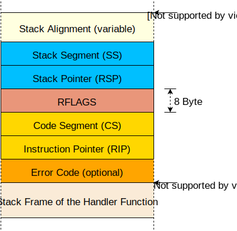

<h1>CPU Exceptions(CPU异常)</h1>
CPU exceptions occur in various erroneous situations, 
for example, when accessing an invalid memory address or when dividing by zero. 
To react to them, we have to set up an interrupt descriptor table that provides handler functions. 
At the end of this post, our kernel will be able to catch breakpoint exceptions and resume normal execution afterward.

cpu异常发生在各种执行出错的的场景。比如,当我们尝试去访问无效的内存地址或者除零的时候。为了对他们做出反应，我们需要设置中断描述符表来提供对应的处理函数。
在本章的最后，我们的内核将能够捕捉到断点异常，并在之后恢复到正常的执行环境。

This blog is openly developed on GitHub. If you have any problems or questions, please open an issue there. 
You can also leave comments at the bottom. 
The complete source code for this post can be found in the post-05 branch.

这篇博客是在[GitHub](https://github.com/phil-opp/blog_os)上公开开发的。如果你有任何问题或疑问，请在那里开一个问题。你也可以在底部留下评论。
本帖的完整源代码可以在[post-05](https://github.com/phil-opp/blog_os/tree/post-05)分支中找到。


<h1>Overview 概述</h1>
An exception signals that something is wrong with the current instruction. 
For example, the CPU issues an exception if the current instruction tries to divide by 0. 
When an exception occurs, the CPU interrupts its current work and immediately calls a specific exception handler function, 
depending on the exception type.

当当前指令发生错误的时候就会产生一个异常信号。举个例子，如果当前指令尝试除以0 cpu就会发出异常，当异常发生的时候，cpu会打断当前的工作并且根据
异常类型立刻调用指定的异常处理函数。

On x86, there are about 20 different CPU exception types. The most important are:

- **Page Fault**:A page fault occurs on illegal memory accesses.For example, if the current instruction tries to read from an unmapped page or tries to write to a read-only page.
- **Invalid Opcode**: This exception occurs when the current instruction is invalid, for example, 
when we try to use new SSE instructions on an old CPU that does not support them.
- **General Protection Fault**: This is the exception with the broadest range of causes.
It occurs on various kinds of access violations, such as trying to execute a privileged instruction in user-level code or writing reserved fields in configuration registers.
- **Double Fault**:When an exception occurs, the CPU tries to call the corresponding handler function. If another exception occurs while calling the exception handler, the CPU raises a double fault exception. This exception also occurs when there is no handler function registered for an exception.
- **Triple Fault**: If an exception occurs while the CPU tries to call the double fault handler function,it issues a fatal triple fault. We can’t catch or handle a triple fault. Most processors react by resetting themselves and rebooting the operating system.

For the full list of exceptions, check out the [OSDev wiki](https://wiki.osdev.org/Exceptions).

在x86架构下 大约有20种cpu异常类型，其中一些最重要的如下：
- **页错误**： 页错误是非法的内存访问引起的。举个例子，当前指令尝试从一个未映射的页读取数据或者是尝试往一个只读的页写入数据
- **非法的操作码**:这种异常一般是当前的操作指令是非法的。举个例子:当我们尝试在不支持新SSE指令的老式cpu上使用这些指令的时候。
- **一般保护错误**: 这是一个原因范围很广的异常，他发生在各种违反规定情况下的访问尝试，比如在用户层代码中尝试使用特权级指令或者尝试在配置寄存器种写入保留字段
- **双重故障**:当一个异常出现时，cpu会尝试调用对应的异常处理函数。但是如果在调用异常处理函数的过程中，又产生了一个异常，这时候cpu就会发起一个双重故障异常。
        当没有注册对应异常处理函数的异常出现的时候，也会产生这个异常。
- **三重故障**:如果cpu在调用双重异常处理函数的时候又产生了一个异常，那么就会发出三重故障异常，我们无法捕捉或者处理该异常，大多数处理器在这时候会重置自己或者重启操作系统

完整的异常列表 可以访问这个[OSDev wiki](https://wiki.osdev.org/Exceptions)

<h2>The Interrupt Descriptor Table (中断描述符表)</h2>
In order to catch and handle exceptions, we have to set up a so-called Interrupt Descriptor Table (IDT). 
In this table, we can specify a handler function for each CPU exception. The hardware uses this table directly, 
so we need to follow a predefined format. Each entry must have the following 16-byte structure:

为了捕捉并且处理出现的异常，我们需要预先设置好一个叫做中断描述符表的东西。在这张表里，我们为每种cpu异常指定了处理函数。为了硬件可以直接使用这张表，我们需要按照预先定义的格式来设置这张表。每个条目都必须包含以下的16字节的结构[这是基于x86_64的,GDT用于分段管理(找到线性地址 段:偏移) LDT分页管理(找到物理地址)]:

| Type | Name                     | Description                                                                                                         |
| ---- | ------------------------ | ------------------------------------------------------------------------------------------------------------------- |
| u16  | Function Pointer [0:15]  | The lower bits of the pointer to the handler function.                                                              |
| u16  | GDT selector             | Selector of a code segment in the [global descriptor table](https://en.wikipedia.org/wiki/Global_Descriptor_Table). |
| u16  | Options                  | (see below)                                                                                                         |
| u16  | Function Pointer [16:31] | The middle bits of the pointer to the handler function.                                                             |
| u32  | Function Pointer [32:63] | The remaining bits of the pointer to the handler function.                                                          |
| u32  | Reserved                 |

第1，2个字节       指向处理函数的指针的低16位

第3，4个字节       GDT中的段选择子 获得段地址

第5，6个字节       可选项 具体说明如下

第7，8个字节            函数指针的中间部分

第9，10，11，12个字节   函数指针的剩余部分

最后四个字节            保留字节

OPTIONS说明如下:


| Bits  | Name                             | Description                                                                                                     |
| ----- | -------------------------------- | --------------------------------------------------------------------------------------------------------------- |
| 0-2   | Interrupt Stack Table Index      | 0: Don’t switch stacks, 1-7: Switch to the n-th stack in the Interrupt Stack Table when this handler is called. |
| 3-7   | Reserved                         |
| 8     | 0: Interrupt Gate, 1: Trap Gate  | If this bit is 0, interrupts are disabled when this handler is called.                                          |
| 9-11  | must be one                      |
| 12    | must be zero                     |
| 13‑14 | Descriptor Privilege Level (DPL) | The minimal privilege level required for calling this handler.                                                  |
| 15    | Present                          |

0，1，2bit 中断堆栈表index  0表示不用切换 1-7表示切换的index 运行级别不同 可能会发生堆栈切换

3-7位 保留字节

8bit 说明是中断门还是陷入[陷阱]门  如果是0也就是中断门  那么可屏蔽中断信号将会屏蔽（if置0）

9-11 必须是1 配合8bit 所以0b1110 for interrupt Gate  0b1111 Trap Gate

12 必须是0

13-14 特权等级  说明执行处理函数的所需要的最小特权等级

15  当前段标识 


Each exception has a predefined IDT index. For example, 
the invalid opcode exception has table index 6 and the page fault exception has table index 14. 
Thus, the hardware can automatically load the corresponding IDT entry for each exception. 
The Exception Table in the OSDev wiki shows the IDT indexes of all exceptions in the “Vector nr.” column.

每个异常都会有一个预先定义的IDT序列。比如:非法操作符的序号是6，页错误的序号是14。因此硬件才能够在每个异常发生的时候自动的加载对应的IDT表项。
OSDev wiki中的异常表在`Vector nr.`一列展示了所有异常的IDT序号。

When an exception occurs, the CPU roughly does the following:
1. Push some registers on the stack, including the instruction pointer and the RFLAGS register.
  (We will use these values later in this post.)
2. Read the corresponding entry from the Interrupt Descriptor Table (IDT). 
  For example, the CPU reads the 14th entry when a page fault occurs.
3. Check if the entry is present and, if not, raise a double fault.
4. Disable hardware interrupts if the entry is an interrupt gate (bit 40 not set).
5. Load the specified GDT selector into the CS (code segment).
6. Jump to the specified handler function.


Don’t worry about steps 4 and 5 for now；
we will learn about the global descriptor table and hardware interrupts in future posts.

当一个异常发生的时候，cpu大致会进行下面的这些操作:
1. 部分寄存器入栈，包括指令指针 和标志位寄存器(我们会在本文的后面部分使用这些保存的值)
2. 从IDT读取对应的表项 举个例子 当页错误发生的时候 cpu会读取第十四个表项(从0开始)
3. 检查该条目是否存在 如果不存在 发起一个双重错误异常
4. 如果是中断门 （也就是第40位的bit是0） 屏蔽硬件中断
5. 加载指定的GDT选择子到cs寄存器(段选择子 相当于通过index找到GDT或者LDT的实际数据类似base address,limit,access等)
6. 跳转到指定的处理函数

先不要担心第四步和第五步所说的内容，我们会在后面的文章中学习全局描述符表和硬件中断的相关内容。

<h2>An IDT Type (IDT类型) </h2>
Instead of creating our own IDT type, we will use the InterruptDescriptorTable struct of the x86_64 crate, 
which looks like this:

我们使用x_86_64包的IDT类型，而不是我们自己重新写一个，类型结构如下:
```rust
#[repr(C)]
pub struct InterruptDescriptorTable {
    pub divide_by_zero: Entry<HandlerFunc>,
    pub debug: Entry<HandlerFunc>,
    pub non_maskable_interrupt: Entry<HandlerFunc>,
    pub breakpoint: Entry<HandlerFunc>,
    pub overflow: Entry<HandlerFunc>,
    pub bound_range_exceeded: Entry<HandlerFunc>,
    pub invalid_opcode: Entry<HandlerFunc>,
    pub device_not_available: Entry<HandlerFunc>,
    pub double_fault: Entry<HandlerFuncWithErrCode>,
    pub invalid_tss: Entry<HandlerFuncWithErrCode>,
    pub segment_not_present: Entry<HandlerFuncWithErrCode>,
    pub stack_segment_fault: Entry<HandlerFuncWithErrCode>,
    pub general_protection_fault: Entry<HandlerFuncWithErrCode>,
    pub page_fault: Entry<PageFaultHandlerFunc>,
    pub x87_floating_point: Entry<HandlerFunc>,
    pub alignment_check: Entry<HandlerFuncWithErrCode>,
    pub machine_check: Entry<HandlerFunc>,
    pub simd_floating_point: Entry<HandlerFunc>,
    pub virtualization: Entry<HandlerFunc>,
    pub security_exception: Entry<HandlerFuncWithErrCode>,
    // some fields omitted
}
```

The fields have the type idt::Entry<F>, which is a struct that represents the fields of an IDT entry (see the table above). 
The type parameter F defines the expected handler function type. 
We see that some entries require a HandlerFunc and some entries require a HandlerFuncWithErrCode. 
The page fault even has its own special type: PageFaultHandlerFunc.

结构中的字段都有同一个类型:idt::Entry<F>,这个类型是一个结构，他表示了IDT表项中的字段。其中类型参数F定义了我们需要的处理函数类型。
我们可以看到 一些表项需要一个HandlerFunc属性而有一些则是需要HandlerFuncWithErrCode类型。其中页错误甚至还有一个独属于自己的类型:PageFaultHandlerFunc.

Let’s look at the HandlerFunc type first:

我们先看下HandlerFunc类型:

`type HandlerFunc = extern "x86-interrupt" fn(_: InterruptStackFrame);`

It’s a type alias for an extern "x86-interrupt" fn type. 
The extern keyword defines a function with a foreign calling convention and is 
often used to communicate with C code (extern "C" fn). 
But what is the x86-interrupt calling convention?

他其实是extern "x86-interrupt" fn(_: InterruptStackFrame)的一个别名。extern 关键字定义了一个可以供外部调用的函数。他常用来和c代码交互
（一般是extern "C" fn 这样的用法）。其中相当于类似申明了abi。那么这里的x86-interrupt是什么规范？

<h2>The Interrupt Calling Convention(中断调用规范)</h2>

Exceptions are quite similar to function calls: The CPU jumps to the first instruction of the called function and executes it. Afterwards, the CPU jumps to the return address and continues the execution of the parent function.

However, there is a major difference between exceptions and function calls: A function call is invoked voluntarily by a compiler-inserted call instruction, while an exception might occur at any instruction. In order to understand the consequences of this difference, we need to examine function calls in more detail.

异常(处理）和函数调用是十分相似的:cpu跳转到调用函数的第一条指令的位置然后接着执行后面的内容。最后cpu会再次跳转回返回的位置并且继续执行异常发生之前的父函数。

然而,异常处理和函数调用间有一个最大的区别：函数调用时通过编译器插入call指令主动调用的，而异常可能出现在执行任何指令的时候，为了能够明白这种不同所造成的操作上的不同，我们需要更加详细的看下函数调用的细节部分。

Calling conventions specify the details of a function call. For example, they specify where function parameters are placed (e.g. in registers or on the stack) and how results are returned. On x86_64 Linux, the following rules apply for C functions (specified in the System V ABI):

- the first six integer arguments are passed in registers `rdi, rsi, rdx, rcx, r8, r9`
- additional arguments are passed on the stack
- results are returned in `rax` and `rdx`
  
Note that Rust does not follow the C ABI (in fact, there isn’t even a Rust ABI yet), so these rules apply only to functions declared as `extern "C" fn`.

[调用规范](https://en.wikipedia.org/wiki/Calling_convention)说明了函数调用的细节。举个例子，规范制定了函数参数存放的位置(比如在寄存器中或者入栈)以及函数结果如何返回。在x86_64 linux中，下面这些时c函数适用的一些规则（System V ABI适用）:

- 前六个整数参数会被传递到`rdi rsi rdx rcx r8 r9`这六个寄存器中
- 其他的参数则是入栈
- 结果则是存储在`rax`和`rdx`中

需要注意的是Rust并不遵守C ABI(实际上,到现在也没有一个Rust ABI)，所以这些规范仅仅适用于`extern "C" fn`中。

<h2>Preserved and Scratch Registers <保留(受保护?非易失性)寄存器和临时(易失性)寄存器></h2>

The calling convention divides the registers into two parts: preserved and scratch registers.

The values of preserved registers must remain unchanged across function calls. So a called function (the “callee”) is only allowed to overwrite these registers if it restores their original values before returning. Therefore, these registers are called “callee-saved”. A common pattern is to save these registers to the stack at the function’s beginning and restore them just before returning.

In contrast, a called function is allowed to overwrite scratch registers without restrictions. If the caller wants to preserve the value of a scratch register across a function call, it needs to backup and restore it before the function call (e.g., by pushing it to the stack). So the scratch registers are caller-saved.

调用规范将寄存器分为两类：保留寄存器和临时寄存器。
保留寄存器中的值在调用过程中需要保证不变，所以被调用的函数(称为被调用者)只有确保在返回时能恢复这些寄存器初始值的情况下才能覆盖操作这些寄存器。因此，这些寄存器被称为被调用者保存的。一个常用的模式是：在函数开始的时候将这些寄存器的值保存到栈中，在函数返回之前重新从栈中还原。
与之相反，被调用函数可以不受限制的覆盖临时寄存器，如果调用者想要在函数调用过程中保存这些临时寄存器的值，他需要在函数调用之前备份和恢复这些寄存器的值(调用之前备份 返回之后恢复?)。(比如,将这些值入栈)因此 临时寄存器被是调用者保存的。

On x86_64, the C calling convention specifies the following preserved and scratch registers:
x86_64下，c调用规范中 保留寄存器和临时寄存器如下:([system V文档](https://uclibc.org/docs/psABI-x86_64.pdf))
| preserved registers               | scratch registers                         |
| --------------------------------- | ----------------------------------------- |
| rbp, rbx, rsp, r12, r13, r14, r15 | rax, rcx, rdx, rsi, rdi, r8, r9, r10, r11 |
| callee-saved                      | caller-saved                              |

The compiler knows these rules, so it generates the code accordingly. For example, most functions begin with a push rbp, which backups rbp on the stack (because it’s a callee-saved register).

编译器知道以上这些规则，自然也会按照这些规范生成代码。举个例子，大部分的函数是以 push rbp 指令开始的，也就是将rbp的值在栈中备份(因为rbp是callee-saved 寄存器)

<h2>Preserving all Registers(保存所有的寄存器)</h2>
In contrast to function calls, exceptions can occur on any instruction. In most cases, we don’t even know at compile time if the generated code will cause an exception. For example, the compiler can’t know if an instruction causes a stack overflow or a page fault.
 
和函数调用相反，异常可能在执行任何一条指令的时候发生。大多数情况下。我们无法在编译的时候知道生成的代码是否会造成异常。比如，编译器无法确定一条指令是否会造成栈溢出或者页错误。

Since we don’t know when an exception occurs, we can’t backup any registers before. This means we can’t use a calling convention that relies on caller-saved registers for exception handlers. Instead, we need a calling convention that preserves all registers. The x86-interrupt calling convention is such a calling convention, so it guarantees that all register values are restored to their original values on function return.
 
因为我们无法知道异常什么时候产生，我们就无法在发生之前备份任何寄存器的值。这代表我们无法使用依赖caller-saved寄存器的调用规范来处理异常。取而代之的是我们需要一个保存所有寄存器的调用规范。x86-interupt调用规范就是这样的一个规范，他保证所有寄存器的值都能在函数返回的时候恢复原值。

Note that this does not mean all registers are saved to the stack at function entry. Instead, the compiler only backs up the registers that are overwritten by the function. This way, very efficient code can be generated for short functions that only use a few registers.

需要注意的是，这不代表在调用函数的时候所有寄存器的值都会被保存到栈上，事实上，编译器仅仅会备份那些被函数修改值了的寄存器。通过这样的处理方式，对于那些仅仅使用了很少寄存器的短函数，编译器生成的代码将会十分高效。

<h2>The Interrupt Stack Frame(中断栈帧)</h2>
On a normal function call (using the call instruction), the CPU pushes the return address before jumping to the target function. On function return (using the ret instruction), the CPU pops this return address and jumps to it. So the stack frame of a normal function call looks like this:

在常规的函数调用中(使用call指令实现的)，cpu会把返回地址入栈然后再跳转到目标函数。这样一旦函数返回(使用ret指令)，cpu将会将返回地址出栈，然后跳转到该地址。因此一个常规函数调用的栈帧大概如下图所示:


然而 对于异常和中断来讲，仅仅是将返回地址入栈是不够的。因为中断处理函数常常再运行在另外上下文环境中(栈指针，cpu标志位寄存器等)。所以当中断发生的时候，cpu将会执行以下步骤:

1. **Saving the old stack pointer**: The CPU reads the stack pointer (rsp) and stack segment (ss) register values and remembers them in an internal buffer.
2. **Aligning the stack pointer**: An interrupt can occur at any instruction, so the stack pointer can have any value, too. However, some CPU instructions (e.g., some SSE instructions) require that the stack pointer be aligned on a 16-byte boundary, so the CPU performs such an alignment right after the interrupt.
3. **Switching stacks (in some cases)**: A stack switch occurs when the CPU privilege level changes, for example, when a CPU exception occurs in a user-mode program. It is also possible to configure stack switches for specific interrupts using the so-called Interrupt Stack Table (described in the next post).
4. **Pushing the old stack pointer**: The CPU pushes the rsp and ss values from step 0 to the stack. This makes it possible to restore the original stack pointer when returning from an interrupt handler.
5. **Pushing and updating the RFLAGS register**: The RFLAGS register contains various control and status bits. On interrupt entry, the CPU changes some bits and pushes the old value.
6. **Pushing the instruction pointer**: Before jumping to the interrupt handler function, the CPU pushes the instruction pointer (rip) and the code segment (cs). This is comparable to the return address push of a normal function call.
7. **Pushing an error code (for some exceptions)**: For some specific exceptions, such as page faults, the CPU pushes an error code, which describes the cause of the exception.
8. **Invoking the interrupt handler**: The CPU reads the address and the segment descriptor of the interrupt handler function from the corresponding field in the IDT. It then invokes this handler by loading the values into the rip and cs registers.

步骤如下:

1. **保存原来的栈指针**:cpu读取栈指针(rsp)和栈段寄存器(ss)的值 并且将他们保存再内部的缓冲区内。
2. **对齐堆栈指针**: 因为中断可能随时都会发生，所以栈指针的值也是无法确定的。但是一些cpu指令(例如 一些SSE指令)需要栈指针按照16字节对齐。所以cpu在接收到中断后立刻实施该操作。
3. **栈切换(部分场景)**:当cpu特权级别发生改变时，就需要执行栈切换。比如，用户模式程序中产生cpu异常时。我们还可以使用一个叫做中断栈表(下篇文章中介绍)的东西对特定中断配置栈切换。
4. **压入旧栈指针**: cpu将第一步获得的rsp和ss寄存器值入栈。这样当从中断处理函数返回的时候我们能够恢复原来的栈指针。
5. **压入和更新标志位寄存器**: 标志位寄存器中含有很多控制和状态位。在进入中断时，cpu会修改一些位并且将旧值压入栈中
6. **压入指令指针**: 在跳转到中断处理函数之前，cpu会将指令指针rip和代码段cs寄存器入栈。这就相当于常规函数调用中的返回地址入栈。
7. **错误码入栈(部分异常)**: 对于某些特定的异常，比如页错误，cpu会将错误码入栈，用于描述异常原因。
8.  **执行中断处理函数**: cpu从IDT对应字段中读取出指令指针和段描述符，然后将这些值加载到rip和cs寄存器中来执行对应的处理函数。

So the interrupt stack frame looks like this:

所以，中断栈帧如下图:


(push 相当于sp=sp-2 然后ss:sp位置写入数据)


In the x86_64 crate, the interrupt stack frame is represented by the InterruptStackFrame struct. It is passed to interrupt handlers as &mut and can be used to retrieve additional information about the exception’s cause. The struct contains no error code field, since only a few exceptions push an error code. These exceptions use the separate HandlerFuncWithErrCode function type, which has an additional error_code argument.

在x86_64包中,中断栈帧是用`InterruptStackFrame` 结构来表示的。他作为可变引用传递到中断处理函数中，这样也可以用来获取造成异常原因的相关信息。这个结构体中没有错误码这个字段，因为只有很少一部分的异常才会压入错误码。这些特殊的异常单独使用`HandlerFuncWithErrCode`这个函数类型,其中有一个额外的错误码参数。

<h2>Behind the Scenes (背后细节)</h2>
The x86-interrupt calling convention is a powerful abstraction that hides almost all of the messy details of the exception handling process. However, sometimes it’s useful to know what’s happening behind the curtain. Here is a short overview of the things that the x86-interrupt calling convention takes care of:

- **Retrieving the arguments**: Most calling conventions expect that the arguments are passed in registers. This is not possible for exception handlers since we must not overwrite any register values before backing them up on the stack. Instead, the `x86-interrupt`calling convention is aware that the arguments already lie on the stack at a specific offset.
- **Returning using `iretq`**: Since the interrupt stack frame completely differs from stack frames of normal function calls, we can’t return from handler functions through the normal `ret` instruction. So instead, the `iretq` instruction must be used.
- **Handling the error code**: The error code, which is pushed for some exceptions, makes things much more complex. It changes the stack alignment (see the next point) and needs to be popped off the stack before returning. The x86-interrupt calling convention handles all that complexity. However, it doesn’t know which handler function is used for which exception, so it needs to deduce that information from the number of function arguments. That means the programmer is still responsible for using the correct function type for each exception. Luckily, the `InterruptDescriptorTable` type defined by the `x86_64` crate ensures that the correct function types are used.
- **Aligning the stack**: Some instructions (especially SSE instructions) require a 16-byte stack alignment. The CPU ensures this alignment whenever an exception occurs, but for some exceptions it destroys it again later when it pushes an error code. The `x86-interrupt` calling convention takes care of this by realigning the stack in this case.
  
`x85-interrupt` 调用规范是一个十分强大的抽象，他隐藏了异常处理过程中几乎所有杂乱的细节。但是，熟悉背后的细节有时候还是很有用的。下面是对x86-interrupt调用规范处理过程的一个简单概述:

- **获取参数**:大部分的调用规范都希望能够通过寄存器来传递参数。但是这在异常处理中是不可能的，因为我们在备份寄存器数据到栈上之前不能覆盖任何寄存器的值。而`x86-interrupt`调用规范知道这些参数已经存放到栈上的特定位置了。
- **使用`iretq`返回**: 中断栈帧和常规函数调用栈帧完全不同，我们无法使用常规的`ret`指令从处理函数中返回，相应的我们使用`iretq`指令来实现这一目的。
- **处理错误码**:部分异常会将错误码入栈，这让事情变得更加复杂。这需要更改栈的对齐方式(参阅下一点)，并且需要在返回前弹栈。`x86-interrupt`调用规范会帮我们处理这些复杂的过程。但是他并不知道哪个处理函数对应的是哪种异常，所以需要通过函数参数的个数来推断出这些信息。这意味着程序员还是需要负责对每个异常使用正确的函数类型。幸运的是，`x86`包中定义的`InterruptDescriptorTable`类型确保能使用正确的函数类型。
- **栈对齐**: 一些指令(特别时SSE指令)需要16位字节的栈对齐。当异常产生时，cpu确保这种对齐，但是一部分异常需要将错误码入栈，这会打乱对齐。 `x86-interrupt`调用规范在这种情形会通过重新对齐栈来解决这个问题。

If you are interested in more details, we also have a series of posts that explain exception handling using naked functions linked at the end of this post.

如果你对更多的细节有兴趣，我们还有一系列文章对如何[裸函数](https://github.com/rust-lang/rfcs/blob/master/text/1201-naked-fns.md)直接处理异常做了说明。在本文末尾附上链接.

<h2>Implementation(实现)</h2>

Now that we’ve understood the theory, it’s time to handle CPU exceptions in our kernel. We’ll start by creating a new interrupts module in `src/interrupts.rs`, that first creates an `init_idt` function that creates a new `InterruptDescriptorTable`:

现在我们已经了解了相关原理。是时候在我们的内核项目中来处理cpu异常了。我们从创建一个新的模块`src/interrupts.rs`开始,首先创建一个`init_idt`函数，该函数创建了一个新的`InterruptDescriptorTable`实例:

```rust
// in src/lib.rs

pub mod interrupts;

// in src/interrupts.rs

use x86_64::structures::idt::InterruptDescriptorTable;

pub fn init_idt() {
    let mut idt = InterruptDescriptorTable::new();
}
```

Now we can add handler functions. We start by adding a handler for the [breakpoint exception](https://wiki.osdev.org/Exceptions#Breakpoint). The breakpoint exception is the perfect exception to test exception handling. Its only purpose is to temporarily pause a program when the breakpoint instruction `int3` is executed.

现在我们可以添加处理函数了。我们从添加一个[断点异常](https://wiki.osdev.org/Exceptions#Breakpoint)处理函数开始。断点异常是测试异常的绝佳案例。他唯一的用途就是在指定断点指令 `int3`时临时暂停程序.

The breakpoint exception is commonly used in debuggers: When the user sets a breakpoint, the debugger overwrites the corresponding instruction with the `int3` instruction so that the CPU throws the breakpoint exception when it reaches that line. When the user wants to continue the program, the debugger replaces the `int3` instruction with the original instruction again and continues the program. For more details, see the [“How debuggers work”](https://eli.thegreenplace.net/2011/01/27/how-debuggers-work-part-2-breakpoints) series.

断点异常常在调试器中使用:当用户设置了一个断点，调试器就会用`int3`指令覆盖断点行的指令。这样当cpu执行到这行的时候，会抛出一个断点异常。当用户向继续执行程序的时候，调试器会将`int3`指令恢复到原先的指令然后继续程序。更多的细节可以查看["how debuggers work"](https://eli.thegreenplace.net/2011/01/27/how-debuggers-work-part-2-breakpoints) 系列文章。

For our use case, we don’t need to overwrite any instructions. Instead, we just want to print a message when the breakpoint instruction is executed and then continue the program. So let’s create a simple `breakpoint_handler` function and add it to our IDT:

在我们的例子中，我们不需要覆写任何指令。我们仅仅需要在断点指令执行的时候输出信息然后继续程序。所以，我们创建一个简单的`breakpoint_handler`函数然后将他添加到我们的IDT中:

```rust
use x86_64::structures::idt::{InterruptDescriptorTable, InterruptStackFrame};
use crate::println;

pub fn init_idt() {
    let mut idt = InterruptDescriptorTable::new();
    idt.breakpoint.set_handler_fn(breakpoint_handler);
}

extern "x86-interrupt" fn breakpoint_handler(
    stack_frame: &mut InterruptStackFrame)
{
    println!("EXCEPTION: BREAKPOINT\n{:#?}", stack_frame);
}
```

Our handler just outputs a message and pretty-prints the interrupt stack frame.
When we try to compile it, the following error occurs:
我们的处理仅仅是输出一条信息并且使用pretty-prints格式化输出栈帧。当我们尝试编译的时候，产生了下面的错误:

```
error[E0658]: x86-interrupt ABI is experimental and subject to change (see issue #40180)
  --> src/main.rs:53:1
   |
53 | / extern "x86-interrupt" fn breakpoint_handler(stack_frame: InterruptStackFrame) {
54 | |     println!("EXCEPTION: BREAKPOINT\n{:#?}", stack_frame);
55 | | }
   | |_^
   |
   = help: add #![feature(abi_x86_interrupt)] to the crate attributes to enable
```
This error occurs because the `x86-interrupt` calling convention is still unstable. To use it anyway, we have to explicitly enable it by adding `#![feature(abi_x86_interrupt)]` at the top of our `lib.rs`.

这是因为`x86-interrupt`调用规范现在还未稳定。如果非要使用他，我们需要在`lib.rs`顶部添加`#![feature(abi_x86_interrupt)]`显式声明开启。


<h2>Loading the IDT 加载IDT</h2>

In order for the CPU to use our new interrupt descriptor table, we need to load it using the `lidt` instruction. The `InterruptDescriptorTable` struct of the `x86_64` crate provides a `load` method for that. Let’s try to use it:

为了让cpu使用我们新创建的IDT,我们需要使用`lidt`指令来加载他。`x86_64`包的`InterruptDescriptorTable`结构提供了`load`方法来实现它，让我们尝试一下:
```rust
// in src/interrupts.rs

pub fn init_idt() {
    let mut idt = InterruptDescriptorTable::new();
    idt.breakpoint.set_handler_fn(breakpoint_handler);
    idt.load();
}
```
When we try to compile it now, the following error occurs:

当我们尝试编译的是否，发生了下面的错误：

```
error: `idt` does not live long enough
  --> src/interrupts/mod.rs:43:5
   |
43 |     idt.load();
   |     ^^^ does not live long enough
44 | }
   | - borrowed value only lives until here
   |
   = note: borrowed value must be valid for the static lifetime...
```

So the `load` method expects a `&'static self`, that is, a reference valid for the complete runtime of the program. The reason is that the CPU will access this table on every interrupt until we load a different IDT. So using a shorter lifetime than `'static` could lead to use-after-free bugs.

因为`laod`方法需要一个`&'static self`参数，也就是引用变量需要在程序运行的整个生命周期有效。这是因为cpu需要在每次发生中断的时候都会访问该表，直到我们加载了新的IDT为止。所以任何比 `static`生命周期短的参数都会可能引发析构后使用的错误。

In fact, this is exactly what happens here. Our `idt` is created on the stack, so it is only valid inside the init function. Afterwards, the stack memory is reused for other functions, so the CPU would interpret random stack memory as IDT. Luckily, the `InterruptDescriptorTable::load` method encodes this lifetime requirement in its function definition, so that the Rust compiler is able to prevent this possible bug at compile time.

事实上，我们的代码确实会导致这样的错误。我们的`idt`实在栈上创建的。他仅仅在init函数内部有效。函数结束后，栈上的空间将会重新分配给其他函数使用，所以cpu可能会将栈上的随机内容当成IDT来解析处理。幸运的是，`InterruptDescriptorTable::load`方法在函数定义中声明了生命周期要求，rust编译器能够在编译期间防止这种可能的错误。

In order to fix this problem, we need to store our `idt` at a place where it has a `'static` lifetime. To achieve this, we could allocate our IDT on the heap using Box and then convert it to a `'static` reference, but we are writing an OS kernel and thus don’t have a heap (yet).

为了修复这个问题，我们需要将我们的`idt`存放在拥有`'static`生命周期的地方。为此，我们可以通过使用Box在堆上创建我们的IDT然后将他转换为`'static`引用。但是因为我们正在编写OS内核，因为目前并没有堆可以使用。

As an alternative, we could try to store the IDT as a static:

作为替代方案，我们可以尝试将IDT存储为`static`:

```rust
static IDT: InterruptDescriptorTable = InterruptDescriptorTable::new();

pub fn init_idt() {
    IDT.breakpoint.set_handler_fn(breakpoint_handler);
    IDT.load();
}
```

However, there is a problem: Statics are immutable, so we can’t modify the breakpoint entry from our init function. We could solve this problem by using a `static mut`:

然而还有一个问题:static变量是不可变的，所以我们无法在我们的init函数内部修改他。我们可以使用`static mut`来解决这个问题:

```rust
static mut IDT: InterruptDescriptorTable = InterruptDescriptorTable::new();

pub fn init_idt() {
    unsafe {
        IDT.breakpoint.set_handler_fn(breakpoint_handler);
        IDT.load();
    }
}
```
This variant compiles without errors but it’s far from idiomatic. static muts are very prone to data races, so we need an unsafe block on each access.

这样编译时没有问题了，但是这样的写法不是很常规，static mut 很容易引起数据竞争，所以我们需要在unsafe代码块中进行对该变量的访问。

<h2>Lazy Statics to the Rescue(laze statics 来救场 )</h2>

Fortunately, the `lazy_static` macro exists. Instead of evaluating a `static` at compile time, the macro performs the initialization when the `static`is referenced the first time. Thus, we can do almost everything in the initialization block and are even able to read runtime values.

幸运的是有`lazy_static`宏的存在。相较于普通静态变量在编译时求值，该宏可以让静态变量在第一次使用时才执行初始化。因此，我们可以在该宏的代码块中做任何事情，甚至能够读取运行时的值。

We already imported the `lazy_static` crate when we `created an abstraction for the VGA text buffer`. So we can directly use the `lazy_static!` macro to create our static IDT:

我们在为[VAG文本缓冲区创建抽象](https://os.phil-opp.com/vga-text-mode/#lazy-statics)时已经引入过该模块了。所以我们可以直接使用`lazy_static!`宏来创建我们的静态IDT:

```rust
// in src/interrupts.rs

use lazy_static::lazy_static;

lazy_static! {
    static ref IDT: InterruptDescriptorTable = {
        let mut idt = InterruptDescriptorTable::new();
        idt.breakpoint.set_handler_fn(breakpoint_handler);
        idt
    };
}

pub fn init_idt() {
    IDT.load();
}
```
Note how this solution requires no `unsafe` blocks. The `lazy_static!` macro does use unsafe behind the scenes, but it is abstracted away in a safe interface.

注意，这里的方案时如何解决使用`unsafe`代码块的问题的。`lazy_static!`宏实际在后台也使用了`unsafe`代码块，但是他将其封装抽象成了安全结构对外提供。

<h2>Running it(运行)</h2>

The last step for making exceptions work in our kernel is to call the `init_idt` function from our `main.rs`. Instead of calling it directly, we introduce a general `init` function in our `lib.rs`:

让异常代码工作的最后一步就是在我们的`main.rs`中调用`init_idt`函数。这里我们不选择直接调用该函数，而选择在`lib.rs`中引入了一个通用的总初始化函数`init`：


```rust
// in src/lib.rs

pub fn init() {
    interrupts::init_idt();
}
```

With this function, we now have a central place for initialization routines that can be shared between the different `_start` functions in our `main.rs`, `lib.rs`, and integration tests.

有了这个函数，我们便可以将初始化例程中各种操作放置于此，这样就能够在`main.rs`、`lib.rs`和集成测试中的不同`_start`函数之间共享这些例程。

Now we can update the `_start` function of our `main.rs` to call `init` and then trigger a breakpoint exception:

现在我们修改`main.rs`文件中的`_start`函数，让他调用`init`并且触发中断异常:

```rust
// in src/main.rs

#[no_mangle]
pub extern "C" fn _start() -> ! {
    println!("Hello World{}", "!");

    blog_os::init(); // new

    // invoke a breakpoint exception
    x86_64::instructions::interrupts::int3(); // new

    // as before
    #[cfg(test)]
    test_main();

    println!("It did not crash!");
    loop {}
}
```
When we run it in QEMU now (using cargo run), we see the following:

我们可以在QEMU中运行他了，效果如下:


It works! The CPU successfully invokes our breakpoint handler, which prints the message, and then returns back to the `_start` function, where the `It did not crash!` message is printed.

成功了！cpu成功的执行了我们的断点异常处理程序:打印了相关信息,然后返回到`_start`函数，继续打印了`It did not crash!`。

We see that the interrupt stack frame tells us the instruction and stack pointers at the time when the exception occurred. This information is very useful when debugging unexpected exceptions.

我们可以看到 中断栈帧中包含了异常发生时的指令和栈指针。这些小心在我们调试未预期的异常时十分有用。

<h2>Adding a Test(添加测试)</h2>

Let’s create a test that ensures that the above continues to work. First, we update the `_start` function to also call `init`:

让我们创建测试用例来确定上述的工作持续有效。首先，我们更新`_start`函数以也可以调用`init`

```rust
// in src/lib.rs

/// Entry point for `cargo test`
#[cfg(test)]
#[no_mangle]
pub extern "C" fn _start() -> ! {
    init();      // new
    test_main();
    loop {}
}
```

Remember, this `_start` function is used when running `cargo test --lib`, since Rust tests the `lib.rs` completely independently of the `main.rs`. We need to call `init` here to set up an IDT before running the tests.

记住，这里的`_start`函数是在运行`cargo test --lib`时执行的，因为rust测试`lib.rs`和运行`main.rs`是独立的。在运行测试之前，我们需要在这里也调用`init`函数来设置IDT。

Now we can create a `test_breakpoint_exception` test:

现在我们可以创建`test_breakpoint_exception`测试了:

```rust
// in src/interrupts.rs

#[test_case]
fn test_breakpoint_exception() {
    // invoke a breakpoint exception
    serial_print!("test_breakpoint_exception... "); //应该是漏掉了?
    x86_64::instructions::interrupts::int3();
    serial_println!("[ok]"); 
}
```

The test invokes the `int3` function to trigger a breakpoint exception. By checking that the execution continues afterward, we verify that our breakpoint handler is working correctly.

这个测试里调用`int3`函数来触发断点异常。通过检查之后执行是否继续，我们可以验证我们的断点处理程序是否能够正常工作。

You can try this new test by running `cargo test` (all tests) or `cargo test --lib` (only tests of `lib.rs` and its modules). You should see the following in the output:

可以执行`cargo test`(执行所有测试)或者`cargo test --lib`(仅仅测试`lib.rs`和他所包含的模块)命令来尝试该测试。应当能看到以下的输出内容(cargo xtest)

```
blog_os::interrupts::test_breakpoint_exception...	[ok]
```

<h2>Too much Magic?(太过魔幻?)</h2>

The `x86-interrupt` calling convention and the [InterruptDescriptorTable](https://docs.rs/x86_64/0.14.2/x86_64/structures/idt/struct.InterruptDescriptorTable.html) type made the exception handling process relatively straightforward and painless. If this was too much magic for you and you like to learn all the gory details of exception handling, we’ve got you covered: Our [“Handling Exceptions with Naked Functions”](https://os.phil-opp.com/edition-1/extra/naked-exceptions/) series shows how to handle exceptions without the `x86-interrupt` calling convention and also creates its own IDT type. Historically, these posts were the main exception handling posts before the `x86-interrupt` calling convention and the `x86_64` crate existed. Note that these posts are based on the [first edition](https://os.phil-opp.com/edition-1/) of this blog and might be out of date.

`x86-interrupt` 调用规范和 [InterruptDescriptorTable](https://docs.rs/x86_64/0.14.2/x86_64/structures/idt/struct) 类型让异常处理过程相对简单直接无痛。如果这对你来说太神奇了，而你又希望了解异常处理的所有细节，可以继续阅读我们的[“Handling Exceptions with Naked Functions”](https://os.phil-opp.com/edition-1/extra/naked-exceptions/) 系列文章，这个系列将会真是如何不使用`x86-interrupt`调用规范的情况下处理异常。并且会创建我们自己的IDT类型。从现在看来，这些文章介绍了在`x86-interrupt`调用规范以及`x86_64`包出来之前主要异常的处理方法。请注意，这些文章是基于这篇博客[第一版](https://os.phil-opp.com/edition-1/)的，所以可能已经过时了。


