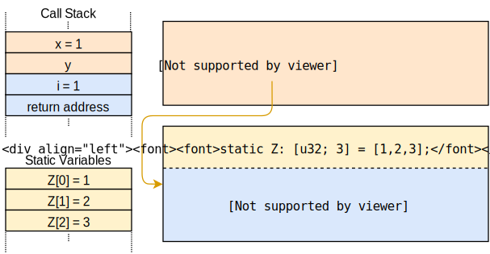

<h1>Heap Allocation(内存堆分配)</h1>

This post adds support for heap allocation to our kernel. First, it gives an introduction to dynamic memory and shows how the borrow checker prevents common allocation errors. It then implements the basic allocation interface of Rust, creates a heap memory region, and sets up an allocator crate. At the end of this post, all the allocation and collection types of the built-in `alloc` crate will be available to our kernel.

本文将为内核添加对堆分配的支持。首先介绍动态内存的基础知识，并展示Rust借用检查器如何防止常见的分配错误。然后将实现Rust的基础分配器接口，创建一个堆内存区域，并添加分配器crate。在本文末尾，Rust内置`alloc` crate中的所有分配和集合类型都将在内核中可用。

This blog is openly developed on GitHub. If you have any problems or questions, please open an issue there. You can also leave comments at the bottom. The complete source code for this post can be found in the post-10 branch.

这篇博客是在[GitHub](https://github.com/phil-opp/blog_os)上公开开发的。如果你有任何问题或疑问，请在那里开一个问题。你也可以在底部留下评论。
本帖的完整源代码可以在[post-10](https://github.com/phil-opp/blog_os/tree/post-10)分支中找到。

<h2>Local and Static Variables(局部变量和静态变量)</h2>

We currently use two types of variables in our kernel: local variables and static variables. Local variables are stored on the call stack and are only valid until the surrounding function returns. Static variables are stored at a fixed memory location and always live for the complete lifetime of the program.

目前在我们的内核中使用两种类型的变量：局部变量和静态变量。 局部变量存储在调用栈中，只在定义该变量的函数返回之前有效。 静态变量存储在内存的一个固定位置，在程序的整个生命周期内都是有效的。

<h3>Local Variables(局部变量)</h3>

Local variables are stored on the [call stack](https://en.wikipedia.org/wiki/Call_stack), which is a [stack data structure](https://en.wikipedia.org/wiki/Stack_(abstract_data_type)) that supports `push` and `pop` operations. On each function entry, the parameters, the return address, and the local variables of the called function are pushed by the compiler:

局部变量存储在[调用栈](https://en.wikipedia.org/wiki/Call_stack)上。 这是一个称为[栈的数据结构](https://en.wikipedia.org/wiki/Stack_(abstract_data_type))，支持`push`和`pop`指令。 每次进入一个函数时，被调用函数的参数、返回地址和局部变量都会被编译器入栈：


The above example shows the call stack after the `outer` function called the `inner` function. We see that the call stack contains the local variables of `outer` first. On the inner call, the parameter `1` and the return address for the function were pushed. Then control was transferred to `inner`, which pushed its local variables.

上面的例子显示了`outer`函数调用`inner`函数后的调用栈。 可以看到，调用堆栈中首先有 `outer` 的局部变量.当 `inner` 被调用时，参数 `1` 和这个函数的返回地址被入栈。 然后控制权转移到`inner`函数，并继续将其局部变量入栈。

After the `inner` function returns, its part of the call stack is popped again and only the local variables of `outer` remain:

`inner`函数返回后，其位于调用栈中的相关部分弹栈，此时调用栈只仅剩下`outer`函数相关的局部变量：


We see that the local variables of inner only live until the function returns. The Rust compiler enforces these lifetimes and throws an error when we use a value for too long, for example when we try to return a reference to a local variable:

我们看到`inner`的局部变量仅在函数返回之前有效。Rust编译器会强制执行这些生命周期，当我们持有变量时间过长时，比如尝试返回对局部变量的引用，编译器会抛出一个错误：

```rust
fn inner(i: usize) -> &'static u32 {
    let z = [1, 2, 3];
    &z[i]
}
```

[run the example on the playground](https://play.rust-lang.org/?version=stable&mode=debug&edition=2018&gist=6186a0f3a54f468e1de8894996d12819)

While returning a reference makes no sense in this example, there are cases where we want a variable to live longer than the function. We already saw such a case in our kernel when we tried to [load an interrupt descriptor table](https://os.phil-opp.com/cpu-exceptions/#loading-the-idt) and had to use a `static` variable to extend the lifetime.

虽然本例中返回引用并无意义，但在某些情况下，我们希望变量比其所在函数的生命周期更长。我们已经在编写内核的过程中遇到了这种情况，比如在尝试[加载中断描述符表](https://os.phil-opp.com/cpu-exceptions/#loading-the-idt)时就不得不使用`static`变量来延长其生命周期。

<h3>Static Variables(静态变量)</h3>

Static variables are stored at a fixed memory location separate from the stack. This memory location is assigned at compile time by the linker and encoded in the executable. Statics live for the complete runtime of the program, so they have the `'static` lifetime and can always be referenced from local variables:


静态变量存储在栈以外的固定内存位置中。此存储位置由链接器在编译时分配并编码在可执行文件中。静态变量在程序的完整运行时内始终有效，因此它们具有`'static'`生命周期，并且始终可以被局部变量引用：





When the `inner` function returns in the above example, its part of the call stack is destroyed. The static variables live in a separate memory range that is never destroyed, so the `&Z[1]` reference is still valid after the return.

上图中的`inner`函数返回时，其在调用栈中的相关部分被析构。而静态变量位于一个独立的内存范围中，并不会被析构，因此`&Z[1]`的引用在函数返回后仍然有效。

Apart from the `'static'` lifetime, static variables also have the useful property that their location is known at compile time, so that no reference is needed for accessing them. We utilized that property for our `println` macro: By using a [static Writer](https://os.phil-opp.com/vga-text-mode/#a-global-interface) internally, there is no `&mut Writer` reference needed to invoke the macro, which is very useful in [exception handlers](https://os.phil-opp.com/cpu-exceptions/#implementation), where we don’t have access to any additional variables.

除了`'static'`生命周期以外，静态变量还有另一个有用的属性，即其内存位置在编译时就已确定，因此不需要引用就能够对其进行访问。我们利用该属性实现了`println`宏：通过在内部使用[static Writer](https://os.phil-opp.com/vga-text-mode/#a-global-interface)，即便不使用`&mut Writer`引用也能够调用该宏。这在[异常处理程序](https://os.phil-opp.com/cpu-exceptions/#implementation)中非常有用，因为在其中我们无法访问任何其他变量。

However, this property of static variables brings a crucial drawback: they are read-only by default. Rust enforces this because a [data race](https://doc.rust-lang.org/nomicon/races.html) would occur if, e.g., two threads modified a static variable at the same time. The only way to modify a static variable is to encapsulate it in a [Mutex](https://docs.rs/spin/0.5.2/spin/struct.Mutex.html) type, which ensures that only a single `&mut` reference exists at any point in time. We already used a `Mutex` for our [static VGA buffer Writer](https://os.phil-opp.com/vga-text-mode/#spinlocks).


但是，静态变量的这个属性也带来了一个致命缺点：它们默认是只读的。Rust强制此规则是为了避免[数据竞争](https://doc.rust-lang.org/nomicon/races.html)，比如当两个线程同时修改一个静态变量时。修改静态变量的唯一方法是将其封装在[Mutex](https://docs.rs/spin/0.5.2/spin/struct.Mutex.html)类型中，从而确保在任何时刻中仅存在一个`&mut`引用。我们已经将`Mutex`用于[静态VGA缓冲区Writer](https://os.phil-opp.com/vga-text-mode/#spinlocks)。


<h2>Dynamic Memory(动态内存)</h2>

Local and static variables are already very powerful together and enable most use cases. However, we saw that they both have their limitations:

- Local variables only live until the end of the surrounding function or block. This is because they live on the call stack and are destroyed after the surrounding function returns.
- Static variables always live for the complete runtime of the program, so there is no way to reclaim and reuse their memory when they’re no longer needed. Also, they have unclear ownership semantics and are accessible from all functions, so they need to be protected by a `Mutex` when we want to modify them.


结合使用局部变量和静态变量已经能够实现非常强大的功能，足以应付大多数用例了。但是，它们仍然具有一定的局限性：

- 局部变量仅在其所在的函数或代码块结束前有效。这是因为它们存在于调用栈中，并在上下文函数返回后被销毁。
- 静态变量在程序的运行周期内始终有效，因此无法在不再需要它们时回收和重用它们的内存。此外，它们的所有权语义不明确，且能够被任意函数访问，所以我们才会在需要修改时使用`Mutex`对其进行保护。

Another limitation of local and static variables is that they have a fixed size. So they can’t store a collection that dynamically grows when more elements are added. (There are proposals for [unsized rvalues](https://github.com/rust-lang/rust/issues/48055) in Rust that would allow dynamically sized local variables, but they only work in some specific cases.)

局部变量和静态变量的另一个局限性，就是它们的大小固定，因此，遇到需要添加更多元素的情况时，它们将无法存储这些动态增长的集合。（Rust中有一些关于[unsized rvalues](https://github.com/rust-lang/rust/issues/48055)的提案，以允许局部变量具有动态大小，但它们仅在某些特定情况下有效。）

To circumvent these drawbacks, programming languages often support a third memory region for storing variables called the **heap**. The heap supports dynamic memory allocation at runtime through two functions called `allocate` and `deallocate`. It works in the following way: The `allocate` function returns a free chunk of memory of the specified size that can be used to store a variable. This variable then lives until it is freed by calling the `deallocate` function with a reference to the variable.

为了规避这些缺点，编程语言通常支持第三个用于存储变量的内存区域，称为**堆**。堆支持在运行时通过两个名为`allocate`和`deallocate`的函数进行动态内存分配。它以如下方式工作。allocate函数返回一个指定大小的自由内存块，可用于存储一个变量。然后，这个变量将一直存在，直到在其引用上调用`deallocate`函数将其释放为止。

Let’s go through an example:

让我们来看一个例子：


Here the `inner` function uses heap memory instead of static variables for storing `z`. It first allocates a memory block of the required size, which returns a `*mut u32`  [raw pointer](https://doc.rust-lang.org/book/ch19-01-unsafe-rust.html#dereferencing-a-raw-pointer). It then uses the [ptr::write](https://doc.rust-lang.org/core/ptr/fn.write.html) method to write the array `[1,2,3]` to it. In the last step, it uses the [offset](https://doc.rust-lang.org/std/primitive.pointer.html#method.offset) function to calculate a pointer to the i-th element and then returns it. (Note that we omitted some required casts and unsafe blocks in this example function for brevity.)

在这里，`inner`函数使用堆内存而不是静态变量来存储`z`。首先按照所需大小分配内存块，然后返回`*mut u32` [裸指针](https://doc.rust-lang.org/book/ch19-01-unsafe-rust.html#dereferencing-a-raw-pointer)。然后使用[ptr::write](https://doc.rust-lang.org/core/ptr/fn.write.html)方法写入数组`[1,2,3]`。最后使用[offset](https://doc.rust-lang.org/std/primitive.pointer.html#method.offset)函数计算指向第i个元素的指针，并将其返回。（请注意，为简洁起见，在此示例函数中，我们省略了一些必需的强制转换和unsafe块。）

The allocated memory lives until it is explicitly freed through a call to `deallocate`. Thus, the returned pointer is still valid even after `inner` returned and its part of the call stack was destroyed. The advantage of using heap memory compared to static memory is that the memory can be reused after it is freed, which we do through the `deallocate` call in `outer`. After that call, the situation looks like this:

分配的内存将会一直有效，直到通过调用`dealloc`显式释放为止。因此，即使在`inner`返回且其相关部分的调用栈被销毁之后，返回的指针依然有效。与静态内存相比，使用堆内存的优势在于内存可以在释放后重用，这是通过`oute`r的`deallocate`调用实现的。调用结束后的情形如下：


We see that the `z[1]` slot is free again and can be reused for the next `allocate` call. However, we also see that `z[0]` and `z[2]` are never freed because we never deallocate them. Such a bug is called a memory leak and is often the cause of excessive memory consumption of programs (just imagine what happens when we call `inner` repeatedly in a loop). This might seem bad, but there are much more dangerous types of bugs that can happen with dynamic allocation.

可以看到`z[1]`所在堆中的位置又空闲了，可以重新用于下一次`allocate`调用。但是，还可以看到`z[0]`和`z[2]`还未释放，因为我们从未释放过它们。这种错误称为内存泄漏，也通常是导致程序过度消耗内存的原因（试想一下，当我们在循环中重复调用`inner`时会发生什么）。这看起来很不好，然而动态分配可能会导致更多危险的错误。

<h3>Common Errors(常见错误)</h3>

Apart from memory leaks, which are unfortunate but don’t make the program vulnerable to attackers, there are two common types of bugs with more severe consequences:

- When we accidentally continue to use a variable after calling `deallocate` on it, we have a so-called **use-after-free** vulnerability. Such a bug causes undefined behavior and can often be exploited by attackers to execute arbitrary code.
- When we accidentally free a variable twice, we have a **double-free** vulnerability. This is problematic because it might free a different allocation that was allocated in the same spot after the first `deallocate` call. Thus, it can lead to a use-after-free vulnerability again.
  
内存泄漏虽然会导致过度消耗内存，但并不会使程序更容易受到攻击。除此之外，还有两种常见的错误类型，其后果更为严重：

- 当我们在调用`deallocate`后意外地继续使用变量时，便产生了一个称作**释放后使用**的漏洞。这种漏洞会导致未定义的行为，此外，攻击者也经常通过该漏洞来执行任意代码。
- 当我们不小心两次释放变量时，便产生了一个**双重释放**漏洞。这是有问题的，因为它这可能会释放第一次调用`deallocate`后在该位置重新分配的变量。因此，它可能再次导致释放后使用漏洞。


These types of vulnerabilities are commonly known, so one might expect that people have learned how to avoid them by now. But no, such vulnerabilities are still regularly found, for example this [use-after-free vulnerability in Linux](https://securityboulevard.com/2019/02/linux-use-after-free-vulnerability-found-in-linux-2-6-through-4-20-11/) (2019), that allowed arbitrary code execution. A web search like `use-after-free linux {current year}` will probably always yield results. This shows that even the best programmers are not always able to correctly handle dynamic memory in complex projects.

这些种类的漏洞是很常见的，看起来可以期望人们现在已经学会了如何规避它们。现实很遗憾，这些漏洞仍然经常出现，例如[Linux（2019年）的这个use-after-free漏洞](https://securityboulevard.com/2019/02/linux-use-after-free-vulnerability-found-in-linux-2-6-through-4-20-11/),它允许执行任意代码。这也表明即使是最优秀的程序员也不一定总是能够正确处理复杂项目中的动态内存。

To avoid these issues, many languages, such as Java or Python, manage dynamic memory automatically using a technique called [garbage collection](https://en.wikipedia.org/wiki/Garbage_collection_(computer_science)). The idea is that the programmer never invokes `deallocate` manually. Instead, the program is regularly paused and scanned for unused heap variables, which are then automatically deallocated. Thus, the above vulnerabilities can never occur. The drawbacks are the performance overhead of the regular scan and the probably long pause times.

为了规避这些漏洞，许多语言——例如Java或Python——都使用称为[垃圾回收](https://en.wikipedia.org/wiki/Garbage_collection_(computer_science))的技术自动管理动态内存。其意图是使程序员不再需要手动调用`deallocate`，转而使程序定期暂停并扫描未使用的堆变量，然后将它们自动释放。于是，上述漏洞也就不会再出现了。不过，其缺点是常规扫描有一定的性能开销，以及暂停的时间可能会较长。

Rust takes a different approach to the problem: It uses a concept called [ownership](https://doc.rust-lang.org/book/ch04-01-what-is-ownership.html) that is able to check the correctness of dynamic memory operations at compile time. Thus, no garbage collection is needed to avoid the mentioned vulnerabilities, which means that there is no performance overhead. Another advantage of this approach is that the programmer still has fine-grained control over the use of dynamic memory, just like with C or C++.

针对此问题Rust采用了不同的解决方案：它使用一种称为[所有权](https://doc.rust-lang.org/book/ch04-01-what-is-ownership.html)的概念，能够在编译时检查动态内存操作的正确性。因此，Rust不需要垃圾收集也能避免上述漏洞，这意味着没有性能开销。该方案的另一个优点是，程序员仍然可以像使用C或C++一样对动态内存进行细粒度的控制。


<h3>Allocations in Rust(Rust中的堆分配)</h3>

Instead of letting the programmer manually call `allocate` and `deallocate`, the Rust standard library provides abstraction types that call these functions implicitly. The most important type is [Box](https://doc.rust-lang.org/std/boxed/index.html), which is an abstraction for a heap-allocated value. It provides a [Box::new](https://doc.rust-lang.org/alloc/boxed/struct.Box.html#method.new) constructor function that takes a value, calls `allocate` with the size of the value, and then moves the value to the newly allocated slot on the heap. To free the heap memory again, the `Box` type implements the [Drop trait](https://doc.rust-lang.org/book/ch15-03-drop.html) to call `deallocate` when it goes out of scope:


Rust标准库提供了隐式调用`allocate`和`deallocate`的抽象类型，省去程序员显示调用这些函数的麻烦。其中最重要的类型是[Box](https://doc.rust-lang.org/std/boxed/index.html)，它是堆分配值的抽象。该类提供了构造函数[Box::new](https://doc.rust-lang.org/alloc/boxed/struct.Box.html#method.new)，构造函数接受一个值并使用该值的大小调用`allocate`，再将该值移动到堆上新分配的空间中。为了能够释放堆内存，Box类型实现了[Drop trait](https://doc.rust-lang.org/book/ch15-03-drop.html)，以在变量离开作用域时调用`deallocate`：

```rust
{
    let z = Box::new([1,2,3]);
    […]
} // z goes out of scope and `deallocate` is called
```

This pattern has the strange name [resource acquisition is initialization](https://en.wikipedia.org/wiki/Resource_acquisition_is_initialization) (or RAII for short). It originated in C++, where it is used to implement a similar abstraction type called [std::unique_ptr](https://en.cppreference.com/w/cpp/memory/unique_ptr).

这个模式有一个奇怪的名字——[资源获取即初始化](https://en.wikipedia.org/wiki/Resource_acquisition_is_initialization)（或简称RAII）。它起源于C++，用于实现类似的抽象类型[std::unique_ptr](https://en.cppreference.com/w/cpp/memory/unique_ptr)。


Such a type alone does not suffice to prevent all use-after-free bugs since programmers can still hold on to references after the `Box` goes out of scope and the corresponding heap memory slot is deallocated:

单靠这种类型不足以防止所有的释放后使用漏洞，因为在`Box`离开作用域并释放相应的堆内存空间之后，程序员仍然可以保留对其的引用：


```rust
let x = {
    let z = Box::new([1,2,3]);
    &z[1]
}; // z goes out of scope and `deallocate` is called
println!("{}", x);

```

This is where Rust’s ownership comes in. It assigns an abstract lifetime to each reference, which is the scope in which the reference is valid. In the above example, the x reference is taken from the `z` array, so it becomes invalid after `z` goes out of scope. When you [run the above example on the playground](https://play.rust-lang.org/?version=stable&mode=debug&edition=2018&gist=28180d8de7b62c6b4a681a7b1f745a48) you see that the Rust compiler indeed throws an error:


而这便是Rust所有权机制作用的时候。所有权会为每个引用分配一个抽象的生命周期，就是该引用的有效的范围。在上例中，x引用来自于`z`数组，因此在`z`离开作用域后将变得无效。[在线运行上例](https://play.rust-lang.org/?version=stable&mode=debug&edition=2018&gist=28180d8de7b62c6b4a681a7b1f745a48)时，您将看到Rust编译器的确出现了编译错误：

```rust
error[E0597]: `z[_]` does not live long enough
 --> src/main.rs:4:9
  |
2 |     let x = {
  |         - borrow later stored here
3 |         let z = Box::new([1,2,3]);
4 |         &z[1]
  |         ^^^^^ borrowed value does not live long enough
5 |     }; // z goes out of scope and `deallocate` is called
  |     - `z[_]` dropped here while still borrowed

```

The terminology can be a bit confusing at first. Taking a reference to a value is called borrowing the value since it’s similar to a borrow in real life: You have temporary access to an object but need to return it sometime, and you must not destroy it. By checking that all borrows end before an object is destroyed, the Rust compiler can guarantee that no use-after-free situation can occur.


(所有权机制这个术语?)一开始可能有点令人困惑。对一个值的引用被称为借用，因为它类似于现实生活中的借用。你可以临时访问一个对象，但需要在某个时候归还它，而且你不能破坏它。通过检查所有的借用是否在对象被销毁前结束，Rust编译器可以保证不会出现 "释放后使用 "的情况。


Rust’s ownership system goes even further, preventing not only use-after-free bugs but also providing complete [memory safety](https://en.wikipedia.org/wiki/Memory_safety), as garbage collected languages like Java or Python do. Additionally, it guarantees [thread safety](https://en.wikipedia.org/wiki/Thread_safety) and is thus even safer than those languages in multi-threaded code. And most importantly, all these checks happen at compile time, so there is no runtime overhead compared to hand-written memory management in C.

Rust的所有权系统走得更远，不仅可以防止释放后使用后的错误，还可以提供完整的的[内存安全](https://en.wikipedia.org/wiki/Memory_safety)保证，就像Java或Python等含有垃圾收集机制的语言那样。此外，它还保证了线程安全，因此在多线程代码中甚至比这些语言更安全。最重要的是，所有这些检查都是在编译时进行的，因此与C语言的手写内存管理相比，没有任何运行时的开销。

<h3>Use Cases(使用示例)</h3>

We now know the basics of dynamic memory allocation in Rust, but when should we use it? We’ve come really far with our kernel without dynamic memory allocation, so why do we need it now?

我们现在知道了Rust中动态内存分配的基本知识，但是我们应该在什么时候使用它呢？在没有动态内存分配的情况下，我们的内核已经走得很远了，为什么我们现在还需要它呢？

First, dynamic memory allocation always comes with a bit of performance overhead since we need to find a free slot on the heap for every allocation. For this reason, local variables are generally preferable, especially in performance-sensitive kernel code. However, there are cases where dynamic memory allocation is the best choice.


首先，动态内存分配总是伴随着一些性能上的开销，因为我们需要为每次分配在堆上找到一个空闲的位置。由于这个原因，局部变量通常是比较好的，特别是在对性能敏感的内核代码中。然而，在有些情况下，动态内存分配是最好的选择。


As a basic rule, dynamic memory is required for variables that have a dynamic lifetime or a variable size. The most important type with a dynamic lifetime is [Rc](https://doc.rust-lang.org/alloc/rc/index.html), which counts the references to its wrapped value and deallocates it after all references have gone out of scope. Examples for types with a variable size are [Vec](https://doc.rust-lang.org/alloc/vec/index.html), [String](https://doc.rust-lang.org/alloc/string/index.html), and other [collection types](https://doc.rust-lang.org/alloc/collections/index.html) that dynamically grow when more elements are added. These types work by allocating a larger amount of memory when they become full, copying all elements over, and then deallocating the old allocation.

作为一条基本规则，动态内存需要用于具有动态生命周期或可变大小的变量。最重要的具有动态生命周期的类型是[Rc](https://doc.rust-lang.org/alloc/rc/index.html)，它计算对其封装值的引用，并在所有的引用都超出使用范围后将其释放。具有可变大小的类型的例子是[Vec](https://doc.rust-lang.org/alloc/vec/index.html)、[String](https://doc.rust-lang.org/alloc/string/index.html)和其他[集合类型](https://doc.rust-lang.org/alloc/collections/index.html)，它们在添加更多元素时动态增长。这些类型的工作原理是，当它们变满时，分配更大的内存，将所有的元素复制过来，然后将旧的分配空间删除。

For our kernel, we will mostly need the collection types, for example, to store a list of active tasks when implementing multitasking in future posts.

在内核中，我们非常需要集合类型，比如后文中在实现多任务处理时，用于存储活动任务的列表。

<h2>The Allocator Interface(分配器接口)</h2>


The first step in implementing a heap allocator is to add a dependency on the built-in [alloc](https://doc.rust-lang.org/alloc/) crate. Like the [core](https://doc.rust-lang.org/core/) crate, it is a subset of the standard library that additionally contains the allocation and collection types. To add the dependency on `alloc`, we add the following to our `lib.rs`:

实现堆分配器的第一步是添加对内置[alloc](https://doc.rust-lang.org/alloc/) crate的依赖。像[core](https://doc.rust-lang.org/core/) crate一样，它也是标准库的子集，同时它还包含分配器和集合类型。要添加对`alloc`的依赖需要将以下内容添加到`lib.rs`中：


```rust
// in src/lib.rs

extern crate alloc;
```


Contrary to normal dependencies, we don’t need to modify the `Cargo.toml`. The reason is that the `alloc` crate ships with the Rust compiler as part of the standard library, so the compiler already knows about the crate. By adding this `extern crate` statement, we specify that the compiler should try to include it. (Historically, all dependencies needed an `extern crate` statement, which is now optional).

与添加普通依赖不同，我们并不需要修改`Cargo.toml`。原因是`alloc` crate与Rust编译器一起作为标准库的一部分供我们使用，因此编译器已经知道了该crate。通过添加此`extern crate`语句，我们指定编译器去尝试包含该`crate`。（在以前的Rust中，所有依赖项都需要一个`extern crate`语句，不过现在该语句是可选的）。

Since we are compiling for a custom target, we can’t use the precompiled version of alloc that is shipped with the Rust installation. Instead, we have to tell cargo to recompile the crate from source. We can do that by adding it to the `unstable.build-std` array in our `.cargo/config.toml` file:

由于我们正在为自定义目标系统进行编译，因此无法使用随Rust一起安装的alloc预编译版本。此处，我们必须告诉cargo用源码重新编译该crate。这可以通过将该crate添加到`.cargo/config.toml`文件中的`unstable.build-std`数组中来实现：

```rust
# in .cargo/config.toml

[unstable]
build-std = ["core", "compiler_builtins", "alloc"]
```


Now the compiler will recompile and include the `alloc` crate in our kernel.

现在，编译器将重新编译`alloc`并其包括在内核中。

The reason that the `alloc` crate is disabled by default in `#[no_std]` crates is that it has additional requirements. When we try to compile our project now, we will see these requirements as errors:

默认在`#[no_std]`的crate中禁用`alloc` crate的原因是它还有其他要求。现在尝试编译项目时，我们可以看到这些要求引发的编译错误：

```
error: no global memory allocator found but one is required; link to std or add
       #[global_allocator] to a static item that implements the GlobalAlloc trait.

error: `#[alloc_error_handler]` function required, but not found
```

The first error occurs because the `alloc` crate requires a heap allocator, which is an object that provides the `allocate` and `deallocate` functions. In Rust, heap allocators are described by the [GlobalAlloc](https://doc.rust-lang.org/alloc/alloc/trait.GlobalAlloc.html) trait, which is mentioned in the error message. To set the heap allocator for the crate, the `#[global_allocator]` attribute must be applied to a static variable that implements the `GlobalAlloc` trait.

第一个错误的发生是因为`alloc` crate需要一个堆分配器，这是一个提供`allocate`和`deallocate`函数的对象。在Rust中，堆分配器由[GlobalAlloc](https://doc.rust-lang.org/alloc/alloc/trait.GlobalAlloc.html) trait描述，错误信息中提到了这个trait。我们可以通过将`#[global_allocator]`属性附在实现了`GlobalAlloc` trait的静态变量上来为`alloc` crate设置堆分配器。


The second error occurs because calls to `allocate` can fail, most commonly when there is no more memory available. Our program must be able to react to this case, which is what the `#[alloc_error_handler]` function is for.

第二个错误是因为调用`allocate`是有可能失败的，通常是因为没有更多可用的内存了。我们的程序必须能对此做出反应，这就是`#[alloc_error_handler]`方法得作用了。

We will describe these traits and attributes in detail in the following sections.

在下文的各小节中，我们将详细描述这些特征和属性。

### The **GlobalAlloc** Trait


The `GlobalAlloc` trait defines the functions that a heap allocator must provide. The trait is special because it is almost never used directly by the programmer. Instead, the compiler will automatically insert the appropriate calls to the trait methods when using the allocation and collection types of alloc.

`GlobalAlloctrait`定义了堆分配器必须提供的函数。该trait非常特殊，通常程序员不会直接使用它。当程序员使用alloc中的分配器和集合类型时，编译器将自动将调用适当的trait函数。

Since we will need to implement the trait for all our allocator types, it is worth taking a closer look at its declaration:

由于我们将需要为所有分配器类型实现该trait，因此有必要仔细研究其声明：

```rust
pub unsafe trait GlobalAlloc {
    unsafe fn alloc(&self, layout: Layout) -> *mut u8;
    unsafe fn dealloc(&self, ptr: *mut u8, layout: Layout);

    unsafe fn alloc_zeroed(&self, layout: Layout) -> *mut u8 { ... }
    unsafe fn realloc(
        &self,
        ptr: *mut u8,
        layout: Layout,
        new_size: usize
    ) -> *mut u8 { ... }
}
```

It defines the two required methods [alloc](https://doc.rust-lang.org/alloc/) and [dealloc](https://doc.rust-lang.org/alloc/alloc/trait.GlobalAlloc.html#tymethod.dealloc), which correspond to the `allocate` and `deallocate` functions we used in our examples:

- The `alloc` method takes a [Layout](https://doc.rust-lang.org/alloc/alloc/struct.Layout.html) instance as an argument, which describes the desired size and alignment that the allocated memory should have. It returns a [raw pointer](https://doc.rust-lang.org/book/ch19-01-unsafe-rust.html#dereferencing-a-raw-pointer) to the first byte of the allocated memory block. Instead of an explicit error value, the `alloc` method returns a null pointer to signal an allocation error. This is a bit non-idiomatic, but it has the advantage that wrapping existing system allocators is easy since they use the same convention.
- The `dealloc` method is the counterpart and is responsible for freeing a memory block again. It receives two arguments: the pointer returned by `alloc` and the `Layout` that was used for the allocation.

该trait定义了两个必须实现的方法[alloc](https://doc.rust-lang.org/alloc/)与[dealloc](https://doc.rust-lang.org/alloc/alloc/trait.GlobalAlloc.html#tymethod.dealloc)，并与我们在示例中使用的`allocate`和`deallocate`函数相对应：

- `alloc`方法将[Layout](https://doc.rust-lang.org/alloc/alloc/struct.Layout.html)实例作为参数，该实例描述了所分配的内存应具有的大小和对齐方式。该方法返回一个[裸指针](https://doc.rust-lang.org/book/ch19-01-unsafe-rust.html#dereferencing-a-raw-pointer)，并指向所分配内存块的第一个字节。当发生分配错误时，`alloc`方法返回一个空指针，而不是显式的错误值。虽然这有点不符合Rust的使用习惯，不过由于现有系统也使用相同的约定，所以其优点是可以很容易的封装现有的系统的分配器。
- `dealloc`方法是对应的，负责再次释放一个内存块。它接收两个参数：`alloc`返回的指针和分配时使用的`Layout`。

The trait additionally defines the two methods [alloc_zeroed](https://doc.rust-lang.org/alloc/alloc/trait.GlobalAlloc.html#method.alloc_zeroed) and [realloc](https://doc.rust-lang.org/alloc/alloc/trait.GlobalAlloc.html#method.realloc) with default implementations:

- The `alloc_zeroed` method is equivalent to calling `alloc` and then setting the allocated memory block to zero, which is exactly what the provided default implementation does. An allocator implementation can override the default implementations with a more efficient custom implementation if possible.
- The `realloc` method allows to grow or shrink an allocation. The default implementation allocates a new memory block with the desired size and copies over all the content from the previous allocation. Again, an allocator implementation can probably provide a more efficient implementation of this method, for example by growing/shrinking the allocation in-place if possible.

该trait还使额外定义了两个带有默认实现的方法[alloc_zeroed](https://doc.rust-lang.org/alloc/alloc/trait.GlobalAlloc.html#method.alloc_zeroed)和[realloc](https://doc.rust-lang.org/alloc/alloc/trait.GlobalAlloc.html#method.realloc)：

- `alloc_zeroed`方法等效于先调用`alloc`再将分配的内存块全部置为零，正如其默认实现中所做的那样。如果自定义实现比默认实现更高效的话，也可以使用它来覆盖默认实现。
- `realloc`方法允许增加或减少分配空间。默认实现会分配一个所需大小的新内存块，并会将先前分配中的所有内容复制进来。与上一个方法相同，自定义的分配器实现也可能会提供此一个更高效的实现，比如实现就地扩展/缩小原分配。

##### Unsafety(非安全特性)
One thing to notice is that both the trait itself and all trait methods are declared as `unsafe`:

- The reason for declaring the trait as `unsafe` is that the programmer must guarantee that the trait implementation for an allocator type is correct. For example, the `alloc` method must never return a memory block that is already used somewhere else because this would cause undefined behavior.
- Similarly, the reason that the methods are `unsafe` is that the caller must ensure various invariants when calling the methods, for example, that the `Layout` passed to `alloc` specifies a non-zero size. This is not really relevant in practice since the methods are normally called directly by the compiler, which ensures that the requirements are met.

需要注意的是，trait本身的所有方法都被声明为unsafe：

- 将该trait声明为`unsafe`的原因是，程序员必须保证分配器类型的trait实现是正确的。例如，`alloc`方法绝不能返回已在其他地方使用的内存块，因为这将导致未定义的行为。
- 同样，其方法均为`unsafe`的原因是，调用者在调用方法时必须确保各种不变性，例如，传递给`alloc`的`Layout`实例指定的大小应是非零的。不过在实践中这并不重要，因为方法通常是由编译器直接调用的，可以确保满足要求。

### A **DummyAllocator**

Now that we know what an allocator type should provide, we can create a simple dummy allocator. For that, we create a new `allocator` module:

既然已经知道了要为分配器类型提供什么，我们就可以实现一个简单的假分配器。首先创建一个新的分配器模块：

```rust
// in src/lib.rs

pub mod allocator;
```

Our dummy allocator does the absolute minimum to implement the trait and always returns an error when `alloc` is called. It looks like this:

我们的假分配器将实现特征的最低要求，即在调用alloc时始终返回错误。看起来像这样：

```rust
// in src/allocator.rs

use alloc::alloc::{GlobalAlloc, Layout};
use core::ptr::null_mut;

pub struct Dummy;

unsafe impl GlobalAlloc for Dummy {
    unsafe fn alloc(&self, _layout: Layout) -> *mut u8 {
        null_mut()
    }

    unsafe fn dealloc(&self, _ptr: *mut u8, _layout: Layout) {
        panic!("dealloc should be never called")
    }
}
```

The struct does not need any fields, so we create it as a [zero-sized type](https://doc.rust-lang.org/nomicon/exotic-sizes.html#zero-sized-types-zsts). As mentioned above, we always return the null pointer from `alloc`, which corresponds to an allocation error. Since the allocator never returns any memory, a call to dealloc should never occur. For this reason, we simply panic in the dealloc method. The `alloc_zeroed` and `realloc` methods have default implementations, so we don’t need to provide implementations for them.

该结构体不需要任何字段，于是我们将其创建为[零大小类型](https://doc.rust-lang.org/nomicon/exotic-sizes.html#zero-sized-types-zsts)。就像描述的那样，我们总是用`alloc`返回空指针，对应分配错误。由于分配器从不返回任何内存，所以永远不应该调用`dealloc`。因此，我们仅在`dealloc`中panic即可。`alloc_zeroed`和`realloc`方法具有默认实现，因此无需为其提供实现。

We now have a simple allocator, but we still have to tell the Rust compiler that it should use this allocator. This is where the `#[global_allocator]` attribute comes in.

这就实现了一个简单的分配器，但是我们仍然需要告诉Rust编译器它应该使用这个分配器。这就需要用到`#[global_allocator]`属性了。

### The `#[global_allocator]` Attribute(`#[global_allocator]`属性)

The `#[global_allocator]` attribute tells the Rust compiler which allocator instance it should use as the global heap allocator. The attribute is only applicable to a `static` that implements the `GlobalAlloc` trait. Let’s register an instance of our `Dummy `allocator as the global allocator:

`#[global_allocator]`属性告诉Rust编译器应该使用哪个分配器实例作为全局堆分配器。该属性仅适用于实现了`GlobalAlloc`特性的`static`对象。让我们将分配器`Dummy`的一个实例注册为全局分配器：

```rust
// in src/allocator.rs

#[global_allocator]
static ALLOCATOR: Dummy = Dummy;
```

Since the `Dummy` allocator is a `zero-sized type`, we don’t need to specify any fields in the initialization expression.

由于`Dummy`分配器是零大小类型，因此我们不需要在初始化表达式中指定任何字段。

When we now try to compile it, the first error should be gone. Let’s fix the remaining second error:

现在尝试编译，第一个错误消失了。让我们继续修复第二个错误：


```
error: `#[alloc_error_handler]` function required, but not found
```

### The `#[alloc_error_handler]` Attribute(`#[alloc_error_handler]`属性)


As we learned when discussing the `GlobalAlloc` trait, the `alloc` function can signal an allocation error by returning a null pointer. The question is: how should the Rust runtime react to such an allocation failure? This is where the `#[alloc_error_handler]` attribute comes in. It specifies a function that is called when an allocation error occurs, similar to how our panic handler is called when a panic occurs.

正如我们在讨论`GlobalAlloc`trait时所了解的那样，`alloc`函数可以通过返回空指针来表示分配错误。那么问题是Rust运行时应如何应对这种分配失败呢？这就是`#[alloc_error_handler]`属性起作用的地方了。该属性将指定发生分配错误时调用的处理函数，类似于在发生panic时调用panic处理程序。

Let’s add such a function to fix the compilation error:

我们来添加一个这样的函数以修复该编译错误：

```rust
// in src/lib.rs

#![feature(alloc_error_handler)] // at the top of the file

#[alloc_error_handler]
fn alloc_error_handler(layout: alloc::alloc::Layout) -> ! {
    panic!("allocation error: {:?}", layout)
}

```

The `alloc_error_handler` function is still unstable, so we need a feature gate to enable it. The function receives a single argument: the `Layout` instance that was passed to `alloc` when the allocation failure occurred. There’s nothing we can do to resolve the failure, so we just panic with a message that contains the `Layout` instance.

`alloc_error_handler`函数仍然不稳定，因此我们需要一个特性门来启用它。该函数接收一个参数，即发生分配错误时传递给`alloc`的`Layout`实例。我们无法纠正该错误，因此仅在处理函数中进行`panic`并打印关于`Layout`实例的信息

With this function, the compilation errors should be fixed. Now we can use the allocation and collection types of `alloc`. For example, we can use a [Box](https://doc.rust-lang.org/alloc/boxed/struct.Box.html) to allocate a value on the heap:

应用该函数就可以修复编译错误。现在我们可以使用`alloc`的分配器和集合类型了，例如，我们可以使用[Box](https://doc.rust-lang.org/alloc/boxed/struct.Box.html)在堆上分配一个值：

```rust
// in src/main.rs

extern crate alloc;

use alloc::boxed::Box;

fn kernel_main(boot_info: &'static BootInfo) -> ! {
    // […] print "Hello World!", call `init`, create `mapper` and `frame_allocator`

    let x = Box::new(41);

    // […] call `test_main` in test mode

    println!("It did not crash!");
    blog_os::hlt_loop();
}

```


Note that we need to specify the `extern crate alloc` statement in our `main.rs` too. This is required because the `lib.rs` and `main.rs` parts are treated as separate crates. However, we don’t need to create another `#[global_allocator]` static because the global allocator applies to all crates in the project. In fact, specifying an additional allocator in another crate would be an error.

注意，我们也需要在`main.rs`中指定`extern crate alloc`语句。这是必需的，因为`lib.rs`和`main.rs`部分被视为各自独立的crate。但是，我们不需要创建另一个`#[global_allocator]`静态变量，因为全局分配器适用于项目中的所有crate。实际上，在另一个crate中指定其他分配器将引发错误。

When we run the above code, we see that our `alloc_error_handler` function is called:

运行上面的代码，我们将看到`alloc_error_handler`函数被调用：


The error handler is called because the `Box::new` function implicitly calls the `alloc` function of the global allocator. Our dummy allocator always returns a null pointer, so every allocation fails. To fix this, we need to create an allocator that actually returns usable memory.

错误处理程序被调用是因为`Box::new`函数隐式调用了全局分配器的`alloc`函数。因为假分配器始终返回空指针，所以每次分配都将会失败。为了解决这个问题，我们需要创建一个真分配器，用以返回可以使用的内存。

## Creating a Kernel Heap(创建内核堆)

Before we can create a proper allocator, we first need to create a heap memory region from which the allocator can allocate memory. To do this, we need to define a virtual memory range for the heap region and then map this region to physical frames. See the [“Introduction To Paging”](https://os.phil-opp.com/paging-introduction/) post for an overview of virtual memory and page tables.

在创建适当的分配器之前，我们首先需要创建一个堆内存区域，使得分配器可以从该区域分配内存。为此，我们需要为堆区域定义一个虚拟内存范围，然后将该区域映射到物理帧上。有关虚拟内存和页表的介绍，请参见["内存分页介绍"](https://os.phil-opp.com/paging-introduction/)一文。

The first step is to define a virtual memory region for the heap. We can choose any virtual address range that we like, as long as it is not already used for a different memory region. Let’s define it as the memory starting at address `0x_4444_4444_0000` so that we can easily recognize a heap pointer later:

第一步是为堆定义虚拟内存区域。我们可以选择我们喜欢的任何虚拟地址范围，只要它尚未用于其他内存区域即可。让我们将其定义为从地址`0x_4444_4444_0000`开始的内存，以便未来可以轻松识别堆指针：

```rust
// in src/allocator.rs

pub const HEAP_START: usize = 0x_4444_4444_0000;
pub const HEAP_SIZE: usize = 100 * 1024; // 100 KiB

```

We set the heap size to 100 KiB for now. If we need more space in the future, we can simply increase it.

目前将堆大小设置为100 KiB。如果将来我们需要更多空间，将该值改大即可。

If we tried to use this heap region now, a page fault would occur since the virtual memory region is not mapped to physical memory yet. To resolve this, we create an `init_heap` function that maps the heap pages using the [Mapper API](https://os.phil-opp.com/paging-implementation/#using-offsetpagetable) that we introduced in the [“Paging Implementation”](https://os.phil-opp.com/paging-implementation/) post:

如果我们现在尝试使用此堆区域，就会发生页面错误，因为虚拟内存区域尚未映射到物理内存。为了解决这个问题，我们创建`init_heap`函数并使用在[“内存分页实现”](https://os.phil-opp.com/paging-implementation/)一文中介绍的[Mapper API](https://os.phil-opp.com/paging-implementation/#using-offsetpagetable)映射堆页面：

```rust
// in src/allocator.rs

use x86_64::{
    structures::paging::{
        mapper::MapToError, FrameAllocator, Mapper, Page, PageTableFlags, Size4KiB,
    },
    VirtAddr,
};

pub fn init_heap(
    mapper: &mut impl Mapper<Size4KiB>,
    frame_allocator: &mut impl FrameAllocator<Size4KiB>,
) -> Result<(), MapToError<Size4KiB>> {
    let page_range = {
        let heap_start = VirtAddr::new(HEAP_START as u64);
        let heap_end = heap_start + HEAP_SIZE - 1u64;
        let heap_start_page = Page::containing_address(heap_start);
        let heap_end_page = Page::containing_address(heap_end);
        Page::range_inclusive(heap_start_page, heap_end_page)
    };

    for page in page_range {
        let frame = frame_allocator
            .allocate_frame()
            .ok_or(MapToError::FrameAllocationFailed)?;
        let flags = PageTableFlags::PRESENT | PageTableFlags::WRITABLE;
        unsafe {
            mapper.map_to(page, frame, flags, frame_allocator)?.flush()
        };
    }

    Ok(())
}

```

The function takes mutable references to a [Mapper](https://docs.rs/x86_64/0.14.2/x86_64/structures/paging/mapper/trait.Mapper.html) and a [FrameAllocator](https://docs.rs/x86_64/0.14.2/x86_64/structures/paging/trait.FrameAllocator.html) instance, both limited to 4 KiB pages by using `Size4KiB` as the generic parameter. The return value of the function is a `Result` with the unit type `()` as the success variant and a [MapToError](https://docs.rs/x86_64/0.14.2/x86_64/structures/paging/mapper/enum.MapToError.html) as the error variant, which is the error type returned by the [Mapper::map_to](https://docs.rs/x86_64/0.14.2/x86_64/structures/paging/mapper/trait.Mapper.html#method.map_to) method. Reusing the error type makes sense here because the `map_to` method is the main source of errors in this function.

该函数接受[Mapper](https://docs.rs/x86_64/0.14.2/x86_64/structures/paging/mapper/trait.Mapper.html)和[FrameAllocator](https://docs.rs/x86_64/0.14.2/x86_64/structures/paging/trait.FrameAllocator.html)实例的可变引用作为参数，这两个实例均使用`Size4KiB`作为泛型参数指定页面大小为4KiB。该函数的返回值为`Result`，以单位类型`()`作为成功结果，以[MapToError](https://docs.rs/x86_64/0.14.2/x86_64/structures/paging/mapper/enum.MapToError.html)作为失败结果，该失败结果是由[Mapper::map_to](https://docs.rs/x86_64/0.14.2/x86_64/structures/paging/mapper/trait.Mapper.html#method.map_to)方法返回的错误类型。之所以在此处复用了该错误类型是因为`map_to`方法是此函数中错误的主要来源。

The implementation can be broken down into two parts:

- **Creating the page range**: To create a range of the pages that we want to map, we convert the `HEAP_START` pointer to a [VirtAddr](https://docs.rs/x86_64/0.14.2/x86_64/addr/struct.VirtAddr.html) type. Then we calculate the heap end address from it by adding the `HEAP_SIZE`. We want an inclusive bound (the address of the last byte of the heap), so we subtract 1. Next, we convert the addresses into [Page](https://docs.rs/x86_64/0.14.2/x86_64/structures/paging/page/struct.Page.html) types using the [containing_address](https://docs.rs/x86_64/0.14.2/x86_64/structures/paging/page/struct.Page.html#method.containing_address) function. Finally, we create a page range from the start and end pages using the [Page::range_inclusive](https://docs.rs/x86_64/0.14.2/x86_64/structures/paging/page/struct.Page.html#method.range_inclusive) function.

- **Mapping the pages:**: The second step is to map all pages of the page range we just created. For that, we iterate over these pages using a `for` loop. For each page, we do the following:

    - We allocate a physical frame that the page should be mapped to using the [FrameAllocator::allocate_frame](https://docs.rs/x86_64/0.14.2/x86_64/structures/paging/trait.FrameAllocator.html#tymethod.allocate_frame) method. This method returns `None` when there are no more frames left. We deal with that case by mapping it to a [MapToError::FrameAllocationFailed](https://docs.rs/x86_64/0.14.2/x86_64/structures/paging/mapper/enum.MapToError.html#variant.FrameAllocationFailed) error through the [Option::ok_or](https://doc.rust-lang.org/core/option/enum.Option.html#method.ok_or) method and then applying the [question mark operator](https://doc.rust-lang.org/edition-guide/rust-2018/error-handling-and-panics/the-question-mark-operator-for-easier-error-handling.html) to return early in the case of an error.

    - We set the required `PRESENT` flag and the `WRITABLE` flag for the page. With these flags, both read and write accesses are allowed, which makes sense for heap memory.

    - We use the [Mapper::map_to](https://docs.rs/x86_64/0.14.2/x86_64/structures/paging/mapper/trait.Mapper.html#method.map_to) method for creating the mapping in the active page table. The method can fail, so we use the `question mark operator` again to forward the error to the caller. On success, the method returns a [MapperFlush](https://docs.rs/x86_64/0.14.2/x86_64/structures/paging/mapper/struct.MapperFlush.html) instance that we can use to update the [translation lookaside buffer](https://os.phil-opp.com/paging-introduction/#the-translation-lookaside-buffer) using the [flush](https://docs.rs/x86_64/0.14.2/x86_64/structures/paging/mapper/struct.MapperFlush.html#method.flush) method.


实现可以分为两部分：

- **创建页面范围**：首先需要将`HEAP_START`指针转换为[VirtAddr](https://docs.rs/x86_64/0.14.2/x86_64/addr/struct.VirtAddr.html)类型。然后用起始地址加上`HEAP_SIZE`计算出堆结束地址。我们想要一个闭区间（堆的最后一个字节的地址），故而减1。接下来使用[containing_address](https://docs.rs/x86_64/0.14.2/x86_64/structures/paging/page/struct.Page.html#method.containing_address)函数将这些地址转换为[Page](https://docs.rs/x86_64/0.14.2/x86_64/structures/paging/page/struct.Page.html)类型。最后使用[Page::range_inclusive](https://docs.rs/x86_64/0.14.2/x86_64/structures/paging/page/struct.Page.html#method.range_inclusive)函数创建从起始页面到结束页面的页面范围。
- **映射页面**：第二步是映射刚刚创建的页面范围内的所有页面。为此，我们使用`for`循环遍历该范围内的页面。我们为每个页面执行以下操作：
    - 使用[FrameAllocator::allocate_frame](https://docs.rs/x86_64/0.14.2/x86_64/structures/paging/trait.FrameAllocator.html#tymethod.allocate_frame)方法分配页面映射需要的物理帧上。当没有额外的帧时，该方法将返回`None`。遇到没有额外帧的情况时，我们使用[Option::ok_or](https://doc.rust-lang.org/core/option/enum.Option.html#method.ok_or)方法将错误转换为[MapToError::FrameAllocationFailed](https://docs.rs/x86_64/0.14.2/x86_64/structures/paging/mapper/enum.MapToError.html#variant.FrameAllocationFailed)错误，然后用[问号运算符](https://doc.rust-lang.org/edition-guide/rust-2018/error-handling-and-panics/the-question-mark-operator-for-easier-error-handling.html)以在出错时提前返回。
    - 为页面设置了必要的`PRESENT`和`WRITABLE`标志，以允许读取和写入访问，这对于堆内存是有实际意义的。
    - 使用[Mapper::map_to](https://docs.rs/x86_64/0.14.2/x86_64/structures/paging/mapper/trait.Mapper.html#method.map_to)方法在活动页面表中创建映射。该方法可能会失败，因此我们再次使用问号运算符将错误传播给调用方。若成功，该方法将返回一个[MapperFlush](https://docs.rs/x86_64/0.14.2/x86_64/structures/paging/mapper/struct.MapperFlush.html)实例，然后使用该实例得[flush](https://docs.rs/x86_64/0.14.2/x86_64/structures/paging/mapper/struct.MapperFlush.html#method.flush)方法来更新分页转换缓存区。

The final step is to call this function from our `kernel_main`:

最后一步是从kernel_main中调用此函数：

```rust
// in src/main.rs

fn kernel_main(boot_info: &'static BootInfo) -> ! {
    use blog_os::allocator; // new import
    use blog_os::memory::{self, BootInfoFrameAllocator};

    println!("Hello World{}", "!");
    blog_os::init();

    let phys_mem_offset = VirtAddr::new(boot_info.physical_memory_offset);
    let mut mapper = unsafe { memory::init(phys_mem_offset) };
    let mut frame_allocator = unsafe {
        BootInfoFrameAllocator::init(&boot_info.memory_map)
    };

    // new
    allocator::init_heap(&mut mapper, &mut frame_allocator)
        .expect("heap initialization failed");

    let x = Box::new(41);

    // […] call `test_main` in test mode

    println!("It did not crash!");
    blog_os::hlt_loop();
}

```

We show the full function for context here. The only new lines are the `blog_os::allocator` import and the call to the `allocator::init_heap` function. In case the `init_heap` function returns an error, we panic using the [Result::expect](https://doc.rust-lang.org/core/result/enum.Result.html#method.expect) method since there is currently no sensible way for us to handle this error.


上面的代码显示了函数完整的上下文。这里仅有的新增行是`blog_os::allocator`的导入和`allocator::init_heap`函数的调用。如果`init_heap`函数返回错误，我们将使用[Result::expect](https://doc.rust-lang.org/core/result/enum.Result.html#method.expect)方法产生panic，因为目前还没有适当的处理此错误的方法。

We now have a mapped heap memory region that is ready to be used. The `Box::new` call still uses our old `Dummy` allocator, so you will still see the “out of memory” error when you run it. Let’s fix this by using a proper allocator.

现在，我们有一个已经就绪的映射堆内存区域。但是`Box::new`调用仍然使用旧的`Dummy`分配器，因此如果此时运行仍会看到“内存不足”错误。让我们通过使用适当的分配器来解决此问题。

## Using an Allocator Crate(使用 Allocator crate)

Since implementing an allocator is somewhat complex, we start by using an external allocator crate. We will learn how to implement our own allocator in the next post.

鉴于实现分配器较为复杂，我们先临时使用已有的分配器crate。在下一篇文章中，我们将学习如何实现自己的分配器。

A simple allocator crate for `no_std` applications is the [linked_list_allocator](https://github.com/phil-opp/linked-list-allocator/) crate. Its name comes from the fact that it uses a linked list data structure to keep track of deallocated memory regions. See the next post for a more detailed explanation of this approach.

对于`no_std`的应用程序，[linked_list_allocator](https://github.com/phil-opp/linked-list-allocator/) crate是一个简单的分配器实现。之所以叫这个名字，是因为该crate使用链表数据结构来跟踪释放的内存区域。有关该实现的详情参见下一篇文章。

To use the crate, we first need to add a dependency on it in our `Cargo.toml`:

要使用该crate，首先需要在`Cargo.toml`中添加其依赖：

```toml
# in Cargo.toml

[dependencies]
linked_list_allocator = "0.9.0"

```

Then we can replace our dummy allocator with the allocator provided by the crate:

然后便可以使用该crate提供的分配器代替我们的假分配器了：


```rust
// in src/allocator.rs

use linked_list_allocator::LockedHeap;

#[global_allocator]
static ALLOCATOR: LockedHeap = LockedHeap::empty();

```

The struct is named `LockedHeap` because it uses the [spinning_top::Spinlock](https://docs.rs/spinning_top/0.1.0/spinning_top/type.Spinlock.html) type for synchronization. This is required because multiple threads could access the `ALLOCATOR` static at the same time. As always, when using a spinlock or a mutex, we need to be careful to not accidentally cause a deadlock. This means that we shouldn’t perform any allocations in interrupt handlers, since they can run at an arbitrary time and might interrupt an in-progress allocation.

该结构体叫做`LockedHeap`，是因为它使用[spining_top::Spinlock](https://docs.rs/spinning_top/0.1.0/spinning_top/type.Spinlock.html)类型进行同步。这是必需的，因为多个线程可以同时访问`ALLOCATOR`静态对象。一如往常，在使用自旋锁或互斥锁时，我们需要注意不要意外引发死锁。这意味着我们不应该在中断处理程序中执行任何分配，因为它们可以在任意时间运行，并且可能会中断正在进行的分配。

Setting the `LockedHeap` as global allocator is not enough. The reason is that we use the [empty](https://docs.rs/linked_list_allocator/0.9.0/linked_list_allocator/struct.LockedHeap.html#method.empty) constructor function, which creates an allocator without any backing memory. Like our dummy allocator, it always returns an error on `alloc`. To fix this, we need to initialize the allocator after creating the heap:

仅将`LockedHeap`设置为全局分配器是不够的。原因是我们使用了构造函数[empty](https://docs.rs/linked_list_allocator/0.9.0/linked_list_allocator/struct.LockedHeap.html#method.empty)，创建了一个没有任何后备内存的分配器。就像我们的假分配器一样，它总是在`alloc`时返回错误。为了解决这个问题，我们需要在创建堆之后初始化分配器：


```rust
// in src/allocator.rs

pub fn init_heap(
    mapper: &mut impl Mapper<Size4KiB>,
    frame_allocator: &mut impl FrameAllocator<Size4KiB>,
) -> Result<(), MapToError<Size4KiB>> {
    // […] map all heap pages to physical frames

    // new
    unsafe {
        ALLOCATOR.lock().init(HEAP_START, HEAP_SIZE);
    }

    Ok(())
}

```

We use the [lock](https://docs.rs/lock_api/0.3.3/lock_api/struct.Mutex.html#method.lock) method on the inner spinlock of the `LockedHeap` type to get an exclusive reference to the wrapped [Heap](https://docs.rs/linked_list_allocator/0.9.0/linked_list_allocator/struct.Heap.html) instance, on which we then call the [init](https://docs.rs/linked_list_allocator/0.9.0/linked_list_allocator/struct.Heap.html#method.init) method with the heap bounds as arguments. Because the `init` function already tries to write to the heap memory, we must initialize the heap only after mapping the heap pages.

我们在`LockedHeap`类型的内部自旋锁上使用[lock](https://docs.rs/lock_api/0.3.3/lock_api/struct.Mutex.html#method.lock)方法来获取对封装后的[Heap](https://docs.rs/linked_list_allocator/0.9.0/linked_list_allocator/struct.Heap.html)实例的排他引用，然后在该实例上调用以堆边界为参数的[init](https://docs.rs/linked_list_allocator/0.9.0/linked_list_allocator/struct.Heap.html#method.init)方法。重要的是，我们在映射堆页面之后才初始化堆，因为`init`函数已经在尝试写入堆内存了。

After initializing the heap, we can now use all allocation and collection types of the built-in [alloc](https://doc.rust-lang.org/alloc/) crate without error:

初始化堆之后就可以使用内置[alloc](https://doc.rust-lang.org/alloc/) crate的所有分配和集合类型，而且并不会出现错误：


```rust
// in src/main.rs

use alloc::{boxed::Box, vec, vec::Vec, rc::Rc};

fn kernel_main(boot_info: &'static BootInfo) -> ! {
    // […] initialize interrupts, mapper, frame_allocator, heap

    // allocate a number on the heap
    let heap_value = Box::new(41);
    println!("heap_value at {:p}", heap_value);

    // create a dynamically sized vector
    let mut vec = Vec::new();
    for i in 0..500 {
        vec.push(i);
    }
    println!("vec at {:p}", vec.as_slice());

    // create a reference counted vector -> will be freed when count reaches 0
    let reference_counted = Rc::new(vec![1, 2, 3]);
    let cloned_reference = reference_counted.clone();
    println!("current reference count is {}", Rc::strong_count(&cloned_reference));
    core::mem::drop(reference_counted);
    println!("reference count is {} now", Rc::strong_count(&cloned_reference));

    // […] call `test_main` in test context
    println!("It did not crash!");
    blog_os::hlt_loop();
}

```

This code example shows some uses of the `Box`, `Vec`, and `Rc` types. For the `Box` and `Vec` types, we print the underlying heap pointers using the [{:p} formatting specifier](https://doc.rust-lang.org/core/fmt/trait.Pointer.html). To showcase `Rc`, we create a reference-counted heap value and use the [Rc::strong_count](https://doc.rust-lang.org/alloc/rc/struct.Rc.html#method.strong_count) function to print the current reference count before and after dropping an instance (using [core::mem::drop](https://doc.rust-lang.org/core/mem/fn.drop.html)).


代码展示了`Box`、`Vec`和`Rc`类型的部分使用。对于`Box`和`Vec`类型，我们使用[{:p}格式说明符](https://doc.rust-lang.org/core/fmt/trait.Pointer.html)来打印底层堆指针。为了展示`Rc`，我们创建一个引用计数的堆值，并在删除实例（使用[core::mem::drop](https://doc.rust-lang.org/core/mem/fn.drop.html)）前后分别使用[Rc::strong_count](https://doc.rust-lang.org/alloc/rc/struct.Rc.html#method.strong_count)函数两次打印引用计数。

When we run it, we see the following:

运行将会看到以下内容：


As expected, we see that the `Box` and `Vec` values live on the heap, as indicated by the pointer starting with the `0x_4444_4444_*` prefix. The reference counted value also behaves as expected, with the reference count being `2` after the `clone` call, and `1` again after one of the instances was dropped.

和我们预期得一致 ，我们看到`Box`和`Vec`值存在于堆中，正如以`0x_4444_4444_*`为前缀的指针所指示。引用计数值也可以按预期方式运行，调用`clone`后，引用计数为`2`，在删除其中一个实例后，引用计数变为`1`。

The reason that the vector starts at offset `0x800` is not that the boxed value is `0x800` bytes large, but the [reallocations](https://doc.rust-lang.org/alloc/vec/struct.Vec.html#capacity-and-reallocation) that occur when the vector needs to increase its capacity. For example, when the vector’s capacity is 32 and we try to add the next element, the vector allocates a new backing array with a capacity of 64 behind the scenes and copies all elements over. Then it frees the old allocation.

Vec从偏移量`0x800`开始的原因并不是`Box`类型的值大小为0x800字节，而是因为向量需要扩充容量时发生了再分配。例如，当向量的容量为32且我们尝试添加下一个元素时，向量将在后台分配一个容量为64的新后备数组，并将所有元素复制到到新数组，然后再释放掉旧分配。

Of course, there are many more allocation and collection types in the `alloc` crate that we can now all use in our kernel, including:

- the thread-safe reference counted pointer [Arc](https://doc.rust-lang.org/alloc/sync/struct.Arc.html)
- the owned string type [String](https://doc.rust-lang.org/alloc/string/struct.String.html) and the [format!](https://doc.rust-lang.org/alloc/macro.format.html) macro
- [LinkedList](https://doc.rust-lang.org/alloc/collections/linked_list/struct.LinkedList.html)
- the growable ring buffer [VecDeque](https://doc.rust-lang.org/alloc/collections/vec_deque/struct.VecDeque.html)
- the [BinaryHeap](https://doc.rust-lang.org/alloc/collections/binary_heap/struct.BinaryHeap.html) priority queue
- [BTreeMap](https://doc.rust-lang.org/alloc/collections/btree_map/struct.BTreeMap.html) and [BTreeSet](https://doc.rust-lang.org/alloc/collections/btree_set/struct.BTreeSet.html)


当然，我们还有很多`alloc`crate中的其他分配器和集合类型可以在内核中使用，包括：

- 线程安全引用计数指针[Arc](https://doc.rust-lang.org/alloc/sync/struct.Arc.html)
- Rust的字符串类型[String](https://doc.rust-lang.org/alloc/string/struct.String.html)和[format!](https://doc.rust-lang.org/alloc/macro.format.html)格式化宏
- 链表[LinkedList](https://doc.rust-lang.org/alloc/collections/linked_list/struct.LinkedList.html)
- 可增长的环形缓冲区[VecDeque](https://doc.rust-lang.org/alloc/collections/vec_deque/struct.VecDeque.html)
- 优先级队列[BinaryHeap](https://doc.rust-lang.org/alloc/collections/binary_heap/struct.BinaryHeap.html)
- [BTreeMap](https://doc.rust-lang.org/alloc/collections/btree_map/struct.BTreeMap.html)和[BTreeSet](https://doc.rust-lang.org/alloc/collections/btree_set/struct.BTreeSet.html)

These types will become very useful when we want to implement thread lists, scheduling queues, or support for async/await.

当我们要实现线程列表、调度队列、或async/await支持时，这些类型将会非常有用。


## Adding a Test(添加测试)
To ensure that we don’t accidentally break our new allocation code, we should add an integration test for it. We start by creating a new `tests/heap_allocation.rs` file with the following content:

为了确保新的分配器代码不会被意外破坏，我们应该为其添加一个集成测试。首先创建一个新的`tests/heap_allocation.rs`文件，其内容如下：

```rust
// in tests/heap_allocation.rs

#![no_std]
#![no_main]
#![feature(custom_test_frameworks)]
#![test_runner(blog_os::test_runner)]
#![reexport_test_harness_main = "test_main"]

extern crate alloc;

use bootloader::{entry_point, BootInfo};
use core::panic::PanicInfo;

entry_point!(main);

fn main(boot_info: &'static BootInfo) -> ! {
    unimplemented!();
}

#[panic_handler]
fn panic(info: &PanicInfo) -> ! {
    blog_os::test_panic_handler(info)
}

```

We reuse the `test_runne`r and `test_panic_handler` functions from our `lib.rs`. Since we want to test allocations, we enable the `alloc` crate through the `extern crate alloc` statement. For more information about the test boilerplate, check out the [Testing](https://os.phil-opp.com/testing/)post.

我们重用了`lib.rs`中的`test_runner`和`test_panic_handler`函数。由于我们要测试分配器，所以需要使用`extern crate alloc`语句启用`alloc`crate。 有关测试样板的更多信息，请查看前面的[测试](https://os.phil-opp.com/testing/)一文。

The implementation of the main function looks like this:

main函数的实现如下所示：

```rust
// in tests/heap_allocation.rs

fn main(boot_info: &'static BootInfo) -> ! {
    use blog_os::allocator;
    use blog_os::memory::{self, BootInfoFrameAllocator};
    use x86_64::VirtAddr;

    blog_os::init();
    let phys_mem_offset = VirtAddr::new(boot_info.physical_memory_offset);
    let mut mapper = unsafe { memory::init(phys_mem_offset) };
    let mut frame_allocator = unsafe {
        BootInfoFrameAllocator::init(&boot_info.memory_map)
    };
    allocator::init_heap(&mut mapper, &mut frame_allocator)
        .expect("heap initialization failed");

    test_main();
    loop {}
}

```

It is very similar to the `kernel_main` function in our `main.rs`, with the differences that we don’t invoke println, don’t include any example allocations, and call `test_main` unconditionally.

它与`main.rs`中的`kernel_main`函数非常相似，不同之处在于我们不调用`println`，不包括任何分配示例，并且无条件调用`test_main`。

Now we’re ready to add a few test cases. First, we add a test that performs some simple allocations using `Box` and checks the allocated values to ensure that basic allocations work:

现在我们准备添加一些测试用例。首先，我们添加一个测试，以使用`Box`执行一些简单的分配并检查分配的值，以确保基本得分配代码有效：

```rust
// in tests/heap_allocation.rs
use alloc::boxed::Box;

#[test_case]
fn simple_allocation() {
    let heap_value_1 = Box::new(41);
    let heap_value_2 = Box::new(13);
    assert_eq!(*heap_value_1, 41);
    assert_eq!(*heap_value_2, 13);
}

```

Most importantly, this test verifies that no allocation error occurs.

最重要的是，此测试可验证是否发生分配错误。

Next, we iteratively build a large vector, to test both large allocations and multiple allocations (due to reallocations):

接下来，我们循环新建一个大型向量，以测试大型分配和多重分配（以测试再分配）：

```rust
// in tests/heap_allocation.rs

use alloc::vec::Vec;

#[test_case]
fn large_vec() {
    let n = 1000;
    let mut vec = Vec::new();
    for i in 0..n {
        vec.push(i);
    }
    assert_eq!(vec.iter().sum::<u64>(), (n - 1) * n / 2);
}

```

We verify the sum by comparing it with the formula for the [n-th partial sum](https://en.wikipedia.org/wiki/1_%2B_2_%2B_3_%2B_4_%2B_%E2%8B%AF#Partial_sums). This gives us some confidence that the allocated values are all correct.

我们通过与[n个连续数字求和公式](https://en.wikipedia.org/wiki/1_%2B_2_%2B_3_%2B_4_%2B_%E2%8B%AF#Partial_sums)进行比较来验证向量求和。这使我们确信分配的值都是正确的。

As a third test, we create ten thousand allocations after each other:

作为第三项测试，我们在执行一万次分配：

```rust
// in tests/heap_allocation.rs

use blog_os::allocator::HEAP_SIZE;

#[test_case]
fn many_boxes() {
    for i in 0..HEAP_SIZE {
        let x = Box::new(i);
        assert_eq!(*x, i);
    }
}

```

This test ensures that the allocator reuses freed memory for subsequent allocations since it would run out of memory otherwise. This might seem like an obvious requirement for an allocator, but there are allocator designs that don’t do this. An example is the bump allocator design that will be explained in the next post.


此测试确保分配器将释放的内存重新用于后续分配，否则分配器将耗尽内存。这似乎是对分配器的基本要求，但是有些分配器设计并没有这样做。一个示例是线性分配器，我们将在下一篇文章中进行解释。

Let’s run our new integration test:

运行新的集成测试：


```
> cargo test --test heap_allocation
[…]
Running 3 tests
simple_allocation... [ok]
large_vec... [ok]
many_boxes... [ok]
All three tests succeeded! You can also invoke cargo test (without the --test argument) to run all unit and integration tests.

```

## Summary(总结)

This post gave an introduction to dynamic memory and explained why and where it is needed. We saw how Rust’s borrow checker prevents common vulnerabilities and learned how Rust’s allocation API works.


在这篇文章中，我们了解了动态内存的概念、为什么要使用动态内存以及需要在什么地方使用动态内存。我们了解了Rust的借用检查器如何防止常见漏洞，以及Rust分配器API的工作方式。


After creating a minimal implementation of Rust’s allocator interface using a dummy allocator, we created a proper heap memory region for our kernel. For that, we defined a virtual address range for the heap and then mapped all pages of that range to physical frames using the `Mapper` and `FrameAllocator` from the previous post.

在使用假分配器创建了Rust分配器接口的最小化实现之后，我们为内核创建了一个适当的堆内存区域。为此，我们为堆定义了一个虚拟地址范围，然后使用上一篇文章中的`Mapper`和`FrameAllocator`将地址范围中的所有页面映射到物理帧。

Finally, we added a dependency on the `linked_list_allocator` crate to add a proper allocator to our kernel. With this allocator, we were able to use `Box`, `Vec`, and other allocation and collection types from the `alloc` crate.

最后，我们添加了对`linked_list_allocator`crate的依赖，以在内核中应用已有的分配器实现。利用此分配器，我们能够使用`Box`、`Vec`以及`alloc` crate中的其他分配器和集合类型。
