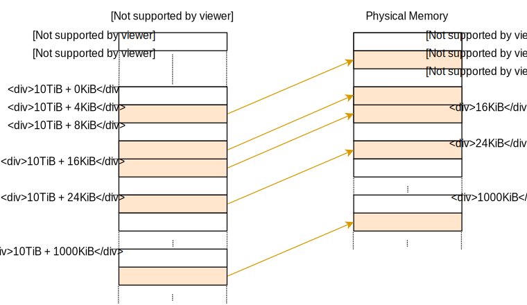

<h1>Paging Implementation(分页实现)</h1>

This post shows how to implement paging support in our kernel. It first explores different techniques to make the physical page table frames accessible to the kernel and discusses their respective advantages and drawbacks. It then implements an address translation function and a function to create a new mapping.

这篇文章展示了如何在我们的内核中实现分页。首先我们介绍了几种能在内核中直接访问物理帧的技术并且讨论了他们的优缺点。然后我们实现了一个地址转换函数和一个创建新内存映射的方法。


This blog is openly developed on GitHub. If you have any problems or questions, please open an issue there. You can also leave comments at the bottom. The complete source code for this post can be found in the post-09 branch.

这篇博客是在[GitHub](https://github.com/phil-opp/blog_os)上公开开发的。如果你有任何问题或疑问，请在那里开一个问题。你也可以在底部留下评论。
本帖的完整源代码可以在[post-09](https://github.com/phil-opp/blog_os/tree/post-09)分支中找到。

<h2>Introduction(介绍)</h2>

The [previous post](https://os.phil-opp.com/paging-introduction/) gave an introduction to the concept of paging. It motivated paging by comparing it with segmentation, explained how paging and page tables work, and then introduced the 4-level page table design of `x86_64`. We found out that the bootloader already set up a page table hierarchy for our kernel, which means that our kernel already runs on virtual addresses. This improves safety since illegal memory accesses cause page fault exceptions instead of modifying arbitrary physical memory.

[上篇文章](https://os.phil-opp.com/paging-introduction/)我们对分页概念做了一个大体的介绍。我们通过将分页和分段作比较来推动文章，解释了分页和页表是如何工作的,然后介绍了`x86_64`的4级页表设计。我们发现bootloader在我们的内核中已经设置了一个多层级页表结构，这代表我们的内核已经运行在虚拟内存上了。这提高了我们内核的安全性，因为我们在尝试访问非法内存的时候会抛出一个页错误而不是真的能修改任意位置的物理内存。


The post ended with the problem that we [can’t access the page tables from our kernel](https://os.phil-opp.com/paging-introduction/#accessing-the-page-tables) because they are stored in physical memory and our kernel already runs on virtual addresses. This post explores different approaches to making the page table frames accessible to our kernel. We will discuss the advantages and drawbacks of each approach and then decide on an approach for our kernel.

那篇文章结束的时候留下了一个问题:[我们的内核无法直接访问页表](https://os.phil-opp.com/paging-introduction/#accessing-the-page-tables)，因为他们存储在物理内存中而我们的内核运行在虚拟内存的基础上。这篇文章我们将会探讨一些能够让内核直接访问页表物理帧的方法。我们会讨论他们各自的优缺点并且最终选择其中的一个在我们的内核中实现。

To implement the approach, we will need support from the bootloader, so we’ll configure it first. Afterward, we will implement a function that traverses the page table hierarchy in order to translate virtual to physical addresses. Finally, we learn how to create new mappings in the page tables and how to find unused memory frames for creating new page tables.

为了能够实现直接访问页表，我们需要bootloader的支持，所以我们首先要对其做相关的配置。然后我们会实现一个遍历页表层级的方法以此来将虚拟地址转换为物理地址。最后我们会学习如何创建一个新的映射页表以及如何找到未使用的物理帧来创建存储新建的页表。

<h2>Accessing Page Tables(访问页表)</h2>

Accessing the page tables from our kernel is not as easy as it may seem. To understand the problem, let’s take a look at the example 4-level page table hierarchy from the previous post again:

在我们的内核中直接访问页表并不像想象的那么简单。为了理解其中的问题，我们再来回顾下上篇文章中提到的4级页表结构:


The important thing here is that each page entry stores the physical address of the next table. This avoids the need to run a translation for these addresses too, which would be bad for performance and could easily cause endless translation loops.

这里最重要的一点是每个页表项存储的都是下一级别表的物理地址。这就避免了我们又要再重新转换这些地址，也就不会影响性能，更不会导致转换的无限循环。

The problem for us is that we can’t directly access physical addresses from our kernel since our kernel also runs on top of virtual addresses. For example, when we access address `4 KiB` we access the virtual address `4 KiB`, not the physical address `4 KiB` where the level 4 page table is stored. When we want to access the physical address `4 KiB`, we can only do so through some virtual address that maps to it.

那么对我们而言问题就是我们无法在内核中直接访问物理地址，因为我们的内核也是建立在虚拟地址之上的。举个例子，当我们访问地址`4KiB`的内存时，我们访问的不是物理地址的`4KiB`,而是4级页表中存储的`4KiB`对应的地址。当我们想要访问物理地址的`4KiB`的时候，我们只能通过访问映射到`4KiB`的虚拟地址来访问。

So in order to access page table frames, we need to map some virtual pages to them. There are different ways to create these mappings that all allow us to access arbitrary page table frames.

所以，为了能够直接访问页表帧，我们需要将一些虚拟地址映射到他们的位置。这里有几种方法来创建这些映射，以此让我们能够访问任意的页表帧。

<h3>Identity Mapping(直接(恒等)映射)</h3>

A simple solution is to **identity map all page tables**:

一个简单的方法就是**恒等映射所有的页表**:


In this example, we see various identity-mapped page table frames. This way, the physical addresses of page tables are also valid virtual addresses so that we can easily access the page tables of all levels starting from the CR3 register.

在这个例子中，我们能够看到一些恒等映射的页表帧。在这种情况下，页表的物理地址就是有效的虚拟地址，这样我们就能够轻松地访问从CR3寄存器开始的所有级别的页表。


However, it clutters the virtual address space and makes it more difficult to find continuous memory regions of larger sizes. For example, imagine that we want to create a virtual memory region of size 1000 KiB in the above graphic, e.g., for [memory-mapping a file](https://en.wikipedia.org/wiki/Memory-mapped_file). We can’t start the region at `28 KiB` because it would collide with the already mapped page at `1004 KiB`. So we have to look further until we find a large enough unmapped area, for example at `1008 KiB`. This is a similar fragmentation problem as with [segmentation](https://os.phil-opp.com/paging-introduction/#fragmentation).


然而这种方法会使虚拟地址空间变得杂乱并且这样就很难找到连续的较大的内存空间。举个例子,想象下我们需要创建一个大小为1000KiB的内存区域，例如用来[映射文件](https://en.wikipedia.org/wiki/Memory-mapped_file).我们不能够从`28KiB`的区域开始，因为这样会导致和已经存在映射的`1004KiB`冲突。
所以我们需要继续去寻找一个足够大的未映射的内存区域。比如`1008 KiB`的位置。这样就和[分段](https://os.phil-opp.com/paging-introduction/#fragmentation)有类似的碎片问题了

Equally, it makes it much more difficult to create new page tables because we need to find physical frames whose corresponding pages aren’t already in use. For example, let’s assume that we reserved the virtual `1000 KiB` memory region starting at `1008 KiB` for our memory-mapped file. Now we can’t use any frame with a physical address between `1000 KiB` and `2008 KiB` anymore, because we can’t identity map it.

同样，这也使创建新的页表变得很困难，因为我们需要为页表找到大小合适且没有被使用的物理帧。举个例子，假设我们为映射文件预留了`1000KiB`开始的`1008KiB`的区域。那我们就无法使用`1000KiB`到`2008KiB`之间的物理帧，因为我们没办法恒等映射他们了(因为已经被使用了  恒等映射页表虚拟地址就是实际的物理地址，这段区域的虚拟地址也就无法用来存储页表)。

<h3>Map at a Fixed Offset(固定偏移映射)</h3>

To avoid the problem of cluttering the virtual address space, we can use a separate memory region for page table mappings. So instead of identity mapping page table frames, we map them at a fixed offset in the virtual address space. For example, the offset could be 10 TiB:

为了避免上面说的将虚拟内存空间混乱的问题，我们可以划分一个单独的区域来存储页表。所以替代恒等映射，我们将页表映射到虚拟地址空间中一个固定偏移后开始的地方。举个例子，这个偏移量是10TiB(类似虚拟地址= 物理地址+10TiB):





By using the virtual memory in the range `10 TiB..(10 TiB + physical memory size)` exclusively for page table mappings, we avoid the collision problems of the identity mapping. Reserving such a large region of the virtual address space is only possible if the virtual address space is much larger than the physical memory size. This isn’t a problem on x86_64 since the 48-bit address space is 256 TiB large.

通过将虚拟地址中 `10TiB到(10TiB+物理内存大小)`范围专门用来存储页表映射，我们不会在发生恒等映射中出现的碰撞问题。但是只有在虚拟地址空间远远大于物理内存大小的情况下我们才能使用这种方法，预留如此大的虚拟地址空间。好在这在x86_64上是没问题的，因为他有48位来表示虚拟地址空间，足足有256TiB。

This approach still has the disadvantage that we need to create a new mapping whenever we create a new page table. Also, it does not allow accessing page tables of other address spaces, which would be useful when creating a new process.


该方法仍然有一个缺点，就是每当我们创建一个新的页表时，都需要创建一个新的映射。另外，该方法不允许访问其他地址空间的页表，这在创建新进程时很有用。

<h3>Map the Complete Physical Memory(物理内存完全映射)</h3>

We can solve these problems by **mapping the complete physical memory** instead of only page table frames:

要来解决这些问题，我们不再仅映射页表帧，而是映射全部物理内存：


This approach allows our kernel to access arbitrary physical memory, including page table frames of other address spaces. The reserved virtual memory range has the same size as before, with the difference that it no longer contains unmapped pages.

这种方法允许内核访问任意物理内存，包括其他地址空间的页表帧。保留的虚拟内存范围与上一节相同，不同之处在于虚拟内存不再包含未映射的页面（即虚拟内存空间将全部映射到物理帧）。


The disadvantage of this approach is that additional page tables are needed for storing the mapping of the physical memory. These page tables need to be stored somewhere, so they use up a part of physical memory, which can be a problem on devices with a small amount of memory.


这种方法的缺点是需要额外的页表来存储物理内存的映射。这些页表需要存储在某个地方，因此它们会用掉一部分物理内存，这在内存较小的设备上可能是个问题。

On x86_64, however, we can use [huge pages](https://en.wikipedia.org/wiki/Page_%28computer_memory%29#Multiple_page_sizes) with a size of 2 MiB for the mapping, instead of the default 4 KiB pages. This way, mapping 32 GiB of physical memory only requires 132 KiB for page tables since only one level 3 table and 32 level 2 tables are needed. Huge pages are also more cache efficient since they use fewer entries in the translation lookaside buffer (TLB).

不过，在x86_64上我们可以使用2MiB的[巨页](https://en.wikipedia.org/wiki/Page_%28computer_memory%29#Multiple_page_sizes)进行映射，而不是默认的4KiB页面。这样，映射32GiB内存，仅需要1个3级表和32个2级表（2级:512*2MB=1G  三级表32个就够了 2级直接映射物理帧 原来的1级扩展为偏移）总共132KiB的空间用于存储页表（(1+32)*4KiB=132KiB）。而且巨页还可以提升缓存效率，因为巨页在页表缓冲区（TLB）中使用的条目更少。

<h3>Temporary Mapping(临时映射)</h3>

For devices with very small amounts of physical memory, we could map the page table frames only temporarily when we need to access them. To be able to create the temporary mappings, we only need a single identity-mapped level 1 table:

对于物理内存量很小的设备，我们只能在需要访问时才临时映射页表帧。为了能够创建临时映射，我们只需要一个恒等映射的1级页表：


The level 1 table in this graphic controls the first 2 MiB of the virtual address space. This is because it is reachable by starting at the CR3 register and following the 0th entry in the level 4, level 3, and level 2 page tables. The entry with index `8` maps the virtual page at address `32 KiB` to the physical frame at address `32 KiB`, thereby identity mapping the level 1 table itself. The graphic shows this identity-mapping by the horizontal arrow at `32 KiB`.


图中的1级表控制虚拟地址空间的前2MiB（512个大小为4KiB的虚拟页面）。这是因为它可以通过从CR3寄存器开始并跟随4级、3级和2级页表中的第0个条目来访问。索引为8的条目将地址32KiB上的虚拟页映射到地址32KiB上的物理帧，也就是恒等映射了1级表本身。图中使用32KiB处的水平箭头表明了此恒等映射。


By writing to the identity-mapped level 1 table, our kernel can create up to 511 temporary mappings (512 minus the entry required for the identity mapping). In the above example, the kernel created two temporary mappings:


- By mapping the 0th entry of the level 1 table to the frame with address 24 KiB, it created a temporary mapping of the virtual page at 0 KiB to the physical frame of the level 2 page table, indicated by the dashed arrow.
- By mapping the 9th entry of the level 1 table to the frame with address 4 KiB, it created a temporary mapping of the virtual page at 36 KiB to the physical frame of the level 4 page table, indicated by the dashed arrow.


通过写入恒等映射的1级表，我们的内核最多可以创建511个临时映射（512减去恒等映射所需的条目（自己的恒等））。在上面的示例中，内核创建了两个临时映射：

- 将1级表的第0个条目映射到地址为24KiB的帧，便创建了一个临时映射，将0​​KiB处的虚拟页映射到2级页表所在的物理帧，如虚线箭头所示。
- 将1级表的第9个条目映射到地址为4KiB的帧，便创建了一个临时映射，将36KiB处的虚拟页映射到4级页表所在的物理帧，如虚线箭头所示。

Now the kernel can access the level 2 page table by writing to page `0 KiB` and the level 4 page table by writing to page `36 KiB`.

现在，内核可以通过写入0KiB页面来访问第2级页表，以及通过写入36KiB页面来访问第4级页表。

The process for accessing an arbitrary page table frame with temporary mappings would be:

- Search for a free entry in the identity-mapped level 1 table.
- Map that entry to the physical frame of the page table that we want to access.
- Access the target frame through the virtual page that maps to the entry.
- Set the entry back to unused, thereby removing the temporary mapping again.


使用临时映射访问任意页表帧的过程为：

- 在恒等映射的1级表中搜索未使用条目。
- 将该条目映射到我们想要访问的页表所在的物理帧。
- 通过映射到该条目的虚拟页面访问目标帧。
- 将该条目设置回未使用状态，从而删除本次临时映射。


This approach reuses the same 512 virtual pages for creating the mappings and thus requires only 4 KiB of physical memory. The drawback is that it is a bit cumbersome, especially since a new mapping might require modifications to multiple table levels, which means that we would need to repeat the above process multiple times.

这种方法重复使用相同的512个虚拟页面来创建映射，因此仅需要4KiB的物理内存(8*512)。缺点是它有点麻烦，特别是因为新的映射可能需要修改多个级别的页表，这意味着我们需要将上述过程重复多次。


<h3>Recursive Page Tables(递归页表)</h3>

(这里需要一个前提 就是能设置四级表的递归表项 下面都是假设511是递归条目)

Another interesting approach, which requires no additional page tables at all, is to **map the page table recursively**. The idea behind this approach is to map an entry from the level 4 page table to the level 4 table itself. By doing this, we effectively reserve a part of the virtual address space and map all current and future page table frames to that space.

另一个根本不需要附加页表的有趣方法是**递归映射页表**。这种方法的思路是将4级页表的某些条目映射到4级表本身。如此可以有效地保留一部分虚拟地址空间，并将所有当前和将来的页表帧映射到该空间。


Let’s go through an example to understand how this all works:

让我们通过一个例子来理解该方法是如何工作的：


The only difference to the [example at the beginning of this post](https://os.phil-opp.com/paging-implementation/#accessing-page-tables) is the additional entry at index 511 in the level 4 table, which is mapped to physical frame `4 KiB`, the frame of the level 4 table itself.

这与[本文开头示例](https://os.phil-opp.com/paging-implementation/#accessing-page-tables)的唯一区别是，4级表中索引511处的条目映射到了4级表本身的4KiB物理帧。


By letting the CPU follow this entry on a translation, it doesn’t reach a level 3 table but the same level 4 table again. This is similar to a recursive function that calls itself, therefore this table is called a recursive page table. The important thing is that the CPU assumes that every entry in the level 4 table points to a level 3 table, so it now treats the level 4 table as a level 3 table. This works because tables of all levels have the exact same layout on x86_64.

通过让CPU在转换中按照该条目运行，它不会到达3级表，而是又回到这一4级表。这类似于调用自身的递归函数，因此此表称为递归页表。重要的是，CPU假定4级表中的​​每个条目都指向3级表，因此现在将4级表视为3级表。这之所以可行，是因为所有级别的表在x86_64上的布局都完全相同。


By following the recursive entry one or multiple times before we start the actual translation, we can effectively shorten the number of levels that the CPU traverses. For example, if we follow the recursive entry once and then proceed to the level 3 table, the CPU thinks that the level 3 table is a level 2 table. Going further, it treats the level 2 table as a level 1 table and the level 1 table as the mapped frame. This means that we can now read and write the level 1 page table because the CPU thinks that it is the mapped frame. The graphic below illustrates the five translation steps:


通过在开始实际转换之前访问一次或多次递归项，我们可以有效地减少CPU遍历的级数。例如，如果我们只访问一次递归条目，然后进入3级表，则CPU会认为3级表是2级表。更进一步，它将2级表视为1级表，将1级表视为映射的帧。这意味着我们现在可以读写1级页表，因为CPU认为它是映射的物理帧。下图说明了5个转换步骤：


Similarly, we can follow the recursive entry twice before starting the translation to reduce the number of traversed levels to two:

类似的，在开始转换之前，我们可以两次访问递归项，以将遍历的级别数减少为两个：


Let’s go through it step by step: First, the CPU follows the recursive entry on the level 4 table and thinks that it reaches a level 3 table. Then it follows the recursive entry again and thinks that it reaches a level 2 table. But in reality, it is still on the level 4 table. When the CPU now follows a different entry, it lands on a level 3 table but thinks it is already on a level 1 table. So while the next entry points to a level 2 table, the CPU thinks that it points to the mapped frame, which allows us to read and write the level 2 table.

让我们逐步看下上面的操作：首先，CPU访问4级表上的递归条目，并认为自己已到达3级表。然后，它再次访问递归条目，并认为自己已到达2级表。但实际上，CPU仍然位于4级表中。当CPU现在访问另一个条目时，它将进入在3级表，但认为自己已经在1级表上了。因此，当下一个条目指向2级表时，CPU认为它指向映射的帧，这使我们可以读写2级表。


Accessing the tables of levels 3 and 4 works in the same way. To access the level 3 table, we follow the recursive entry three times, tricking the CPU into thinking it is already on a level 1 table. Then we follow another entry and reach a level 3 table, which the CPU treats as a mapped frame. For accessing the level 4 table itself, we just follow the recursive entry four times until the CPU treats the level 4 table itself as the mapped frame (in blue in the graphic below).

访问3级和4级表的工作方式相同。为了访问3级表，我们重复访问了3次递归项，使CPU认为它已经在1级表中了。然后，我们访问另一个条目并到达第3级表，CPU将其视为映射帧。要访问4级表本身，我们只需访问递归项四次，直到CPU将4级表本身视为映射帧（下图中的蓝色）。


It might take some time to wrap your head around the concept, but it works quite well in practice.

你可能需要花一些时间来理解这个思路，但是在实践中却非常有效。

In the section below, we explain how to construct virtual addresses for following the recursive entry one or multiple times. We will not use recursive paging for our implementation, so you don’t need to read it to continue with the post. If it interests you, just click on “Address Calculation” to expand it.

在下面的小节中，我们将解释如何构造虚拟地址以一次或多次访问递归项。我们不会在实现中使用递归分页，因此你可以跳过这一节继续阅读后文。

<details>
<summary>Address Calculation</summary>

We saw that we can access tables of all levels by following the recursive entry once or multiple times before the actual translation. Since the indexes into the tables of the four levels are derived directly from the virtual address, we need to construct special virtual addresses for this technique. Remember, the page table indexes are derived from the address in the following way:

可以看到在实际地址转换前通过一次或多次地访问递归条目来访问所有级别的页表。由于访问这四个级别的表的索引是直接从虚拟地址中派生的，因此我们需要为此方法构造特殊的虚拟地址。请记住，页表索引是通过以下方式从虚拟地址中派生的：


Let’s assume that we want to access the level 1 page table that maps a specific page. As we learned above, this means that we have to follow the recursive entry once before continuing with the level 4, level 3, and level 2 indexes. To do that, we move each block of the address one block to the right and set the original level 4 index to the index of the recursive entry:

假设我们要访问特定页面的1级页表。如上所述，这意味着在继续执行4级，3级和2级索引之前，我们必须访问一次递归项。为此，我们将地址的每个块向右移动一个块，并将原来4级表索引设置为递归索引(指向自己  offset 置0或者是想要访问的具体表项偏移量)：


For accessing the level 2 table of that page, we move each index block two blocks to the right and set both the blocks of the original level 4 index and the original level 3 index to the index of the recursive entry:

为了访问2级表，我们将每个索引块向右移动两个块，并将原始4级索引和原始3级索引的块都设置为递归索引：


Accessing the level 3 table works by moving each block three blocks to the right and using the recursive index for the original level 4, level 3, and level 2 address blocks:

通过将每个块向右移动三个块并对原始4级，3级和2级地址块使用递归索引，便可以访问3级页表：


Finally, we can access the level 4 table by moving each block four blocks to the right and using the recursive index for all address blocks except for the offset:

最后，我们可以通过将每个块向右移动四个块并使用除偏移量以外的所有地址块作为递归索引来访问4级表：


We can now calculate virtual addresses for the page tables of all four levels. We can even calculate an address that points exactly to a specific page table entry by multiplying its index by 8, the size of a page table entry.

现在就可以计算全部四个级别的页表的虚拟地址了。我们甚至可以通过将其索引乘以8（页面表条目的大小）来计算精确指向特定页面表条目的地址。


| 用于访问  | 虚拟地址结构(八进制)           |
| --------- | ------------------------------ |
| 页        | 0o_SSSSSS_AAA_BBB_CCC_DDD_EEEE |
| 1级页表项 | 0o_SSSSSS_RRR_AAA_BBB_CCC_DDDD |
| 2级页表项 | 0o_SSSSSS_RRR_RRR_AAA_BBB_CCCC |
| 3级页表项 | 0o_SSSSSS_RRR_RRR_RRR_AAA_BBBB |
| 4级页表项 | 0o_SSSSSS_RRR_RRR_RRR_RRR_AAAA |


Whereas `AAA` is the level 4 index, `BBB` the level 3 index, `CCC` the level 2 index, and `DDD` the level 1 index of the mapped frame, and `EEEE` the offset into it. `RRR` is the index of the recursive entry. When an index (three digits) is transformed to an offset (four digits), it is done by multiplying it by 8 (the size of a page table entry). With this offset, the resulting address directly points to the respective page table entry.

其中`AAA`是4级索引，`BBB`是3级索引，`CCC`是2级索引，`DDD`是映射帧的1级索引，而`EEEE`是映射帧的偏移量。`RRR`是递归条目的索引。当索引（三位数）转换为偏移量（四位数，12位二进制偏移地址转换为4位八进制数）时，可以通过将其乘以8（页表项的大小,8byte）来完成。有了这样的偏移量，结果地址就直接指向相应的页表条目。


`SSSSSS` are sign extension bits, which means that they are all copies of bit 47. This is a special requirement for valid addresses on the x86_64 architecture. We explained it in the [previous post](https://os.phil-opp.com/paging-introduction/#paging-on-x86-64).

`SSSSSS`是符号扩展位，这意味着它们都是第47位的副本。这是对x86_64架构上有效地址的特殊要求。我们在[上一篇文章](https://os.phil-opp.com/paging-introduction/#paging-on-x86-64)中对此进行了解释。

We use [octal](https://en.wikipedia.org/wiki/Octal) numbers for representing the addresses since each octal character represents three bits, which allows us to clearly separate the 9-bit indexes of the different page table levels. This isn’t possible with the hexadecimal system, where each character represents four bits.

之所以使用[八进制](https://en.wikipedia.org/wiki/Octal)表示地址，是因为每个八进制字符表示三个比特位，这使我们可以清楚地区分不同页表级别的9位索引。对于每个字符代表四个位的十六进制来说是不可能的。

<h4>In Rust Code(rust代码)</h4>

To construct such addresses in Rust code, you can use bitwise operations:

要在Rust代码中构造这样的地址，可以使用位运算：


```rust
// the virtual address whose corresponding page tables you want to access
let addr: usize = […];

let r = 0o777; // recursive index  511
let sign = 0o177777 << 48; // sign extension  16位的拓展位 全1 因为递归位是全1

// retrieve the page table indices of the address that we want to translate
let l4_idx = (addr >> 39) & 0o777; // level 4 index     只有九位and1 保留 其他都是and 0 归零 获取l4_idx 下面同理 
let l3_idx = (addr >> 30) & 0o777; // level 3 index
let l2_idx = (addr >> 21) & 0o777; // level 2 index
let l1_idx = (addr >> 12) & 0o777; // level 1 index
let page_offset = addr & 0o7777;        // offset不变

// calculate the table addresses
let level_4_table_addr =
    sign | (r << 39) | (r << 30) | (r << 21) | (r << 12);  // 1，2，3，4级索引全是511 offset 0
let level_3_table_addr =
    sign | (r << 39) | (r << 30) | (r << 21) | (l4_idx << 12); // 4,3,2级别索引都是511  1级索引位置是l4_idx 下面同理
let level_2_table_addr =
    sign | (r << 39) | (r << 30) | (l4_idx << 21) | (l3_idx << 12);
let level_1_table_addr =
    sign | (r << 39) | (l4_idx << 30) | (l3_idx << 21) | (l2_idx << 12);

```


The above code assumes that the last level 4 entry with index `0o777` (511) is recursively mapped. This isn’t the case currently, so the code won’t work yet. See below on how to tell the bootloader to set up the recursive mapping.

上面的代码假定递归映射条目的索引为`0o777`，即最后一个4级条目511。不过目前情况并非如此，因此代码尚无法工作。请参阅下文，了解如何告诉bootloader设置递归映射。


Alternatively to performing the bitwise operations by hand, you can use the [RecursivePageTable](https://docs.rs/x86_64/0.14.2/x86_64/structures/paging/mapper/struct.RecursivePageTable.html) type of the `x86_64` crate, which provides safe abstractions for various page table operations. For example, the code below shows how to translate a virtual address to its mapped physical address:

除了手动执行按位运算之外，还可以使用x86_64crate的[RecursivePageTable](https://docs.rs/x86_64/0.14.2/x86_64/structures/paging/mapper/struct.RecursivePageTable.html)类型，该类型为各种页表操作提供安全的抽象。例如，以下代码展示了如何将虚拟地址转换为其映射的物理地址：


```rust
// in src/memory.rs

use x86_64::structures::paging::{Mapper, Page, PageTable, RecursivePageTable};
use x86_64::{VirtAddr, PhysAddr};

/// Creates a RecursivePageTable instance from the level 4 address.
let level_4_table_addr = […];
let level_4_table_ptr = level_4_table_addr as *mut PageTable;
let recursive_page_table = unsafe {
    let level_4_table = &mut *level_4_table_ptr;
    RecursivePageTable::new(level_4_table).unwrap();
}


/// Retrieve the physical address for the given virtual address
let addr: u64 = […]
let addr = VirtAddr::new(addr);
let page: Page = Page::containing_address(addr);

// perform the translation
let frame = recursive_page_table.translate_page(page);

```

Again, a valid recursive mapping is required for this code. With such a mapping, the missing `level_4_table_addr` can be calculated as in the first code example.

与上一段代码相同，运行此代码需要有效的递归映射。使用这种映射，可以像上一个代码示例中那样计算给定的`level_4_table_addr`。

</details>


Recursive Paging is an interesting technique that shows how powerful a single mapping in a page table can be. It is relatively easy to implement and only requires a minimal amount of setup (just a single recursive entry), so it’s a good choice for first experiments with paging.

递归分页是一种有趣的技术，也展示了页表中的单个映射功能有多强大。它相对容易实现，只需要极少的设置（即设置一个递归项），因此它作为我们的第一个分页实验确实是一个不错选择。

However, it also has some disadvantages:


- It occupies a large amount of virtual memory (512 GiB). This isn’t a big problem in the large 48-bit address space, but it might lead to suboptimal cache behavior.
- It only allows accessing the currently active address space easily. Accessing other address spaces is still possible by changing the recursive entry, but a temporary mapping is required for switching back. We described how to do this in the (outdated) [Remap The Kernel post](https://os.phil-opp.com/remap-the-kernel/#overview).
- It heavily relies on the page table format of x86 and might not work on other architectures.


然而，他也有一些缺点:

- 它占据了大量的虚拟内存（512GiB 对应一个完整的3j空间  4KiB * 512 * 512 * 512）。这在大的48位地址空间中不是一个大问题，但它可能会导致次优的缓存行为。
- 该方法仅允许轻松地访问当前活动的地址空间。当然通过更改递归项，仍然可以访问其他地址空间，但是需要临时映射才能切换回去。我们在[重新映射内核](https://os.phil-opp.com/remap-the-kernel/#overview)（已过时）一文中描述了如何执行此操作。
- 十分依赖x86的页表格式，可能无法在其他架构中运行。

<h2>Bootloader Support(Bootloader的支持)</h2>

All of these approaches require page table modifications for their setup. For example, mappings for the physical memory need to be created or an entry of the level 4 table needs to be mapped recursively. The problem is that we can’t create these required mappings without an existing way to access the page tables.

所有这些方法在都需要在初始化时对页表进行修改。例如，需要创建物理内存的映射，或者需要递归映射4级表的条目。目前的问题是在还没有能够访问页表的方法之前，我们无法创建这些必要的的映射。


This means that we need the help of the bootloader, which creates the page tables that our kernel runs on. The bootloader has access to the page tables, so it can create any mappings that we need. In its current implementation, the `bootloader` crate has support for two of the above approaches, controlled through [cargo features](https://doc.rust-lang.org/cargo/reference/features.html#the-features-section):


- The `map_physical_memory` feature maps the complete physical memory somewhere into the virtual address space. Thus, the kernel has access to all physical memory and can follow the [Map the Complete Physical Memory](https://os.phil-opp.com/paging-implementation/#map-the-complete-physical-memory) approach.
- With the `recursive_page_table feature`, the bootloader maps an entry of the level 4 page table recursively. This allows the kernel to access the page tables as described in the [Recursive Page Tables](https://os.phil-opp.com/paging-implementation/#recursive-page-tables) section.
  

这意味着我们需要bootloader的帮助，该程序会创建内核运行的页表。`bootloader`可以访问页表，因此它可以创建我们需要的任何映射。在当前的实现中，`bootloader`包支持上面提到的两种方法，并可以通过[cargo功能](https://doc.rust-lang.org/cargo/reference/features.html#the-features-section)进行控制：

- `map_physical_memory`特性可以将整个物理内存映射到虚拟地址空间中的某处。因此，内核可以访问所有物理内存，于是我们可以实现[映射完整物理内存](https://os.phil-opp.com/paging-implementation/#map-the-complete-physical-memory)中的方法。
- 使用`recursive_page_table`特性，bootloader将递归映射4级页表的一个条目。这允许内核按照[递归页表](https://os.phil-opp.com/paging-implementation/#recursive-page-tables)部分中的描述访问页面表。


We choose the first approach for our kernel since it is simple, platform-independent, and more powerful (it also allows access to non-page-table-frames). To enable the required bootloader support, we add the map_physical_memory feature to our bootloader dependency:


我们为内核选择第一种方法，因为它简单，平台独立且功能更强大（还允许访问非页表帧）。为了启用所需的`bootloader`支持，我们将`map_physical_memory`特性添加到了`bootloader`的依赖项中：

```toml
[dependencies]
bootloader = { version = "0.9.8", features = ["map_physical_memory"]}

```

With this feature enabled, the bootloader maps the complete physical memory to some unused virtual address range. To communicate the virtual address range to our kernel, the bootloader passes a boot information structure.

启用此特性后，bootloader会将完整的物理内存映射到一些未使用的虚拟地址。为了将希望使用的虚拟地址范围告诉内核，引导加载程序会传递一个引导信息结构体。


<h3>Boot Information(引导信息)</h3>

The `bootloader` crate defines a [BootInfo](https://docs.rs/bootloader/0.9.3/bootloader/bootinfo/struct.BootInfo.html) struct that contains all the information it passes to our kernel. The struct is still in an early stage, so expect some breakage when updating to future [semver-incompatible](https://doc.rust-lang.org/stable/cargo/reference/specifying-dependencies.html#caret-requirements) bootloader versions. With the `map_physical_memory` feature enabled, it currently has the two fields `memory_map` and `physical_memory_offset`:

- The `memory_map` field contains an overview of the available physical memory. This tells our kernel how much physical memory is available in the system and which memory regions are reserved for devices such as the VGA hardware. The memory map can be queried from the BIOS or UEFI firmware, but only very early in the boot process. For this reason, it must be provided by the bootloader because there is no way for the kernel to retrieve it later. We will need the memory map later in this post.
- The `physical_memory_offset` tells us the virtual start address of the physical memory mapping. By adding this offset to a physical address, we get the corresponding virtual address. This allows us to access arbitrary physical memory from our kernel.

`bootloader`包定义了一个[BootInfo](https://docs.rs/bootloader/0.9.3/bootloader/bootinfo/struct.BootInfo.html)结构体，包含传递给内核的所有信息。该结构体仍处于早期阶段，因此在未来更新到[语义不兼容](https://doc.rust-lang.org/stable/cargo/reference/specifying-dependencies.html#caret-requirements)的bootloader版本时，可能会造成问题。启用`map_physical_memory`特性后，它将包含`memory_map`和`physical_memory_offset`两个字段：

- `memory_map`字段包含可用物理内存的概述。该字段告诉内核系统中有多少可用物理内存，以及哪些内存区域是为诸如VGA硬件之类的设备所保留的。可以从BIOS或UEFI固件查询内存映射，但查询只能在启动过程的早期。也正是由于这个原因，内存映射必须由bootloader提供，因为内核无法在之后检索该映射。在下文中，我们将需要这个内存映射字段。
- `physical_memory_offset`字段包含物理内存映射到虚拟地址的起始地址。通过将此偏移量与物理地址相加，即可获得相应的虚拟地址。这使我们可以从内核访问任意物理内存。


The bootloader passes the `BootInfo` struct to our kernel in the form of a `&'static BootInfo` argument to our `_start` function. We don’t have this argument declared in our function yet, so let’s add it:

`bootloader`将`BootInfo`结构体以`_start`函数的`&'static BootInfo`参数的形式传递给内核。我们尚未在该函数中声明此参数，按照下面的方式修改：

```rust
// in src/main.rs

use bootloader::BootInfo;

#[no_mangle]
pub extern "C" fn _start(boot_info: &'static BootInfo) -> ! { // new argument
    […]
}

```

It wasn’t a problem to leave off this argument before because the x86_64 calling convention passes the first argument in a CPU register. Thus, the argument is simply ignored when it isn’t declared. However, it would be a problem if we accidentally used a wrong argument type, since the compiler doesn’t know the correct type signature of our entry point function.


在前面的文章中，我们一直都缺少该参数也并没有造成什么问题，因为x86_64调用约定在CPU寄存器中传递了第一个参数。因此，若不声明该参数，只会使得参数被忽略。但是，如果我们不小心使用了错误的参数类型，那将会造成问题，因为编译器并不知道我们入口点函数的正确类型签名。


### The `entry_point` Macro (`entry_point` 宏)

Since our `_start` function is called externally from the bootloader, no checking of our function signature occurs. This means that we could let it take arbitrary arguments without any compilation errors, but it would fail or cause undefined behavior at runtime.

由于`_start`函数是由bootloader外部调用的，因此不会检查该函数的签名。这意味着我们可以让该函数接受任意参数也不产生任何编译错误，但是函数将无法运行或在运行时导致未定义的行为。

To make sure that the entry point function always has the correct signature that the bootloader expects, the `bootloader` crate provides an [entry_point](https://docs.rs/bootloader/0.6.4/bootloader/macro.entry_point.html) macro that provides a type-checked way to define a Rust function as the entry point. Let’s rewrite our entry point function to use this macro:

为了确保入口点函数始终具有bootloader期望的正确签名，`bootloader`包提供了[entry_point](https://docs.rs/bootloader/0.6.4/bootloader/macro.entry_point.html)宏，这个宏提供了包含类型检查的方式来将Rust函数定义为入口点。让我们使用此宏重写入口点函数：

```rust
// in src/main.rs

use bootloader::{BootInfo, entry_point};

entry_point!(kernel_main);

fn kernel_main(boot_info: &'static BootInfo) -> ! {
    […]
}

```

We no longer need to use `extern "C"` or `no_mangle` for our entry point, as the macro defines the real lower level `_start` entry point for us. The `kernel_main` function is now a completely normal Rust function, so we can choose an arbitrary name for it. The important thing is that it is type-checked so that a compilation error occurs when we use a wrong function signature, for example by adding an argument or changing the argument type.

我们不再需要使用`extern "C"`或`no_mangle`修饰入口点，因为该宏为我们在底层定义了真正`_start`入口点。现在，`kernel_main`函数就是一个普通的Rust函数，因此我们可以为其选择一个任意名称。重要的该宏会对它进行类型检查，这样在我们使用错误的函数签名 例如增加一个参数或者修改参数类型时抛出编译异常。

Let’s perform the same change in our `lib.rs`:

让我们在`lib.rs`中做出相同的更改:

```rust
// in src/lib.rs

#[cfg(test)]
use bootloader::{entry_point, BootInfo};

#[cfg(test)]
entry_point!(test_kernel_main);

/// Entry point for `cargo test`
#[cfg(test)]
fn test_kernel_main(_boot_info: &'static BootInfo) -> ! {
    // like before
    init();
    test_main();
    hlt_loop();
}

```


Since the entry point is only used in test mode, we add the `#[cfg(test)]` attribute to all items. We give our test entry point the distinct name `test_kernel_main` to avoid confusion with the `kernel_main` of our `main.rs`. We don’t use the `BootInfo `parameter for now, so we prefix the parameter name with a `_` to silence the unused variable warning.

由于入口点仅在测试模式下使用，因此我们为本次修改的条目均添加`#[cfg(test)]`属性。此外，为了避免与`main.rs`的`kernel_main`混淆，我们为测试入口点指定了不同的函数名`test_kernel_main`。目前暂时不使用`BootInfo`参数，所以我们在参数名称前添加`_`前缀以消除未使用某变量的编译警告。

<h2>Implementation(实现)</h2>

Now that we have access to physical memory, we can finally start to implement our page table code. First, we will take a look at the currently active page tables that our kernel runs on. In the second step, we will create a translation function that returns the physical address that a given virtual address is mapped to. As a last step, we will try to modify the page tables in order to create a new mapping.

现在，我们可以访问物理内存了，也终于可以开始实现页表代码了。第一步，我们要看一下内核运行的当前活动页表。第二步，我们将创建一个转换函数，该函数返回给定虚拟地址所映射的物理地址。最后一步，我们将尝试修改页表以创建新的映射。


Before we begin, we create a new `memory` module for our code:

在开始之前，我们为代码创建一个新的`memory`模块：

```rust
// in src/lib.rs

pub mod memory;

```


For the module, we create an empty `src/memory.rs` file.

再为该模块创建一个空的`src/memory.rs`文件。

<h3>Accessing the Page Tables(访问页表)</h3>


At the [end of the previous post](https://os.phil-opp.com/paging-introduction/#accessing-the-page-tables), we tried to take a look at the page tables our kernel runs on, but failed since we couldn’t access the physical frame that the `CR3` register points to. We’re now able to continue from there by creating an `active_level_4_table function` that returns a reference to the active level 4 page table:

在[上一篇文章的末尾](https://os.phil-opp.com/paging-introduction/#accessing-the-page-tables)，我们试图观察内核运行的页表，但是由于无法访问`CR3`寄存器指向的物理帧而失败。现在我们将接着上一篇文章，通过创建一个`active_level_4_table`函数来返回对活动4级页表的引用：


```rust
// in src/memory.rs

use x86_64::{
    structures::paging::PageTable,
    VirtAddr,
};

/// Returns a mutable reference to the active level 4 table.
///
/// This function is unsafe because the caller must guarantee that the
/// complete physical memory is mapped to virtual memory at the passed
/// `physical_memory_offset`. Also, this function must be only called once
/// to avoid aliasing `&mut` references (which is undefined behavior).
pub unsafe fn active_level_4_table(physical_memory_offset: VirtAddr)
    -> &'static mut PageTable
{
    use x86_64::registers::control::Cr3;

    let (level_4_table_frame, _) = Cr3::read();

    let phys = level_4_table_frame.start_address();
    let virt = physical_memory_offset + phys.as_u64();
    let page_table_ptr: *mut PageTable = virt.as_mut_ptr();

    &mut *page_table_ptr // unsafe
}

```


First, we read the physical frame of the active level 4 table from the `CR3` register. We then take its physical start address, convert it to a `u64`, and add it to `physical_memory_offset` to get the virtual address where the page table frame is mapped. Finally, we convert the virtual address to a `*mut PageTable` raw pointer through the `as_mut_ptr` method and then unsafely create a `&mut PageTable` reference from it. We create a `&mut` reference instead of a `&` reference because we will mutate the page tables later in this post.

首先，我们从`CR3`寄存器中读取活动4级表的物理帧。然后，我们获取其物理起始地址，将其转换为`u64`，再为其加上`physical_memory_offset`，以获取映射页表帧的虚拟地址。最后，我们通过`as_mut_ptr`方法将虚拟地址转换为`*mut PageTable`裸指针，再为该指针非安全地创建`&mut PageTable`引用。创建`&mut`引用而非`&`引用，是因为我们将在下文对页表进行修改。

We don’t need to use an unsafe block here because Rust treats the complete body of an `unsafe fn` like a large `unsafe` block. This makes our code more dangerous since we could accidentally introduce an unsafe operation in previous lines without noticing. It also makes it much more difficult to spot unsafe operations in between safe operations. There is an [RFC](https://github.com/rust-lang/rfcs/pull/2585) to change this behavior.

这里不需要使用非安全块，因为Rust会将`unsafe fn`函数体当做一个大型`unsafe`块来对待。这会使代码更加危险，可能稍不注意就会在前几行中意外引入非安全操作。这也使得再安全代码中发现非安全操作变得更加困难。目前有一个[RFC](https://github.com/rust-lang/rfcs/pull/2585)提出对此行为的修改。

We can now use this function to print the entries of the level 4 table:

现在，我们可以使用此函数来打印4级表的条目：

```rust
// in src/main.rs

fn kernel_main(boot_info: &'static BootInfo) -> ! {
    use blog_os::memory::active_level_4_table;
    use x86_64::VirtAddr;

    println!("Hello World{}", "!");
    blog_os::init();

    let phys_mem_offset = VirtAddr::new(boot_info.physical_memory_offset);
    let l4_table = unsafe { active_level_4_table(phys_mem_offset) };

    for (i, entry) in l4_table.iter().enumerate() {
        if !entry.is_unused() {
            println!("L4 Entry {}: {:?}", i, entry);
        }
    }

    // as before
    #[cfg(test)]
    test_main();

    println!("It did not crash!");
    blog_os::hlt_loop();
}

```


First, we convert the `physical_memory_offset` of the `BootInfo` struct to a [VirtAddr](https://docs.rs/x86_64/0.14.2/x86_64/addr/struct.VirtAddr.html) and pass it to the `active_level_4_table` function. We then use the `iter` function to iterate over the page table entries and the [enumerate](https://doc.rust-lang.org/core/iter/trait.Iterator.html#method.enumerate) combinator to additionally add an index `i` to each element. We only print non-empty entries because all 512 entries wouldn’t fit on the screen.

首先，我们将`BootInfo`结构体中的`physical_memory_offset`字段转换为[VirtAddr](https://docs.rs/x86_64/0.14.2/x86_64/addr/struct.VirtAddr.html)，再传给`active_level_4_table`函数。然后，使用`iter`函数迭代页表条目，并使用[enumerate](https://doc.rust-lang.org/core/iter/trait.Iterator.html#method.enumerate)函数为每个元素添加遍历索引`i`。我们仅打印非空条目，因为全部512个条目无法一起显示在屏幕上。


When we run it, we see the following output:

运行可以看到以下输出：


We see that there are various non-empty entries, which all map to different level 3 tables. There are so many regions because kernel code, kernel stack, physical memory mapping, and boot information all use separate memory areas.

我们看到了多个非空条目，它们都映射到不同的3级表。因为内核代码、内核堆栈、物理内存映射和引导信息都会使用单独的内存区域。

To traverse the page tables further and take a look at a level 3 table, we can take the mapped frame of an entry and convert it to a virtual address again:

为了进一步遍历页表并查看第3级表，我们可以将条目的映射帧再次转换为虚拟地址：


```rust
// in the `for` loop in src/main.rs

use x86_64::structures::paging::PageTable;

if !entry.is_unused() {
    println!("L4 Entry {}: {:?}", i, entry);

    // get the physical address from the entry and convert it
    let phys = entry.frame().unwrap().start_address();
    let virt = phys.as_u64() + boot_info.physical_memory_offset;
    let ptr = VirtAddr::new(virt).as_mut_ptr();
    let l3_table: &PageTable = unsafe { &*ptr };

    // print non-empty entries of the level 3 table
    for (i, entry) in l3_table.iter().enumerate() {
        if !entry.is_unused() {
            println!("  L3 Entry {}: {:?}", i, entry);
        }
    }
}

```

For looking at the level 2 and level 1 tables, we repeat that process for the level 3 and level 2 entries. As you can imagine, this gets very verbose very quickly, so we don’t show the full code here.

至于查看2级和1级表，只需对3级和2级条目重复该过程即可。你可以想象，这立刻就会变得非常冗长，因此我们在这里不显示完整的代码。

Traversing the page tables manually is interesting because it helps to understand how the CPU performs the translation. However, most of the time, we are only interested in the mapped physical address for a given virtual address, so let’s create a function for that.

手动遍历页表很有趣，因为它有助于了解CPU如何执行转换。但是，大多数时候我们只对给定虚拟地址的物理地址感兴趣，因此让我们为其创建一个函数。


<h3>Translating Addresses(地址转换)</h3>

To translate a virtual to a physical address, we have to traverse the four-level page table until we reach the mapped frame. Let’s create a function that performs this translation:

为了将虚拟地址转换为物理地址，我们必须遍历全部四级页表，直到到达映射的帧为止。让我们创建一个执行此转换的函数：

```rust
// in src/memory.rs

use x86_64::PhysAddr;

/// Translates the given virtual address to the mapped physical address, or
/// `None` if the address is not mapped.
///
/// This function is unsafe because the caller must guarantee that the
/// complete physical memory is mapped to virtual memory at the passed
/// `physical_memory_offset`.
pub unsafe fn translate_addr(addr: VirtAddr, physical_memory_offset: VirtAddr)
    -> Option<PhysAddr>
{
    translate_addr_inner(addr, physical_memory_offset)
}

```


We forward the function to a safe `translate_addr_inner` function to limit the scope of `unsafe`. As we noted above, Rust treats the complete body of an `unsafe fn` like a large unsafe block. By calling into a private safe function, we make each `unsafe` operation explicit again.

再将该函数传递给安全函数`translate_addr_inner`，以限制非安全操作的范围。前面提到，Rust会将`unsafe fn`函数体当做一个大型unsafe块来对待。因此，通过调用私有安全函数，可以明确每个`unsafe`操作。

The private inner function contains the real implementation:

其中的私有函数的实现细节：

```rust
// in src/memory.rs

/// Private function that is called by `translate_addr`.
///
/// This function is safe to limit the scope of `unsafe` because Rust treats
/// the whole body of unsafe functions as an unsafe block. This function must
/// only be reachable through `unsafe fn` from outside of this module.
fn translate_addr_inner(addr: VirtAddr, physical_memory_offset: VirtAddr)
    -> Option<PhysAddr>
{
    use x86_64::structures::paging::page_table::FrameError;
    use x86_64::registers::control::Cr3;

    // read the active level 4 frame from the CR3 register
    let (level_4_table_frame, _) = Cr3::read();

    let table_indexes = [
        addr.p4_index(), addr.p3_index(), addr.p2_index(), addr.p1_index()
    ];
    let mut frame = level_4_table_frame;

    // traverse the multi-level page table
    for &index in &table_indexes {
        // convert the frame into a page table reference
        let virt = physical_memory_offset + frame.start_address().as_u64();
        let table_ptr: *const PageTable = virt.as_ptr();
        let table = unsafe {&*table_ptr};

        // read the page table entry and update `frame`
        let entry = &table[index];
        frame = match entry.frame() {
            Ok(frame) => frame,
            Err(FrameError::FrameNotPresent) => return None,
            Err(FrameError::HugeFrame) => panic!("huge pages not supported"),
        };
    }

    // calculate the physical address by adding the page offset
    Some(frame.start_address() + u64::from(addr.page_offset()))
}

```

`
Instead of reusing our `active_level_4_table` function, we read the level 4 frame from the `CR3` register again. We do this because it simplifies this prototype implementation. Don’t worry, we will create a better solution in a moment.

我们不选择复用`active_level_4_table`函数，而是再次从`CR3`寄存器中读取4级帧。这样做可以简化此原型实现。不用担心，我们将在稍后创建一个更好的解决方案。

The `VirtAddr` struct already provides methods to compute the indexes into the page tables of the four levels. We store these indexes in a small array because it allows us to traverse the page tables using a `for` loop. Outside of the loop, we remember the last visited frame to calculate the physical address later. The frame points to page table frames while iterating and to the mapped frame after the last iteration, i.e., after following the level 1 entry.

`VirtAddr`结构体已经提供了用于计算进入四个级别页表的索引的方法。我们将这些索引存储在一个小的数组中，之后便可以使用`for`循环遍历页表。在循环之外，我们记录最后被访问的frame，以便稍后计算其物理地址。该帧在迭代时指向页表帧，并在最后一次迭代后（即在访问1级条目之后）指向映射的帧。

Inside the loop, we again use the `physical_memory_offset` to convert the frame into a page table reference. We then read the entry of the current page table and use the [PageTableEntry::frame](https://docs.rs/x86_64/0.14.2/x86_64/structures/paging/page_table/struct.PageTableEntry.html#method.frame) function to retrieve the mapped frame. If the entry is not mapped to a frame, we return `None`. If the entry maps a huge 2 MiB or 1 GiB page, we panic for now.

在循环内部，我们再次使用`physical_memory_offset`将帧转换为页表引用。然后，我们读取当前页表的条目，并使用[PageTableEntry::frame](https://docs.rs/x86_64/0.14.2/x86_64/structures/paging/page_table/struct.PageTableEntry.html#method.frame)函数检索映射的帧。如果条目未映射到帧，则返回None。如果条目映射到2MiB或1GiB的巨页，则产生panic。

Let’s test our translation function by translating some addresses:

让我们通过转换一些地址来测试转换函数：

```rust
// in src/main.rs

fn kernel_main(boot_info: &'static BootInfo) -> ! {
    // new import
    use blog_os::memory::translate_addr;

    […] // hello world and blog_os::init

    let phys_mem_offset = VirtAddr::new(boot_info.physical_memory_offset);

    let addresses = [
        // the identity-mapped vga buffer page
        0xb8000,
        // some code page
        0x201008,
        // some stack page
        0x0100_0020_1a10,
        // virtual address mapped to physical address 0
        boot_info.physical_memory_offset,
    ];

    for &address in &addresses {
        let virt = VirtAddr::new(address);
        let phys = unsafe { translate_addr(virt, phys_mem_offset) };
        println!("{:?} -> {:?}", virt, phys);
    }

    […] // test_main(), "it did not crash" printing, and hlt_loop()
}

```


When we run it, we see the following output:

运行可以看到以下输出：


As expected, the identity-mapped address `0xb8000` translates to the same physical address. The code page and the stack page translate to some arbitrary physical addresses, which depend on how the bootloader created the initial mapping for our kernel. It’s worth noting that the last 12 bits always stay the same after translation, which makes sense because these bits are the [page offset](https://os.phil-opp.com/paging-introduction/#paging-on-x86-64) and not part of the translation.

如预期的那样，恒等映射的地址`0xb8000`转换为相同的物理地址。代码页和栈页转换为一些随机的物理地址，这取决于bootloader如何为内核创建初始映射。值得注意的是，转换后的最后12位始终保持不变，这是合理的，因为这些位是[页面偏移量](https://os.phil-opp.com/paging-introduction/#paging-on-x86-64)，而不是被转换地址的一部分。


Since each physical address can be accessed by adding the `physical_memory_offset`, the translation of the `physical_memory_offset` address itself should point to physical address `0`. However, the translation fails because the mapping uses huge pages for efficiency, which is not supported in our implementation yet.

由于可以通过加上`physical_memory_offset`来访问每个物理地址，因此`physical_memory_offset`地址本身的转换应指向物理地址`0`。但是，转换失败，因为该映射使用巨页来提高效率，但我们的实现尚不支持巨页。

### Using `OffsetPageTable`(使用 `OffsetPageTable`)


Translating virtual to physical addresses is a common task in an OS kernel, therefore the `x86_64` crate provides an abstraction for it. The implementation already supports huge pages and several other page table functions apart from `translate_addr`, so we will use it in the following instead of adding huge page support to our own implementation.

将虚拟地址转换为物理地址是OS内核中的常见任务，因此`x86_64`包为其提供了一种抽象。该实现已经支持巨页和除`translate_addr`之外的其他几个页表函数，因此下文将使用该抽象进行操作，而不是在我们自己实现对巨页的支持。

At the basis of the abstraction are two traits that define various page table mapping functions:

- The [Mapper](https://docs.rs/x86_64/0.14.2/x86_64/structures/paging/mapper/trait.Mapper.html) trait is generic over the page size and provides functions that operate on pages. Examples are [translate_page](https://docs.rs/x86_64/0.14.2/x86_64/structures/paging/mapper/trait.Mapper.html#tymethod.translate_page), which translates a given page to a frame of the same size, and [map_to](https://docs.rs/x86_64/0.14.2/x86_64/structures/paging/mapper/trait.Mapper.html#method.map_to), which creates a new mapping in the page table.

- The [Translate](https://docs.rs/x86_64/0.14.2/x86_64/structures/paging/mapper/trait.Translate.html) trait provides functions that work with multiple page sizes, such as [translate_addr](https://docs.rs/x86_64/0.14.2/x86_64/structures/paging/mapper/trait.Translate.html#method.translate_addr) or the general [translate](https://docs.rs/x86_64/0.14.2/x86_64/structures/paging/mapper/trait.Translate.html).


该抽象基于两个trait，它们定义了各种页表映射函数：

- [Mapper](https://docs.rs/x86_64/0.14.2/x86_64/structures/paging/mapper/trait.Mapper.html) trait的泛型约束为PageSize，它提供操作页面的函数。例如：[translate_page](https://docs.rs/x86_64/0.14.2/x86_64/structures/paging/mapper/trait.Mapper.html#tymethod.translate_page)用于将给定页面转换为其相应大小的帧，[map_to](https://docs.rs/x86_64/0.14.2/x86_64/structures/paging/mapper/trait.Mapper.html#method.map_to)函数在页表中创建新的映射。
- [Translate](https://docs.rs/x86_64/0.14.2/x86_64/structures/paging/mapper/trait.Translate.html) trait提供了适用于多种页面大小的函数，例如[translate_addr](https://docs.rs/x86_64/0.14.2/x86_64/structures/paging/mapper/trait.Translate.html#method.translate_addr)或普通[translate](https://docs.rs/x86_64/0.14.2/x86_64/structures/paging/mapper/trait.Translate.html)。


The traits only define the interface, they don’t provide any implementation. The `x86_64` crate currently provides three types that implement the traits with different requirements. The [OffsetPageTable](https://docs.rs/x86_64/0.14.2/x86_64/structures/paging/mapper/struct.OffsetPageTable.html) type assumes that the complete physical memory is mapped to the virtual address space at some offset. The [MappedPageTable](https://docs.rs/x86_64/0.14.2/x86_64/structures/paging/mapper/struct.MappedPageTable.html) is a bit more flexible: It only requires that each page table frame is mapped to the virtual address space at a calculable address. Finally, the [RecursivePageTable](https://docs.rs/x86_64/0.14.2/x86_64/structures/paging/mapper/struct.RecursivePageTable.html) type can be used to access page table frames through [recursive page tables](https://os.phil-opp.com/paging-implementation/#recursive-page-tables).

这些trait仅定义了接口，并未提供任何实现。`x86_64`包现在提供了三种类型，这些类型按照不同需求实现了这些trait。[OffsetPageTable](https://docs.rs/x86_64/0.14.2/x86_64/structures/paging/mapper/struct.OffsetPageTable.html)类型假定完整的物理内存以某个偏移量全部映射到虚拟地址空间。[MappedPageTable](https://docs.rs/x86_64/0.14.2/x86_64/structures/paging/mapper/struct.MappedPageTable.html)更加灵活一些：它只假定每个页表帧均被映射到了一个位于虚拟地址空间中的可计算地址。最后，可以使用[RecursivePageTable](https://os.phil-opp.com/paging-implementation/#recursive-page-tables)类型通过[递归页表](https://os.phil-opp.com/paging-implementation/#recursive-page-tables)访问页表帧。

In our case, the bootloader maps the complete physical memory at a virtual address specified by the `physical_memory_offset` variable, so we can use the `OffsetPageTable type`. To initialize it, we create a new `init` function in our `memory` module:

对我们来说，bootloader将完整的物理内存映射到附加`physical_memory_offset`偏移量的虚拟地址，因此我们可以使用`OffsetPageTable`类型。要初始化该类型，我们在`memory`模块中创建一个新的`init`函数：

```rust
use x86_64::structures::paging::OffsetPageTable;

/// Initialize a new OffsetPageTable.
///
/// This function is unsafe because the caller must guarantee that the
/// complete physical memory is mapped to virtual memory at the passed
/// `physical_memory_offset`. Also, this function must be only called once
/// to avoid aliasing `&mut` references (which is undefined behavior).
pub unsafe fn init(physical_memory_offset: VirtAddr) -> OffsetPageTable<'static> {
    let level_4_table = active_level_4_table(physical_memory_offset);
    OffsetPageTable::new(level_4_table, physical_memory_offset)
}

// make private
unsafe fn active_level_4_table(physical_memory_offset: VirtAddr)
    -> &'static mut PageTable
{…}

```


The function takes the `physical_memory_offset` as an argument and returns a new `OffsetPageTable` instance with a `'static` lifetime. This means that the instance stays valid for the complete runtime of our kernel. In the function body, we first call the `active_level_4_table` function to retrieve a mutable reference to the level 4 page table. We then invoke the [OffsetPageTable::new](https://docs.rs/x86_64/0.14.2/x86_64/structures/paging/mapper/struct.OffsetPageTable.html#method.new) function with this reference. As the second parameter, the `new` function expects the virtual address at which the mapping of the physical memory starts, which is given in the `physical_memory_offset` variable.

该函数将`physical_memory_offset`作为参数，新建并返回一个具有`'static`生命周期的`OffsetPageTable`实例。这意味着该实例在内核运行时始终保持有效。在函数主体中，我们首先调用`active_level_4_table`函数获取4级页表的可变引用。然后，我们将此引用作为第一个参数传递给[OffsetPageTable::new](https://docs.rs/x86_64/0.14.2/x86_64/structures/paging/mapper/struct.OffsetPageTable.html#method.new)函数。我们使用`physical_memory_offset`变量作为第二个参数传递给`new`函数，以传递虚拟地址映射到物理地址的起点。

The `active_level_4_table` function should only be called from the `init` function from now on because it can easily lead to aliased mutable references when called multiple times, which can cause undefined behavior. For this reason, we make the function private by removing the `pub` specifier.

从现在开始，仅应从`init`函数调用`active_level_4_table`函数，因为当多次调用它时，容易使可变的引用产生多个别名，而这可能会导致未定义的行为。因此，应通过删除`pub`关键字来使该函数变为私有。

We can now use the `Translate::translate_addr` method instead of our own `memory::translate_addr` function. We only need to change a few lines in our `kernel_main`:

现在，我们可以使用`Translate::translate_addr`方法来代替我们自己的`memory::translate_addr`函数。只需要在`kernel_main`中做几行更改：

```rust
// in src/main.rs

fn kernel_main(boot_info: &'static BootInfo) -> ! {
    // new: different imports
    use blog_os::memory;
    use x86_64::{structures::paging::Translate, VirtAddr};

    […] // hello world and blog_os::init

    let phys_mem_offset = VirtAddr::new(boot_info.physical_memory_offset);
    // new: initialize a mapper
    let mapper = unsafe { memory::init(phys_mem_offset) };

    let addresses = […]; // same as before

    for &address in &addresses {
        let virt = VirtAddr::new(address);
        // new: use the `mapper.translate_addr` method
        let phys = mapper.translate_addr(virt);
        println!("{:?} -> {:?}", virt, phys);
    }

    […] // test_main(), "it did not crash" printing, and hlt_loop()
}

```


We need to import the `Translate` trait in order to use the [translate_addr](https://docs.rs/x86_64/0.14.2/x86_64/structures/paging/mapper/trait.Translate.html#method.translate_addr) method it provides.


这里需要导入`Translate`trait以使用它提供的[translate_addr](https://docs.rs/x86_64/0.14.2/x86_64/structures/paging/mapper/trait.Translate.html#method.translate_addr)方法。


When we run it now, we see the same translation results as before, with the difference that the huge page translation now also works:

此时运行，我们会看到与以前相同的转换结果，不同之处在于巨页也可以转换了：


As expected, the translations of `0xb8000` and the code and stack addresses stay the same as with our own translation function. Additionally, we now see that the virtual address `physical_memory_offset` is mapped to the physical address `0x0`.

和预期得一样，`0xb8000`、代码地址和栈地址的转换结果与我们自己实现的转换函数相同。此外，我们现在看到虚拟地址`physical_memory_offset`映射到物理地址`0x0`。

By using the translation function of the `MappedPageTable`(`OffsetPageTable`?) type, we can spare ourselves the work of implementing huge page support. We also have access to other page functions, such as `map_to`, which we will use in the next section.

通过使用`MappedPageTable`类型的转换功能，我们就没必要自己实现对巨页的支持了。另外，还可以访问其他页面函数,如`map_to`,我们将在下一节中使用。

At this point, we no longer need our `memory::translate_addr` and `memory::translate_addr_inner` functions, so we can delete them.

现在，我们不再需要前面手动实现的`memory::translate_add`r和`memory::translate_addr_inner`函数了，因此可以将它们删除。


<h3>Creating a new Mapping(创建新的映射)</h3>


Until now, we only looked at the page tables without modifying anything. Let’s change that by creating a new mapping for a previously unmapped page.

到目前为止，我们仅查看了页表，还从未修改页表。让我们通过为先前未映射的页面创建一个新的映射来试着修改页表。

We will use the [map_to](https://docs.rs/x86_64/0.14.2/x86_64/structures/paging/mapper/trait.Mapper.html#method.map_to) function of the [Mapper](https://docs.rs/x86_64/0.14.2/x86_64/structures/paging/mapper/trait.Mapper.html) trait for our implementation, so let’s take a look at that function first. The documentation tells us that it takes four arguments: the page that we want to map, the frame that the page should be mapped to, a set of flags for the page table entry, and a `frame_allocator`. The frame allocator is needed because mapping the given page might require creating additional page tables, which need unused frames as backing storage.


该操作将使用[Mapper](https://docs.rs/x86_64/0.14.2/x86_64/structures/paging/mapper/trait.Mapper.html) trait的[map_to](https://docs.rs/x86_64/0.14.2/x86_64/structures/paging/mapper/trait.Mapper.html#method.map_to)函数来实现，让我们首先看一下这个函数。文档说明该函数有四个参数，分别是：想要映射的页面，该页面应映射到的帧，为该页表项设置的标志，以及`frame_allocator`。这里需要`frame_allocator，是因为映射给定页面时，可能需要创建新的页表，而这个过程需要给新页表分配未使用的帧。


#### A `create_example_mapping` Function(一个`create_example_mapping`函数)

The first step of our implementation is to create a new `create_example_mapping` function that maps a given virtual page to `0xb8000`, the physical frame of the VGA text buffer. We choose that frame because it allows us to easily test if the mapping was created correctly: We just need to write to the newly mapped page and see whether we see the write appear on the screen.

第一步是创建一个新的`create_example_mapping`函数，该函数将给定的虚拟页面映射到VGA文本缓冲区的物理帧`0xb8000`。我们选择该帧是因为它使我们能够轻松测试映射是否被正确创建：我们只需要对新映射的页面进行写入，就可以在屏幕上观察到写入是否成功。

The `create_example_mapping` function looks like this:

`create_example_mapping`函数如下所示：


```rust
// in src/memory.rs

use x86_64::{
    PhysAddr,
    structures::paging::{Page, PhysFrame, Mapper, Size4KiB, FrameAllocator}
};

/// Creates an example mapping for the given page to frame `0xb8000`.
pub fn create_example_mapping(
    page: Page,
    mapper: &mut OffsetPageTable,
    frame_allocator: &mut impl FrameAllocator<Size4KiB>,
) {
    use x86_64::structures::paging::PageTableFlags as Flags;

    let frame = PhysFrame::containing_address(PhysAddr::new(0xb8000));
    let flags = Flags::PRESENT | Flags::WRITABLE;

    let map_to_result = unsafe {
        // FIXME: this is not safe, we do it only for testing
        mapper.map_to(page, frame, flags, frame_allocator)
    };
    map_to_result.expect("map_to failed").flush();
}

```

In addition to the `page` that should be mapped, the function expects a mutable reference to an `OffsetPageTable` instance and a `frame_allocator`. The `frame_allocator` parameter uses the impl Trait syntax to be generic over all types that implement the [FrameAllocator](https://docs.rs/x86_64/0.14.2/x86_64/structures/paging/trait.FrameAllocator.html) trait. The trait is generic over the [PageSize](https://docs.rs/x86_64/0.14.2/x86_64/structures/paging/page/trait.PageSize.html) trait to work with both standard 4 KiB pages and huge 2 MiB/1 GiB pages. We only want to create a 4 KiB mapping, so we set the generic parameter to `Size4KiB`.

除了需要被映射的`page`之外，该函数还需要`OffsetPageTable`实例的可变引用和一个`frame_allocator`。`frame_allocator`参数使用impl Trait语法约束该泛型参数必须实现[FrameAllocator](https://docs.rs/x86_64/0.14.2/x86_64/structures/paging/trait.FrameAllocator.html) trait。而该trait又约束了其泛型参数必须实现[PageSize](https://docs.rs/x86_64/0.14.2/x86_64/structures/paging/page/trait.PageSize.html) trait，以便同时支持4KiB标准页和2MiB/1GiB巨页。我们只想创建一个4KiB映射，因此我们将泛型参数设置为`Size4KiB`。

The [map_to](https://docs.rs/x86_64/0.14.2/x86_64/structures/paging/mapper/trait.Mapper.html#method.map_to) method is unsafe because the caller must ensure that the frame is not already in use. The reason for this is that mapping the same frame twice could result in undefined behavior, for example when two different `&mut` references point to the same physical memory location. In our case, we reuse the VGA text buffer frame, which is already mapped, so we break the required condition. However, the `create_example_mapping` function is only a temporary testing function and will be removed after this post, so it is ok. To remind us of the unsafety, we put a `FIXME` comment on the line.

[map_to](https://docs.rs/x86_64/0.14.2/x86_64/structures/paging/mapper/trait.Mapper.html#method.map_to)为非安全方法，因为调用者必须确保该帧未被使用。两次映射同一帧会导致未定义行为，例如，当两个不同的`&mut`引用指向同一物理内存位置时。在我们的例子中，确实也二次映射了已被映射的VGA文本缓冲区帧，因此打破了所需的安全条件。不过，`create_example_mapping`函数只是一个临时测试函数，在后文中将被删除，也无伤大雅。我们在该行上添加了`FIXME`注释，以提醒我们这种不安全用法。

In addition to the `page` and the `unused_frame`, the `map_to` method takes a set of flags for the mapping and a reference to the `frame_allocator`, which will be explained in a moment. For the flags, we set the `PRESENT` flag because it is required for all valid entries and the `WRITABLE` flag to make the mapped page writable. For a list of all possible flags, see the [Page Table Format](https://os.phil-opp.com/paging-introduction/#page-table-format) section of the previous post.

除了`page`和`unused_frame`外，`map_to`方法还使用了一组用于映射的标志，和一个`frame_allocator`的引用，稍后将对此分配器进行说明。设置`PRESENT`是因为所有有效条目都需要该标志，而`WRITABLE`标志则是使映射的页面可写入。关于所有可用的标志的列表，请参见上一篇文章的[页表格式](https://os.phil-opp.com/paging-introduction/#page-table-format)一节。

The `map_to` function can fail, so it returns a `Result`. Since this is just some example code that does not need to be robust, we just use `expect` to panic when an error occurs. On success, the function returns a [MapperFlush](https://docs.rs/x86_64/0.14.2/x86_64/structures/paging/mapper/struct.MapperFlush.html) type that provides an easy way to flush the newly mapped page from the translation lookaside buffer (TLB) with its [flush](https://docs.rs/x86_64/0.14.2/x86_64/structures/paging/mapper/struct.MapperFlush.html#method.flush) method. Like `Result`, the type uses the `#[must_use]` attribute to emit a warning when we accidentally forget to use it.

`map_to`函数可能会失败，因此它将返回一个`Result`。这只是示例用代码，不需要很健壮，因此我们在发生panic时仅使用`expect`应付。调用成功时该函数将返回[MapperFlush](https://docs.rs/x86_64/0.14.2/x86_64/structures/paging/mapper/struct.MapperFlush.html)类型，该类型提供了一种调用其[flush](https://docs.rs/x86_64/0.14.2/x86_64/structures/paging/mapper/struct.MapperFlush.html#method.flush)方法,可从页表缓冲区（TLB）中刷新新映射页面的简便方法。像`Result`一样，该类型也使用`#[must_use]`属性在我们意外忘记调用`flush`方法时发出警告。

#### A dummy `FrameAllocator`(假的`FrameAllocator`)


To be able to call `create_example_mapping`, we need to create a type that implements the `FrameAllocator` trait first. As noted above, the trait is responsible for allocating frames for new page tables if they are needed by `map_to`.

为了能够调用`create_example_mapping`，首先需要创建一个实现了`FrameAllocator`trait的类型。如上所述，如果`map_to`需要新的帧，则该trait就负责为新页表分配帧。

Let’s start with the simple case and assume that we don’t need to create new page tables. For this case, a frame allocator that always returns `None` suffices. We create such an `EmptyFrameAllocator` for testing our mapping function:


让我们先从简单的情况入手：假设我们不需要创建新的页表。在这种情况下，这个帧分配器始终返回`None`就足够了。下面的代码创建了一个`EmptyFrameAllocator`来测试我们的映射函数：

```rust
// in src/memory.rs

/// A FrameAllocator that always returns `None`.
pub struct EmptyFrameAllocator;

unsafe impl FrameAllocator<Size4KiB> for EmptyFrameAllocator {
    fn allocate_frame(&mut self) -> Option<PhysFrame> {
        None
    }
}

```


Implementing the FrameAllocator is unsafe because the implementer must guarantee that the allocator yields only unused frames. Otherwise, undefined behavior might occur, for example when two virtual pages are mapped to the same physical frame. Our EmptyFrameAllocator only returns None, so this isn’t a problem in this case.

`FrameAllocator`的实现是非安全的，因为实现者必须保证分配器仅分配未使用的帧。否则，可能会发生不确定的行为，例如，当两个虚拟页面映射到同一物理帧上时。而我们的`EmptyFrameAllocator`只返回None，因此并不会出现这种问题。

### Choosing a Virtual Page(选择一个虚拟页)

We now have a simple frame allocator that we can pass to our `create_example_mapping` function. However, the allocator always returns `None`, so this will only work if no additional page table frames are needed for creating the mapping. To understand when additional page table frames are needed and when not, let’s consider an example:

现在，我们有一个简单的帧分配器，可以将其传递给`create_example_mapping`函数了。不过这个分配器始终返回`None`，所以它也就只能用在创建映射时并不需要额外的页表帧的情况了。为了了解何时需要额外页表帧以及何时不需要额外页表帧，让我们看一个示例：


The graphic shows the virtual address space on the left, the physical address space on the right, and the page tables in between. The page tables are stored in physical memory frames, indicated by the dashed lines. The virtual address space contains a single mapped page at address `0x803fe00000`, marked in blue. To translate this page to its frame, the CPU walks the 4-level page table until it reaches the frame at address 36 KiB.

图的左侧为虚拟地址空间，右侧为物理地址空间，中间为页表。页表如虚线所示，存储在物理存储帧中。虚拟地址空间在地址`0x803fe00000`中包含一个映射的页面，以蓝色标记。为了将此页面转换为其所在的帧，CPU遍历全部4级页表，直到到达地址为36KiB的帧。

Additionally, the graphic shows the physical frame of the VGA text buffer in red. Our goal is to map a previously unmapped virtual page to this frame using our `create_example_mapping` function. Since our `EmptyFrameAllocator` always returns `None`, we want to create the mapping so that no additional frames are needed from the allocator. This depends on the virtual page that we select for the mapping.

此外，图中以红色显示VGA文本缓冲区的物理帧。我们的目标是使用`create_example_mapping`函数将先前未映射的虚拟页面映射到此帧。不过由于`EmptyFrameAllocator`始终返回`None`，我们自然希望创建映射时不会用到该类型来分配额外的帧。而这取决于我们为映射选择的虚拟页面。

The graphic shows two candidate pages in the virtual address space, both marked in yellow. One page is at address `0x803fdfd000`, which is 3 pages before the mapped page (in blue). While the level 4 and level 3 page table indices are the same as for the blue page, the level 2 and level 1 indices are different (see the [previous post](https://os.phil-opp.com/paging-introduction/#paging-on-x86-64)). The different index into the level 2 table means that a different level 1 table is used for this page. Since this level 1 table does not exist yet, we would need to create it if we chose that page for our example mapping, which would require an additional unused physical frame. In contrast, the second candidate page at address `0x803fe02000` does not have this problem because it uses the same level 1 page table as the blue page. Thus, all the required page tables already exist.


图中以黄色标记了虚拟地址空间中的两个候选页面，一个位于地址`0x803fdfd000`，就在被映射页（蓝色）之前3页。该地址的4级和3级页表索引与蓝页相同（索引为别为1、0），但2级和1级索引却不同（参阅[上一篇文章](https://os.phil-opp.com/paging-introduction/#paging-on-x86-64)，索引分别为510、509）。2级表中的索引不同意味着此页面使用了不同的1级表。如果我们选择该页作为我们示例中的映射，那么由于1级表尚不存在，就需要创建该表，也就需要一个额外的未使用的物理帧。而位于地址`0x803fe02000`的另一个候选页面则不存在此问题，因为它使用与蓝色页面相同的1级页表（索引分别为1、0、511、2）。因此，所有必需的页表已经存在。

In summary, the difficulty of creating a new mapping depends on the virtual page that we want to map. In the easiest case, the level 1 page table for the page already exists and we just need to write a single entry. In the most difficult case, the page is in a memory region for which no level 3 exists yet, so we need to create new level 3, level 2 and level 1 page tables first.


总之，创建新映射的难度取决于我们要映射的虚拟页面。在最简单的情况下，该页面的1级页表已经存在，我们只需要写入一个条目即可。在最困难的情况下，该页面所在的内存区域中尚不存在3级表，因此我们需要首先创建新的3级表、2级表、1级表。


For calling our `create_example_mapping` function with the `EmptyFrameAllocator`, we need to choose a page for which all page tables already exist. To find such a page, we can utilize the fact that the bootloader loads itself in the first megabyte of the virtual address space. This means that a valid level 1 table exists for all pages in this region. Thus, we can choose any unused page in this memory region for our example mapping, such as the page at address `0`. Normally, this page should stay unused to guarantee that dereferencing a null pointer causes a page fault, so we know that the bootloader leaves it unmapped.

为了让`create_example_mapping`函数能够使用`EmptyFrameAllocator`类型，我们需要选择一个所有页表均已存在的页面。要找到这样的页面，我们可以利用bootloader会将自身加载到虚拟地址空间的第一个兆字节中这一行为。这意味着该区域的所有页面都存在一个有效的1级表。因此，我们可以在此内存区域中选择任何未使用的页面作为示例映射，比如选择地址为`0`的页面。通常，该页面应保持未使用状态，以确保解引用空指针会导致页面错误，因此我们知道bootloader将该地址保留为未映射状态。


#### Creating the Mapping(创建映射)

We now have all the required parameters for calling our `create_example_mapping` function, so let’s modify our `kernel_main` function to map the page at virtual address 0. Since we map the page to the frame of the VGA text buffer, we should be able to write to the screen through it afterward. The implementation looks like this:

至此，我们准备好了`create_example_mapping`函数所需的所有参数，现在可以修改`kernel_main`函数，映射位于虚拟地址0的页面。由于我们会将页面映射到VGA文本缓冲区的帧上，那么也应该能够通过写入该页来在屏幕上输出内容。实现如下：

```rust
// in src/main.rs

fn kernel_main(boot_info: &'static BootInfo) -> ! {
    use blog_os::memory;
    use x86_64::{structures::paging::Page, VirtAddr}; // new import

    […] // hello world and blog_os::init

    let phys_mem_offset = VirtAddr::new(boot_info.physical_memory_offset);
    let mut mapper = unsafe { memory::init(phys_mem_offset) };
    let mut frame_allocator = memory::EmptyFrameAllocator;

    // map an unused page
    let page = Page::containing_address(VirtAddr::new(0));
    memory::create_example_mapping(page, &mut mapper, &mut frame_allocator);

    // write the string `New!` to the screen through the new mapping
    let page_ptr: *mut u64 = page.start_address().as_mut_ptr();
    unsafe { page_ptr.offset(400).write_volatile(0x_f021_f077_f065_f04e)};

    […] // test_main(), "it did not crash" printing, and hlt_loop()
}

```


We first create the mapping for the page at address `0` by calling our `create_example_mapping` function with a mutable reference to the `mapper` and the `frame_allocator` instances. This maps the page to the VGA text buffer frame, so we should see any write to it on the screen.

我们首先使用`mapper`和`frame_allocator`的可变引用作为参数，调用`create_exmaple_mapping`函数，来为位于虚拟地址0处的页面创建映射。这会将该页面映射到VGA文本缓冲区的帧上，因此我们应该能够在屏幕上看到对其进行的任何写入。

Then we convert the page to a raw pointer and write a value to offset `400`. We don’t write to the start of the page because the top line of the VGA buffer is directly shifted off the screen by the next `println`. We write the value `0x_f021_f077_f065_f04e`, which represents the string “New!” on a white background. As we learned in the [“VGA Text Mode” post](https://os.phil-opp.com/vga-text-mode/#volatile), writes to the VGA buffer should be volatile, so we use the [write_volatile](https://doc.rust-lang.org/std/primitive.pointer.html#method.write_volatile) method.

然后，我们将页面转换为裸指针，并向偏移量`400`处写入一个值。我们不在页面开头进行写入，因为VGA缓冲区的首行会被下一个`println`移出屏幕。写入值`0x_f021_f077_f065_f04e`代表字符串”New!“。在白色背景上。正如我们在[“VGA文本模式”一文](https://os.phil-opp.com/vga-text-mode/#volatile)中所了解的那样，对VGA缓冲区的写操作应该是易失性的，因此我们使用[write_volatile](https://doc.rust-lang.org/std/primitive.pointer.html#method.write_volatile)方法。

When we run it in QEMU, we see the following output:

在QEMU中运行将看到以下输出：


The “New!” on the screen is caused by our write to page `0`, which means that we successfully created a new mapping in the page tables.

屏幕上的”New!“是通过页面0写入的，这意味着我们成功在页表中创建了新的映射。

Creating that mapping only worked because the level 1 table responsible for the page at address `0` already exists. When we try to map a page for which no level 1 table exists yet, the `map_to` function fails because it tries to create new page tables by allocating frames with the `EmptyFrameAllocator`. We can see that happen when we try to map page `0xdeadbeaf000` instead of 0:


因为负责虚拟地址`0`处页面的1级页表已存在，所以创建该映射才起作用。当我们尝试为尚不存在1级表的页面进行映射时，`map_to`函数将失败，因为它试图从`EmptyFrameAllocator`分配帧以创建新的页面表。当我们尝试映射页面`0xdeadbeaf000`而不是页面`0`时，就会看到这种情况：


```rust
// in src/main.rs

fn kernel_main(boot_info: &'static BootInfo) -> ! {
    […]
    let page = Page::containing_address(VirtAddr::new(0xdeadbeaf000));
    […]
}

```

When we run it, a panic with the following error message occurs:

运行会出现带有以下错误信息的panic：

`panicked at 'map_to failed: FrameAllocationFailed', /…/result.rs:999:5`


To map pages that don’t have a level 1 page table yet, we need to create a proper `FrameAllocator`. But how do we know which frames are unused and how much physical memory is available?

要映射没有1级页表的页面，我们需要创建一个适当的`FrameAllocator`。但是，我们如何知道哪些帧未被使用，以及到底有多少物理内存可用呢？


### Allocating Frames(分配帧)

In order to create new page tables, we need to create a proper frame allocator. To do that, we use the `memory_map` that is passed by the bootloader as part of the `BootInfo` struct:


为了创建新的页表，我们需要创建一个适当的帧分配器。为此，我们使用`memory_map`，它曾作为`BootInfo`结构体的一部分通过bootloader传递：

```rust
// in src/memory.rs

use bootloader::bootinfo::MemoryMap;

/// A FrameAllocator that returns usable frames from the bootloader's memory map.
pub struct BootInfoFrameAllocator {
    memory_map: &'static MemoryMap,
    next: usize,
}

impl BootInfoFrameAllocator {
    /// Create a FrameAllocator from the passed memory map.
    ///
    /// This function is unsafe because the caller must guarantee that the passed
    /// memory map is valid. The main requirement is that all frames that are marked
    /// as `USABLE` in it are really unused.
    pub unsafe fn init(memory_map: &'static MemoryMap) -> Self {
        BootInfoFrameAllocator {
            memory_map,
            next: 0,
        }
    }
}

```

The struct has two fields: A `'static` reference to the memory map passed by the bootloader and a `next` field that keeps track of the number of the next frame that the allocator should return.

该结构体有两个字段：一个通过bootloader传递的memory map的`'static`引用，以及一个跟踪分配器应返回的下一帧的编号的字段`next`。


As we explained in the [Boot Information](https://os.phil-opp.com/paging-implementation/#boot-information) section, the memory map is provided by the BIOS/UEFI firmware. It can only be queried very early in the boot process, so the bootloader already calls the respective functions for us. The memory map consists of a list of [MemoryRegion](https://docs.rs/bootloader/0.6.4/bootloader/bootinfo/struct.MemoryRegion.html) structs, which contain the start address, the length, and the type (e.g. unused, reserved, etc.) of each memory region.

如我们在[Boot Information](https://os.phil-opp.com/paging-implementation/#boot-information)一节中所介绍的那样，内存映射由BIOS/UEFI固件提供。它只能在引导过程早期被查询，因此bootloader已经为我们调用了相应的函数。[MemoryRegion](https://docs.rs/bootloader/0.6.4/bootloader/bootinfo/struct.MemoryRegion.html)由结构体列表组成，结构体包含每个存储区域的起始地址、长度和类型（例如未使用，保留等）。

The `init` function initializes a `BootInfoFrameAllocator` with a given memory map. The `next` field is initialized with `0` and will be increased for every frame allocation to avoid returning the same frame twice. Since we don’t know if the usable frames of the memory map were already used somewhere else, our init function must be `unsafe` to require additional guarantees from the caller.


`init`函数使用给定的memory map初始化`BootInfoFrameAllocator`。`next`字段初始化为`0`，且该值会随着每个帧的分配而增长，以避免两次返回相同的帧。由于我们不知道内存映射的可用帧是否已在其他地方使用，因此`init`函数必须标记为`unsafe`才能要求调用者提供额外的保证。

#### A `usable_frames` Method(一个`usable_frames`方法)

Before we implement the `FrameAllocator` trait, we add an auxiliary method that converts the memory map into an iterator of usable frames:

在实现`FrameAllocator`trait之前，我们先添加一个辅助方法，将memory map 转换为能够返回可用帧的迭代器：

```rust
// in src/memory.rs

use bootloader::bootinfo::MemoryRegionType;

impl BootInfoFrameAllocator {
    /// Returns an iterator over the usable frames specified in the memory map.
    fn usable_frames(&self) -> impl Iterator<Item = PhysFrame> {
        // get usable regions from memory map
        let regions = self.memory_map.iter();
        let usable_regions = regions
            .filter(|r| r.region_type == MemoryRegionType::Usable);
        // map each region to its address range
        let addr_ranges = usable_regions
            .map(|r| r.range.start_addr()..r.range.end_addr());
        // transform to an iterator of frame start addresses
        let frame_addresses = addr_ranges.flat_map(|r| r.step_by(4096));
        // create `PhysFrame` types from the start addresses
        frame_addresses.map(|addr| PhysFrame::containing_address(PhysAddr::new(addr)))
    }
}

```


This function uses iterator combinator methods to transform the initial `MemoryMap` into an iterator of usable physical frames:

- First, we call the `iter` method to convert the memory map to an iterator of `MemoryRegions`.
- Then we use the `filter` method to skip any reserved or otherwise unavailable regions. The bootloader updates the memory map for all the mappings it creates, so frames that are used by our kernel (code, data, or stack) or to store the boot information are already marked as `InUse` or similar. Thus, we can be sure that `Usable` frames are not used somewhere else.
- Afterwards, we use the `map` combinator and Rust’s [range syntax](https://doc.rust-lang.org/core/ops/struct.Range.html) to transform our iterator of memory regions to an iterator of address ranges.
- Next, we use [flat_map](https://doc.rust-lang.org/core/iter/trait.Iterator.html#method.flat_map) to transform the address ranges into an iterator of frame start addresses, choosing every 4096th address using [step_by](https://doc.rust-lang.org/core/iter/trait.Iterator.html#method.step_by). Since 4096 bytes (= 4 KiB) is the page size, we get the start address of each frame. The bootloader page-aligns all usable memory areas so that we don’t need any alignment or rounding code here. By using `flat_map` instead of `map`, we get an `Iterator<Item = u64>` instead of an Iterator`<Item = Iterator<Item = u64>>`.
- Finally, we convert the start addresses to `PhysFrame` types to construct an `Iterator<Item = PhysFrame>`.


该函数使用迭代器组合方法，将初始`MemoryMap`转换为可用物理帧的迭代器：

- 首先，我们调用`iter`方法将内存映射转换为`MemoryRegions`的迭代器。
- 然后，我们使用`filter`方法跳过保留区域或不可用区域。bootloader会为其创建的所有映射更新内存映射，因此内核使用的帧（代码，数据或栈）或用于存储引导信息的帧就已经被标记为`InUse`或类似的标志。因此，我们可以确定`Usable`帧不会在其他地方使用。
- 之后，我们使用`map`组合器和Rust的[range语法](https://doc.rust-lang.org/core/ops/struct.Range.html)将内存区域的迭代器转换为地址范围的迭代器。
接下来，我们使用[flat_map](https://doc.rust-lang.org/core/iter/trait.Iterator.html#method.flat_map)将地址范围转换为帧起始地址的迭代器，在这个过程中使用[step_by](https://doc.rust-lang.org/core/iter/trait.Iterator.html#method.step_by)每隔4096字节选择一个地址。这是因为页面大小为4096字节（即4 KiB），每隔4096选择一个地址便得到了每个帧的起始地址。Bootloader页面会对齐所有可用的内存区域，因此我们在这里不需要任何用于对齐或舍入的代码。之所以使用`flat_map`而非`map`，是因为想要得到`Iterator<Item = u64>`而非`Iterator<Item = Iterator<Item = u64>>`。
- 最后，我们将起始地址转换为`PhysFrame`类型，以构造`Iterator<Item = PhysFrame>`。

The return type of the function uses the [impl Trait](https://doc.rust-lang.org/book/ch10-02-traits.html#returning-types-that-implement-traits) feature. This way, we can specify that we return some type that implements the `Iterator` trait with item type PhysFrame but don’t need to name the concrete return type. This is important here because we can’t name the concrete type since it depends on unnamable closure types.

该函数的返回类型使用[impl Trait](https://doc.rust-lang.org/book/ch10-02-traits.html#returning-types-that-implement-traits)特性。这样，我们指定返回值是某种实现了`Iterator`trait且其中迭代元素类型为`PhysFrame`的类型，而无需指明具体的返回类型。注意，我们无法指明返回值的具体类型，因为它依赖于一个匿名的闭包。

#### Implementing the `FrameAllocator` Trait(实现`FrameAllocator`Trait)

Now we can implement the FrameAllocator trait:

现在我们可以实现`FrameAllocatortrait`了：

```rust
// in src/memory.rs

unsafe impl FrameAllocator<Size4KiB> for BootInfoFrameAllocator {
    fn allocate_frame(&mut self) -> Option<PhysFrame> {
        let frame = self.usable_frames().nth(self.next);
        self.next += 1;
        frame
    }
}

```


We first use the `usable_frames` method to get an iterator of usable frames from the memory map. Then, we use the [Iterator::nth](https://doc.rust-lang.org/core/iter/trait.Iterator.html#method.nth)function to get the frame with index `self.next` (thereby skipping (`self.next - 1`) frames). Before returning that frame, we increase `self.next` by one so that we return the following frame on the next call.

首先使用`usable_frames`方法从内存映射中获取可用帧的迭代器。然后，使用[Iterator::nth](https://doc.rust-lang.org/core/iter/trait.Iterator.html#method.nth)函数获取索引为 `self.next`的帧（从而跳过(`self.next-1`)帧）。在返回该帧之前，将`self.next`增加一，以便在下一次调用时返回下一帧。

This implementation is not quite optimal since it recreates the `usable_frame` allocator on every allocation. It would be better to directly store the iterator as a struct field instead. Then we wouldn’t need the `nth` method and could just call `next` on every allocation. The problem with this approach is that it’s not possible to store an `impl Trait` type in a struct field currently. It might work someday when [named existential types](https://github.com/rust-lang/rfcs/pull/2071) are fully implemented.

这种实现方式并不是十分理想，因为在每次分配帧时该函数都会重新创建`usable_frame`分配器。最好直接将迭代器存储为结构体的一个字段，然后，我们将不需要再调用`nth`方法，而是只需在每次分配时调用`next`。不过，这种方法的问题在于，目前还无法在结构体字段中存储`impl Trait`类型。不过在未来某一天，当Rust的[named existential types](https://github.com/rust-lang/rfcs/pull/2071)完全实现时，这个方法也许会可行。

#### Using the `BootInfoFrameAllocator`(使用`BootInfoFrameAllocator`)

We can now modify our `kernel_main` function to pass a `BootInfoFrameAllocator` instance instead of an `EmptyFrameAllocator`:

现在，我们可以修改`kernel_main`函数，传入`BootInfoFrameAllocator`实例代替原来的`EmptyFrameAllocator`实例了：

```rust
// in src/main.rs

fn kernel_main(boot_info: &'static BootInfo) -> ! {
    use blog_os::memory::BootInfoFrameAllocator;
    […]
    let mut frame_allocator = unsafe {
        BootInfoFrameAllocator::init(&boot_info.memory_map)
    };
    […]
}

```

With the boot info frame allocator, the mapping succeeds and we see the black-on-white “New!” on the screen again. Behind the scenes, the `map_to` method creates the missing page tables in the following way:

- Use the passed `frame_allocator` to allocate an unused frame.
- Zero the frame to create a new, empty page table.
- Map the entry of the higher level table to that frame.
- Continue with the next table level.


使用引导信息帧分配器后映射成功，我们再次看到了白底黑字的”New!“出现在屏幕上。实际上，`map_to`方法通过以下方式创建了缺少的页表：

- 使用传入的`frame_allocator`分配未使用的帧。
- 将帧初始化为零以创建一个新的空页表。
- 将更高级别的表的条目映射到该帧。
- 使用下一级表继续执行。

While our `create_example_mapping` function is just some example code, we are now able to create new mappings for arbitrary pages. This will be essential for allocating memory or implementing multithreading in future posts.


我们的`create_example_mapping`函数虽然只是一些示例代码，但现在已经能够为任意页面创建新的映射了。这对在以后文章中进行内存分配或多线程的实现是至关重要。


At this point, we should delete the `create_example_mapping` function again to avoid accidentally invoking undefined behavior, as explained [above](https://os.phil-opp.com/paging-implementation/#a-create-example-mapping-function).

不过目前，我们应该先删掉`create_example_mapping`函数，就像[上文]((https://os.phil-opp.com/paging-implementation/#a-create-example-mapping-function))中说明得那样，以避免意外调用导致的未定义的行为。

### Summary(总结)
In this post we learned about different techniques to access the physical frames of page tables, including identity mapping, mapping of the complete physical memory, temporary mapping, and recursive page tables. We chose to map the complete physical memory since it’s simple, portable, and powerful.

在这篇文章中，我们学习了访问页表物理帧的各种技术，包括恒等映射、完整物理内存映射、临时映射和递归页表等。接下来我们选择了映射完整的物理内存，因为它简单、可移植且功能强大。

We can’t map the physical memory from our kernel without page table access, so we need support from the `bootloader`. The bootloader crate supports creating the required mapping through optional cargo crate features. It passes the required information to our kernel in the form of a `&BootInfo` argument to our entry point function.

如果没有页表的访问权限，我们就无法映射内核中的物理内存，因此我们需要`bootloader`的支持。bootloader 包支持通过可选的cargo特性创建我们所期望的映射。而我们所需的引导信息将以`&BootInfo`参数的形式从入口点函数中传递给内核。

For our implementation, we first manually traversed the page tables to implement a translation function, and then used the `MappedPageTable` type of the `x86_64` crate. We also learned how to create new mappings in the page table and how to create the necessary `FrameAllocator` on top of the memory map passed by the bootloader.

在代码实现的过程中，我们首先通过手动遍历页表的方式实现了地址转换函数，然后转而使用`x86_64`包的`MappedPageTable`类型代替我们手写的代码。此外，我们还学习了如何在页表中创建新的映射，以及如何在bootloader传入的内存映射之上创建必要的`FrameAllocator`。