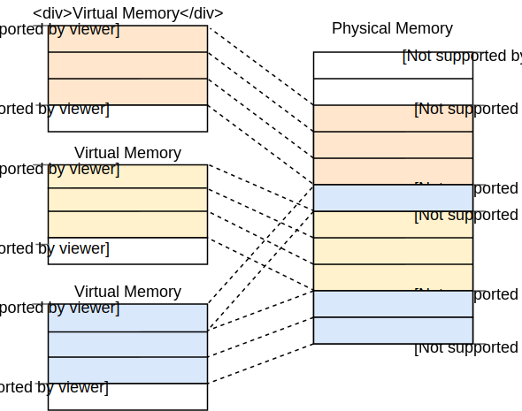

<h1>Introduction to Paging(分页介绍)</h1>

This post introduces paging, a very common memory management scheme that we will also use for our operating system. It explains why memory isolation is needed, how segmentation works, what virtual memory is, and how paging solves memory fragmentation issues. It also explores the layout of multilevel page tables on the x86_64 architecture.

本文介绍了一种常用的内存管理方案--分页技术,我们还会为我们的操作系统实现它。本文还解释了为什么需要内存隔离，分段技术如何工作，什么是虚拟内存以及分页技术如何解决了内存碎片问题。也会介绍x86_64架构下多级分页表的结构。


This blog is openly developed on GitHub. If you have any problems or questions, please open an issue there. You can also leave comments at the bottom. The complete source code for this post can be found in the post-08 branch.

这篇博客是在[GitHub](https://github.com/phil-opp/blog_os)上公开开发的。如果你有任何问题或疑问，请在那里开一个问题。你也可以在底部留下评论。
本帖的完整源代码可以在[post-08](https://github.com/phil-opp/blog_os/tree/post-08)分支中找到。


<h2>Memory Protection(内存保护)</h2>

One main task of an operating system is to isolate programs from each other. Your web browser shouldn’t be able to interfere with your text editor, for example. To achieve this goal, operating systems utilize hardware functionality to ensure that memory areas of one process are not accessible by other processes. There are different approaches depending on the hardware and the OS implementation.

操作系统一个最主要的任务就是将程序互相隔离开来。比如，我们的浏览器程序不应当能够干扰到文本编辑器程序。为了达到这个目的，操作系统会使用硬件功能来确保一个进程的内存区域不会被其他进程访问。根据硬件和操作系统的实现，有不同的方法实现。

As an example, some ARM Cortex-M processors (used for embedded systems) have a [Memory Protection Unit](https://developer.arm.com/docs/ddi0337/e/memory-protection-unit/about-the-mpu) (MPU), which allows you to define a small number (e.g., 8) of memory regions with different access permissions (e.g., no access, read-only, read-write). On each memory access, the MPU ensures that the address is in a region with correct access permissions and throws an exception otherwise. By changing the regions and access permissions on each process switch, the operating system can ensure that each process only accesses its own memory and thus isolates processes from each other.

例如，一些ARM Cortex-M 处理器(用于嵌入式系统)有一个[内存保护单元](https://developer.arm.com/docs/ddi0337/e/memory-protection-unit/about-the-mpu)，它允许我们定义少量(比如8个)具有不同访问权限的内存区域(比如 无法访问，只读，读写).每次尝试内存访问的时候，内存保护单元都会
保证访问的地址在一个具有正确访问权限的区域中，否则就会抛出一个异常。通过在进程切换的时候改变内存区域和访问权限，操作系统可以保证每个进程只能访问自己的内存区域，从而使进程之前相互隔离。

On x86, the hardware supports two different approaches to memory protection: [segmentation](https://en.wikipedia.org/wiki/X86_memory_segmentation) and [paging](https://en.wikipedia.org/wiki/Virtual_memory#Paged_virtual_memory).

在x86上，硬件支持两种不同的内存保护方法，[分段](https://en.wikipedia.org/wiki/X86_memory_segmentation)和[分页](https://en.wikipedia.org/wiki/Virtual_memory#Paged_virtual_memory)

<h2>Segmentation(分段)</h2>

Segmentation was already introduced in 1978, originally to increase the amount of addressable memory. The situation back then was that CPUs only used 16-bit addresses, which limited the amount of addressable memory to 64 KiB. To make more than these 64 KiB accessible, additional segment registers were introduced, each containing an offset address. The CPU automatically added this offset on each memory access, so that up to 1 MiB of memory was accessible.

分段技术是1978年引入的，最初是用来提高可寻址的内存数量。当时的情况是，CPU只能使用16位寻址，也就是最多可寻址内存为64KB.为了能访问超过64KB的内存，额外的段寄存器被引入了，每个寄存器都含有一个偏移地址。CPU在每次内存访问的时候都会加上这个偏移地址，这样最多就可以访问多达1MB的内存。

The segment register is chosen automatically by the CPU depending on the kind of memory access: For fetching instructions, the code segment `CS` is used, and for stack operations (push/pop), the stack segment `SS` is used. Other instructions use the data segment `DS` or the extra segment `ES`. Later, two additional segment registers, `FS` and `GS`, were added, which can be used freely.

这部分寄存器是由CPU根据访问的内存类型自动选择的:获取指令，使用代码段寄存器`CS`,为了栈操作(入栈和出栈),使用堆栈段寄存器`SS`.其他指令使用数据段寄存器`DS`或者额外段寄存器`ES`.后来又添加了两个额外的段寄存器，`FS`和`GS`,这两个可以自由使用。

In the first version of segmentation, the segment registers directly contained the offset and no access control was performed. This was changed later with the introduction of the [protected mode](https://en.wikipedia.org/wiki/X86_memory_segmentation#Protected_mode). When the CPU runs in this mode, the segment descriptors contain an index into a local or global [descriptor table](https://en.wikipedia.org/wiki/Global_Descriptor_Table), which contains – in addition to an offset address – the segment size and access permissions. By loading separate global/local descriptor tables for each process, which confine memory accesses to the process’s own memory areas, the OS can isolate processes from each other.

在分段的第一个版本中，分段寄存器直接包含了偏移量，没有进行访问控制。后来随着[保护模式](https://en.wikipedia.org/wiki/X86_memory_segmentation#Protected_mode)的引入，这种情况得到了改变。当CPU在这种模式下运行时，段描述符包含一个进入本地或全局[描述符表](https://en.wikipedia.org/wiki/Global_Descriptor_Table)的索引，该表除了包含一个偏移地址外，还包含段大小和访问权限。通过为每个进程加载单独的全局/局部描述符表，将内存访问限制在进程自己的内存区域，操作系统可以将进程相互隔离。

By modifying the memory addresses before the actual access, segmentation already employed a technique that is now used almost everywhere: virtual memory.

通过在实际访问之前修改内存地址，分段技术已经使用了一种现在几乎处处使用的技术:虚拟内存。


<h3>Virtual Memory(虚拟内存)</h3>

The idea behind virtual memory is to abstract away the memory addresses from the underlying physical storage device. Instead of directly accessing the storage device, a translation step is performed first. For segmentation, the translation step is to add the offset address of the active segment. Imagine a program accessing memory address `0x1234000` in a segment with an offset of `0x1111000`: The address that is really accessed is `0x2345000`.

虚拟内存的理念是将内存地址从底层物理存储设备中抽象出来。与其直接访问存储设备，不如先执行一个转换步骤。对于分段来说，转换步骤是添加活动段的偏移地址。想象一下，一个程序在一个偏移量为`0x1111000`的段中访问内存地址`0x1234000`：真正被访问的地址是`0x2345000`。

To differentiate the two address types, addresses before the translation are called virtual, and addresses after the translation are called physical. One important difference between these two kinds of addresses is that physical addresses are unique and always refer to the same distinct memory location. Virtual addresses, on the other hand, depend on the translation function. It is entirely possible that two different virtual addresses refer to the same physical address. Also, identical virtual addresses can refer to different physical addresses when they use different translation functions.

为了区分这两种地址类型，转换前的地址被称为虚拟地址，转换后的地址被称为物理地址。这两种地址之间的一个重要区别是，物理地址是唯一的，并且总是指向唯一的不同的内存位置。而另一方面，虚拟地址则取决于转换功能。两个不同的虚拟地址指向同一个物理地址是完全可能的。另外，相同的虚拟地址在使用不同的转换函数时可以指代不同的物理地址。

An example where this property is useful is running the same program twice in parallel:

这个特点在并行运行同一个程序两次的时候是十分有用的:


Here the same program runs twice, but with different translation functions. The first instance has a segment offset of 100, so that its virtual addresses 0–150 are translated to the physical addresses 100–250. The second instance has an offset of 300, which translates its virtual addresses 0–150 to physical addresses 300–450. This allows both programs to run the same code and use the same virtual addresses without interfering with each other.

这里就是将同一个程序运行了两次，但是经过不同的翻译转换。第一个实例的段偏移量是100，所以它的虚拟地址0-150被转换成物理地址100-250。第二个实例的偏移量为300，将其虚拟地址0-150转换为物理地址300-450。这使得两个程序可以运行相同的代码，使用相同的虚拟地址，而不会相互干扰。(编译的时候确定虚拟地址)。

Another advantage is that programs can now be placed at arbitrary physical memory locations, even if they use completely different virtual addresses. Thus, the OS can utilize the full amount of available memory without needing to recompile programs.

另一个好处是，现在程序可以被放置在任意的物理内存位置，即使它们使用完全不同的虚拟地址。因此，操作系统可以利用全部的可用内存，而不需要重新编译程序。

<h3>Fragmentation(内存碎片)</h3>

The differentiation between virtual and physical addresses makes segmentation really powerful. However, it has the problem of fragmentation. As an example, imagine that we want to run a third copy of the program we saw above:

虚拟地址和物理地址之间的区别使得分段功能非常强大。然而，它也有一个碎片化的问题。作为一个例子，想象一下，我们想运行上面看到的程序的第三个副本：


There is no way to map the third instance of the program to virtual memory without overlapping, even though there is more than enough free memory available. The problem is that we need continuous memory and can’t use the small free chunks.

虽有有足够多的可用内存，但是我们没有办法在不重叠的情况下将程序的第三个实例映射到(前两个实例间隔未使用)的虚拟内存中，问题是因为我们需要连续的内存，而不能使用小的空闲块。

One way to combat this fragmentation is to pause execution, move the used parts of the memory closer together, update the translation, and then resume execution:

对付这种碎片化的方法之一是暂停执行，将使用过的内存部分移近，更新转换，然后恢复执行:


Now there is enough continuous space to start the third instance of our program.

现在有足够的连续内存空间来启动我们程序的第三个实例。

The disadvantage of this defragmentation process is that it needs to copy large amounts of memory, which decreases performance. It also needs to be done regularly before the memory becomes too fragmented. This makes performance unpredictable since programs are paused at random times and might become unresponsive.

这个碎片整理过程的缺点是，它需要复制大量的内存，这降低了性能。它还需要在内存变得过于碎片化之前定期进行。这使得性能变得不可预测，因为程序会在随机时间暂停，并可能失去响应。

The fragmentation problem is one of the reasons that segmentation is no longer used by most systems. In fact, segmentation is not even supported in 64-bit mode on x86 anymore. Instead, paging is used, which completely avoids the fragmentation problem.


碎片化问题是大多数系统不再使用分段的原因之一。事实上，在x86的64位模式下，分段甚至不再被支持。取而代之的是使用分页--一种能几乎完全避免了碎片化问题的技术。

<h2>Paging(分页)</h2>

The idea is to divide both the virtual and physical memory space into small, fixed-size blocks. The blocks of the virtual memory space are called pages, and the blocks of the physical address space are called frames. Each page can be individually mapped to a frame, which makes it possible to split larger memory regions across non-continuous physical frames.

这个技术的想法是将虚拟和物理内存空间划分为小的、固定大小的块。虚拟内存空间的块被称为页，而物理地址空间的块被称为帧。每个页都可以单独映射到一个帧，这使得在非连续的物理帧中(物理内存中)划分出更大的内存区域成为可能。

The advantage of this becomes visible if we recap the example of the fragmented memory space, but use paging instead of segmentation this time:

如果我们回顾一下碎片化内存空间的例子，但这次使用分页而不是分段，这样做的优势就会显现出来:




In this example, we have a page size of 50 bytes, which means that each of our memory regions is split across three pages. Each page is mapped to a frame individually, so a continuous virtual memory region can be mapped to non-continuous physical frames. This allows us to start the third instance of the program without performing any defragmentation before.

在这个例子中，我们的页大小为50字节，这意味着我们的每个内存区域被分成三个页。每个页都被单独映射到一个帧，所以一个连续的虚拟内存区域可以被映射到非连续的物理帧。这使得我们可以在之前不进行任何碎片整理的情况下启动程序的第三个实例。

<h3>Hidden Fragmentation(潜在碎片)</h3>

Compared to segmentation, paging uses lots of small, fixed-sized memory regions instead of a few large, variable-sized regions. Since every frame has the same size, there are no frames that are too small to be used, so no fragmentation occurs.

与分段技术相比，分页技术使用很多小的、固定大小的内存区域，而不是几个大的、可变大小的区域。由于每一帧都有相同的大小，没有太小的帧可以使用，所以不会发生碎片化。

Or it seems like no fragmentation occurs. There is still some hidden kind of fragmentation, the so-called internal fragmentation. Internal fragmentation occurs because not every memory region is an exact multiple of the page size. Imagine a program of size 101 in the above example: It would still need three pages of size 50, so it would occupy 49 bytes more than needed. To differentiate the two types of fragmentation, the kind of fragmentation that happens when using segmentation is called external fragmentation.

或者说，看起来没有碎片化发生。仍然有一些隐藏的碎片，即所谓的内部碎片。内部碎片的发生是因为并非每个内存区域都是页大小的精确倍数。想象一下，在上面的例子中，一个大小为101的程序。它仍然需要三个大小为50的页，所以它占用的字节数会比需要的多49个。为了区分这两种类型的碎片，使用分段时发生的那种碎片被称为外部碎片。


Internal fragmentation is unfortunate but often better than the external fragmentation that occurs with segmentation. It still wastes memory, but does not require defragmentation and makes the amount of fragmentation predictable (on average half a page per memory region).

内部碎片是不幸的，但往往比分段时发生的外部碎片要好。它仍然浪费内存，但不需要碎片整理，并使碎片的数量大小可以预测（平均每个内存区域有半页）。

<h3>Page Tables(页表)</h3>


We saw that each of the potentially millions of pages is individually mapped to a frame. This mapping information needs to be stored somewhere. Segmentation uses an individual segment selector register for each active memory region, which is not possible for paging since there are way more pages than registers. Instead, paging uses a table structure called page table to store the mapping information.


我们看到，潜在的数百万个页中的每一个都被单独映射到内存帧中。这种映射信息需要被储存在某个地方。分段为每个活动的内存区域使用单独的段选择器寄存器，这在分页法中是不可能的，因为页比寄存器多得多。相反，分页使用一个叫做页表的表结构来存储映射信息。

For our above example, the page tables would look like this:

对于我们上面的例子，页表看起来是这样的:


We see that each program instance has its own page table. A pointer to the currently active table is stored in a special CPU register. On `x86`, this register is called `CR3`. It is the job of the operating system to load this register with the pointer to the correct page table before running each program instance.

我们看到，每个程序实例都有自己的页表。一个指向当前活动表的指针被存储在一个特殊的CPU寄存器中。在`X86`上，这个寄存器被称为`CR3`。操作系统的工作是在运行每个程序实例之前加载这个含有正确页表指针的寄存器。

On each memory access, the CPU reads the table pointer from the register and looks up the mapped frame for the accessed page in the table. This is entirely done in hardware and completely invisible to the running program. To speed up the translation process, many CPU architectures have a special cache that remembers the results of the last translations.

在每次内存访问时，CPU从寄存器中读取表的指针，并在表中查找被访问页的映射帧。这完全是在硬件中完成的，对运行中的程序来说完全不可见。为了加快转换过程，许多CPU架构有一个特殊的缓存，可以记住最后一次转换的结果。

Depending on the architecture, page table entries can also store attributes such as access permissions in a flags field. In the above example, the “r/w” flag makes the page both readable and writable.

根据架构的不同，页表项也可以在标志字段中存储诸如访问权限等属性。在上面的例子中，"r/w "标志使该页既可读又可写。

<h3>Multilevel Page Tables(多级页表)</h3>


The simple page tables we just saw have a problem in larger address spaces: they waste memory. For example, imagine a program that uses the four virtual pages `0`, `1_000_000`, `1_000_050`, and `1_000_100` (we use `_` as a thousands separator):

我们刚才看到的简单的页表在较大的寻址空间里有一个问题：它们浪费内存。例如，设想一个使用`0`、`1_000_000`、`1_000_050`和`1_000_100`四个虚拟页的程序（我们用`_`作为千位分隔符）:


It only needs 4 physical frames, but the page table has over a million entries. We can’t omit the empty entries because then the CPU would no longer be able to jump directly to the correct entry in the translation process (e.g., it is no longer guaranteed that the fourth page uses the fourth entry).

它只需要4个物理帧，但页表有超过一百万个条目。我们不能省略空条目，因为那样的话，CPU将不再能够在转换过程中直接跳到正确的条目（例如，不再保证第四页使用第四条）（通过index寻址的 省略就不对了）。

To reduce the wasted memory, we can use a **two-level page table**. The idea is that we use different page tables for different address regions. An additional table called level 2 page table contains the mapping between address regions and (level 1) page tables.

为了减少内存的浪费，我们可以使用一个**两级页表**。这个想法是，我们为不同的地址区域使用不同的页表。一个叫做二级页表的附加表包含了地址区域和（一级）页表之间的映射。

This is best explained by an example. Let’s define that each level 1 page table is responsible for a region of size `10_000`. Then the following tables would exist for the above example mapping:

这一点用一个例子来解释。让我们定义一下，每个1级页表负责一个大小为`10_000`的区域。那么，在上述例子的映射中，将存在以下的表：


Page 0 falls into the first `10_000` byte region, so it uses the first entry of the level 2 page table. This entry points to level 1 page table T1, which specifies that page `0` points to frame `0`.

第0页落在第一个`10_000`字节区域，所以它使用了2级页表的第一个条目。这个条目指向第1级页表T1，它规定第`0`页指向第`0`帧。

The pages `1_000_000`, `1_000_050`, and `1_000_100` all fall into the 100th `10_000` byte region, so they use the 100th entry of the level 2 page table. This entry points to a different level 1 page table T2, which maps the three pages to frames `100`, `150`, and `200`. Note that the page address in level 1 tables does not include the region offset. For example, the entry for page `1_000_050` is just 50.

`1_000_000`、`1_000_050`和`1_000_100`页都属于第100个`10_000`字节区域，所以它们使用第二级页表的第100个条目。这个条目指向一个不同的1级页表T2，它将这三个页映射到帧`100`、`150`和`200`。注意，1级表中的页地址不包括区域(段)偏移。例如，`1_000_050`页的条目只有`50`。

We still have 100 empty entries in the level 2 table, but much fewer than the million empty entries before. The reason for these savings is that we don’t need to create level 1 page tables for the unmapped memory regions between `10_000` and `1_000_000`.

我们在第2级表中仍有100个空条目，但比之前的一百万个空条目少得多。这些节省的原因是我们不需要为`10_000`和`1_000_000`之间未映射的内存区域创建一级页表。

The principle of two-level page tables can be extended to three, four, or more levels. Then the page table register points to the highest level table, which points to the next lower level table, which points to the next lower level, and so on. The level 1 page table then points to the mapped frame. The principle in general is called a multilevel or hierarchical page table.

两级页表的原理可以扩展到三级、四级或更多级。然后页表寄存器指向最高级别的表，该表指向下一个低级别的表，下一级别的表指向更下一个低级别，以此类推。然后，第一级页表指向映射的帧。一般来说，这个原理被称为多级或分层页表。

Now that we know how paging and multilevel page tables work, we can look at how paging is implemented in the x86_64 architecture (we assume in the following that the CPU runs in 64-bit mode).


现在我们知道了分页和多级页表的工作原理，我们可以看看分页是如何在x86_64架构中实现的（我们在下文中假设CPU运行在64位模式）。

<h2>Paging on x86_64(x86_64上的分页)</h2>

The x86_64 architecture uses a 4-level page table and a page size of 4 KiB. Each page table, independent of the level, has a fixed size of 512 entries. Each entry has a size of 8 bytes, so each table is 512 * 8 B = 4 KiB large and thus fits exactly into one page.

x86_64架构使用一个4级页表，页大小为4KiB。每个页表，与级别无关，都有固定的512个条目。每个条目的大小为8字节，所以每个表的大小为512 * 8 B = 4 KiB，因此正好适合于一个页。


The page table index for each level is derived directly from the virtual address:

每个级别的页表索引是直接从虚拟地址中得到的:


We see that each table index consists of 9 bits, which makes sense because each table has 2^9 = 512 entries. The lowest 12 bits are the offset in the 4 KiB page (2^12 bytes = 4 KiB). Bits 48 to 64 are discarded, which means that x86_64 is not really 64-bit since it only supports 48-bit addresses.

我们看到每个表的索引由9位组成，这很合理，因为每个表有2^9=512个条目。最低的12位是4KiB页中的偏移量（2^12字节=4KiB）。第48到64位被忽略，这意味着x86_64不是真正的64位，因为它只支持48位地址。

Even though bits 48 to 64 are discarded, they can’t be set to arbitrary values. Instead, all bits in this range have to be copies of bit 47 in order to keep addresses unique and allow future extensions like the 5-level page table. This is called sign-extension because it’s very similar to the [sign extension in two’s complement](https://en.wikipedia.org/wiki/Two's_complement#Sign_extension). When an address is not correctly sign-extended, the CPU throws an exception.


即使第48到64位被忽略，它们也不能被设置成任意的值。相反，这个范围内的所有位都必须是第47位值的复制，以保持地址的唯一性并允许未来的扩展，如5级页表。这被称为符号扩展，因为它与[二进制补码](https://en.wikipedia.org/wiki/Two's_complement#Sign_extension)中的符号扩展非常相似。当一个地址没有得到正确的符号扩展时，CPU会抛出一个异常。

It’s worth noting that the recent “Ice Lake” Intel CPUs optionally support [5-level page tables](https://en.wikipedia.org/wiki/Intel_5-level_paging) to extend virtual addresses from 48-bit to 57-bit. Given that optimizing our kernel for a specific CPU does not make sense at this stage, we will only work with standard 4-level page tables in this post.


值得注意的是，最近英特尔的 “Ice Lake” CPU可以选择支持[5级页表](https://en.wikipedia.org/wiki/Intel_5-level_paging)，将虚拟地址从48位扩展到57位。鉴于在这个阶段为特定的CPU优化我们的内核是没有意义的，在这篇文章中我们将只使用标准的4级页表。


<h3>Example Translation(地址转换示例)</h3>

Let’s go through an example to understand how the translation process works in detail:

让我们看一个例子，以详细了解转换过程的原理：


The physical address of the currently active level 4 page table, which is the root of the 4-level page table, is stored in the `CR3` register. Each page table entry then points to the physical frame of the next level table. The entry of the level 1 table then points to the mapped frame. Note that all addresses in the page tables are physical instead of virtual, because otherwise the CPU would need to translate those addresses too (which could cause a never-ending recursion).

当前活动的4级页表的物理地址，也就是4级页表结构的根节点，存放在`CR3`寄存器中。然后，每个页表条目都指向下一级表的物理帧。最后，1级页表的条目指向地址映射的帧。请注意，页表中的所有地址都是物理地址，而不是虚拟地址，否则CPU也需要转换这些地址（而这可能导致无限递归）。

The above page table hierarchy maps two pages (in blue). From the page table indices, we can deduce that the virtual addresses of these two pages are `0x803FE7F000` and `0x803FE00000`. Let’s see what happens when the program tries to read from address `0x803FE7F5CE`. First, we convert the address to binary and determine the page table indices and the page offset for the address:

上面的页表层次结构映射了两个页（蓝色）。从页表索引中，我们可以推断出这两个页的虚拟地址为`0x803FE7F000`和`0x803FE00000`。现在，让我们看看当程序尝试读取地址`0x803FE7F5CE`时会发生什么。首先，我们将地址转换为二进制，并确定该地址的页表索引和页偏移量：


With these indices, we can now walk the page table hierarchy to determine the mapped frame for the address:

- We start by reading the address of the level 4 table out of the `CR3` register.
- The level 4 index is 1, so we look at the entry with index 1 of that table, which tells us that the level 3 table is stored at address 16 KiB.
- We load the level 3 table from that address and look at the entry with index 0, which points us to the level 2 table at 24 KiB.
- The level 2 index is 511, so we look at the last entry of that page to find out the address of the level 1 table.
- Through the entry with index 127 of the level 1 table, we finally find out that the page is mapped to frame 12 KiB, or 0x3000 in hexadecimal.
- The final step is to add the page offset to the frame address to get the physical address 0x3000 + 0x5ce = 0x35ce.

有了这些索引，我们现在可以遍历页表层次，确定该地址映射的物理帧:

- 我们首先从`CR3`寄存器中读取第4级页表地址。
- 4级页表索引为1，于是我们查看表中索引为1的条目，该条目告诉我们3级页表存储在地址16KiB中。
- 我们从该地址加载3级表，然后查看索引为0的条目，该条目告诉我们2级页表存储在地址24KiB中。
- 2级页表的索引为511，于是我们查看该表的最后一个条目，以查找1级表的地址。
- 通过1级页表中索引为127的条目，最终找到页映射到12KiB帧，即十六进制的0x3000。
- 最后一步，将页偏移量添加到帧地址上，获取的物理地址为0x3000 + 0x5ce = 0x35ce。


The permissions for the page in the level 1 table are `r`, which means read-only. The hardware enforces these permissions and would throw an exception if we tried to write to that page. Permissions in higher level pages restrict the possible permissions in lower levels, so if we set the level 3 entry to read-only, no pages that use this entry can be writable, even if lower levels specify read/write permissions.


1级页表中页的权限为`r`，即只读。硬件会强制执行这些权限，如果我们尝试对该页写入，将会引发异常。较高级别页中的权限限制了较低级别中的可能权限，因此，如果我们将3级页表中的条目设置为只读，则即使较低级页指定了读/写权限，使用该条目的页也将无法执行写入。


It’s important to note that even though this example used only a single instance of each table, there are typically multiple instances of each level in each address space. At maximum, there are:

- one level 4 table,
- 512 level 3 tables (because the level 4 table has 512 entries),
- 512 * 512 level 2 tables (because each of the 512 level 3 tables has 512 entries), and
- 512 * 512 * 512 level 1 tables (512 entries for each level 2 table).

值得注意的是，尽管这个例子只使用了每个表的一个实例，但在每个地址空间中，每个级别通常有多个实例。最多有:

- 一个4级页表，
- 512个3级表（因为4级表有512个条目），
- 512 * 512个2级表（因为512个3级表中的每个表都有512个条目），并且还有
- 512 * 512 * 512个1级表（每个2级表都有512个条目）。


<h3>Page Table Format(页表格式)</h3>

Page tables on the x86_64 architecture are basically an array of 512 entries. In Rust syntax:

x86_64架构上的页表基本上是具有512个条目的数组。使用Rust语法就是：

```rust
#[repr(align(4096))]
pub struct PageTable {
    entries: [PageTableEntry; 512],
}
```

As indicated by the `repr` attribute, page tables need to be page-aligned, i.e., aligned on a 4 KiB boundary. This requirement guarantees that a page table always fills a complete page and allows an optimization that makes entries very compact.

如`repr`属性所示，页表需要进行页对齐，即在4KiB边界上对齐。此要求确保页表恰好能填满一页，同时允许优化以使条目更紧凑。

Each entry is 8 bytes (64 bits) large and has the following format:

| Bit(s) | Name                  | Meaning                                                                                      |
| ------ | --------------------- | -------------------------------------------------------------------------------------------- |
| 0      | present               | the page is currently in memory                                                              |
| 1      | writable              | it’s allowed to write to this page                                                           |
| 2      | user accessible       | if not set, only kernel mode code can access this page                                       |
| 3      | write-through caching | writes go directly to memory                                                                 |
| 4      | disable cache         | no cache is used for this page                                                               |
| 5      | accessed              | the CPU sets this bit when this page is used                                                 |
| 6      | dirty                 | the CPU sets this bit when a write to this page occurs                                       |
| 7      | huge page/null        | must be 0 in P1 and P4, creates a 1 GiB page in P3, creates a 2 MiB page in P2               |
| 8      | global                | page isn’t flushed from caches on address space switch (PGE bit of CR4 register must be set) |
| 9-11   | available             | can be used freely by the OS                                                                 |
| 12-51  | physical address      | the page aligned 52bit physical address of the frame or the next page table                  |
| 52-62  | available             | can be used freely by the OS                                                                 |
| 63     | no execute            | forbid executing code on this page (the NXE bit in the EFER register must be set)            |


We see that only bits 12–51 are used to store the physical frame address. The remaining bits are used as flags or can be freely used by the operating system. This is possible because we always point to a 4096-byte aligned address, either to a page-aligned page table or to the start of a mapped frame. This means that bits 0–11 are always zero, so there is no reason to store these bits because the hardware can just set them to zero before using the address. The same is true for bits 52–63, because the x86_64 architecture only supports 52-bit physical addresses (similar to how it only supports 48-bit virtual addresses).

我们看到，只有第12-51位是用来存储物理帧地址的。其余的位被用作标志位或者可以被操作系统自由使用。这是可能的，因为我们总是指向一个4096字节的对齐地址，或者指向一个页对齐的页表，或者指向一个映射帧的开始。这意味着第0-11位总是零，所以没有理由存储这些位，因为硬件可以在使用地址之前直接将它们设置为零。第52-63位也是如此，因为x86_64架构只支持52位物理地址（类似于它只支持48位虚拟地址）。

Let’s take a closer look at the available flags:

- The `present` flag differentiates mapped pages from unmapped ones. It can be used to temporarily swap out pages to disk when the main memory becomes full. When the page is accessed subsequently, a special exception called page fault occurs, to which the operating system can react by reloading the missing page from disk and then continuing the program.
- The `writable` and `no execute` flags control whether the contents of the page are writable or contain executable instructions, respectively.
- The `accessed` and `dirty` flags are automatically set by the CPU when a read or write to the page occurs. This information can be leveraged by the operating system, e.g., to decide which pages to swap out or whether the page contents have been modified since the last save to disk.
- The `write-through caching` and `disable cache` flags allow the control of caches for every page individually.
- The `user accessible` flag makes a page available to userspace code, otherwise, it is only accessible when the CPU is in kernel mode. This feature can be used to make [system calls](https://en.wikipedia.org/wiki/System_call) faster by keeping the kernel mapped while a userspace program is running. However, the Spectre vulnerability can allow userspace programs to read these pages nonetheless.
- The `global` flag signals to the hardware that a page is available in all address spaces and thus does not need to be removed from the translation cache (see the section about the TLB below) on address space switches. This flag is commonly used together with a cleared `user accessible` flag to map the kernel code to all address spaces.
- The `huge page` flag allows the creation of pages of larger sizes by letting the entries of the level 2 or level 3 page tables directly point to a mapped frame. With this bit set, the page size increases by factor 512 to either 2 MiB = 512 * 4 KiB for level 2 entries or even 1 GiB = 512 * 2 MiB for level 3 entries. The advantage of using larger pages is that fewer lines of the translation cache and fewer page tables are needed.


让我们仔细看看可用的标志：

- `present`标志将被映射页与未被映射页区别开来。当主内存已满时，它可用于临时将页换出到磁盘。当随后访问到该页时，将会发生称为页错误的特殊异常，操作系统将对此做出反应——从磁盘重新加载缺失的页——然后继续执行程序。
- `writable`和`no execute`标志分别控制页的内容是可写，还是包含可执行指令。
- 当对页被读取或写入时，CPU会自动设置`accessed`或`dirty`标志。该信息可以被操作系统利用，例如，在决定换出哪些页时，或者确定自上次保存到磁盘以来内容是否已被修改。
- `write through caching`和`disable cache`标志允许控制每个页的缓存。
- `user accessible`标志使页可用于用户空间代码，否则仅当CPU处于内核模式时才可被访问。该特性使得CPU可以在运行用户空间程序时保持内核映射，该功能用于加快[系统调用](https://en.wikipedia.org/wiki/System_call)的速度。但是，[Spectre](https://en.wikipedia.org/wiki/Spectre_(security_vulnerability))漏洞仍然能够允许用户空间程序读取这些页。
- `global`标志向硬件发出信号，表明该页在所有地址空间中都可用，因此不需要在地址空间切换时将其从转换缓存中删除（请参阅下文中有关TLB的部分）。该标志通常与被置为0的`user accessible`标志一起使用，用以将内核代码映射到所有地址空间。
- `huge page`标志允许通过使2级或3级页表的条目直接指向映射的帧，来创建更大尺寸的页。设置此位后，对于第2级条目，页大小将增加512倍，达到2MiB = 512 * 4KiB，对于第3级条目，甚至能够达到1GiB = 512 * 2MiB。使用较大页的优点是需要更少的地址转换缓存行和更少的页表。


The `x86_64` crate provides types for [page tables](https://docs.rs/x86_64/0.14.2/x86_64/structures/paging/page_table/struct.PageTable.html) and their [entries](https://docs.rs/x86_64/0.14.2/x86_64/structures/paging/page_table/struct.PageTableEntry.html), so we don’t need to create these structures ourselves.


`x86_64` crate提供了[页表](https://docs.rs/x86_64/0.14.2/x86_64/structures/paging/page_table/struct.PageTable.html)及其[条目](https://docs.rs/x86_64/0.14.2/x86_64/structures/paging/page_table/struct.PageTableEntry.html)的类型，因此我们不需要自己创建这些结构。


<h3>The Translation Lookaside Buffer(转换缓存区域)</h3>

A 4-level page table makes the translation of virtual addresses expensive because each translation requires four memory accesses. To improve performance, the x86_64 architecture caches the last few translations in the so-called translation lookaside buffer (TLB). This allows skipping the translation when it is still cached.

4级页表使虚拟地址的转换变得耗时，因为每次转换都需要4次内存访问。为了提高性能，x86_64架构将最后的几个转换缓存在所谓的转换缓存区（TLB）中。当转换结果被缓存时，允许跳过转换。

Unlike the other CPU caches, the TLB is not fully transparent and does not update or remove translations when the contents of page tables change. This means that the kernel must manually update the TLB whenever it modifies a page table. To do this, there is a special CPU instruction called [invlpg](https://www.felixcloutier.com/x86/INVLPG.html)(“invalidate page”) that removes the translation for the specified page from the TLB, so that it is loaded again from the page table on the next access. The TLB can also be flushed completely by reloading the CR3 register, which simulates an address space switch. The `x86_64` crate provides Rust functions for both variants in the [tlb module](https://docs.rs/x86_64/0.14.2/x86_64/instructions/tlb/index.html).

不像其他CPU缓存，TLB不是完全透明的，当页表的内容发生变化时，TLB不会更新或删除转换。这意味着，每当内核修改一个页表时，必须手动更新TLB。为了做到这一点，有一条特殊的CPU指令叫做[invlpg](https://www.felixcloutier.com/x86/INVLPG.html)（"无效页"），它可以从TLB中删除指定页的转换，这样在下次访问时就可以从页表中再次加载。TLB也可以通过重新加载`CR3`寄存器来完全刷新，这模拟了一个地址空间的切换。`x86_64`板块在[tlb模块](https://docs.rs/x86_64/0.14.2/x86_64/instructions/tlb/index.html)中为这两种操作提供了Rust函数。

It is important to remember to flush the TLB on each page table modification because otherwise, the CPU might keep using the old translation, which can lead to non-deterministic bugs that are very hard to debug.

记住在每次修改页表时刷新TLB是很重要的，因为否则，CPU可能会继续使用旧的转换，这可能会导致非确定性的bug，这是很难调试的。


<h2>Implementation(实现)</h2>


One thing that we did not mention yet: **Our kernel already runs on paging**. The bootloader that we added in the [“A minimal Rust Kernel”](https://os.phil-opp.com/minimal-rust-kernel/#creating-a-bootimage) post has already set up a 4-level paging hierarchy that maps every page of our kernel to a physical frame. The bootloader does this because paging is mandatory in 64-bit mode on x86_64.

有一件事我们还没有提到:**我们的内核已经在分页上运行了**。我们在 ["A minimal Rust Kernel"](https://os.phil-opp.com/minimal-rust-kernel/#creating-a-bootimage)一文中添加的bootloader已经建立了一个4级分页层次结构，将我们内核的每一页都映射到一个物理帧。Bootloader这样做是因为在x86_64的64位模式下分页是强制性的。


This means that every memory address that we used in our kernel was a virtual address. Accessing the VGA buffer at address `0xb8000` only worked because the bootloader identity mapped that memory page, which means that it mapped the virtual page `0xb8000` to the physical frame `0xb8000`.

这意味着我们在内核中使用的每个内存地址都是一个虚拟地址。访问地址为`0xb8000`的VGA缓冲区只是因为bootloader一致(等价)映射了该内存页，这意味着它将虚拟页`0xb8000`映射到物理帧`0xb8000`上。

Paging makes our kernel already relatively safe, since every memory access that is out of bounds causes a page fault exception instead of writing to random physical memory. The bootloader even sets the correct access permissions for each page, which means that only the pages containing code are executable and only data pages are writable.

分页使我们的内核已经相对安全了，因为每一次内存访问出界都会导致一个页故障异常，而不是写到随机的物理内存。Bootloader甚至为每个页设置了正确的访问权限，这意味着只有包含代码的页是可执行的，只有数据页是可写的。

<h3>Page Faults</h3>

Let’s try to cause a page fault by accessing some memory outside of our kernel. First, we create a page fault handler and register it in our IDT, so that we see a page fault exception instead of a generic [double fault](https://os.phil-opp.com/double-fault-exceptions/):

让我们试着通过访问内核外的一些内存来引起一个页故障。首先，我们创建一个页故障处理程序并在IDT中注册，这样我们就会看到一个页故障异常，而不是一般的[双重故障](https://os.phil-opp.com/double-fault-exceptions/)。

```rust
// in src/interrupts.rs

lazy_static! {
    static ref IDT: InterruptDescriptorTable = {
        let mut idt = InterruptDescriptorTable::new();

        […]

        idt.page_fault.set_handler_fn(page_fault_handler); // new

        idt
    };
}

use x86_64::structures::idt::PageFaultErrorCode;
use crate::hlt_loop;

extern "x86-interrupt" fn page_fault_handler(
    stack_frame: InterruptStackFrame,
    error_code: PageFaultErrorCode,
) {
    use x86_64::registers::control::Cr2;

    println!("EXCEPTION: PAGE FAULT");
    println!("Accessed Address: {:?}", Cr2::read());
    println!("Error Code: {:?}", error_code);
    println!("{:#?}", stack_frame);
    hlt_loop();
}

```


The [CR2](https://en.wikipedia.org/wiki/Control_register#CR2) register is automatically set by the CPU on a page fault and contains the accessed virtual address that caused the page fault. We use the [Cr2::read](https://docs.rs/x86_64/0.14.2/x86_64/registers/control/struct.Cr2.html#method.read) function of the `x86_64` crate to read and print it. The [PageFaultErrorCode](https://docs.rs/x86_64/0.14.2/x86_64/structures/idt/struct.PageFaultErrorCode.html) type provides more information about the type of memory access that caused the page fault, for example, whether it was caused by a read or write operation. For this reason, we print it too. We can’t continue execution without resolving the page fault, so we enter a [hlt_loop](https://os.phil-opp.com/hardware-interrupts/#the-hlt-instruction) at the end.

[CR2](https://en.wikipedia.org/wiki/Control_register#CR2)寄存器在发生页故障时由CPU自动设置，包含引起页故障的被访问的虚拟地址。我们使用`x86_64`板块的[Cr2::read](https://docs.rs/x86_64/0.14.2/x86_64/registers/control/struct.Cr2.html#method.read)函数来读取和打印它。[PageFaultErrorCode](https://docs.rs/x86_64/0.14.2/x86_64/structures/idt/struct.PageFaultErrorCode.html)类型提供了更多关于引起页故障的内存访问类型的信息，例如，它是由读或写操作引起的。出于这个原因，我们也打印它。如果不解决页故障，我们就不能继续执行，所以我们在最后进入一个[hlt_loop](https://os.phil-opp.com/hardware-interrupts/#the-hlt-instruction)。

Now we can try to access some memory outside our kernel:

现在我们可以尝试访问内核外的一些内存：

```rust
// in src/main.rs

#[no_mangle]
pub extern "C" fn _start() -> ! {
    println!("Hello World{}", "!");

    blog_os::init();

    // new
    let ptr = 0xdeadbeaf as *mut u32;
    unsafe { *ptr = 42; }

    // as before
    #[cfg(test)]
    test_main();

    println!("It did not crash!");
    blog_os::hlt_loop();
}
```


When we run it, we see that our page fault handler is called:

运行内核，可以看到页错误处理程序被调用：


The `CR2` register indeed contains `0xdeadbeaf`, the address that we tried to access. The error code tells us through the [CAUSED_BY_WRITE](https://docs.rs/x86_64/0.14.2/x86_64/structures/idt/struct.PageFaultErrorCode.html#associatedconstant.CAUSED_BY_WRITE) that the fault occurred while trying to perform a write operation. It tells us even more through the [bits that are not set](https://docs.rs/x86_64/0.14.2/x86_64/structures/idt/struct.PageFaultErrorCode.html). For example, the fact that the `PROTECTION_VIOLATION` flag is not set means that the page fault occurred because the target page wasn’t present.


`CR2`寄存器确实包含`0xdeadbeaf`，即我们试图访问的地址。错误代码通过[CAUSED_BY_WRITE](https://docs.rs/x86_64/0.14.2/x86_64/structures/idt/struct.PageFaultErrorCode.html#associatedconstant.CAUSED_BY_WRITE)告诉我们，故障发生在试图执行写操作的时候。它通过[没有被设置的位](https://docs.rs/x86_64/0.14.2/x86_64/structures/idt/struct.PageFaultErrorCode.html)告诉我们更多。例如，`PROTECTION_VIOLATION`标志没有被设置，这意味着页故障的发生是因为目标页不存在。


We see that the current instruction pointer is `0x2031b2`, so we know that this address points to a code page. Code pages are mapped read-only by the bootloader, so reading from this address works but writing causes a page fault. You can try this by changing the `0xdeadbeaf` pointer `to 0x2031b2`:

我们看到当前指令指针是`0x2031b2`，因此我们知道该地址指向代码页。bootloader将代码页映射为只读，因此从该地址读取是允许的，但写入会导致页错误。您可以通过将`0xdeadbeaf`指针更改为`0x2031b2`来尝试此操作：

```rust
// Note: The actual address might be different for you. Use the address that
// your page fault handler reports.
let ptr = 0x2031b2 as *mut u32;

// read from a code page
unsafe { let x = *ptr; }
println!("read worked");

// write to a code page
unsafe { *ptr = 42; }
println!("write worked");
```


By commenting out the last line, we see that the read access works, but the write access causes a page fault:

可以看到读取访问有效，但是写入访问导致页错误：


We see that the “read worked” message is printed, which indicates that the read operation did not cause any errors. However, instead of the “write worked” message, a page fault occurs. This time the [PROTECTION_VIOLATION](https://docs.rs/x86_64/0.14.2/x86_64/structures/idt/struct.PageFaultErrorCode.html#associatedconstant.PROTECTION_VIOLATION) flag is set in addition to the [CAUSED_BY_WRITE](https://docs.rs/x86_64/0.14.2/x86_64/structures/idt/struct.PageFaultErrorCode.html#associatedconstant.CAUSED_BY_WRITE) flag, which indicates that the page was present, but the operation was not allowed on it. In this case, writes to the page are not allowed since code pages are mapped as read-only.

我们看到了“read worked”，这表明读操作没有引起任何错误。但是，并没有看到“write worked”，就发生页错误。这次除了设置了[CAUSED_BY_WRITE](https://docs.rs/x86_64/0.14.2/x86_64/structures/idt/struct.PageFaultErrorCode.html#associatedconstant.CAUSED_BY_WRITE)标志外，还设置了[PROTECTION_VIOLATION](https://docs.rs/x86_64/0.14.2/x86_64/structures/idt/struct.PageFaultErrorCode.html#associatedconstant.PROTECTION_VIOLATION)标志，该标志说明被访问的页存在，但对该页进行的操作却并不被允许。在上面的例子中，由于代码页被映射为只读，因此对该页进行的写操作不会被允许。


<h3>Accessing the Page Tables(访问页表)</h3>

Let’s try to take a look at the page tables that define how our kernel is mapped:

尝试观察一下定义我们内核如何进行映射的页表：

```rust
// in src/main.rs

#[no_mangle]
pub extern "C" fn _start() -> ! {
    println!("Hello World{}", "!");

    blog_os::init();

    use x86_64::registers::control::Cr3;

    let (level_4_page_table, _) = Cr3::read();
    println!("Level 4 page table at: {:?}", level_4_page_table.start_address());

    […] // test_main(), println(…), and hlt_loop()
}
```


The [Cr3::read](https://docs.rs/x86_64/0.14.2/x86_64/registers/control/struct.Cr3.html#method.read) function of the `x86_64` returns the currently active level 4 page table from the `CR3` register. It returns a tuple of a [PhysFrame](https://docs.rs/x86_64/0.14.2/x86_64/structures/paging/frame/struct.PhysFrame.html) and a [Cr3Flags](https://docs.rs/x86_64/0.14.2/x86_64/registers/control/struct.Cr3Flags.html) type. We are only interested in the frame, so we ignore the second element of the tuple.

`x86_64`中的[Cr3::read](https://docs.rs/x86_64/0.14.2/x86_64/registers/control/struct.Cr3.html#method.read)函数返回`CR3`寄存器中的当前活动的4级页表。函数返回一个由[PhysFrame](https://docs.rs/x86_64/0.14.2/x86_64/structures/paging/frame/struct.PhysFrame.html)和[Cr3Flags](https://docs.rs/x86_64/0.14.2/x86_64/registers/control/struct.Cr3Flags.html)类型组成的元组。 我们只对这个帧感兴趣，于是忽略了元组的第二个元素。

When we run it, we see the following output:

运行后可以看到以下输出：


```Level 4 page table at: PhysAddr(0x1000)```


So the currently active level 4 page table is stored at address `0x1000` in physical memory, as indicated by the [PhysAddr](https://docs.rs/x86_64/0.14.2/x86_64/addr/struct.PhysAddr.html) wrapper type. The question now is: how can we access this table from our kernel?


所以当前活动的第4级页表存储在物理内存的`0x1000`中，如其封装类型[PhysAddr](https://docs.rs/x86_64/0.14.2/x86_64/addr/struct.PhysAddr.html)所示。现在的问题是：如何从内核访问该表？

Accessing physical memory directly is not possible when paging is active, since programs could easily circumvent memory protection and access the memory of other programs otherwise. So the only way to access the table is through some virtual page that is mapped to the physical frame at address `0x1000`. This problem of creating mappings for page table frames is a general problem since the kernel needs to access the page tables regularly, for example, when allocating a stack for a new thread.

当分页处于活动状态时，无法直接访问物理内存，不然的话程序将很容易避开内存保护去访问其他程序的内存。因此，访问该表的唯一方法是通过某些虚拟页，该虚拟页映射到地址为`0x1000`的物理帧。为页表帧创建映射这个问题是个普遍的问题，因为内核需要定期访问页表，例如在为新线程分配栈时。

Solutions to this problem are explained in detail in the next post.

在下一篇文章中将详细说明该问题的解决方案。

<h2>Summary(总结)</h2>

This post introduced two memory protection techniques: segmentation and paging. While the former uses variable-sized memory regions and suffers from external fragmentation, the latter uses fixed-sized pages and allows much more fine-grained control over access permissions.

本文介绍了两种内存保护技术：分段和分页。前者使用可变大小的内存区域但存在外部碎片的问题，而后者使用固定大小的页同时允许对访问权限进行更细粒度的控制。

Paging stores the mapping information for pages in page tables with one or more levels. The x86_64 architecture uses 4-level page tables and a page size of 4 KiB. The hardware automatically walks the page tables and caches the resulting translations in the translation lookaside buffer (TLB). This buffer is not updated transparently and needs to be flushed manually on page table changes.

分页将页的映射信息存储在具有一级或多级页表中。x86_64架构使用4级页表，页大小为4KiB。硬件会自动遍历页表，并将生成的地址转换缓存在转换缓冲区（TLB）中。此缓冲区不是透明更新的，需要在页表更改时手动刷新。

We learned that our kernel already runs on top of paging and that illegal memory accesses cause page fault exceptions. We tried to access the currently active page tables, but we weren’t able to do it because the CR3 register stores a physical address that we can’t access directly from our kernel.

我们了解到现在的内核已经在内存分页上运行了，而且非法的内存访问将会导致页错误异常。我们试图访问当前活动的页表，但是由于CR3寄存器存储了我们无法从内核直接访问到的物理地址，所以我们并不能执行此操作。