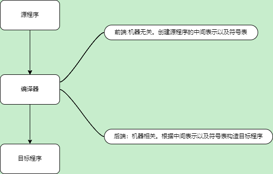
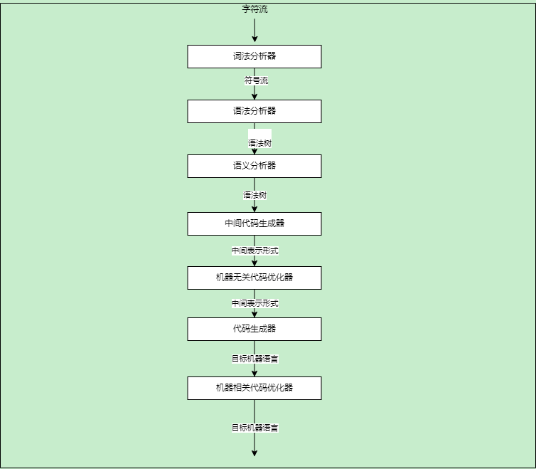
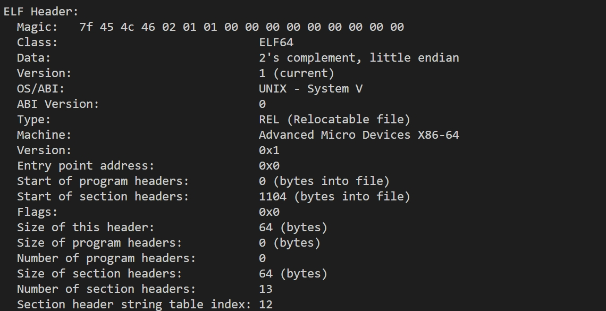
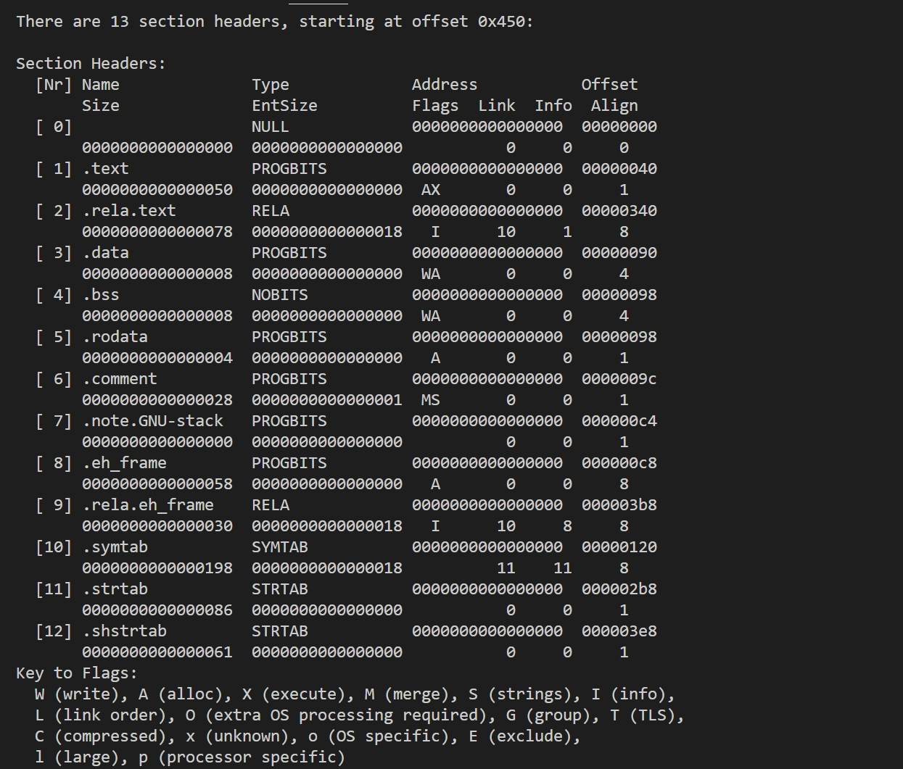

# 源代码到可执行文件


包含内容
-  [1 编译](#c1)
    - [编译流程](#c1-1)
    - [GCC 编译实例](#c1-2)
-  [2 ELF文件](#c2)
    - [ELF文件结构](#c2-1)
      - [链接视角](#c2-1-1)
      - [运行视角](#c2-1-2)
-  [3 静态链接](#c3)
-  [4 静态链接](#c4)
</br></br></br></br>
<div id=c1><h2>编译原理</h2></div>


编译器功能主体如下图:



<div id=c1-1><h3>编译流程</h3></div>
其中编译基本步骤如下图:



1. 这边先读取源程序的`字符流`，编译器根据代码生成词素(lexeme),这里的词素就是代码中最小单位，不能继续分割 。举个例子:
    ```c
    a = b+c*60;
    ``` 
    这里生成的词素就是`a`, `=`, `b`, `+`, `c`, `*`,`60`,`;`.其中主要分为`保留字`,`标识符`,`常数`,`运算符`,`界符`。这里`界符`就是类似空白符，分号，括号等.然后根据这些词素会生成token表.比如`<id1,position>, <op1, =>`等。这些`id1`和`op1` 是一个示例 具体看实现。比如标识符的生成规则以及部分运算符定义。特别是标识符这边比如通过类似字母+数字的格式 也可以区分不同作用域的同名标识符。

2. 生成token也就是符号流之后会进行语法分析创建语法树
3. 然后根据符号表以及语法树判断是否符合语言规范并且收集类型想信息供后面作类型转换优化等。
4. 接下里就是生成对应语言的中间代码表示 例如三地址码。
5. 对中间代码进行优化
6. 根据优化后的代码根据目标机器生成对应的机器语言并优化。

这里提下三地址码：是一种常见的中间语言，类似汇编语言。每个指令组多存在三个操作数 所以成为三地址码。简单举个例子 `x=a op b` 这里就是最多的三个操作数a,b,和结果x.当然还有类似`x=y`的2操作数，`if x rop y goto l`则是如果`x relationop y` 则跳转l或者`call x,n`的形式，这里就是调用x过程，n为参数个数。三地址码可以通过四元式来表示(运算符,操作数1,操作数2,结果)。其中不足的用下划线表示。比如`(call,x,n,_)`.


<div id=c1-2><h3>GCC 编译实例</h3></div>


gcc编译主要分为 `预处理`,`编译` `汇编` `连接`四个主要步骤。

`预处理`这里通过`gcc hello.c -o hello -save-temps --verbose`保留中间文件并且打印详细信息。其中核心三条信息:
- `/usr/lib/gcc/x86_64-linux-gnu/10/cc1 -fpreprocessed hello.i ...(略过) -o hello.s` 这里通过`cc1`编译器实现了预处理以及编译两个步骤生成`hello.s`编译文件。其中还有个中间文件`hello.i`这是预处理后的文件。说明见`code/base/hello_test/hello.c`.

简单说明如下:

- 头文件展开：将源代码中以#include开头的行替换为对应的头文件内容。
- 宏替换：将源代码中以#define开头的行所定义的宏进行替换。
- 条件编译处理：根据源代码中以#if、#ifdef、#ifndef等开头的行对代码块进行条件编译处理。
- 注释处理：将源代码中的注释删除。
- 添加行号和文件名标识?

`编译` gcc我这边是17 默认AT&T汇编语法

`汇编`: `as -v --64 -o hello.o hello.s` `as`工具 根据机器指令和汇编代码对照表生成目标文件.此时还没有链接 因为虚拟地址未定。可以objdump查看

`链接`: ` /usr/lib/gcc/x86_64-linux-gnu/10/collect2 -plugin ...(略过) -o hello`。`collect2`命令。分为静态链接和动态链接两种。默认动态链接。这边包括地址和空间分配，符号绑定和重定位等操作。也即是分配虚拟地址以及对应页基址(分页内存管理下)。

<div id=c2><h2>ELF文件</h2></div>

elf（executable and linkable file）文件是linux下的运行文件格式。相关定义在`usr/include/elf.h`中。

elf分为四种文件：

- 可执行文件(.exec): 经过链接的可执行的目标文件。
- 可重定位文件(.rel): 经过预处理编译以及汇编三个阶段但是没有链接的目标文件。通常`.o`为扩展名。可以和其他目标文件链接构成可执行文件或者动态链接库。通常是一段位置独立的代码。`gcc -c`就是编译汇编但是不链接
- 共享目标文件(.dyn): `gcc -c -fPIC elfDemo.c -o elfDemo_pic.rel && gcc -shared elfDemo_pic.rel -o elfDemo.dyn`。动态链接库文件。可以和其他动态链接库文件或者可重定位文件构建可执行文件，也可以在其他可执行文件加载时链接到进程中作为运行代码的一部分。
- 核心转储文件(Core Dump file):进程意外终止时进程地址空间的转储。

<div id=c2-1><h3>ELF文件结构</h3></div>


这里有个两个视角:




<div id=c2-1-1><h4>链接视角</h4></div>

链接视角通过节 section 来划分。ELF通常都会包含3个固定的节:

- .text: 代码节。保存可执行文件的机器指令
- .data: 数据节。保存已经初始化的全局变量(包含静态变量)和局部静态变量
- .bss:  BSS节。保存未初始化的全局变量和局部静态变量

 一般指令节对京城讲是只读的。数据段是读写的。


简化版本的结构:

| ELF File       |
| :------------- |
| file header    |
| .text  section |
| .data  section |
| .bss   section |

除了上面三个节外，还有个文件头。位于elf文件的最开始的位置。开头是一个固定标识: `7f 45 4c 46` 也就是`\177ELF`(\177 是DEL的8进制) 然后是文件的相关信息。比如文件类型 版本/ABI版本 目标机器 程序入口 段表和节表的位置和长度等。

`readelf -h elfDemo.rel`




结构代码如下:

```c
typedef struct {  
    unsigned char e_ident[EI_NIDENT]; /* 文件标识和类型 */  
    Elf64_Half e_type;                /* 文件类型 */  
    Elf64_Half e_machine;             /* 目标文件体系类型 */  
    Elf64_Word e_version;             /* 文件版本 */  
    Elf64_Addr e_entry;               /* 入口点虚拟地址 */  
    Elf64_Off e_phoff;                /* 程序头部表偏移 */  
    Elf64_Off e_shoff;                /* 节区头部表偏移 */  
    Elf64_Word e_flags;               /* 处理器特定标志 */  
    Elf64_Half e_ehsize;              /* ELF 头部大小 */  
    Elf64_Half e_phentsize;           /* 程序头部表项大小 */  
    Elf64_Half e_phnum;               /* 程序头部表项数量 */  
    Elf64_Half e_shentsize;           /* 节区头部表项大小 */  
    Elf64_Half e_shnum;               /* 节区头部表项数量 */  
    Elf64_Half e_shstrndx;            /* 包含节名称的字符串表的索引 */  
} Elf64_Ehdr;
```

这边大部分可以直接看懂，最后一个`e_shstrndx`是`shstrtab`在节表中的索引号。比如这边就是12.然后`.shstrtab`仅仅是一个字符串数组，里面仅仅是空字符和字符串(section_name).

下面时`elfDemo.rel`中读取`section header table`的实例:


`readelf -S elfDemo.rel`




可以看到`offset`时`0x450` 也就是`1104` 和上图中的`start of section headers`一致。`13`和`numbers of section headers` 一致。


然后就是`section header table`中每个`entry`的结构

```c
typedef struct {  
    Elf64_Word  sh_name;       /* Section name (string tbl index) */  
    Elf64_Word  sh_type;       /* Section type */  
    Elf64_Xword sh_flags;      /* Section flags */  
    Elf64_Addr  sh_addr;       /* Section virtual addr at execution */  
    Elf64_Off   sh_offset;     /* Section file offset */  
    Elf64_Xword sh_size;       /* Section size in bytes */  
    Elf64_Word  sh_link;       /* Link to another section */  
    Elf64_Word  sh_info;       /* Additional section information */  
    Elf64_Xword sh_addralign;  /* Section alignment */  
    Elf64_Xword sh_entsize;    /* Entry size if section holds table */  
} Elf64_Shdr;
```

这边举例看下`.text`部分


| Name  | Type     | Address          | Offset   | Size             | EntSize          | Flags | Link | Info | Align |
| :---- | :------- | :--------------- | :------- | :--------------- | :--------------- | :---- | :--- | :--- | :---- |
| .text | PROGBITS | 0000000000000000 | 00000040 | 0000000000000050 | 0000000000000000 | AX    | 0    | 0    | 1     |

说明大概就是.text section。类型是`PROGBITS`代表程序的相关信息。还有比如`NULL`表示该节不使用 `STRTAB`表示节区包含字符串表，用于存储符号名和其他字符串等。

因为没有经过链接，所以address都是0.然后offset实际就是该段的长度。这边是`0x50` 类型是`AX`则是可以执行(X)并且节区的内容会被加载到内存中(A)。

这边发现`objdump`指令无法读取部分section 还是可以通过`readelf -p index/section_name elf_name`来实现。这边部分隐士创建的比如`.got`等节区可能无法在`shstrtab`中找到。

`readelf -p .shstrtab elfDemo.rel`

```
String dump of section '.shstrtab':
  [     1]  .symtab
  [     9]  .strtab
  [    11]  .shstrtab
  [    1b]  .rela.text
  [    26]  .data
  [    2c]  .bss
  [    31]  .rodata
  [    39]  .comment
  [    42]  .note.GNU-stack
  [    52]  .rela.eh_frame
```

这边`objdump -x -s -d elfDemo.rel` 中的选项分别代表是显示文件的头部信息，展示所有section的内容 以及disassemble展示可执行section的汇编内容。

我们先`objdump -s -j .text -d elfDemo.rel`查看`.text`部分的内容。

```
elfDemo.rel:     file format elf64-x86-64

Contents of section .text:
 0000 554889e5 4883ec10 897dfc8b 45fc89c6  UH..H....}..E...
 0010 488d3d00 000000b8 00000000 e8000000  H.=.............
 0020 0090c9c3 554889e5 4883ec10 c745fc1e  ....UH..H....E..
 0030 0000008b 15000000 008b45fc 01c28b05  ..........E.....
 0040 00000000 01d089c7 e8000000 0090c9c3  ................

Disassembly of section .text:

0000000000000000 <func>:
   0:   55                      push   %rbp
   1:   48 89 e5                mov    %rsp,%rbp
   4:   48 83 ec 10             sub    $0x10,%rsp
   8:   89 7d fc                mov    %edi,-0x4(%rbp)
   b:   8b 45 fc                mov    -0x4(%rbp),%eax
   e:   89 c6                   mov    %eax,%esi
  10:   48 8d 3d 00 00 00 00    lea    0x0(%rip),%rdi        # 17 <func+0x17>
  17:   b8 00 00 00 00          mov    $0x0,%eax
  1c:   e8 00 00 00 00          callq  21 <func+0x21>
  21:   90                      nop
  22:   c9                      leaveq
  23:   c3                      retq

0000000000000024 <main>:
  24:   55                      push   %rbp
  25:   48 89 e5                mov    %rsp,%rbp
  28:   48 83 ec 10             sub    $0x10,%rsp
  2c:   c7 45 fc 1e 00 00 00    movl   $0x1e,-0x4(%rbp)
  33:   8b 15 00 00 00 00       mov    0x0(%rip),%edx        # 39 <main+0x15>
  39:   8b 45 fc                mov    -0x4(%rbp),%eax
  3c:   01 c2                   add    %eax,%edx
  3e:   8b 05 00 00 00 00       mov    0x0(%rip),%eax        # 44 <main+0x20>
  44:   01 d0                   add    %edx,%eax
  46:   89 c7                   mov    %eax,%edi
  48:   e8 00 00 00 00          callq  4d <main+0x29>
  4d:   90                      nop
  4e:   c9                      leaveq
  4f:   c3                      retq 
```

`content`部分就是实际内容。对应的size是`50`.接下去的则是汇编部分。

同理下面是`.data`

```
elfDemo.rel:     file format elf64-x86-64

Contents of section .data:
 0000 0a000000 14000000                    ........        

Disassembly of section .data:

0000000000000000 <global_init_var>:
   0:   0a 00 00 00                                         ....

0000000000000004 <local_static_init_var.1>:
   4:   14 00 00 00                                         ....
```

其中保存初始化过的全局变量和局部静态变量`global_init_var`和`local_static_init_var`。值是`0a000000`和`14000000`对应代码中的`10`和`20`（小端序） 这里每个变量四个字节。返回

然后是`.rodata`只读部分


```
Contents of section .rodata:
 0000 25640a00                             %d..

Disassembly of section .rodata:

0000000000000000 <.rodata>:
   0:   25                      .byte 0x25
   1:   64 0a 00                or     %fs:(%rax),%al 
```

这边只读的部分是`printf`中的格式化字符串`%d\n` `25640a` 是对应的ascii16进制

然后是`.bss`部分

```
Disassembly of section .bss:

0000000000000000 <global_uninit_var>:
   0:   00 00 00 00                                         ....

0000000000000004 <local_static_uninit_var.0>:
   4:   00 00 00 00    
```

保存的是未初始化的全局变量和局部静态变量。因为未初始化，所有没有实际的content部分。

这边全局变量和局部静态变量是跟随程序生命周期的。由编译器负责分配以及释放。所以这边可以看到。局部变量则是在栈上。调用的时候才会分配。

下面是`.strtab` section的说明


```
Hex dump of section '.strtab':
  0x00000000 00656c66 44656d6f 2e63006c 6f63616c .elfDemo.c.local
  0x00000010 5f737461 7469635f 696e6974 5f766172 _static_init_var
  0x00000020 2e31006c 6f63616c 5f737461 7469635f .1.local_static_
  0x00000030 756e696e 69745f76 61722e30 00676c6f uninit_var.0.glo
  0x00000040 62616c5f 696e6974 5f766172 00676c6f bal_init_var.glo
  0x00000050 62616c5f 756e696e 69745f76 61720066 bal_uninit_var.f
  0x00000060 756e6300 5f474c4f 42414c5f 4f464653 unc._GLOBAL_OFFS
  0x00000070 45545f54 41424c45 5f007072 696e7466 ET_TABLE_.printf
  0x00000080 006d6169 6e00                       .main.
```
字符串以null作为开始和结尾。中间则是实际内容。引用字符串的时候给出offset即可。它通常包含了字符串常量，如函数名、变量名等.主要是下面两类。

1. 符号表中的字符串： 在符号表（.symtab）中，存储了与代码相关的符号信息，例如函数名、变量名等。这些符号表项通常包含对 .strtab 节的偏移量，以指向字符串表中对应的字符串。

2. 动态链接时需要的字符串： 在动态链接过程中，一些字符串用于标识库、函数或变量的名称，这些字符串也会存储在 .strtab 节中。

然后就是提到的符号表.`.symtab`.他还有个子集:`dynsym`.就和命名一样。一般静态链接使用`symtab`然后动态链接使用`dynsym`.

`readelf -s elfDemo.rel`

```
Symbol table '.symtab' contains 17 entries:
   Num:    Value          Size Type    Bind   Vis      Ndx Name
     0: 0000000000000000     0 NOTYPE  LOCAL  DEFAULT  UND
     1: 0000000000000000     0 FILE    LOCAL  DEFAULT  ABS elfDemo.c
     2: 0000000000000000     0 SECTION LOCAL  DEFAULT    1
     3: 0000000000000000     0 SECTION LOCAL  DEFAULT    3
     4: 0000000000000000     0 SECTION LOCAL  DEFAULT    4
     5: 0000000000000000     0 SECTION LOCAL  DEFAULT    5
     6: 0000000000000004     4 OBJECT  LOCAL  DEFAULT    3 local_static_ini[...]
     7: 0000000000000004     4 OBJECT  LOCAL  DEFAULT    4 local_static_uni[...]
     8: 0000000000000000     0 SECTION LOCAL  DEFAULT    7
     9: 0000000000000000     0 SECTION LOCAL  DEFAULT    8
    10: 0000000000000000     0 SECTION LOCAL  DEFAULT    6
    11: 0000000000000000     4 OBJECT  GLOBAL DEFAULT    3 global_init_var
    12: 0000000000000000     4 OBJECT  GLOBAL DEFAULT    4 global_uninit_var
    13: 0000000000000000    36 FUNC    GLOBAL DEFAULT    1 func
    14: 0000000000000000     0 NOTYPE  GLOBAL DEFAULT  UND _GLOBAL_OFFSET_TABLE_
    15: 0000000000000000     0 NOTYPE  GLOBAL DEFAULT  UND printf
    16: 0000000000000024    44 FUNC    GLOBAL DEFAULT    1 main
```


`readelf -x .symtab elfDemo.rel`


```
Hex dump of section '.symtab':
  0x00000000 00000000 00000000 00000000 00000000 ................
  0x00000010 00000000 00000000 01000000 0400f1ff ................
  0x00000020 00000000 00000000 00000000 00000000 ................
  0x00000030 00000000 03000100 00000000 00000000 ................
  0x00000040 00000000 00000000 00000000 03000300 ................
  0x00000050 00000000 00000000 00000000 00000000 ................
  0x00000060 00000000 03000400 00000000 00000000 ................
  0x00000070 00000000 00000000 00000000 03000500 ................
  0x00000080 00000000 00000000 00000000 00000000 ................
  0x00000090 0b000000 01000300 04000000 00000000 ................
  0x000000a0 04000000 00000000 23000000 01000400 ........#.......
  0x000000b0 04000000 00000000 04000000 00000000 ................
  0x000000c0 00000000 03000700 00000000 00000000 ................
  0x000000d0 00000000 00000000 00000000 03000800 ................
  0x000000e0 00000000 00000000 00000000 00000000 ................
  0x000000f0 00000000 03000600 00000000 00000000 ................
  0x00000100 00000000 00000000 3d000000 11000300 ........=.......
  0x00000110 00000000 00000000 04000000 00000000 ................
  0x00000120 4d000000 11000400 00000000 00000000 M...............
  0x00000130 04000000 00000000 5f000000 12000100 ........_.......
  0x00000140 00000000 00000000 24000000 00000000 ........$.......
  0x00000150 64000000 10000000 00000000 00000000 d...............
  0x00000160 00000000 00000000 7a000000 10000000 ........z.......
  0x00000170 00000000 00000000 00000000 00000000 ................
  0x00000180 81000000 12000100 24000000 00000000 ........$.......
  0x00000190 2c000000 00000000                   ,.......
```

这边通过`readelf -S your_object_file`中看到`symtab`的`EntSize`看到是`18h`也就是24字节。这边自己解释一个entry

结构如下:

```C
// 这里字节的标注需要参考section header中`entSize`以及实际情况 这里已经读取24了
typedef struct {
    Elf64_Word      st_name;  // 符号名在字符串表的偏移量  4 
    unsigned char   st_info;  // 符号的类型和绑定信息     1
    unsigned char   st_other; // 保留字段                1
    Elf64_Section   st_shndx; // 符号所在的节的索引       2 
    Elf64_Addr      st_value; // 符号的值（地址）         8
    Elf64_Xword     st_size;  // 符号的大小(字节)               8
} Elf64_Sym;

```

这边addr等一般是虚拟地址现在。


```
以下是一些可能的 Type 和 Bind 的取值：
Type（符号类型）：

STT_NOTYPE（0x0）：无类型。
STT_OBJECT（0x1）：对象。
STT_FUNC（0x2）：函数。
STT_SECTION（0x3）：节。
STT_FILE（0x4）：文件。
等等，具体的类型取值可以在 ELF 规范中查找。

Bind（符号绑定信息）：

STB_LOCAL（0x0）：局部符号，只在当前目标文件或共享库中可见。
STB_GLOBAL（0x1）：全局符号，对于多个目标文件和共享库可见。
STB_WEAK（0x2）：弱符号，对于多个目标文件和共享库可见，但其定义可能被覆盖。
```


`01000000 0400f1ff 00000000 00000000 00000000 00000000` 因为index 0 是没有意义的。所以解释下01，小端序。然后st_name在前面。也就是按照顺序排。

`st_name`: `01000000` 实际是`00000001` 那么通过`strtab`中从1开始读取读到null则是`elfDemo.c`

`st_info`:`04` 同样小端序 低四位是bind 高4bit是符号类型.这里也就是说局部以及文件。也就是`lcoal` 和`file` 和上图的一致

`st_other`:保留字段 1字节`00`跳过。

`st_shndx`:符号所在节的索引。`f1ff`就是`0xfff1`这是一个保留值。`#define SHN_ABS 0xFFF1` 所以就是`ABS`和读取的信息一致。

`st_value`和`st_size`都是8字节。这边都是0，一致。


然后是重定位部分。重定位是链接符定义和符号引用的过程。可重定位文件在构建可执行文件的时候会将节中的符号引用换成这些符号在进程空间中的虚拟地址。包含这些转换信息的数据就是重定位项。


` readelf -r elfDemo.rel `

```
Relocation section '.rela.text' at offset 0x340 contains 5 entries:
  Offset          Info           Type           Sym. Value    Sym. Name + Addend
000000000013  000500000002 R_X86_64_PC32     0000000000000000 .rodata - 4
00000000001d  000f00000004 R_X86_64_PLT32    0000000000000000 printf - 4
000000000035  000b00000002 R_X86_64_PC32     0000000000000000 global_init_var - 4
000000000040  000300000002 R_X86_64_PC32     0000000000000000 .data + 0
000000000049  000d00000004 R_X86_64_PLT32    0000000000000000 func - 4

Relocation section '.rela.eh_frame' at offset 0x3b8 contains 2 entries:
  Offset          Info           Type           Sym. Value    Sym. Name + Addend
000000000020  000200000002 R_X86_64_PC32     0000000000000000 .text + 0
000000000040  000200000002 R_X86_64_PC32     0000000000000000 .text + 24
```


结构如下:

```C
typedef struct {
    Elf64_Addr r_offset; // 符号需要被重定位的位置
    Elf64_Xword r_info;  // 保存着与重定位相关的信息，包括符号索引和重定位类型
} Elf64_Rel;

其中：

r_offset 字段表示需要被重定位的位置，即需要进行地址调整的位置。
r_info   字段保存着与重定位相关的信息，包括符号索引和重定位类型。
r_info   字段中的信息一般使用宏进行提取：

ELF64_R_SYM(info)：提取符号索引。
ELF64_R_TYPE(info)：提取重定位类型。
其中高 32 位用于存储符号索引，低 32 位用于存储重定位类型。

Elf64_Rel 结构体的大小为 16 字节（8 字节 r_offset + 8 字节 r_info）。

typedef struct {
    Elf64_Addr r_offset; // 符号需要被重定位的位置
    Elf64_Xword r_info;  // 保存着与重定位相关的信息，包括符号索引和重定位类型
    Elf64_Sxword r_addend; // 常数值，用于与符号值相加，得到最终的重定位值
} Elf64_Rela;


其中：

r_offset 字段表示需要被重定位的位置，即需要进行地址调整的位置。
r_info   字段保存着与重定位相关的信息，包括符号索引和重定位类型。
r_addend 字段是一个带符号整数，用于与符号的值相加，得到最终的重定位值。
r_info   字段中的信息可以使用宏进行提取：

ELF64_R_SYM(info)：提取符号索引。
ELF64_R_TYPE(info)：提取重定位类型。

Elf64_Rela 结构体的大小为 24 字节（8 字节 r_offset + 8 字节 r_info + 8 字节 r_addend）。
```

这里简单说明下。其中`info`包含`symbol`和`type`。`symbol`是符号索引(index 不是byte偏移)。举个例子 `global_init_var` 的info是`000b00000002`然后高32bit是`000b`(这边没有-x所以这边已经小端序转换过了.).那么对应`symtab`中就index `11` 是 `global_init_var`.和`.symbol` 一致。`type`可以表示重定位地址是相对地址还是绝对地址重定位的精确方式。


<div id=c2-1-2><h4>运行视角</h4></div>

`readelf -l elfDemo.exec`

```
Elf file type is DYN (Shared object file)
Entry point 0x1050
There are 11 program headers, starting at offset 64

Program Headers:
  Type           Offset             VirtAddr           PhysAddr
                 FileSiz            MemSiz              Flags  Align
  PHDR           0x0000000000000040 0x0000000000000040 0x0000000000000040
                 0x0000000000000268 0x0000000000000268  R      0x8
  INTERP         0x00000000000002a8 0x00000000000002a8 0x00000000000002a8
                 0x000000000000001c 0x000000000000001c  R      0x1
      [Requesting program interpreter: /lib64/ld-linux-x86-64.so.2]
  LOAD           0x0000000000000000 0x0000000000000000 0x0000000000000000
                 0x0000000000000568 0x0000000000000568  R      0x1000
  LOAD           0x0000000000001000 0x0000000000001000 0x0000000000001000
                 0x00000000000001fd 0x00000000000001fd  R E    0x1000
  LOAD           0x0000000000002000 0x0000000000002000 0x0000000000002000
                 0x0000000000000178 0x0000000000000178  R      0x1000
  LOAD           0x0000000000002de8 0x0000000000003de8 0x0000000000003de8
                 0x0000000000000250 0x0000000000000260  RW     0x1000
  DYNAMIC        0x0000000000002df8 0x0000000000003df8 0x0000000000003df8
                 0x00000000000001e0 0x00000000000001e0  RW     0x8
  NOTE           0x00000000000002c4 0x00000000000002c4 0x00000000000002c4
                 0x0000000000000044 0x0000000000000044  R      0x4
  GNU_EH_FRAME   0x0000000000002008 0x0000000000002008 0x0000000000002008
                 0x0000000000000044 0x0000000000000044  R      0x4
  GNU_STACK      0x0000000000000000 0x0000000000000000 0x0000000000000000
                 0x0000000000000000 0x0000000000000000  RW     0x10
  GNU_RELRO      0x0000000000002de8 0x0000000000003de8 0x0000000000003de8
                 0x0000000000000218 0x0000000000000218  R      0x1

 Section to Segment mapping:
  Segment Sections...
   00
   01     .interp
   02     .interp .note.gnu.build-id .note.ABI-tag .gnu.hash .dynsym .dynstr .gnu.version .gnu.version_r .rela.dyn .rela.plt
   03     .init .plt .plt.got .text .fini
   04     .rodata .eh_frame_hdr .eh_frame
   05     .init_array .fini_array .dynamic .got .got.plt .data .bss 
   06     .dynamic
   07     .note.gnu.build-id .note.ABI-tag
   08     .eh_frame_hdr
   09
   10     .init_array .fini_array .dynamic .got
```

这边参考一开始的图形。就是会将section进行分组，一般是按照读写执行权限分组的。这样可以节约资源。可执行程序通常至少有一个`PT_LOAD` segment.就是上图的`LOAD`.动态链接的可执行文件可能有多个。讲`.data`和`.text`分开存放。`PT_DYNAMIC`(也就是上面的DYNAMIC)存放动态链接器必须的信息比如共享库列表GOT表和重定位表等。`PT_NOTE`保存系统相关的附加信息。`PT_INTERP`将位置和大小信息存放在一个字符串中。是对程序解释器位置的描述。`PT_PHDR`保存程序头表本身的信息。

```c
typedef struct {
    Elf64_Word   p_type;    // Segment type
    Elf64_Word   p_flags;   // Segment flags
    Elf64_Off    p_offset;  // Segment file offset
    Elf64_Addr   p_vaddr;   // Segment virtual address
    Elf64_Addr   p_paddr;   // Segment physical address
    Elf64_Xword  p_filesz;  // Segment size in file (byte)
    Elf64_Xword  p_memsz;   // Segment size in memory(byte)
    Elf64_Xword  p_align;   // Segment alignment
} Elf64_Phdr;

```

这边关注虚拟地址即可。物理地址一般是链接的时候确定。如果运行时发生冲突可以通过修改以及转移解决问题。当然通过虚拟地址只需要修改映射更新页表即可。当然可执行文件的运行还需要栈堆vDSO(虚拟动态链接共享库 提供一些系统调用的空间实现)等空间。


<div id=c3><h2>静态链接</h2></div>

`gcc -static -fno-stack-protector .\main.c .\func.c -save-temps --verbose -o ..\target\func.ELF`

这边是静态编译。就是所有库文件都会保存在可执行文件中。
一般会将属性相同的section 合并。比如这里将`func.o`和`main.o`的`.text`合并成一个`.text`等。


为了构建可执行文件，链接器必须要完成两件事:符号解析和重定位。符号解析就是将多个文件中每个符号(函数 全局变量 静态变量)的引用和其定义进行关联。重定位这是将这边每个符号的定义和一个内存地址进行关联。然后修改这些符号的引用 指向这个内存地址(一般是虚拟地址)。

比如ch1/elf中的例子。其中main.o 通过objdump发现其中的vam都是0也就是没有分配地址。但是func.ELF中则是有值的。

```
----objdump -h main.o
main.o:     file format elf64-x86-64

Sections:
Idx Name          Size      VMA               LMA               File off  Algn
  0 .text         00000029  0000000000000000  0000000000000000  00000040  2**0
                  CONTENTS, ALLOC, LOAD, RELOC, READONLY, CODE
  1 .data         00000000  0000000000000000  0000000000000000  00000069  2**0
                  CONTENTS, ALLOC, LOAD, DATA
  2 .bss          00000000  0000000000000000  0000000000000000  00000069  2**0
                  ALLOC
  ....

```

```
-------objdump -h func.ELF 
func.ELF:     file format elf64-x86-64

Sections:
Idx Name          Size      VMA               LMA               File off  Algn
  ...

  5 .text         00085ff0  00000000004010e0  00000000004010e0  000010e0  2**5
                  CONTENTS, ALLOC, LOAD, READONLY, CODE
  
  ...

 18 .data         00001a50  00000000004b30e0  00000000004b30e0  000b20e0  2**5
                  CONTENTS, ALLOC, LOAD, DATA

 22 .bss          000017a0  00000000004b5240  00000000004b5240  000b4230  2**5
                  ALLOC
  
  ....

```
这边只贴了text bss 和 data 部分。

`objdump -d -M intel --section=.text main.o`
 
这边反汇编main.o代码 -m intel表示intel汇编 也就是 op dst,src

```
main.o:     file format elf64-x86-64


Disassembly of section .text:       

0000000000000000 <main>:
   0:   55                      push   rbp
   1:   48 89 e5                mov    rbp,rsp
   4:   48 83 ec 10             sub    rsp,0x10
   8:   c7 45 fc 64 00 00 00    mov    DWORD PTR [rbp-0x4],0x64
   f:   48 8d 45 fc             lea    rax,[rbp-0x4]
  13:   48 8d 35 00 00 00 00    lea    rsi,[rip+0x0]        # 1a <main+0x1a>
  1a:   48 89 c7                mov    rdi,rax
  1d:   e8 00 00 00 00          call   22 <main+0x22>
  22:   b8 00 00 00 00          mov    eax,0x0
  27:   c9                      leave
  28:   c3                      ret
```

这边可以看到 还没重定位。call指令后面是0(这里机器码是相对于下条指令地址计算e8后面的值 也就是offset 0，27h+0 = 27h )  在汇编那就是call 27 就是基于那么就是直接跑到下一条指令mov那边 也刚好是call 27.这边是近调用。还有个参数shared有暂时是0也就是13那儿


`objdump -d -M intel --section=.text func.ELF  | grep -A 14 "<main>"`
这边反编译并找到<main>以及后面14行 

```
0000000000401c2d <main>:
  401c2d:       55                      push   rbp
  401c2e:       48 89 e5                mov    rbp,rsp
  401c31:       48 83 ec 10             sub    rsp,0x10
  401c35:       c7 45 fc 64 00 00 00    mov    DWORD PTR [rbp-0x4],0x64
  401c3c:       48 8d 45 fc             lea    rax,[rbp-0x4]
  401c40:       48 8d 35 a9 04 0b 00    lea    rsi,[rip+0xb04a9]        # 4b20f0 <shared>
  401c47:       48 89 c7                mov    rdi,rax
  401c4a:       e8 07 00 00 00          call   401c56 <func>
  401c4f:       b8 00 00 00 00          mov    eax,0x0
  401c54:       c9                      leave
  401c55:       c3                      ret

0000000000401c56 <func>:
  401c56:       55                      push   rbp
```

这边已将将call替换为func的实际地址了。机器码那边的偏移也是到<func>.shared也是。见下面:

```
--- readelf -s func.ELF | grep shared
00000000004b20f0     4 OBJECT  GLOBAL DEFAULT   19 shared
```

这边看下重定位表。可重定位文件中最重要的部分。告诉链接器如何修改节的内容。`R_X86_64_PC32`是基于`pc`的相对地址
`R_X86_64_PLT32`则是基于`PLT`的相对地址。这边`0x0000000000000004`是r_addend的值用来修正

`PLT`过程链接表 实现延迟绑定，也就是调用的时候才进行函数绑定。


```
-----objdump -r main.o

main.o:     file format elf64-x86-64

RELOCATION RECORDS FOR [.text]:
OFFSET           TYPE              VALUE
0000000000000016 R_X86_64_PC32     shared-0x0000000000000004
000000000000001e R_X86_64_PLT32    func-0x0000000000000004


RELOCATION RECORDS FOR [.eh_frame]:
OFFSET           TYPE              VALUE
0000000000000020 R_X86_64_PC32     .text
```


这边时延迟绑定。需要运行的时候看。

<div id=c4><h2>动态链接</h2></div>

因为静态链接会把所有的文件都打包进去。比如两个elf都依赖公共的c，那么静态链接出来的elf都会包含c。运行的时候就会加载两个c。造成内存的浪费 。


```shell
 gcc -shared -fpic -o func.so ../code/func.c  #  fpic生成位置无关的代码
 gcc -fno-stack-protector -o func.ELF2 ../code/main.c  ./func.so
 ldd func.ELF2 
```

```
linux-vdso.so.1 (0x00007fffcae38000)
./func.so (0x00007fc4e4370000)
libc.so.6 => /lib/x86_64-linux-gnu/libc.so.6 (0x00007fc4e4190000)
/lib64/ld-linux-x86-64.so.2 (0x00007fc4e438c000)

```


```
--- objdump -d -M intel --section=.text func.ELF2  | grep -A 11 "<main>"

0000000000001135 <main>:
    1135:       55                      push   rbp
    1136:       48 89 e5                mov    rbp,rsp
    1139:       48 83 ec 10             sub    rsp,0x10
    113d:       c7 45 fc 64 00 00 00    mov    DWORD PTR [rbp-0x4],0x64
    1144:       48 8d 45 fc             lea    rax,[rbp-0x4]
    1148:       48 8d 35 e1 2e 00 00    lea    rsi,[rip+0x2ee1]        # 4030 <shared>
    114f:       48 89 c7                mov    rdi,rax
    1152:       e8 d9 fe ff ff          call   1030 <func@plt>
    1157:       b8 00 00 00 00          mov    eax,0x0
    115c:       c9                      leave
    115d:       c3                      ret

```

这边就是`<func@plt>`

这边涉及到几个section

`.got` :`global offset table`.位于数据段的开头。保存全局变量和库函数的引用。因为一个程序或者共享库数据段和代码段的相对距离时不变的，指令和变量之间的距离就是一个运行时常量和绝对内存地址无关。这边分为 `.got`和`.got.plt`也就是区分时候需要延迟绑定。前者一般存储全局变量的引用。加载到内存后标记为只读。后者则是保存函数引用。具有读写权限。